# 2026 Food Law (TFCA1402) — Slides (Reflowed)

> **This is the Phase H output.** Only lectures where every slide has been visually reviewed and reformatted with layout + semantic analysis are included below. Lectures still pending review are listed at the end.

> **Module:** MSc Culinary Innovation and Food Product Development
> **Lecturer:** Sheona Foley
> **Semester:** Spring 2026 (28 Jan – 29 Apr)

Each slide section embeds the rendered page image plus a clean markdown rendering of its content (tables, lists, subheadings, definitions) chosen by looking at both the visual layout and the semantic role of each text fragment.

## Table of Contents — Reflowed Lectures

1. **[Lecture 1 — Week 1 (28 January 2026): Introduction to Food Law & EU Institutions](#lecture-1)**  _(slides 1–42, 42 slides)_
2. **[Lecture 2 — Week 2 (4 February 2026): General Principles of Food Law (178/2002), EFSA, FSAI, DG Sante](#lecture-2)**  _(slides 43–124, 82 slides)_
3. **[Lecture 3 — Week 4 (18 February 2026): Food Information to Consumers (FIC) Regulation 1169/2011](#lecture-3)**  _(slides 125–227, 103 slides)_
4. **[Lecture 4 — Week 5 (25 February 2026): Nutrition & Health Claims](#lecture-4)**  _(slides 228–300, 73 slides)_
5. **[Lecture 5 — Week 6 (4 March 2026): Additives, Voluntary Terms (Vegetarian/Vegan/Gluten-Free/Fairtrade/Organic) & Food Fraud Intro](#lecture-5)**  _(slides 301–348, 48 slides)_
6. **[Lecture 6 — Week 8 (18 March 2026): The Hygiene Package & HACCP (Reg 852/2004)](#lecture-6)**  _(slides 349–424, 76 slides)_
7. **[Lecture 7 — Week 9 (25 March 2026): Hygiene Package (cont.) & Foods of Animal Origin (Reg 853/2004)](#lecture-7)**  _(slides 425–478, 54 slides)_
8. **[Lecture 8 — Week 11 (14 April 2026): Revision Lecture 1 of 2](#lecture-8)**  _(slides 479–511, 33 slides)_
9. **[Lecture 9 — Week 11 (22 April 2026): Revision Lecture 2 of 2 (incl. Recap, Exam Info & Closing)](#lecture-9)**  _(slides 512–564, 53 slides)_

---

<a id="lecture-1"></a>

# Lecture 1 — Week 1 (28 January 2026): Introduction to Food Law & EU Institutions

**Topics:** Module overview · syllabus · history of EU food law · EU institutions (Commission, Parliament, Council) · early food law evolution · BSE crisis

**Slides:** 1–42 (42 slides)

## Slide 1

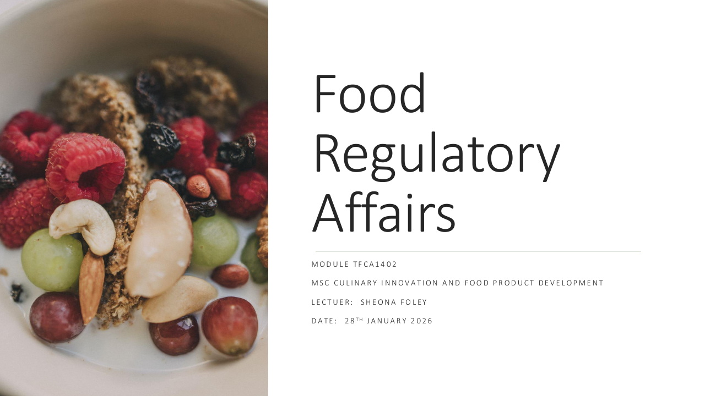

### Food Regulatory Affairs

| | |
|---|---|
| **Module code** | TFCA1402 |
| **Programme** | MSc Culinary Innovation and Food Product Development |
| **Lecturer** | Sheona Foley |
| **Date** | 28th January 2026 |

## Slide 2

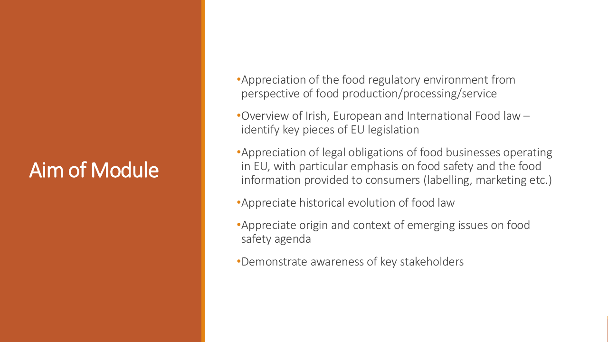

### Aim of Module

- Appreciation of the food regulatory environment from the perspective of food production / processing / service.
- Overview of Irish, European and International Food law — identify key pieces of EU legislation.
- Appreciation of legal obligations of food businesses operating in the EU, with particular emphasis on food safety and the food information provided to consumers (labelling, marketing etc.).
- Appreciate the historical evolution of food law.
- Appreciate the origin and context of emerging issues on the food safety agenda.
- Demonstrate awareness of key stakeholders.

## Slide 3

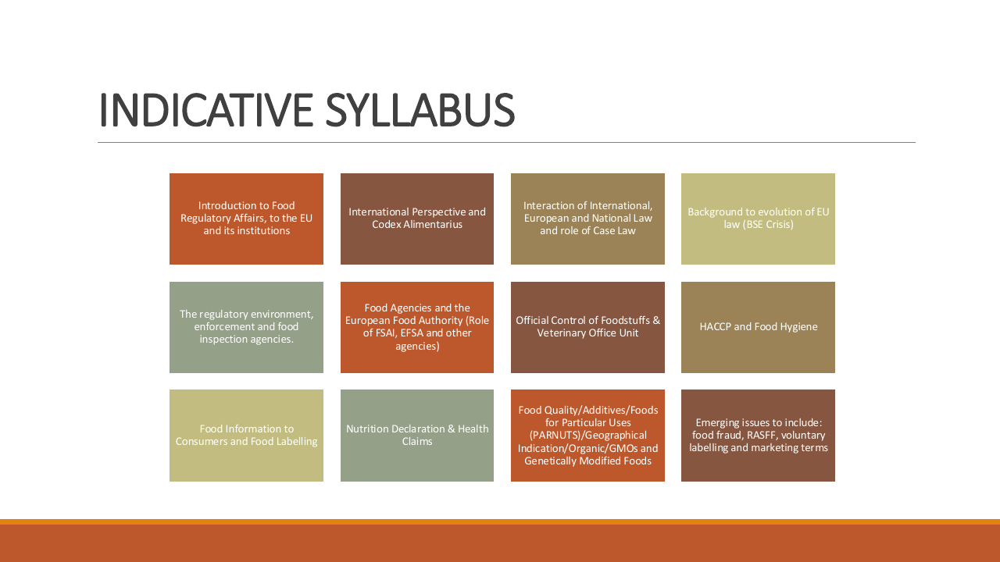

### Indicative Syllabus

1. Introduction to Food Regulatory Affairs, the EU and its institutions
2. International Perspective and Codex Alimentarius
3. Interaction of International, European and National Law and role of Case Law
4. Background to evolution of EU law (BSE Crisis)
5. The regulatory environment, enforcement and food inspection agencies
6. Food Agencies and the European Food Authority (role of FSAI, EFSA and other agencies)
7. Official Control of Foodstuffs & Veterinary Office Unit
8. HACCP and Food Hygiene
9. Food Information to Consumers and Food Labelling
10. Nutrition Declaration & Health Claims
11. Food Quality / Additives / Foods for Particular Uses (PARNUTS) / Geographical Indication / Organic / GMOs and Genetically Modified Foods
12. Emerging issues — food fraud, RASFF, voluntary labelling and marketing terms

## Slide 4

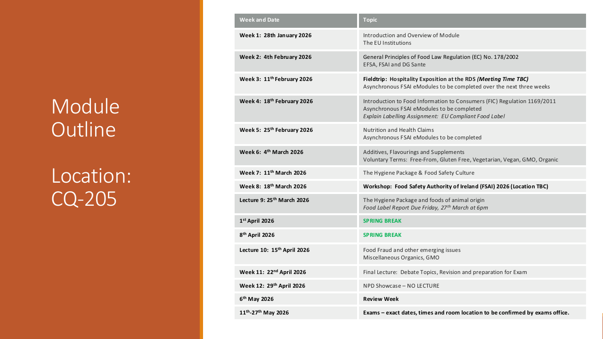

### Module Outline

**Location:** CQ-205

| Week and Date | Topic |
|---|---|
| **Week 1** — 28 January 2026 | Introduction and Overview of Module; The EU Institutions |
| **Week 2** — 4 February 2026 | General Principles of Food Law Reg (EC) 178/2002; EFSA, FSAI, DG Sante |
| **Week 3** — 11 February 2026 | Fieldtrip: Hospitality Exposition at the RDS *(Meeting Time TBC)*; Asynchronous FSAI eModules to be completed over the next three weeks |
| **Week 4** — 18 February 2026 | Introduction to Food Information to Consumers (FIC) Regulation 1169/2011; Asynchronous FSAI eModules; *Explain Labelling Assignment: EU Compliant Food Label* |
| **Week 5** — 25 February 2026 | Nutrition and Health Claims; Asynchronous FSAI eModules |
| **Week 6** — 4 March 2026 | Additives, Flavourings and Supplements; Voluntary Terms: Free-From, Gluten Free, Vegetarian, Vegan, GMO, Organic |
| **Week 7** — 11 March 2026 | *(see slides — week 7 topic continues from week 6)* |
| **Week 8** — 18 March 2026 | The Hygiene Package & Food Safety Culture; Workshop: Food Safety Authority of Ireland (FSAI) 2026 *(Location TBC)* |
| **Lecture 9** — 25 March 2026 | The Hygiene Package and foods of animal origin; *Food Label Report Due Friday, 27 March at 6 pm* |
| 1 April 2026 | **SPRING BREAK** |
| 8 April 2026 | **SPRING BREAK** |
| **Lecture 10** — 15 April 2026 | Food Fraud and other emerging issues; Miscellaneous Organics, GMO |
| **Week 11** — 22 April 2026 | Final Lecture: Debate Topics, Revision and preparation for Exam |
| **Week 12** — 29 April 2026 | NPD Showcase – NO LECTURE |
| 6 May 2026 | Review Week |
| 11–27 May 2026 | Exams — exact dates, times and room location to be confirmed by exams office |

## Slide 5

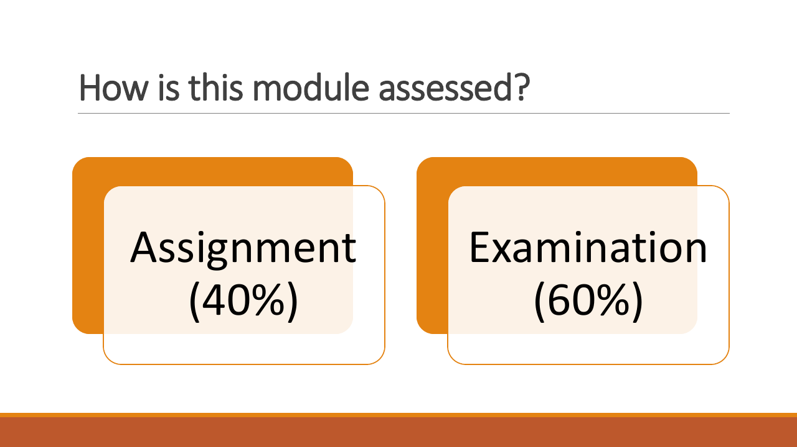

### How is this module assessed?

| Component | Weight |
|---|---|
| Assignment | 40 % |
| Examination | 60 % |

## Slide 6

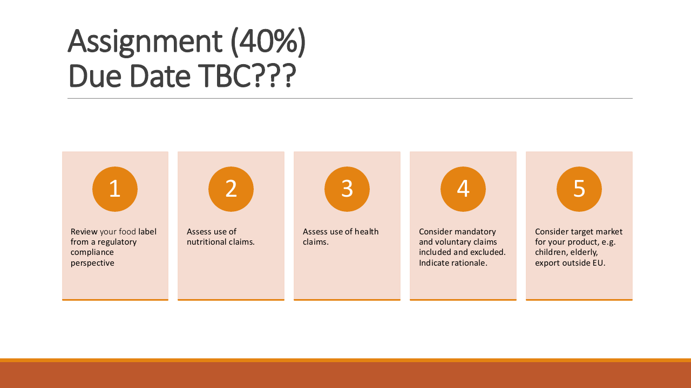

### Assignment (40 %) — *Due Date TBC*

1. Review your food label from a regulatory compliance perspective.
2. Assess use of nutritional claims.
3. Assess use of health claims.
4. Consider mandatory and voluntary claims included and excluded — indicate rationale.
5. Consider target market for your product (e.g. children, elderly, export outside EU).

## Slide 7

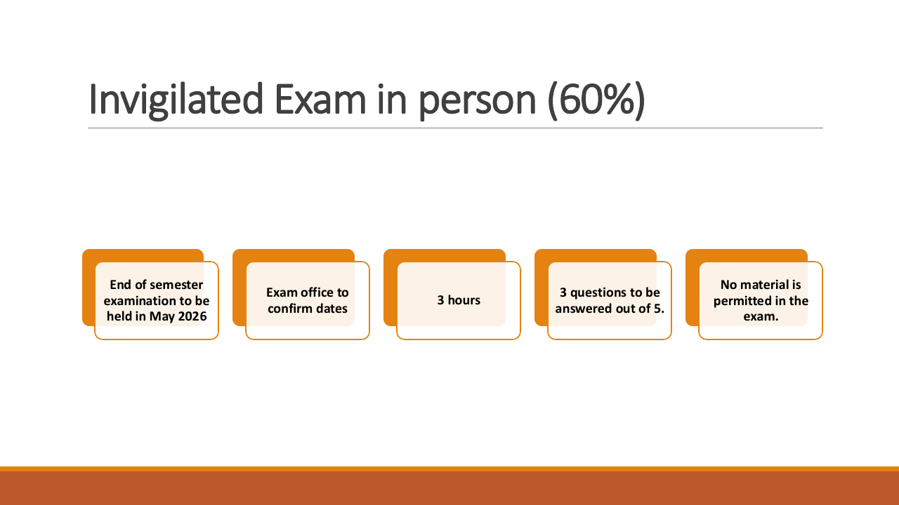

### Invigilated Exam (60 %)

- End-of-semester examination, to be held in May 2026.
- Exam office to confirm exact dates.
- Duration: **3 hours**.
- **3 questions** to be answered out of 5.
- **No material** is permitted in the exam.

## Slide 8

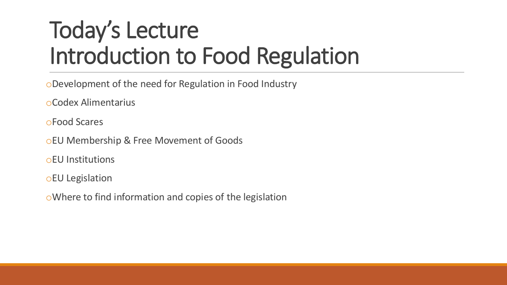

### Today's Lecture — Introduction to Food Regulation

- Development of the need for regulation in the food industry
- Codex Alimentarius
- Food scares
- EU membership & free movement of goods
- EU institutions
- EU legislation
- Where to find information and copies of the legislation

## Slide 9

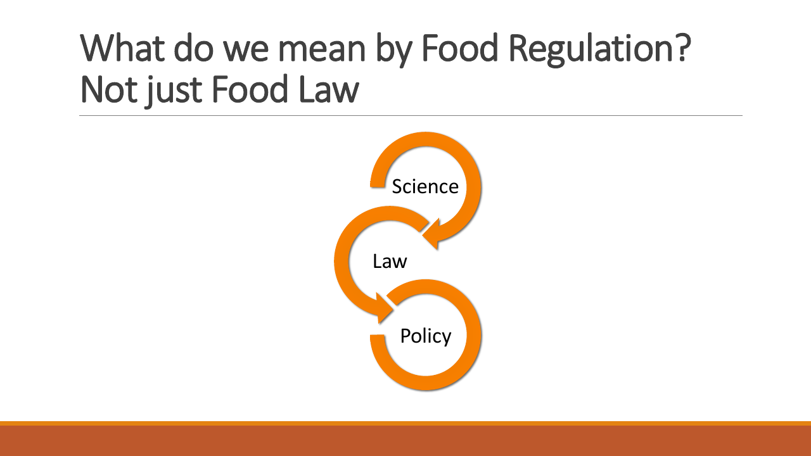

### What do we mean by Food Regulation? — *Not just Food Law*

Food regulation is the intersection of three domains:

- **Science**
- **Law**
- **Policy**

## Slide 10

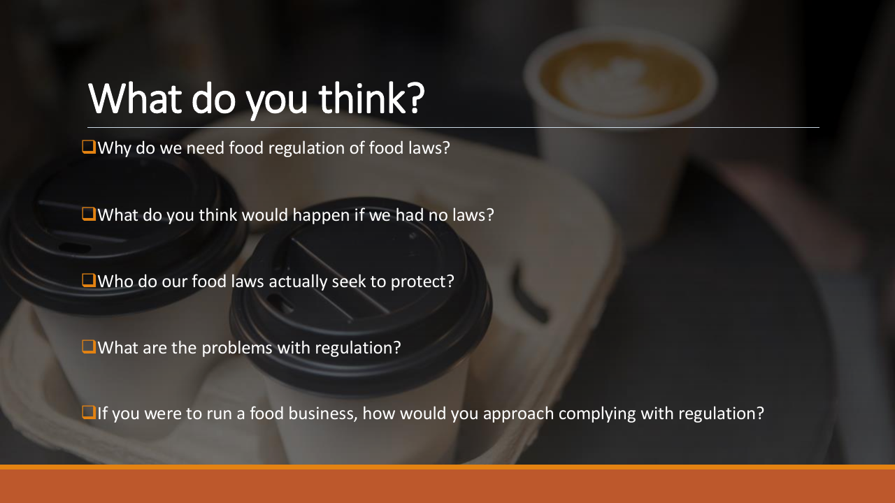

### Discussion — What do you think?

- Why do we need food regulation / food laws?
- What do you think would happen if we had no laws?
- Who do our food laws actually seek to protect?
- What are the problems with regulation?
- If you were to run a food business, how would you approach complying with regulation?

## Slide 11

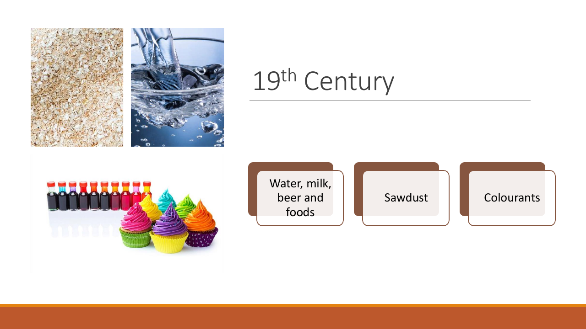

### 19th Century — Early food adulteration

Common adulterants of the period:

- **Water, milk, beer and foods** (dilution / substitution)
- **Sawdust** (used as filler / bulking agent)
- **Colourants** (often toxic, used to disguise quality)

## Slide 12

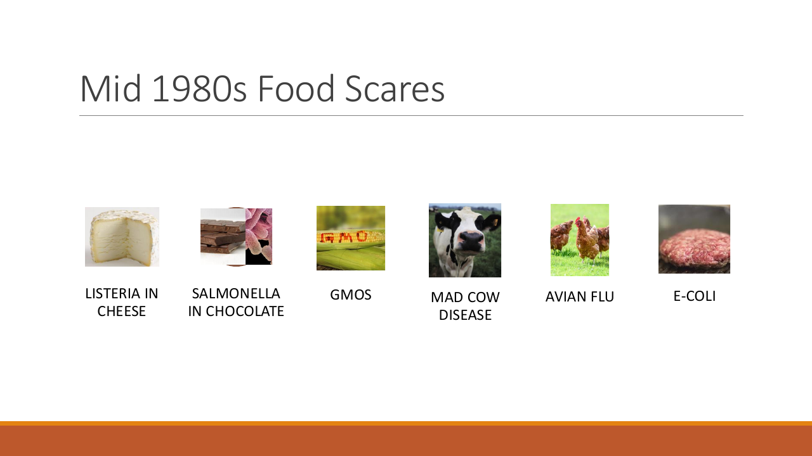

### Mid-1980s Food Scares

- Listeria in cheese
- Salmonella in chocolate
- GMOs
- Mad Cow Disease (BSE)
- Avian Flu
- E-Coli

## Slide 13

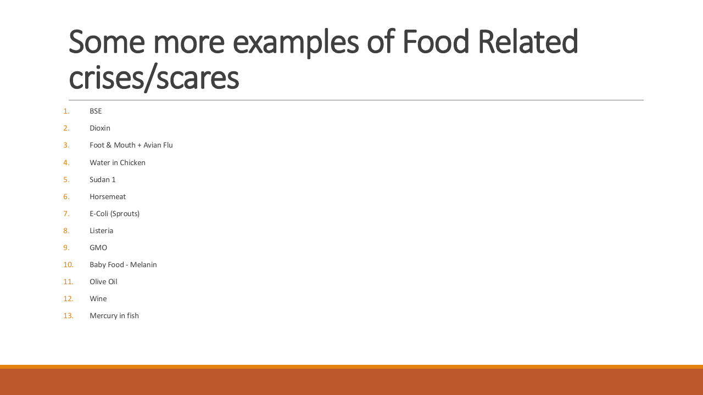

### More examples of food-related crises / scares

1. BSE
2. Dioxin
3. Foot & Mouth + Avian Flu
4. Water in chicken
5. Sudan 1
6. Horsemeat
7. E-Coli (sprouts)
8. Listeria
9. GMO
10. Baby food — melanin
11. Olive oil
12. Wine
13. Mercury in fish

## Slide 14

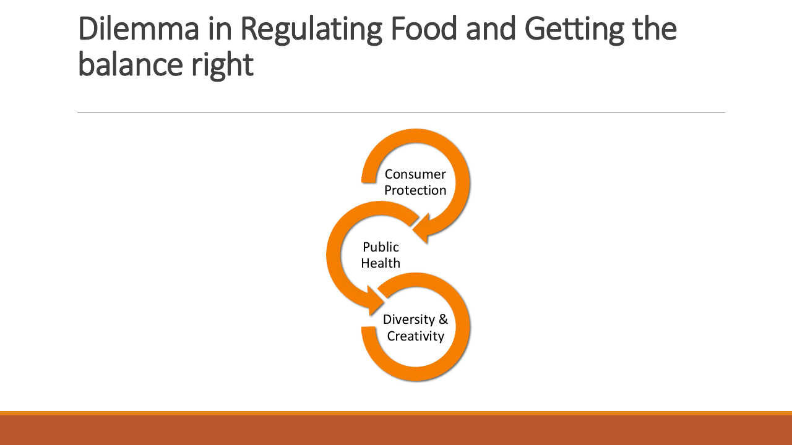

### Dilemma in regulating food — getting the balance right

Food regulation must balance three interlocking priorities:

- **Consumer Protection**
- **Public Health**
- **Diversity & Creativity** (allowing innovation and traditional / artisan production)

## Slide 15

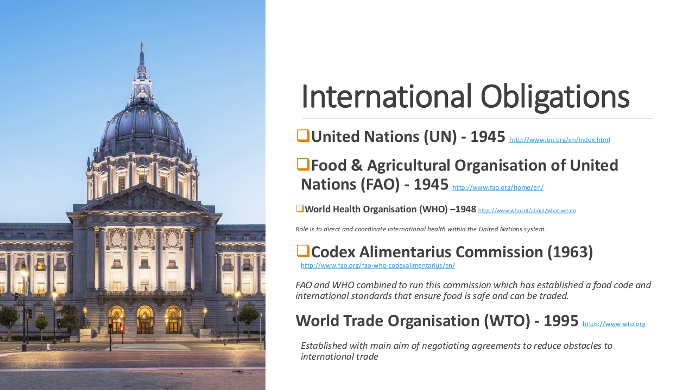

### International Obligations

- **United Nations (UN)** — 1945 — <http://www.un.org/en/index.html>
- **Food & Agricultural Organisation of the United Nations (FAO)** — 1945 — <http://www.fao.org/home/en/>
- **World Health Organisation (WHO)** — 1948 — <https://www.who.int/about/what-we-do>
  *Role: direct and coordinate international health within the United Nations system.*
- **Codex Alimentarius Commission** — 1963 — <http://www.fao.org/fao-who-codexalimentarius/en/>
  *FAO and WHO combined to run this commission, which has established a food code and international standards that ensure food is safe and can be traded.*
- **World Trade Organisation (WTO)** — 1995 — <https://www.wto.org>
  *Established with the main aim of negotiating agreements to reduce obstacles to international trade.*

## Slide 16

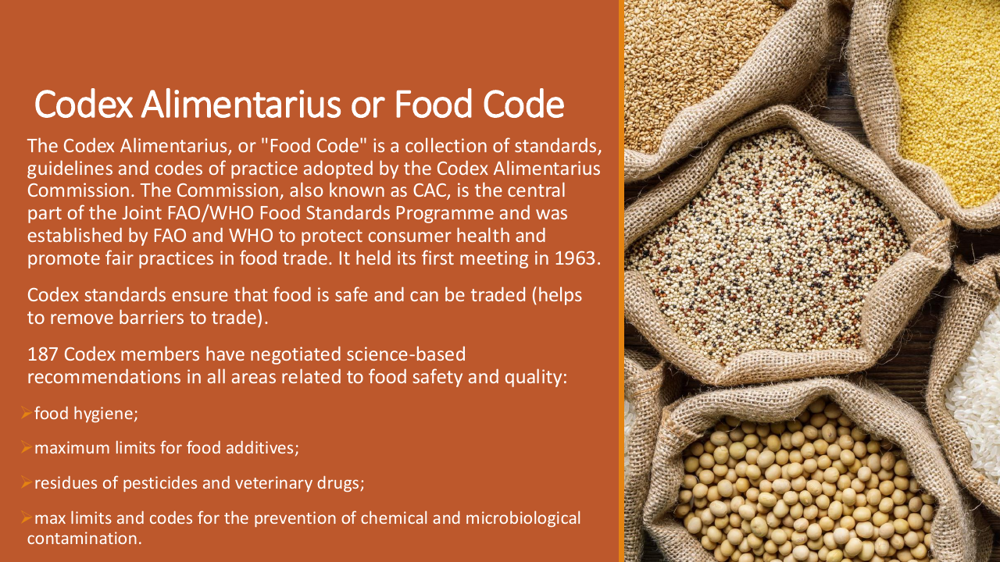

### Codex Alimentarius — the *Food Code*

The Codex Alimentarius, or "Food Code", is a collection of standards, guidelines and codes of practice adopted by the Codex Alimentarius Commission (CAC). The Commission is the central part of the Joint FAO/WHO Food Standards Programme and was established by FAO and WHO to protect consumer health and promote fair practices in food trade. It held its first meeting in **1963**.

Codex standards ensure that food is safe and can be traded — helping to remove barriers to trade.

**187 Codex members** have negotiated science-based recommendations in all areas related to food safety and quality:

- Food hygiene
- Maximum limits for food additives
- Residues of pesticides and veterinary drugs
- Maximum limits and codes for the prevention of chemical and microbiological contamination

## Slide 17

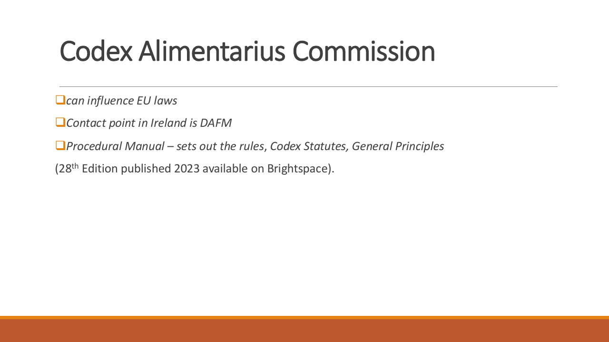

### Codex Alimentarius Commission

- Can influence EU laws
- Contact point in Ireland is **DAFM** (Department of Agriculture, Food and the Marine)
- **Procedural Manual** — sets out the rules, *Codex Statutes*, *General Principles* (28th edition published 2023, available on Brightspace)

## Slide 18

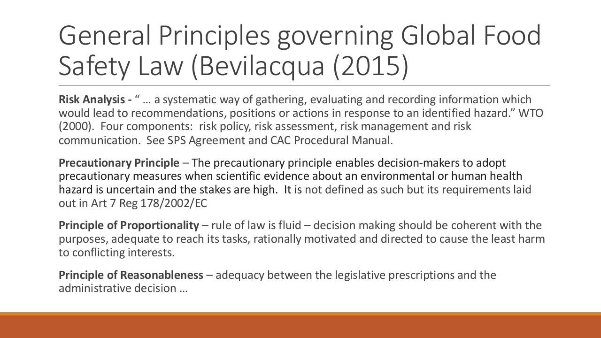

### General Principles governing Global Food Safety Law

*Source: Bevilacqua (2015)*

- **Risk Analysis** — *"… a systematic way of gathering, evaluating and recording information which would lead to recommendations, positions or actions in response to an identified hazard."* (WTO, 2000). Four components: risk policy, risk assessment, risk management, risk communication. See SPS Agreement and CAC Procedural Manual.

- **Precautionary Principle** — Enables decision-makers to adopt precautionary measures when scientific evidence about an environmental or human-health hazard is uncertain and the stakes are high. Not formally defined as such, but its requirements are laid out in **Art 7 of Reg (EC) 178/2002**.

- **Principle of Proportionality** — The rule of law is fluid; decision-making should be coherent with the purposes, adequate to reach its tasks, rationally motivated, and directed to cause the least harm to conflicting interests.

- **Principle of Reasonableness** — Adequacy between the legislative prescriptions and the administrative decision.

## Slide 19

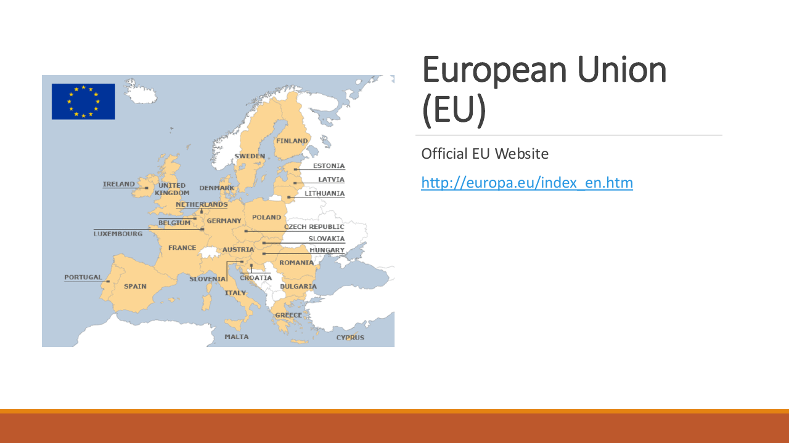

### European Union (EU)

**Official EU Website:** <http://europa.eu/index_en.htm>

## Slide 20

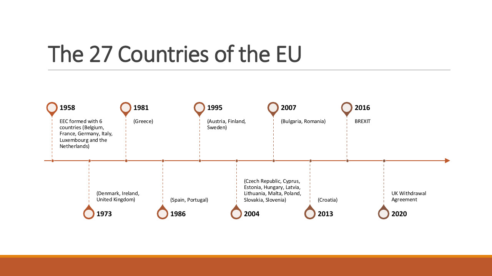

### The 27 Countries of the EU — Enlargement Timeline

| Year | Event |
|---|---|
| **1958** | EEC formed with 6 countries: Belgium, France, Germany, Italy, Luxembourg, Netherlands |
| **1973** | Denmark, Ireland, United Kingdom join |
| **1981** | Greece joins |
| **1986** | Spain, Portugal join |
| **1995** | Austria, Finland, Sweden join |
| **2004** | Czech Republic, Cyprus, Estonia, Hungary, Latvia, Lithuania, Malta, Poland, Slovakia, Slovenia join (largest enlargement) |
| **2007** | Bulgaria, Romania join |
| **2013** | Croatia joins |
| **2016** | **BREXIT** referendum |
| **2020** | UK Withdrawal Agreement — UK formally leaves the EU |

## Slide 21

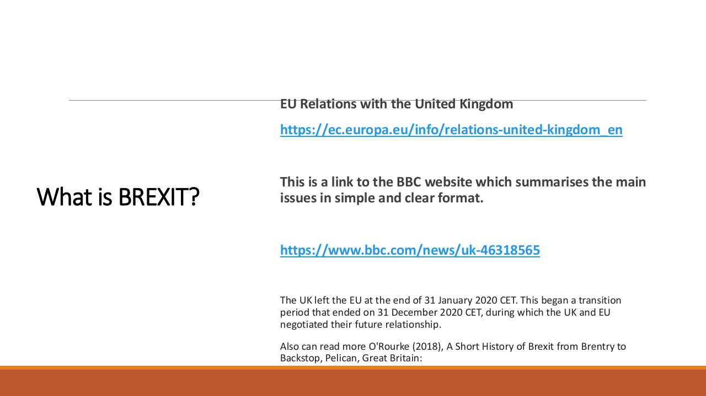

### EU Relations with the United Kingdom — *What is BREXIT?*

- EU page on relations with the UK: <https://ec.europa.eu/info/relations-united-kingdom_en>
- BBC explainer (summary in simple, clear format): <https://www.bbc.com/news/uk-46318565>

The UK left the EU at the end of **31 January 2020 CET**. This began a transition period that ended on **31 December 2020 CET**, during which the UK and EU negotiated their future relationship.

**Further reading:** O'Rourke (2018), *A Short History of Brexit from Brentry to Backstop*, Pelican, Great Britain.

## Slide 22

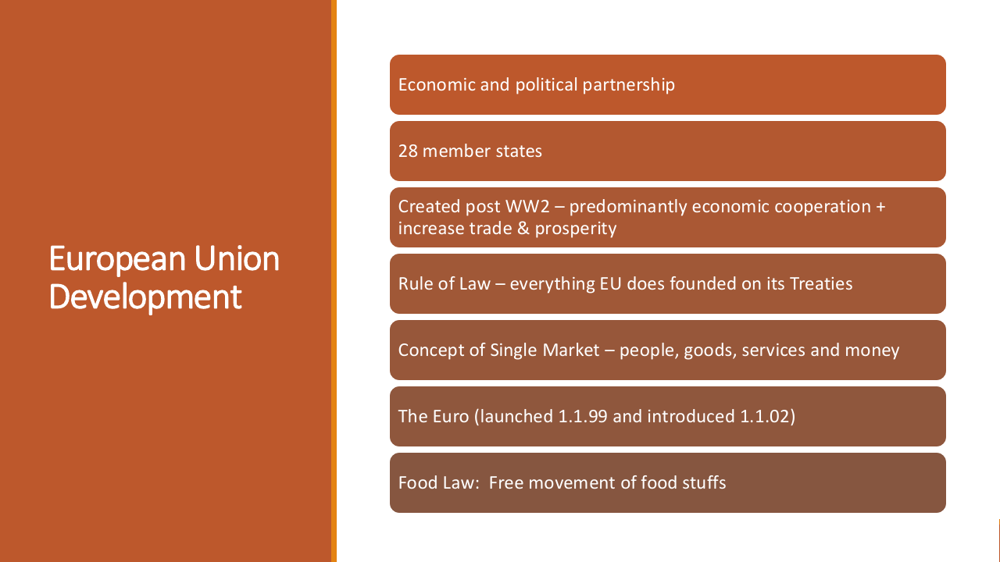

### European Union — Development

- Economic and political partnership
- **28 member states** (at time of slide creation — now 27 post-Brexit)
- Created post-WWII — predominantly economic cooperation + increase trade & prosperity
- **Rule of Law** — everything the EU does is founded on its Treaties
- Concept of the **Single Market** — free movement of people, goods, services and money
- **The Euro** — launched 1.1.99, introduced 1.1.02
- **Food Law** — free movement of foodstuffs

## Slide 23

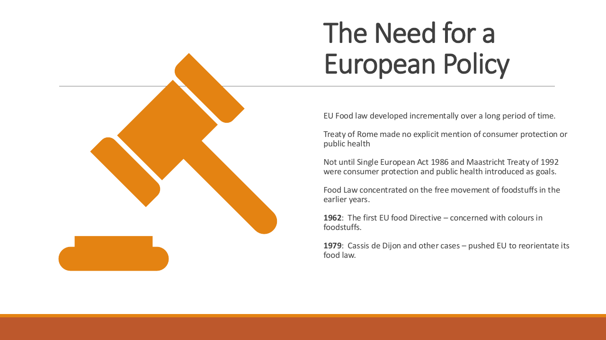

### The Need for a European Policy

EU Food law developed **incrementally** over a long period of time.

- The **Treaty of Rome** made no explicit mention of consumer protection or public health.
- Not until the **Single European Act (1986)** and the **Maastricht Treaty (1992)** were consumer protection and public health introduced as EU goals.
- Food law concentrated on the **free movement of foodstuffs** in the earlier years.

Key milestones:

- **1962** — The first EU food Directive, concerned with colours in foodstuffs.
- **1979** — *Cassis de Dijon* and other cases pushed the EU to reorientate its food law.

## Slide 24

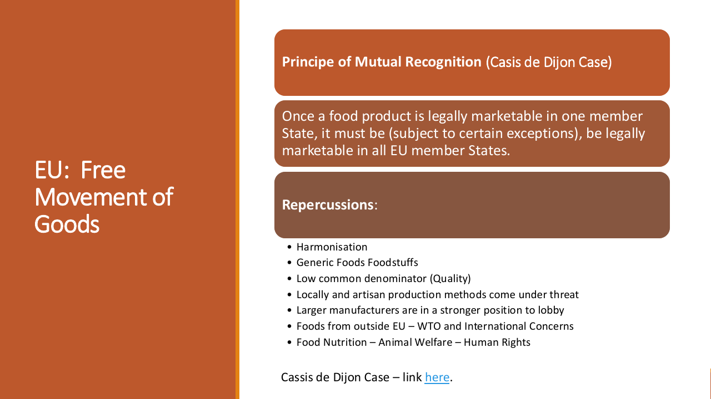

### EU: Free Movement of Goods — *Principle of Mutual Recognition (Cassis de Dijon Case)*

> Once a food product is legally marketable in one member State, it must (subject to certain exceptions) be legally marketable in all EU member States.

**Repercussions:**

- Harmonisation
- Generic foods / foodstuffs
- Low common denominator (quality)
- Locally and artisan production methods come under threat
- Larger manufacturers are in a stronger position to lobby
- Foods from outside the EU — WTO and International Concerns
- Food Nutrition — Animal Welfare — Human Rights

*See the Cassis de Dijon case for the foundational ruling.*

## Slide 25

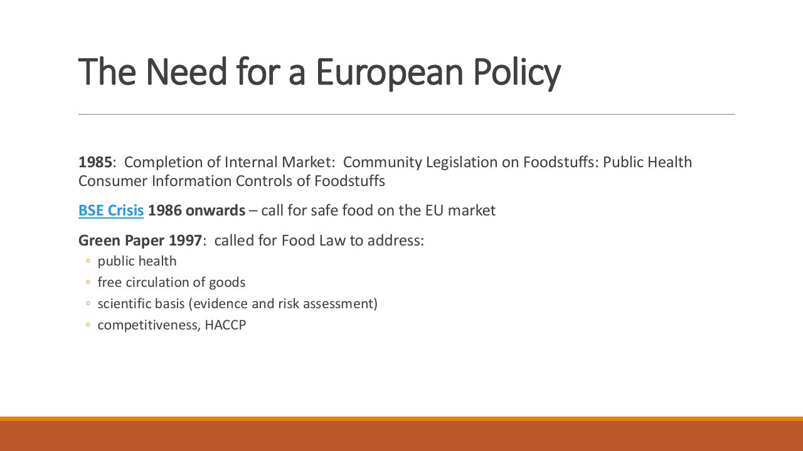

### The Need for a European Policy (cont.)

- **1985** — Completion of the Internal Market: Community Legislation on Foodstuffs covering Public Health, Consumer Information and Controls of Foodstuffs.
- **BSE Crisis (1986 onwards)** — call for safe food on the EU market.
- **Green Paper 1997** — called for Food Law to address:
    - public health
    - free circulation of goods
    - scientific basis (evidence and risk assessment)
    - competitiveness, HACCP

## Slide 26

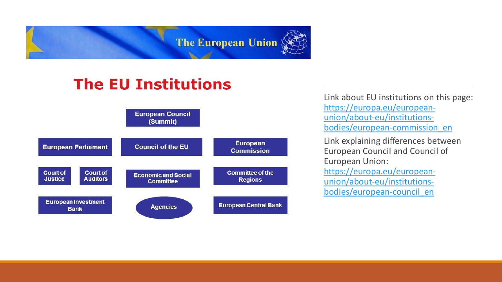

### The EU Institutions

The EU is composed of the following institutions and bodies:

- **European Council** (Summit)
- **European Parliament**
- **Council of the EU**
- **European Commission**
- **Court of Justice**
- **Court of Auditors**
- **Economic and Social Committee**
- **Committee of the Regions**
- **European Investment Bank**
- **European Central Bank**
- **Agencies**

**Further reading:**

- EU institutions overview: <https://europa.eu/european-union/about-eu/institutions-bodies/european-commission_en>
- Difference between European Council and Council of the European Union: <https://europa.eu/european-union/about-eu/institutions-bodies/european-council_en>

## Slide 27

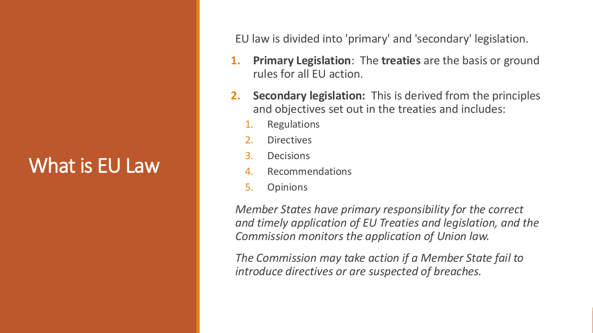

### What is EU Law?

EU law is divided into **primary** and **secondary** legislation:

1. **Primary Legislation** — The **treaties** are the basis or ground rules for all EU action.
2. **Secondary Legislation** — Derived from the principles and objectives set out in the treaties; includes:
    1. Regulations
    2. Directives
    3. Decisions
    4. Recommendations
    5. Opinions

Member States have primary responsibility for the correct and timely application of EU Treaties and legislation. The Commission monitors the application of Union law and may take action if a Member State fails to introduce directives or is suspected of breaches.

## Slide 28

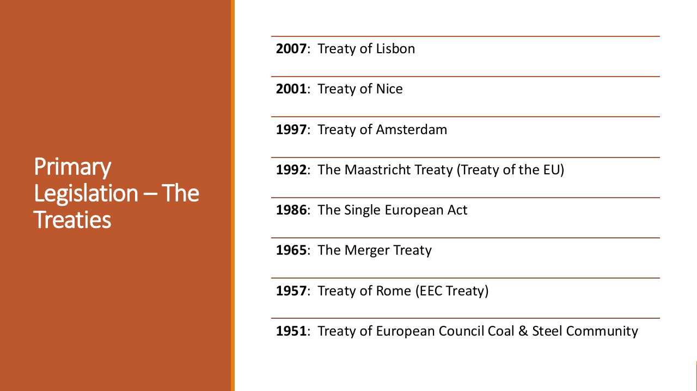

### Primary Legislation — The Treaties

| Year | Treaty |
|---|---|
| **1951** | Treaty of European Council Coal & Steel Community |
| **1957** | Treaty of Rome *(EEC Treaty)* |
| **1965** | The Merger Treaty |
| **1986** | The Single European Act |
| **1992** | The Maastricht Treaty *(Treaty of the EU)* |
| **1997** | Treaty of Amsterdam |
| **2001** | Treaty of Nice |
| **2007** | Treaty of Lisbon |

## Slide 29

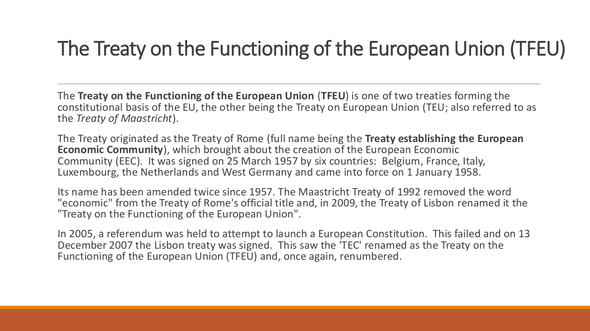

### The Treaty on the Functioning of the European Union (TFEU)

The **Treaty on the Functioning of the European Union (TFEU)** is one of two treaties forming the constitutional basis of the EU, the other being the **Treaty on European Union (TEU)** — also referred to as the *Treaty of Maastricht*.

The Treaty originated as the **Treaty of Rome** (full name: *Treaty establishing the European Economic Community*), which brought about the creation of the European Economic Community (EEC). It was signed on **25 March 1957** by six countries — Belgium, France, Italy, Luxembourg, the Netherlands and West Germany — and came into force on **1 January 1958**.

Its name has been amended **twice** since 1957:

- The **Maastricht Treaty (1992)** removed the word "economic" from the Treaty of Rome's official title.
- In **2009**, the **Treaty of Lisbon** renamed it the *Treaty on the Functioning of the European Union*.

In 2005, a referendum was held to attempt to launch a European Constitution. This failed, and on **13 December 2007** the Lisbon treaty was signed — this saw the 'TEC' renamed as the TFEU and renumbered.

## Slide 30

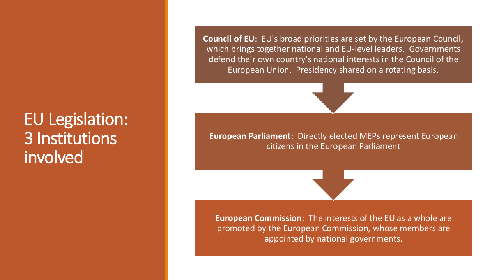

### EU Legislation — Three Institutions Involved

- **Council of the EU** — The EU's broad priorities are set by the European Council, which brings together national and EU-level leaders. Governments defend their own country's national interests in the Council of the European Union. Presidency is shared on a rotating basis.

- **European Parliament** — Directly elected MEPs represent European citizens.

- **European Commission** — The interests of the EU as a whole are promoted by the European Commission, whose members are appointed by national governments.

## Slide 31

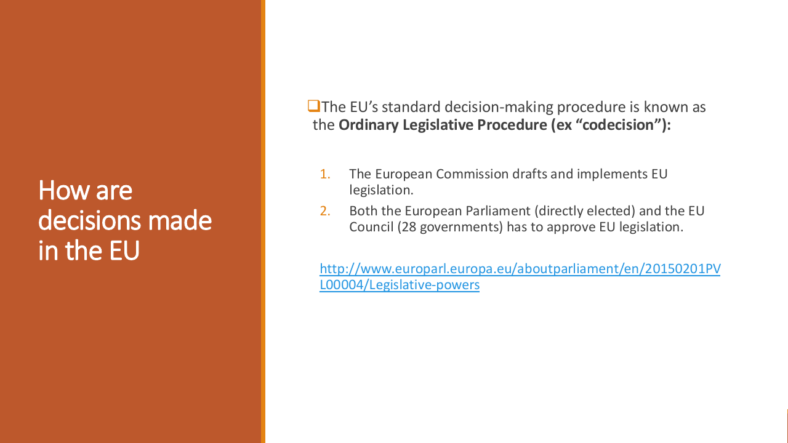

### How are decisions made in the EU?

The EU's standard decision-making procedure is known as the **Ordinary Legislative Procedure** (formerly *"codecision"*):

1. The **European Commission** drafts and implements EU legislation.
2. Both the **European Parliament** (directly elected) and the **EU Council** (28 governments) must approve EU legislation.

*Reference:* <http://www.europarl.europa.eu/aboutparliament/en/20150201PVL00004/Legislative-powers>

## Slide 32

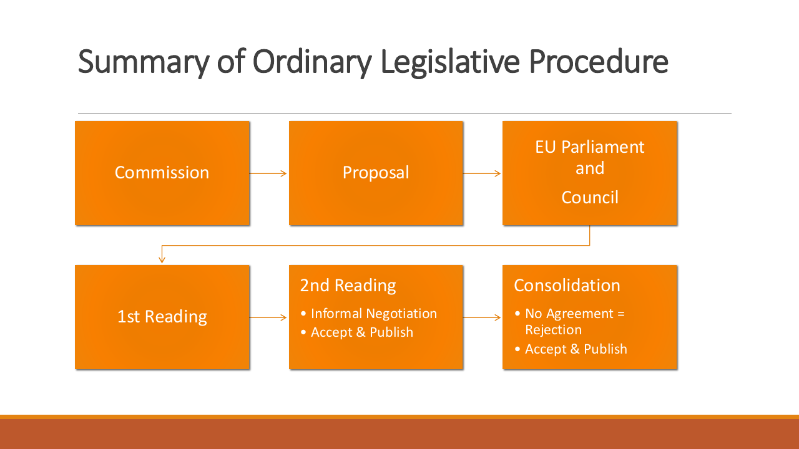

### Summary of the Ordinary Legislative Procedure

The procedure flows through these stages:

1. **Commission** drafts a **Proposal**
2. **EU Parliament and Council** receive the proposal
3. **1st Reading**
4. **2nd Reading** — informal negotiation; accept & publish if agreed
5. **Consolidation** — no agreement = rejection; accept & publish if agreed

*(See slide image for the flowchart layout.)*

## Slide 33

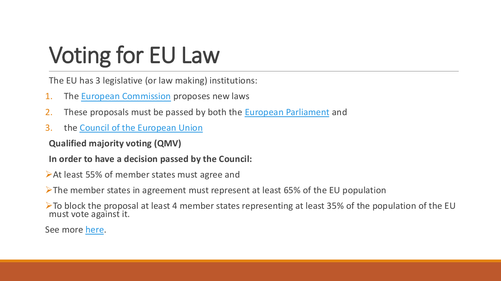

### Voting for EU Law

The EU has **3 legislative (law-making) institutions**:

1. The **European Commission** proposes new laws.
2. These proposals must be passed by both the **European Parliament** and …
3. … the **Council of the European Union**.

#### Qualified Majority Voting (QMV)

In order for a decision to be passed by the Council:

- **At least 55 %** of member states must agree, **and**
- the member states in agreement must represent at least **65 %** of the EU population.
- To **block** a proposal, at least **4 member states** representing at least **35 %** of the EU population must vote against it.

## Slide 34

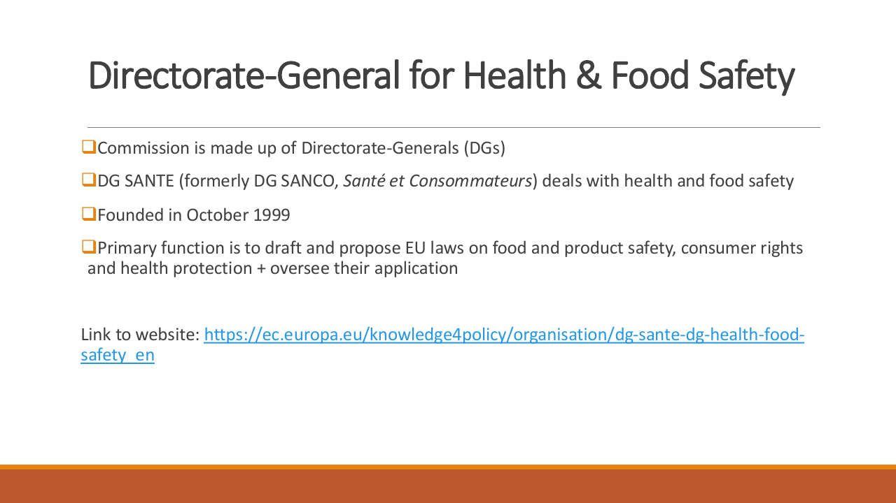

### Directorate-General for Health & Food Safety (DG SANTE)

- The European Commission is made up of **Directorate-Generals (DGs)**.
- **DG SANTE** (formerly *DG SANCO* — *Santé et Consommateurs*) deals with health and food safety.
- Founded in **October 1999**.
- Primary function: draft and propose EU laws on food and product safety, consumer rights, and health protection — and oversee their application.

*Website:* <https://ec.europa.eu/knowledge4policy/organisation/dg-sante-dg-health-food-safety_en>

## Slide 35

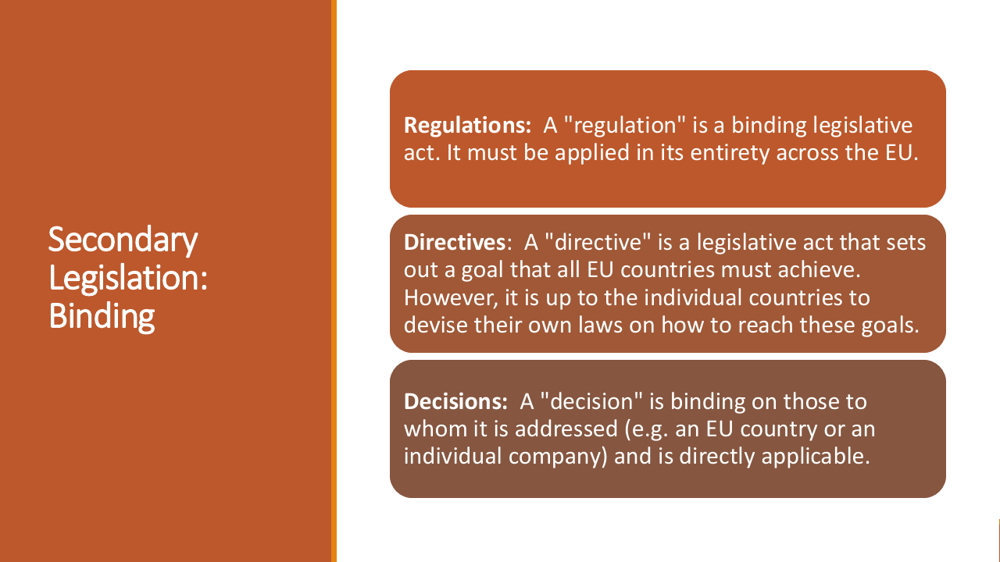

### Secondary Legislation — *Binding*

- **Regulations** — A regulation is a **binding** legislative act. It must be applied in its **entirety** across the EU.

- **Directives** — A directive is a legislative act that sets out a **goal** that all EU countries must achieve. However, it is up to the individual countries to devise their own laws on **how** to reach these goals.

- **Decisions** — A decision is **binding on those to whom it is addressed** (e.g. an EU country or an individual company) and is directly applicable.

## Slide 36

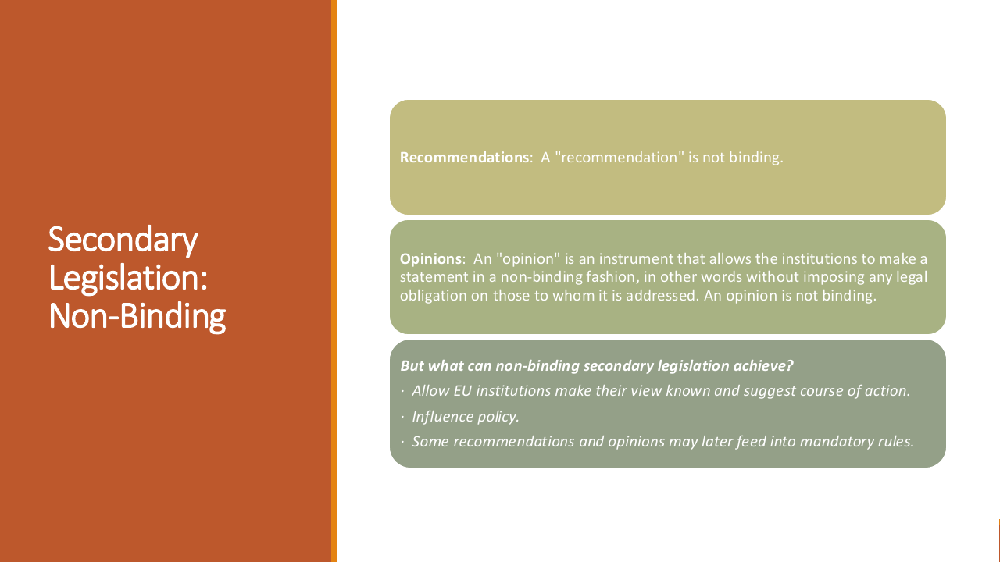

### Secondary Legislation — *Non-Binding*

- **Recommendations** — A recommendation is **not binding**.

- **Opinions** — An opinion is an instrument that allows the institutions to make a statement in a non-binding fashion (without imposing any legal obligation on those to whom it is addressed). An opinion is **not binding**.

#### But what can non-binding secondary legislation achieve?

- Allow EU institutions to make their views known and suggest a course of action.
- Influence policy.
- Some recommendations and opinions may later feed into mandatory rules.

## Slide 37

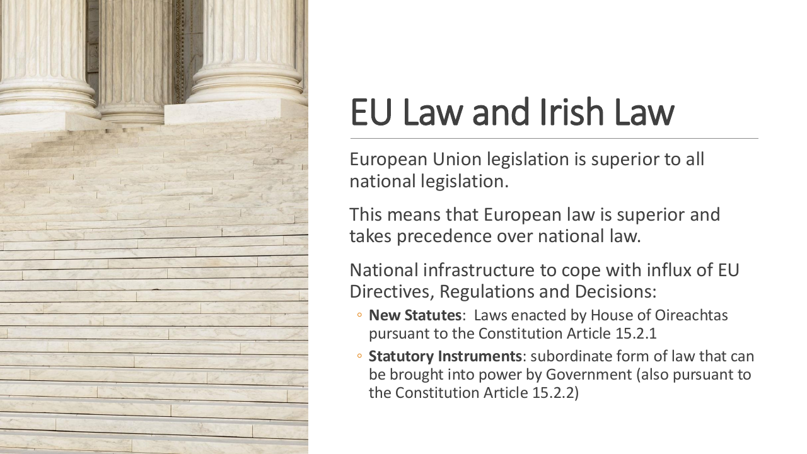

### EU Law and Irish Law

> European Union legislation is **superior** to all national legislation — European law **takes precedence** over national law.

National infrastructure to cope with the influx of EU Directives, Regulations and Decisions:

- **New Statutes** — laws enacted by the House of Oireachtas pursuant to **Constitution Article 15.2.1**.
- **Statutory Instruments** — a subordinate form of law that can be brought into power by Government (also pursuant to **Constitution Article 15.2.2**).

## Slide 38

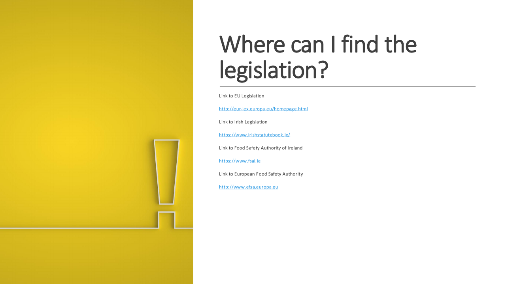

### Where can I find the legislation?

| Source | Link |
|---|---|
| EU Legislation (Eur-Lex) | <http://eur-lex.europa.eu/homepage.html> |
| Irish Legislation | <https://www.irishstatutebook.ie/> |
| Food Safety Authority of Ireland (FSAI) | <https://www.fsai.ie> |
| European Food Safety Authority (EFSA) | <http://www.efsa.europa.eu> |

## Slide 39

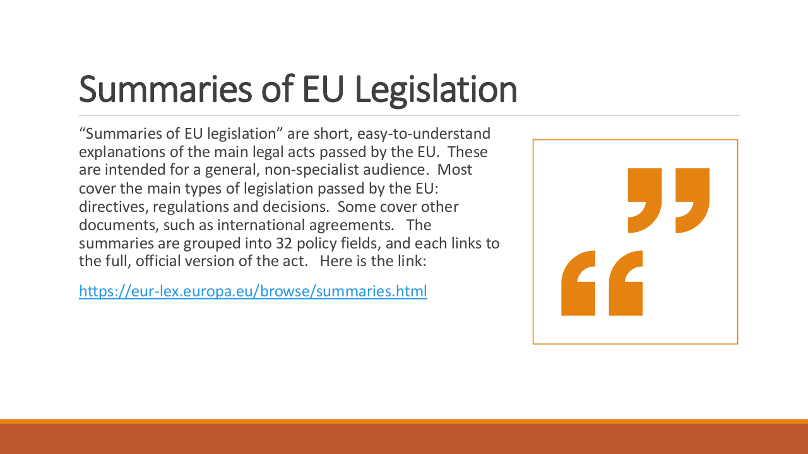

### Summaries of EU Legislation

*"Summaries of EU legislation"* are short, easy-to-understand explanations of the main legal acts passed by the EU. They are intended for a general, non-specialist audience.

- Most cover the main types of legislation: **directives, regulations and decisions**.
- Some cover other documents, such as international agreements.
- The summaries are grouped into **32 policy fields**, and each links to the full, official version of the act.

*Link:* <https://eur-lex.europa.eu/browse/summaries.html>

## Slide 40

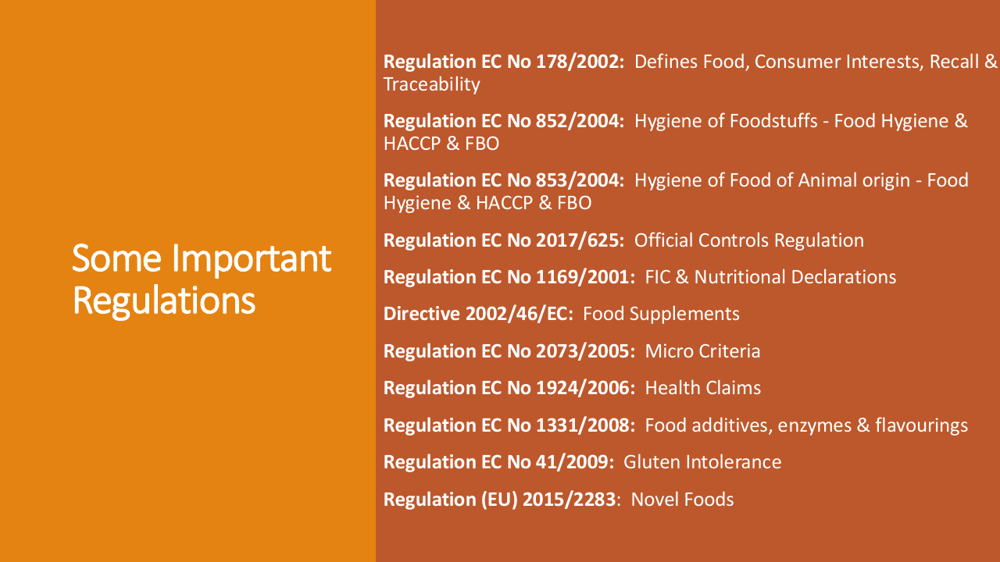

### Some Important Regulations

| Regulation | Subject |
|---|---|
| **Reg (EC) 178/2002** | Defines food, consumer interests, recall & traceability |
| **Reg (EC) 852/2004** | Hygiene of Foodstuffs — food hygiene, HACCP, FBO |
| **Reg (EC) 853/2004** | Hygiene of Food of Animal Origin — food hygiene, HACCP, FBO |
| **Reg (EU) 2017/625** | Official Controls Regulation |
| **Reg (EU) 1169/2011** | Food Information to Consumers (FIC) & nutritional declarations |
| **Directive 2002/46/EC** | Food supplements |
| **Reg (EC) 2073/2005** | Microbiological criteria |
| **Reg (EC) 1924/2006** | Nutrition and health claims |
| **Reg (EC) 1331/2008** | Food additives, enzymes & flavourings |
| **Reg (EC) 41/2009** | Gluten intolerance |
| **Reg (EU) 2015/2283** | Novel foods |

*Note: slide shows "1169/2001" — the actual regulation is 1169/2011 (FIC). Slide typo.*

## Slide 41


### ?  —  Questions

*(End-of-section discussion divider.)*

## Slide 42

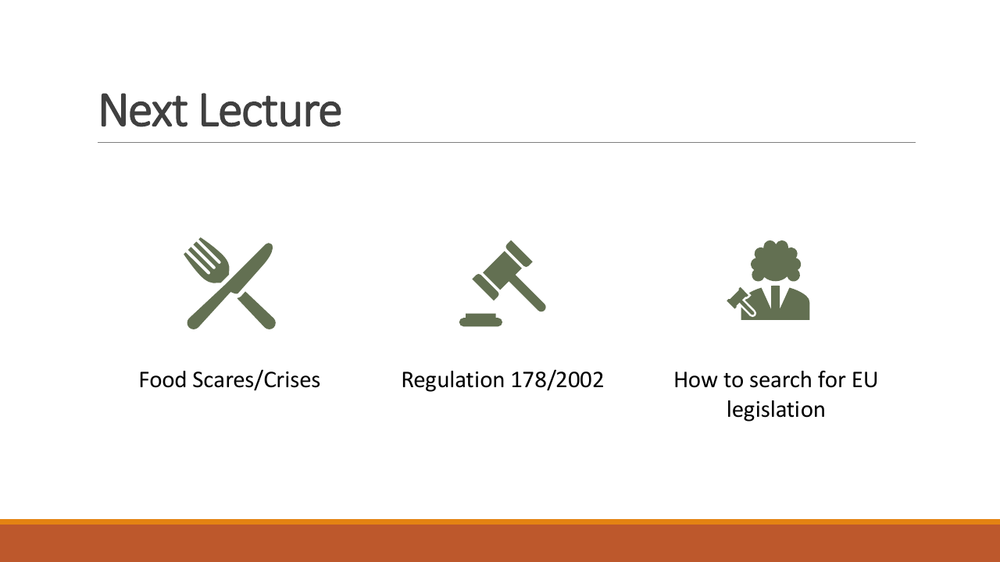

### Next Lecture — Preview

- Food Scares / Crises
- Regulation 178/2002
- How to search for EU legislation

---

<a id="lecture-2"></a>

# Lecture 2 — Week 2 (4 February 2026): General Principles of Food Law (178/2002), EFSA, FSAI, DG Sante

**Topics:** Reg (EC) 178/2002 · BSE crisis · Dioxin crisis · EFSA · FSAI · DG Sante · RASFF · risk analysis · Article 6 · Article 8 (consumer protection) · fieldtrip photos

**Slides:** 43–124 (82 slides)

## Slide 43

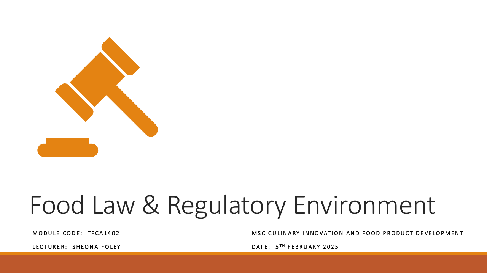

### Food Law & Regulatory Environment

| | |
|---|---|
| **Module code** | TFCA1402 |
| **Programme** | MSc Culinary Innovation and Food Product Development |
| **Lecturer** | Sheona Foley |
| **Date (on slide)** | 5th February 2025 *(stale template year — actual delivery 4 Feb 2026)* |

## Slide 44

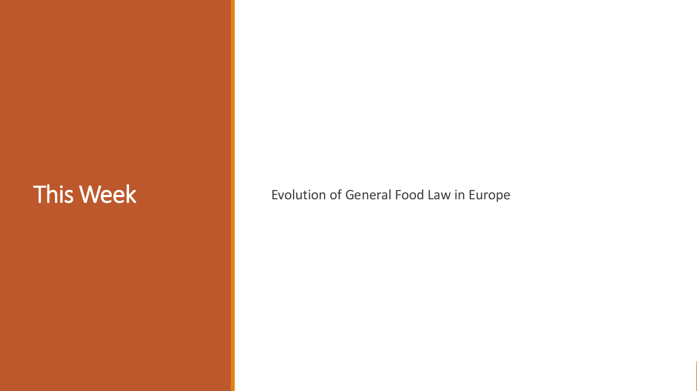

### This Week

**Topic:** Evolution of General Food Law in Europe.

## Slide 45

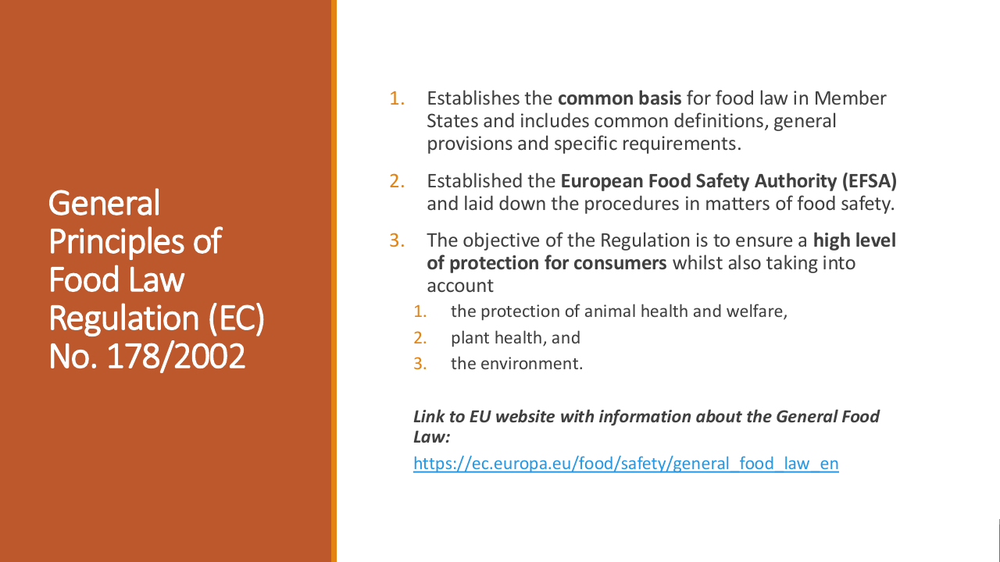

### General Principles of Food Law — Regulation (EC) No. 178/2002

1. Establishes the **common basis** for food law in Member States and includes common definitions, general provisions and specific requirements.
2. Established the **European Food Safety Authority (EFSA)** and laid down the procedures in matters of food safety.
3. The objective of the Regulation is to ensure a **high level of protection for consumers** whilst also taking into account:
    1. the protection of animal health and welfare
    2. plant health, and
    3. the environment

*Link to EU General Food Law:* <https://ec.europa.eu/food/safety/general_food_law_en>

## Slide 46

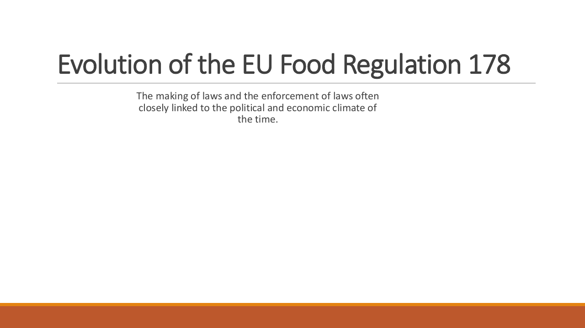

### Evolution of EU Food Regulation 178/2002

> The making of laws and the enforcement of laws is often closely linked to the **political and economic climate of the time**.

## Slide 47

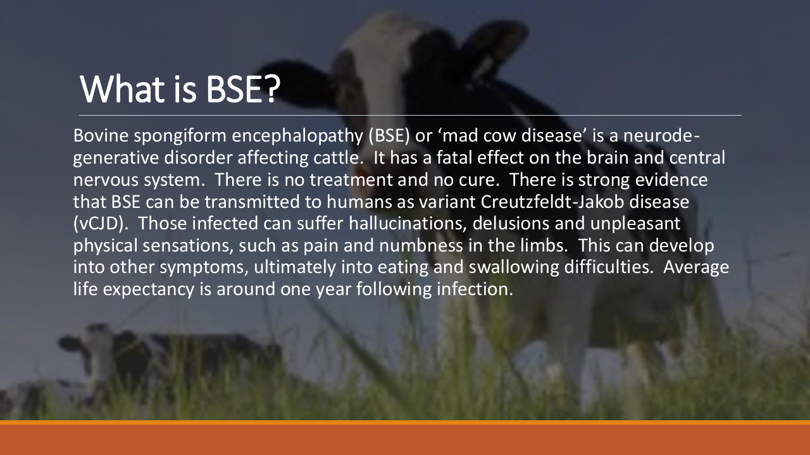

### What is BSE?

**Bovine spongiform encephalopathy (BSE)** — or *"mad cow disease"* — is a neurodegenerative disorder affecting cattle. It has a fatal effect on the brain and central nervous system. There is **no treatment and no cure**.

There is strong evidence that BSE can be transmitted to humans as **variant Creutzfeldt-Jakob disease (vCJD)**. Those infected can suffer hallucinations, delusions and unpleasant physical sensations, such as pain and numbness in the limbs. This can develop into other symptoms, ultimately into eating and swallowing difficulties. Average life expectancy is around **one year** following infection.

## Slide 48

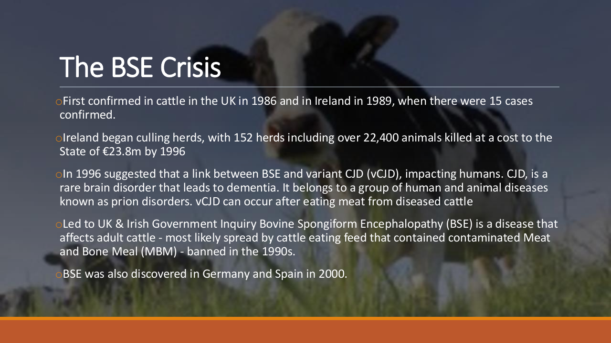

### The BSE Crisis

- First confirmed in cattle in the **UK in 1986** and in **Ireland in 1989**, when 15 cases were confirmed.
- Ireland began culling herds — **152 herds, over 22,400 animals killed** at a cost to the State of **€23.8 m by 1996**.
- In **1996** a link was suggested between BSE and **variant CJD (vCJD)**, impacting humans. CJD is a rare brain disorder leading to dementia, belonging to a group of human and animal **prion disorders**. vCJD can occur after eating meat from diseased cattle.
- Led to UK & Irish government inquiries. BSE most likely spread by cattle eating feed that contained contaminated **Meat and Bone Meal (MBM)** — banned in the 1990s.
- BSE was also discovered in **Germany and Spain in 2000**.

## Slide 49

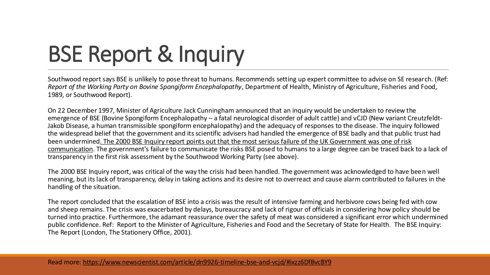

### BSE Report & Inquiry

**Southwood Report (1989)** — concluded BSE is unlikely to pose a threat to humans. Recommended setting up an expert committee to advise on SE research.
*(Ref: Report of the Working Party on Bovine Spongiform Encephalopathy, Department of Health, Ministry of Agriculture, Fisheries and Food, 1989 — Southwood Report.)*

On **22 December 1997**, Minister of Agriculture Jack Cunningham announced that an inquiry would be undertaken to review the emergence of BSE and vCJD and the adequacy of responses to the disease. The inquiry followed the widespread belief that the government and its scientific advisers had handled the emergence of BSE badly and that public trust had been undermined.

**The 2000 BSE Inquiry Report** points out that the most serious failure of the UK Government was one of **risk communication**. The government's failure to communicate the risks BSE posed to humans can be traced back to a lack of transparency in the first risk assessment by the Southwood Working Party.

The report was critical of the way the crisis had been handled:

- Government was acknowledged to have been well-meaning, but its **lack of transparency, delay in taking action, and desire not to overreact** contributed to failures.
- The escalation of BSE into a crisis was the result of **intensive farming and herbivore cows being fed cow and sheep remains**.
- The crisis was exacerbated by delays, bureaucracy and lack of rigour of officials in considering how policy should be turned into practice.
- The adamant reassurance over the safety of meat was considered a significant error that undermined public confidence.

*Ref:* Report to the Minister of Agriculture, Fisheries and Food and the Secretary of State for Health — *The BSE Inquiry: The Report* (London, The Stationery Office, 2001).

*Read more:* <https://www.newscientist.com/article/dn9926-timeline-bse-and-vcjd/>

## Slide 50

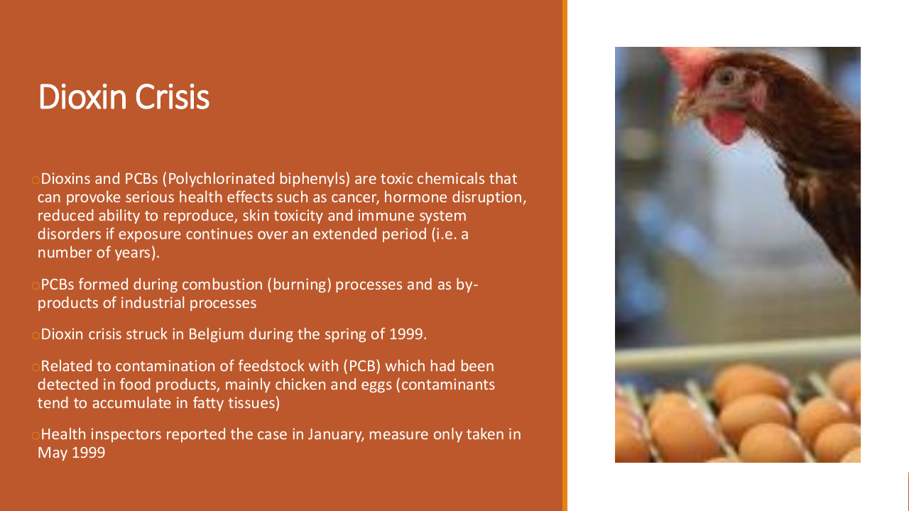

### Dioxin Crisis

- **Dioxins and PCBs** (Polychlorinated biphenyls) are toxic chemicals that can provoke serious health effects — cancer, hormone disruption, reduced ability to reproduce, skin toxicity and immune system disorders — if exposure continues over an extended period (years).
- PCBs are formed during **combustion (burning) processes** and as **by-products of industrial processes**.
- The dioxin crisis struck in **Belgium during the spring of 1999**.
- Related to **contamination of feedstock with PCB**, which had been detected in food products — mainly chicken and eggs (contaminants tend to accumulate in fatty tissues).
- Health inspectors reported the case in **January**, but measures were only taken in **May 1999** — a critical delay.

## Slide 51

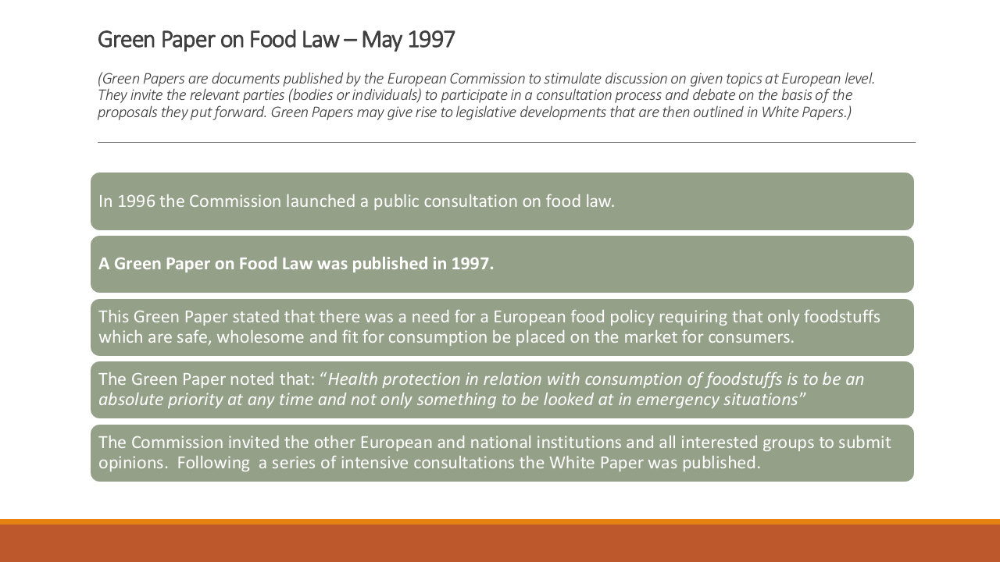

### Green Paper on Food Law — May 1997

> *Green Papers are documents published by the European Commission to stimulate discussion on given topics at European level. They invite the relevant parties (bodies or individuals) to participate in a consultation process and debate on the basis of the proposals they put forward. Green Papers may give rise to legislative developments that are then outlined in White Papers.*

- In **1996** the Commission launched a public consultation on food law.
- **A Green Paper on Food Law was published in 1997.**
- The Green Paper stated that there was a need for a European food policy requiring that only foodstuffs which are **safe, wholesome and fit for consumption** be placed on the market for consumers.
- The Green Paper noted that:
  > "Health protection in relation with consumption of foodstuffs is to be an absolute priority at any time and not only something to be looked at in emergency situations."
- The Commission invited other European and national institutions and all interested groups to submit opinions. Following a series of intensive consultations the **White Paper** was published.

## Slide 52

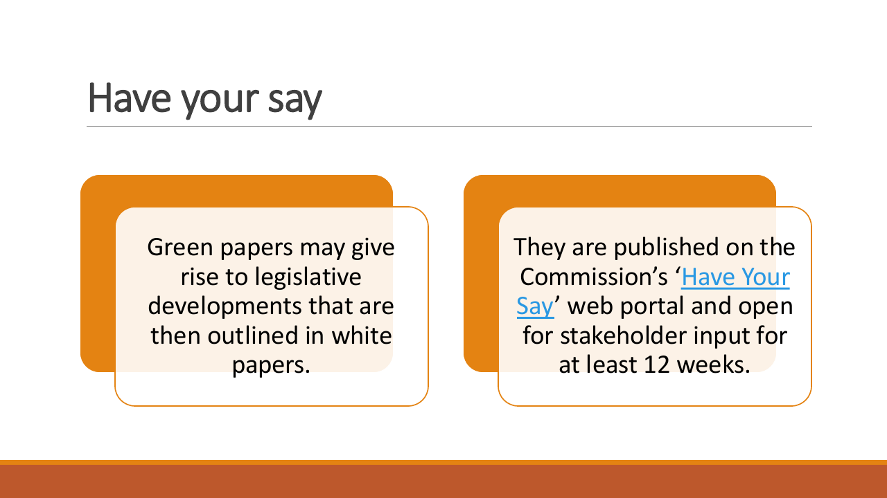

### Have Your Say

- Green Papers may give rise to legislative developments that are then outlined in **White Papers**.
- They are published on the Commission's **"Have Your Say"** web portal and open for stakeholder input for **at least 12 weeks**.

## Slide 53

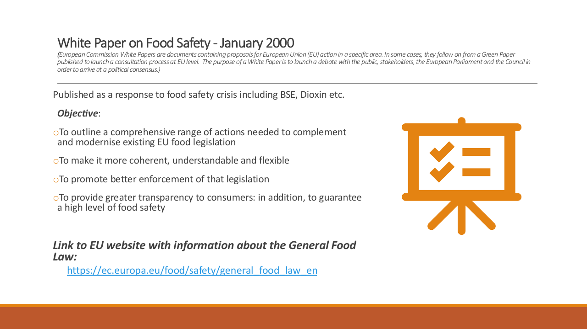

### White Paper on Food Safety — January 2000

> *European Commission White Papers are documents containing proposals for European Union action in a specific area. In some cases, they follow on from a Green Paper published to launch a consultation process at EU level. The purpose of a White Paper is to launch a debate with the public, stakeholders, the European Parliament and the Council in order to arrive at a political consensus.*

Published as a response to food safety crises including **BSE, Dioxin etc.**

**Objective:**

- To outline a comprehensive range of actions needed to complement and modernise existing EU food legislation.
- To make it more **coherent, understandable and flexible**.
- To promote **better enforcement** of that legislation.
- To provide **greater transparency** to consumers and guarantee a high level of food safety.

*Link to EU General Food Law:* <https://ec.europa.eu/food/safety/general_food_law_en>

## Slide 54

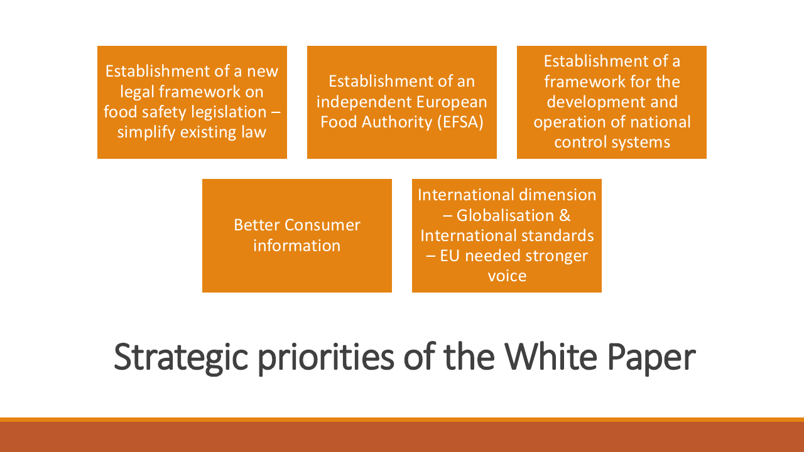

### Strategic Priorities of the White Paper

1. **Establishment of a new legal framework on food safety legislation** — simplify existing law.
2. **Establishment of an independent European Food Authority (EFSA).**
3. **Establishment of a framework** for the development and operation of national control systems.
4. **Better consumer information.**
5. **International dimension** — Globalisation & international standards; the EU needed a stronger voice.

## Slide 55

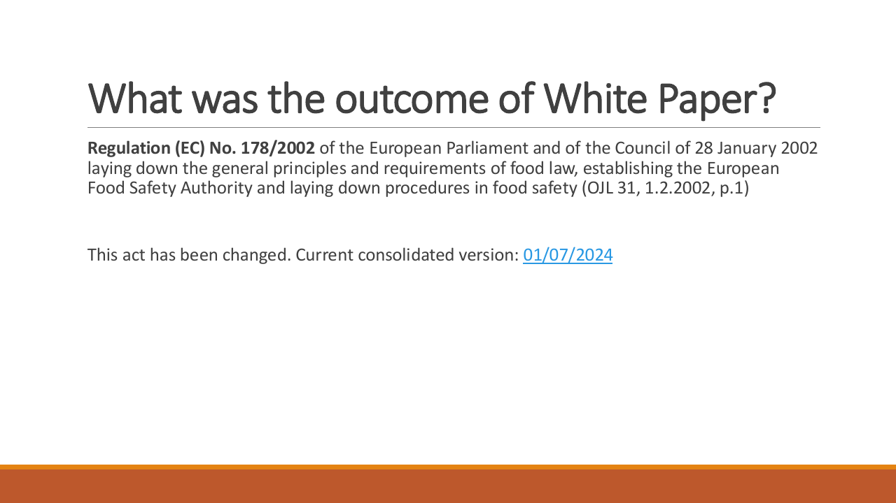

### What was the outcome of the White Paper?

**Regulation (EC) No. 178/2002** of the European Parliament and of the Council of **28 January 2002** laying down the general principles and requirements of food law, establishing the European Food Safety Authority and laying down procedures in food safety *(OJL 31, 1.2.2002, p.1)*.

> *This act has been amended several times — current consolidated version: 01/07/2024.*

## Slide 56

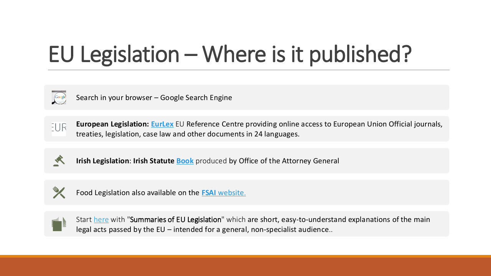

### EU Legislation — Where is it published?

- **Google Search** — search in your browser as a quick entry point.
- **European Legislation — EurLex** — the EU reference centre providing online access to European Union Official Journals, treaties, legislation, case law and other documents in **24 languages**.
- **Irish Legislation — Irish Statute Book** — produced by the Office of the Attorney General.
- **Food Legislation** — also available on the **FSAI website**.
- Start with **"Summaries of EU Legislation"** — short, easy-to-understand explanations of the main legal acts, intended for a general, non-specialist audience.

## Slide 57

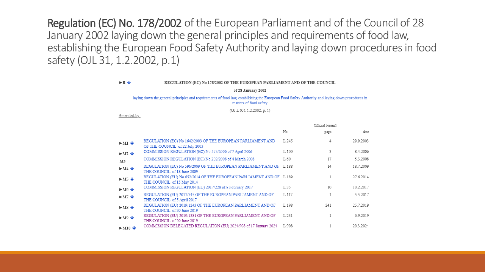

### Regulation (EC) No. 178/2002 — Full citation

**Regulation (EC) No. 178/2002** of the European Parliament and of the Council of **28 January 2002** laying down the general principles and requirements of food law, establishing the European Food Safety Authority and laying down procedures in food safety *(OJL 31, 1.2.2002, p.1)*.

*(Slide shows the Eur-Lex amendment history — M1 through M10 — for Reg 178/2002. See slide image for the full list of amending acts and dates.)*

## Slide 58

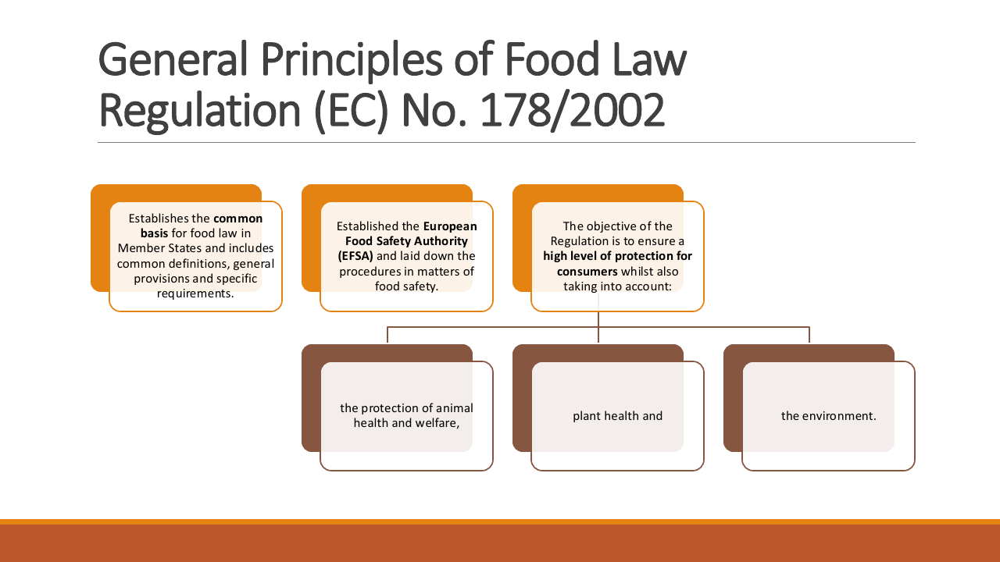

### General Principles of Food Law — Regulation (EC) No. 178/2002

Three core purposes:

1. Establishes the **common basis** for food law in Member States — common definitions, general provisions and specific requirements.
2. Established the **European Food Safety Authority (EFSA)** and laid down the procedures in matters of food safety.
3. The objective of the Regulation is to ensure a **high level of protection for consumers**, whilst also taking into account:
    - the protection of **animal health and welfare**
    - **plant health**, and
    - **the environment**.

## Slide 59

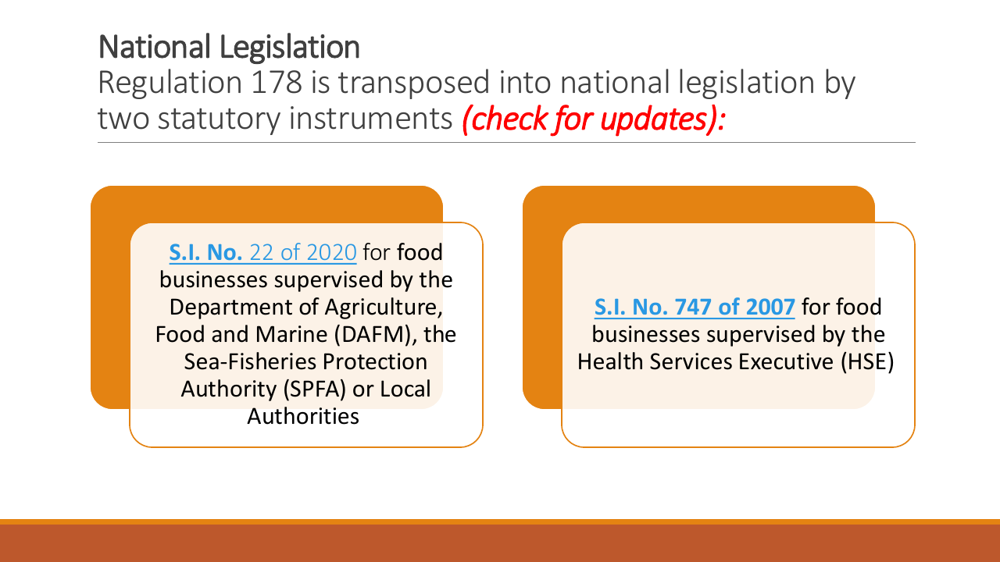

### National Legislation

Regulation 178 is transposed into Irish national legislation by **two statutory instruments** *(check for updates)*:

| Statutory Instrument | Scope |
|---|---|
| **S.I. No. 22 of 2020** | Food businesses supervised by the **Department of Agriculture, Food and the Marine (DAFM)**, the **Sea-Fisheries Protection Authority (SFPA)** or **Local Authorities** |
| **S.I. No. 747 of 2007** | Food businesses supervised by the **Health Service Executive (HSE)** |

## Slide 60

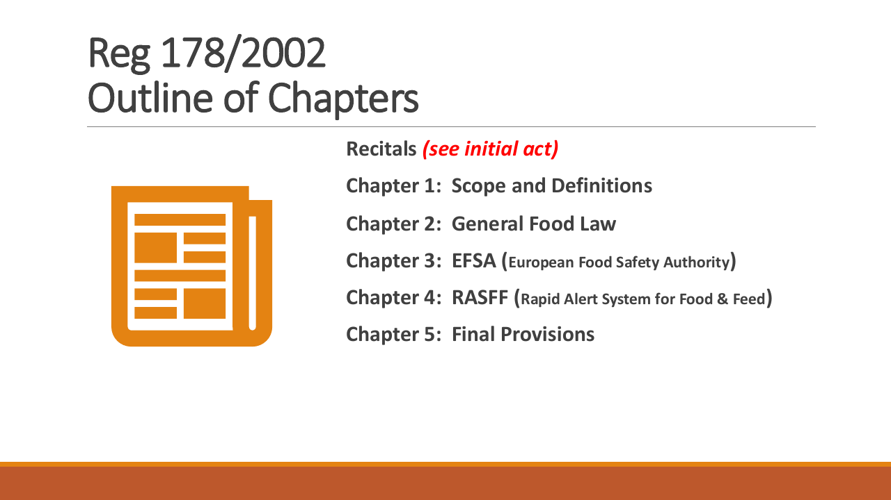

### Reg 178/2002 — Outline of Chapters

- **Recitals** *(see initial act)*
- **Chapter 1** — Scope and Definitions
- **Chapter 2** — General Food Law
- **Chapter 3** — EFSA (European Food Safety Authority)
- **Chapter 4** — RASFF (Rapid Alert System for Food & Feed)
- **Chapter 5** — Final Provisions

## Slide 61

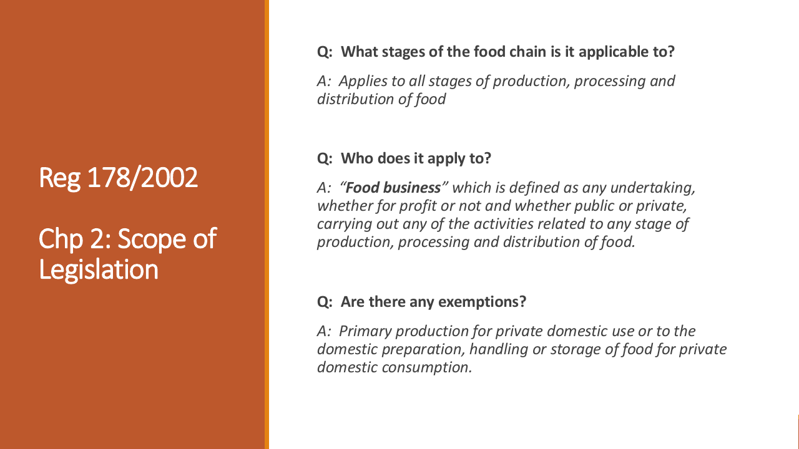

### Reg 178/2002 — Chapter 2: Scope of Legislation

**Q: What stages of the food chain is it applicable to?**
A: Applies to **all stages** of production, processing and distribution of food.

**Q: Who does it apply to?**
A: **"Food business"** — defined as any undertaking, whether for profit or not and whether public or private, carrying out any of the activities related to any stage of production, processing and distribution of food.

**Q: Are there any exemptions?**
A: **Primary production for private domestic use**, or the **domestic preparation, handling or storage of food for private domestic consumption**.

## Slide 62

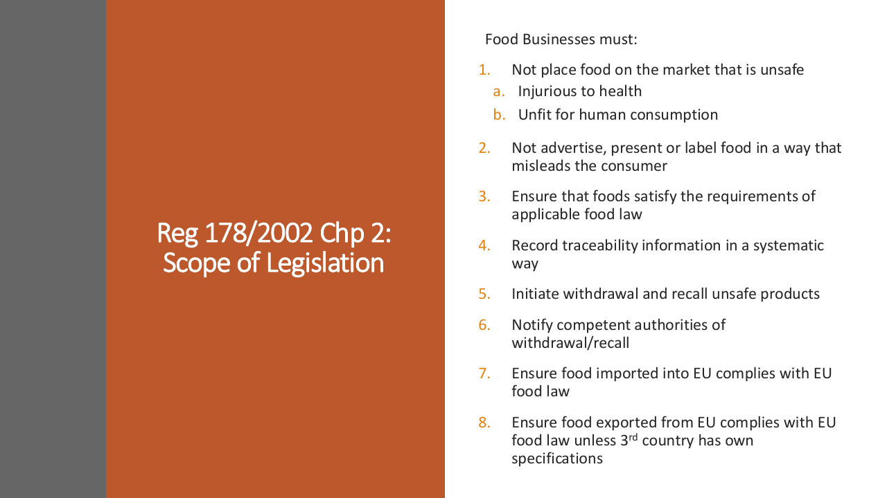

### Reg 178/2002 — Chapter 2: Food Business Obligations

Food businesses must:

1. Not place food on the market that is **unsafe**:
    a. injurious to health
    b. unfit for human consumption
2. Not advertise, present or label food in a way that **misleads the consumer**.
3. Ensure that foods satisfy the requirements of **applicable food law**.
4. Record **traceability information** in a systematic way.
5. Initiate **withdrawal and recall** of unsafe products.
6. **Notify competent authorities** of withdrawal / recall.
7. Ensure food **imported into the EU** complies with EU food law.
8. Ensure food **exported from the EU** complies with EU food law (unless the 3rd country has its own specifications).

## Slide 63

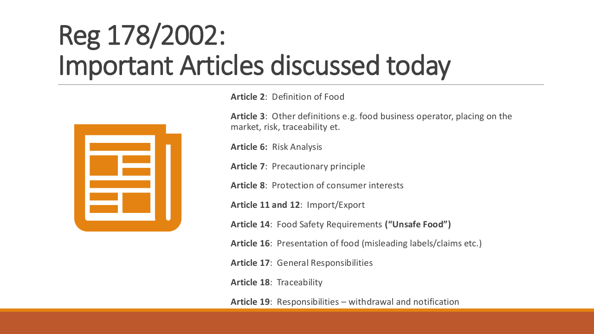

### Reg 178/2002 — Important Articles discussed today

- **Article 2** — Definition of *Food*
- **Article 3** — Other definitions (food business operator, placing on the market, risk, traceability, etc.)
- **Article 6** — Risk Analysis
- **Article 7** — Precautionary Principle
- **Article 8** — Protection of Consumer Interests
- **Articles 11 & 12** — Import / Export
- **Article 14** — Food Safety Requirements (*Unsafe Food*)
- **Article 16** — Presentation of food (misleading labels / claims etc.)
- **Article 17** — General Responsibilities
- **Article 18** — Traceability
- **Article 19** — Responsibilities — withdrawal and notification

## Slide 64

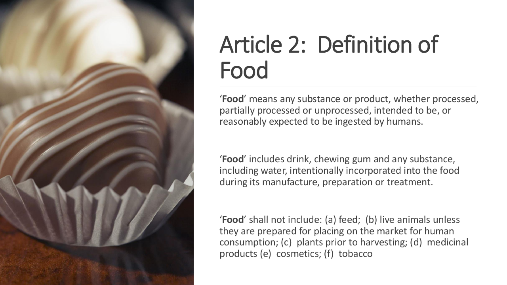

### Article 2: Definition of *Food*

> **'Food'** means any substance or product, whether processed, partially processed or unprocessed, **intended to be, or reasonably expected to be ingested by humans**.

**'Food' includes:**

- drink
- chewing gum
- and any substance, including water, intentionally incorporated into the food during its manufacture, preparation or treatment.

**'Food' shall NOT include:**

a. feed
b. live animals (unless they are prepared for placing on the market for human consumption)
c. plants prior to harvesting
d. medicinal products
e. cosmetics
f. tobacco

## Slide 65

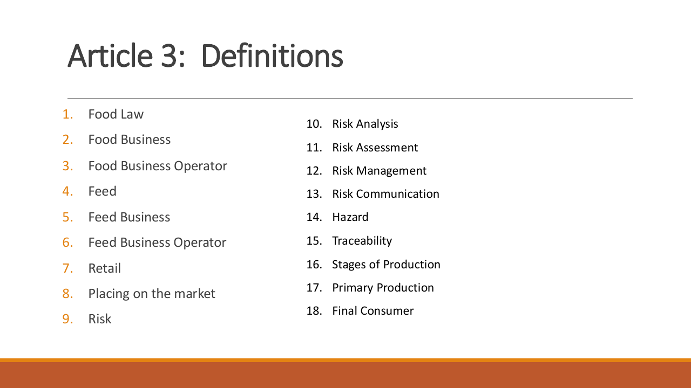

### Article 3: Definitions

Reg 178/2002 Article 3 defines **18 key terms** used throughout EU food law:

1. Food Law
2. Food Business
3. Food Business Operator
4. Feed
5. Feed Business
6. Feed Business Operator
7. Retail
8. Placing on the market
9. Risk
10. Risk Analysis
11. Risk Assessment
12. Risk Management
13. Risk Communication
14. Hazard
15. Traceability
16. Stages of Production
17. Primary Production
18. Final Consumer

## Slide 66

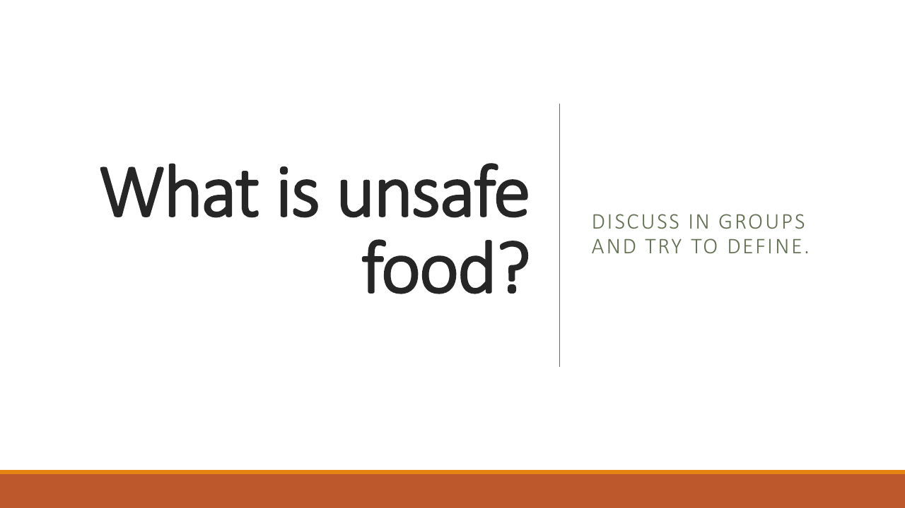

### What is unsafe food?

> **Discuss in groups and try to define.**

## Slide 67

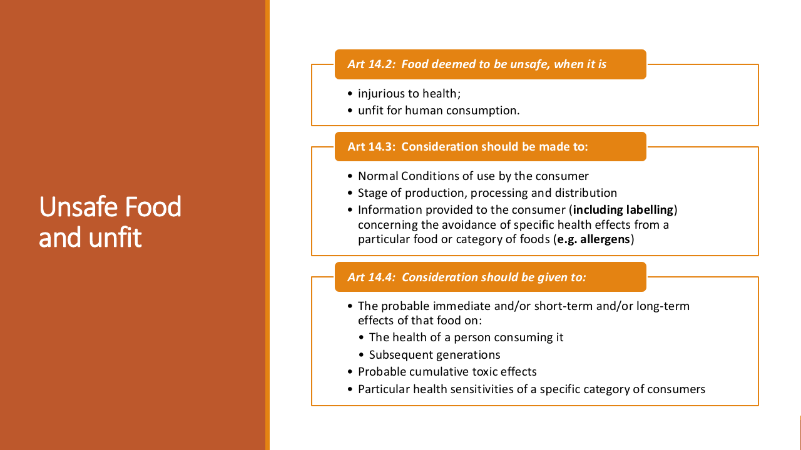

### Unsafe Food — Article 14 (parts 2–4)

**Art 14.2 — Food deemed to be unsafe when it is:**

- injurious to health
- unfit for human consumption

**Art 14.3 — Consideration should be made to:**

- Normal conditions of use by the consumer
- Stage of production, processing and distribution
- Information provided to the consumer (**including labelling**) concerning the avoidance of specific health effects from a particular food or category of foods (e.g. **allergens**)

**Art 14.4 — Consideration should be given to:**

- The probable immediate and/or short-term and/or long-term effects of that food on:
    - the health of a person consuming it
    - subsequent generations
- Probable cumulative toxic effects
- Particular health sensitivities of a specific category of consumers

## Slide 68

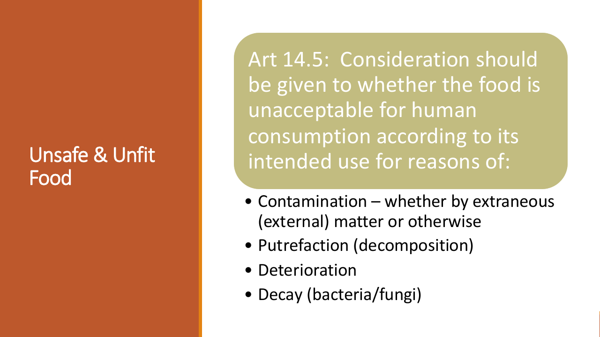

### Unsafe & Unfit Food — Article 14.5

**Art 14.5** — Consideration should be given to whether the food is **unacceptable for human consumption according to its intended use** for reasons of:

- **Contamination** — whether by extraneous (external) matter or otherwise
- **Putrefaction** (decomposition)
- **Deterioration**
- **Decay** (bacteria / fungi)

## Slide 69

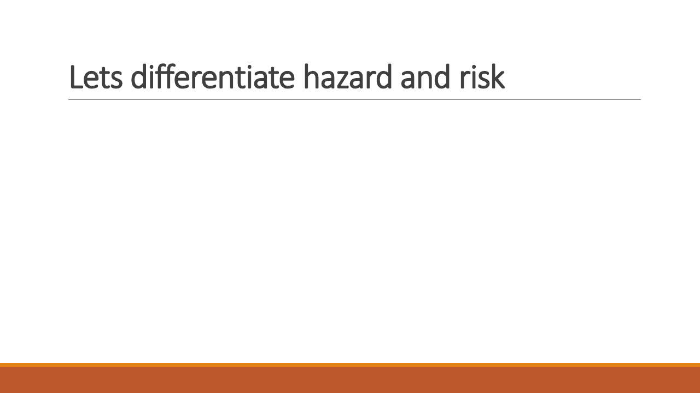

### Let's differentiate Hazard and Risk

*(Section divider — definitions follow on the next slide.)*

## Slide 70

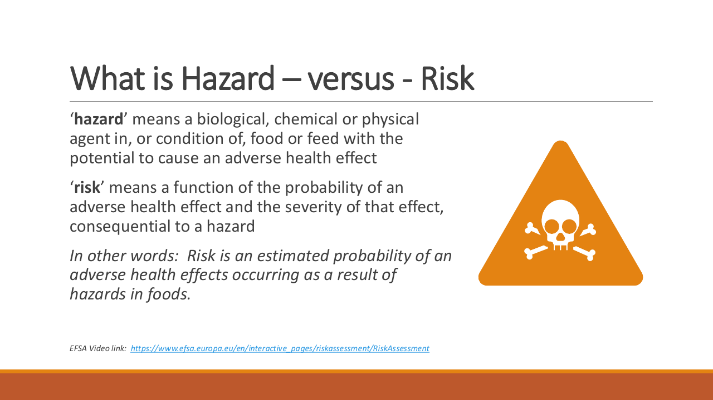

### What is Hazard versus Risk?

- **'Hazard'** means a *biological, chemical or physical agent* in, or condition of, food or feed with the **potential to cause an adverse health effect**.
- **'Risk'** means a function of the **probability** of an adverse health effect and the **severity** of that effect, consequential to a hazard.

> *In other words:* Risk is an **estimated probability** of an adverse health effect occurring as a result of hazards in foods.

*EFSA Video:* <https://www.efsa.europa.eu/en/interactive_pages/riskassessment/RiskAssessment>

## Slide 71

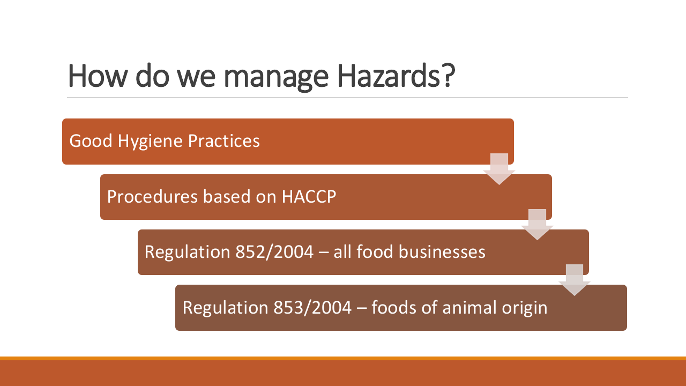

### How do we manage hazards?

A cascading approach:

1. **Good Hygiene Practices (GHP)** — foundation level.
2. **Procedures based on HACCP** — built on top of GHP.
3. **Regulation 852/2004** — applies to **all food businesses**.
4. **Regulation 853/2004** — applies specifically to **foods of animal origin**.

## Slide 72

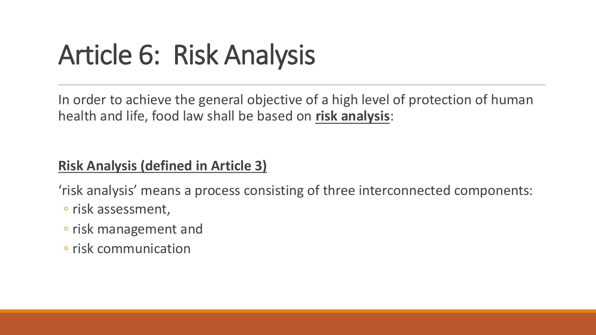

### Article 6: Risk Analysis

> In order to achieve the general objective of a **high level of protection of human health and life**, food law shall be based on **risk analysis**.

**Risk Analysis** *(defined in Article 3)* — a process consisting of three interconnected components:

- **Risk assessment**
- **Risk management**
- **Risk communication**

## Slide 73

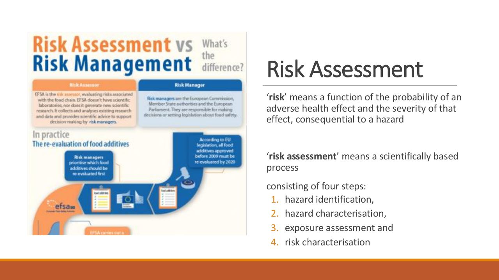

### Risk Assessment

- **'Risk'** means a function of the probability of an adverse health effect and the severity of that effect, consequential to a hazard.
- **'Risk assessment'** means a **scientifically based** process.

Consisting of **four steps**:

1. **Hazard identification**
2. **Hazard characterisation**
3. **Exposure assessment**
4. **Risk characterisation**

## Slide 74

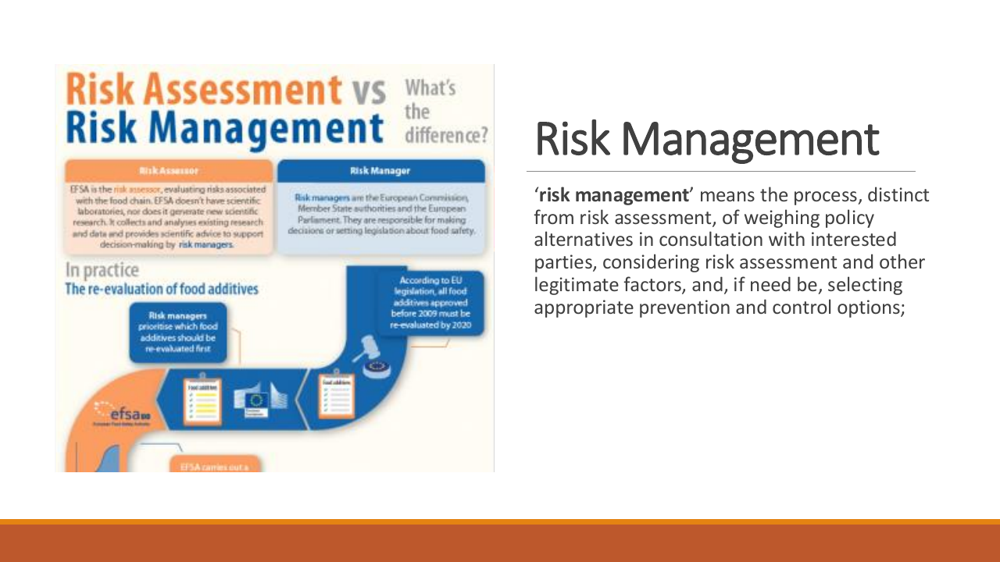

### Risk Management

> **'Risk management'** means the process, **distinct from risk assessment**, of weighing policy alternatives in consultation with interested parties, considering risk assessment and other legitimate factors, and, if need be, **selecting appropriate prevention and control options**.

## Slide 75

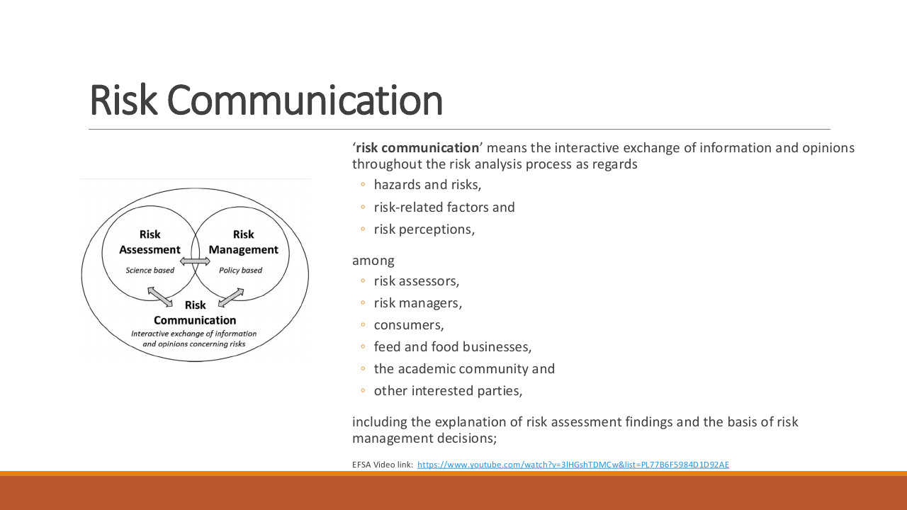

### Risk Communication

**'Risk communication'** means the **interactive exchange of information and opinions** throughout the risk analysis process as regards:

- hazards and risks
- risk-related factors
- risk perceptions

among:

- risk assessors
- risk managers
- consumers
- feed and food businesses
- the academic community
- other interested parties

This includes the explanation of risk assessment findings and the basis of risk management decisions.

*EFSA Video:* <https://www.youtube.com/watch?v=3lHGshTDMCw&list=PL77B6F5984D1D92AE>

## Slide 76

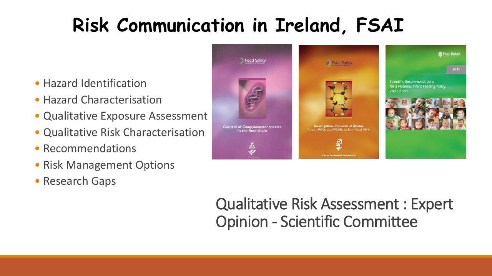

### Risk Communication in Ireland — FSAI

FSAI's risk-assessment process includes:

- Hazard Identification
- Hazard Characterisation
- Qualitative Exposure Assessment
- Qualitative Risk Characterisation
- Recommendations
- Risk Management Options
- Research Gaps

*Qualitative Risk Assessment* — expert opinion from the **FSAI Scientific Committee**.

*Example FSAI reports (shown on slide):* Control of Campylobacter species in the food chain · Investigation into levels of dioxins, furans, PCBs and PBDEs in Irish food (2004) · Scientific Recommendations for a National Infant Feeding Policy (2011).

## Slide 77

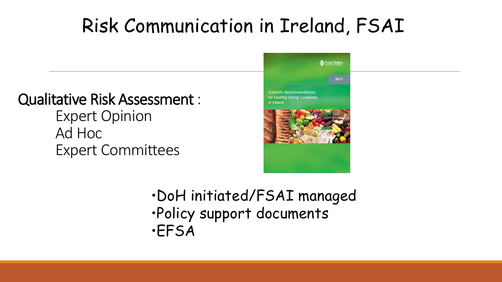

### Risk Communication in Ireland — FSAI (cont.)

**Qualitative Risk Assessment** is delivered through:

- Expert Opinion
- Ad Hoc working groups
- Expert Committees

The assessments are:

- **DoH initiated / FSAI managed**
- **Policy support documents**
- Aligned with **EFSA**

*Example shown on slide:* FSAI *"Scientific Recommendations for Healthy Eating Guidelines in Ireland"* (2011).

## Slide 78

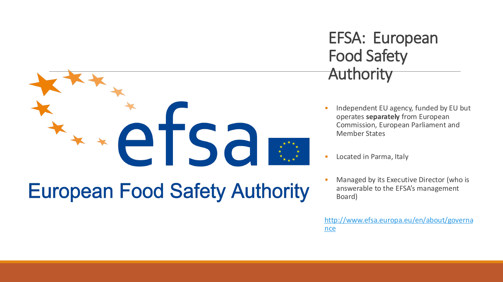

### EFSA — European Food Safety Authority

- Independent EU agency, **funded by the EU** but operates **separately** from the European Commission, European Parliament and Member States.
- Located in **Parma, Italy**.
- Managed by its **Executive Director**, who is answerable to the EFSA Management Board.

*Governance:* <http://www.efsa.europa.eu/en/about/governance>

## Slide 79

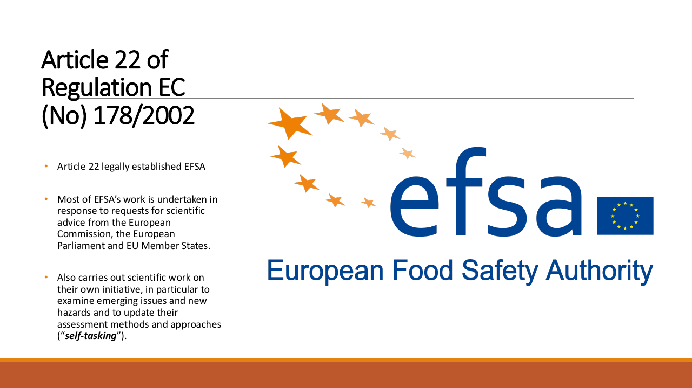

### Article 22 of Regulation (EC) No. 178/2002

- **Article 22 legally established EFSA.**
- Most of EFSA's work is undertaken in **response to requests** for scientific advice from the European Commission, the European Parliament and EU Member States.
- Also carries out scientific work on its **own initiative** — in particular to examine emerging issues and new hazards, and to update its assessment methods and approaches *(known as **"self-tasking"**)*.

## Slide 80

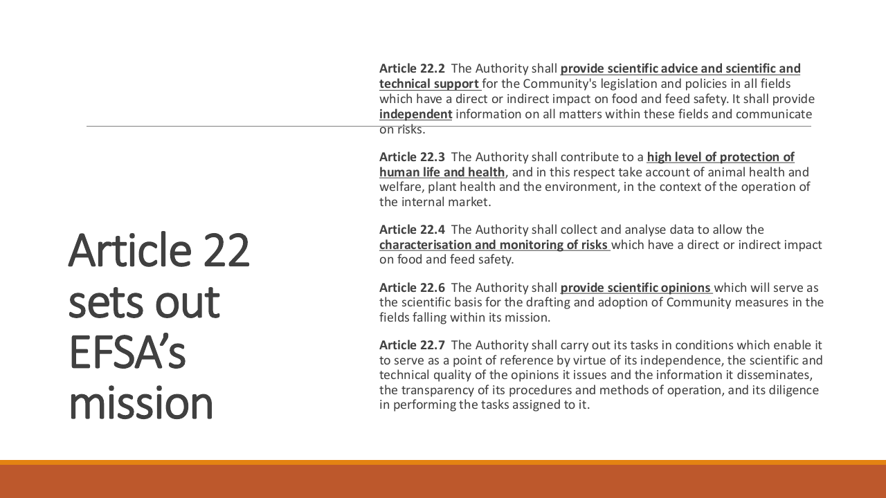

### Article 22 sets out EFSA's mission

- **Article 22.2** — The Authority shall **provide scientific advice and scientific and technical support** for the Community's legislation and policies in all fields with a direct or indirect impact on food and feed safety. It shall provide **independent** information on all matters within these fields and communicate on risks.

- **Article 22.3** — The Authority shall contribute to a **high level of protection of human life and health**, and in this respect take account of animal health and welfare, plant health and the environment, in the context of the operation of the internal market.

- **Article 22.4** — The Authority shall collect and analyse data to allow the **characterisation and monitoring of risks** which have a direct or indirect impact on food and feed safety.

- **Article 22.6** — The Authority shall **provide scientific opinions** which will serve as the scientific basis for the drafting and adoption of Community measures in the fields falling within its mission.

- **Article 22.7** — The Authority shall carry out its tasks in conditions which enable it to serve as a **point of reference** by virtue of its independence, the scientific and technical quality of its opinions, the information it disseminates, the transparency of its procedures, and its diligence in performing the tasks assigned to it.

## Slide 81

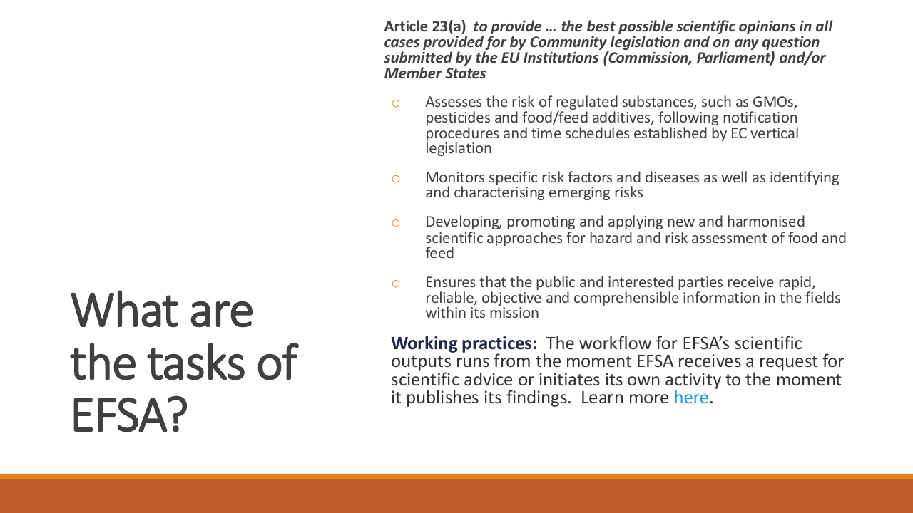

### What are the tasks of EFSA?

**Article 23(a)** — to provide *"… the best possible scientific opinions in all cases provided for by Community legislation and on any question submitted by the EU Institutions (Commission, Parliament) and/or Member States."*

- Assesses the **risk of regulated substances** — GMOs, pesticides and food/feed additives — following notification procedures and time schedules established by EC vertical legislation.
- **Monitors specific risk factors and diseases**, as well as identifying and characterising emerging risks.
- **Developing, promoting and applying new and harmonised scientific approaches** for hazard and risk assessment of food and feed.
- Ensures that the public and interested parties receive **rapid, reliable, objective and comprehensible information** in the fields within its mission.

**Working practices:** The workflow for EFSA's scientific outputs runs from the moment EFSA receives a request for scientific advice (or initiates its own activity) through to the moment it publishes its findings.

## Slide 82

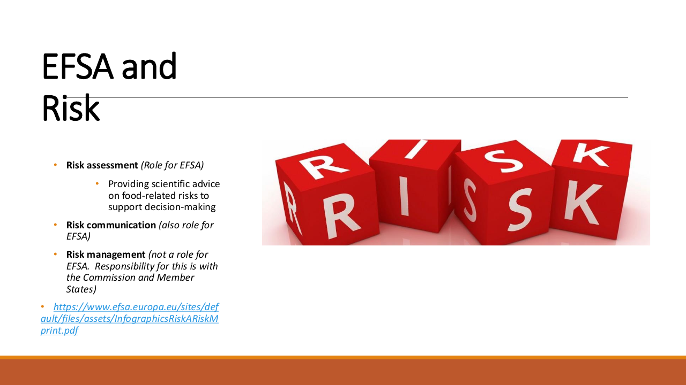

### EFSA and Risk

- **Risk assessment** *(Role for EFSA)*
  - Providing scientific advice on food-related risks to support decision-making.
- **Risk communication** *(also role for EFSA)*
- **Risk management** — *NOT a role for EFSA*. Responsibility for this is with the **Commission** and **Member States**.

*Infographic:* <https://www.efsa.europa.eu/sites/default/files/assets/InfographicsRiskARiskMprint.pdf>

## Slide 83

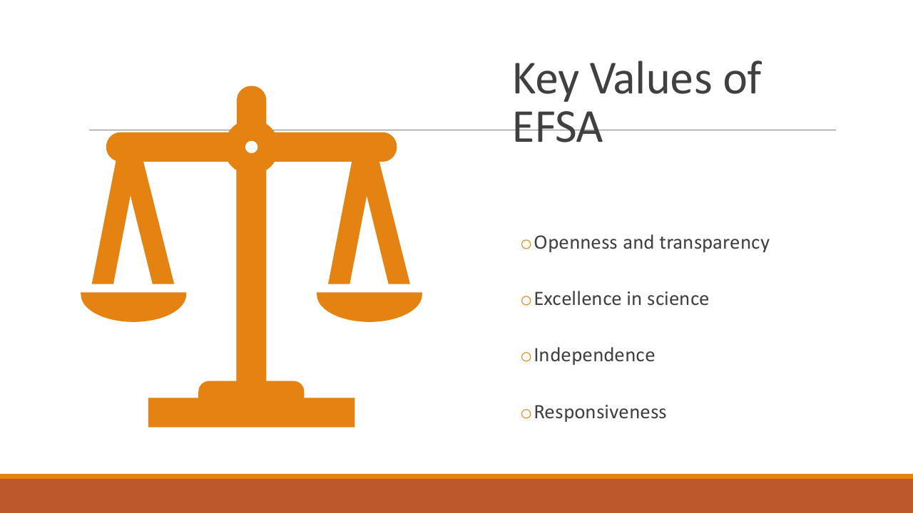

### Key Values of EFSA

- **Openness and transparency**
- **Excellence in science**
- **Independence**
- **Responsiveness**

## Slide 84

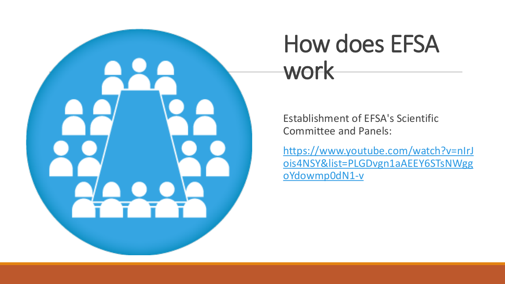

### How does EFSA work?

Establishment of **EFSA's Scientific Committee and Panels** is the core of how the agency delivers its scientific opinions.

*Video — Scientific Committee & Panels:* <https://www.youtube.com/watch?v=nIrJois4NSY&list=PLGDvgn1aAEEY6STsNWggoYdowmp0dN1-v>

## Slide 85

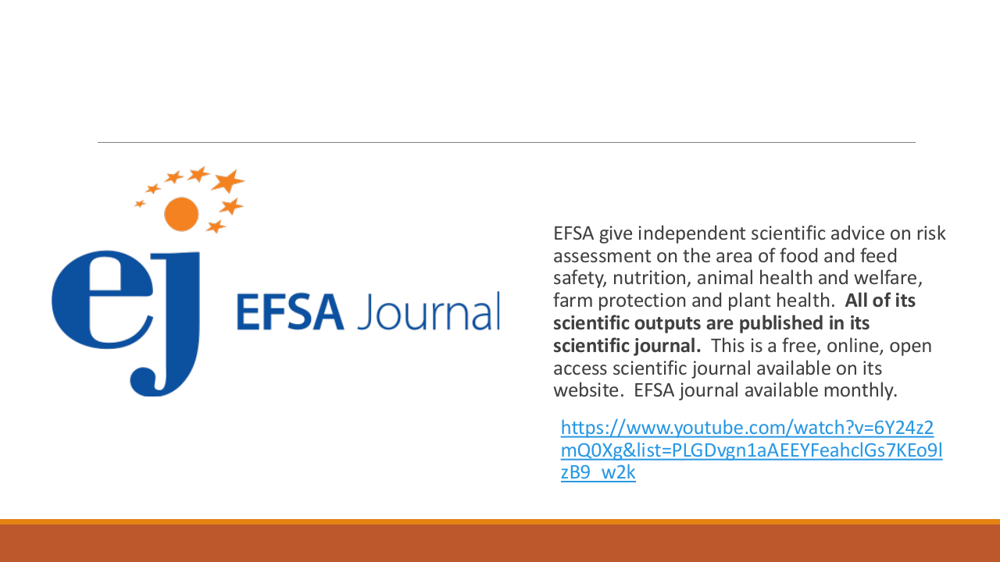

### EFSA Journal

EFSA gives independent scientific advice on **risk assessment** in the area of food and feed safety, nutrition, animal health and welfare, farm protection and plant health.

**All of its scientific outputs are published in its scientific journal** — the *EFSA Journal* — a **free, online, open-access** publication available on its website, published **monthly**.

*Video:* <https://www.youtube.com/watch?v=6Y24z2mQ0Xg&list=PLGDvgn1aAEEYFeahclGs7KEo9lzB9_w2k>

## Slide 86

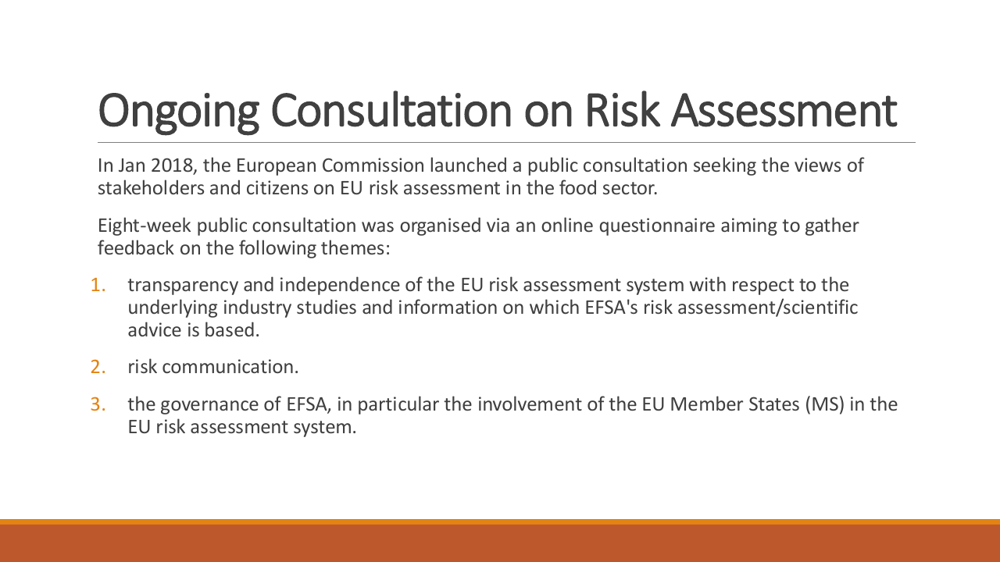

### Ongoing Consultation on Risk Assessment

In **January 2018**, the European Commission launched a public consultation seeking the views of stakeholders and citizens on EU risk assessment in the food sector.

An eight-week public consultation was organised via an online questionnaire aiming to gather feedback on the following themes:

1. **Transparency and independence** of the EU risk assessment system with respect to the underlying industry studies and information on which EFSA's risk assessment / scientific advice is based.
2. **Risk communication.**
3. **Governance of EFSA** — in particular the involvement of the EU Member States (MS) in the EU risk assessment system.

## Slide 87

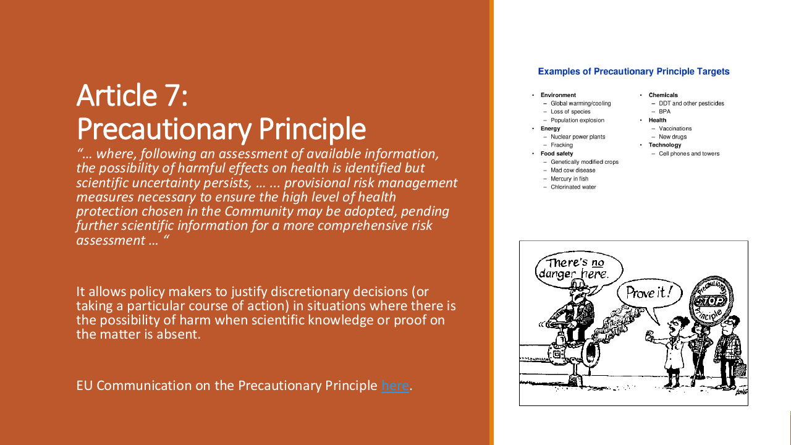

### Article 7: Precautionary Principle

> *"… where, following an assessment of available information, the possibility of harmful effects on health is identified but scientific uncertainty persists, … provisional risk management measures necessary to ensure the high level of health protection chosen in the Community may be adopted, pending further scientific information for a more comprehensive risk assessment …"*

It allows policy makers to justify **discretionary decisions** (or taking a particular course of action) in situations where there is the possibility of harm when **scientific knowledge or proof on the matter is absent**.

*EU Communication on the Precautionary Principle:* available [here](https://eur-lex.europa.eu/legal-content/EN/TXT/?uri=CELEX:52000DC0001).

*Slide also shows examples of precautionary-principle targets across:* Environment (global warming/cooling, loss of species, population explosion), Energy (nuclear power, fracking), Food safety (GMO crops, mad cow disease, mercury in fish, chlorinated water), Chemicals (DDT, BPA), Health (vaccinations, new drugs), Technology (cell phones and towers).

## Slide 88

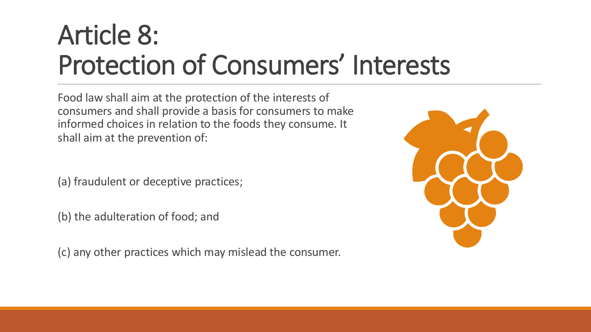

### Article 8: Protection of Consumers' Interests

> Food law shall aim at the protection of the interests of consumers and shall provide a basis for consumers to make **informed choices** in relation to the foods they consume.

It shall aim at the **prevention of**:

a. fraudulent or deceptive practices
b. the adulteration of food
c. any other practices which may mislead the consumer

## Slide 89

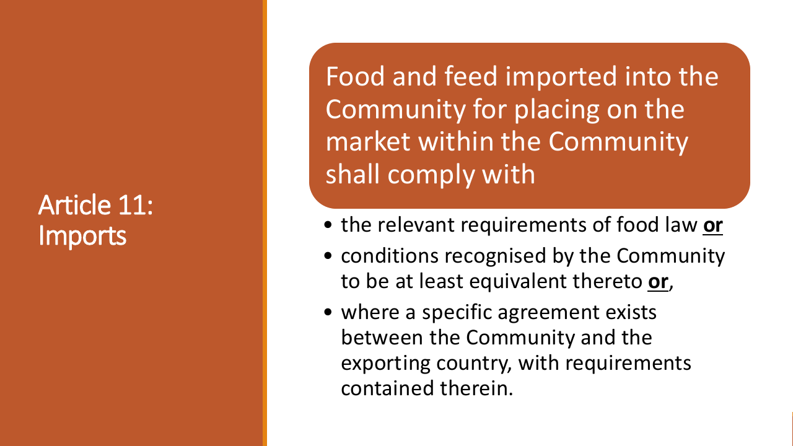

### Article 11: Imports

> Food and feed imported into the Community for placing on the market within the Community shall comply with:

- the **relevant requirements of food law**, **or**
- **conditions recognised by the Community** to be at least equivalent thereto, **or**
- where a **specific agreement** exists between the Community and the exporting country, with the requirements contained therein.

## Slide 90

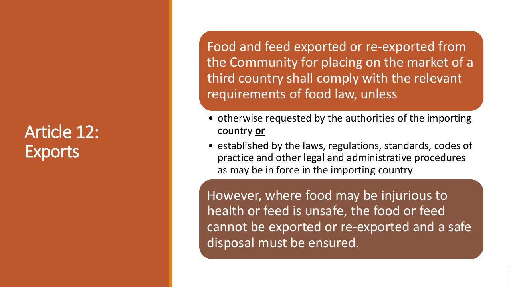

### Article 12: Exports

> Food and feed exported or re-exported from the Community for placing on the market of a third country shall comply with the relevant requirements of food law, **unless**:

- otherwise requested by the **authorities of the importing country**, **or**
- established by the laws, regulations, standards, codes of practice and other legal and administrative procedures as may be in force in the importing country.

> **However**, where food may be injurious to health or feed is unsafe, the food or feed **cannot be exported or re-exported** and a **safe disposal must be ensured**.

## Slide 91

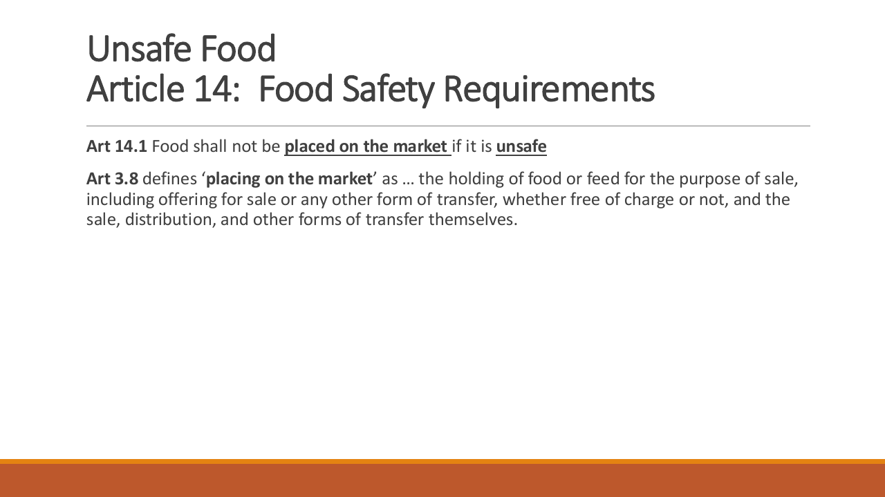

### Unsafe Food — Article 14: Food Safety Requirements

- **Art 14.1** — *Food shall not be placed on the market if it is unsafe.*
- **Art 3.8** defines **"placing on the market"** as *"… the holding of food or feed for the purpose of sale, including offering for sale or any other form of transfer, whether free of charge or not, and the sale, distribution, and other forms of transfer themselves."*

## Slide 92

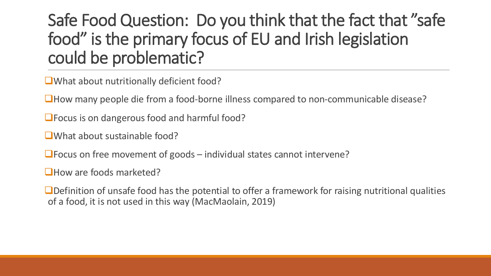

### Safe Food — Discussion

> Do you think that the fact that **"safe food"** is the primary focus of EU and Irish legislation could be problematic?

- What about **nutritionally deficient** food?
- How many people die from a **food-borne illness** compared to **non-communicable disease**?
- Focus is on **dangerous food and harmful food**?
- What about **sustainable** food?
- Focus on **free movement of goods** — individual states cannot intervene?
- How are foods **marketed**?
- Definition of unsafe food has the potential to offer a framework for raising **nutritional qualities** of a food — it is not used in this way *(MacMaolain, 2019)*.

## Slide 93

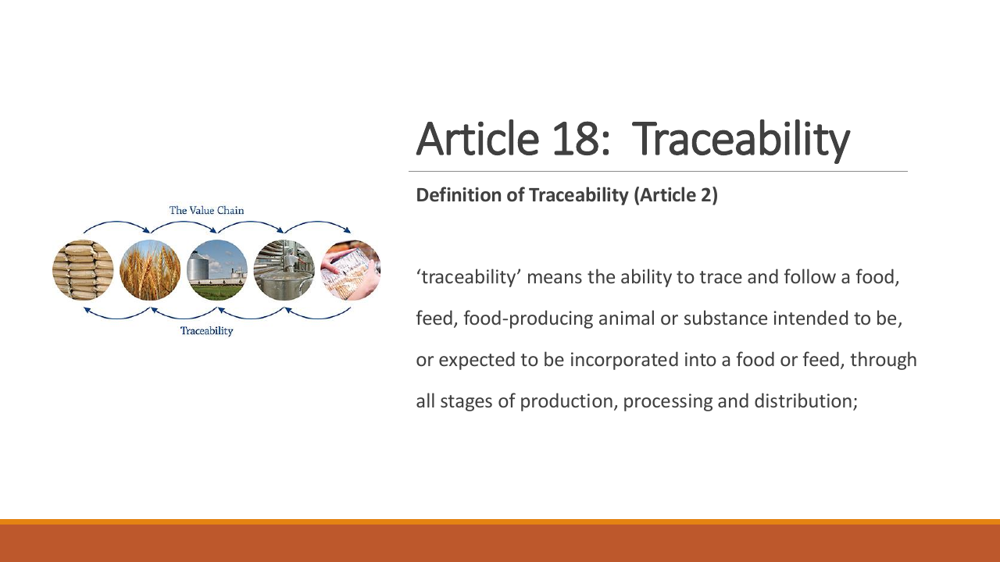

### Article 18: Traceability

**Definition of Traceability** (Article 2):

> *"Traceability"* means the ability to **trace and follow** a food, feed, food-producing animal or substance intended to be, or expected to be, incorporated into a food or feed, through **all stages of production, processing and distribution**.

## Slide 94

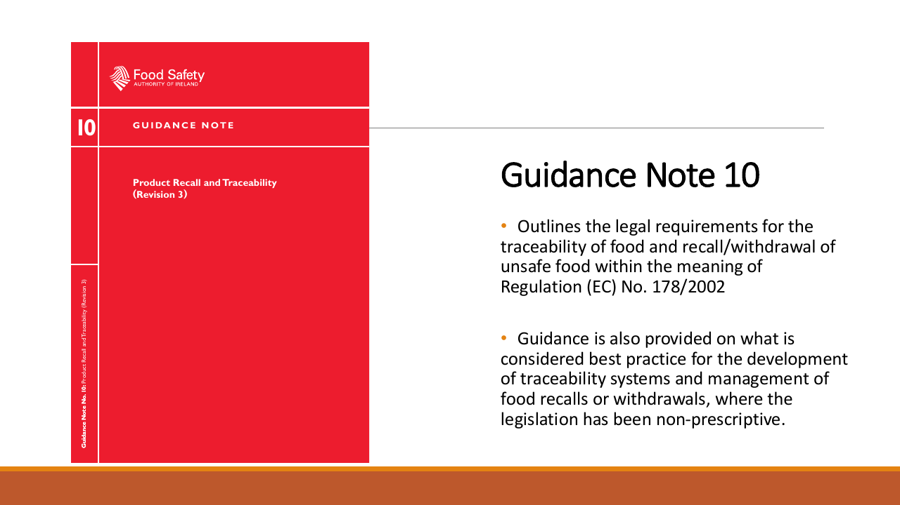

### FSAI Guidance Note 10 — Product Recall and Traceability (Revision 3)

- Outlines the **legal requirements** for the traceability of food and recall / withdrawal of unsafe food within the meaning of **Regulation (EC) No. 178/2002**.
- Provides guidance on **best practice** for the development of traceability systems and the management of food recalls or withdrawals, where the legislation has been non-prescriptive.

## Slide 95

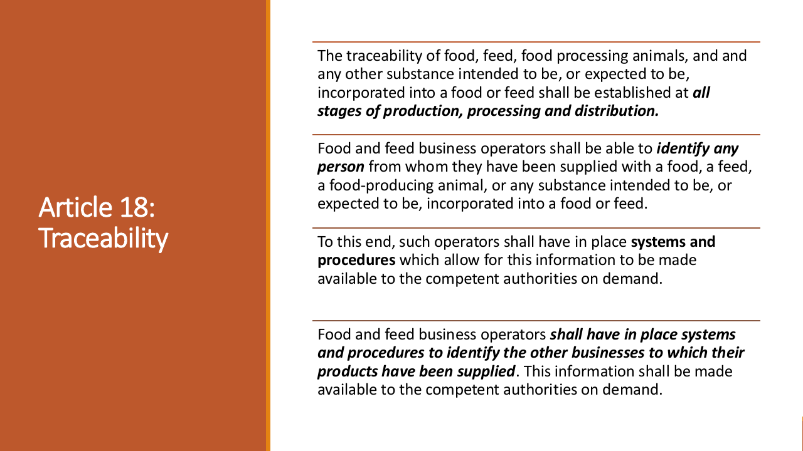

### Article 18: Traceability — full text

- The traceability of food, feed, food-processing animals, and any other substance intended to be, or expected to be, incorporated into a food or feed shall be established at **all stages of production, processing and distribution**.
- Food and feed business operators shall be able to **identify any person from whom they have been supplied** with a food, a feed, a food-producing animal, or any substance intended to be, or expected to be, incorporated into a food or feed.
- To this end, such operators shall have in place **systems and procedures** which allow this information to be made available to the competent authorities on demand.
- Food and feed business operators shall have in place **systems and procedures to identify the other businesses to which their products have been supplied**. This information shall be made available to the competent authorities on demand.

## Slide 96

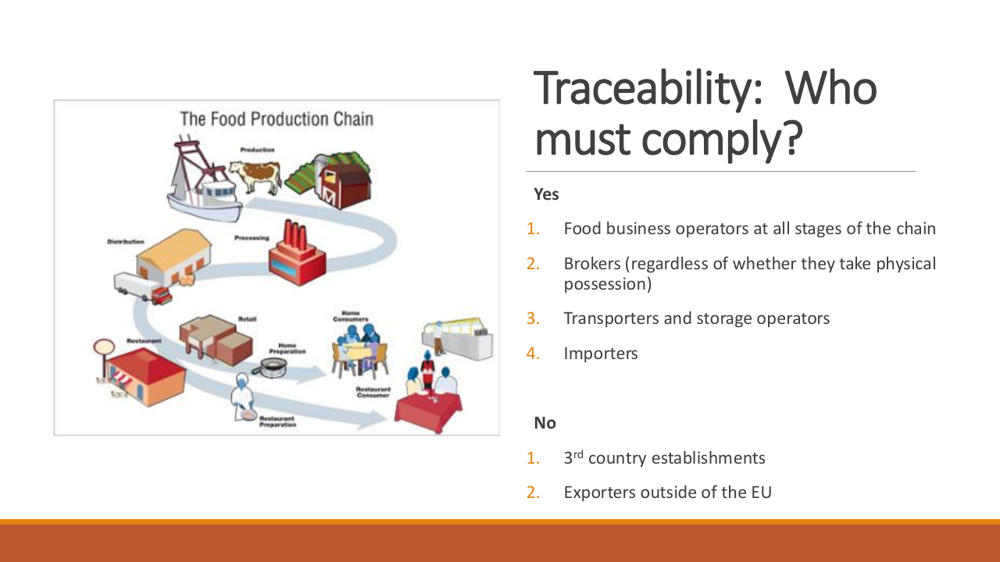

### Traceability: Who must comply?

**Yes — must comply:**

1. Food business operators at all stages of the chain
2. Brokers (regardless of whether they take physical possession)
3. Transporters and storage operators
4. Importers

**No — do not need to comply:**

1. 3rd-country establishments
2. Exporters outside of the EU

## Slide 97

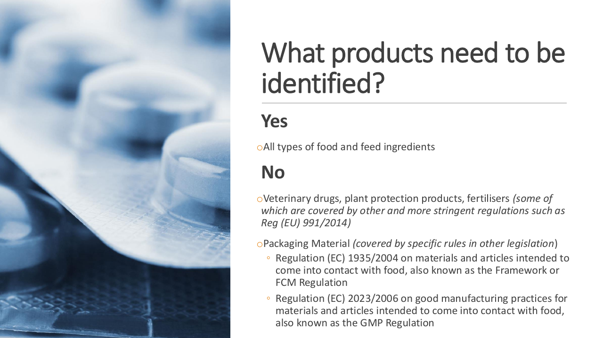

### What products need to be identified?

**Yes:**

- All types of food and feed ingredients

**No:**

- **Veterinary drugs, plant protection products, fertilisers** *(some of which are covered by other and more stringent regulations such as Reg (EU) 991/2014)*
- **Packaging Material** *(covered by specific rules in other legislation)*:
    - **Regulation (EC) 1935/2004** on materials and articles intended to come into contact with food — also known as the *Framework / FCM Regulation*
    - **Regulation (EC) 2023/2006** on good manufacturing practices for materials and articles intended to come into contact with food — also known as the *GMP Regulation*

## Slide 98

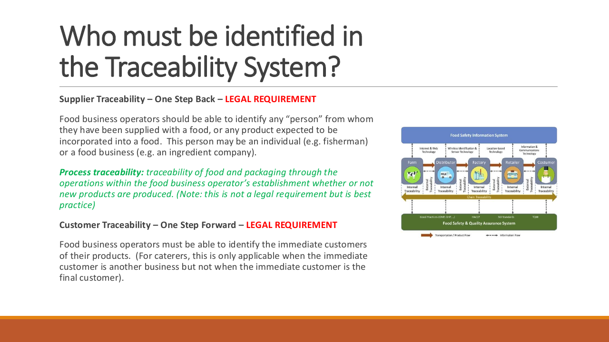

### Who must be identified in the Traceability System?

**Supplier Traceability — One Step Back — LEGAL REQUIREMENT**

> Food business operators should be able to identify any "person" from whom they have been supplied with a food, or any product expected to be incorporated into a food. This person may be an individual (e.g. fisherman) or a food business (e.g. an ingredient company).

**Process traceability** — *traceability of food and packaging through the operations within the food business operator's establishment*, whether or not new products are produced. *(Note: this is not a legal requirement but is best practice.)*

**Customer Traceability — One Step Forward — LEGAL REQUIREMENT**

> Food business operators must be able to identify the immediate customers of their products. *(For caterers, this is only applicable when the immediate customer is another business — not when the immediate customer is the final consumer.)*

## Slide 99

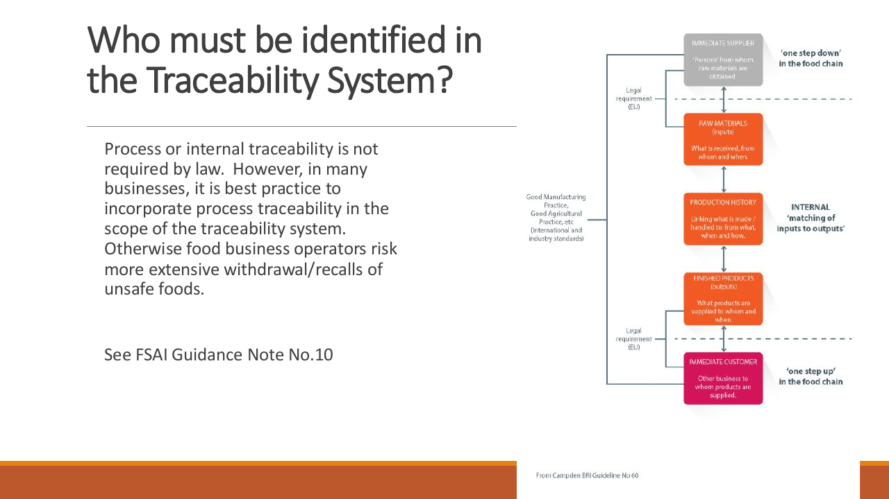

### Who must be identified in the Traceability System? *(cont.)*

> **Process or internal traceability is not required by law.** However, in many businesses it is **best practice** to incorporate process traceability into the scope of the traceability system. Otherwise food business operators risk more extensive **withdrawals / recalls** of unsafe foods.

*Reference: FSAI Guidance Note No. 10.*

*Diagram on slide* — shows the supplier → raw materials → production history → finished products → immediate customer flow, with **"one step down"** and **"one step up"** legal requirements marked.

## Slide 100

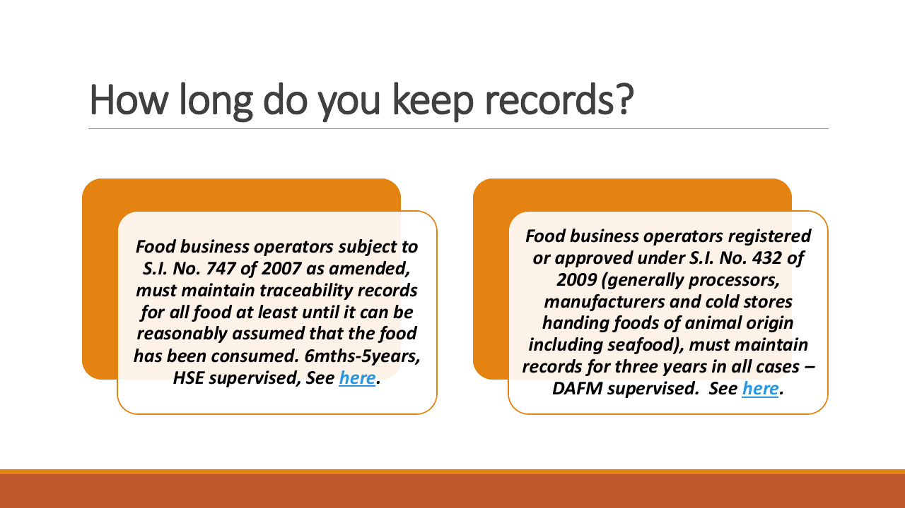

### How long do you keep records?

| Statutory Instrument | Type of business | Record retention | Supervised by |
|---|---|---|---|
| **S.I. No. 747 of 2007** (as amended) | All food businesses | Maintain records for all food **at least until it can be reasonably assumed that the food has been consumed** — typically **6 months – 5 years** | **HSE** |
| **S.I. No. 432 of 2009** | Generally processors, manufacturers and cold stores handling **foods of animal origin** (including seafood) | **3 years** in all cases | **DAFM** |

## Slide 101

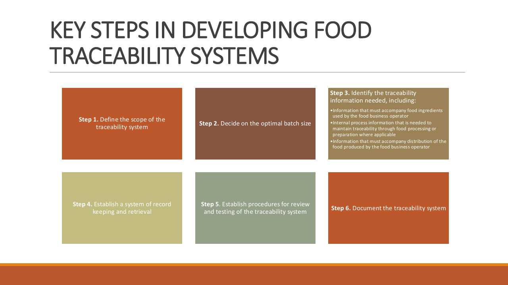

### Key Steps in Developing Food Traceability Systems

1. **Step 1** — Define the **scope** of the traceability system.
2. **Step 2** — Decide on the **optimal batch size**.
3. **Step 3** — Identify the **traceability information needed**, including:
    - Information that must accompany food ingredients used by the food business operator
    - Internal process information that is needed to maintain traceability through food processing or preparation (where applicable)
    - Information that must accompany distribution of the food produced by the food business operator
4. **Step 4** — Establish a system of **record keeping and retrieval**.
5. **Step 5** — Establish procedures for **review and testing** of the traceability system.
6. **Step 6** — **Document** the traceability system.

## Slide 102

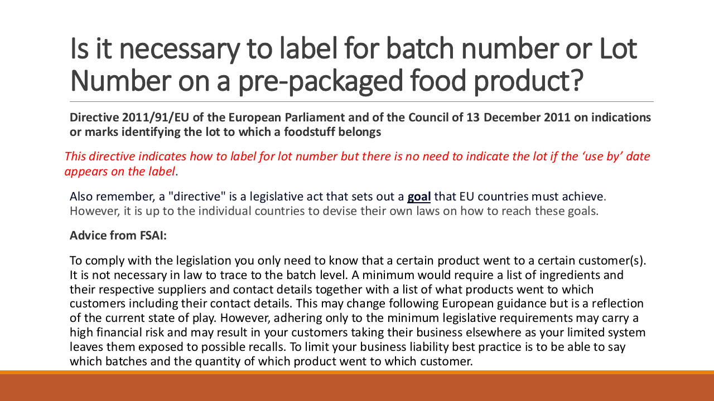

### Is it necessary to label batch / Lot Number on a pre-packaged food product?

**Directive 2011/91/EU** of the European Parliament and of the Council of 13 December 2011 on indications or marks identifying the lot to which a foodstuff belongs.

> *This directive indicates how to label for lot number — but there is no need to indicate the lot if the **'use by' date** appears on the label.*

Also remember: a **"directive"** is a legislative act that sets out a **goal** that EU countries must achieve. However, it is up to the individual countries to devise their own laws on how to reach these goals.

**Advice from FSAI:**

> To comply with the legislation you only need to know that a certain product went to a certain customer(s). It is not necessary in law to trace to the batch level. A minimum would require a list of ingredients and their respective suppliers and contact details, together with a list of what products went to which customers (including their contact details). This may change following European guidance but is a reflection of the current state of play.
>
> However, adhering only to the minimum legislative requirements may carry a **high financial risk** and may result in your customers taking their business elsewhere as your limited system leaves them exposed to possible recalls.
>
> **Best practice** is to be able to say which batches and the quantity of which product went to which customer.

## Slide 103

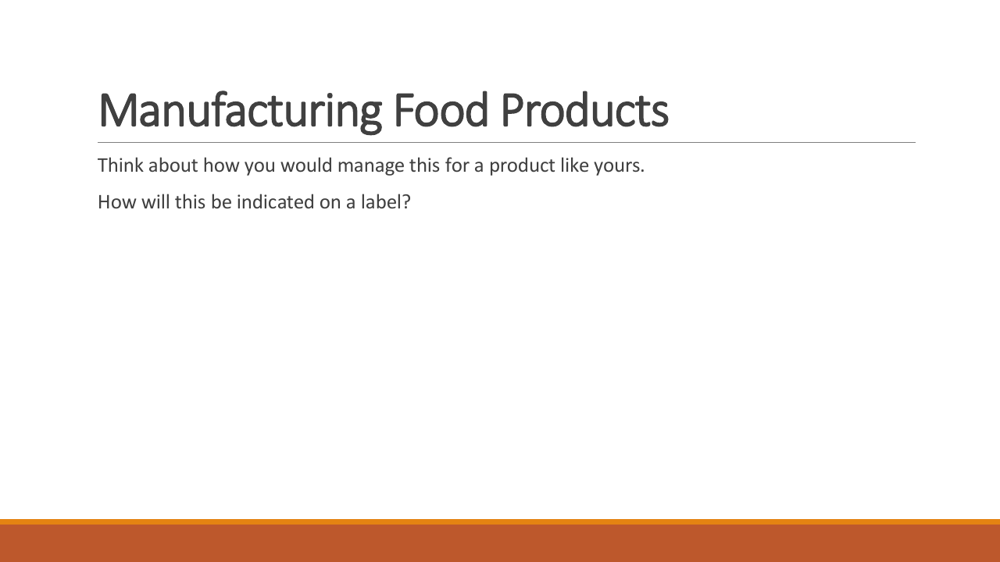

### Manufacturing Food Products — Discussion

> Think about how you would manage this **for a product like yours**.
>
> **How will this be indicated on a label?**

## Slide 104

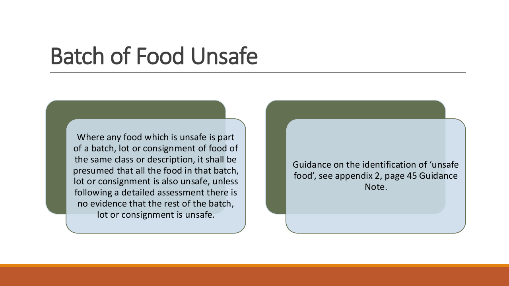

### Batch of Food Unsafe

- Where any food which is unsafe is part of a **batch, lot or consignment** of food of the same class or description, it shall be **presumed that all the food in that batch, lot or consignment is also unsafe**, unless following a **detailed assessment** there is no evidence that the rest of the batch, lot or consignment is unsafe.
- Guidance on the identification of *'unsafe food'* — see **Appendix 2, page 45** of the Guidance Note.

## Slide 105

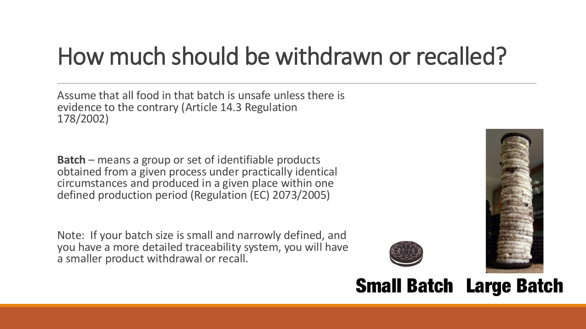

### How much should be withdrawn or recalled?

- **Assume that all food in that batch is unsafe** unless there is evidence to the contrary *(Article 14.3 of Regulation 178/2002)*.
- **Batch** — means a group or set of identifiable products obtained from a given process under practically identical circumstances and produced in a given place within one defined production period *(Regulation (EC) 2073/2005)*.

> **Note:** If your batch size is **small and narrowly defined**, and you have a **more detailed traceability system**, you will have a **smaller product withdrawal or recall**.

*Slide shows visual comparison:* small batch (single biscuit) vs. large batch (stacked column of biscuits).

## Slide 106

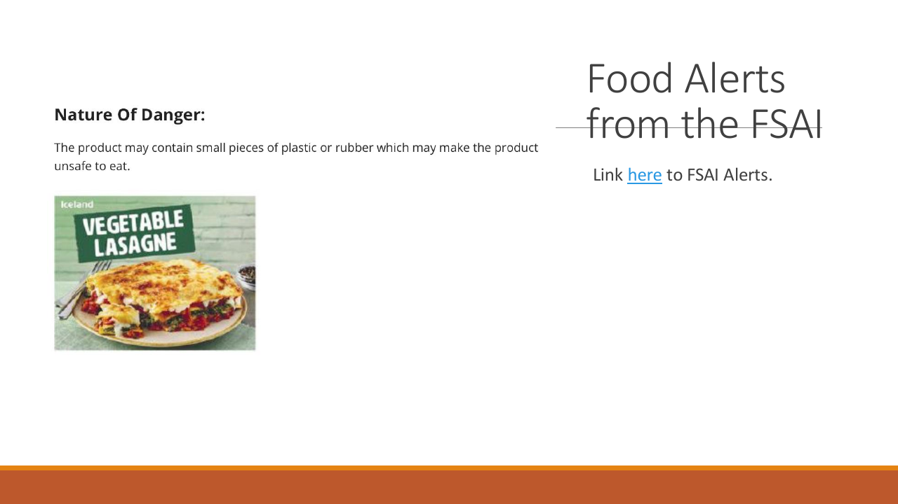

### Food Alerts from the FSAI

*Example shown on slide:* Iceland *Vegetable Lasagne* product alert.

> **Nature of Danger:** The product may contain small pieces of plastic or rubber which may make the product unsafe to eat.

*FSAI Alerts:* [link to FSAI Alerts](https://www.fsai.ie/news_centre/food_alerts.html).

## Slide 107

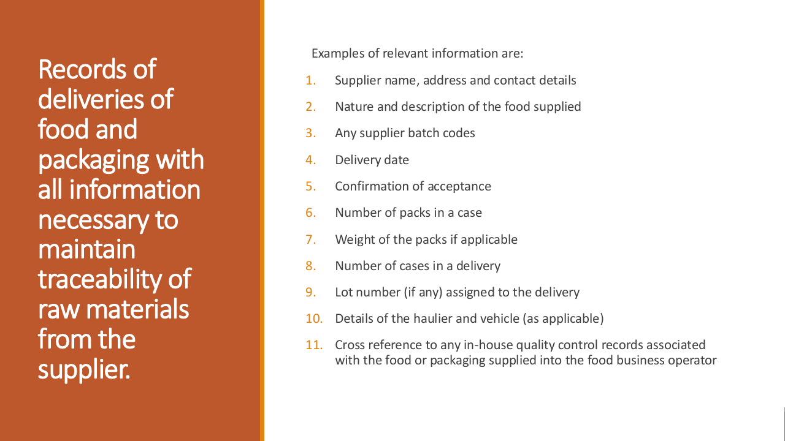

### Records of deliveries of food and packaging

Records must contain **all information necessary to maintain traceability of raw materials from the supplier**.

Examples of relevant information:

1. Supplier name, address and contact details
2. Nature and description of the food supplied
3. Any supplier batch codes
4. Delivery date
5. Confirmation of acceptance
6. Number of packs in a case
7. Weight of the packs (if applicable)
8. Number of cases in a delivery
9. Lot number (if any) assigned to the delivery
10. Details of the haulier and vehicle (as applicable)
11. Cross-reference to any in-house quality control records associated with the food or packaging supplied into the food business operator

## Slide 108

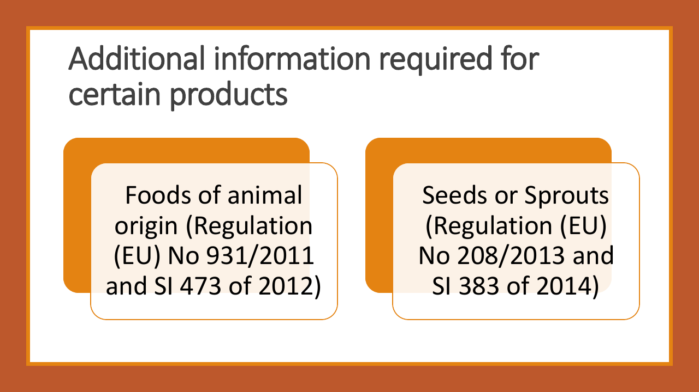

### Additional information required for certain products

| Product type | Governing regulation |
|---|---|
| **Foods of animal origin** | Regulation (EU) No 931/2011 and S.I. 473 of 2012 |
| **Seeds or sprouts** | Regulation (EU) No 208/2013 and S.I. 383 of 2014 |

## Slide 109

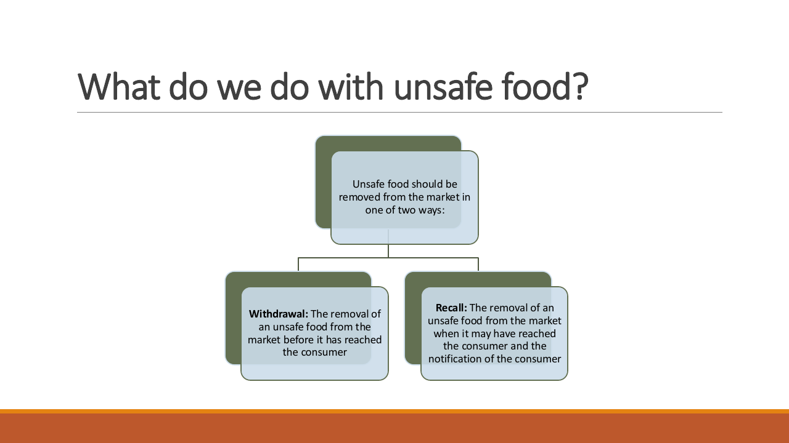

### What do we do with unsafe food?

Unsafe food should be removed from the market in **one of two ways**:

- **Withdrawal** — the removal of an unsafe food from the market **before it has reached the consumer**.
- **Recall** — the removal of an unsafe food from the market when **it may have reached the consumer**, *and* the **notification of the consumer**.

## Slide 110

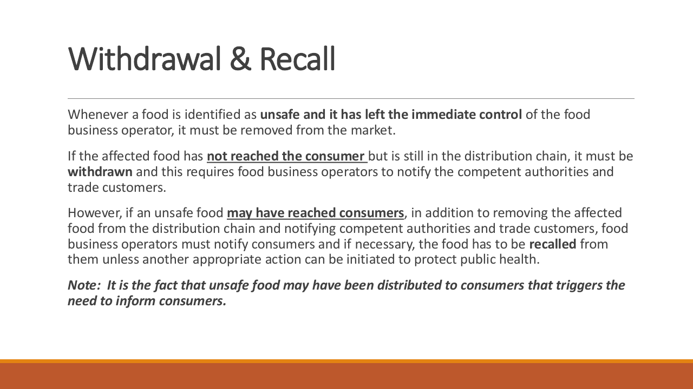

### Withdrawal & Recall

> Whenever a food is identified as **unsafe** and it has left the immediate control of the food business operator, it must be **removed from the market**.

- If the affected food has **not reached the consumer** but is still in the distribution chain, it must be **withdrawn** — requiring food business operators to notify the **competent authorities and trade customers**.
- However, if an unsafe food **may have reached consumers**, in addition to removing the affected food from the distribution chain and notifying competent authorities and trade customers, food business operators must **notify consumers** and, if necessary, the food has to be **recalled** from them — unless another appropriate action can be initiated to protect public health.

> *Note: It is the fact that unsafe food **may have been distributed to consumers** that triggers the need to inform consumers.*

## Slide 111

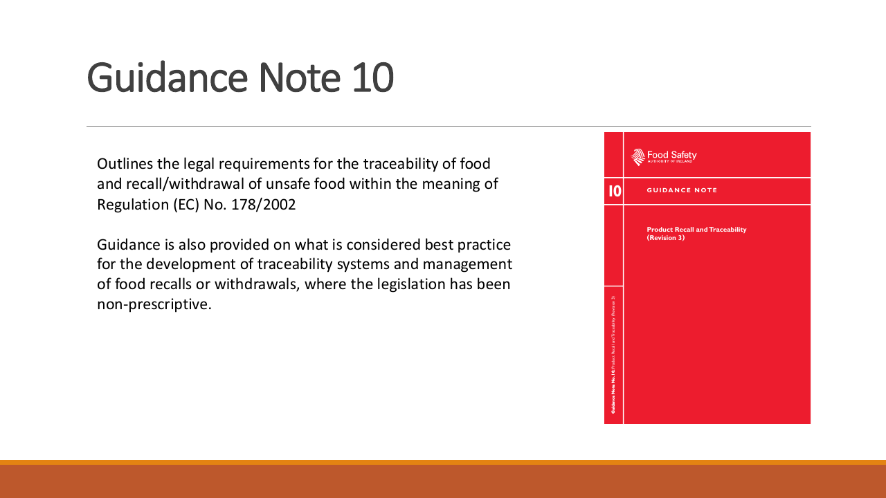

### FSAI Guidance Note 10

- Outlines the **legal requirements** for the traceability of food and recall / withdrawal of unsafe food within the meaning of **Regulation (EC) No. 178/2002**.
- Guidance is also provided on what is considered **best practice** for the development of traceability systems and management of food recalls or withdrawals, where the legislation has been non-prescriptive.

*Source:* FSAI *Product Recall and Traceability* — Guidance Note 10 (Revision 3).

## Slide 112

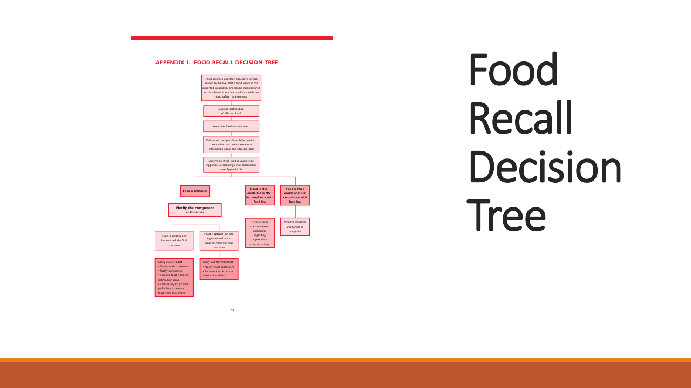

### Food Recall Decision Tree

*Source: FSAI Guidance Note 10, Appendix 1.*

The decision tree walks through the FBO's response when a food is suspected of non-compliance:

1. **FBO considers / has reason to believe** that a food it has imported, produced, processed, manufactured or distributed is **not in compliance** with food safety requirements.
2. **Suspend distribution** of the affected food.
3. **Assemble food incident team.**
4. **Collate and analyse all available product, production and quality assurance information** about the affected food.
5. **Determine if the food is unsafe** (see Appendix 2, includes a risk assessment per Appendix 3).
6. Outcome paths:
    - **Food is UNSAFE** → notify competent authorities → **Recall** (if has reached final consumer) or **Withdrawal** (if can be guaranteed not to have reached the consumer).
    - **Food is NOT unsafe but is NOT in compliance with food law** → consult with the competent authorities regarding appropriate control actions.
    - **Food is NOT unsafe and IS in compliance with food law** → monitor situation and handle as a complaint.

*Recall actions:* notify trade customers; notify consumers; remove food from the distribution chain; if necessary to protect public health, remove food from consumers.
*Withdrawal actions:* notify trade customers; remove food from the distribution chain.

*(See slide image for the full tree.)*

## Slide 113

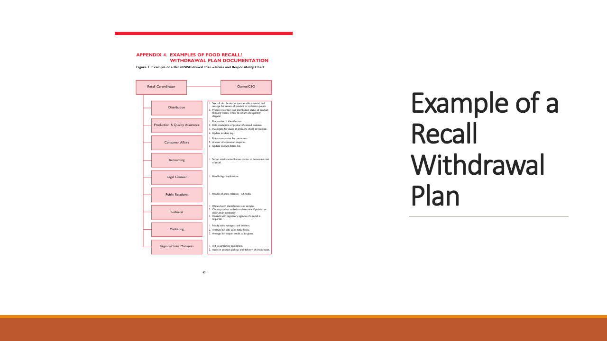

### Example of a Recall / Withdrawal Plan

*Source: FSAI Guidance Note 10, Appendix 4, Figure 1.* The plan defines **Roles and Responsibilities** under a **Recall Co-ordinator** reporting to the **Owner / CEO**:

| Function | Key responsibilities |
|---|---|
| **Distribution** | Stop all distribution of questionable material; arrange return of product to collection points; prepare inventory and distribution status (where, when, to whom, quantity) |
| **Production & Quality Assurance** | Prepare batch identification; halt production if related problem; investigate cause; check all records; update incident log |
| **Consumer Affairs** | Prepare response for consumers; answer all consumer enquiries; update contact details |
| **Accounting** | Set up stock reconciliation system to determine cost of recall |
| **Legal Counsel** | Handle legal implications |
| **Public Relations** | Handle all press releases — all media |
| **Technical** | Obtain batch identification and samples; obtain product analysis to determine if pick-up or destruction is necessary; consult with regulatory agencies if a recall is required |
| **Marketing** | Notify sales managers and brokers; arrange for pick-up at retail levels; arrange for proper credit to be given |
| **Regional Sales Managers** | Aid in contacting customers; assist in product pick-up and delivery of credit notes |

*(See slide image for the chart.)*

## Slide 114

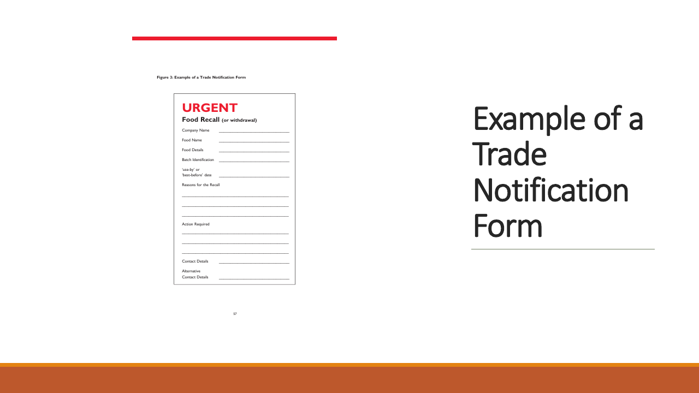

### Example of a Trade Notification Form

*Source: FSAI Guidance Note 10, Appendix 4, Figure 3.*

The template form (titled **URGENT — Food Recall (or Withdrawal)**) captures the following fields:

- **Company Name**
- **Food Name**
- **Food Details**
- **Batch Identification**
- **'Use-by'** or **'Best-before'** date
- **Reasons for the Recall** (free-text)
- **Action Required** (free-text)
- **Contact Details**
- **Alternative Contact Details**

*(See slide image for the form layout.)*

## Slide 115

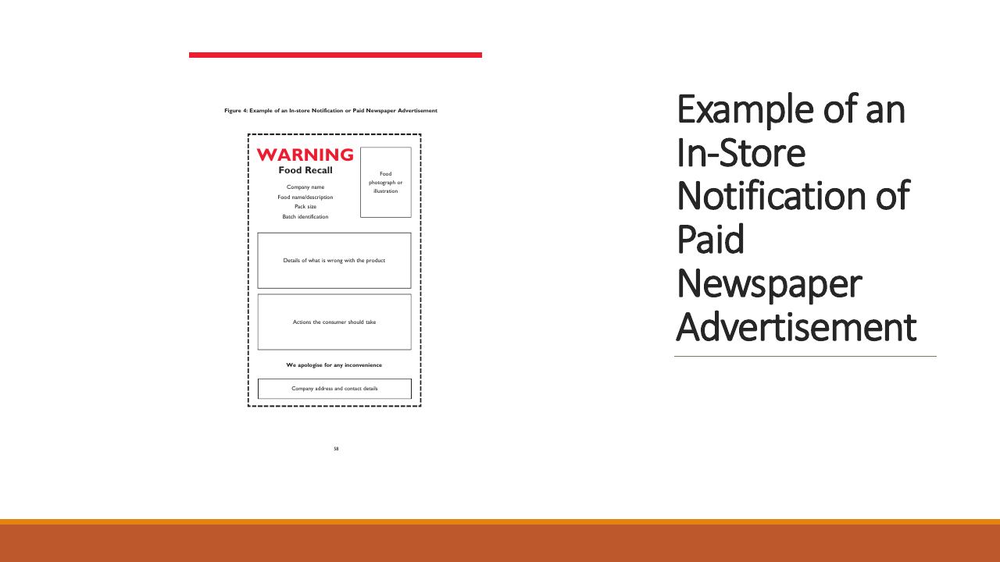

### Example of an In-Store Notification or Paid Newspaper Advertisement

*Source: FSAI Guidance Note 10, Appendix 4, Figure 4.*

The template (headlined **WARNING — Food Recall**) contains:

- **Company name**
- **Food name / description**
- **Pack size**
- **Batch identification**
- **Details of what is wrong with the product**
- **Actions the consumer should take**
- *"We apologise for any inconvenience"*
- **Company address and contact details**
- *Product photograph or illustration*

*(See slide image for the layout.)*

## Slide 116

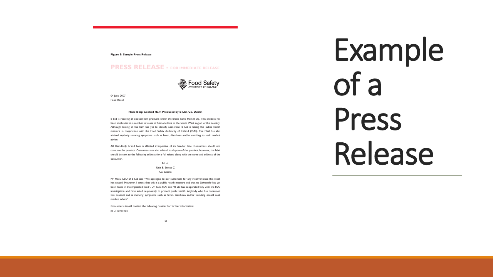

### Example of a Press Release

*Source: FSAI Guidance Note 10, Appendix 4, Figure 5.* A worked example for an **Immediate Release** food recall:

> **PRESS RELEASE — FOR IMMEDIATE RELEASE**
> 04 June 2007 — Food Recall
>
> **Ham-It-Up Cooked Ham Produced by B Ltd, Co. Dublin**
>
> B Ltd is recalling all cooked ham products under the brand name *Ham-It-Up*. This product has been implicated in a number of cases of Salmonellosis in the South West region of the country. Although testing of the ham has yet to identify Salmonella, B Ltd is taking this public health measure in conjunction with the **Food Safety Authority of Ireland (FSAI)**. The FSAI has also advised anybody showing symptoms such as fever, diarrhoea and/or vomiting to seek medical advice.
>
> All Ham-It-Up brand ham is affected irrespective of its 'use-by' date. Consumers should not consume the product. Consumers are also advised to dispose of the product; however, the label should be sent to the following address for a full refund along with the name and address of the consumer.
>
> *B Ltd., Unit B, Street C, Co. Dublin*
>
> Mr Meat, CEO of B Ltd, said: *"We apologise to our customers for any inconvenience this recall has caused. However, I stress that this is a public health measure and that no Salmonella has yet been found in the implicated food."*
>
> Dr Safe, FSAI, said: *"B Ltd has cooperated fully with the FSAI investigation and have acted responsibly to protect public health. Anybody who has consumed this product and is showing symptoms such as fever, diarrhoea and/or vomiting should seek medical advice."*
>
> Consumers should contact the following number for further information: 01-112211223.

## Slide 117

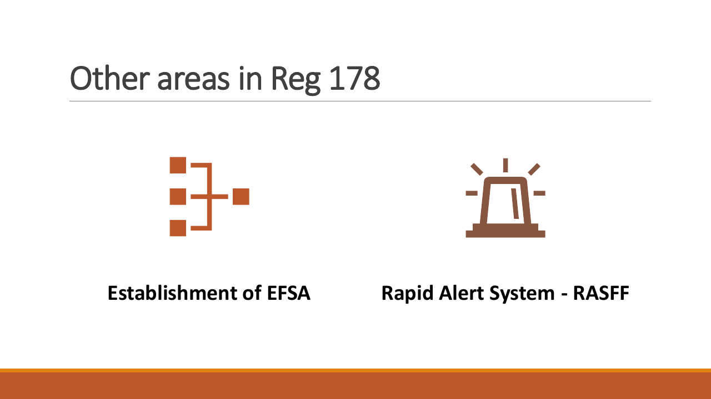

### Other areas in Reg 178

Two additional pillars introduced by Regulation 178/2002:

- **Establishment of EFSA** — the independent European Food Safety Authority.
- **Rapid Alert System — RASFF** — the EU's *Rapid Alert System for Food & Feed*.

## Slide 118

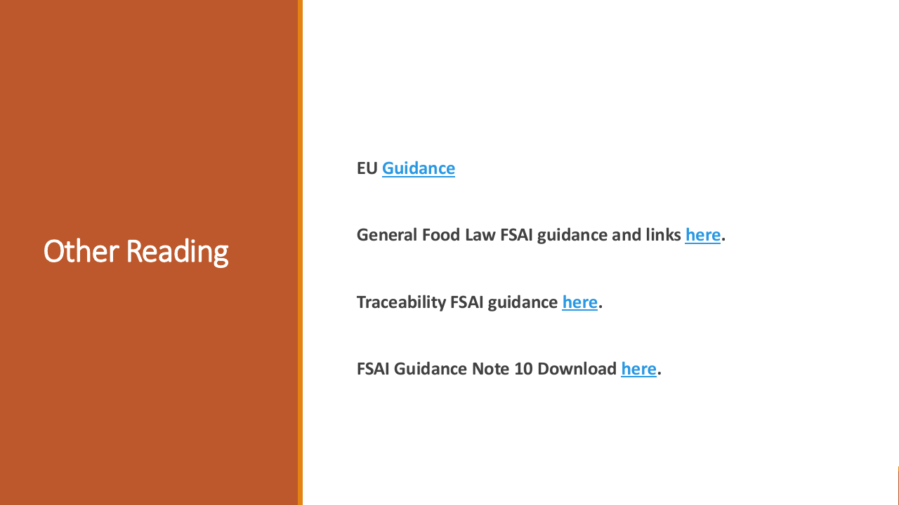

### Other Reading

- **EU Guidance** — see Brightspace.
- **General Food Law — FSAI guidance and links** — see [here](https://www.fsai.ie/legislation/general-food-law/).
- **Traceability — FSAI guidance** — see [here](https://www.fsai.ie/legislation/general-food-law/traceability/).
- **FSAI Guidance Note 10** — download [here](https://www.fsai.ie/publications/guidance_notes.html).

## Slide 119

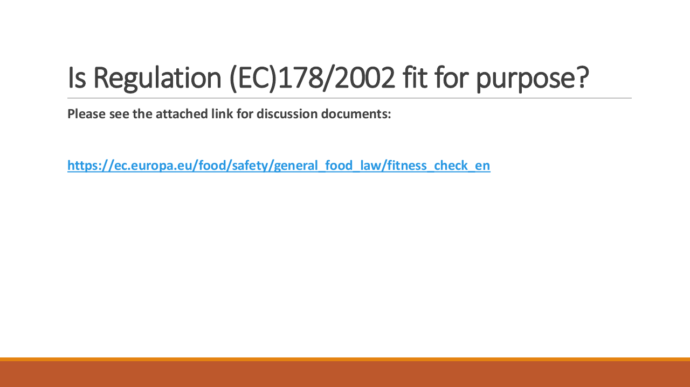

### Is Regulation (EC) 178/2002 fit for purpose?

**Please see the attached link for discussion documents:**

<https://ec.europa.eu/food/safety/general_food_law/fitness_check_en>

## Slide 120


### ?

*(End-of-section discussion divider — see image.)*

## Slide 121

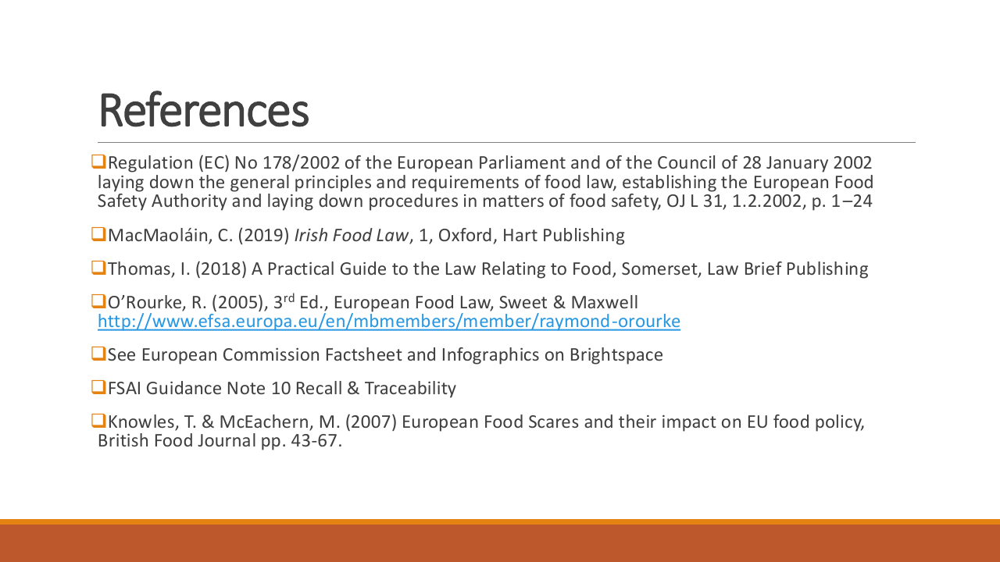

### References

- **Regulation (EC) No 178/2002** of the European Parliament and of the Council of 28 January 2002 laying down the general principles and requirements of food law, establishing the European Food Safety Authority and laying down procedures in matters of food safety. *OJ L 31, 1.2.2002, p. 1–24.*
- **MacMaoláin, C.** (2019) *Irish Food Law*, 1st ed., Oxford, Hart Publishing.
- **Thomas, I.** (2018) *A Practical Guide to the Law Relating to Food*, Somerset, Law Brief Publishing.
- **O'Rourke, R.** (2005) *European Food Law*, 3rd ed., Sweet & Maxwell — <http://www.efsa.europa.eu/en/mbmembers/member/raymond-orourke>
- See **European Commission Factsheet and Infographics** on Brightspace.
- **FSAI Guidance Note 10** — Recall & Traceability.
- **Knowles, T. & McEachern, M.** (2007) "European Food Scares and their impact on EU food policy", *British Food Journal*, pp. 43–67.

## Slide 122

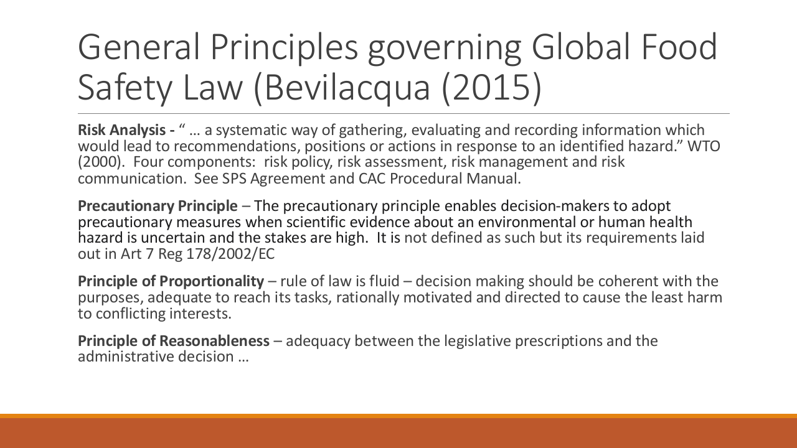

### General Principles governing Global Food Safety Law *(recap)*

*Source: Bevilacqua (2015) — same content as slide 18, repeated here as a recap before Q&A.*

- **Risk Analysis** — *"… a systematic way of gathering, evaluating and recording information which would lead to recommendations, positions or actions in response to an identified hazard."* (WTO, 2000). Four components: risk policy, risk assessment, risk management, risk communication. See SPS Agreement and CAC Procedural Manual.

- **Precautionary Principle** — Enables decision-makers to adopt precautionary measures when scientific evidence about an environmental or human-health hazard is uncertain and the stakes are high. Not formally defined as such, but its requirements are laid out in **Art 7 of Reg (EC) 178/2002**.

- **Principle of Proportionality** — The rule of law is fluid; decision-making should be coherent with the purposes, adequate to reach its tasks, rationally motivated, and directed to cause the least harm to conflicting interests.

- **Principle of Reasonableness** — Adequacy between the legislative prescriptions and the administrative decision.

## Slide 123

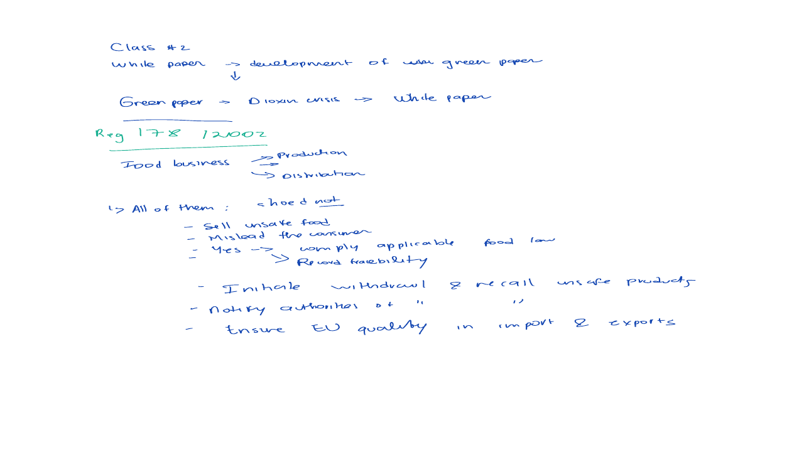

### Handwritten lecture notes — Class 2 recap

*(Image is a photo of handwritten lecture-notes. Transcription below.)*

> **Class 2**
>
> White paper → development of un[der] green paper
>
> Green paper → Dioxin crisis → White paper
>
> **Reg 178/2002**
>
> Food business → Production / Distribution
>
> All of them **should not**:
>
> - Sell unsafe food
> - Mislead the consumer
> - **Yes** → comply [with] applicable food law → Record traceability
> - Initiate withdrawal & recall [of] unsafe products
> - Notify authorities of [withdrawal/recall]
> - Ensure EU quality in import & exports

## Slide 124

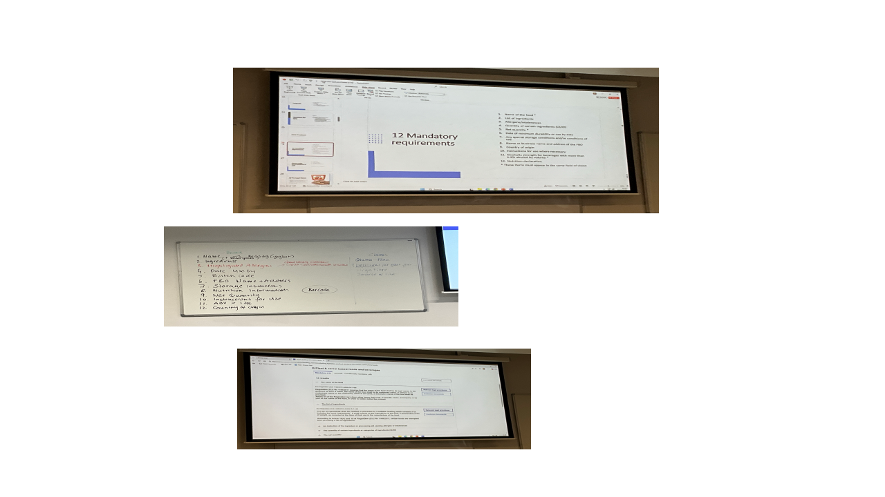

### Photos — lecture-room screens & whiteboard

*(Image-only slide — see image. No extractable digital text.)*

Photos of lecture-room screens and a whiteboard. The whiteboard lists handwritten items under the heading **"12 Mandatory requirements"** alongside a barcode example and references to FBO labelling fields. The other panels show projected PowerPoint slides and a printed document on a screen.

---

<a id="lecture-3"></a>

# Lecture 3 — Week 4 (18 February 2026): Food Information to Consumers (FIC) Regulation 1169/2011

**Topics:** FIC Reg 1169/2011 · FLIS · date of minimum durability · mandatory information · allergens (14 major allergens) · labelling rules

**Slides:** 125–227 (103 slides)

## Slide 125

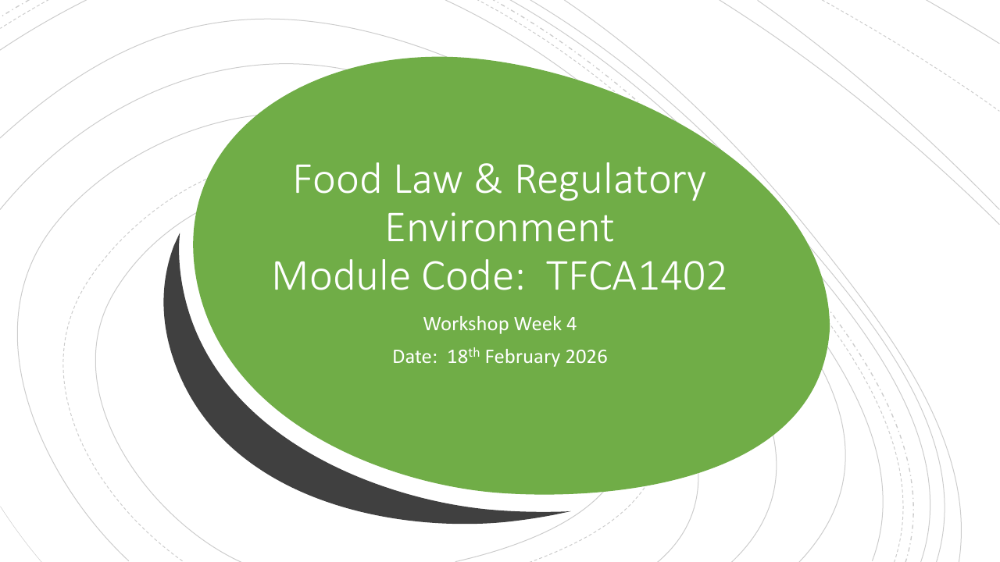

### Food Law & Regulatory Environment — Workshop Week 4

| | |
|---|---|
| **Module code** | TFCA1402 |
| **Workshop** | Week 4 |
| **Date** | 18th February 2026 |

## Slide 126

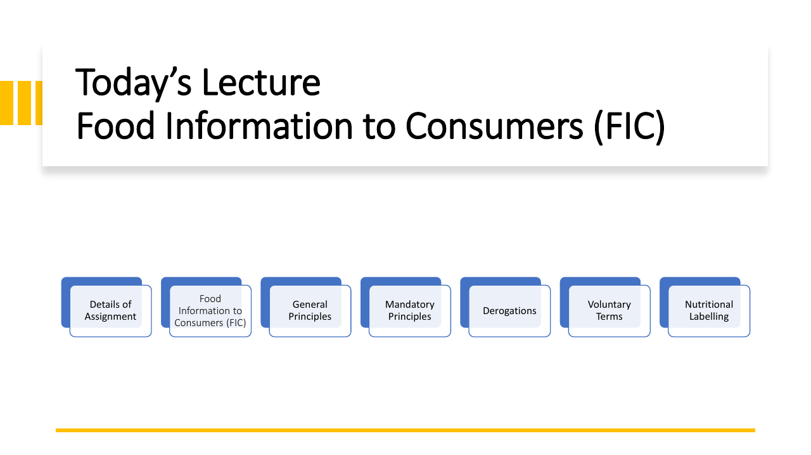

### Today's Lecture — Food Information to Consumers (FIC)

Today's topics:

1. **Details of Assignment**
2. **Food Information to Consumers (FIC)**
3. **General Principles**
4. **Mandatory Principles**
5. **Derogations**
6. **Voluntary Terms**
7. **Nutritional Labelling**

## Slide 127

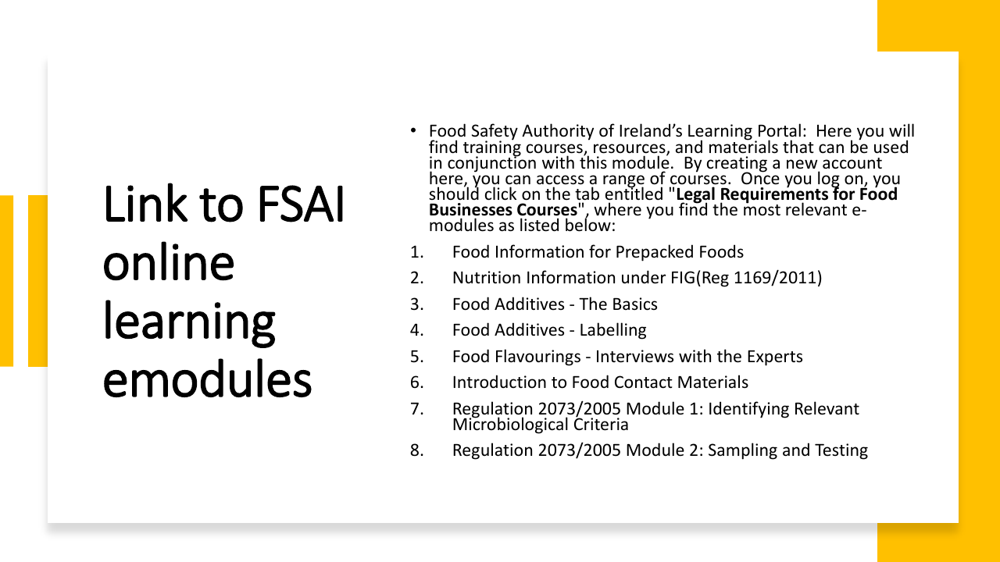

### Link to FSAI Online E-Modules

**Food Safety Authority of Ireland's Learning Portal** — provides training courses, resources, and materials that can be used in conjunction with this module. Create an account to access a range of courses. Once logged in, click on the tab entitled **"Legal Requirements for Food Businesses Courses"**, where you can find the most relevant e-modules:

1. Food Information for Prepacked Foods
2. Nutrition Information under FIC (Reg 1169/2011)
3. Food Additives — The Basics
4. Food Additives — Labelling
5. Food Flavourings — Interviews with the Experts
6. Introduction to Food Contact Materials
7. Regulation 2073/2005 Module 1: Identifying Relevant Microbiological Criteria
8. Regulation 2073/2005 Module 2: Sampling and Testing

## Slide 128

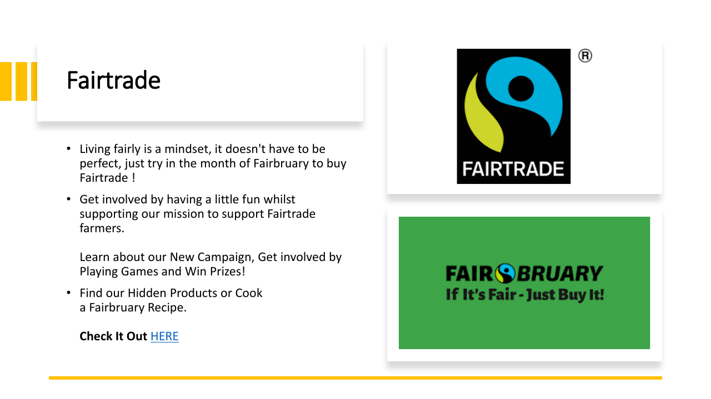

### Fairtrade

- Living fairly is a mindset — *it doesn't have to be perfect*. Try, in the month of **Fairbruary**, to buy Fairtrade.
- Get involved by having a little fun whilst supporting our mission to support **Fairtrade farmers**.
- Find Hidden Products or cook a Fairbruary Recipe.

Learn about the new campaign — get involved by playing games and winning prizes.

*Check it out:* [HERE](https://www.fairtrade.ie/).

## Slide 129

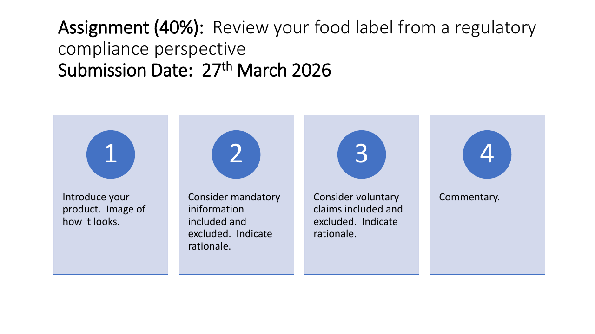

### Assignment (40 %) — *Submission Date: 27 March 2026*

> **Review your food label from a regulatory compliance perspective.**

1. **Introduce your product** — include an image of how it looks.
2. **Consider mandatory information** included and excluded — indicate rationale.
3. **Consider voluntary claims** included and excluded — indicate rationale.
4. **Commentary**.

## Slide 130

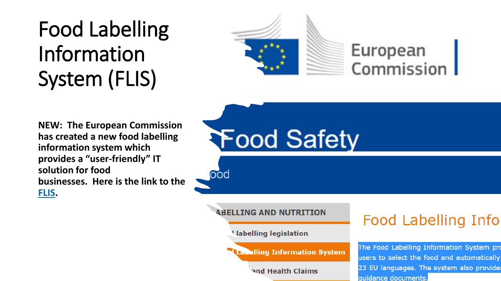

### Food Labelling Information System (FLIS)

> **NEW:** The European Commission has created a **new food labelling information system** which provides a *"user-friendly"* IT solution for food businesses.

Here is the link to the **[FLIS](https://ec.europa.eu/food/safety/labelling_nutrition/food_labelling_information_system_en)**.

## Slide 131


### Nutritics Software

**Nutritics** software is available to all students. An email with login details has been sent — *have you received it and signed on yet?*

## Slide 132

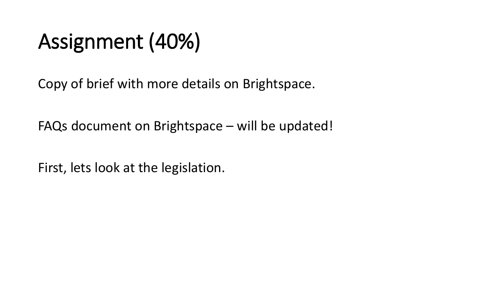

### Assignment (40 %)

- Copy of brief with more details on **Brightspace**.
- **FAQs document** on Brightspace — will be updated.
- First, let's look at the legislation.

## Slide 133

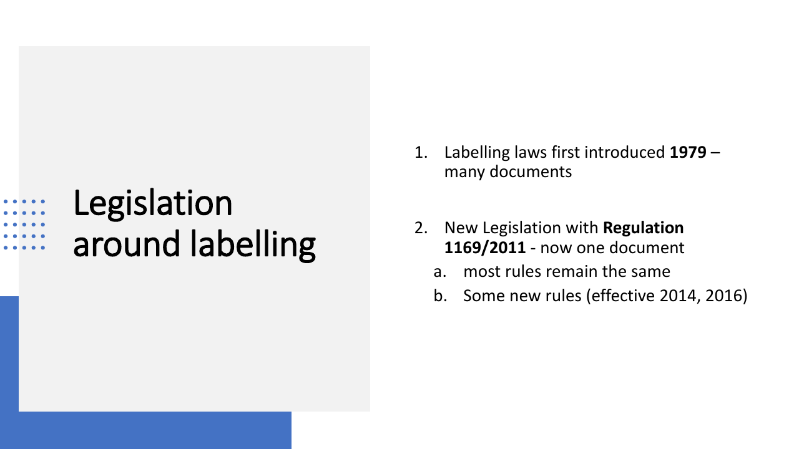

### Legislation around Labelling

1. Labelling laws first introduced **1979** — many documents.
2. New legislation with **Regulation 1169/2011** — now **one document**:
    a. Most rules remain the same.
    b. Some new rules (effective **2014** and **2016**).

## Slide 134

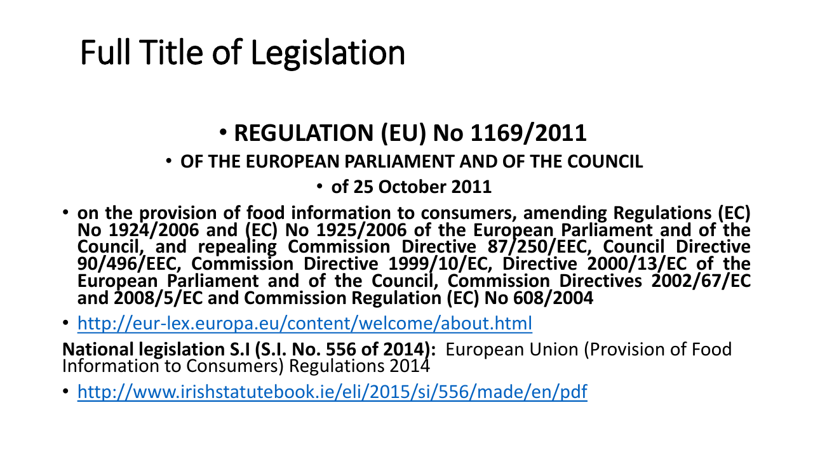

### Full Title of Legislation

- **REGULATION (EU) No 1169/2011** of the European Parliament and of the Council of **25 October 2011** on the provision of food information to consumers, amending Regulations (EC) No 1924/2006 and (EC) No 1925/2006 of the European Parliament and of the Council, and **repealing** Commission Directive 87/250/EEC, Council Directive 90/496/EEC, Commission Directive 1999/10/EC, Directive 2000/13/EC of the European Parliament and of the Council, Commission Directives 2002/67/EC and 2008/5/EC and Commission Regulation (EC) No 608/2004.
- *EU link:* <http://eur-lex.europa.eu/content/welcome/about.html>
- **National legislation:** S.I. No. 556 of 2014 — *European Union (Provision of Food Information to Consumers) Regulations 2014*.
- *Irish link:* <http://www.irishstatutebook.ie/eli/2015/si/556/made/en/pdf>

## Slide 135

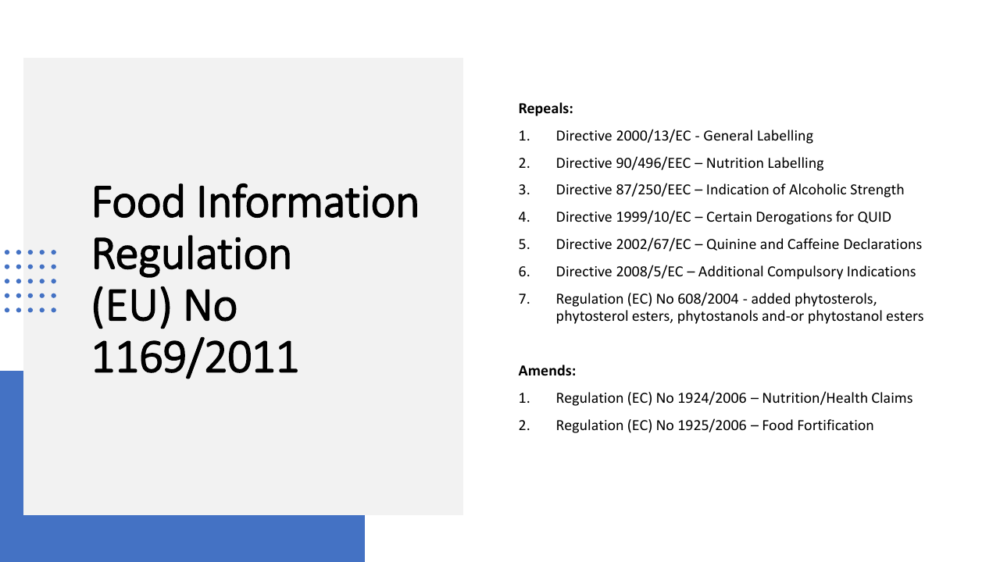

### Food Information Regulation (EU) No 1169/2011 — Repeals & Amends

**Repeals:**

1. Directive 2000/13/EC — General Labelling
2. Directive 90/496/EEC — Nutrition Labelling
3. Directive 87/250/EEC — Indication of Alcoholic Strength
4. Directive 1999/10/EC — Certain Derogations for QUID
5. Directive 2002/67/EC — Quinine and Caffeine Declarations
6. Directive 2008/5/EC — Additional Compulsory Indications
7. Regulation (EC) No 608/2004 — added phytosterols, phytosterol esters, phytostanols and/or phytostanol esters

**Amends:**

1. Regulation (EC) No 1924/2006 — Nutrition / Health Claims
2. Regulation (EC) No 1925/2006 — Food Fortification

## Slide 136

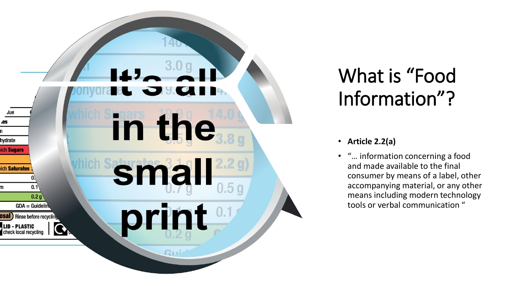

### What is "Food Information"?

**Article 2.2(a):**

> *"… information concerning a food and made available to the final consumer by means of a label, other accompanying material, or any other means including **modern technology tools or verbal communication**."*

*(Slide image: magnifying glass over a nutrition label — "It's all in the small print".)*

## Slide 137

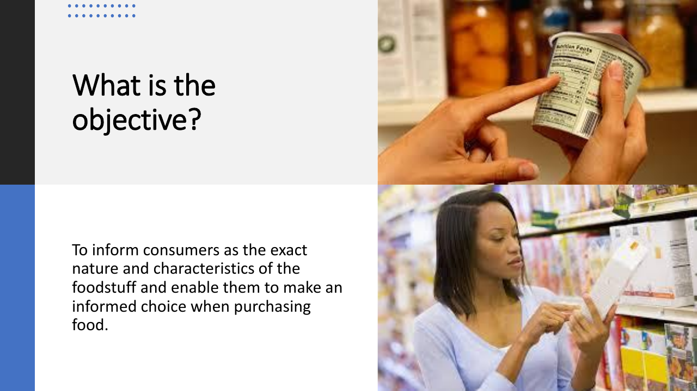

### What is the Objective?

> **To inform consumers as to the exact nature and characteristics of the foodstuff** and enable them to make an **informed choice** when purchasing food.

## Slide 138

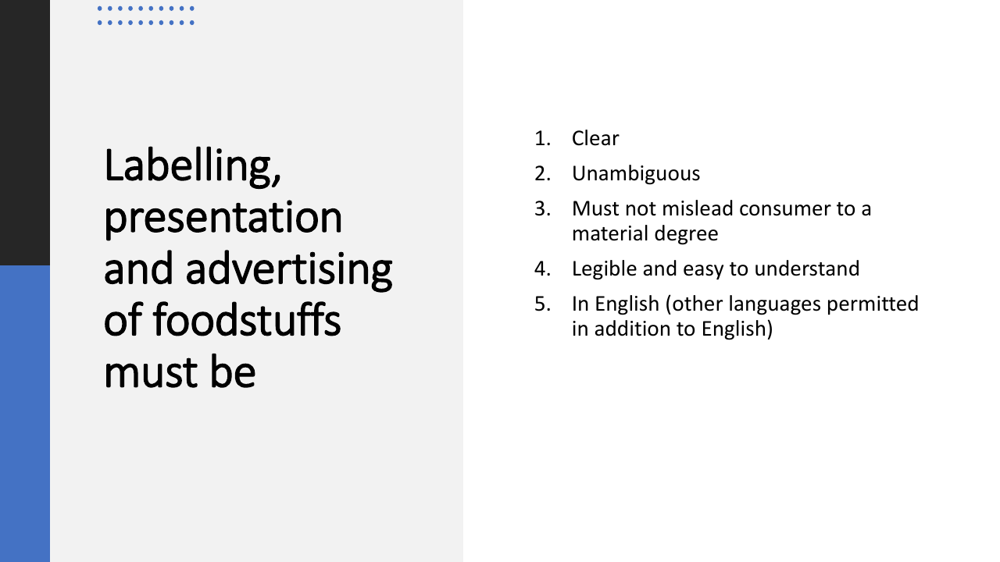

### Labelling, presentation and advertising of foodstuffs must be:

1. **Clear**
2. **Unambiguous**
3. **Must not mislead** the consumer to a material degree
4. **Legible and easy to understand**
5. **In English** *(other languages permitted in addition to English)*

## Slide 139

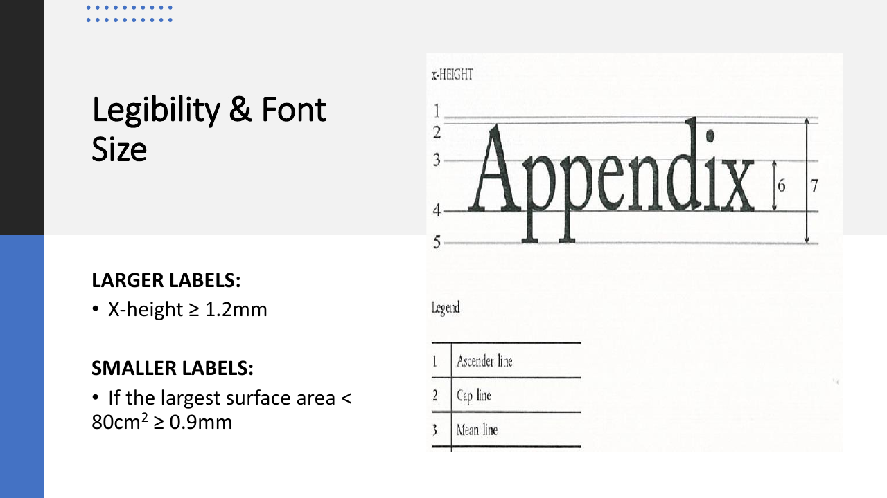

### Legibility & Font Size

- **Larger labels:** *x-height* ≥ **1.2 mm**
- **Smaller labels:** if the largest surface area < **80 cm²**, *x-height* ≥ **0.9 mm**

*(Slide image: typography diagram showing **x-height** measured between the **mean line** and **baseline** of the word "Appendix".)*

## Slide 140

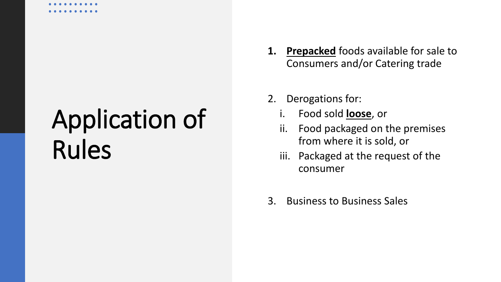

### Application of Rules

1. **Prepacked foods** available for sale to consumers and/or catering trade.
2. **Derogations** for:
    i. Food sold **loose**, or
    ii. Food packaged **on the premises** from where it is sold, or
    iii. Packaged **at the request of the consumer**.
3. **Business-to-Business** sales.

## Slide 141

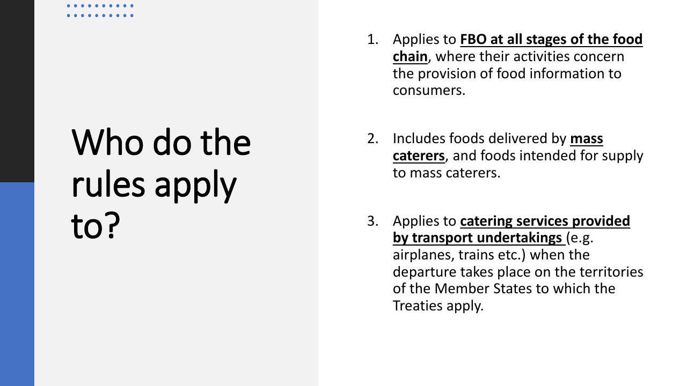

### Who do the rules apply to?

1. Applies to **FBO at all stages of the food chain**, where their activities concern the provision of food information to consumers.
2. Includes foods delivered by **mass caterers**, and foods intended for supply to mass caterers.
3. Applies to **catering services provided by transport undertakings** (e.g. airplanes, trains etc.) when the departure takes place on the territories of the Member States to which the Treaties apply.

## Slide 142

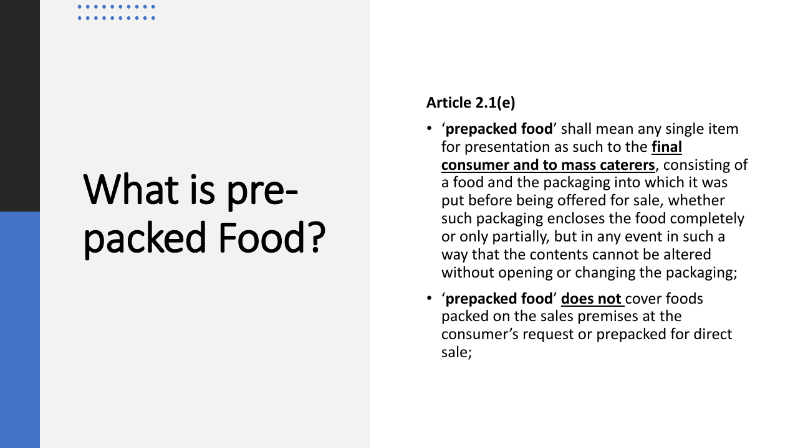

### What is *pre-packed Food*?

**Article 2.1(e):**

- **'Prepacked food'** shall mean any single item for presentation as such to the **final consumer and to mass caterers**, consisting of a food and the packaging into which it was put before being offered for sale, whether such packaging encloses the food completely or only partially, but in any event in such a way that the **contents cannot be altered without opening or changing the packaging**.
- **'Prepacked food' does NOT cover** foods packed on the sales premises **at the consumer's request** or prepacked for **direct sale**.

## Slide 143

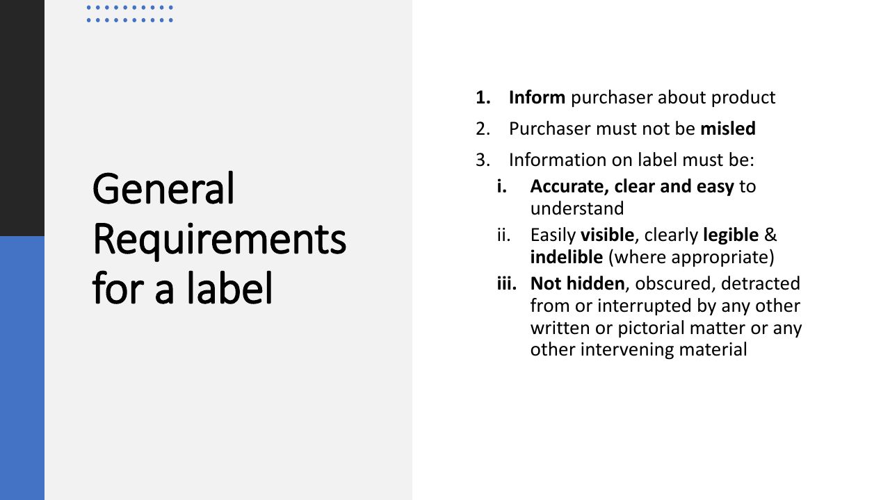

### General Requirements for a Label

1. **Inform** the purchaser about the product.
2. The purchaser must **not be misled**.
3. Information on the label must be:
    i. **Accurate, clear and easy** to understand.
    ii. Easily **visible**, clearly **legible** & **indelible** (where appropriate).
    iii. **Not hidden**, obscured, detracted from, or interrupted by any other written or pictorial matter or any other intervening material.

## Slide 144

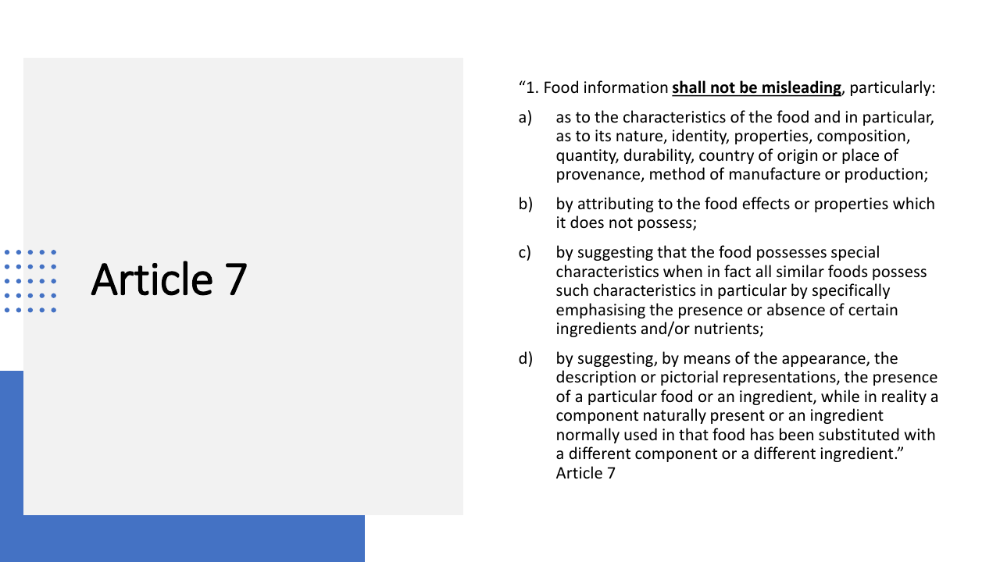

### Article 7 — Food information shall not be misleading

> **1.** Food information **shall not be misleading**, particularly:
>
> a. as to the **characteristics** of the food — in particular as to its nature, identity, properties, composition, quantity, durability, country of origin or place of provenance, method of manufacture or production;
>
> b. by attributing to the food **effects or properties which it does not possess**;
>
> c. by suggesting that the food possesses **special characteristics** when in fact all similar foods possess such characteristics — in particular by specifically emphasising the presence or absence of certain ingredients and/or nutrients;
>
> d. by suggesting, by means of the **appearance, the description or pictorial representations**, the presence of a particular food or an ingredient, while in reality a component naturally present or an ingredient normally used in that food has been **substituted** with a different component or a different ingredient.
>
> *— Article 7*

## Slide 145

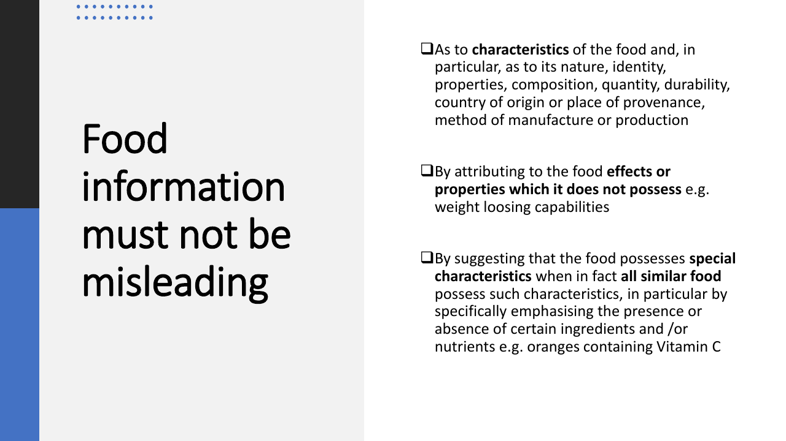

### Food information must not be misleading *(examples)*

- As to **characteristics** of the food — in particular, as to its nature, identity, properties, composition, quantity, durability, country of origin or place of provenance, method of manufacture or production.
- By attributing to the food **effects or properties which it does not possess** *(e.g. weight-losing capabilities)*.
- By suggesting that the food possesses **special characteristics** when in fact **all similar food** possess such characteristics — in particular by specifically emphasising the presence or absence of certain ingredients and/or nutrients *(e.g. oranges containing Vitamin C)*.

## Slide 146

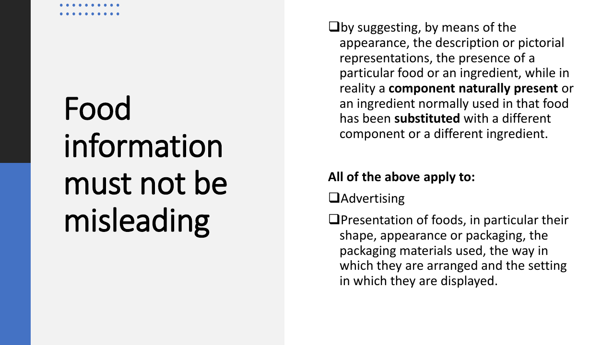

### Food information must not be misleading *(cont.)*

- By suggesting, by means of the **appearance, description or pictorial representations**, the presence of a particular food or an ingredient, while in reality a **component naturally present** or an ingredient normally used in that food has been **substituted** with a different component or a different ingredient.

**All of the above apply to:**

- **Advertising**
- **Presentation of foods** — in particular their shape, appearance or packaging, the packaging materials used, the way in which they are arranged, and the setting in which they are displayed.

## Slide 147

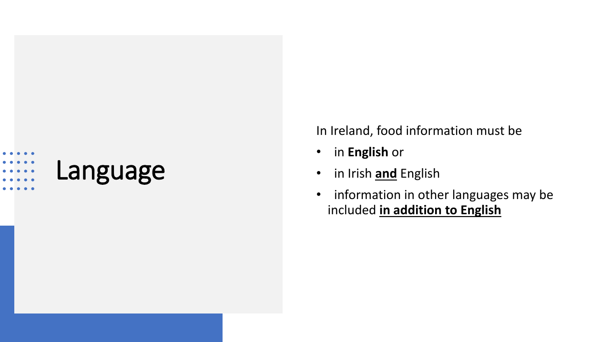

### Language

In Ireland, food information must be:

- in **English**, **or**
- in **Irish AND English**.
- Information in other languages may be included **in addition to English**.

## Slide 148

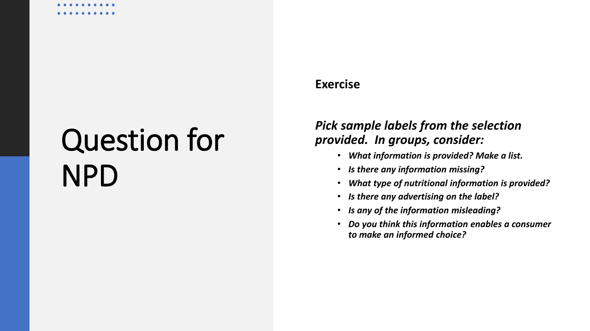

### Question for NPD — *Exercise*

> Pick sample labels from the selection provided. In groups, consider:

- What information is provided? Make a list.
- Is there any information missing?
- What type of nutritional information is provided?
- Is there any advertising on the label?
- Is any of the information misleading?
- Do you think this information enables a consumer to make an informed choice?

## Slide 149

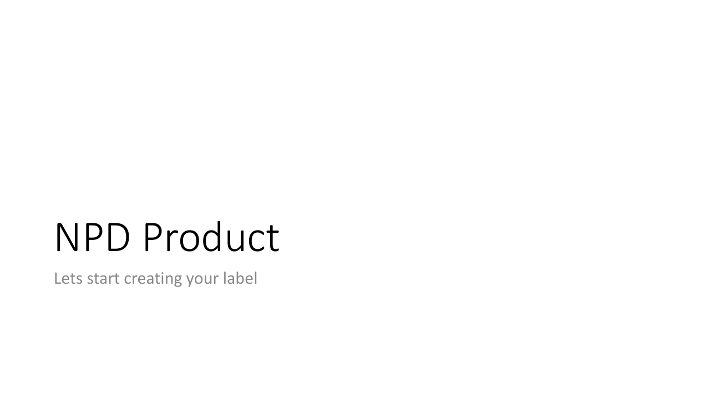

### NPD Product

Lets start creating your label

## Slide 150

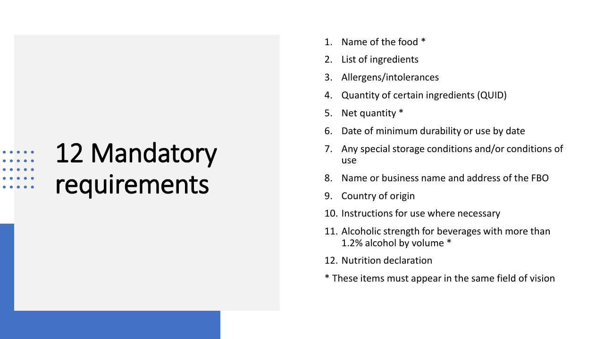

1. Name of the food *
2. List of ingredients
3. Allergens/intolerances
4. Quantity of certain ingredients (QUID)
5. Net quantity *
6. Date of minimum durability or use by date

12 Mandatory   7. Any special storage conditions and/or conditions of
                  use

requirements   8. Name or business name and address of the FBO
9. Country of origin
10. Instructions for use where necessary
11. Alcoholic strength for beverages with more than
                   1.2% alcohol by volume *
12. Nutrition declaration
               * These items must appear in the same field of vision

## Slide 151

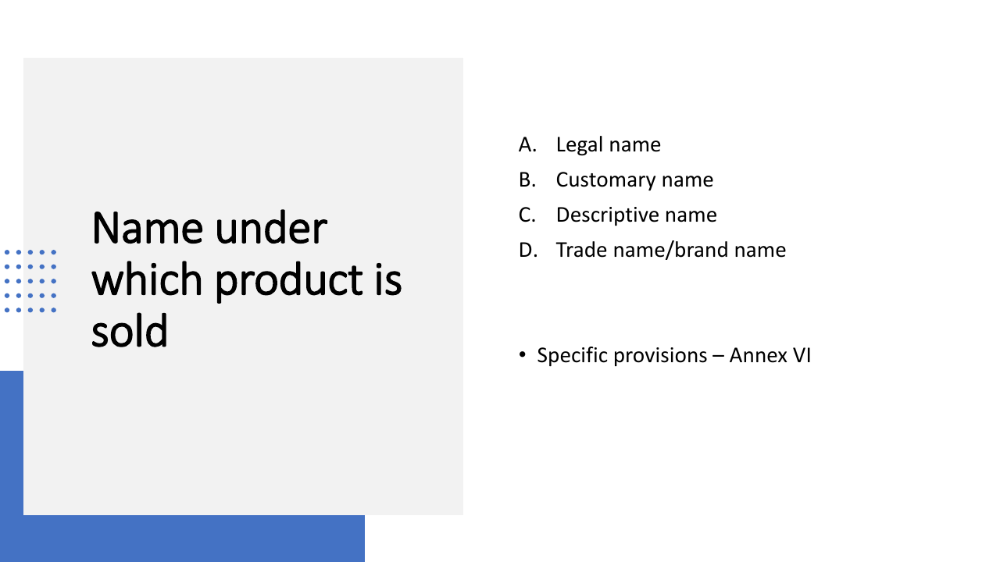

### A. Legal name — B. Customary name — C. Descriptive name

Name under         D. Trade name/brand name
which product is
sold               • Specific provisions – Annex VI

## Slide 152

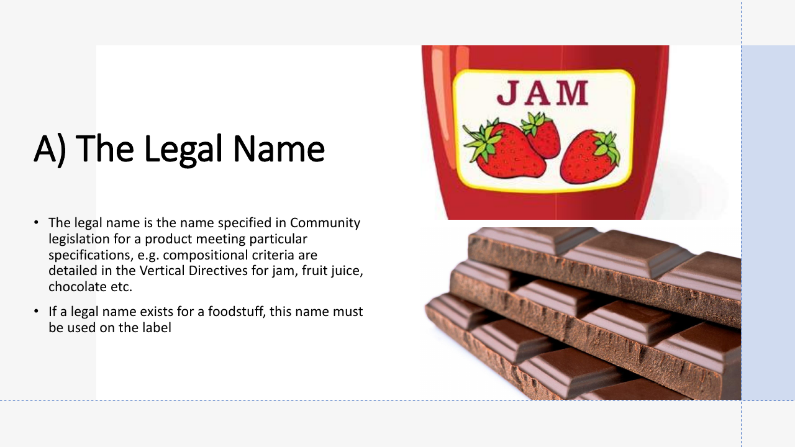

### A) The Legal Name

- The legal name is the name specified in Community

legislation for a product meeting particular
specifications, e.g. compositional criteria are
detailed in the Vertical Directives for jam, fruit juice,
chocolate etc.

- If a legal name exists for a foodstuff, this name must

be used on the label

## Slide 153

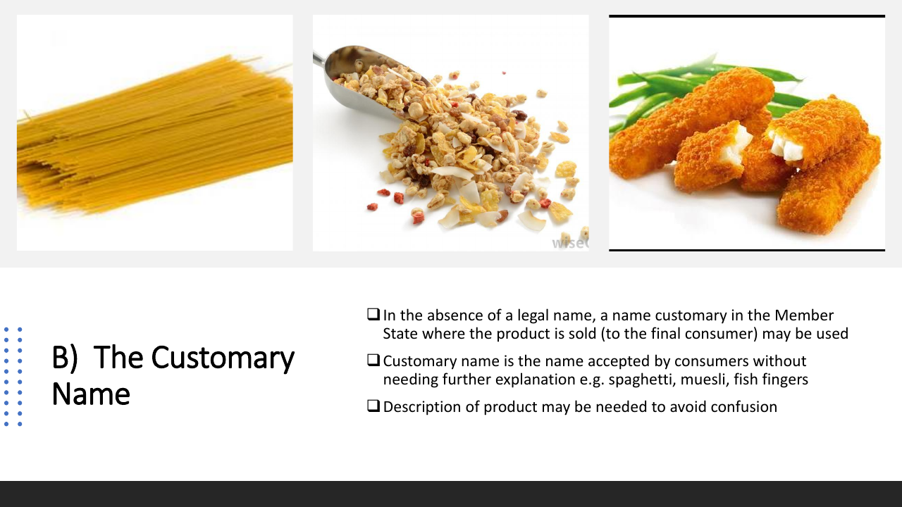

### B)  The Customary — Name

- In the absence of a legal name, a name customary in the Member

State where the product is sold (to the final consumer) may be used

- Customary name is the name accepted by consumers without
needing further explanation e.g. spaghetti, muesli, fish fingers

- Description of product may be needed to avoid confusion

## Slide 154

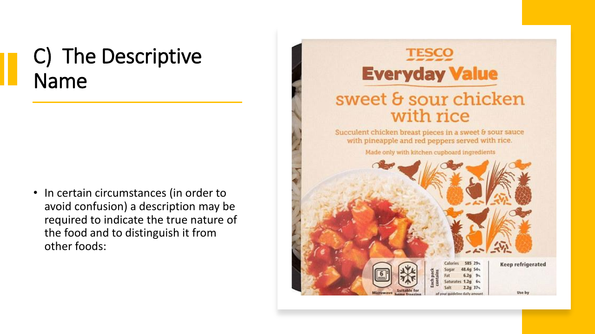

### C)  The Descriptive — Name

- In certain circumstances (in order to

avoid confusion) a description may be
required to indicate the true nature of
the food and to distinguish it from
other foods:

## Slide 155

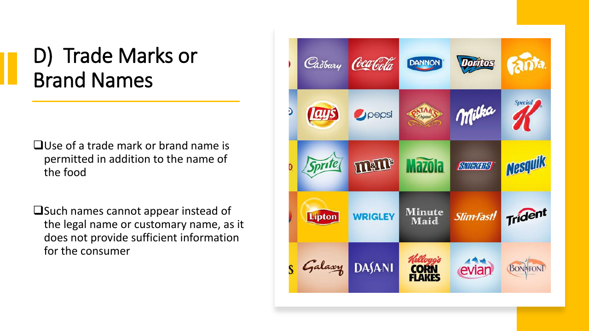

### D)  Trade Marks or — Brand Names

- Use of a trade mark or brand name is
permitted in addition to the name of
the food

- Such names cannot appear instead of

the legal name or customary name, as it
does not provide sufficient information
for the consumer

## Slide 156

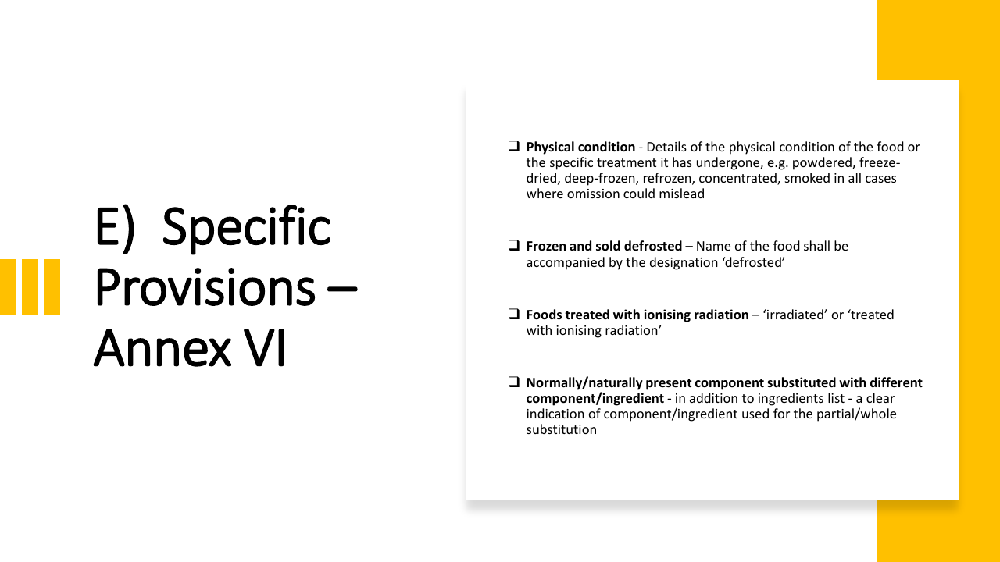

- Physical condition - Details of the physical condition of the food or
                 the specific treatment it has undergone, e.g. powdered, freeze-
                 dried, deep-frozen, refrozen, concentrated, smoked in all cases
                 where omission could mislead

E) Specific    ❑ Frozen and sold defrosted – Name of the food shall be
                 accompanied by the designation ‘defrosted’

Provisions –   ❑ Foods treated with ionising radiation – ‘irradiated’ or ‘treated

Annex VI
                 with ionising radiation’

- Normally/naturally present component substituted with different
                 component/ingredient - in addition to ingredients list - a clear
                 indication of component/ingredient used for the partial/whole
                 substitution

## Slide 157

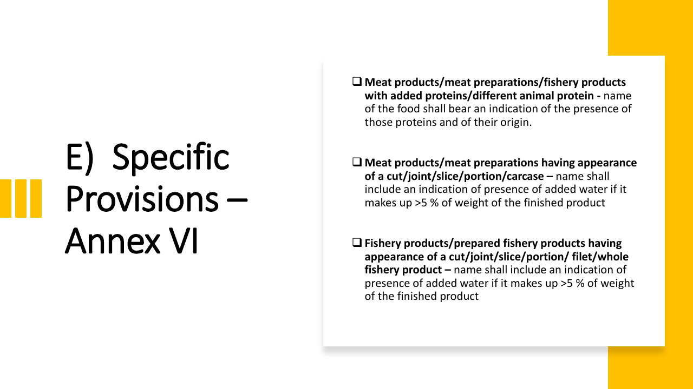

- Meat products/meat preparations/fishery products
                 with added proteins/different animal protein - name
                 of the food shall bear an indication of the presence of
                 those proteins and of their origin.

E) Specific    ❑ Meat products/meat preparations having appearance
                 of a cut/joint/slice/portion/carcase – name shall

Provisions –     include an indication of presence of added water if it
                 makes up >5 % of weight of the finished product

Annex VI       ❑ Fishery products/prepared fishery products having
                 appearance of a cut/joint/slice/portion/ filet/whole
                 fishery product – name shall include an indication of
                 presence of added water if it makes up >5 % of weight
                 of the finished product

## Slide 158

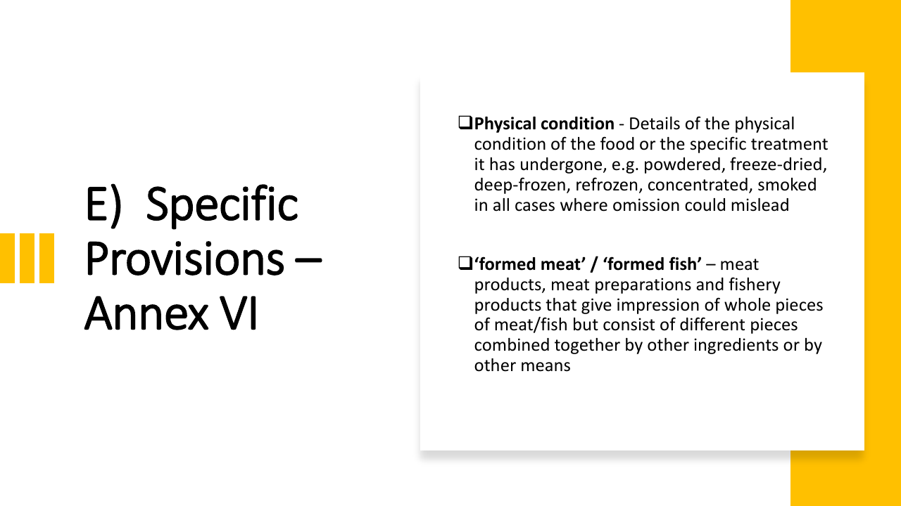

### ❑Physical condition - Details of the physical — condition of the food or the specific treatment — it has undergone, e.g. powdered, freeze-dried,

deep-frozen, refrozen, concentrated, smoked
E) Specific     in all cases where omission could mislead

Provisions –   ❑‘formed meat’ / ‘formed fish’ – meat
                products, meat preparations and fishery

Annex VI        products that give impression of whole pieces
                of meat/fish but consist of different pieces
                combined together by other ingredients or by
                other means

## Slide 159

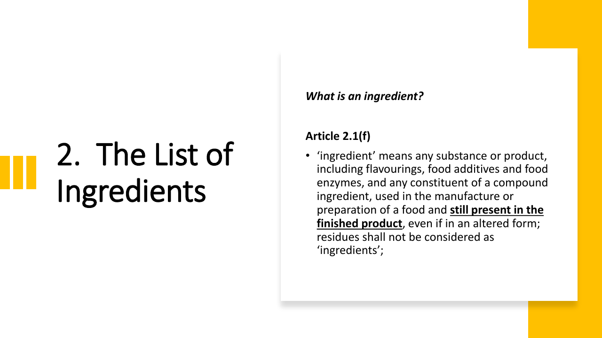

### What is an ingredient?

Article 2.1(f)
2. The List of   • ‘ingredient’ means any substance or product,
                   including flavourings, food additives and food

Ingredients        enzymes, and any constituent of a compound
                   ingredient, used in the manufacture or
                   preparation of a food and still present in the
                   finished product, even if in an altered form;
                   residues shall not be considered as
                   ‘ingredients’;

## Slide 160

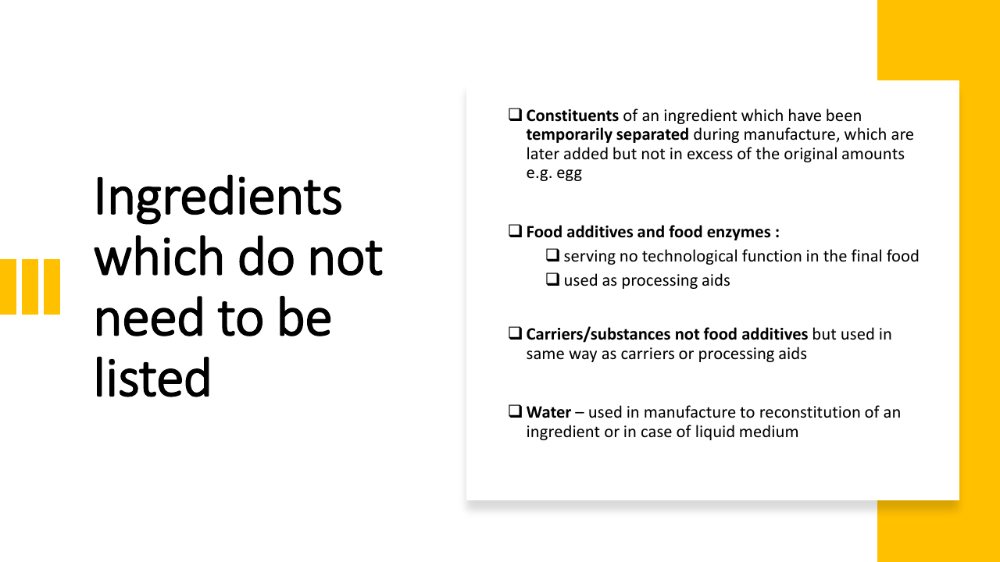

- Constituents of an ingredient which have been
                 temporarily separated during manufacture, which are
                 later added but not in excess of the original amounts
                 e.g. egg
Ingredients    ❑ Food additives and food enzymes :

which do not       ❑ serving no technological function in the final food
- used as processing aids

need to be     ❑ Carriers/substances not food additives but used in
                 same way as carriers or processing aids

listed         ❑ Water – used in manufacture to reconstitution of an
                 ingredient or in case of liquid medium

## Slide 161

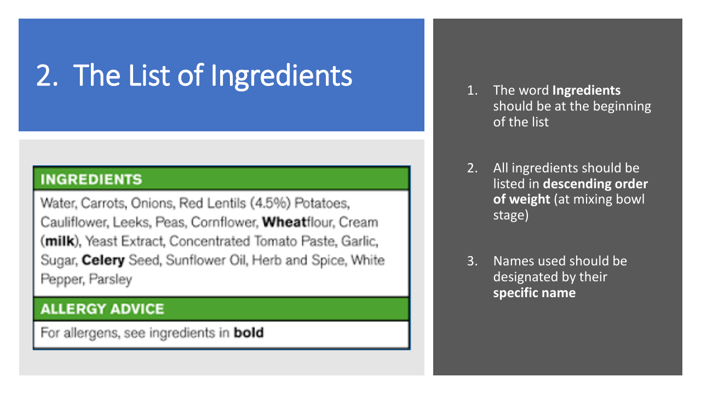

2. The List of Ingredients   1.   The word Ingredients
                                  should be at the beginning
                                  of the list

2. All ingredients should be
                                  listed in descending order
                                  of weight (at mixing bowl
                                  stage)

3. Names used should be
                                  designated by their
                                  specific name

## Slide 162

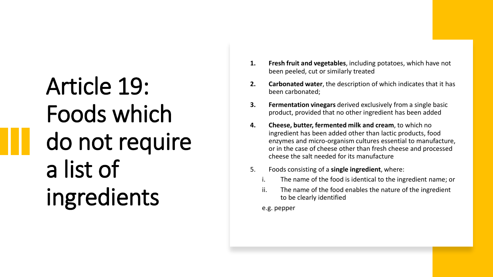

1. Fresh fruit and vegetables, including potatoes, which have not
                        been peeled, cut or similarly treated

Article 19:      2.     Carbonated water, the description of which indicates that it has
                        been carbonated;
3. Fermentation vinegars derived exclusively from a single basic

Foods which      4.
                        product, provided that no other ingredient has been added
                        Cheese, butter, fermented milk and cream, to which no
                        ingredient has been added other than lactic products, food
do not require          enzymes and micro-organism cultures essential to manufacture,
                        or in the case of cheese other than fresh cheese and processed
                        cheese the salt needed for its manufacture

a list of        5.
                      i.
                          Foods consisting of a single ingredient, where:
                             The name of the food is identical to the ingredient name; or

ingredients           ii.    The name of the food enables the nature of the ingredient
                             to be clearly identified
                      e.g. pepper

## Slide 163

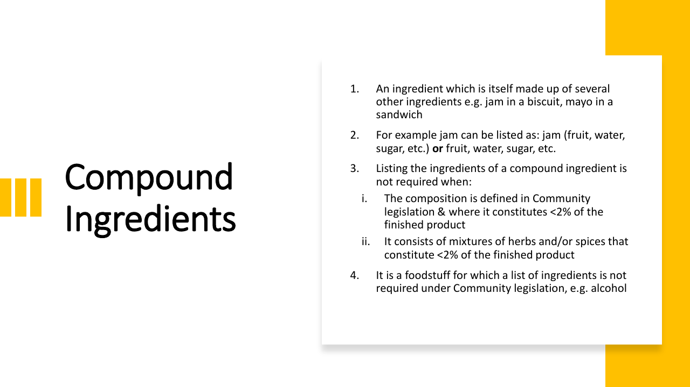

1. An ingredient which is itself made up of several
                     other ingredients e.g. jam in a biscuit, mayo in a
                     sandwich
2. For example jam can be listed as: jam (fruit, water,
                     sugar, etc.) or fruit, water, sugar, etc.

Compound      3.      Listing the ingredients of a compound ingredient is
                      not required when:
    i. The composition is defined in Community

Ingredients             legislation & where it constitutes <2% of the
                        finished product
    ii. It consists of mixtures of herbs and/or spices that
                        constitute <2% of the finished product
4. It is a foodstuff for which a list of ingredients is not
                     required under Community legislation, e.g. alcohol

## Slide 164

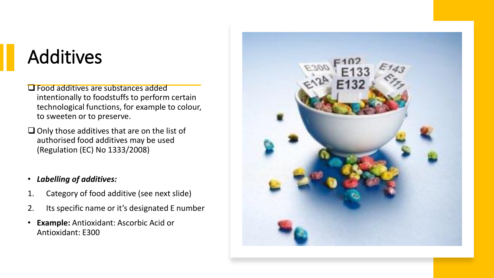

### Additives

- Food additives are substances added

intentionally to foodstuffs to perform certain
technological functions, for example to colour,
to sweeten or to preserve.

- Only those additives that are on the list of
authorised food additives may be used
(Regulation (EC) No 1333/2008)

- Labelling of additives:

1.

2.

Category of food additive (see next slide)

Its specific name or it’s designated E number

- Example: Antioxidant: Ascorbic Acid or

Antioxidant: E300

## Slide 165

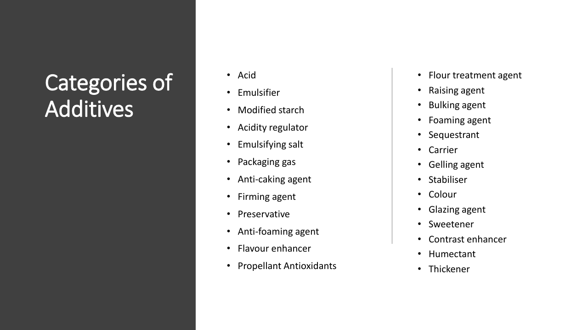

- Acid                      •   Flour treatment agent
Categories of   • Emulsifier                •   Raising agent

Additives       • Modified starch           •
- 
                                                Bulking agent
                                                Foaming agent
- Acidity regulator
- Sequestrant
- Emulsifying salt          •   Carrier
- Packaging gas             •   Gelling agent
- Anti-caking agent         •   Stabiliser
- Firming agent             •   Colour
- Preservative              •   Glazing agent
- Sweetener
- Anti-foaming agent
- Contrast enhancer
- Flavour enhancer
- Humectant
- Propellant Antioxidants   •   Thickener

## Slide 166

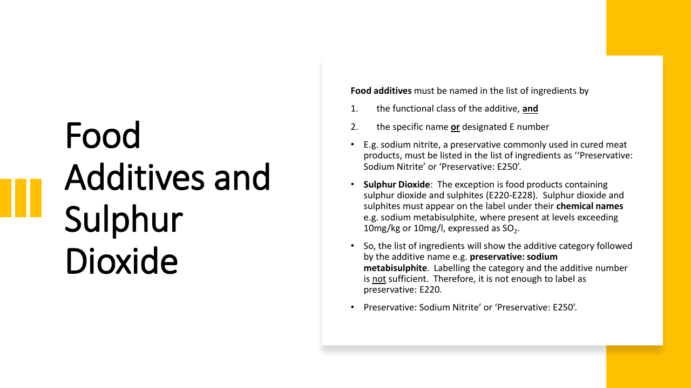

### Food additives must be named in the list of ingredients by

1. the functional class of the additive, and

Food            2.    the specific name or designated E number
- E.g. sodium nitrite, a preservative commonly used in cured meat
                  products, must be listed in the list of ingredients as ‘‘Preservative:

Additives and
                  Sodium Nitrite’ or ‘Preservative: E250’.
- Sulphur Dioxide: The exception is food products containing
                  sulphur dioxide and sulphites (E220-E228). Sulphur dioxide and
                  sulphites must appear on the label under their chemical names

Sulphur           e.g. sodium metabisulphite, where present at levels exceeding
                  10mg/kg or 10mg/l, expressed as SO2.
- So, the list of ingredients will show the additive category followed

Dioxide           by the additive name e.g. preservative: sodium
                  metabisulphite. Labelling the category and the additive number
                  is not sufficient. Therefore, it is not enough to label as
                  preservative: E220.
- Preservative: Sodium Nitrite’ or ‘Preservative: E250’.

## Slide 167

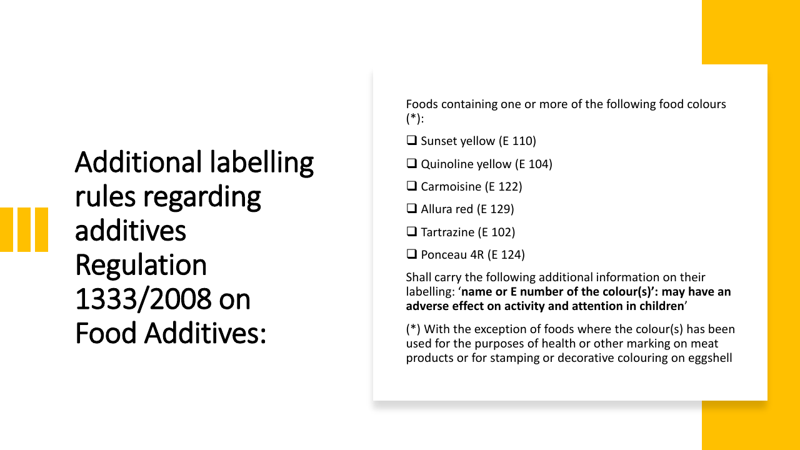

### Foods containing one or more of the following food colours — (*):

- Sunset yellow (E 110)
Additional labelling   ❑ Quinoline yellow (E 104)
- Carmoisine (E 122)
rules regarding        ❑ Allura red (E 129)

additives              ❑ Tartrazine (E 102)
- Ponceau 4R (E 124)
Regulation             Shall carry the following additional information on their

1333/2008 on           labelling: ‘name or E number of the colour(s)’: may have an
                       adverse effect on activity and attention in children’

Food Additives:        (*) With the exception of foods where the colour(s) has been
                       used for the purposes of health or other marking on meat
                       products or for stamping or decorative colouring on eggshell

## Slide 168

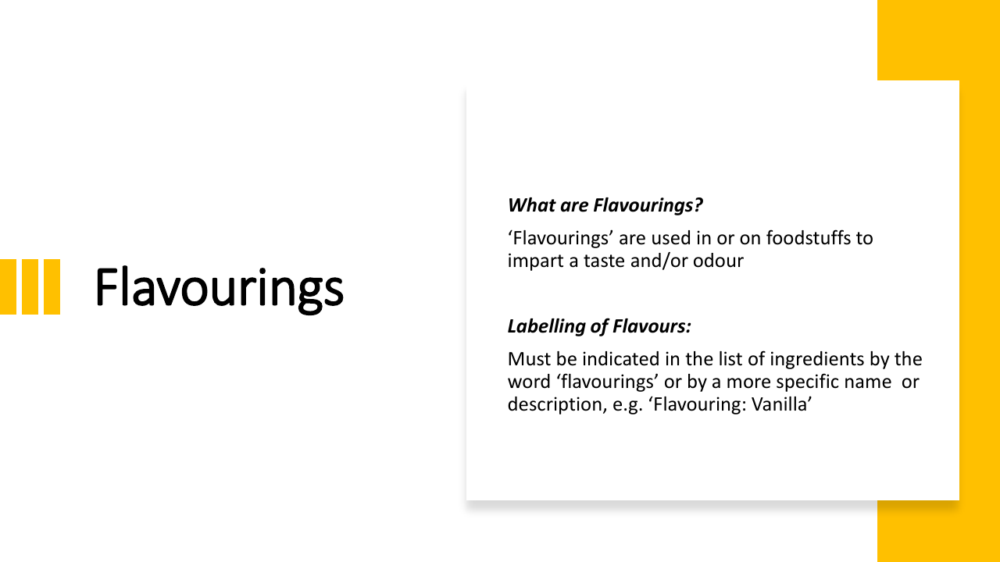

### What are Flavourings? — ‘Flavourings’ are used in or on foodstuffs to — impart a taste and/or odour

Flavourings
              Labelling of Flavours:
              Must be indicated in the list of ingredients by the
              word ‘flavourings’ or by a more specific name or
              description, e.g. ‘Flavouring: Vanilla’

## Slide 169

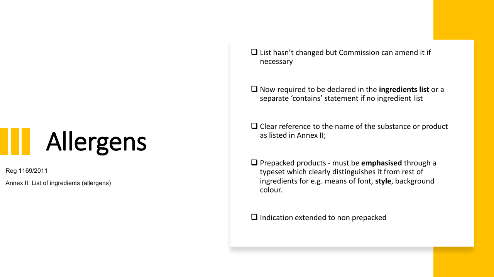

- List hasn’t changed but Commission can amend it if
                                              necessary

- Now required to be declared in the ingredients list or a
                                              separate ‘contains’ statement if no ingredient list

- Clear reference to the name of the substance or product

               Allergens                      as listed in Annex II;

- Prepacked products - must be emphasised through a
Reg 1169/2011                                 typeset which clearly distinguishes it from rest of
Annex II: List of ingredients (allergens)     ingredients for e.g. means of font, style, background
                                              colour.

- Indication extended to non prepacked

## Slide 170

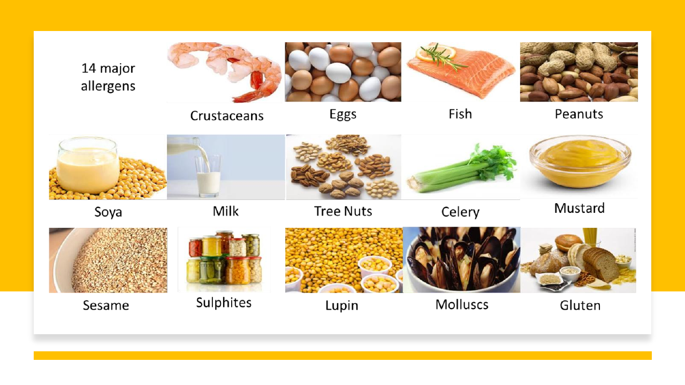

### *(Image-only slide — no extractable text.)*

**14 major allergens** — visual grid with product photos for each:

Crustaceans · Eggs · Fish · Peanuts · Soya · Milk · Tree Nuts · Celery · Mustard · Sesame · Sulphites · Lupin · Molluscs · Gluten.

## Slide 171

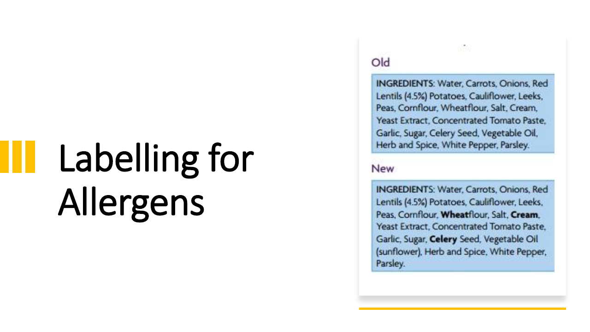

### Labelling for — Allergens

## Slide 172

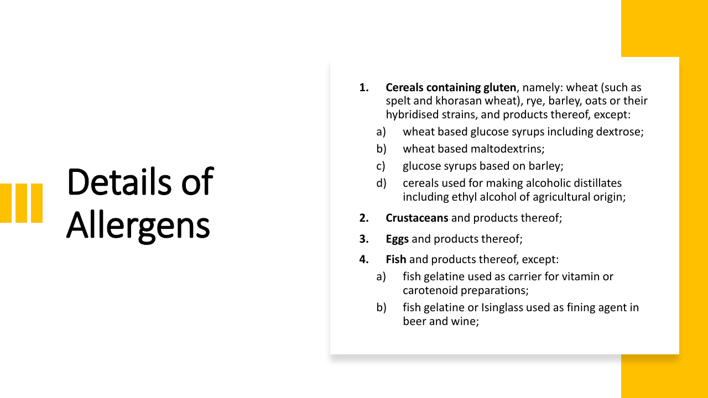

1. Cereals containing gluten, namely: wheat (such as
                    spelt and khorasan wheat), rye, barley, oats or their
                    hybridised strains, and products thereof, except:
    a. wheat based glucose syrups including dextrose;
    b. wheat based maltodextrins;
    c. glucose syrups based on barley;
Details of        d) cereals used for making alcoholic distillates
                       including ethyl alcohol of agricultural origin;

Allergens    2.
             3.
                   Crustaceans and products thereof;
                   Eggs and products thereof;
4. Fish and products thereof, except:
    a. fish gelatine used as carrier for vitamin or
                       carotenoid preparations;
    b. fish gelatine or Isinglass used as fining agent in
                       beer and wine;

## Slide 173

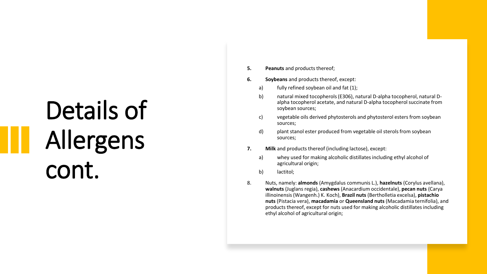

5. Peanuts and products thereof;
6. Soybeans and products thereof, except:
    a. fully refined soybean oil and fat (1);
    b. natural mixed tocopherols (E306), natural D-alpha tocopherol, natural D-

Details of
                            alpha tocopherol acetate, and natural D-alpha tocopherol succinate from
                            soybean sources;
    c. vegetable oils derived phytosterols and phytosterol esters from soybean
                            sources;

Allergens
    d. plant stanol ester produced from vegetable oil sterols from soybean
                            sources;
7. Milk and products thereof (including lactose), except:
    a. whey used for making alcoholic distillates including ethyl alcohol of

cont.        8.
                  b)
                            agricultural origin;
                            lactitol;
                       Nuts, namely: almonds (Amygdalus communis L.), hazelnuts (Corylus avellana),
                       walnuts (Juglans regia), cashews (Anacardium occidentale), pecan nuts (Carya
                       illinoinensis (Wangenh.) K. Koch), Brazil nuts (Bertholletia excelsa), pistachio
                       nuts (Pistacia vera), macadamia or Queensland nuts (Macadamia ternifolia), and
                       products thereof, except for nuts used for making alcoholic distillates including
                       ethyl alcohol of agricultural origin;

## Slide 174

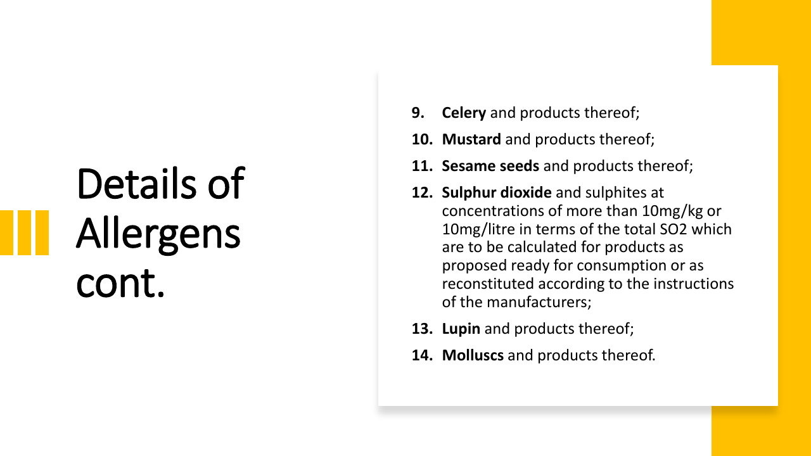

9. Celery and products thereof;
10. Mustard and products thereof;
11. Sesame seeds and products thereof;
Details of   12. Sulphur dioxide and sulphites at
                 concentrations of more than 10mg/kg or
Allergens        10mg/litre in terms of the total SO2 which
                 are to be calculated for products as
                 proposed ready for consumption or as
cont.            reconstituted according to the instructions
                 of the manufacturers;
13. Lupin and products thereof;
14. Molluscs and products thereof.

## Slide 175

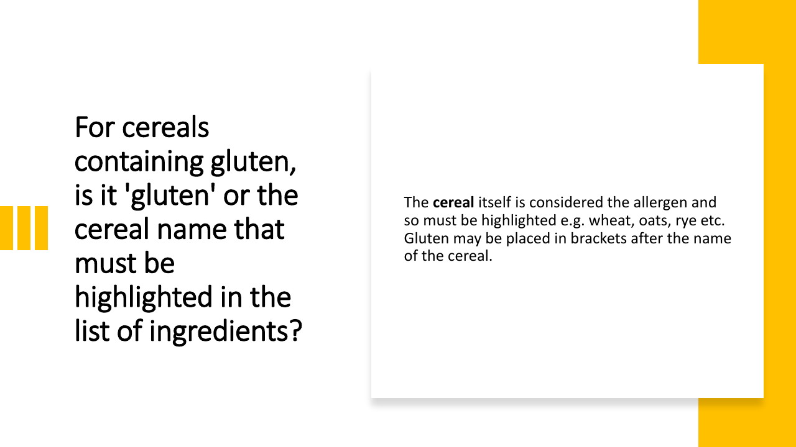

### For cereals — containing gluten, — is it 'gluten' or the

cereal name that
must be
highlighted in the
list of ingredients?

The cereal itself is considered the allergen and
so must be highlighted e.g. wheat, oats, rye etc.
Gluten may be placed in brackets after the name
of the cereal.

## Slide 176

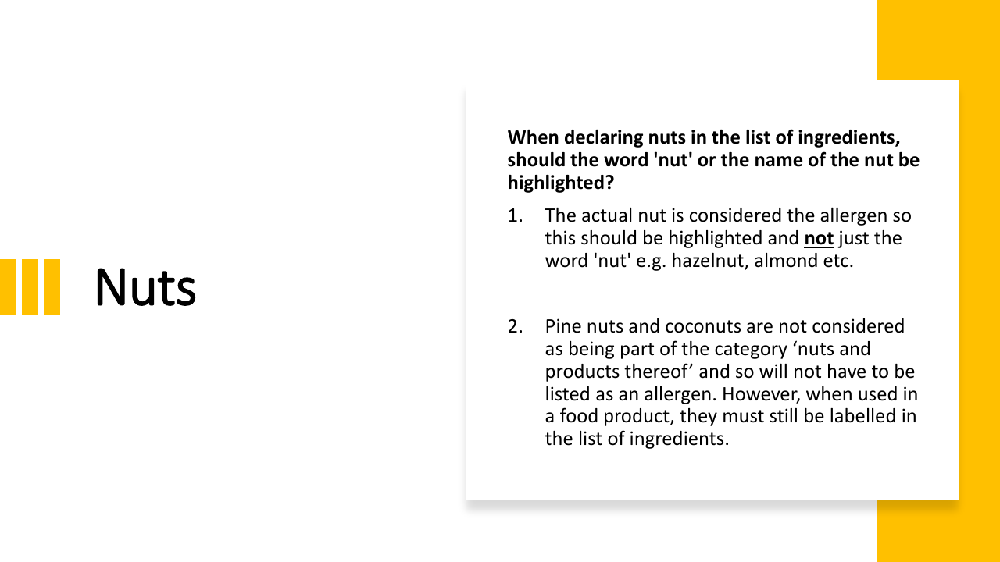

### When declaring nuts in the list of ingredients, — should the word 'nut' or the name of the nut be — highlighted?

1. The actual nut is considered the allergen so
            this should be highlighted and not just the
            word 'nut' e.g. hazelnut, almond etc.
Nuts
2. Pine nuts and coconuts are not considered
            as being part of the category ‘nuts and
            products thereof’ and so will not have to be
            listed as an allergen. However, when used in
            a food product, they must still be labelled in
            the list of ingredients.

## Slide 177

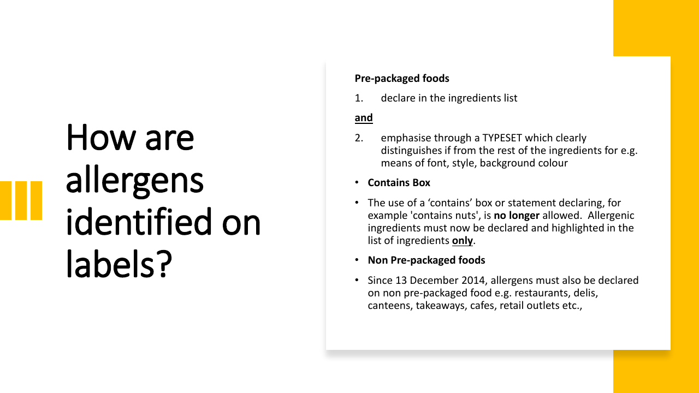

### Pre-packaged foods

1. declare in the ingredients list
                and

How are         2.    emphasise through a TYPESET which clearly
                      distinguishes if from the rest of the ingredients for e.g.
                      means of font, style, background colour

allergens       • Contains Box
- The use of a ‘contains’ box or statement declaring, for

identified on     example 'contains nuts', is no longer allowed. Allergenic
                  ingredients must now be declared and highlighted in the
                  list of ingredients only.

labels?         • Non Pre-packaged foods
- Since 13 December 2014, allergens must also be declared
                  on non pre-packaged food e.g. restaurants, delis,
                  canteens, takeaways, cafes, retail outlets etc.,

## Slide 178

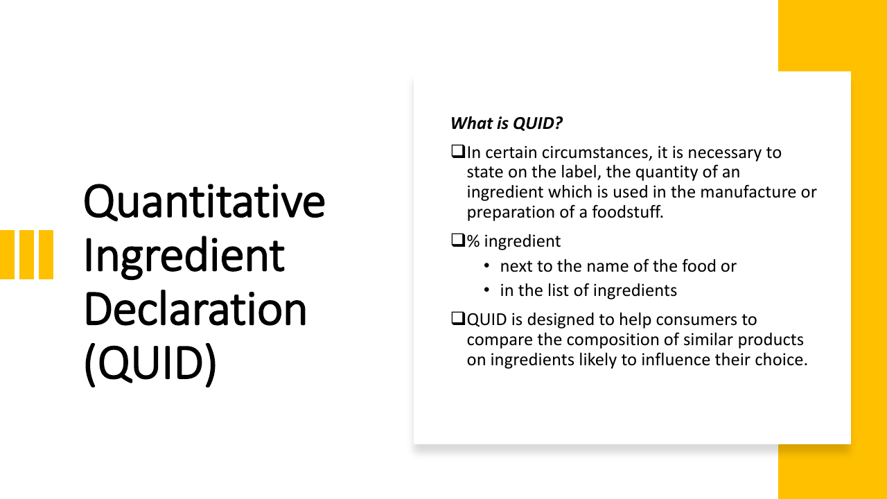

### What is QUID? — ❑In certain circumstances, it is necessary to — state on the label, the quantity of an

Quantitative    ingredient which is used in the manufacture or
                preparation of a foodstuff.
- % ingredient
Ingredient        • next to the name of the food or
- in the list of ingredients
Declaration    ❑QUID is designed to help consumers to
                compare the composition of similar products
(QUID)          on ingredients likely to influence their choice.

## Slide 179

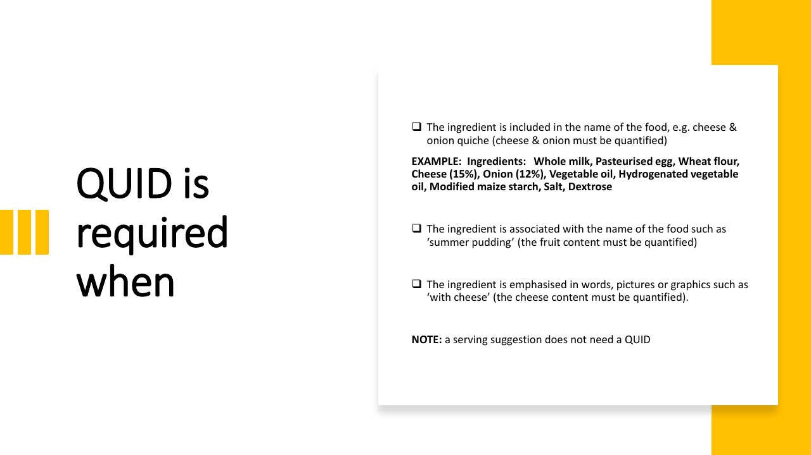

### QUID is — required — when

- The ingredient is included in the name of the food, e.g. cheese &

onion quiche (cheese & onion must be quantified)

EXAMPLE:  Ingredients:  Whole milk, Pasteurised egg, Wheat flour,
Cheese (15%), Onion (12%), Vegetable oil, Hydrogenated vegetable
oil, Modified maize starch, Salt, Dextrose

- The ingredient is associated with the name of the food such as

‘summer pudding’ (the fruit content must be quantified)

- The ingredient is emphasised in words, pictures or graphics such as

‘with cheese’ (the cheese content must be quantified).

NOTE: a serving suggestion does not need a QUID

## Slide 180

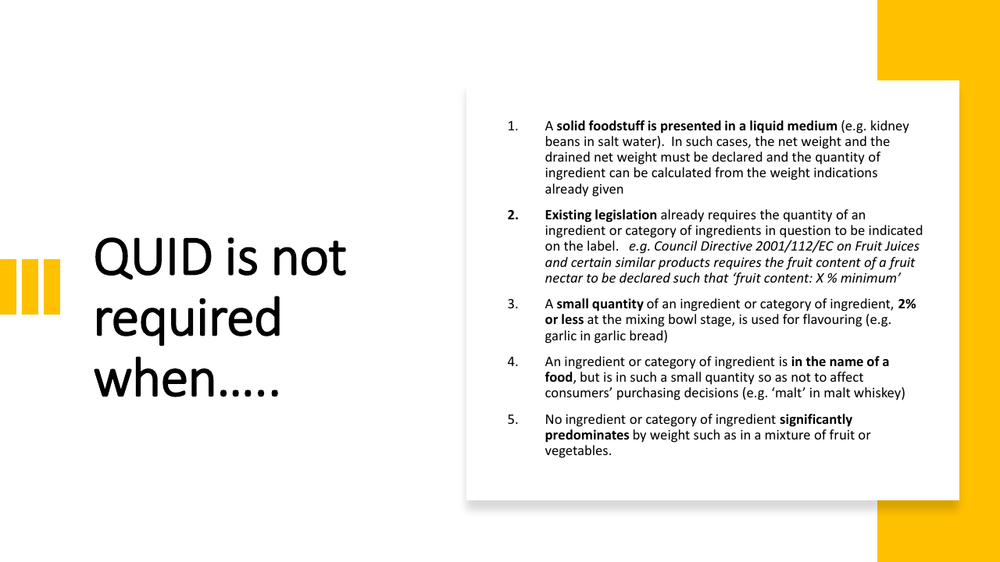

1. A solid foodstuff is presented in a liquid medium (e.g. kidney
                   beans in salt water). In such cases, the net weight and the
                   drained net weight must be declared and the quantity of
                   ingredient can be calculated from the weight indications
                   already given
2. Existing legislation already requires the quantity of an
                   ingredient or category of ingredients in question to be indicated

QUID is not        on the label. e.g. Council Directive 2001/112/EC on Fruit Juices
                   and certain similar products requires the fruit content of a fruit
                   nectar to be declared such that ‘fruit content: X % minimum’

required      3.   A small quantity of an ingredient or category of ingredient, 2%
                   or less at the mixing bowl stage, is used for flavouring (e.g.
                   garlic in garlic bread)

when…..
4. An ingredient or category of ingredient is in the name of a
                   food, but is in such a small quantity so as not to affect
                   consumers’ purchasing decisions (e.g. ‘malt’ in malt whiskey)
5. No ingredient or category of ingredient significantly
                   predominates by weight such as in a mixture of fruit or
                   vegetables.

## Slide 181

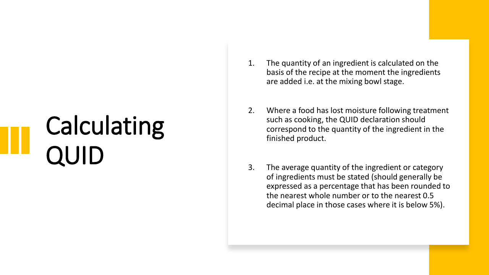

1. The quantity of an ingredient is calculated on the
                   basis of the recipe at the moment the ingredients
                   are added i.e. at the mixing bowl stage.

2. Where a food has lost moisture following treatment

Calculating        such as cooking, the QUID declaration should
                   correspond to the quantity of the ingredient in the
                   finished product.

QUID          3.   The average quantity of the ingredient or category
                   of ingredients must be stated (should generally be
                   expressed as a percentage that has been rounded to
                   the nearest whole number or to the nearest 0.5
                   decimal place in those cases where it is below 5%).

## Slide 182

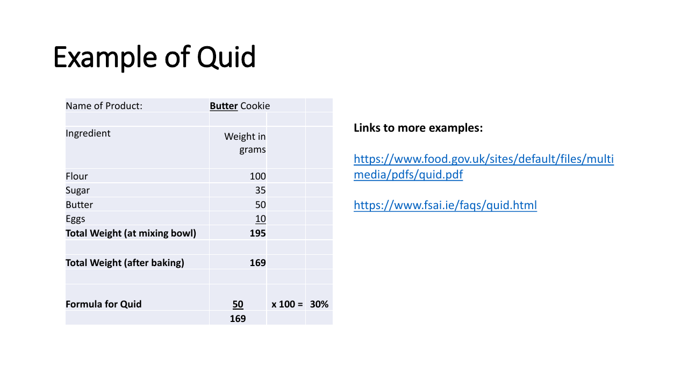

### Example of Quid — Name of Product:                Butter Cookie

Ingredient                                                    Links to more examples:
                                   Weight in
                                     grams
                                                              https://www.food.gov.uk/sites/default/files/multi
Flour                                     100                 media/pdfs/quid.pdf
Sugar                                      35
Butter                                     50                 https://www.fsai.ie/faqs/quid.html
Eggs                                       10
Total Weight (at mixing bowl)             195

Total Weight (after baking)               169

Formula for Quid                     50         x 100 = 30%
                                    169

## Slide 183

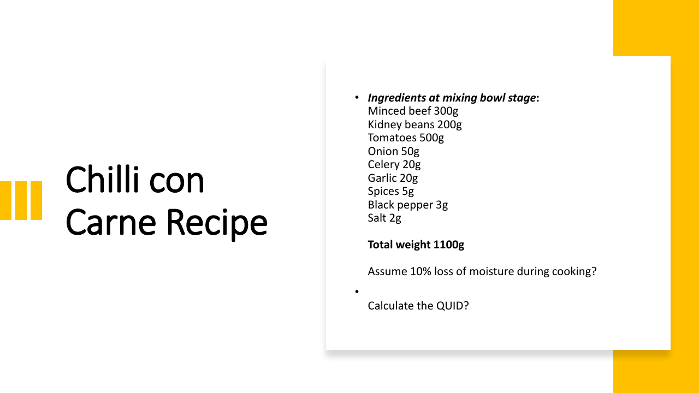

- Ingredients at mixing bowl stage:
                 Minced beef 300g
                 Kidney beans 200g
                 Tomatoes 500g
                 Onion 50g
                 Celery 20g
Chilli con       Garlic 20g
                 Spices 5g
                 Black pepper 3g

Carne Recipe     Salt 2g

                   Total weight 1100g

                   Assume 10% loss of moisture during cooking?
- 
                   Calculate the QUID?

## Slide 184

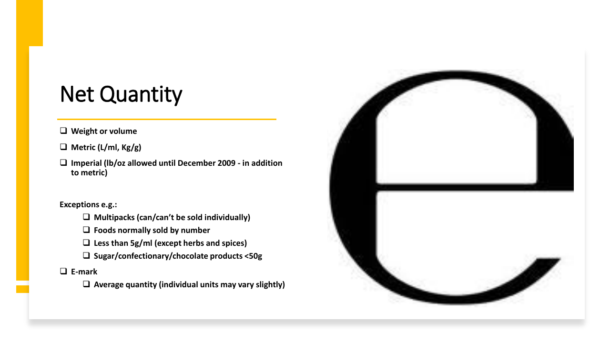

### Net Quantity

- Weight or volume

- Metric (L/ml, Kg/g)

- Imperial (lb/oz allowed until December 2009 - in addition

to metric)

Exceptions e.g.:

- Multipacks (can/can’t be sold individually)
- Foods normally sold by number
- Less than 5g/ml (except herbs and spices)
- Sugar/confectionary/chocolate products <50g

- E-mark

- Average quantity (individual units may vary slightly)

## Slide 185

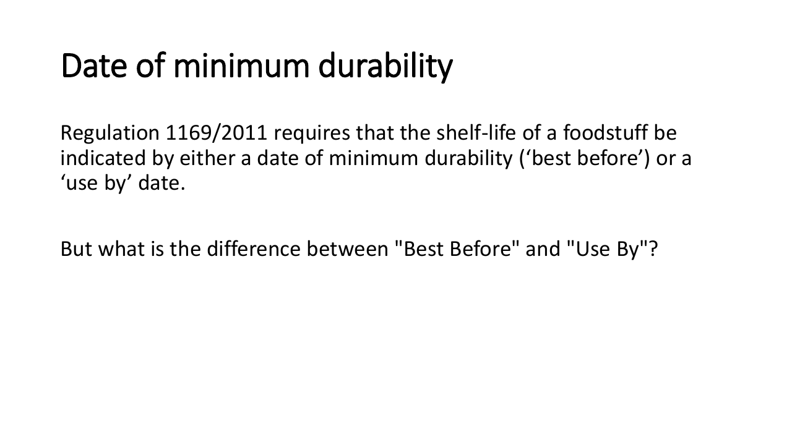

### Date of minimum durability

Regulation 1169/2011 requires that the shelf-life of a foodstuff be
indicated by either a date of minimum durability (‘best before’) or a
‘use by’ date.

But what is the difference between "Best Before" and "Use By"?

## Slide 186

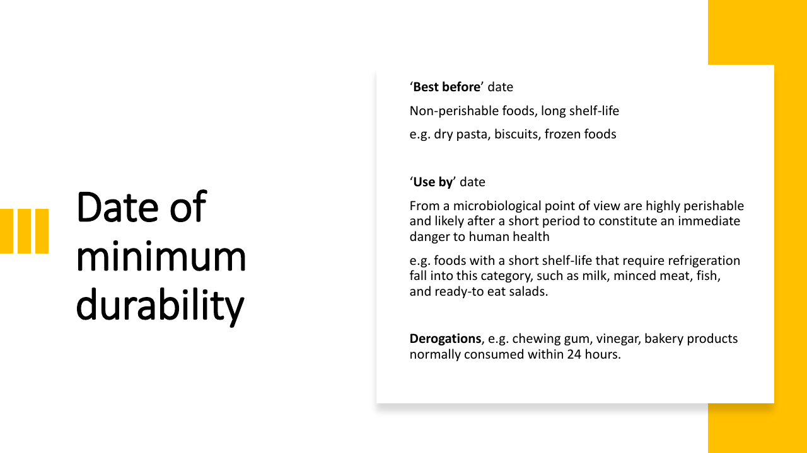

### ‘Best before’ date — Non-perishable foods, long shelf-life — e.g. dry pasta, biscuits, frozen foods

‘Use by’ date

Date of      From a microbiological point of view are highly perishable
             and likely after a short period to constitute an immediate
             danger to human health

minimum      e.g. foods with a short shelf-life that require refrigeration
             fall into this category, such as milk, minced meat, fish,

durability
             and ready-to eat salads.

             Derogations, e.g. chewing gum, vinegar, bakery products
             normally consumed within 24 hours.

## Slide 187

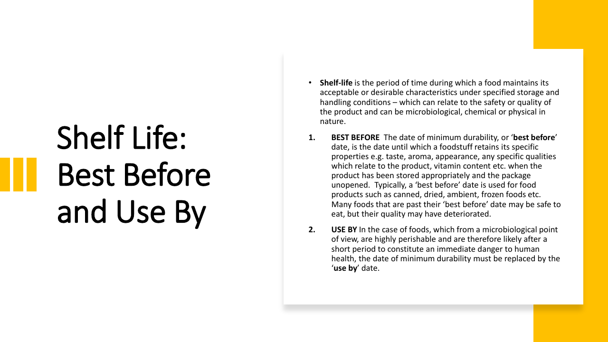

- Shelf-life is the period of time during which a food maintains its
                acceptable or desirable characteristics under specified storage and
                handling conditions – which can relate to the safety or quality of
                the product and can be microbiological, chemical or physical in
                nature.

Shelf Life:   1.    BEST BEFORE The date of minimum durability, or ‘best before’
                    date, is the date until which a foodstuff retains its specific
                    properties e.g. taste, aroma, appearance, any specific qualities

Best Before         which relate to the product, vitamin content etc. when the
                    product has been stored appropriately and the package
                    unopened. Typically, a ‘best before’ date is used for food
                    products such as canned, dried, ambient, frozen foods etc.

and Use By    2.
                    Many foods that are past their ‘best before’ date may be safe to
                    eat, but their quality may have deteriorated.
                    USE BY In the case of foods, which from a microbiological point
                    of view, are highly perishable and are therefore likely after a
                    short period to constitute an immediate danger to human
                    health, the date of minimum durability must be replaced by the
                    ‘use by’ date.

## Slide 188

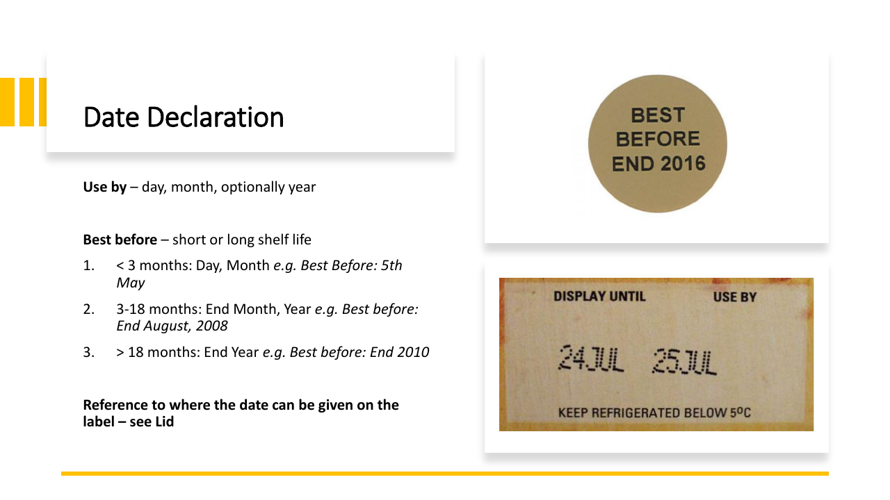

### Date Declaration

Use by – day, month, optionally year

Best before – short or long shelf life

1.

2.

3.

< 3 months: Day, Month e.g. Best Before: 5th
May

3-18 months: End Month, Year e.g. Best before:
End August, 2008

> 18 months: End Year e.g. Best before: End 2010

Reference to where the date can be given on the
label – see Lid

## Slide 189

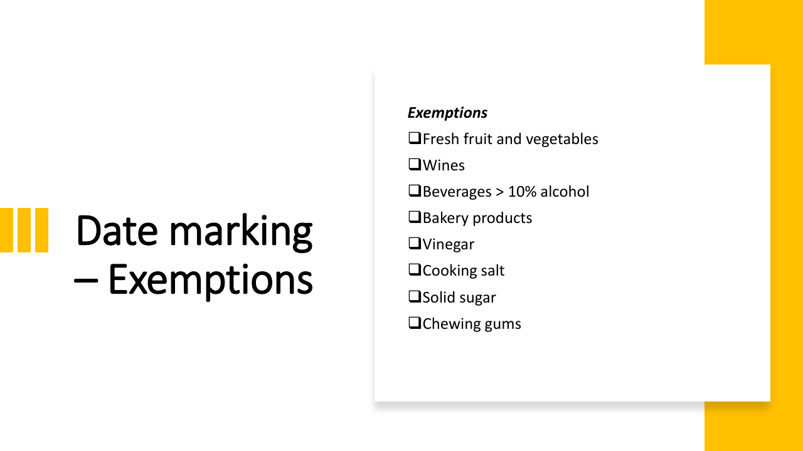

### Exemptions — ❑Fresh fruit and vegetables — ❑Wines

- Beverages > 10% alcohol
- Bakery products
Date marking   ❑Vinegar

– Exemptions   ❑Cooking salt
- Solid sugar
- Chewing gums

## Slide 190

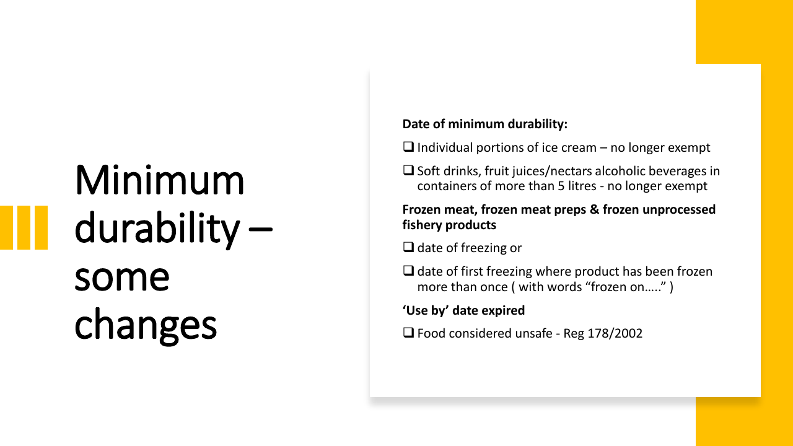

### Date of minimum durability:

- Individual portions of ice cream – no longer exempt

Minimum        ❑ Soft drinks, fruit juices/nectars alcoholic beverages in
                 containers of more than 5 litres - no longer exempt
               Frozen meat, frozen meat preps & frozen unprocessed
durability –   fishery products
- date of freezing or

some           ❑ date of first freezing where product has been frozen
                 more than once ( with words “frozen on…..” )
               ‘Use by’ date expired
changes        ❑ Food considered unsafe - Reg 178/2002

## Slide 191

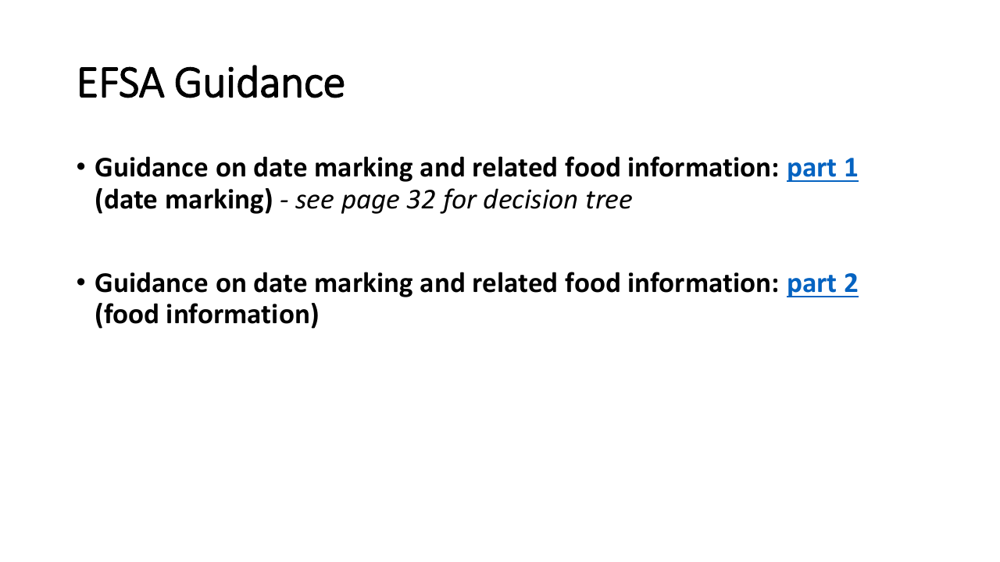

### EFSA Guidance

- Guidance on date marking and related food information: part 1

(date marking) - see page 32 for decision tree

- Guidance on date marking and related food information: part 2

(food information)

## Slide 192

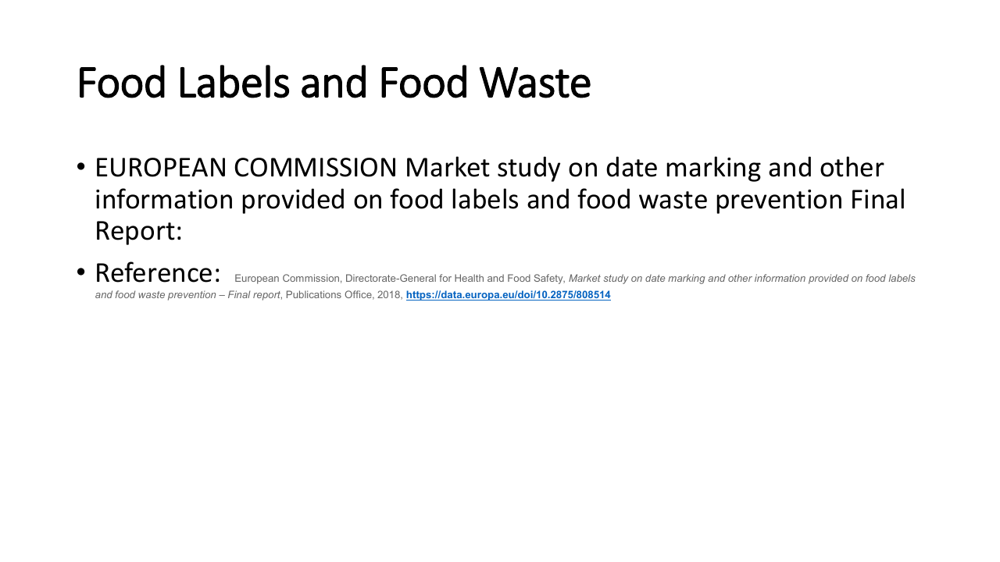

### Food Labels and Food Waste

- EUROPEAN COMMISSION Market study on date marking and other

information provided on food labels and food waste prevention Final
Report:

- Reference: European Commission, Directorate-General for Health and Food Safety, Market study on date marking and other information provided on food labels

and food waste prevention – Final report, Publications Office, 2018, https://data.europa.eu/doi/10.2875/808514

## Slide 193

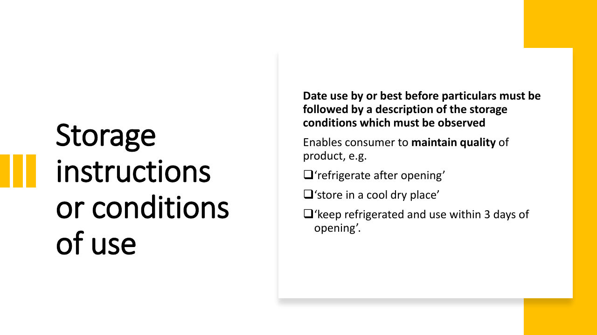

### Date use by or best before particulars must be — followed by a description of the storage — conditions which must be observed

Storage         Enables consumer to maintain quality of
                product, e.g.
instructions    ❑‘refrigerate after opening’
- ‘store in a cool dry place’
or conditions   ❑‘keep refrigerated and use within 3 days of
                 opening’.
of use

## Slide 194

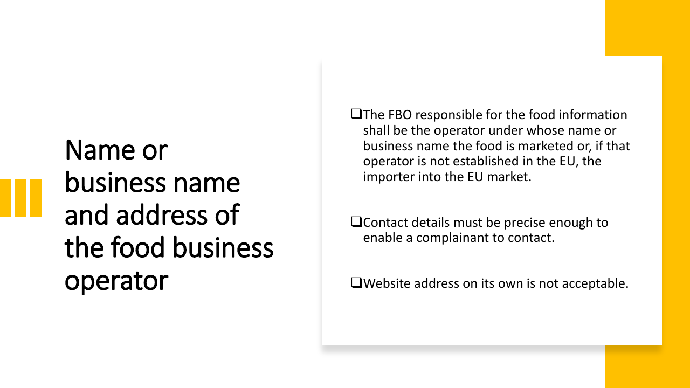

### ❑The FBO responsible for the food information — shall be the operator under whose name or — Name or              business name the food is marketed or, if that

operator is not established in the EU, the
business name        importer into the EU market.

and address of      ❑Contact details must be precise enough to
                     enable a complainant to contact.
the food business
operator            ❑Website address on its own is not acceptable.

## Slide 195

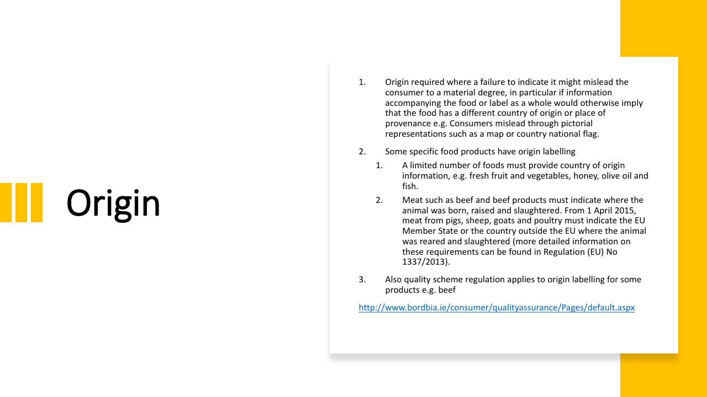

1. Origin required where a failure to indicate it might mislead the
                consumer to a material degree, in particular if information
                accompanying the food or label as a whole would otherwise imply
                that the food has a different country of origin or place of
                provenance e.g. Consumers mislead through pictorial
                representations such as a map or country national flag.
2. Some specific food products have origin labelling
1. A limited number of foods must provide country of origin
                    information, e.g. fresh fruit and vegetables, honey, olive oil and
                    fish.

Origin        2.    Meat such as beef and beef products must indicate where the
                    animal was born, raised and slaughtered. From 1 April 2015,
                    meat from pigs, sheep, goats and poultry must indicate the EU
                    Member State or the country outside the EU where the animal
                    was reared and slaughtered (more detailed information on
                    these requirements can be found in Regulation (EU) No
                    1337/2013).
3. Also quality scheme regulation applies to origin labelling for some
                products e.g. beef
         http://www.bordbia.ie/consumer/qualityassurance/Pages/default.aspx

## Slide 196

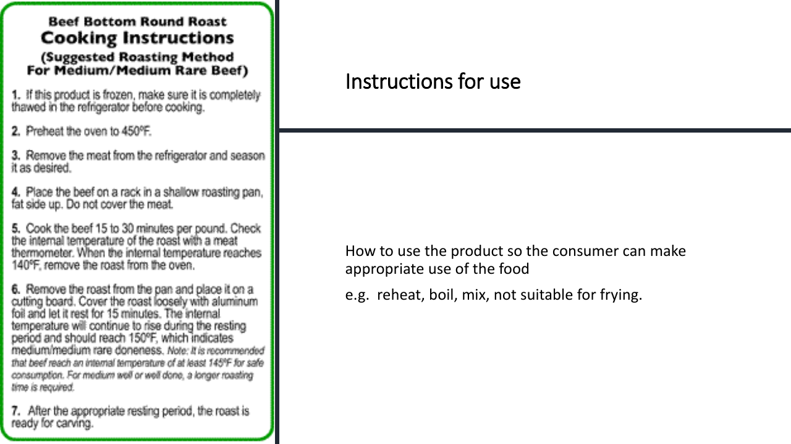

### Instructions for use

How to use the product so the consumer can make
appropriate use of the food

e.g.  reheat, boil, mix, not suitable for frying.

## Slide 197

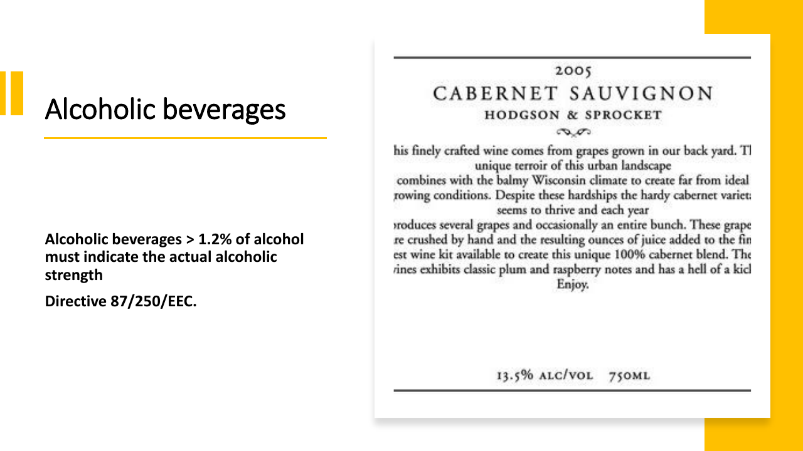

### Alcoholic beverages

Alcoholic beverages > 1.2% of alcohol
must indicate the actual alcoholic
strength

Directive 87/250/EEC.

## Slide 198


### Nutritional Information

## Slide 199

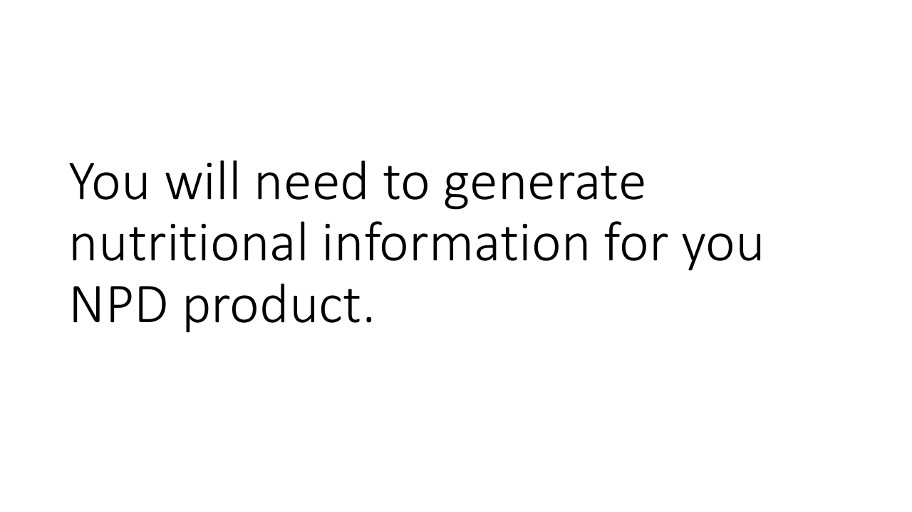

### You will need to generate — nutritional information for you — NPD product.

## Slide 200


### Nutritional Labelling

## Slide 201

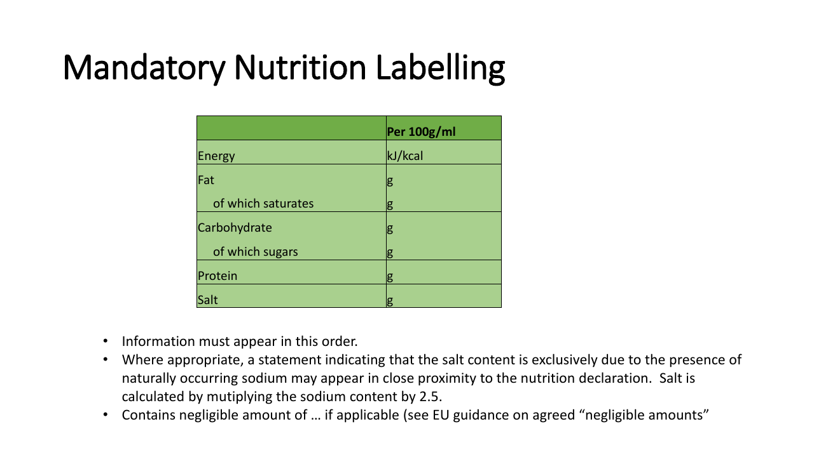

### Mandatory Nutrition Labelling — Per 100g/ml — Energy                        kJ/kcal

Fat                           g
                    of which saturates         g
                 Carbohydrate                  g
                    of which sugars            g
                 Protein                       g
                 Salt                          g

- Information must appear in this order.
- Where appropriate, a statement indicating that the salt content is exclusively due to the presence of
    naturally occurring sodium may appear in close proximity to the nutrition declaration. Salt is
    calculated by mutiplying the sodium content by 2.5.
- Contains negligible amount of … if applicable (see EU guidance on agreed “negligible amounts”

## Slide 202

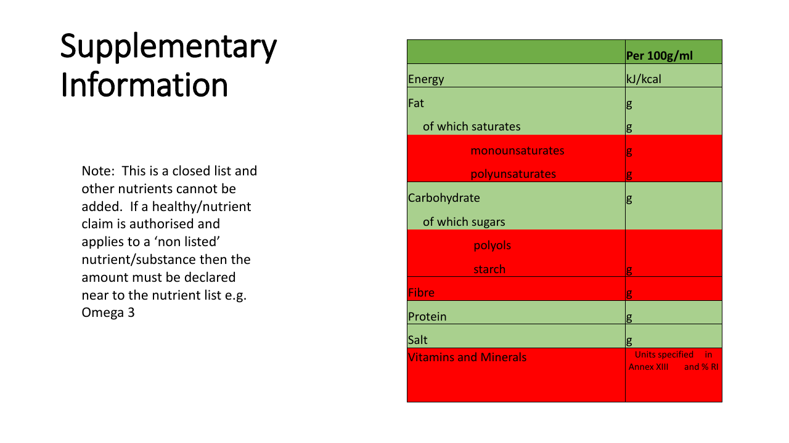

### Supplementary                                                   Per 100g/ml

Information                        Energy
                                   Fat
                                                                kJ/kcal
                                                                g
                                     of which saturates         g
                                              monounsaturates   g
 Note: This is a closed list and              polyunsaturates   g
 other nutrients cannot be
                                   Carbohydrate                 g
 added. If a healthy/nutrient
 claim is authorised and             of which sugars
 applies to a ‘non listed’                    polyols
 nutrient/substance then the
                                              starch            g
 amount must be declared
 near to the nutrient list e.g.    Fibre                        g
 Omega 3                           Protein                      g
                                   Salt                         g
                                   Vitamins and Minerals         Units specified in
                                                                Annex XIII    and % RI

## Slide 203

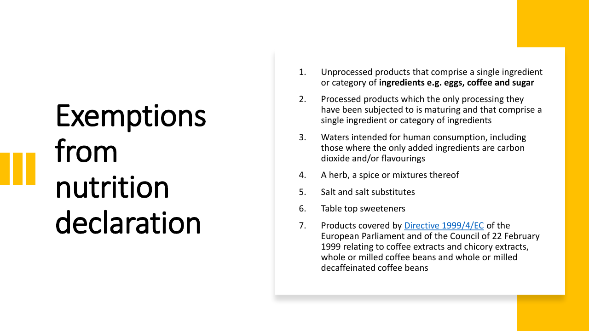

1. Unprocessed products that comprise a single ingredient
                   or category of ingredients e.g. eggs, coffee and sugar
2. Processed products which the only processing they

Exemptions    3.
                   have been subjected to is maturing and that comprise a
                   single ingredient or category of ingredients
                   Waters intended for human consumption, including

from               those where the only added ingredients are carbon
                   dioxide and/or flavourings
4. A herb, a spice or mixtures thereof
nutrition     5.
              6.
                   Salt and salt substitutes
                   Table top sweeteners

declaration   7.   Products covered by Directive 1999/4/EC of the
                   European Parliament and of the Council of 22 February
                   1999 relating to coffee extracts and chicory extracts,
                   whole or milled coffee beans and whole or milled
                   decaffeinated coffee beans

## Slide 204

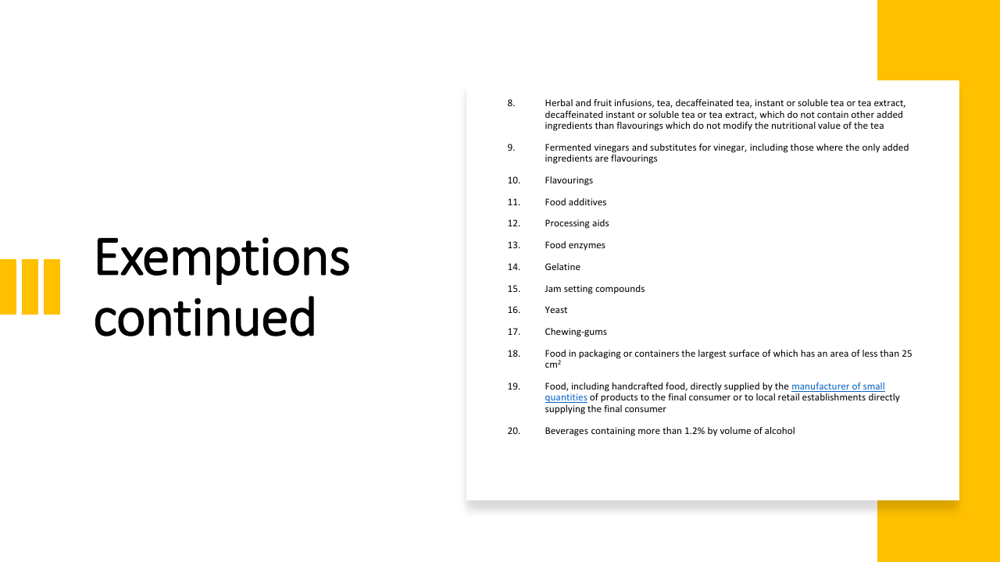

8. Herbal and fruit infusions, tea, decaffeinated tea, instant or soluble tea or tea extract,
                   decaffeinated instant or soluble tea or tea extract, which do not contain other added
                   ingredients than flavourings which do not modify the nutritional value of the tea

9. Fermented vinegars and substitutes for vinegar, including those where the only added
                   ingredients are flavourings

10. Flavourings

11. Food additives

12. Processing aids

Exemptions   13.

             14.

             15.
                   Food enzymes

                   Gelatine

                   Jam setting compounds

continued    16.

             17.

             18.
                   Yeast

                   Chewing-gums

                   Food in packaging or containers the largest surface of which has an area of less than 25
                   cm2

19. Food, including handcrafted food, directly supplied by the manufacturer of small
                   quantities of products to the final consumer or to local retail establishments directly
                   supplying the final consumer

20. Beverages containing more than 1.2% by volume of alcohol

## Slide 205

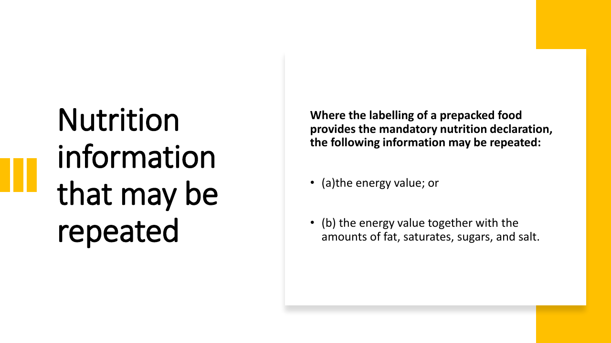

### Nutrition     Where the labelling of a prepacked food — provides the mandatory nutrition declaration, — the following information may be repeated:

information
- (a)the energy value; or
that may be
- (b) the energy value together with the
repeated        amounts of fat, saturates, sugars, and salt.

## Slide 206

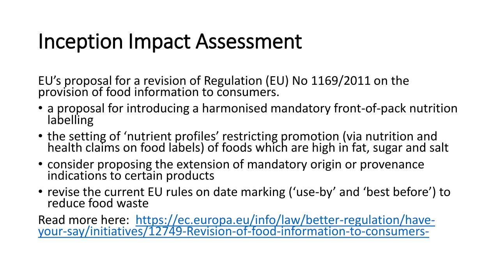

### Inception Impact Assessment

EU’s proposal for a revision of Regulation (EU) No 1169/2011 on the
provision of food information to consumers.
- a proposal for introducing a harmonised mandatory front-of-pack nutrition

labelling

- the setting of ‘nutrient profiles’ restricting promotion (via nutrition and

health claims on food labels) of foods which are high in fat, sugar and salt

- consider proposing the extension of mandatory origin or provenance

indications to certain products

- revise the current EU rules on date marking (‘use-by’ and ‘best before’) to

reduce food waste

Read more here:  https://ec.europa.eu/info/law/better-regulation/have-
your-say/initiatives/12749-Revision-of-food-information-to-consumers-

## Slide 207

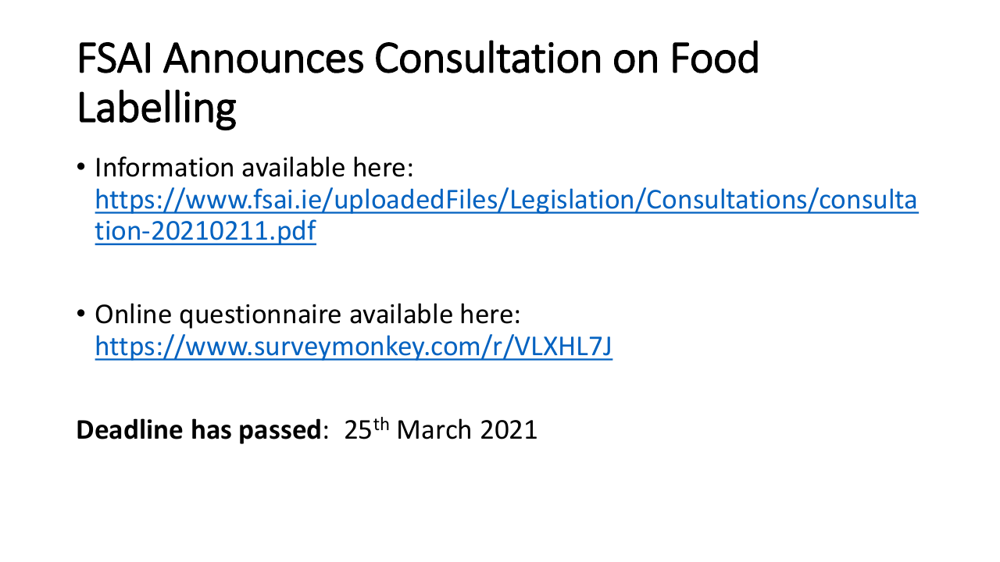

### FSAI Announces Consultation on Food — Labelling

- Information available here:

https://www.fsai.ie/uploadedFiles/Legislation/Consultations/consulta
tion-20210211.pdf

- Online questionnaire available here:

https://www.surveymonkey.com/r/VLXHL7J

Deadline has passed:  25th March 2021

## Slide 208


### EU Consultation on Labelling

https://ec.europa.eu/info/law/better-

                                          https://ec.europa.eu/info/law/better-                                                    regulation/have-your-

     Upcoming revisions to address                 regulation/have-your-
                                                    say/initiatives/12749-Food-labelling-

  concerns for front-of-pack nutrition    say/initiatives/12749-Food-labelling-    revision-of-rules-on-information-

   labelling, origin labelling and date      revision-of-rules-on-information-                     provided-to-consumers/public-

                 marking.                     provided-to-consumers/public-                                                                                consultation_en

                                                      consultation_en

## Slide 209

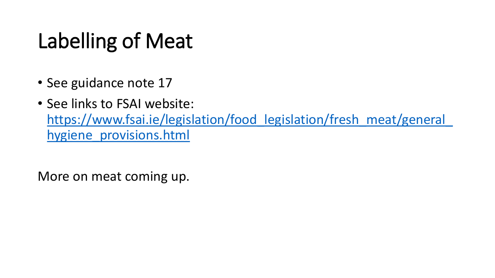

### Labelling of Meat

- See guidance note 17
- See links to FSAI website:

https://www.fsai.ie/legislation/food_legislation/fresh_meat/general_
hygiene_provisions.html

More on meat coming up.

## Slide 210


### Labelling of Meat

- See guidance note 17
- See links to FSAI website:

https://www.fsai.ie/legislation/food_legislation/fresh_meat/general_
hygiene_provisions.html

More on meat coming up.

## Slide 211

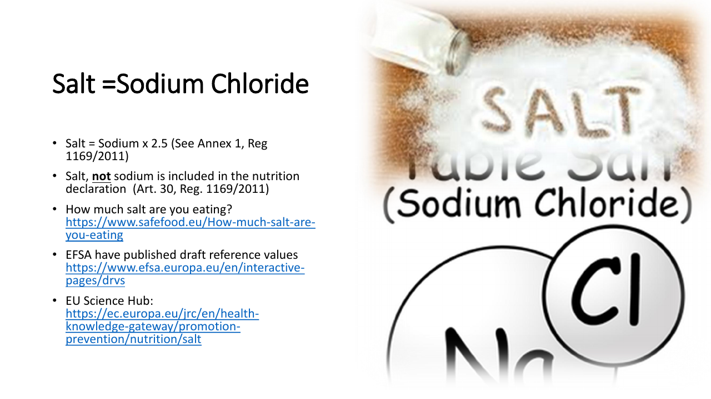

### Salt =Sodium Chloride

- Salt = Sodium x 2.5 (See Annex 1, Reg

1169/2011)

- Salt, not sodium is included in the nutrition

declaration  (Art. 30, Reg. 1169/2011)

- How much salt are you eating?

https://www.safefood.eu/How-much-salt-are-
you-eating

- EFSA have published draft reference values
https://www.efsa.europa.eu/en/interactive-
pages/drvs

- EU Science Hub:

https://ec.europa.eu/jrc/en/health-
knowledge-gateway/promotion-
prevention/nutrition/salt

## Slide 212

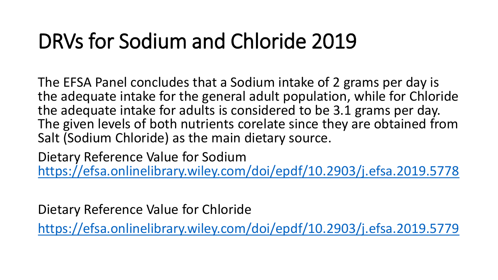

### DRVs for Sodium and Chloride 2019

The EFSA Panel concludes that a Sodium intake of 2 grams per day is
the adequate intake for the general adult population, while for Chloride
the adequate intake for adults is considered to be 3.1 grams per day.
The given levels of both nutrients corelate since they are obtained from
Salt (Sodium Chloride) as the main dietary source.
Dietary Reference Value for Sodium
https://efsa.onlinelibrary.wiley.com/doi/epdf/10.2903/j.efsa.2019.5778

Dietary Reference Value for Chloride
https://efsa.onlinelibrary.wiley.com/doi/epdf/10.2903/j.efsa.2019.5779

## Slide 213

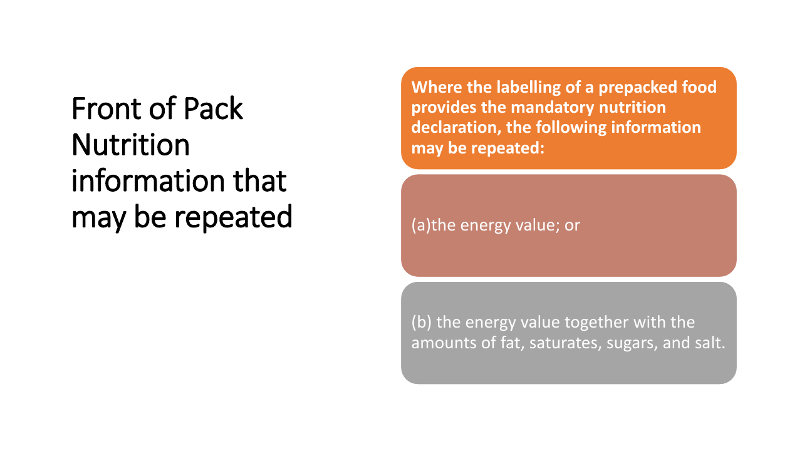

### Where the labelling of a prepacked food — Front of Pack      provides the mandatory nutrition — declaration, the following information

Nutrition          may be repeated:

information that
may be repeated    (a)the energy value; or

                   (b) the energy value together with the
                   amounts of fat, saturates, sugars, and salt.

## Slide 214

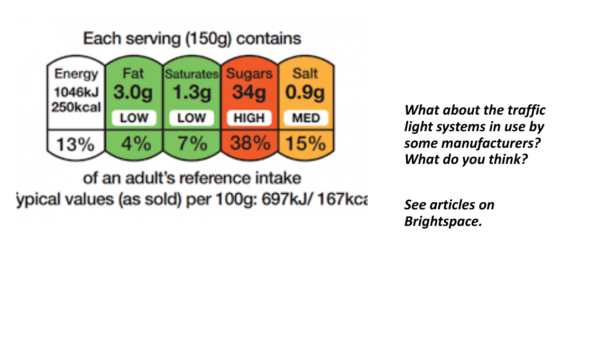

### What about the traffic — light systems in use by — some manufacturers?

What do you think?

                        See articles on
                        Brightspace.

Traffic Light Systems

## Slide 215

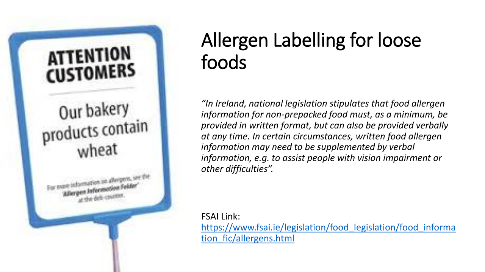

### Allergen Labelling for loose — foods

“In Ireland, national legislation stipulates that food allergen
information for non-prepacked food must, as a minimum, be
provided in written format, but can also be provided verbally
at any time. In certain circumstances, written food allergen
information may need to be supplemented by verbal
information, e.g. to assist people with vision impairment or
other difficulties”.

FSAI Link:
https://www.fsai.ie/legislation/food_legislation/food_informa
tion_fic/allergens.html

## Slide 216

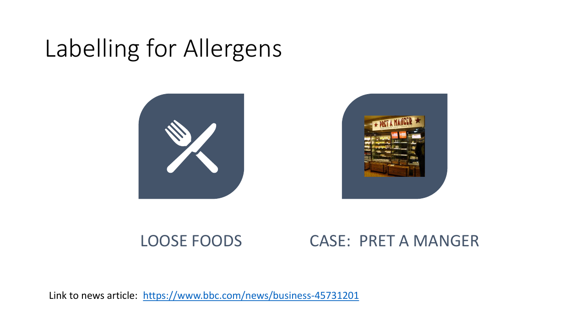

### Labelling for Allergens

LOOSE FOODS                        CASE: PRET A MANGER

Link to news article: https://www.bbc.com/news/business-45731201

## Slide 217

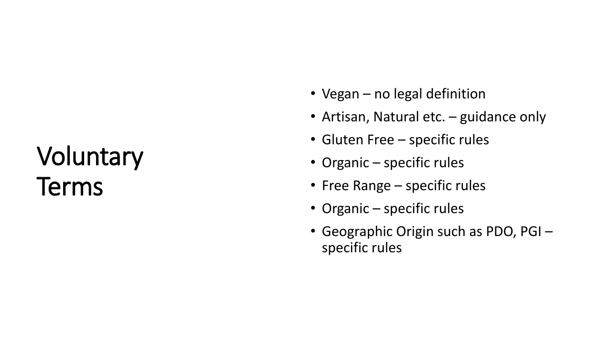

- Vegan – no legal definition
- Artisan, Natural etc. – guidance only
- Gluten Free – specific rules
Voluntary   • Organic – specific rules
Terms       • Free Range – specific rules
- Organic – specific rules
- Geographic Origin such as PDO, PGI –
              specific rules

## Slide 218

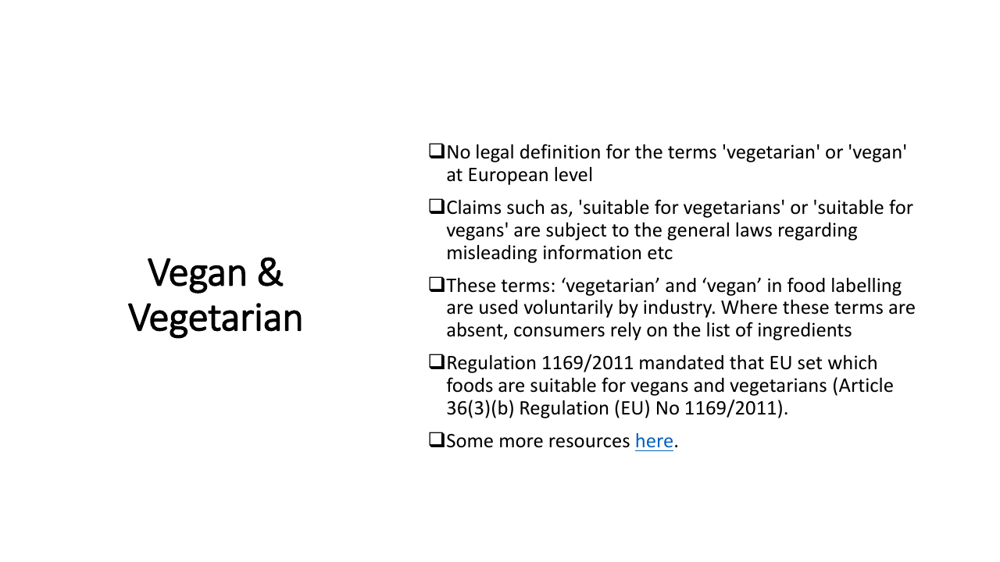

### ❑No legal definition for the terms 'vegetarian' or 'vegan' — at European level — ❑Claims such as, 'suitable for vegetarians' or 'suitable for

vegans' are subject to the general laws regarding
              misleading information etc
 Vegan &     ❑These terms: ‘vegetarian’ and ‘vegan’ in food labelling
              are used voluntarily by industry. Where these terms are
Vegetarian    absent, consumers rely on the list of ingredients
- Regulation 1169/2011 mandated that EU set which
              foods are suitable for vegans and vegetarians (Article
              36(3)(b) Regulation (EU) No 1169/2011).
- Some more resources here.

## Slide 219

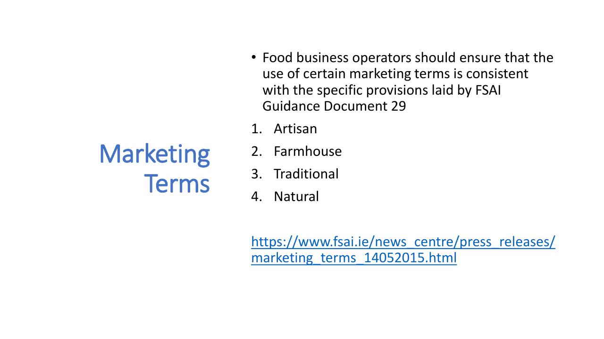

- Food business operators should ensure that the
              use of certain marketing terms is consistent
              with the specific provisions laid by FSAI
              Guidance Document 29
1. Artisan
Marketing   2. Farmhouse
3. Traditional
   Terms    4. Natural

            https://www.fsai.ie/news_centre/press_releases/
            marketing_terms_14052015.html

## Slide 220

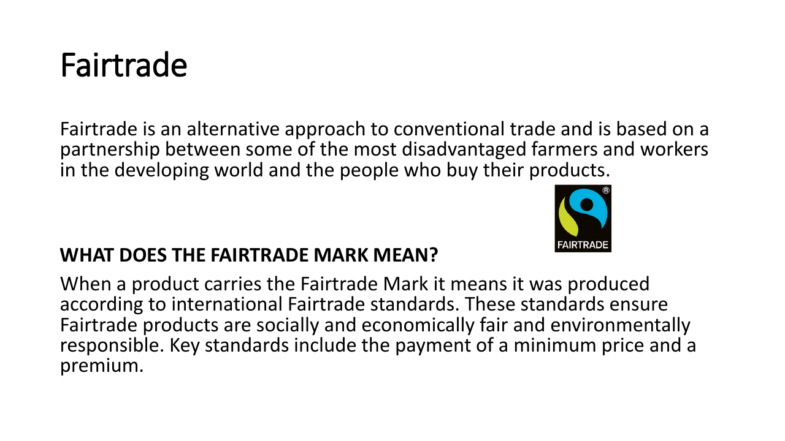

### Fairtrade

Fairtrade is an alternative approach to conventional trade and is based on a
partnership between some of the most disadvantaged farmers and workers
in the developing world and the people who buy their products.

WHAT DOES THE FAIRTRADE MARK MEAN?
When a product carries the Fairtrade Mark it means it was produced
according to international Fairtrade standards. These standards ensure
Fairtrade products are socially and economically fair and environmentally
responsible. Key standards include the payment of a minimum price and a
premium.

## Slide 221

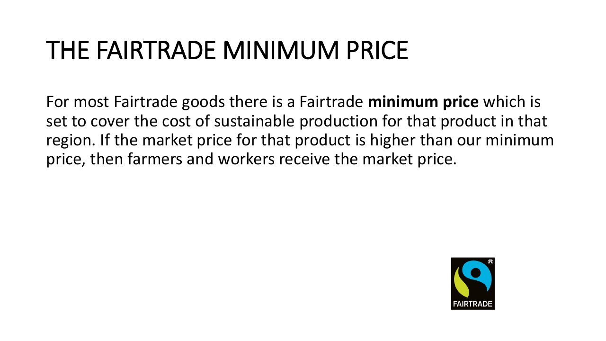

### THE FAIRTRADE MINIMUM PRICE

For most Fairtrade goods there is a Fairtrade minimum price which is
set to cover the cost of sustainable production for that product in that
region. If the market price for that product is higher than our minimum
price, then farmers and workers receive the market price.

## Slide 222

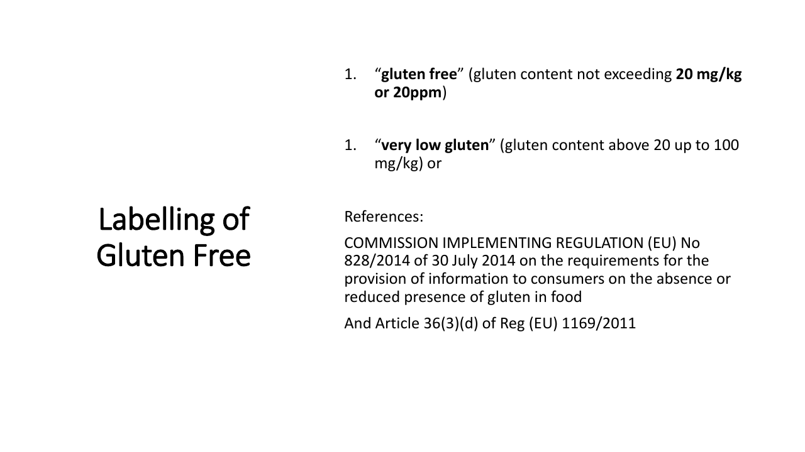

1. “gluten free” (gluten content not exceeding 20 mg/kg
                    or 20ppm)

1. “very low gluten” (gluten content above 20 up to 100
                    mg/kg) or

Labelling of   References:
               COMMISSION IMPLEMENTING REGULATION (EU) No
Gluten Free    828/2014 of 30 July 2014 on the requirements for the
               provision of information to consumers on the absence or
               reduced presence of gluten in food
               And Article 36(3)(d) of Reg (EU) 1169/2011

## Slide 223

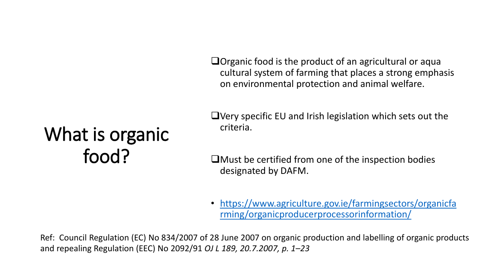

### ❑Organic food is the product of an agricultural or aqua — cultural system of farming that places a strong emphasis — on environmental protection and animal welfare.

- Very specific EU and Irish legislation which sets out the
                                             criteria.
What is organic
   food?                                    ❑Must be certified from one of the inspection bodies
                                             designated by DAFM.

- https://www.agriculture.gov.ie/farmingsectors/organicfa
                                              rming/organicproducerprocessorinformation/

Ref: Council Regulation (EC) No 834/2007 of 28 June 2007 on organic production and labelling of organic products
and repealing Regulation (EEC) No 2092/91 OJ L 189, 20.7.2007, p. 1–23

## Slide 224

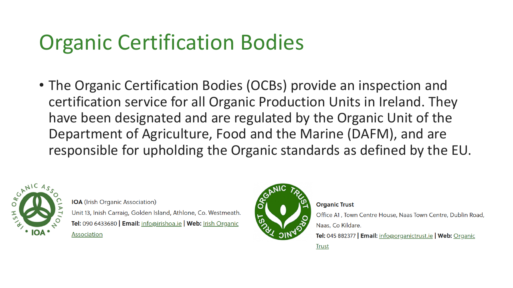

### Organic Certification Bodies

- The Organic Certification Bodies (OCBs) provide an inspection and

certification service for all Organic Production Units in Ireland. They
have been designated and are regulated by the Organic Unit of the
Department of Agriculture, Food and the Marine (DAFM), and are
responsible for upholding the Organic standards as defined by the EU.

## Slide 225

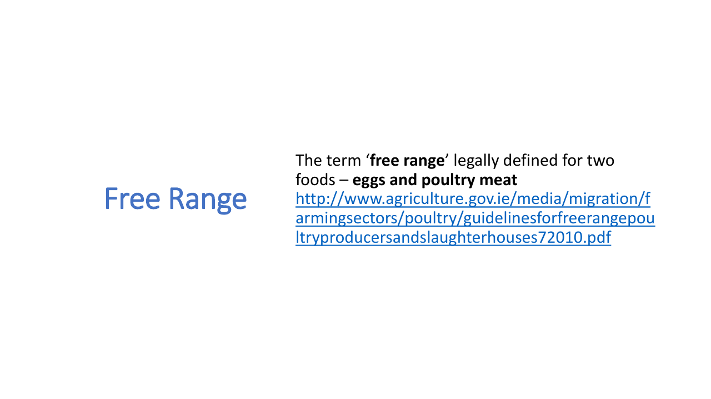

### Free Range

The term ‘free range’ legally defined for two
foods – eggs and poultry meat
http://www.agriculture.gov.ie/media/migration/f
armingsectors/poultry/guidelinesforfreerangepou
ltryproducersandslaughterhouses72010.pdf

## Slide 226


### Questions

?

## Slide 227


### Next Week - — Labelling — continued

---

<a id="lecture-4"></a>

# Lecture 4 — Week 5 (25 February 2026): Nutrition & Health Claims

**Topics:** Nutrition declaration · per-portion rules · nutrition claims · health claims · EU register · Article 13 / Article 14 · Reg 1924/2006 · FSAI guidance

**Slides:** 228–300 (73 slides)

## Slide 228


### Food Law & Regulatory Environment — *Course Title Slide*

*(Course title slide — see image for module / lecturer / date metadata.)*

Raw text:

```
Food Regulatory Affairs

Date: 25th February 2026
```

## Slide 229


### Some Announcements

## Slide 230

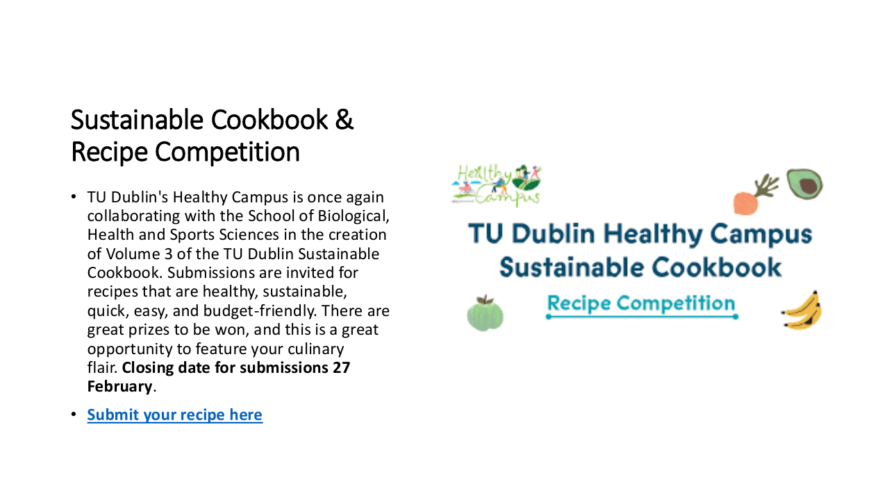

### Sustainable Cookbook & — Recipe Competition

- TU Dublin's Healthy Campus is once again
collaborating with the School of Biological,
Health and Sports Sciences in the creation
of Volume 3 of the TU Dublin Sustainable
Cookbook. Submissions are invited for
recipes that are healthy, sustainable,
quick, easy, and budget-friendly. There are
great prizes to be won, and this is a great
opportunity to feature your culinary
flair. Closing date for submissions 27
February.

- Submit your recipe here

## Slide 231


### TU Dublin is hosting the inaugural Student — Sustainability Research Conference on 31 March — 2026 at the East Quad Grangegorman.

- 

- 

- 

- 

- 

- 

- 

- 

This conference is an opportunity for students of all
disciplines and levels of study from across Ireland to share
ideas and best practice for sustainability-related projects with
each other and to take part in student led sustainability
activities.

If you have completed work or are working on research
projects, this is a chance to present you findings and ideas to
fellow students.

Key details:

Presentation will be short (approx 7 minutes) and in a format
you think suitable.

The Irish Journal of Social Economic and Environmental
Sustainability will publish a set of abstracts and summaries of
the work presented at the conference.

The morning is dedicated to presentations while in the
afternoon the focus will be on activities.

The Career Development Centre of TU Dublin will be
providing information on careers opportunities in
sustainability.

To apply, please fill out this form

## Slide 232


### Can you find your way around — an EU Regulation?

Today’s   Health and Nutrition Claims
Lecture

          FAQs and AOB

## Slide 233

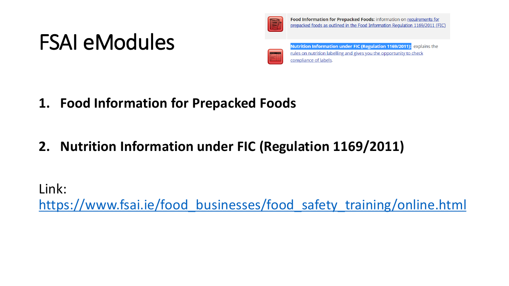

### FSAI eModules

1. Food Information for Prepacked Foods

2. Nutrition Information under FIC (Regulation 1169/2011)

Link:
https://www.fsai.ie/food_businesses/food_safety_training/online.html

## Slide 234

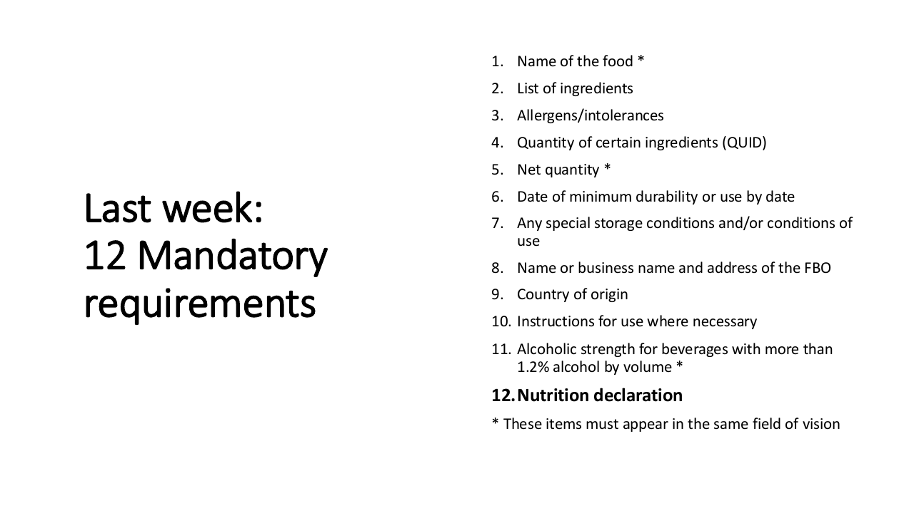

1. Name of the food *
2. List of ingredients
3. Allergens/intolerances
4. Quantity of certain ingredients (QUID)
5. Net quantity *

Last week:     6. Date of minimum durability or use by date
7. Any special storage conditions and/or conditions of

12 Mandatory
                  use
8. Name or business name and address of the FBO

requirements   9. Country of origin
10. Instructions for use where necessary
11. Alcoholic strength for beverages with more than
                   1.2% alcohol by volume *
               12.Nutrition declaration
               * These items must appear in the same field of vision

## Slide 235

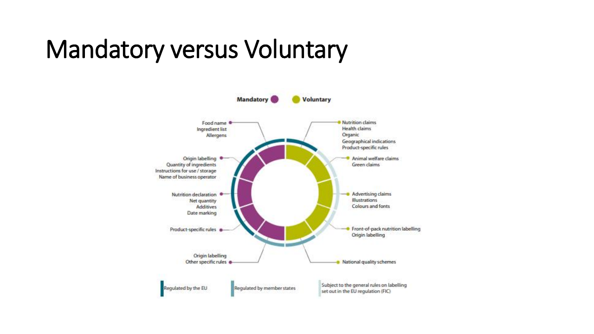

### Mandatory versus Voluntary

## Slide 236

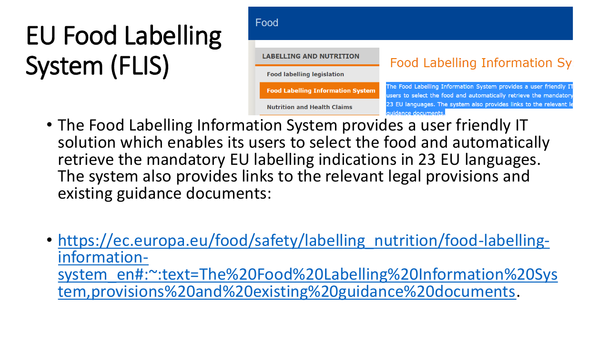

### EU Food Labelling — System (FLIS)

- The Food Labelling Information System provides a user friendly IT

solution which enables its users to select the food and automatically
retrieve the mandatory EU labelling indications in 23 EU languages.
The system also provides links to the relevant legal provisions and
existing guidance documents:

- https://ec.europa.eu/food/safety/labelling_nutrition/food-labelling-

information-
system_en#:~:text=The%20Food%20Labelling%20Information%20Sys
tem,provisions%20and%20existing%20guidance%20documents.

## Slide 237

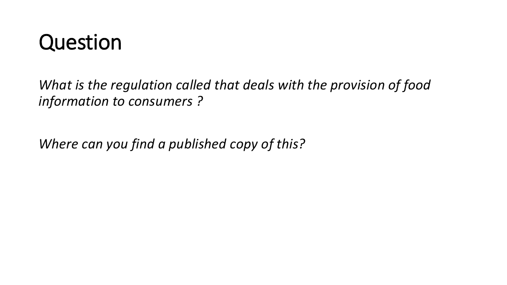

### Question

What is the regulation called that deals with the provision of food
information to consumers ?

Where can you find a published copy of this?

## Slide 238

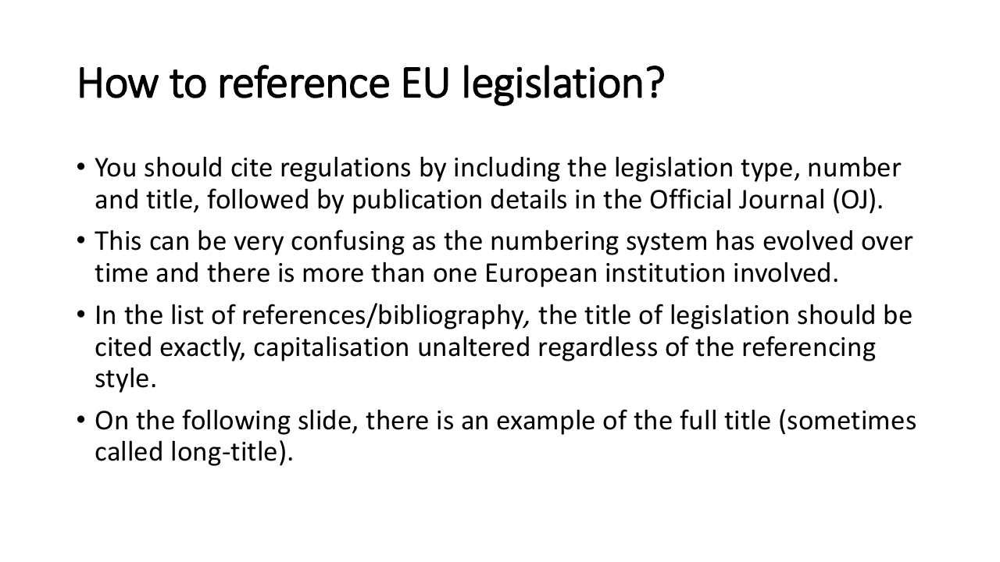

### How to reference EU legislation?

- You should cite regulations by including the legislation type, number
and title, followed by publication details in the Official Journal (OJ).
- This can be very confusing as the numbering system has evolved over

time and there is more than one European institution involved.

- In the list of references/bibliography, the title of legislation should be
cited exactly, capitalisation unaltered regardless of the referencing
style.

- On the following slide, there is an example of the full title (sometimes

called long-title).

## Slide 239

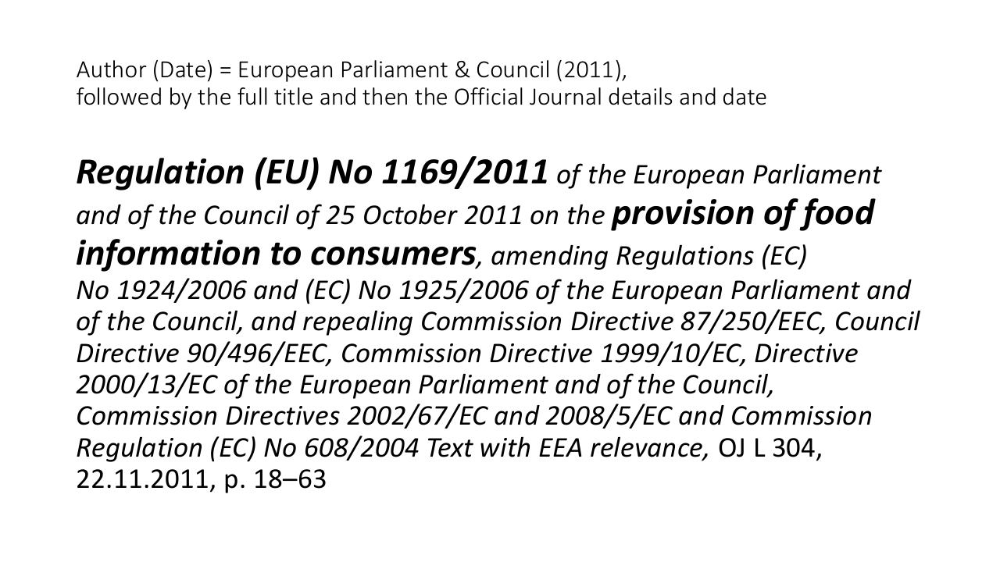

### Author (Date) = European Parliament & Council (2011), — followed by the full title and then the Official Journal details and date

Regulation (EU) No 1169/2011 of the European Parliament
and of the Council of 25 October 2011 on the provision of food
information to consumers, amending Regulations (EC)
No 1924/2006 and (EC) No 1925/2006 of the European Parliament and
of the Council, and repealing Commission Directive 87/250/EEC, Council
Directive 90/496/EEC, Commission Directive 1999/10/EC, Directive
2000/13/EC of the European Parliament and of the Council,
Commission Directives 2002/67/EC and 2008/5/EC and Commission
Regulation (EC) No 608/2004 Text with EEA relevance, OJ L 304,
22.11.2011, p. 18–63

## Slide 240

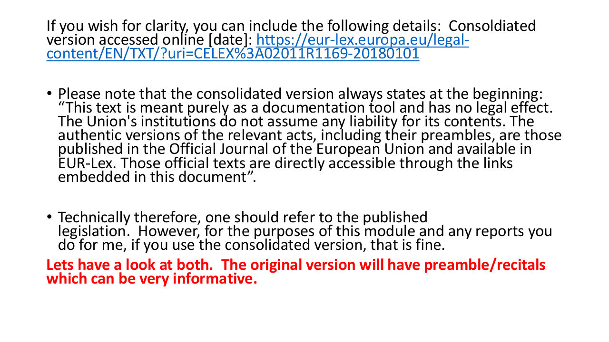

### If you wish for clarity, you can include the following details:  Consoldiated — version accessed online [date]: https://eur-lex.europa.eu/legal- — content/EN/TXT/?uri=CELEX%3A02011R1169-20180101

- Please note that the consolidated version always states at the beginning:

“This text is meant purely as a documentation tool and has no legal effect.
The Union's institutions do not assume any liability for its contents. The
authentic versions of the relevant acts, including their preambles, are those
published in the Official Journal of the European Union and available in
EUR-Lex. Those official texts are directly accessible through the links
embedded in this document”.

- Technically therefore, one should refer to the published

legislation.  However, for the purposes of this module and any reports you
do for me, if you use the consolidated version, that is fine.

Lets have a look at both.  The original version will have preamble/recitals
which can be very informative.

## Slide 241

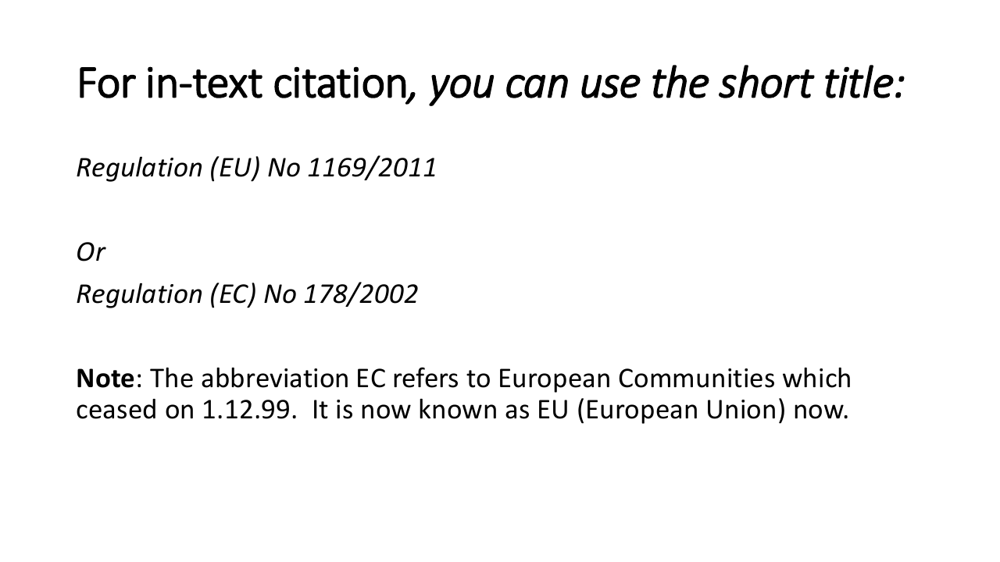

### For in-text citation, you can use the short title:

Regulation (EU) No 1169/2011

Or
Regulation (EC) No 178/2002

Note: The abbreviation EC refers to European Communities which
ceased on 1.12.99.  It is now known as EU (European Union) now.

## Slide 242

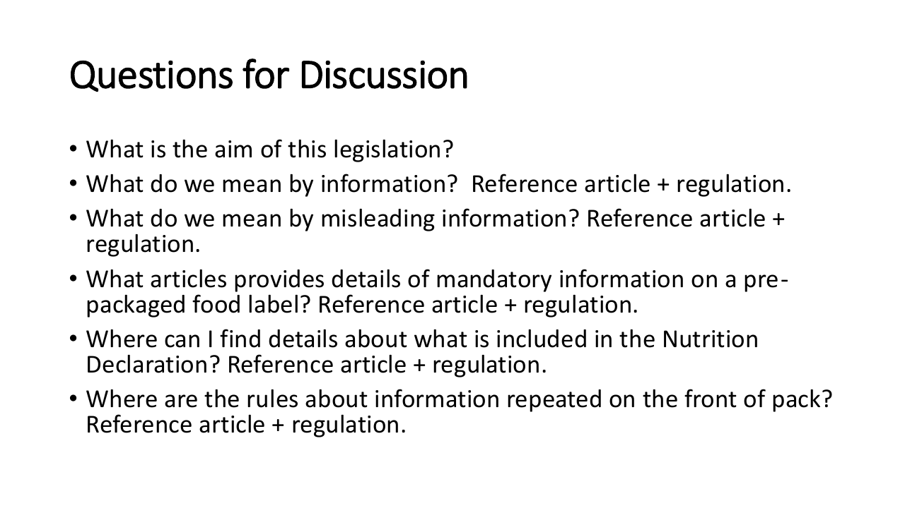

### Questions for Discussion

- What is the aim of this legislation?
- What do we mean by information?  Reference article + regulation.
- What do we mean by misleading information? Reference article +

regulation.

- What articles provides details of mandatory information on a pre-

packaged food label? Reference article + regulation.

- Where can I find details about what is included in the Nutrition

Declaration? Reference article + regulation.

- Where are the rules about information repeated on the front of pack?

Reference article + regulation.

## Slide 243

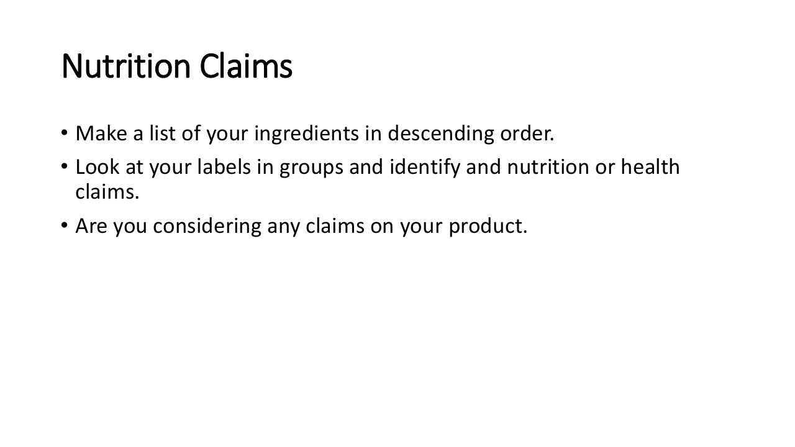

### Nutrition Claims

- Make a list of your ingredients in descending order.
- Look at your labels in groups and identify and nutrition or health

claims.

- Are you considering any claims on your product.

## Slide 244

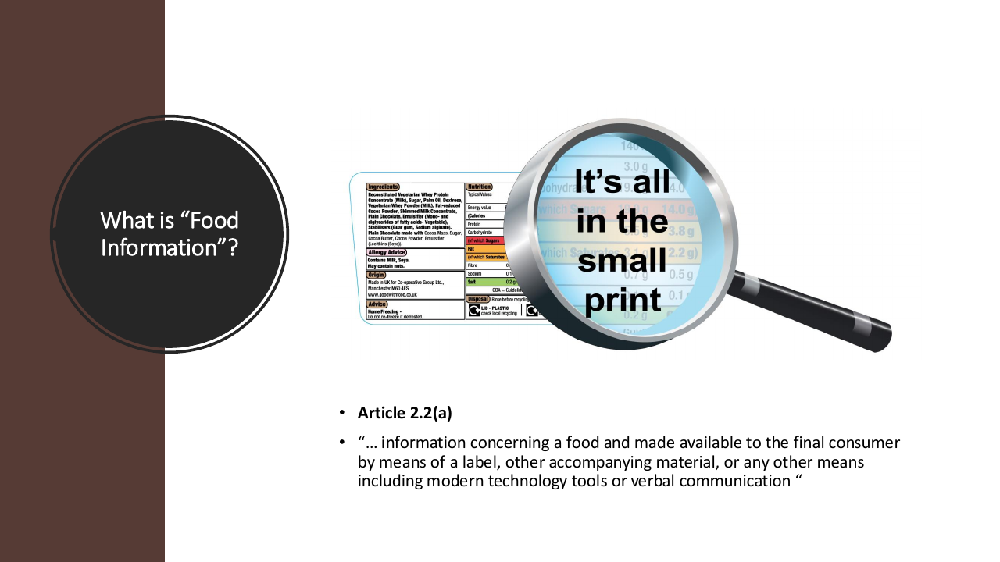

### What is “Food — Information”?

- Article 2.2(a)
- “… information concerning a food and made available to the final consumer
                  by means of a label, other accompanying material, or any other means
                  including modern technology tools or verbal communication “

## Slide 245

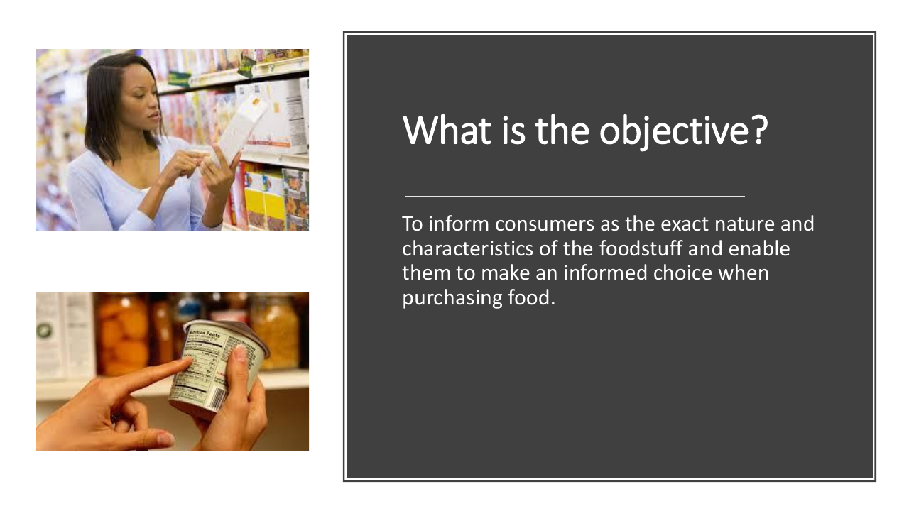

### What is the objective?

To inform consumers as the exact nature and
characteristics of the foodstuff and enable
them to make an informed choice when
purchasing food.

## Slide 246

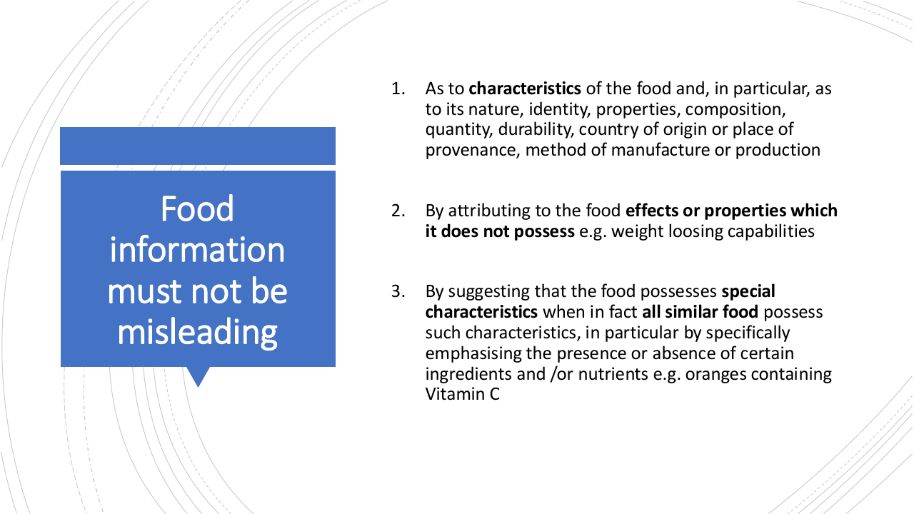

1. As to characteristics of the food and, in particular, as
                   to its nature, identity, properties, composition,
                   quantity, durability, country of origin or place of
                   provenance, method of manufacture or production

    Food      2.   By attributing to the food effects or properties which
                   it does not possess e.g. weight loosing capabilities
information
must not be   3.   By suggesting that the food possesses special
                   characteristics when in fact all similar food possess
 misleading        such characteristics, in particular by specifically
                   emphasising the presence or absence of certain
                   ingredients and /or nutrients e.g. oranges containing
                   Vitamin C

## Slide 247

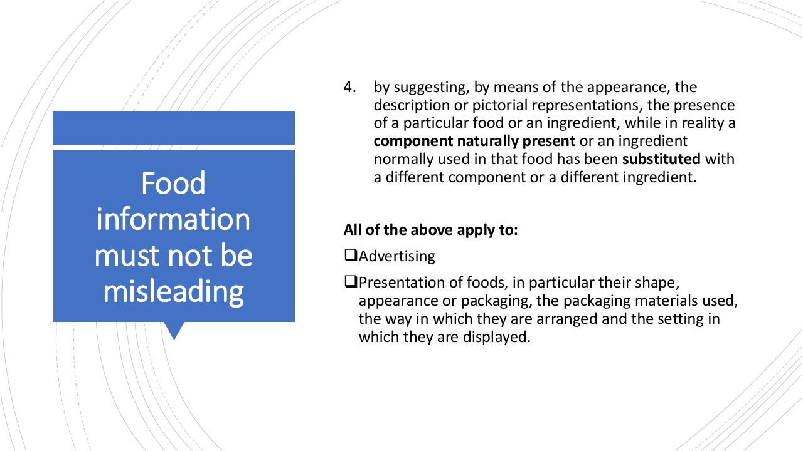

4. by suggesting, by means of the appearance, the
                   description or pictorial representations, the presence
                   of a particular food or an ingredient, while in reality a
                   component naturally present or an ingredient
                   normally used in that food has been substituted with
    Food           a different component or a different ingredient.

information   All of the above apply to:
must not be   ❑Advertising

 misleading   ❑Presentation of foods, in particular their shape,
               appearance or packaging, the packaging materials used,
               the way in which they are arranged and the setting in
               which they are displayed.

## Slide 248

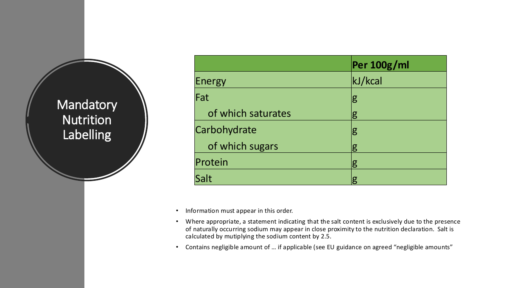

### Per 100g/ml — Energy                                                  kJ/kcal — Fat                                                     g

Mandatory
                       of which saturates                                   g
Nutrition
 Labelling          Carbohydrate                                            g
                       of which sugars                                      g
                    Protein                                                 g
                    Salt                                                    g

- Information must appear in this order.
- Where appropriate, a statement indicating that the salt content is exclusively due to the presence
                 of naturally occurring sodium may appear in close proximity to the nutrition declaration. Salt is
                 calculated by mutiplying the sodium content by 2.5.
- Contains negligible amount of … if applicable (see EU guidance on agreed “negligible amounts”

## Slide 249

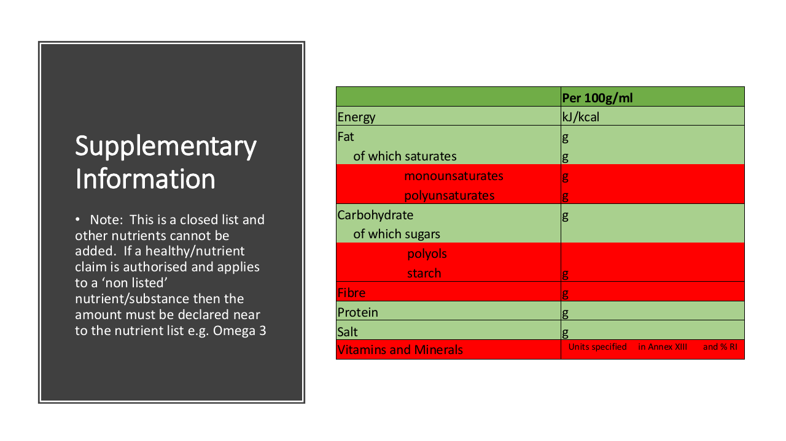

### Per 100g/ml — Energy                        kJ/kcal

Supplementary                       Fat
                                       of which saturates
                                                                  g
                                                                  g
Information                                     monounsaturates
                                                polyunsaturates
                                                                  g
                                                                  g
- Note: This is a closed list and   Carbohydrate                  g
other nutrients cannot be              of which sugars
added. If a healthy/nutrient                    polyols
claim is authorised and applies                 starch            g
to a ‘non listed’
nutrient/substance then the         Fibre                         g
amount must be declared near        Protein                       g
to the nutrient list e.g. Omega 3   Salt                          g
                                    Vitamins and Minerals         Units specified   in Annex XIII   and % RI

## Slide 250

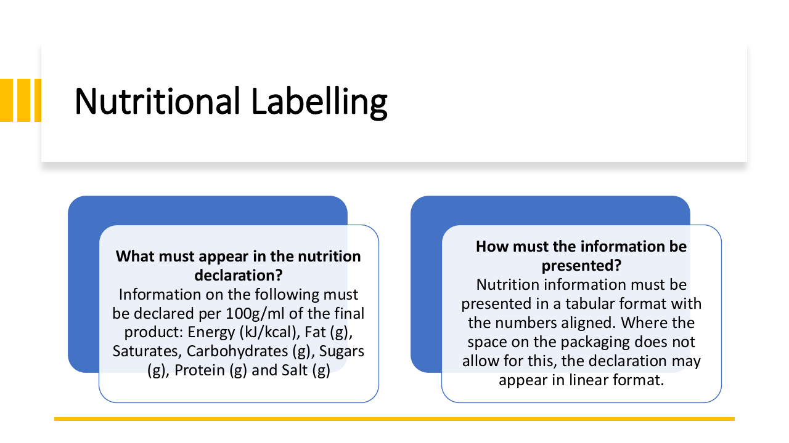

### Nutritional Labelling

How must the information be
  What must appear in the nutrition
                                                      presented?
               declaration?
                                            Nutrition information must be
   Information on the following must
                                          presented in a tabular format with
  be declared per 100g/ml of the final
                                           the numbers aligned. Where the
    product: Energy (kJ/kcal), Fat (g),
                                           space on the packaging does not
  Saturates, Carbohydrates (g), Sugars
                                          allow for this, the declaration may
       (g), Protein (g) and Salt (g)
                                               appear in linear format.

## Slide 251

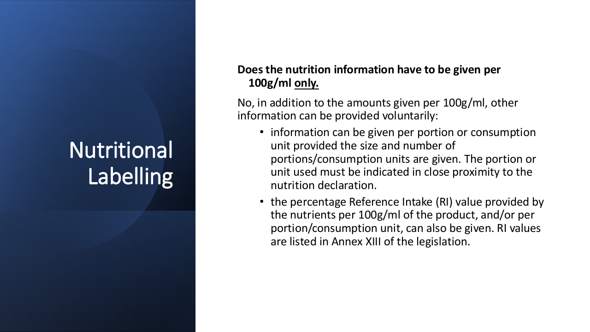

### Does the nutrition information have to be given per — 100g/ml only. — No, in addition to the amounts given per 100g/ml, other

information can be provided voluntarily:
- information can be given per portion or consumption
Nutritional          unit provided the size and number of
                     portions/consumption units are given. The portion or
 Labelling           unit used must be indicated in close proximity to the
                     nutrition declaration.
- the percentage Reference Intake (RI) value provided by
                     the nutrients per 100g/ml of the product, and/or per
                     portion/consumption unit, can also be given. RI values
                     are listed in Annex XIII of the legislation.

## Slide 252

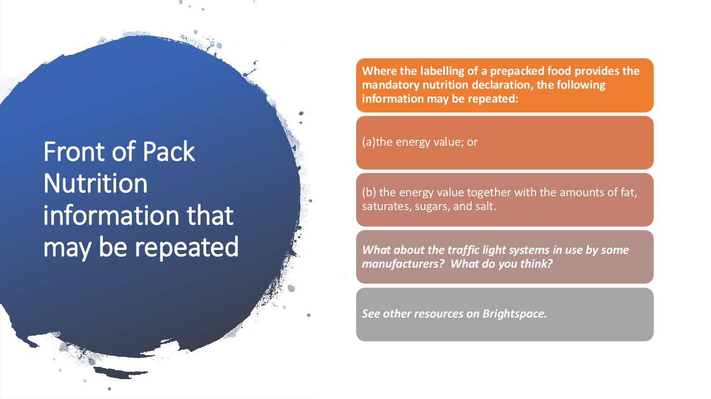

### Where the labelling of a prepacked food provides the — mandatory nutrition declaration, the following — information may be repeated:

Front of Pack      (a)the energy value; or

Nutrition          (b) the energy value together with the amounts of fat,

information that   saturates, sugars, and salt.

may be repeated    What about the traffic light systems in use by some
                   manufacturers? What do you think?

                   See other resources on Brightspace.

## Slide 253

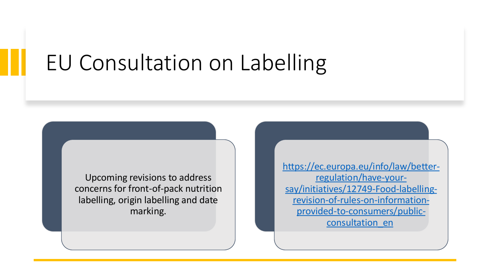

### EU Consultation on Labelling

https://ec.europa.eu/info/law/better-
                                          https://ec.europa.eu/info/law/better-

     Upcoming revisions to address                 regulation/have-your-
                                                               regulation/have-your-

  concerns for front-of-pack nutrition    say/initiatives/12749-Food-labelling-
                                           say/initiatives/12749-Food-labelling-

   labelling, origin labelling and date      revision-of-rules-on-information-
                                                revision-of-rules-on-information-

                 marking.                     provided-to-consumers/public-
                                                   provided-to-consumers/public-

                                                      consultation_en
                                                                      consultation_en

## Slide 254

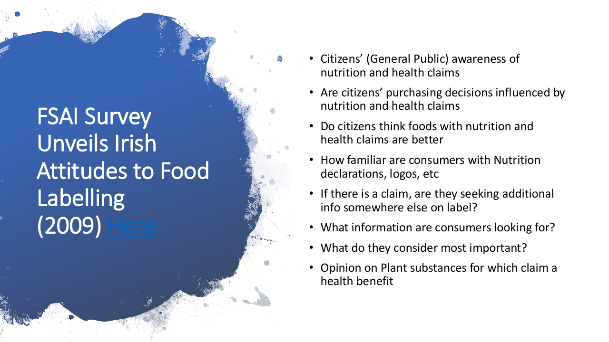

- Citizens’ (General Public) awareness of
                      nutrition and health claims
- Are citizens’ purchasing decisions influenced by
                      nutrition and health claims
FSAI Survey         • Do citizens think foods with nutrition and
Unveils Irish         health claims are better
- How familiar are consumers with Nutrition
Attitudes to Food     declarations, logos, etc

Labelling           • If there is a claim, are they seeking additional
                      info somewhere else on label?
(2009) Here         • What information are consumers looking for?
- What do they consider most important?
- Opinion on Plant substances for which claim a
                      health benefit

## Slide 255

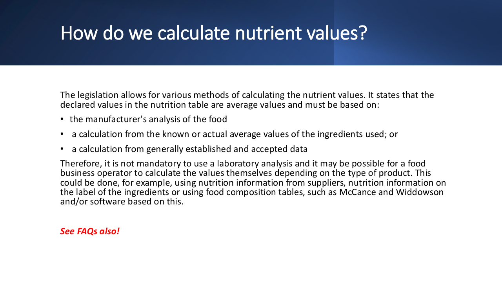

### How do we calculate nutrient values?

The legislation allows for various methods of calculating the nutrient values. It states that the
declared values in the nutrition table are average values and must be based on:
- the manufacturer's analysis of the food
- a calculation from the known or actual average values of the ingredients used; or
- a calculation from generally established and accepted data
Therefore, it is not mandatory to use a laboratory analysis and it may be possible for a food
business operator to calculate the values themselves depending on the type of product. This
could be done, for example, using nutrition information from suppliers, nutrition information on
the label of the ingredients or using food composition tables, such as McCance and Widdowson
and/or software based on this.

See FAQs also!

## Slide 256

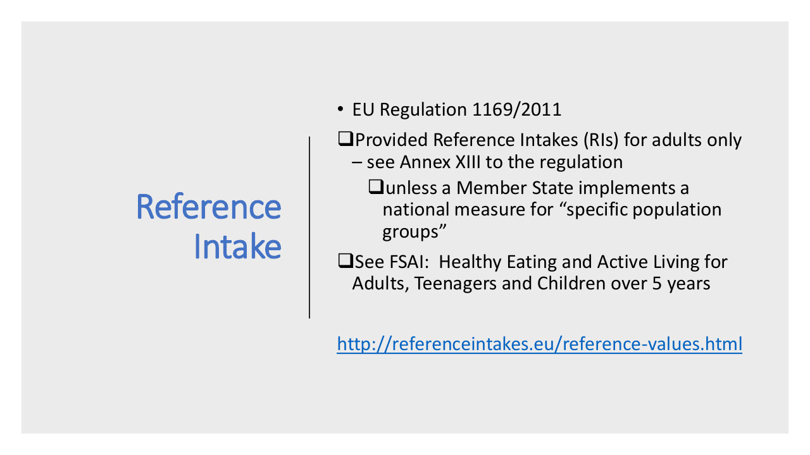

- EU Regulation 1169/2011
- Provided Reference Intakes (RIs) for adults only
              – see Annex XIII to the regulation
- unless a Member State implements a
Reference         national measure for “specific population
                  groups”
    Intake   ❑See FSAI: Healthy Eating and Active Living for
              Adults, Teenagers and Children over 5 years

             http://referenceintakes.eu/reference-values.html

## Slide 257

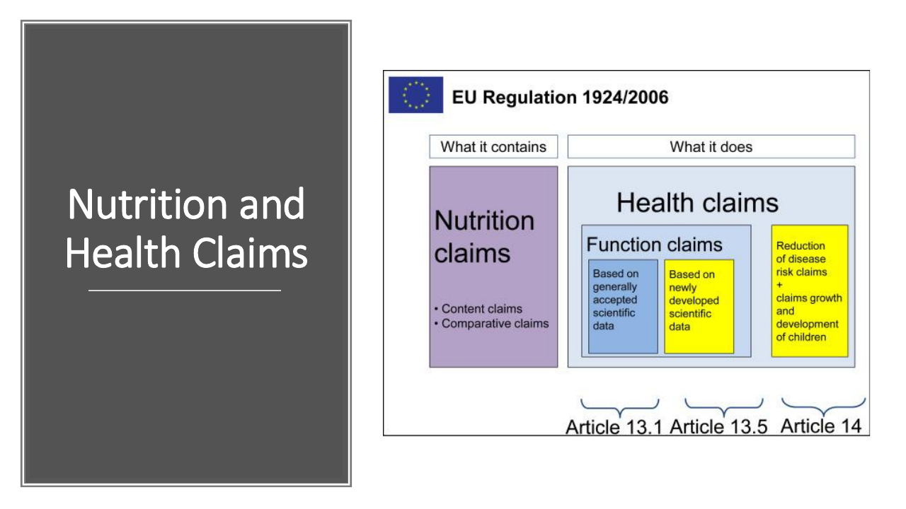

### Nutrition and — Health Claims

## Slide 258


### What is a — claim?

Any message or representation,
which is not mandatory

## Slide 259

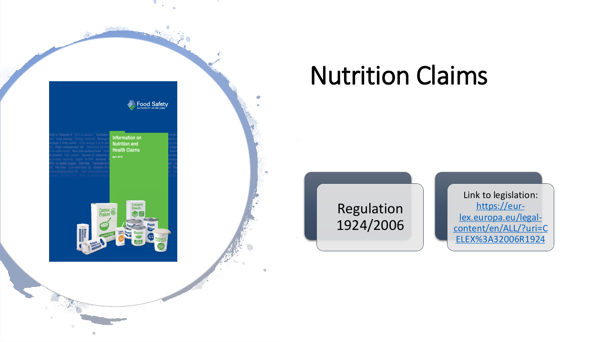

### Nutrition Claims

Link to legislation:
  Regulation               https://eur-
                           https://eur-

                  lex.europa.eu/legal-
                  lex.europa.eu/legal-

  1924/2006    content/en/ALL/?uri=C
               content/en/ALL/?uri=C

                ELEX%3A32006R1924
                ELEX%3A32006R1924

## Slide 260

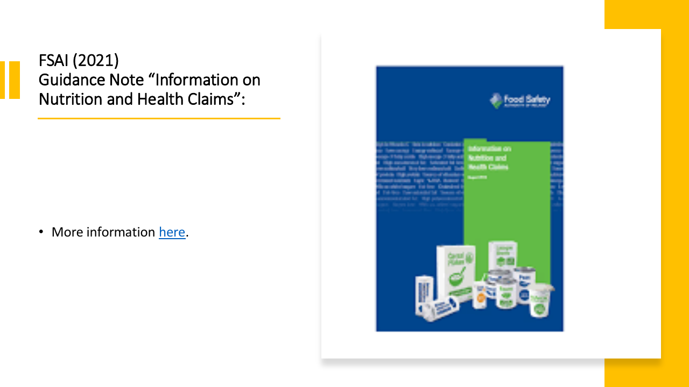

### FSAI (2021) — Guidance Note “Information on — Nutrition and Health Claims”:

- More information here.

## Slide 261

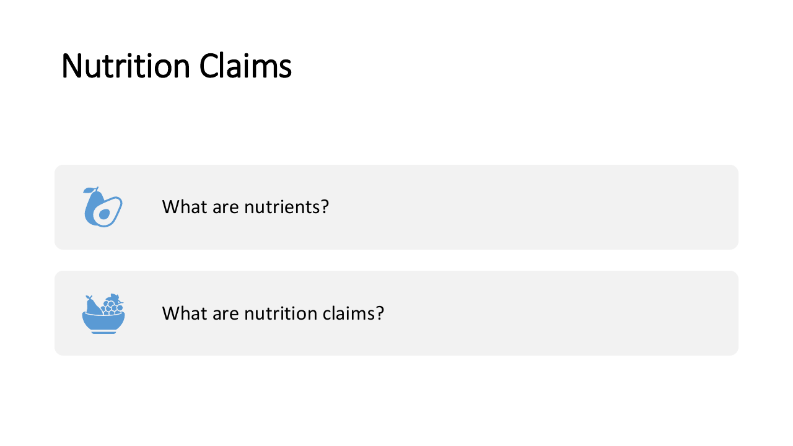

### Nutrition Claims

What are nutrients?

      What are nutrition claims?

## Slide 262

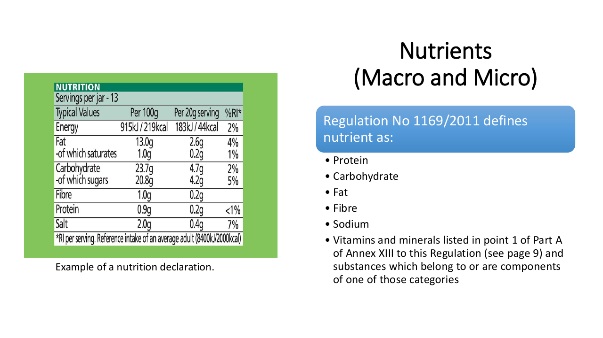

### Nutrients — (Macro and Micro) — Regulation No 1169/2011 defines

nutrient as:
- Protein
- Carbohydrate
- Fat
- Fibre
- Sodium
- Vitamins and minerals listed in point 1 of Part A
                                        of Annex XIII to this Regulation (see page 9) and
Example of a nutrition declaration.     substances which belong to or are components
                                        of one of those categories

## Slide 263

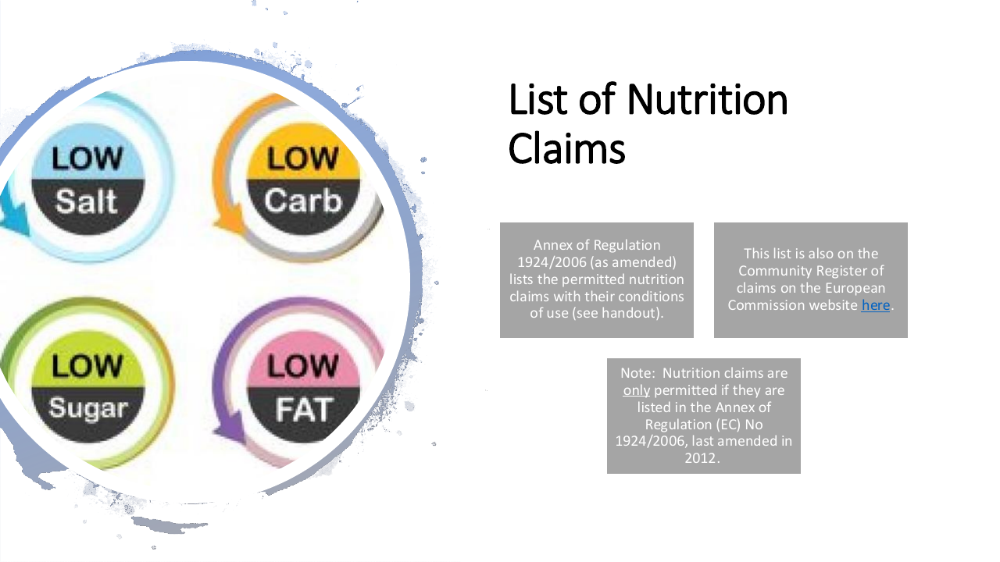

### List of Nutrition — Claims — Annex of Regulation

This list is also on the
  1924/2006 (as amended)
                                   Community Register of
lists the permitted nutrition
                                   claims on the European
claims with their conditions
                                  Commission website here here.
    of use (see handout).

                  Note: Nutrition claims are
                  only permitted if they are
                    listed in the Annex of
                      Regulation (EC) No
                 1924/2006, last amended in
                             2012.

## Slide 264

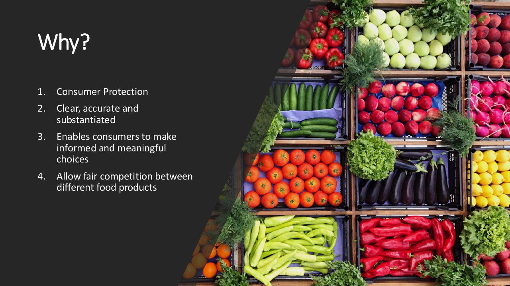

### Why?

1. Consumer Protection

2. Clear, accurate and
substantiated

3.

Enables consumers to make
informed and meaningful
choices

4. Allow fair competition between

different food products

## Slide 265

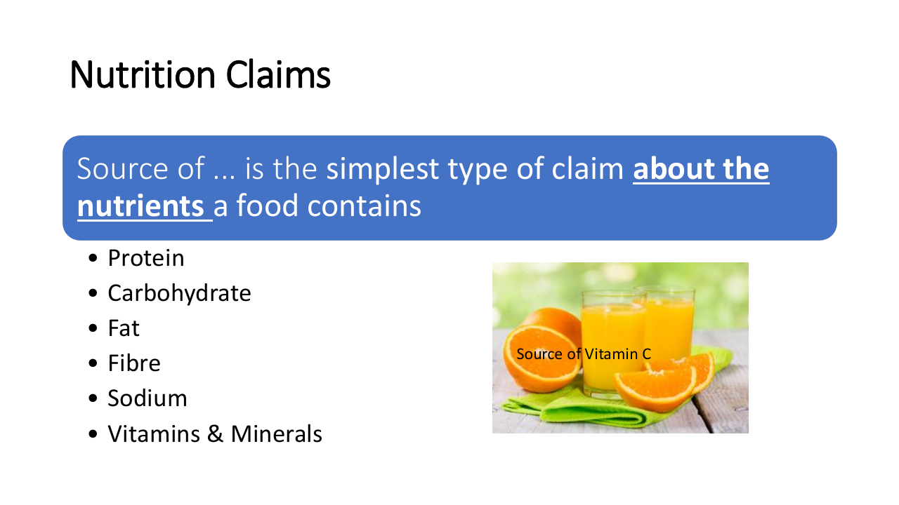

### Nutrition Claims

Source of ... is the simplest type of claim about the
nutrients a food contains
- Protein
- Carbohydrate
- Fat
                                 Source of Vitamin C
- Fibre
- Sodium
- Vitamins & Minerals

## Slide 266

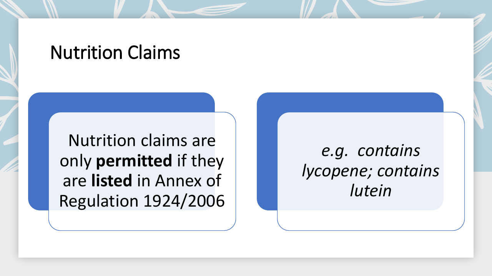

### Nutrition Claims

Nutrition claims are
                             e.g. contains
 only permitted if they
                          lycopene; contains
 are listed in Annex of
                                 lutein
 Regulation 1924/2006

## Slide 267

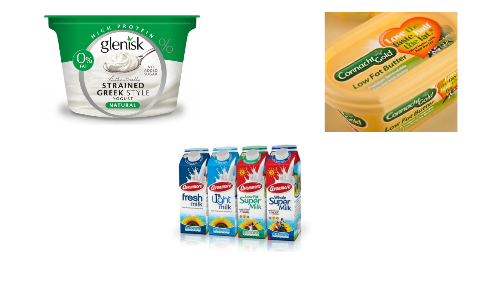

### *(Image-only slide — no extractable text.)*

Product packaging examples (Irish market):
- **Glenisk** High Protein Strained Greek Style Yogurt — "0% Fat", "No Added Sugar"
- **Connacht Gold** Low Fat Butter — "Love the Taste, Half the Fat"
- **Avonmore** milk range: Fresh Milk, Light Milk, Low Fat Super Milk, Whole Super Milk

## Slide 268


### Some Calculations

## Slide 269

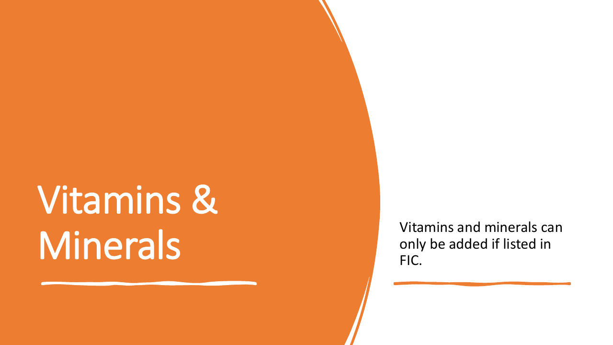

### Vitamins &   Vitamins and minerals can — Minerals     only be added if listed in — FIC.

## Slide 270

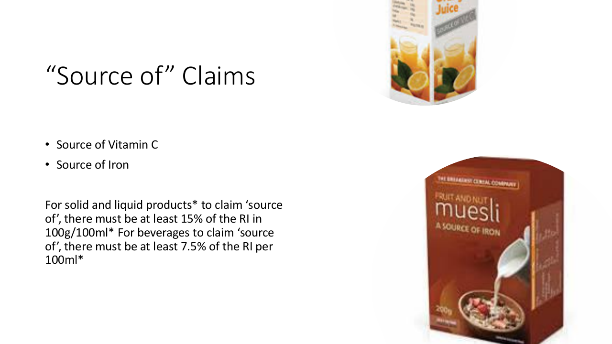

### “Source of” Claims

- Source of Vitamin C
- Source of Iron

For solid and liquid products* to claim ‘source
of’, there must be at least 15% of the RI in
100g/100ml* For beverages to claim ‘source
of’, there must be at least 7.5% of the RI per
100ml*

## Slide 271

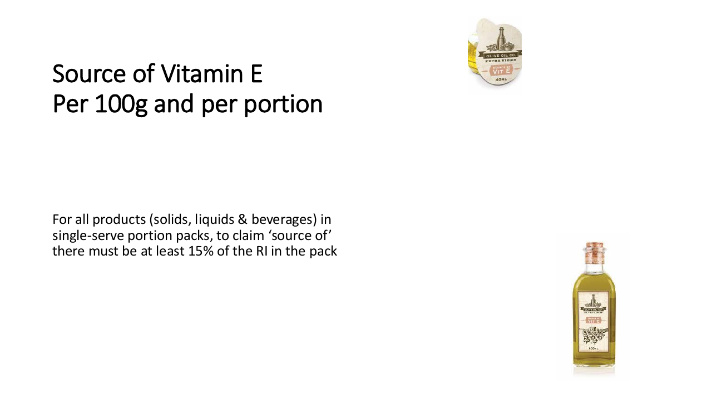

### Source of Vitamin E — Per 100g and per portion

For all products (solids, liquids & beverages) in
single-serve portion packs, to claim ‘source of’
there must be at least 15% of the RI in the pack

## Slide 272

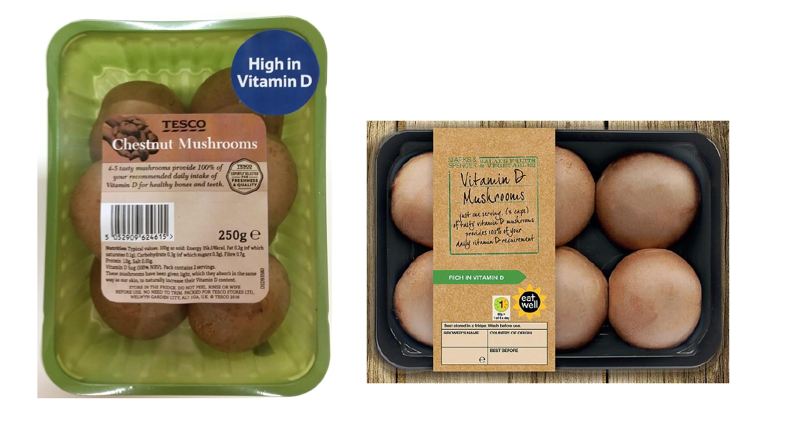

### *(Image-only slide — no extractable text.)*

Product packaging examples — Vitamin D nutrition claims:
- **Tesco Chestnut Mushrooms** (250g) — "High in Vitamin D"
- **Vitamin D Mushrooms** retail pack — "Rich in Vitamin D"

## Slide 273

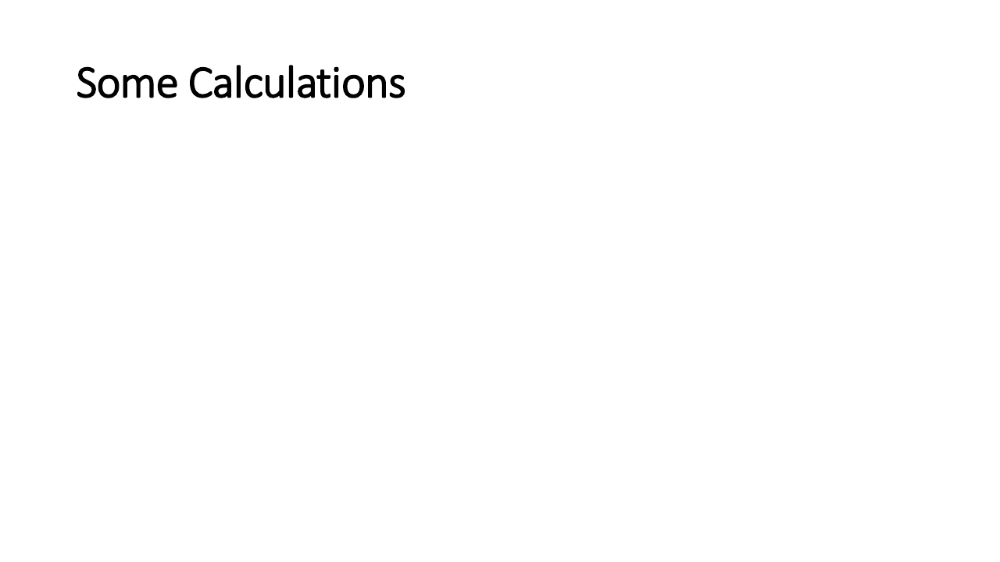

### Some Calculations

## Slide 274

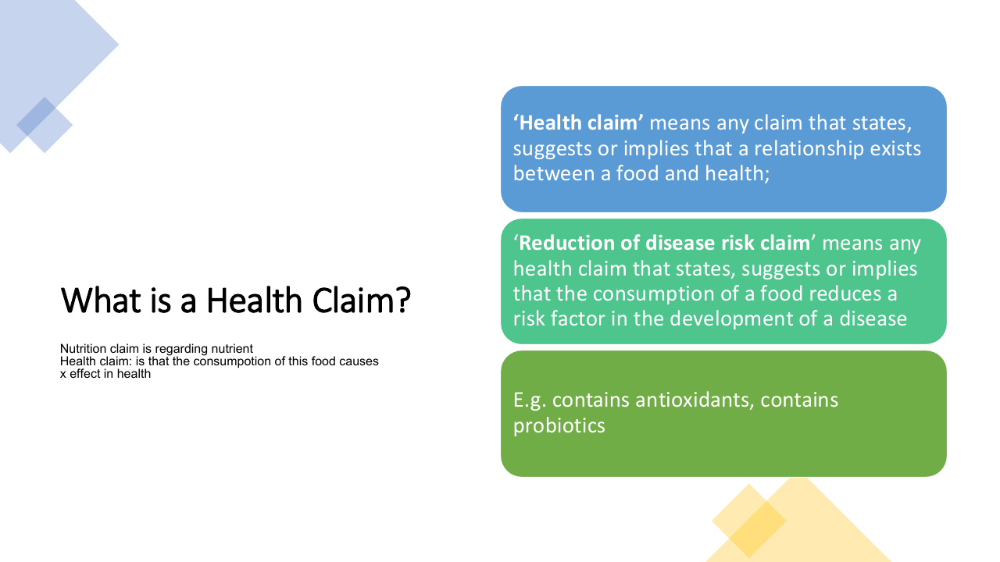

### ‘Health claim’ means any claim that states, — suggests or implies that a relationship exists — between a food and health;

‘Reduction of disease risk claim’ means any
                                                             health claim that states, suggests or implies
What is a Health Claim?                                      that the consumption of a food reduces a
                                                             risk factor in the development of a disease
Nutrition claim is regarding nutrient
Health claim: is that the consumpotion of this food causes
x effect in health

                                                             E.g. contains antioxidants, contains
                                                             probiotics

## Slide 275

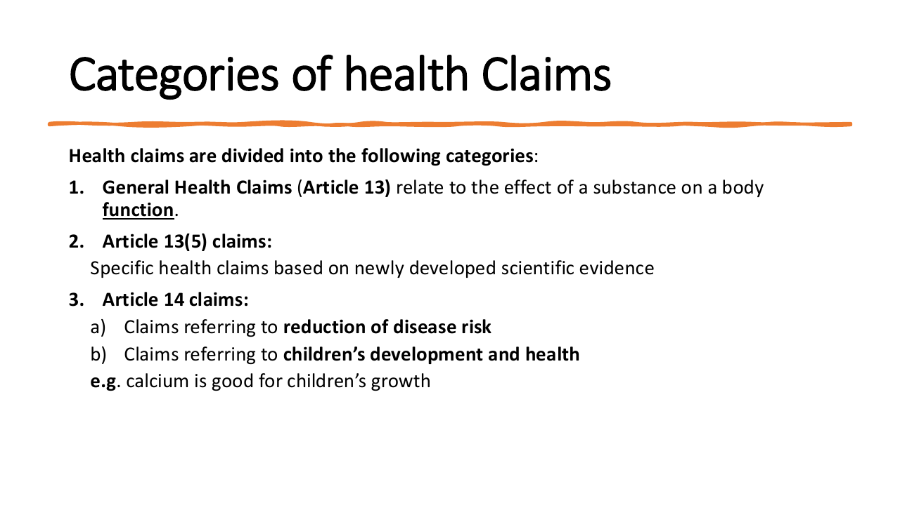

### Categories of health Claims

Health claims are divided into the following categories:

1. General Health Claims (Article 13) relate to the effect of a substance on a body

function.

2. Article 13(5) claims:

Specific health claims based on newly developed scientific evidence

3. Article 14 claims:

    a. Claims referring to reduction of disease risk
    b. Claims referring to children’s development and health
e.g. calcium is good for children’s growth

## Slide 276

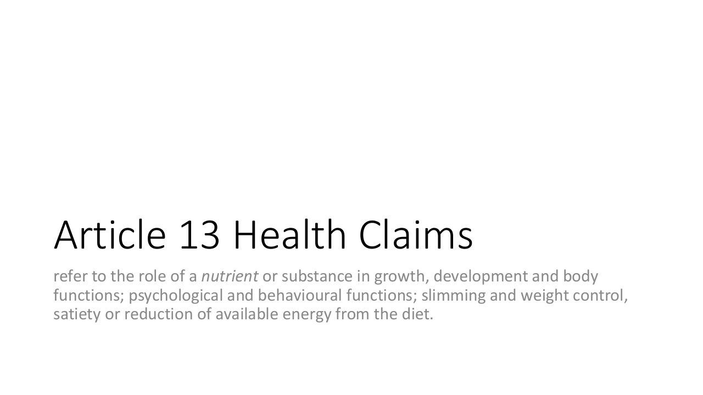

### Article 13 Health Claims

refer to the role of a nutrient or substance in growth, development and body
functions; psychological and behavioural functions; slimming and weight control,
satiety or reduction of available energy from the diet.

## Slide 277

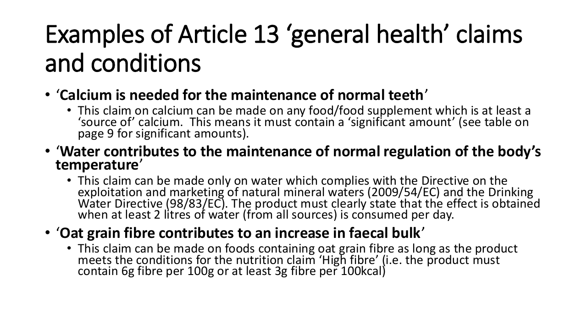

### Examples of Article 13 ‘general health’ claims — and conditions

- ‘Calcium is needed for the maintenance of normal teeth’

- This claim on calcium can be made on any food/food supplement which is at least a
‘source of’ calcium.  This means it must contain a ‘significant amount’ (see table on
page 9 for significant amounts).

- ‘Water contributes to the maintenance of normal regulation of the body’s

temperature’

- This claim can be made only on water which complies with the Directive on the

exploitation and marketing of natural mineral waters (2009/54/EC) and the Drinking
Water Directive (98/83/EC). The product must clearly state that the effect is obtained
when at least 2 litres of water (from all sources) is consumed per day.

- ‘Oat grain fibre contributes to an increase in faecal bulk’

- This claim can be made on foods containing oat grain fibre as long as the product
meets the conditions for the nutrition claim ‘High fibre’ (i.e. the product must
contain 6g fibre per 100g or at least 3g fibre per 100kcal)

## Slide 278

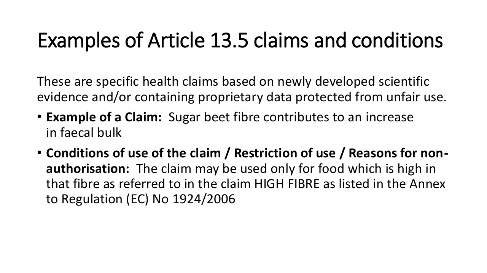

### Examples of Article 13.5 claims and conditions

These are specific health claims based on newly developed scientific
evidence and/or containing proprietary data protected from unfair use.
- Example of a Claim:  Sugar beet fibre contributes to an increase

in faecal bulk

- Conditions of use of the claim / Restriction of use / Reasons for non-
authorisation:  The claim may be used only for food which is high in
that fibre as referred to in the claim HIGH FIBRE as listed in the Annex
to Regulation (EC) No 1924/2006

## Slide 279

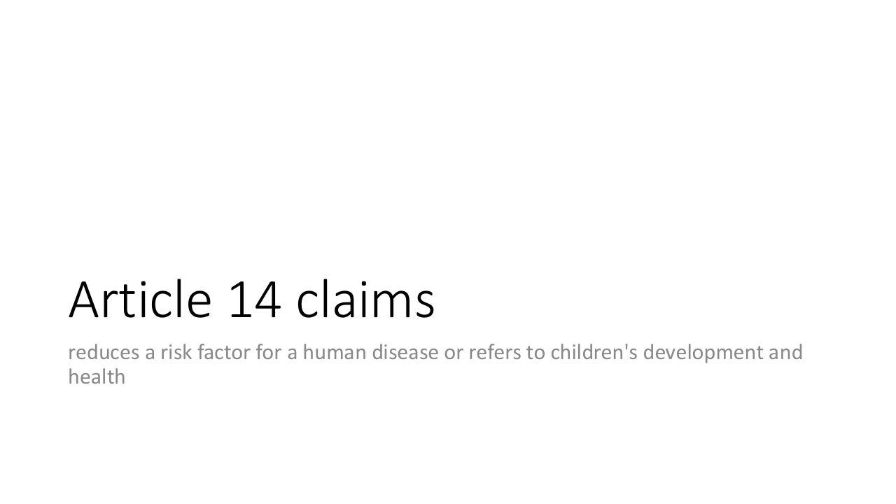

### Article 14 claims

reduces a risk factor for a human disease or refers to children's development and
health

## Slide 280

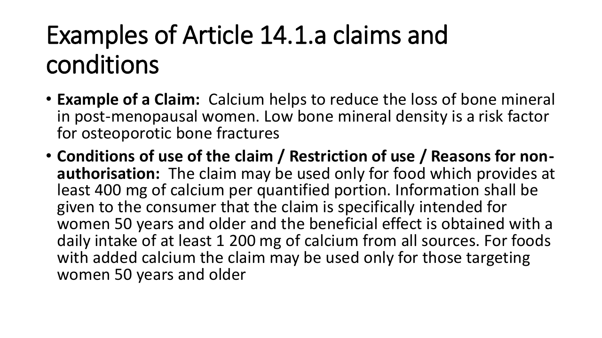

### Examples of Article 14.1.a claims and — conditions

- Example of a Claim:  Calcium helps to reduce the loss of bone mineral
in post-menopausal women. Low bone mineral density is a risk factor
for osteoporotic bone fractures

- Conditions of use of the claim / Restriction of use / Reasons for non-
authorisation:  The claim may be used only for food which provides at
least 400 mg of calcium per quantified portion. Information shall be
given to the consumer that the claim is specifically intended for
women 50 years and older and the beneficial effect is obtained with a
daily intake of at least 1 200 mg of calcium from all sources. For foods
with added calcium the claim may be used only for those targeting
women 50 years and older

## Slide 281

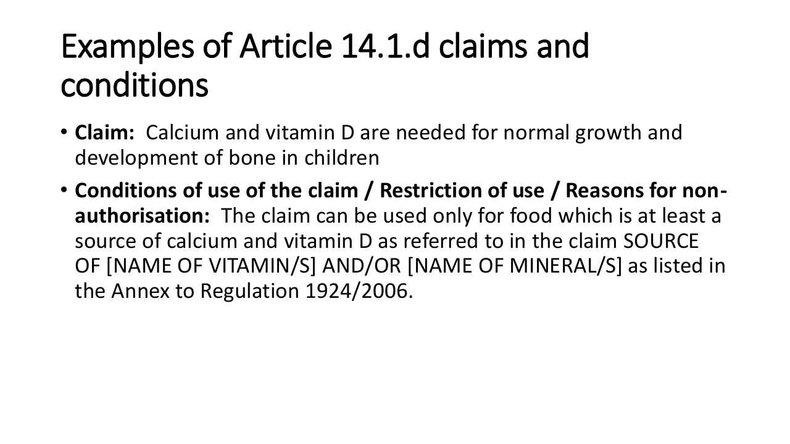

### Examples of Article 14.1.d claims and — conditions

- Claim:  Calcium and vitamin D are needed for normal growth and

development of bone in children

- Conditions of use of the claim / Restriction of use / Reasons for non-
authorisation:  The claim can be used only for food which is at least a
source of calcium and vitamin D as referred to in the claim SOURCE
OF [NAME OF VITAMIN/S] AND/OR [NAME OF MINERAL/S] as listed in
the Annex to Regulation 1924/2006.

## Slide 282


### Some Questions

## Slide 283

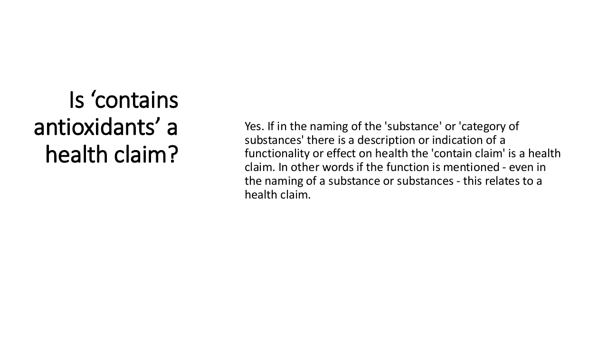

### Is ‘contains — antioxidants’ a   Yes. If in the naming of the 'substance' or 'category of — substances' there is a description or indication of a

health claim?    functionality or effect on health the 'contain claim' is a health
                  claim. In other words if the function is mentioned - even in
                  the naming of a substance or substances - this relates to a
                  health claim.

## Slide 284

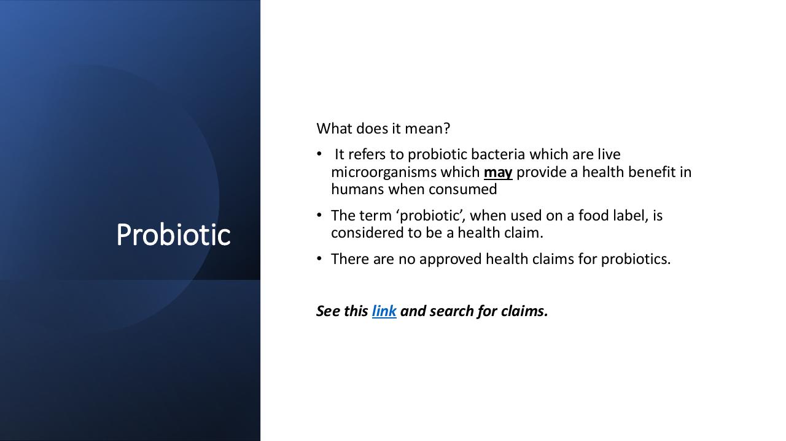

### What does it mean?

- It refers to probiotic bacteria which are live
              microorganisms which may provide a health benefit in
              humans when consumed
- The term ‘probiotic’, when used on a food label, is
Probiotic     considered to be a health claim.
- There are no approved health claims for probiotics.

            See this link and search for claims.

## Slide 285

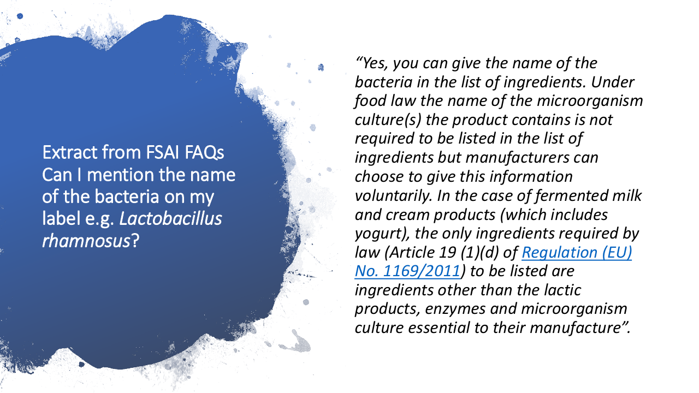

### “Yes, you can give the name of the — bacteria in the list of ingredients. Under — food law the name of the microorganism

culture(s) the product contains is not
                           required to be listed in the list of
Extract from FSAI FAQs     ingredients but manufacturers can
Can I mention the name     choose to give this information
of the bacteria on my      voluntarily. In the case of fermented milk
label e.g. Lactobacillus   and cream products (which includes
rhamnosus?                 yogurt), the only ingredients required by
                           law (Article 19 (1)(d) of Regulation (EU)
                           No. 1169/2011) to be listed are
                           ingredients other than the lactic
                           products, enzymes and microorganism
                           culture essential to their manufacture”.

## Slide 286

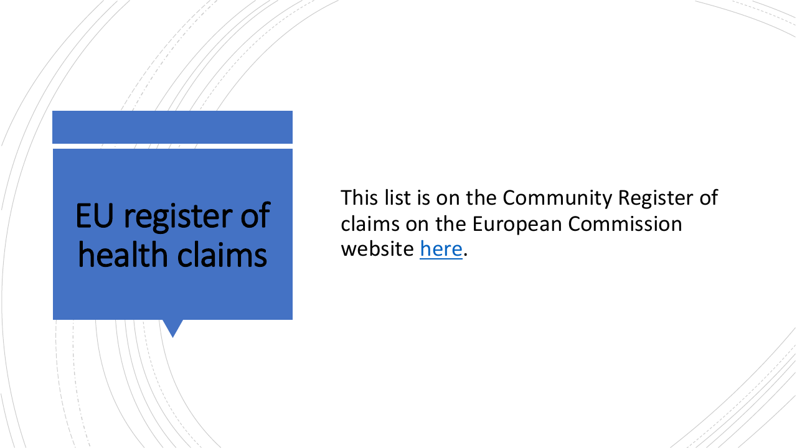

### EU register of — health claims

This list is on the Community Register of
claims on the European Commission
website here.

## Slide 287

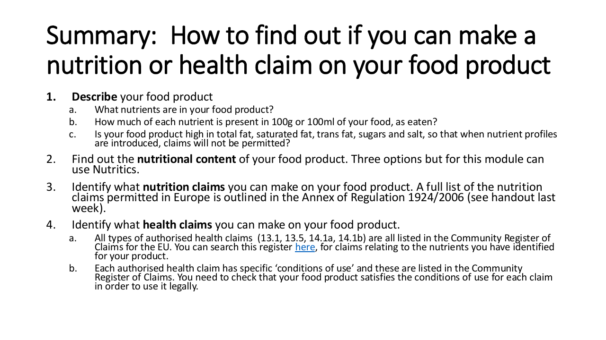

### Summary:  How to find out if you can make a — nutrition or health claim on your food product

1. Describe your food product

    a. What nutrients are in your food product?
b.
c.

How much of each nutrient is present in 100g or 100ml of your food, as eaten?
Is your food product high in total fat, saturated fat, trans fat, sugars and salt, so that when nutrient profiles
are introduced, claims will not be permitted?

2.

3.

4.

Find out the nutritional content of your food product. Three options but for this module can
use Nutritics.
Identify what nutrition claims you can make on your food product. A full list of the nutrition
claims permitted in Europe is outlined in the Annex of Regulation 1924/2006 (see handout last
week).
Identify what health claims you can make on your food product.
a.

All types of authorised health claims  (13.1, 13.5, 14.1a, 14.1b) are all listed in the Community Register of
Claims for the EU. You can search this register here, for claims relating to the nutrients you have identified
for your product.
Each authorised health claim has specific ‘conditions of use’ and these are listed in the Community
Register of Claims. You need to check that your food product satisfies the conditions of use for each claim
in order to use it legally.

b.

## Slide 288

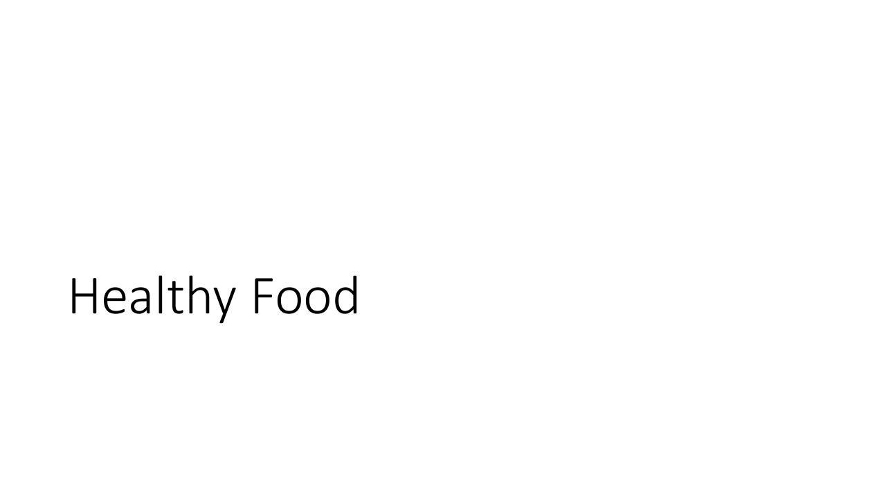

### Healthy Food

## Slide 289

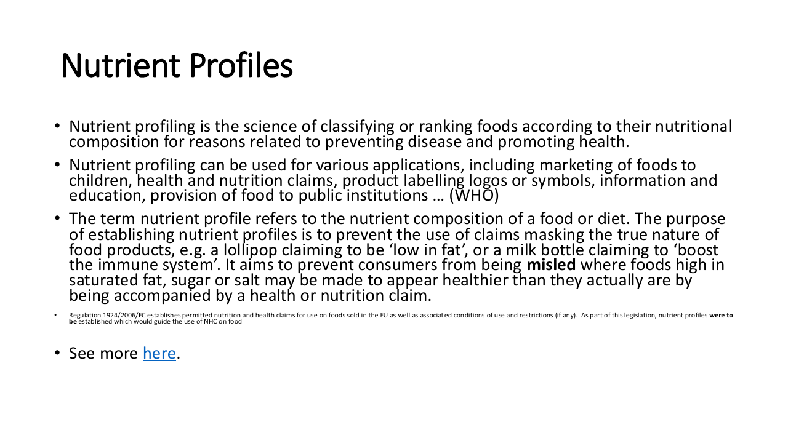

### Nutrient Profiles

- Nutrient profiling is the science of classifying or ranking foods according to their nutritional

composition for reasons related to preventing disease and promoting health.

- Nutrient profiling can be used for various applications, including marketing of foods to

children, health and nutrition claims, product labelling logos or symbols, information and
education, provision of food to public institutions … (WHO)

- The term nutrient profile refers to the nutrient composition of a food or diet. The purpose
of establishing nutrient profiles is to prevent the use of claims masking the true nature of
food products, e.g. a lollipop claiming to be ‘low in fat’, or a milk bottle claiming to ‘boost
the immune system’. It aims to prevent consumers from being misled where foods high in
saturated fat, sugar or salt may be made to appear healthier than they actually are by
being accompanied by a health or nutrition claim.

- 

Regulation 1924/2006/EC establishes permitted nutrition and health claims for use on foods sold in the EU as well as associat ed conditions of use and restrictions (if any).  As part of this legislation, nutrient profiles were to
be established which would guide the use of NHC on food

- See more here.

## Slide 290

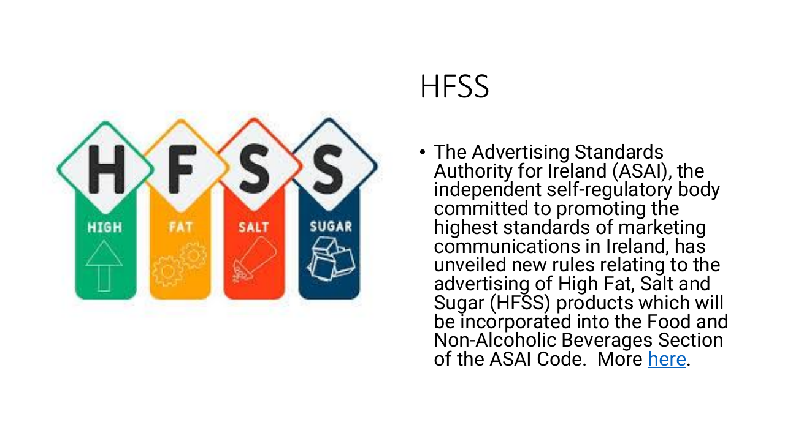

### HFSS

- The Advertising Standards

Authority for Ireland (ASAI), the
independent self-regulatory body
committed to promoting the
highest standards of marketing
communications in Ireland, has
unveiled new rules relating to the
advertising of High Fat, Salt and
Sugar (HFSS) products which will
be incorporated into the Food and
Non-Alcoholic Beverages Section
of the ASAI Code.  More here.

## Slide 291

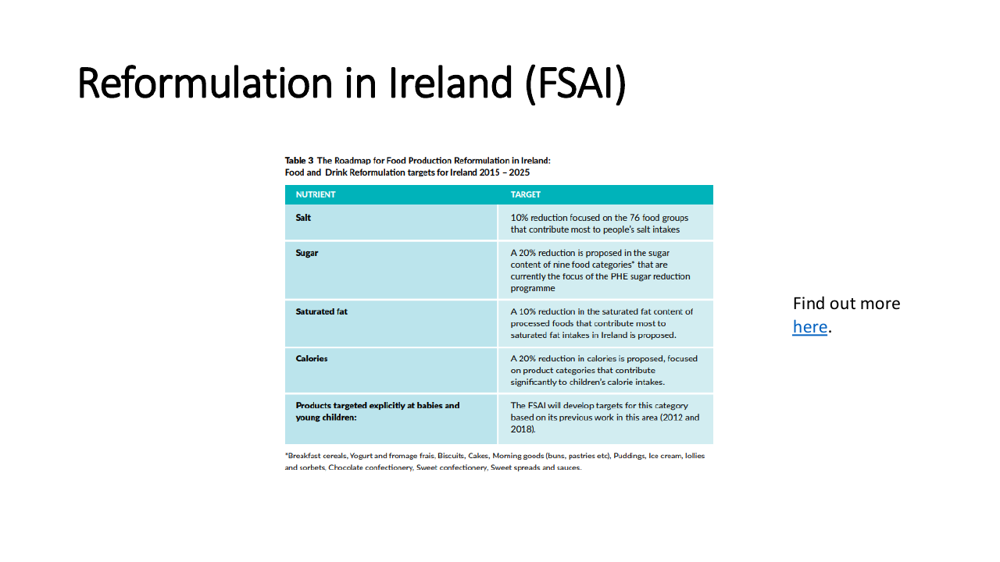

### Reformulation in Ireland (FSAI)

Find out more
                                  here.

## Slide 292

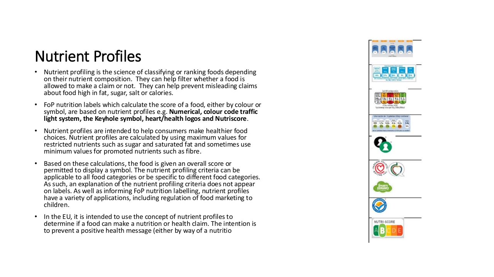

### Nutrient Profiles

- Nutrient profiling is the science of classifying or ranking foods depending
on their nutrient composition.  They can help filter whether a food is
allowed to make a claim or not.  They can help prevent misleading claims
about food high in fat, sugar, salt or calories.

- FoP nutrition labels which calculate the score of a food, either by colour or
symbol, are based on nutrient profiles e.g. Numerical, colour code traffic
light system, the Keyhole symbol, heart/health logos and Nutriscore.

- Nutrient profiles are intended to help consumers make healthier food
choices. Nutrient profiles are calculated by using maximum values for
restricted nutrients such as sugar and saturated fat and sometimes use
minimum values for promoted nutrients such as fibre.

- Based on these calculations, the food is given an overall score or

permitted to display a symbol. The nutrient profiling criteria can be
applicable to all food categories or be specific to different food categories.
As such, an explanation of the nutrient profiling criteria does not appear
on labels. As well as informing FoP nutrition labelling, nutrient profiles
have a variety of applications, including regulation of food marketing to
children.

- 

In the EU, it is intended to use the concept of nutrient profiles to
determine if a food can make a nutrition or health claim. The intention is
to prevent a positive health message (either by way of a nutritio

## Slide 293

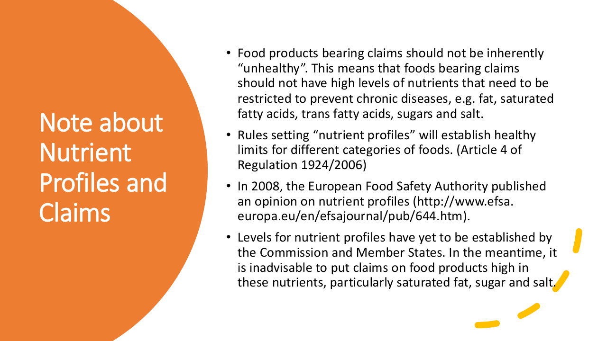

- Food products bearing claims should not be inherently
                 “unhealthy”. This means that foods bearing claims
                 should not have high levels of nutrients that need to be
                 restricted to prevent chronic diseases, e.g. fat, saturated

Note about       fatty acids, trans fatty acids, sugars and salt.
- Rules setting “nutrient profiles” will establish healthy
Nutrient         limits for different categories of foods. (Article 4 of
                 Regulation 1924/2006)
Profiles and   • In 2008, the European Food Safety Authority published
                 an opinion on nutrient profiles (http://www.efsa.
Claims           europa.eu/en/efsajournal/pub/644.htm).
- Levels for nutrient profiles have yet to be established by
                 the Commission and Member States. In the meantime, it
                 is inadvisable to put claims on food products high in
                 these nutrients, particularly saturated fat, sugar and salt.

## Slide 294

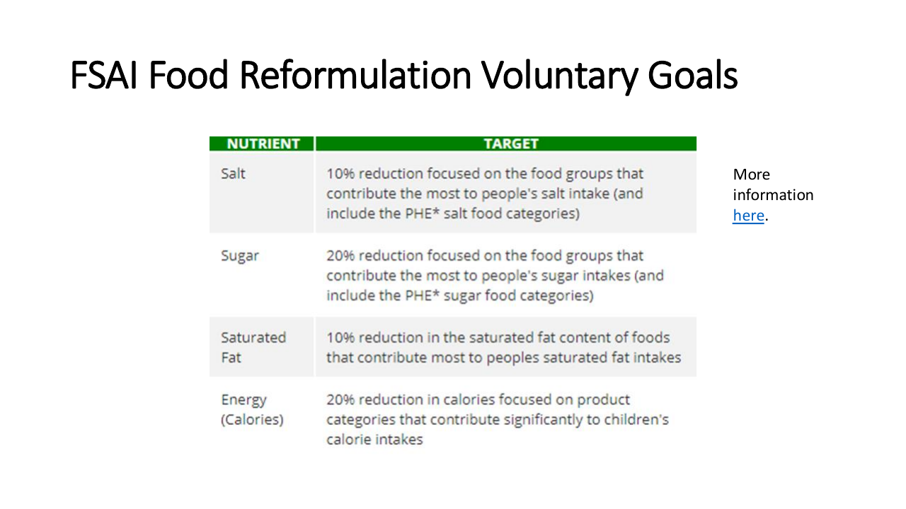

### FSAI Food Reformulation Voluntary Goals

More
                                      information
                                      here.

## Slide 295

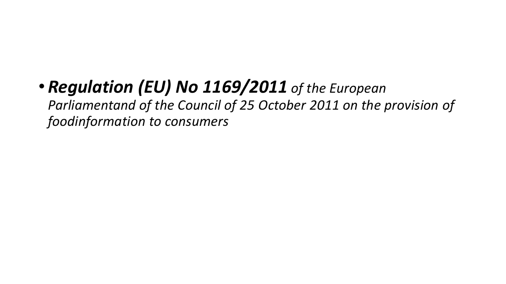

- Regulation (EU) No 1169/2011 of the European
Parliamentand of the Council of 25 October 2011 on the provision of
foodinformation to consumers

## Slide 296

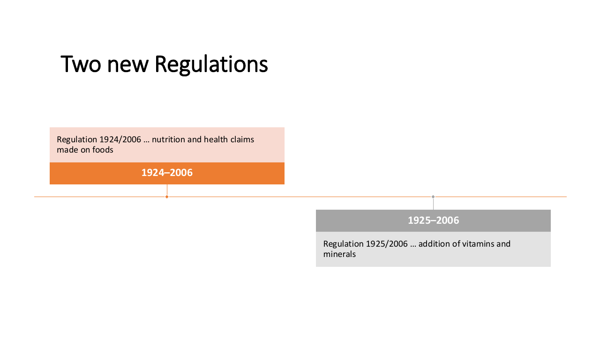

### Two new Regulations

Regulation 1924/2006 … nutrition and health claims
made on foods

                     1924–2006

                                                                          1925–2006

                                                     Regulation 1925/2006 … addition of vitamins and
                                                     minerals

## Slide 297

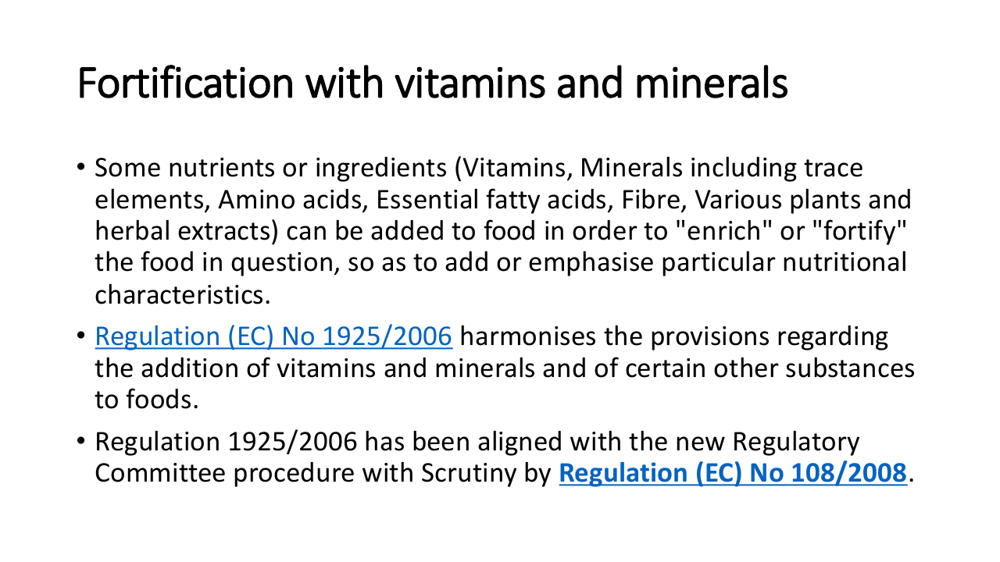

### Fortification with vitamins and minerals

- Some nutrients or ingredients (Vitamins, Minerals including trace

elements, Amino acids, Essential fatty acids, Fibre, Various plants and
herbal extracts) can be added to food in order to "enrich" or "fortify"
the food in question, so as to add or emphasise particular nutritional
characteristics.

- Regulation (EC) No 1925/2006 harmonises the provisions regarding

the addition of vitamins and minerals and of certain other substances
to foods.

- Regulation 1925/2006 has been aligned with the new Regulatory

Committee procedure with Scrutiny by Regulation (EC) No 108/2008.

## Slide 298


### Questions

?

## Slide 299

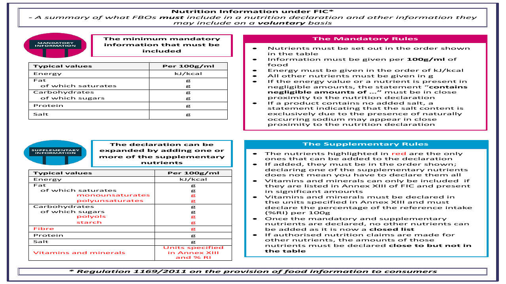

### Nutrition Information under FIC*

- A summary of what FBOs must include in a nutrition declaration and other information they
                           may include on a voluntary basis

                 The minimum mandatory                      The Mandatory Rules
                 information that must be
- Nutrients must be set out in the order shown
                         included
                                                 in the table
- Information must be given per 100g/ml of
Typical values               Per 100g/ml         food
- Energy must be given in the order of kJ/kcal
Energy                         kJ/kcal
- All other nutrients must be given in g
Fat                               g            • If the energy value or a nutrient is present in
  of which saturates              g              negligible amounts, the statement “contains
Carbohydrates                     g              negligible amounts of …” must be in close
  of which sugars                 g              proximity to the nutrition declaration
- If a product contains no added salt, a
Protein                           g
                                                 statement indicating that the salt content is
Salt                              g              exclusively due to the presence of naturally
                                                 occurring sodium may appear in close
                                                 proximity to the nutrition declaration

                   The declaration can be                 The Supplementary Rules
                 expanded by adding one or
- The nutrients highlighted in red are the only
                 more of the supplementary       ones that can be added to the declaration
                          nutrients            • If added, they must be in the order shown;
                                                 declaring one of the supplementary nutrients
Typical values                Per 100g/ml
                                                 does not mean you have to declare them all
Energy                           kJ/kcal       • Vitamins and minerals can only be included if
Fat                                 g            they are listed in Annex XIII of FIC and present
  of which saturates                g            in significant amounts
          monounsaturates           g          • Vitamins and minerals must be declared in
          polyunsaturates           g            the units specified in Annex XIII and must
Carbohydrates                       g            declare the percentage of the reference intake
  of which sugars                   g            (%RI) per 100g
          polyols                   g
- Once the mandatory and supplementary
          starch                    g            nutrients are declared, no other nutrients can
Fibre                                 g          be added as it is now a closed list
Protein                               g        • If authorised nutrition claims are made for
Salt                                g            other nutrients, the amounts of those
                             Units specified
                                                 nutrients must be declared close to but not in
Vitamins and minerals         in Annex XIII      the table
                                and % RI

          * Regulation 1169/2011 on the provision of food information to consumers

## Slide 300

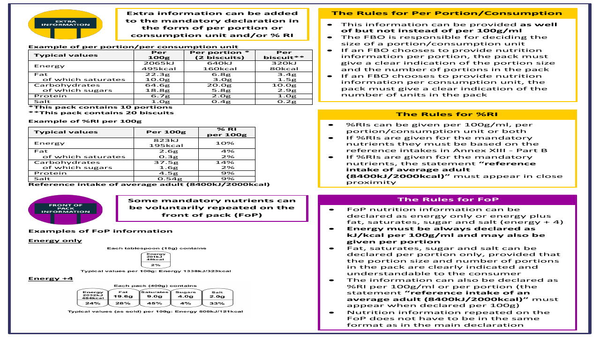

### Extra information can be added           The Rules for Per Portion/Consumption — to the mandatory declaration in                            Unit

- This information can be provided as well
                       the form of per portion or
                                                               of but not instead of per 100g/ml
                     consumption unit and/or % RI            • The FBO is responsible for deciding the
                                                               size of a portion/consumption unit
Example of per portion/per consumption unit
                           Per   Per portion *      Per      • If an FBO chooses to provide nutrition
 Typical values                                                information per portion, the pack must
                          100g    (2 biscuits)   biscuit**
                         2065kJ      640kJ         320kJ       give a clear indication of the portion size
 Energy
                        495kcal     160kcal       80kcal       and the number of portions in the pack
 Fat                     22.3g        6.8g          3.4g     • If an FBO chooses to provide nutrition
   of which saturates    10.0g        3.0g          1.5g
                                                               information per consumption unit, the
 Carbohydrates           64.6g       20.0g         10.0g
   of which sugars       18.8g        5.8g          2.9g       pack must give a clear indication of the
 Protein                   6.7g       2.0g          1.0g       number of units in the pack
 Salt                      1.0g       0.4g          0.2g
*This pack contains 10 portions
**This pack contains 20 biscuits                                          The Rules for %RI
Example of %RI per 100g
- %RIs can be given per 100g/ml, per
                                       % RI                    portion/consumption unit or both
 Typical values           Per 100g
                                     per 100g
                          823kJ
- If %RIs are given for the mandatory
 Energy                                 10%                    nutrients they must be based on the
                         195kcal
 Fat                        2.6g         4%                    reference intakes in Annex XIII - Part B
   of which saturates       0.3g         2%                  • If %RIs are given for the mandatory
 Carbohydrates            37.5g         14%                    nutrients, the statement “reference
   of which sugars          1.6g         2%
                                                               intake of average adult
 Protein                    4.5g         9%
 Salt                      0.54g         9%
                                                               (8400kJ/2000kcal)” must appear in close
Reference intake of average adult (8400kJ/2000kcal)            proximity

                     Some mandatory nutrients can                         The Rules for FoP
                     be voluntarily repeated on the          • FoP nutrition information can be
                           front of pack (FoP)                 declared as energy only or energy plus
                                                               fat, saturates, sugar and salt (energy + 4)
Examples of FoP information                                  • Energy must be always declared as
                                                               kJ/kcal per 100g/ml and may also be
Energy only                                                    given per portion
- Fat, saturates, sugar and salt can be
                                                               declared per portion only, provided that
                                                               the portion size and number of portions
                                                               in the pack are clearly indicated and
                                                               understandable to the consumer
Energy +4                                                    • The information can also be declared as
                                                               %RI per 100g/ml or per portion (the
                                                               statement “reference intake of an
                                                               average adult (8400kJ/2000kcal)” must
                                                               appear when declared per 100g)
- Nutrition information repeated on the
                                                               FoP does not have to be in the same
                                                               format as in the main declaration

---

<a id="lecture-5"></a>

# Lecture 5 — Week 6 (4 March 2026): Additives, Voluntary Terms (Vegetarian/Vegan/Gluten-Free/Fairtrade/Organic) & Food Fraud Intro

**Topics:** Voluntary terms · Vegetarian · Vegan · Gluten-Free · Fairtrade · Organic · GMO · glyphosate US cases · Food Fraud (intro) · Farm to Fork strategy

**Slides:** 301–348 (48 slides)

## Slide 301

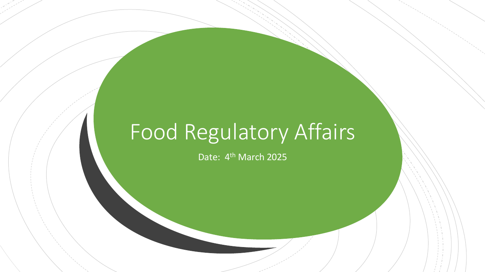

### Food Law & Regulatory Environment — *Course Title Slide*

*(Course title slide — see image for module / lecturer / date metadata.)*

Raw text:

```
Food Regulatory Affairs

Date: 4th March 2025
```

## Slide 302

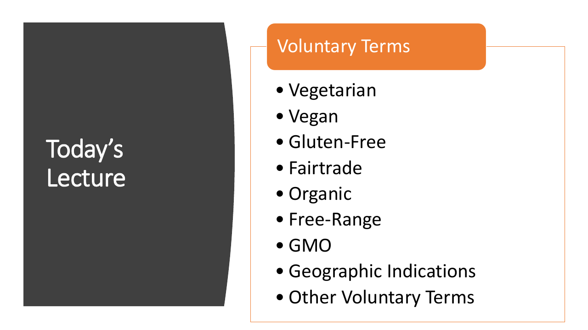

### Voluntary Terms

- Vegetarian
- Vegan
Today’s   • Gluten-Free
- Fairtrade
Lecture
- Organic
- Free-Range
- GMO
- Geographic Indications
- Other Voluntary Terms

## Slide 303


### What is “Food — Information”?

- Article 2.2(a)
- “… information concerning a food and made available to the final consumer
                  by means of a label, other accompanying material, or any other means
                  including modern technology tools or verbal communication “

## Slide 304

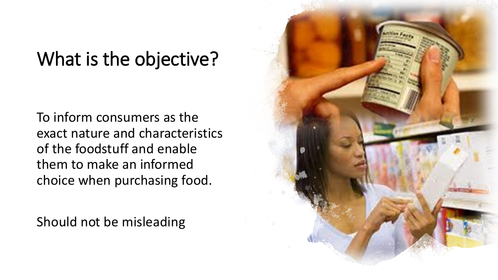

### What is the objective?

To inform consumers as the
exact nature and characteristics
of the foodstuff and enable
them to make an informed
choice when purchasing food.

Should not be misleading

## Slide 305

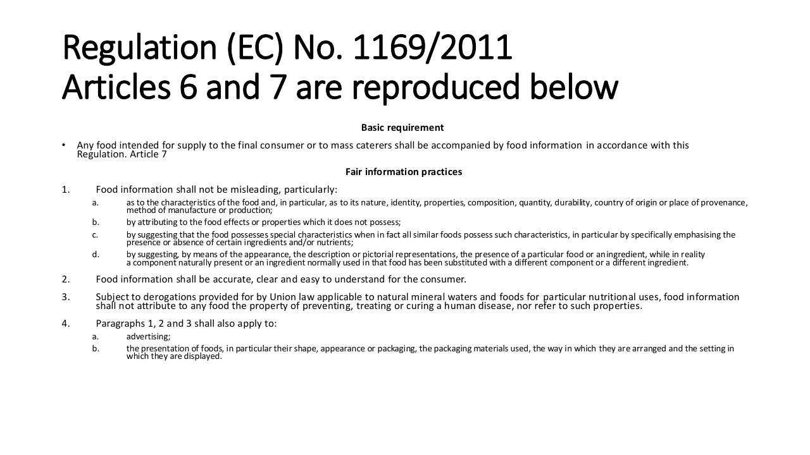

### Regulation (EC) No. 1169/2011 — Articles 6 and 7 are reproduced below

- Any food intended for supply to the final consumer or to mass caterers shall be accompanied by food information in accordance with this

Regulation. Article 7

Fair information practices

Basic requirement

1.

2.

3.

4.

Food information shall not be misleading, particularly:
a.

as to the characteristics of the food and, in particular, as to its nature, identity, properties, composition, quantity, durability, country of origin or place of provenance,
method of manufacture or production;
by attributing to the food effects or properties which it does not possess;
by suggesting that the food possesses special characteristics when in fact all similar foods possess such characteristics, in particular by specifically emphasising the
presence or absence of certain ingredients and/or nutrients;
by suggesting, by means of the appearance, the description or pictorial representations, the presence of a particular food or aningredient, while in reality
a component naturally present or an ingredient normally used in that food has been substituted with a different component or a different ingredient.

b.
c.

d.

Food information shall be accurate, clear and easy to understand for the consumer.

Subject to derogations provided for by Union law applicable to natural mineral waters and foods for particular nutritional uses, food information
shall not attribute to any food the property of preventing, treating or curing a human disease, nor refer to such properties.

Paragraphs 1, 2 and 3 shall also apply to:
a.
b.

advertising;
the presentation of foods, in particular their shape, appearance or packaging, the packaging materials used, the way in which they are arranged and the setting in
which they are displayed.

## Slide 306


### Mandatory versus Voluntary

## Slide 307

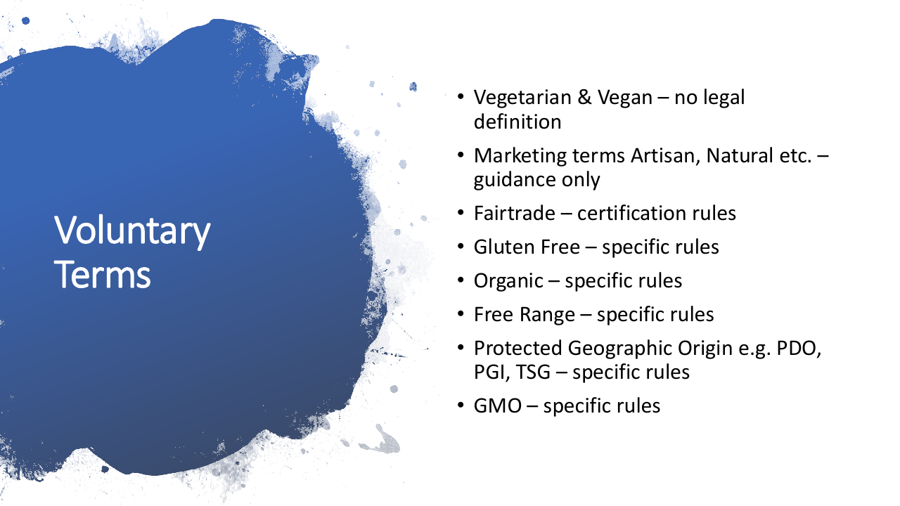

- Vegetarian & Vegan – no legal
              definition
- Marketing terms Artisan, Natural etc. –
              guidance only
- Fairtrade – certification rules
Voluntary   • Gluten Free – specific rules
Terms       • Organic – specific rules
- Free Range – specific rules
- Protected Geographic Origin e.g. PDO,
              PGI, TSG – specific rules
- GMO – specific rules

## Slide 308

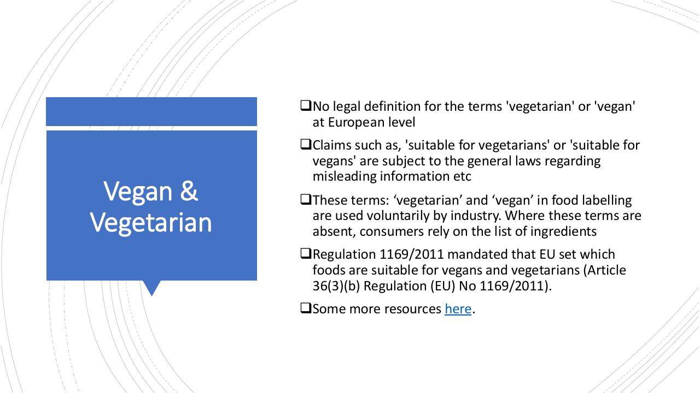

### ❑No legal definition for the terms 'vegetarian' or 'vegan' — at European level — ❑Claims such as, 'suitable for vegetarians' or 'suitable for

vegans' are subject to the general laws regarding
              misleading information etc
 Vegan &     ❑These terms: ‘vegetarian’ and ‘vegan’ in food labelling
Vegetarian    are used voluntarily by industry. Where these terms are
              absent, consumers rely on the list of ingredients
- Regulation 1169/2011 mandated that EU set which
              foods are suitable for vegans and vegetarians (Article
              36(3)(b) Regulation (EU) No 1169/2011).
- Some more resources here.

## Slide 309

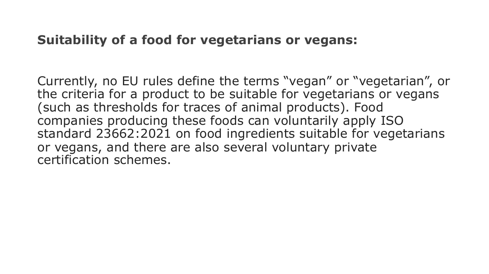

### Suitability of a food for vegetarians or vegans:

Currently, no EU rules define the terms “vegan” or “vegetarian”, or
the criteria for a product to be suitable for vegetarians or vegans
(such as thresholds for traces of animal products). Food
companies producing these foods can voluntarily apply ISO
standard 23662:2021 on food ingredients suitable for vegetarians
or vegans, and there are also several voluntary private
certification schemes.

## Slide 310

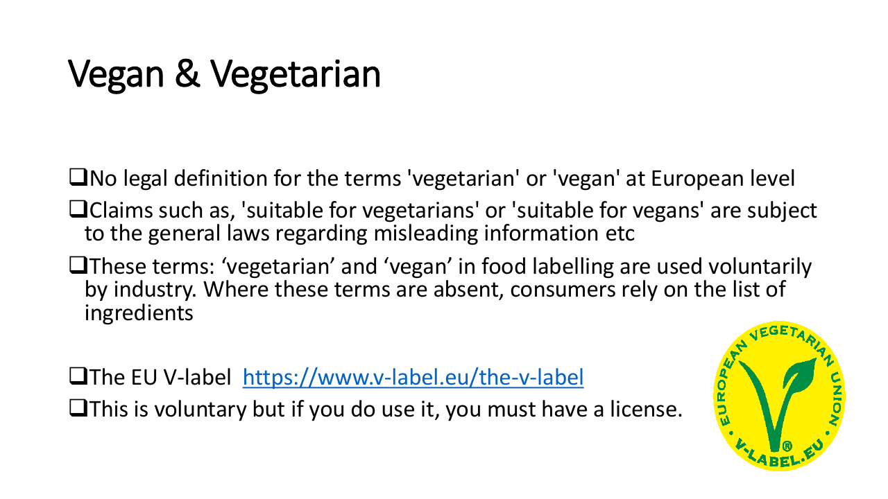

### Vegan & Vegetarian

- No legal definition for the terms 'vegetarian' or 'vegan' at European level
- Claims such as, 'suitable for vegetarians' or 'suitable for vegans' are subject

to the general laws regarding misleading information etc

- These terms: ‘vegetarian’ and ‘vegan’ in food labelling are used voluntarily
by industry. Where these terms are absent, consumers rely on the list of
ingredients

- The EU V-label  https://www.v-label.eu/the-v-label
- This is voluntary but if you do use it, you must have a license.

## Slide 311

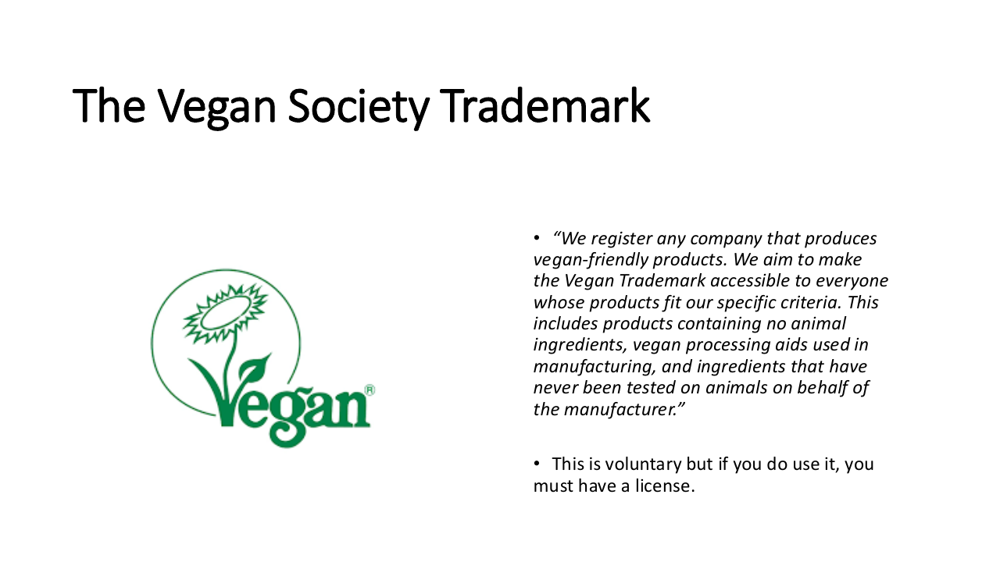

### The Vegan Society Trademark

- “We register any company that produces
                     vegan-friendly products. We aim to make
                     the Vegan Trademark accessible to everyone
                     whose products fit our specific criteria. This
                     includes products containing no animal
                     ingredients, vegan processing aids used in
                     manufacturing, and ingredients that have
                     never been tested on animals on behalf of
                     the manufacturer.”

- This is voluntary but if you do use it, you
                     must have a license.

## Slide 312

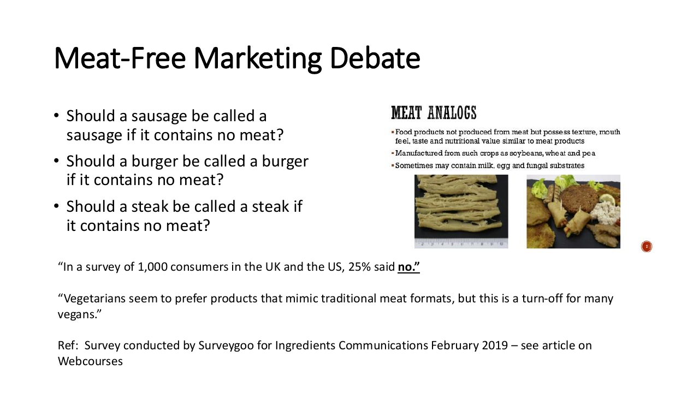

### Meat-Free Marketing Debate

- Should a sausage be called a

sausage if it contains no meat?
- Should a burger be called a burger

if it contains no meat?

- Should a steak be called a steak if

it contains no meat?

“In a survey of 1,000 consumers in the UK and the US, 25% said no.”

“Vegetarians seem to prefer products that mimic traditional meat formats, but this is a turn-off for many
vegans.”

Ref:  Survey conducted by Surveygoo for Ingredients Communications February 2019 – see article on
Webcourses

## Slide 313

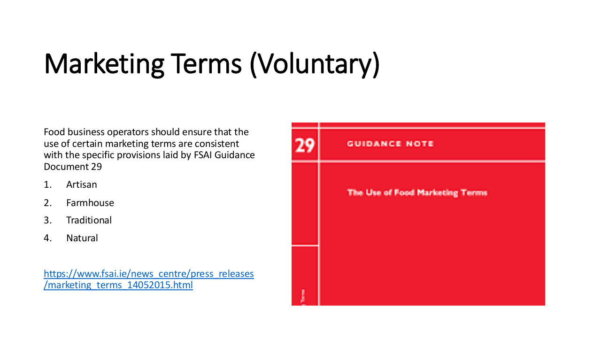

### Marketing Terms (Voluntary)

Food business operators should ensure that the
use of certain marketing terms are consistent
with the specific provisions laid by FSAI Guidance
Document 29

1.

2.

3.

4.

Artisan

Farmhouse

Traditional

Natural

https://www.fsai.ie/news_centre/press_releases
/marketing_terms_14052015.html

## Slide 314

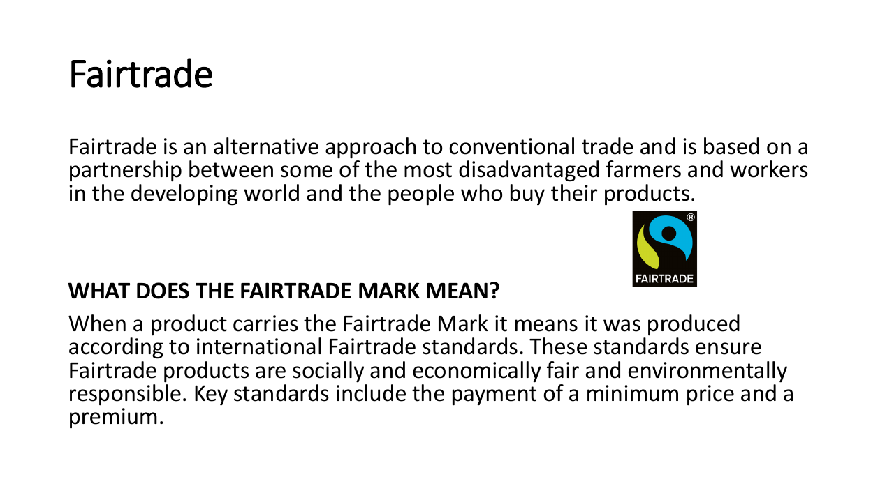

### Fairtrade

Fairtrade is an alternative approach to conventional trade and is based on a
partnership between some of the most disadvantaged farmers and workers
in the developing world and the people who buy their products.

WHAT DOES THE FAIRTRADE MARK MEAN?
When a product carries the Fairtrade Mark it means it was produced
according to international Fairtrade standards. These standards ensure
Fairtrade products are socially and economically fair and environmentally
responsible. Key standards include the payment of a minimum price and a
premium.

## Slide 315


### THE FAIRTRADE MINIMUM PRICE

For most Fairtrade goods there is a Fairtrade minimum price which is
set to cover the cost of sustainable production for that product in that
region. If the market price for that product is higher than our minimum
price, then farmers and workers receive the market price.

## Slide 316

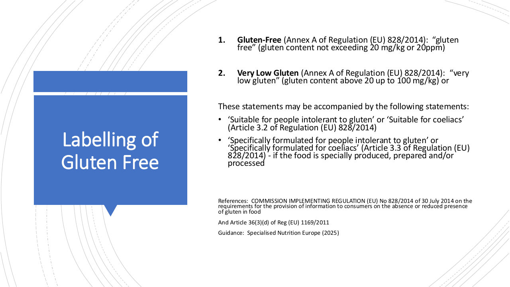

1. Gluten-Free (Annex A of Regulation (EU) 828/2014): “gluten
                      free” (gluten content not exceeding 20 mg/kg or 20ppm)

2. Very Low Gluten (Annex A of Regulation (EU) 828/2014): “very
                      low gluten” (gluten content above 20 up to 100 mg/kg) or

               These statements may be accompanied by the following statements:
- ‘Suitable for people intolerant to gluten’ or ‘Suitable for coeliacs’
                 (Article 3.2 of Regulation (EU) 828/2014)
Labelling of   • ‘Specifically formulated for people intolerant to gluten’ or
                 ‘Specifically formulated for coeliacs’ (Article 3.3 of Regulation (EU)
Gluten Free      828/2014) - if the food is specially produced, prepared and/or
                 processed

               References: COMMISSION IMPLEMENTING REGULATION (EU) No 828/2014 of 30 July 2014 on the
               requirements for the provision of information to consumers on the absence or reduced presence
               of gluten in food
               And Article 36(3)(d) of Reg (EU) 1169/2011
               Guidance: Specialised Nutrition Europe (2025)

## Slide 317

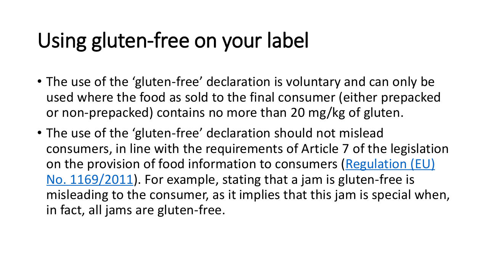

### Using gluten-free on your label

- The use of the ‘gluten-free’ declaration is voluntary and can only be
used where the food as sold to the final consumer (either prepacked
or non-prepacked) contains no more than 20 mg/kg of gluten.

- The use of the ‘gluten-free’ declaration should not mislead

consumers, in line with the requirements of Article 7 of the legislation
on the provision of food information to consumers (Regulation (EU)
No. 1169/2011). For example, stating that a jam is gluten-free is
misleading to the consumer, as it implies that this jam is special when,
in fact, all jams are gluten-free.

## Slide 318

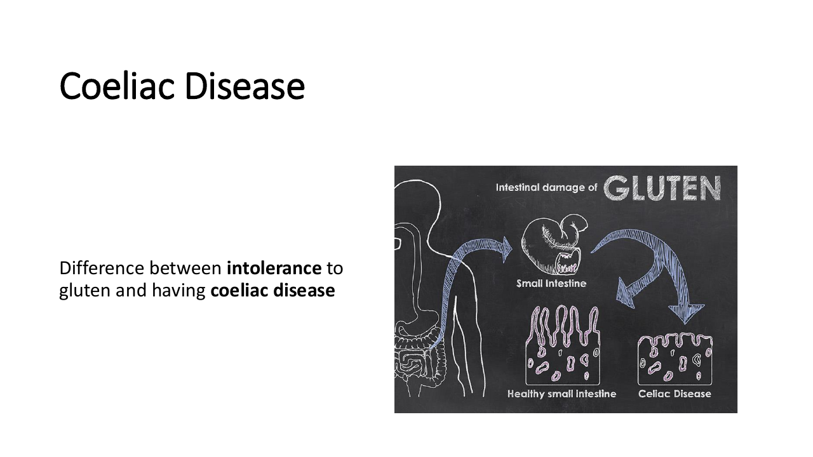

### Coeliac Disease

Difference between intolerance to
gluten and having coeliac disease

## Slide 319

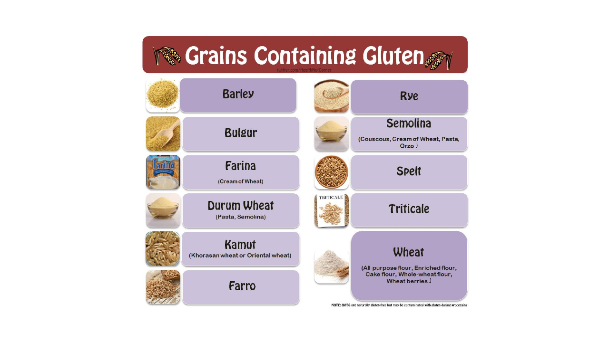

### *(Image-only slide — no extractable text.)*

**Grains Containing Gluten** — infographic with product photos:

| Grain | Notes |
|---|---|
| Barley | |
| Bulgur | |
| Farina | (Cream of Wheat) |
| Durum Wheat | (Pasta, Semolina) |
| Kamut | (Khorasan wheat or Oriental wheat) |
| Farro | |
| Rye | |
| Semolina | (Couscous, Cream of Wheat, Pasta, Orzo) |
| Spelt | |
| Triticale | |
| Wheat | (All-purpose flour, Enriched flour, Cake flour, Whole-wheat flour, Wheat berries) |

*Note: Oats are naturally gluten-free but may be contaminated with gluten during processing.*

## Slide 320

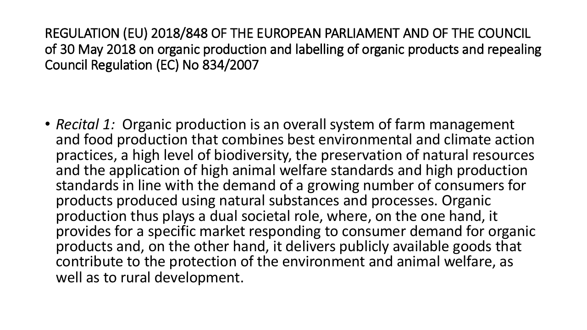

### REGULATION (EU) 2018/848 OF THE EUROPEAN PARLIAMENT AND OF THE COUNCIL — of 30 May 2018 on organic production and labelling of organic products and repealing — Council Regulation (EC) No 834/2007

- Recital 1: Organic production is an overall system of farm management

and food production that combines best environmental and climate action
practices, a high level of biodiversity, the preservation of natural resources
and the application of high animal welfare standards and high production
standards in line with the demand of a growing number of consumers for
products produced using natural substances and processes. Organic
production thus plays a dual societal role, where, on the one hand, it
provides for a specific market responding to consumer demand for organic
products and, on the other hand, it delivers publicly available goods that
contribute to the protection of the environment and animal welfare, as
well as to rural development.

## Slide 321

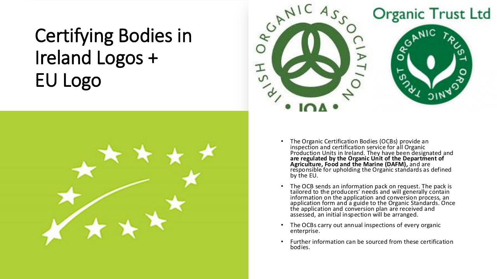

### Certifying Bodies in — Ireland Logos + — EU Logo

- The Organic Certification Bodies (OCBs) provide an
                           inspection and certification service for all Organic
                           Production Units in Ireland. They have been designated and
                           are regulated by the Organic Unit of the Department of
                           Agriculture, Food and the Marine (DAFM), and are
                           responsible for upholding the Organic standards as defined
                           by the EU.
- The OCB sends an information pack on request. The pack is
                           tailored to the producers’ needs and will generally contain
                           information on the application and conversion process, an
                           application form and a guide to the Organic Standards. Once
                           the application and conversion plan are received and
                           assessed, an initial inspection will be arranged.
- The OCBs carry out annual inspections of every organic
                           enterprise.
- Further information can be sourced from these certification
                           bodies.

## Slide 322

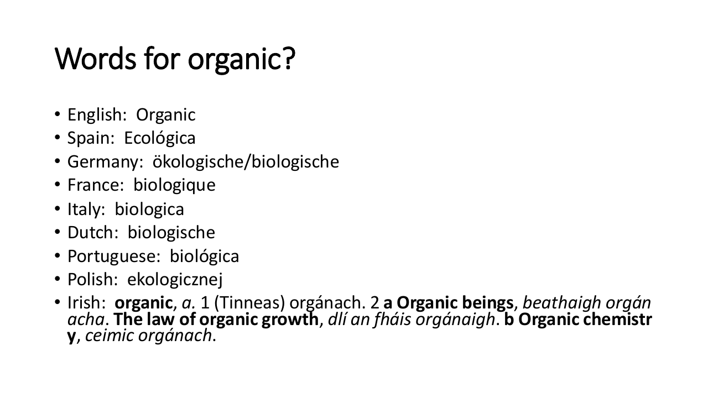

### Words for organic?

- English:  Organic
- Spain: Ecológica
- Germany: ökologische/biologische
- France: biologique
- Italy: biologica
- Dutch: biologische
- Portuguese: biológica
- Polish: ekologicznej
- Irish: organic, a. 1 (Tinneas) orgánach. 2 a Organic beings, beathaigh orgán
acha. The law of organic growth, dlí an fháis orgánaigh. b Organic chemistr
y, ceimic orgánach.

## Slide 323

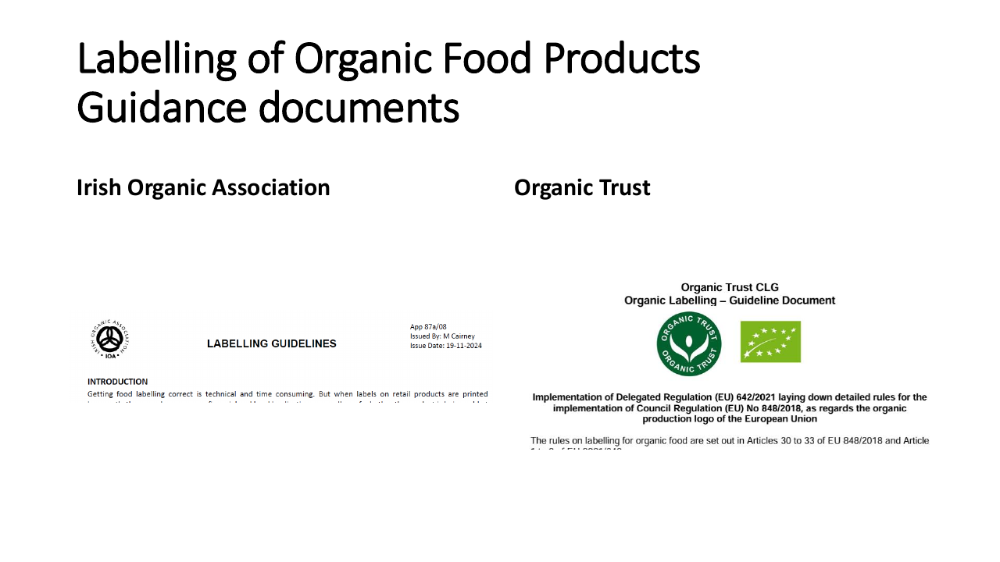

### Labelling of Organic Food Products — Guidance documents

Irish Organic Association

Organic Trust

## Slide 324

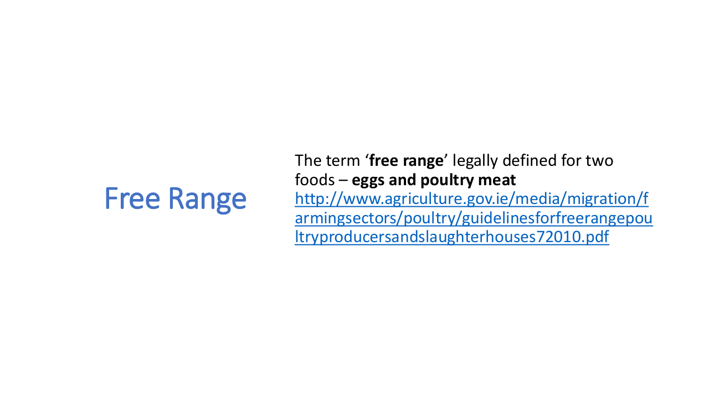

### Free Range

The term ‘free range’ legally defined for two
foods – eggs and poultry meat
http://www.agriculture.gov.ie/media/migration/f
armingsectors/poultry/guidelinesforfreerangepou
ltryproducersandslaughterhouses72010.pdf

## Slide 325

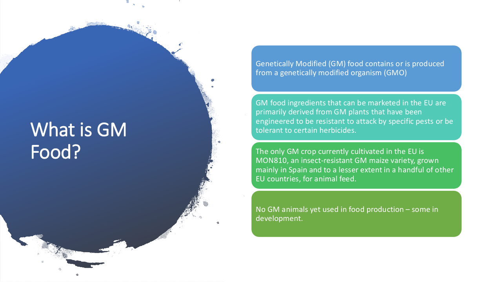

### Genetically Modified (GM) food contains or is produced — from a genetically modified organism (GMO)

GM food ingredients that can be marketed in the EU are
             primarily derived from GM plants that have been
             engineered to be resistant to attack by specific pests or be
What is GM   tolerant to certain herbicides.

Food?        The only GM crop currently cultivated in the EU is
             MON810, an insect-resistant GM maize variety, grown
             mainly in Spain and to a lesser extent in a handful of other
             EU countries, for animal feed.

             No GM animals yet used in food production – some in
             development.

## Slide 326

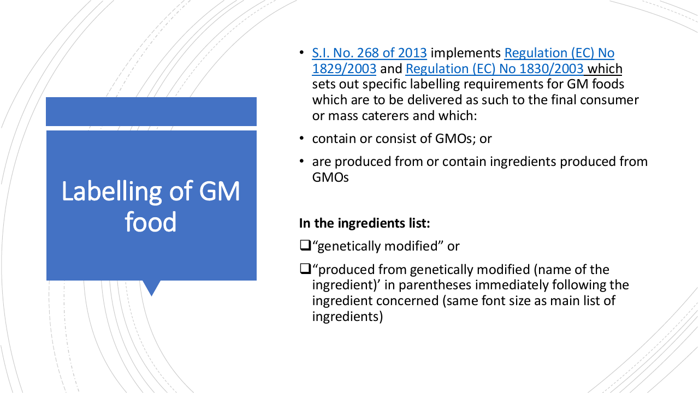

- S.I. No. 268 of 2013 implements Regulation (EC) No
                    1829/2003 and Regulation (EC) No 1830/2003 which
                    sets out specific labelling requirements for GM foods
                    which are to be delivered as such to the final consumer
                    or mass caterers and which:
- contain or consist of GMOs; or
- are produced from or contain ingredients produced from
                    GMOs
Labelling of GM
     food         In the ingredients list:
- “genetically modified” or
- “produced from genetically modified (name of the
                   ingredient)’ in parentheses immediately following the
                   ingredient concerned (same font size as main list of
                   ingredients)

## Slide 327

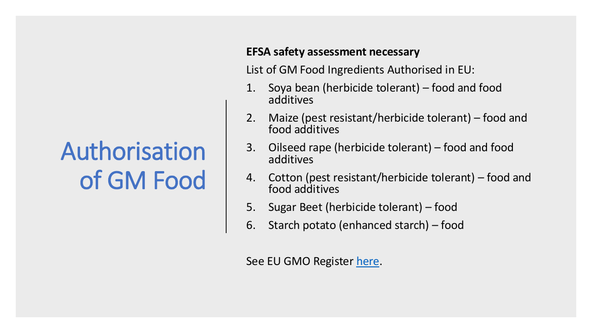

### EFSA safety assessment necessary — List of GM Food Ingredients Authorised in EU:

1. Soya bean (herbicide tolerant) – food and food
                     additives
2. Maize (pest resistant/herbicide tolerant) – food and
                     food additives

Authorisation   3. Oilseed rape (herbicide tolerant) – food and food
                     additives

 of GM Food     4. Cotton (pest resistant/herbicide tolerant) – food and
                     food additives
5. Sugar Beet (herbicide tolerant) – food
6. Starch potato (enhanced starch) – food

                See EU GMO Register here.

## Slide 328

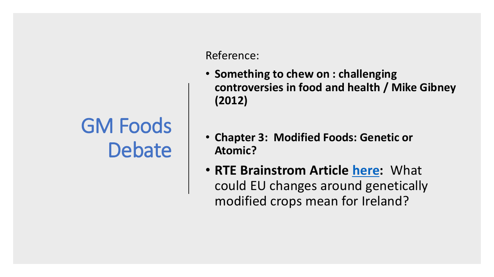

### Reference:

- Something to chew on : challenging
             controversies in food and health / Mike Gibney
             (2012)

GM Foods   • Chapter 3: Modified Foods: Genetic or
  Debate     Atomic?
- RTE Brainstrom Article here: What
             could EU changes around genetically
             modified crops mean for Ireland?

## Slide 329

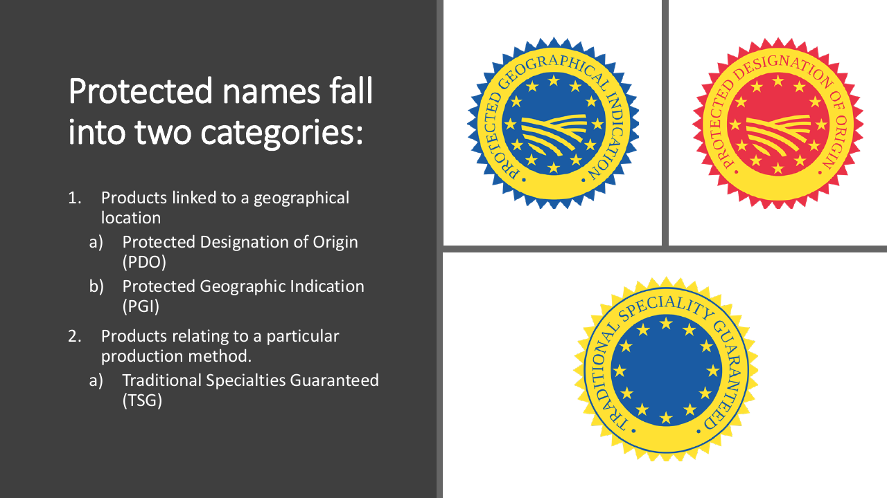

### Protected names fall — into two categories:

1. Products linked to a geographical

location

    a. Protected Designation of Origin

(PDO)

    b. Protected Geographic Indication

(PGI)

2. Products relating to a particular

production method.

a)

Traditional Specialties Guaranteed
(TSG)

## Slide 330

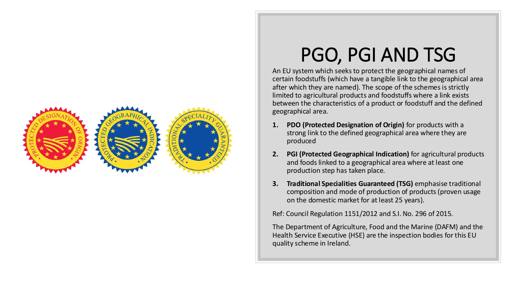

### PGO, PGI AND TSG

An EU system which seeks to protect the geographical names of
certain foodstuffs (which have a tangible link to the geographical area
after which they are named). The scope of the schemes is strictly
limited to agricultural products and foodstuffs where a link exists
between the characteristics of a product or foodstuff and the defined
geographical area.

1.

2.

3.

PDO (Protected Designation of Origin) for products with a
strong link to the defined geographical area where they are
produced

PGI (Protected Geographical Indication) for agricultural products
and foods linked to a geographical area where at least one
production step has taken place.

Traditional Specialities Guaranteed (TSG) emphasise traditional
composition and mode of production of products (proven usage
on the domestic market for at least 25 years).

Ref: Council Regulation 1151/2012 and S.I. No. 296 of 2015.

The Department of Agriculture, Food and the Marine (DAFM) and the
Health Service Executive (HSE) are the inspection bodies for this EU
quality scheme in Ireland.

## Slide 331

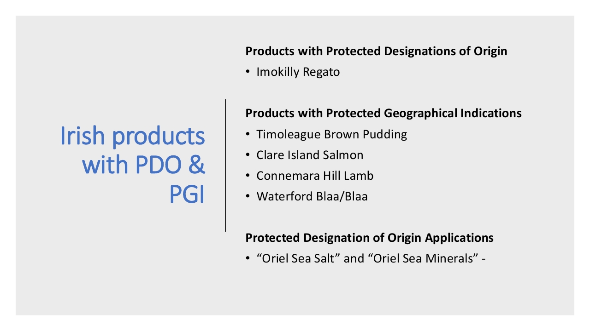

### Products with Protected Designations of Origin

- Imokilly Regato

                 Products with Protected Geographical Indications
Irish products   • Timoleague Brown Pudding
- Clare Island Salmon
   with PDO &    • Connemara Hill Lamb
           PGI   • Waterford Blaa/Blaa

                 Protected Designation of Origin Applications
- “Oriel Sea Salt” and “Oriel Sea Minerals” -

## Slide 332

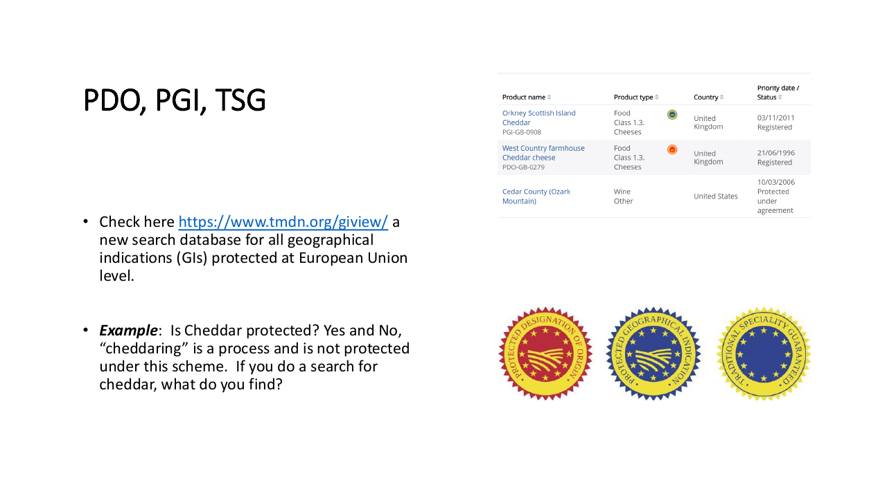

### PDO, PGI, TSG

- Check here https://www.tmdn.org/giview/ a
new search database for all geographical
indications (GIs) protected at European Union
level.

- Example:  Is Cheddar protected? Yes and No,
“cheddaring” is a process and is not protected
under this scheme.  If you do a search for
cheddar, what do you find?

## Slide 333

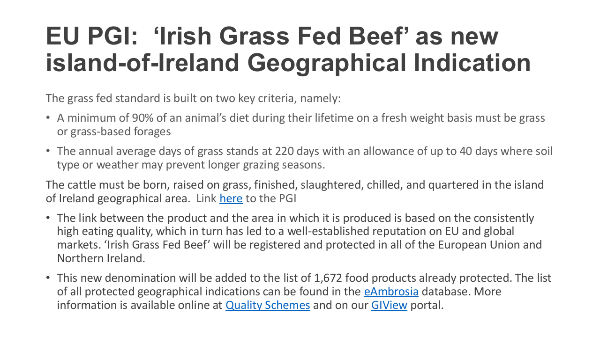

### EU PGI:  ‘Irish Grass Fed Beef’ as new — island-of-Ireland Geographical Indication

The grass fed standard is built on two key criteria, namely:
- A minimum of 90% of an animal’s diet during their lifetime on a fresh weight basis must be grass

or grass-based forages

- The annual average days of grass stands at 220 days with an allowance of up to 40 days where soil

type or weather may prevent longer grazing seasons.

The cattle must be born, raised on grass, finished, slaughtered, chilled, and quartered in the island
of Ireland geographical area. Link here to the PGI
- The link between the product and the area in which it is produced is based on the consistently
high eating quality, which in turn has led to a well-established reputation on EU and global
markets. ‘Irish Grass Fed Beef’ will be registered and protected in all of the European Union and
Northern Ireland.

- This new denomination will be added to the list of 1,672 food products already protected. The list

of all protected geographical indications can be found in the eAmbrosia database. More
information is available online at Quality Schemes and on our GIView portal.

## Slide 334

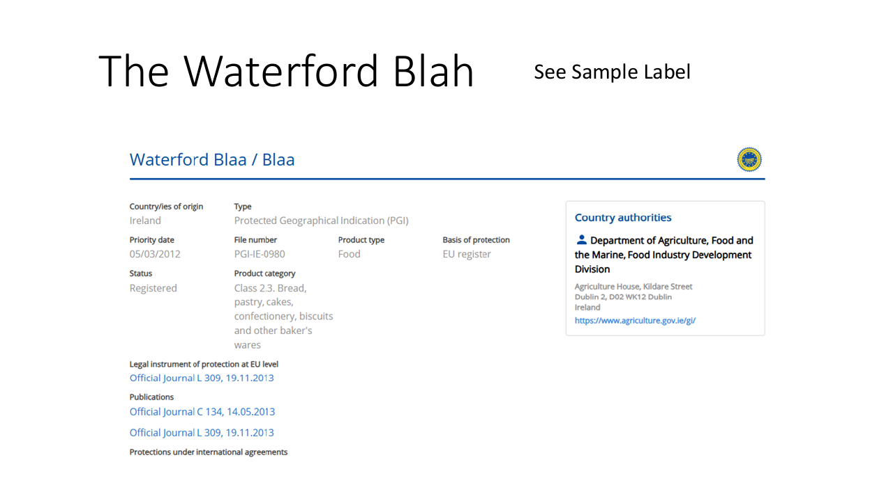

### The Waterford Blah

See Sample Label

## Slide 335

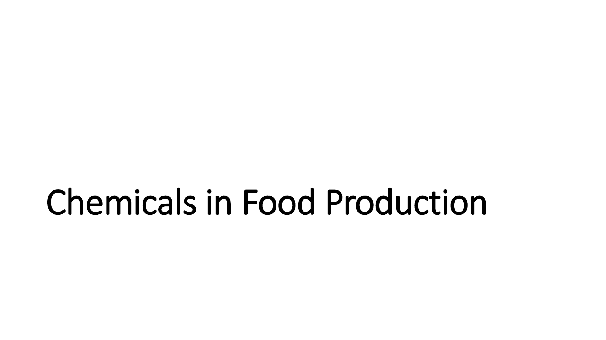

### Chemicals in Food Production

## Slide 336

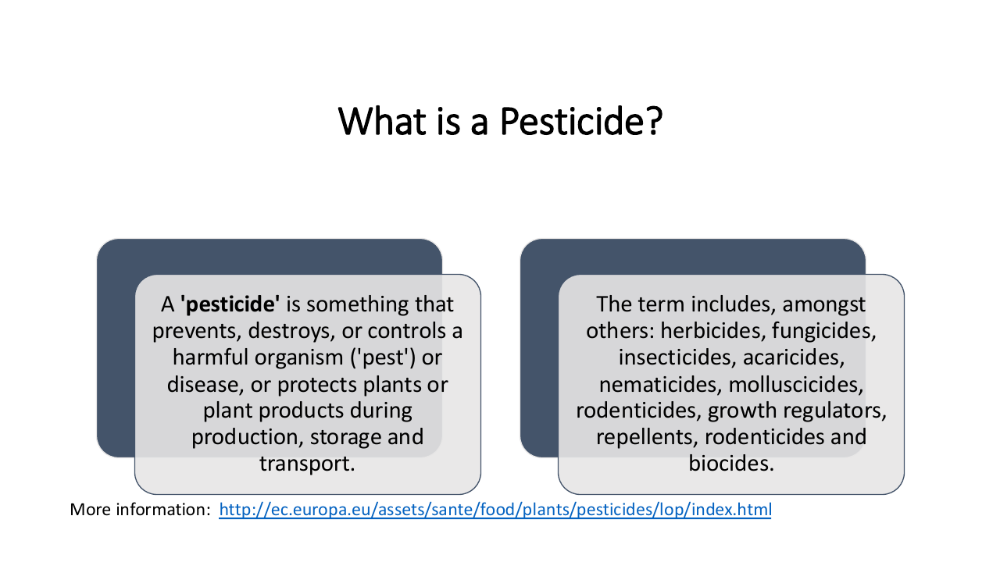

### What is a Pesticide?

A 'pesticide' is something that                       The term includes, amongst
          prevents, destroys, or controls a                     others: herbicides, fungicides,
            harmful organism ('pest') or                           insecticides, acaricides,
           disease, or protects plants or                        nematicides, molluscicides,
               plant products during                           rodenticides, growth regulators,
              production, storage and                            repellents, rodenticides and
                      transport.                                           biocides.
More information: http://ec.europa.eu/assets/sante/food/plants/pesticides/lop/index.html

## Slide 337

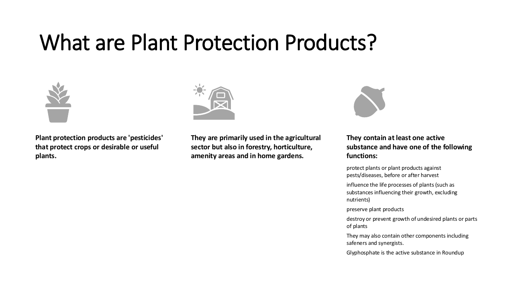

### What are Plant Protection Products?

Plant protection products are 'pesticides'   They are primarily used in the agricultural   They contain at least one active
that protect crops or desirable or useful    sector but also in forestry, horticulture,    substance and have one of the following
plants.                                      amenity areas and in home gardens.            functions:
                                                                                           protect plants or plant products against
                                                                                           pests/diseases, before or after harvest
                                                                                           influence the life processes of plants (such as
                                                                                           substances influencing their growth, excluding
                                                                                           nutrients)
                                                                                           preserve plant products
                                                                                           destroy or prevent growth of undesired plants or parts
                                                                                           of plants
                                                                                           They may also contain other components including
                                                                                           safeners and synergists.
                                                                                           Glyphosphate is the active substance in Roundup

## Slide 338

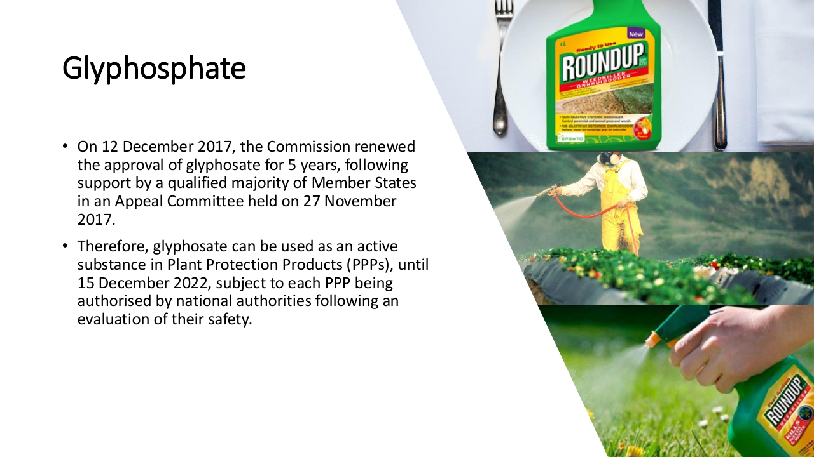

### Glyphosphate

- On 12 December 2017, the Commission renewed
the approval of glyphosate for 5 years, following
support by a qualified majority of Member States
in an Appeal Committee held on 27 November
2017.

- Therefore, glyphosate can be used as an active

substance in Plant Protection Products (PPPs), until
15 December 2022, subject to each PPP being
authorised by national authorities following an
evaluation of their safety.

## Slide 339

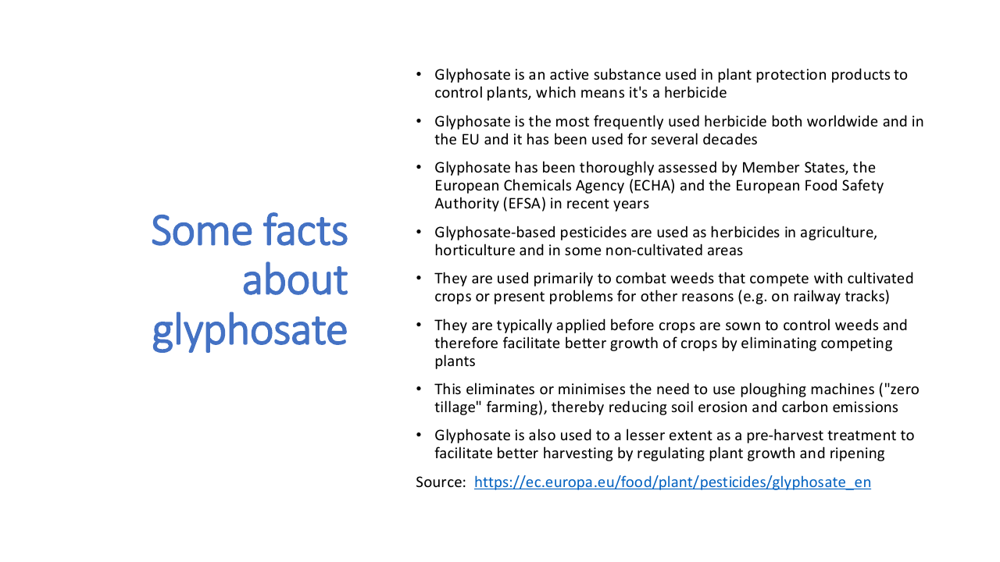

### Some facts — about — glyphosate

- Glyphosate is an active substance used in plant protection products to

control plants, which means it's a herbicide

- Glyphosate is the most frequently used herbicide both worldwide and in

the EU and it has been used for several decades

- Glyphosate has been thoroughly assessed by Member States, the
European Chemicals Agency (ECHA) and the European Food Safety
Authority (EFSA) in recent years

- Glyphosate-based pesticides are used as herbicides in agriculture,

horticulture and in some non-cultivated areas

- They are used primarily to combat weeds that compete with cultivated
crops or present problems for other reasons (e.g. on railway tracks)

- They are typically applied before crops are sown to control weeds and
therefore facilitate better growth of crops by eliminating competing
plants

- This eliminates or minimises the need to use ploughing machines ("zero
tillage" farming), thereby reducing soil erosion and carbon emissions

- Glyphosate is also used to a lesser extent as a pre-harvest treatment to
facilitate better harvesting by regulating plant growth and ripening

Source:  https://ec.europa.eu/food/plant/pesticides/glyphosate_en

## Slide 340

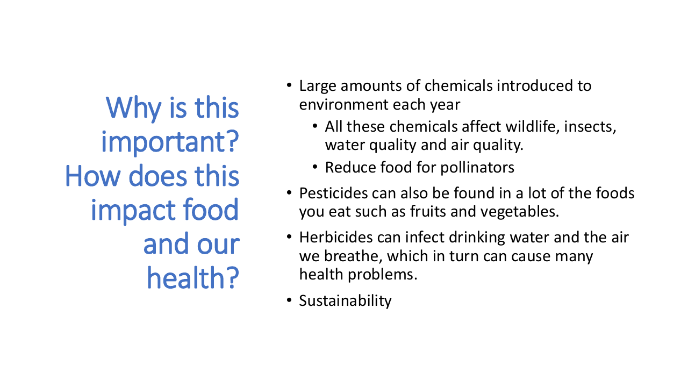

- Large amounts of chemicals introduced to
   Why is this     environment each year
- All these chemicals affect wildlife, insects,
  important?           water quality and air quality.

How does this        • Reduce food for pollinators
- Pesticides can also be found in a lot of the foods
 impact food       you eat such as fruits and vegetables.

     and our     • Herbicides can infect drinking water and the air
                   we breathe, which in turn can cause many
     health?       health problems.
- Sustainability

## Slide 341

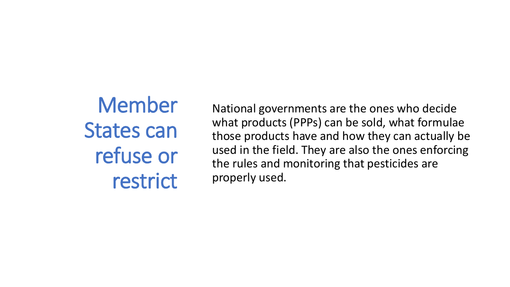

### Member — States can — refuse or

restrict

National governments are the ones who decide
what products (PPPs) can be sold, what formulae
those products have and how they can actually be
used in the field. They are also the ones enforcing
the rules and monitoring that pesticides are
properly used.

## Slide 342

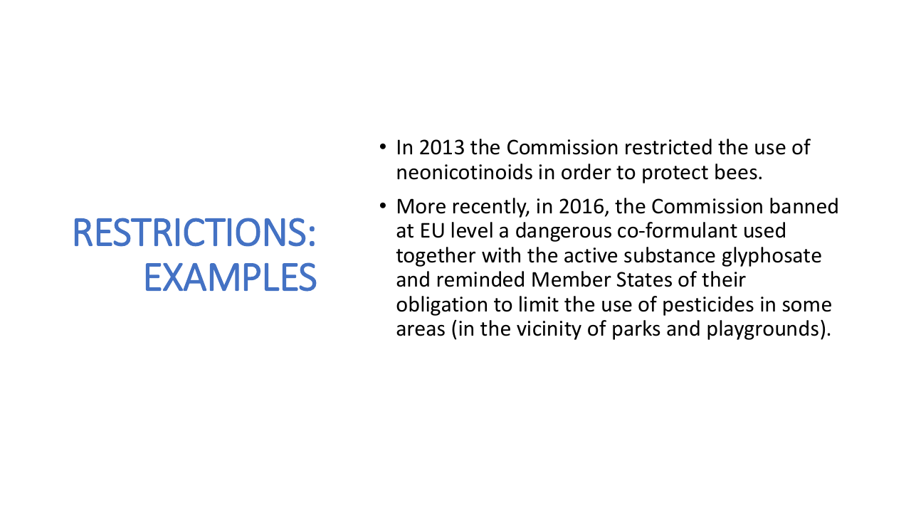

- In 2013 the Commission restricted the use of
                  neonicotinoids in order to protect bees.
- More recently, in 2016, the Commission banned
RESTRICTIONS:     at EU level a dangerous co-formulant used
                  together with the active substance glyphosate
    EXAMPLES      and reminded Member States of their
                  obligation to limit the use of pesticides in some
                  areas (in the vicinity of parks and playgrounds).

## Slide 343

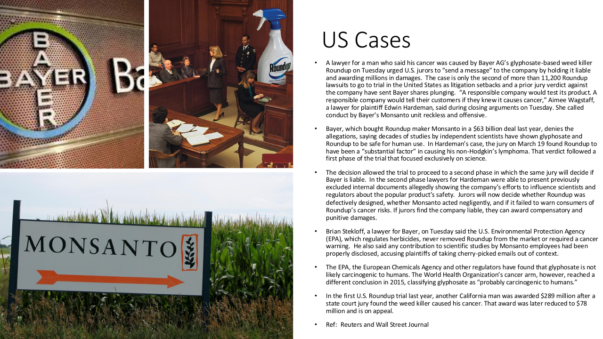

### US Cases

- 

- 

- 

- 

- 

- 

- 

A lawyer for a man who said his cancer was caused by Bayer AG’s glyphosate-based weed killer
Roundup on Tuesday urged U.S. jurors to “send a message” to the company by holding it liable
and awarding millions in damages.  The case is only the second of more than 11,200 Roundup
lawsuits to go to trial in the United States as litigation setbacks and a prior jury verdict against
the company have sent Bayer shares plunging.  “A responsible company would test its product. A
responsible company would tell their customers if they knew it causes cancer,” Aimee Wagstaff,
a lawyer for plaintiff Edwin Hardeman, said during closing arguments on Tuesday. She called
conduct by Bayer’s Monsanto unit reckless and offensive.

Bayer, which bought Roundup maker Monsanto in a $63 billion deal last year, denies the
allegations, saying decades of studies by independent scientists have shown glyphosate and
Roundup to be safe for human use.  In Hardeman’s case, the jury on March 19 found Roundup to
have been a “substantial factor” in causing his non-Hodgkin’s lymphoma. That verdict followed a
first phase of the trial that focused exclusively on science.

The decision allowed the trial to proceed to a second phase in which the same jury will decide if
Bayer is liable.  In the second phase lawyers for Hardeman were able to present previously
excluded internal documents allegedly showing the company’s efforts to influence scientists and
regulators about the popular product’s safety.  Jurors will now decide whether Roundup was
defectively designed, whether Monsanto acted negligently, and if it failed to warn consumers of
Roundup’s cancer risks. If jurors find the company liable, they can award compensatory and
punitive damages.

Brian Stekloff, a lawyer for Bayer, on Tuesday said the U.S. Environmental Protection Agency
(EPA), which regulates herbicides, never removed Roundup from the market or required a cancer
warning.  He also said any contribution to scientific studies by Monsanto employees had been
properly disclosed, accusing plaintiffs of taking cherry-picked emails out of context.

The EPA, the European Chemicals Agency and other regulators have found that glyphosate is not
likely carcinogenic to humans. The World Health Organization’s cancer arm, however, reached a
different conclusion in 2015, classifying glyphosate as “probably carcinogenic to humans.”

In the first U.S. Roundup trial last year, another California man was awarded $289 million after a
state court jury found the weed killer caused his cancer. That award was later reduced to $78
million and is on appeal.

Ref:  Reuters and Wall Street Journal

## Slide 344

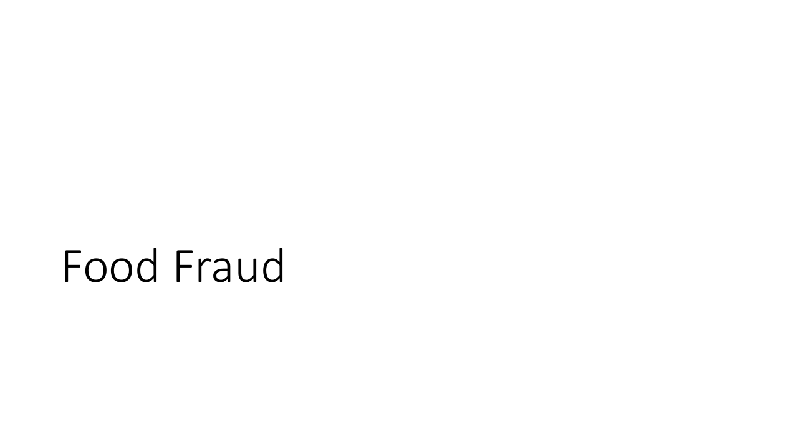

### Food Fraud

## Slide 345

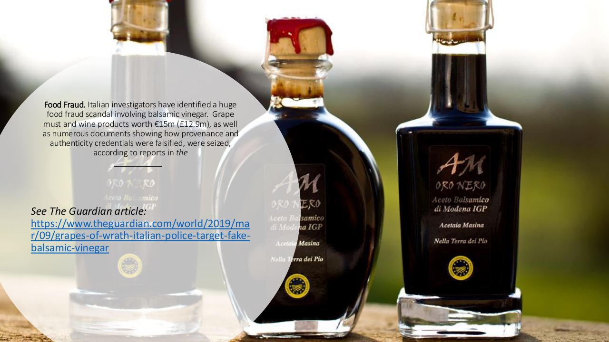

### Food Fraud. Italian investigators have identified a huge — food fraud scandal involving balsamic vinegar.  Grape — must and wine products worth €15m (£12.9m), as well

as numerous documents showing how provenance and
authenticity credentials were falsified, were seized,
according to reports in the

See The Guardian article:
https://www.theguardian.com/world/2019/ma
r/09/grapes-of-wrath-italian-police-target-fake-
balsamic-vinegar

## Slide 346

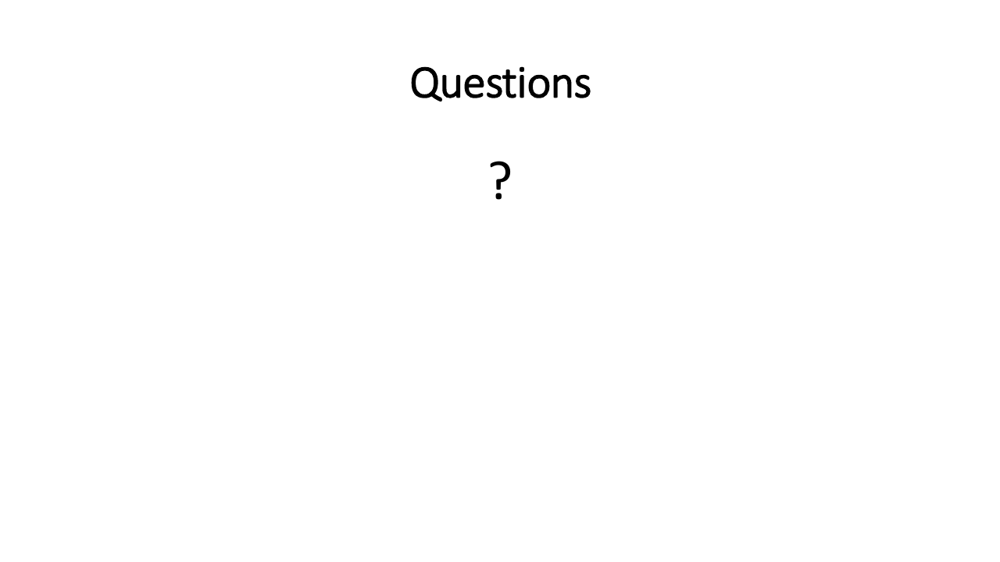

### Questions

?

## Slide 347

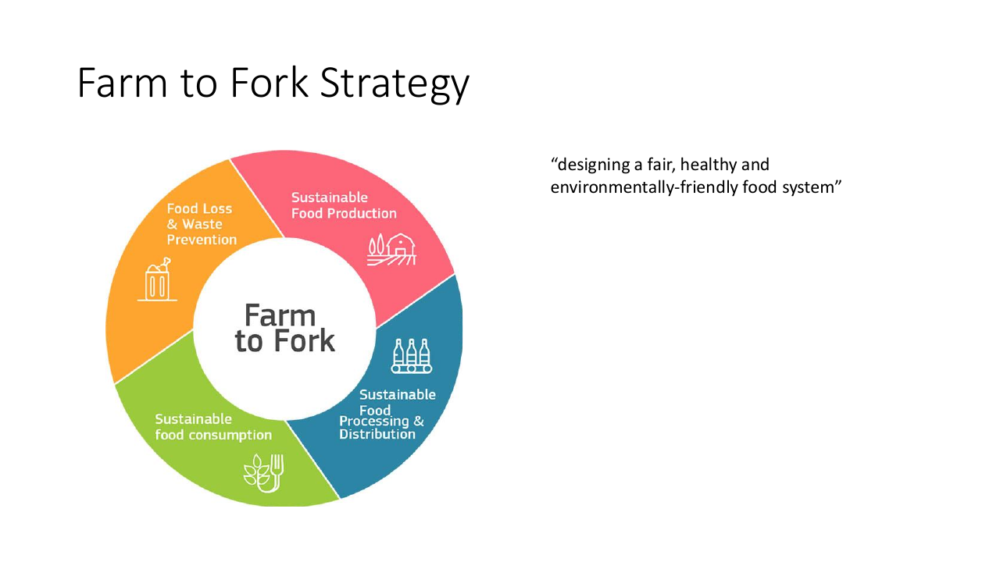

### Farm to Fork Strategy — “designing a fair, healthy and — environmentally-friendly food system”

## Slide 348

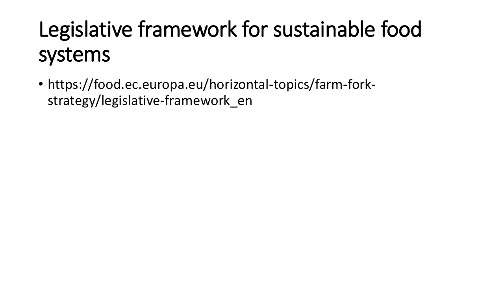

### Legislative framework for sustainable food — systems

- https://food.ec.europa.eu/horizontal-topics/farm-fork-

strategy/legislative-framework_en

---

<a id="lecture-6"></a>

# Lecture 6 — Week 8 (18 March 2026): The Hygiene Package & HACCP (Reg 852/2004)

**Topics:** Hygiene Package overview · Reg 852/2004 · HACCP principles · HACCP flow chart · HACCP decision tree · GHP · registration · inspection · risk categorisation · Annex I/II

**Slides:** 349–424 (76 slides)

## Slide 349


### Food Law & Regulatory Environment — *Course Title Slide*

*(Course title slide — see image for module / lecturer / date metadata.)*

Raw text:

```
Food Law &
Regulatory
Environment

MODULE   TFCA1402

MSC   CULINARY   INNOVAT ION   AND   FOOD   PRODUCT
DEVELOPMENT

LECTURER:SHEONA   FOLEY

DAT E:11THMARCH2026
```

## Slide 350


### What is “The Hygiene Package”

The "Hygiene Package" is a set of European Union regulations designed to ensure a high level
of food safety and consumer protection throughout the food production chain. Introduced in
2006, the regulatory framework aims to harmonise food safety standards within the EU,
covering all aspects of food production, processing and distribution.

The Aim

The legislation aimed to merge, harmonise and simplify very detailed and complex hygiene
requirements which had been scattered over many EU Directives. The overall aim is to create a
single, transparent hygiene policy applicable to all food and all food operators, together with
effective instruments to manage food safety and potential future food crises, throughout the
food chain.

## Slide 351


### The Hygiene Package

The rules are provided for in the following key acts:

1. Regulation (EC) 852/2004  - General hygiene rules for all foods

2. Regulation (EC) 853/2004 – Additional rules for foods of Animal Origin

3. Regulation (EC) 854/2004 relates to organisation of official controls on products of

animal origin intended for human consumption.

Became applicable from 2006

## Slide 352


### The Hygiene Package cont.

4. Council Directive 2002/99 lays down animal-health rules governing the

production, placing on the market and importation of products of animal origin
intended for human consumption.

5. Directive 2004/41/EC repeals certain directives food hygiene and health

conditions for the production and placing on the market of certain products of
animal origin intended for human consumption and amends Council Directives
89/662/EEC and 92/408/EC, 21 April 2004

## Slide 353


### The Hygiene Package cont.

With the coming into force of Regulation (EU) 2017/625 (the Official Control Regulation)
on 14 December 2019, Regulation (EC) No 854/2004 was repealed. Provisions on
official controls in products of animal origin can be found in:

Commission Delegated Regulation (EU) 2019/624 (Official controls of products of animal
origin)

Commission Delegated Regulation (EU) 2019/625 (Import conditions),

Commission Implementing Regulation (EU) 2019/627 (Practical arrangement official
controls products of animal origin)

Commission Implementing Regulation (EU) 2020/2235 (Import certificates)

Commission Implementing Regulation (EU) 2021/405 (Lists of third countries authorised
to import products of animal origin)

## Slide 354


### A Commission report (2009)EN••• recounts the experience gained, including the difficulties — encountered (in 2006, 2007 and 2008) from the implementation of the hygiene package — by all interested actors. It does not suggest any detailed solutions to the difficulties

reported and is, therefore, not accompanied by proposals.

The report is accompanied by a Staff Working DocumentEN••• where annexes referred to
in the report can be found.

## Slide 355


### ❑Deficiencies in existing legislation — ❑Inconsistencies and being too prescriptive in some — instances

- HACCP (see information provided re CODEX and
             development of HACCP)
What drove   ❑Different requirements for different commodities
Hygiene      (ingredients) due to more processing, pre-packaging,
             composite foods
package?
- Changes in consumer preferences
- Sourcing of raw materials (global supply chains)
- Processing and packaging technology
- Changes in food retailing practices

## Slide 356


### Council Directives that were replaced — Directive 64/433/EEC: Fresh meat                            Directive 91/493/EEC: Fishery products

Directive 71/118/EEC: Poultry meat                          Directive 91/494/EEC: Poultry meat (animal health rules)
Directive 72/461/EEC: Fresh meat (animal health rules)      Directive 91/495/EEC: Rabbit meat and farmed game meat
Directive 77/96/EEC: Trichina examination                   Directive 92/45/EEC: Game meat

Directive 77/99/EEC: Meat products                          Directive 92/46/EEC: Milk and milk products

Directive 80/215/EEC: Meat products (animal health rules)   Directive 92/48/EEC: Fishing vessels
                                                            Directive 93/43/EEC: Hygiene of foodstuffs
Directive 89/362/EEC: Milking hygiene
                                                            Directive 94/65/EC: Minced meat and meat preparations
Directive 89/437/EEC: Egg products
Directive 91/492/EEC: Live bivalve molluscs

## Slide 357


### Main Principles

1.

Farm to Fork approach to food hygiene policy

2.

FBOs take primary responsibility for the safety of the food
they produce

3.

Traceability of all food + ingredients

4.

Food Handlers must have training

## Slide 358


### Regulation (EC) No. 852/2004

Amended by:

Regulation (EC) No 1019/2008

Regulation (EC) No 219/2009

Link to Consolidate Version of the Regulation:  https://eur-lex.europa.eu/legal-
content/EN/TXT/?uri=CELEX%3A02004R0852-20090420&qid=1616520512591

## Slide 359


### Link to Eur-lex

https://eur-lex.europa.eu/homepage.html

## Slide 360


### National Legislation

Regulation (EC) No. 852/2004 has been given effect by a number of Government Departments
in so far as it relates to their area of responsibility:

1.

2.

◦

◦

Food businesses supervised by Department of Agriculture, Food and the Marine (DAFM),
Sea-Fisheries Protection Authority (SPFA) or Local Authorities:

S.I. No. 432 of 2009, as amended

Food businesses supervised by the Health Services Executive (HSE):

S.I. No. 369 of 2006, as amended

## Slide 361


### National Guides to Good — Hygiene Practice for — Food and Feed

Search here.

## Slide 362


### Guidance Documentation

1. Guidance Document on implementation of certain provisions of Regulation (EC) No 852/2004 on

the hygiene of foodstuffs

http://trade.ec.europa.eu/doclib/docs/2013/june/tradoc_151371.pdf

2.

Commission Staff Working Document on the understanding of certain provisions on flexibility
provided in the Hygiene Package.  (includes Frequently Asked Questions, Guidelines for FBOs &
Guidelines for Competent Authorities).

https://ec.europa.eu/food/sites/food/files/safety/docs/biosafety-hygiene-faq_all_business_en.pdf

3. Guidance Document on implementation of procedures based on the HACCP principles, and
facilitation of the implementation of the HACCP principles in certain food businesses

https://www.fsai.ie/uploadedFiles/EU_Guidance_HACCP.pdf

## Slide 363


### Article 6:  Registration

Who? All food businesses

What?  All food establishments

When?  ASAP

Why?  Legal requirement of Regulation 852/2004

How?  Environmental Health Officer (EHO)

## Slide 364


### Registration Requirements under Regulation 852/2004

1. All food businesses are required to register with the

   ARTICLE 6    2.
                     competent authorities (HSE/DAFM)
                     The purpose of registration is to identify where food
 Registration        businesses are situated and what their activities are so as to
                     enable official controls to be carried out

and Approval    3.   Registration is seen as a simple administrative procedure
                     whereby the competent authority is informed about the
                     address of the establishment and the activity carried out
4. Registration under 852/2004 is not the same as the previous
                     requirement under the Food Hygiene Regulations and is not
                     a ‘prior approval’

## Slide 365


### Inspection

Who? All food businesses

What?  All food establishments

When?  Depends on risk Category

Why?  Assessment – Complaint – Alert – Samples – Follow up on earlier notice etc.

How?  Environmental Health Officer (EHO) or other  …

## Slide 366


### Reference

FSAI Guidance Note 1:

Guidance for the Health Service Executive on the Inspection
of Food Businesses

## Slide 367


### RISK CATEGORISATION OF — Reason for category               Examples of businesses — BUSINESS

- Shellfish production;
                         Where the potential exists to     •Manufacturing / processing of baby food, meat & milk
                         put vulnerable groups (infants,   products, cook-chill products, salads;
HIGH-RISK                elderly, pregnant women & the     •Fish products / cooked meat distribution;
                         sick) or large numbers of         •Delicatessen;
                         consumers at risk                 •Hospital catering;
- Butcher (mixed products)

- Manufacturing / processing of oils & fats, chocolate products
- Frozen food distributor, cold stores, cash & carry
                         Where high-risk ready-to-eat
- Health food
MEDIUM- RISK             foods are not prepared, but
- shop, fish monger (raw only)
                         the scale of business is large
- B&B ( >6 people)
- Butcher (raw meat only)

- Honey production
- Manufacturing / processing of cereal products,
- jam & jelly
                         Where the potential to cause
LOW-RISK                                                   •Dry goods distribution
                         harm to consumers is low.
- Greengrocer
- B&B (<6 people)
- Bakery

## Slide 368


### All reported inspections in food — businesses, 2020–2024

## Slide 369


### FOOD SAFETY AUTHORITY OF IRELAND (FSAI) — Subscribe To Email and SMS Alerts here. — Make a complaint here.

FSAI Updates   Enforcement orders here.

## Slide 370


### Title: Type of Act = Regulation, number/year = 852/2004, name of institution = — “OF THE EUROPEAN PARLIAMENT AND OF THE COUNCIL”

Preamble (Citations and Recitals)

              Citations sets out the legal basis = “Having regard to the Treaty establishing ….”

              Recitals sets out the reasons for the contents of the enacting terms
             Chapters & Articles (enacting terms)
 Layout of   ❑ Chapter I: General Provisions

Regulation   ❑ Chapter II: Food Business Operators’ Obligations

 852/2004
- Chapter III: Guides to Good Practice

- Chapter IV: Imports & Exports

- Chapter V: Final Provisions

             Annex:
- Annex I: General Hygiene Provisions for Primary Production & Associated
              Operations

- Annex II: General Hygiene Requirements for all Food Business Operators
              (except when Annex applies)

## Slide 371


### Annex I: General hygiene requirements for primary production & — associated operations — Annex II: General hygiene requirements for all food businesses

(except when Annex I applies)
                  Chapter 1: General requirements for food premises

                  Chapter 2: Specific requirements for rooms where food is
General Hygiene   prepared, treated, processed (excluding dinning areas)
requirements      Chapter 3: Requirements for movable and/or temporary premises
                  (e.g. marquees, market stalls, mobile sales vehicles)
                  Chapter 4: Transport

                  Chapter 5: Equipment

                  Chapter 6: Food Waste

## Slide 372


### FBO has primary responsibility for food safety

Need to ensure food safety throughout food chain

             Maintenance of cold chain

General      HACCP principles & Good Hygiene Practices (GHP)
Provisions
             Guides to Good Practice

             Microbiological criteria and temperature control

             Imported food equal hygiene standards

## Slide 373


### Applies to all stages of production, processing — and distribution of food and to exports — This includes……

- The sale of food via the internet
ARTICLE 1:   oCertain businesses specialising in trading food
              (brokers)
   SCOPE     oPrimary production & associated operations:
              i.e. the production, rearing or growing of primary
              products including harvesting, milking and
              farmed animal production prior to slaughter. It
              also includes hunting and fishing and the
              harvesting of wild products (defined in
              Regulation (EC) 178/2002)

## Slide 374


### Regulation 852/2004 does not apply to ……….

1. Primary production for private domestic use

2. Domestic preparation, handling or storage of food for private domestic consumption

3. Occasional handling, preparation, storage and serving of food by private persons

4. Collection centres and tanneries which fall within the definition of food business only

because they handle raw material for the production of gelatine or collagen

5. Direct supply, by the producer, of small quantities of primary products to the final consumer

or to local retail establishments directly supplying the final consumer

## Slide 375


### Small Quantities

In general terms, the notion “small quantities” should be broad enough to allow:

- Farmers to sell primary products directly to the final consumer e.g. farm gate sales or sales at
local markets, to local retail shops for direct sale to the final consumer and to local restaurants.

- Individuals who collect products in the wild such as mushrooms and berries to deliver their
yield directly to the final consumer or to local retail shops for direct sale to the final consumer
and to local restaurants.

- It is up to Member States to further refine the notion of small quantities depending on the local
situation, and to lay down under national law the rules necessary to ensure that the safety of
the food is guaranteed (risk based approach).

See EC Guidance document 852/2004

## Slide 376


### ARTICLE 2:  DEFINITIONS

- Food Hygiene

- Primary Production

- Competent Authority

- Contamination

- Potable Water

- Clean Seawater

- Packaging

and others

## Slide 377


### Food Hygiene

Article 1 (a)

‘food hygiene’, hereinafter called ‘hygiene’, means the measures and
conditions necessary to control hazards and to ensure fitness for
human consumption of a foodstuff taking into account its intended
use;

## Slide 378


### Primary Products

1.

2.

3.

Products of plant origin, e.g. grains, fruits, vegetables, herbs, mushrooms.

Products of animal origin, e.g. eggs, raw milk, honey, fishery products, live bivalve molluscs.

Products harvested wild either from plant or animal origin, e.g. mushrooms, berries, snails etc.

NOTE:

- Fresh meat is not a primary product since it is obtained after slaughter.

- Fishery products remain primary products even after slaughter, bleeding, handling, gutting, removing
fins, refrigeration and placing in containers for transport at the level of primary production.

- Cheese is the result of processing raw or heat treated milk & is therefore not a primary product.

See EC Guidance document 852/2004

## Slide 379


### Chapter II — Food Business Operators obligations

Article 3:  General Obligations

Article 4:  General & Specific Hygiene requirements

Article 5:  HACCP

Article 6:  Official Controls, registration and approval

Article 7:  Development, dissemination and use of guides

Article 8:  National guides

Article 9:  Community Guides

## Slide 380


### FSMS and HACCP

A Food Safety Management System
                                            (FSMS) is the overall system a
  HACCP (Hazard Analysis and Critical
                                            business uses to manage food
  Control Points) is a method used to
                                           safety, which includes policies,
  identify, evaluate, and control food
                                          procedures, monitoring, training,
      safety hazards during food
                                               cleaning schedules, and
      production or preparation.
                                          documentation. HACCP is one key
                                                  part of this system.

## Slide 381


### Activity                 General Hygiene Requirements         Specific Hygiene Requirements

Primary production and   Part A, Annex I of Regulation (EC)   Relevant requirements laid down
associated operations    No. 852/2004                         in Regulation (EC) No. 853/2004

All other activities     Annex II of Regulation (EC) No.      Relevant requirements laid down
                         852/2004                             in Regulation (EC) No. 853/2004

## Slide 382


### Annex 1 – Scope — Associated operations..... — a)

the transport, storage and handling of primary products at the place of
production, provided that this does not substantially alter their nature;

    b. the transport of live animals, where this is necessary to achieve the

objectives of this Regulation;

c)

in the case of products of plant origin, fishery products and wild game,
transport operations to deliver primary products, the nature of which has not
been substantially altered, from the place of production to an establishment.

## Slide 383


### General Hygiene requirements

Annex I: General hygiene requirements for primary production & associated operations

Annex II: General hygiene requirements for all food businesses (except when Annex I applies)

1. General requirements

2. Requirements for rooms where food is prepared, treated, processed (excluding dinning areas)

3. Movable and/or temporary premises

4. Transport

5. Equipment

## Slide 384


### General Hygiene requirements cont.

6. Food Waste

7. Water Supply

8. Personal hygiene

9. Provisions applicable to foodstuffs

10. Provisions applicable to wrapping and packaging

11. Heat treatment in hermetically sealed containers

12. Training

## Slide 385


### Article 4:  Gen & Specific Hygiene — Requirements — In addition, FBOs shall:

- Comply with microbiological criteria for foodstuffs

- Comply with temperature control requirements for foodstuffs

- Maintain the cold chain

- Sampling and analysis

## Slide 386


### Who must — comply with the — HACCP

requirement of
Regulation
852/2004?

ALL food businesses with the
exception of primary producers &
associated operations

Article 5.3 & Article 16.2

## Slide 387


### Article 5.1 of Regulation (EC) No. 852/2004

‘Food business operators shall put in place, implement and maintain a permanent procedure or
procedures based on the HACCP principles.’

i.e. shall have a system based on the 7 Codex HACCP principles

## Slide 388


### ARTICLE 5:  Hazard Analysis and Critical Control — Point (HACCP)

GHP lays the foundation for HACCP

- What could go wrong?

- How can I prevent it?

- Make sure I am doing it!

## Slide 389


1. Identifying any hazards that must be prevented, eliminated or
                    reduced to acceptable levels
2. Identifying the critical control points at the step or steps at which
                    control is essential to prevent or eliminate a hazard or to reduce it
                    to acceptable levels
3. Establishing critical limits at critical control points which separate
                    acceptability from unacceptability for the prevention, elimination or
Article 5.2:        reduction of identified hazards

HACCP          4.   Establishing and implementing effective monitoring procedures at
                    critical control points
Principles     5.   Establishing corrective actions when monitoring indicates that a
                    critical control point is not under control
6. Establishing procedures, which shall be carried out regularly, to
                    verify that the measures outlined in subparagraphs (1) to (5) are
                    working effectively
7. Establishing documents and records commensurate with the
                    nature and size of the food business to demonstrate the effective
                    application of the measures outlined in subparagraphs (1) to (6)

## Slide 390


### Article 5.2: HACCP Principles

1.

2.

3.

4.

Identifying any hazards e.g. survival of E.coli O157 due to inadequate cooking of a minced
meat/burger.

Identifying the critical control points (CCP) i.e. the cooking step

Establishing critical limits i.e. 75°C at the core.

Establishing and implementing effective monitoring procedures at critical control points i.e.
periodically check that the correct temperature has been reached

5.

Establishing corrective actions e.g. Cook for longer, i.e. until correct temperature is reached.

6. Verification  Check periodically that staff are monitoring CCPs and taking corrective action.

7. Document  Keep monitoring records

## Slide 391


### CP versus CCP

What is the difference between a Control Point and a Critical Control Point?

1. A Control Point “CP” is any step in the flow of food production where a physical, chemical or

biological hazard can be controlled.

2. A Critical Control Point or "CCP" is the last step where you can intervene to prevent,

eliminate or reduce a hazard to an acceptable limit.

## Slide 392


### HACCP FLOW CHART

## Slide 393


### HACCP Decision Tree

## Slide 394


### Guidance on HACCP provided by European — Commission:

## Slide 395


### *(Image-only slide — no extractable text.)*

**HACCP — Ensuring Food Safety** (7-step wheel diagram):

1. Identifying hazards, Assessing the risks
2. Identifying CCPs (Critical Control Points)
3. Establishing critical limits
4. Implementing continuous monitoring
5. Implementing corrective measures
6. Verification / Validation
7. Documentation / Record-keeping

Underpinned by **good hygiene practices**.

## Slide 396


### Review the HACCP based procedures when — Review    modifications are made to the process or — product

Articles 5.2 &
5.4: Food
Business                    Provide the Competent Authority (CA) with
                  Provide
Operators                   evidence of their compliance

(FBOs) are also
required to……..
                            Ensure documents are kept up-to-date & are
                  Ensure    retained for an appropriate length of time

## Slide 397


### HACCP Flexibility

1.

2.

Flexibility in the development of HACCP based procedures

Flexibility in the application of specific HACCP principles

Legal Basis:

Article 5 & Recital 15 of Regulation 852/2004

Guidance:

Provided in EU Guidance document on HACCP principles

FSAI Guidance Note 11

## Slide 398


### Recital 15:  What do we mean by flexibility?

- A certain amount of flexibility in relation to compliance with the
HACCP is allowed.

- The prerequisite hygiene requirements are sufficient to control
food safety without the need to develop a HACCP based system if
the FBO is undertaking low-risk activities.

- These prerequisite hygiene requirements which are set out in the
food hygiene legislation i.e. Regulation EC (No) 852/2004 under
Article 4 and in Annex II.

## Slide 399


### What do we mean by flexibility in HACCP?

Option 1:  Implementation of GHP, where this ensures that all hazards are effectively controlled -
Prerequisites only

Option 2:  Use of a recognised guide to good practice – person implementing guide must
understand HACCP e.g. I.S.340

Option 3:  Development of a full FSMS – team must be able to demonstrate sufficient
knowledge through formal and/or informal training

## Slide 400


### Flexibility also in the application of — specific HACCP principles

- Critical limits

- Monitoring

- Documents & records

## Slide 401


### What are the Pre-requisite Requirements, — General Provisions?

- FBO has primary responsibility for food safety

- Need to ensure food safety throughout food chain

- Equipment and infrastructures – clean and in good repair

- Maintenance of cold chain

- HACCP principles & Good Hygiene Practices (GHP)

- Guides to Good Practice

- Microbiological criteria and temperature control

- Imported food equal hygiene standards

- Staff Handling and Personal Hygiene

- Potable Water

See:  Article 4 and Annex II of Reg. 852/2204 and FSAI Guidance Note 11

## Slide 402


### What are the Pre-requisite Requirements and general provisions?

- FBO has primary responsibility for food safety

     Option 1:   ❑Need to ensure food safety throughout food chain

- Equipment and infrastructures – clean and in good repair

   Controlling   ❑Maintenance of cold chain

      Hazards    ❑Hazard Control using HACCP principles & Good Hygiene Practices (GHP)

- Guides to Good Practice

   though the    ❑Microbiological criteria and temperature control

 Pre-requisite
- Imported food equal hygiene standards

- Staff Handling and Personal Hygiene

Requirements     ❑Potable Water

                  Examples: market stalls, mobile vehicles, beverage/tea/coffee only, retail/grocery,
                  transport

                  Reference: Article 4 and Annex II of Reg. 852/2204 and FSAI Guidance Note 11

## Slide 403


### Option 2: — Use of a — recognised

guide to good
practice

Flexibility in the development of HACCP based procedures - by
using a recognised guide to good practice where the hazards
and controls have been identified

Examples…….. IS 340

- Restaurants

- Catering sectors dispatching prepared food from a central
establishment

- The bakery and confectionary sector

- Retail shops, including butcher shops

## Slide 404


### OPTION 3: — Developing a — HACCP based

Businessses develop their own HACCP based system by apply the
                 seven principles according to the classical Codex Alimentarius
                 approach.
   system by
 applying the    Reference: Annex 1 of the European Commission Guidance
                 document.
       HACCP
    Principles

## Slide 405


### Business Risk Category   GHP Alone Sufficient?

Low                      Yes

Medium                   Yes?

High                     No

## Slide 406


### QMS – Quality Management Systems — QMS (e.g. ISO 22000) is — not a legal requirement

Procedures based on HACCP
                      principles

       GHP (Prerequisite requirements/Prerequisite
                  programmes (PRPs)

## Slide 407


### Voluntary Standards and Quality — Management Systems

ISO is an independent, non-governmental international organization with a membership of
161 national standards bodies.  Through its members, it brings together experts to share
knowledge and develop voluntary, consensus-based, market relevant International Standards
that support innovation and provide solutions to global challenges (such as food safety).

ISO 9000:2000  https://www.iso.org/iso-9001-quality-management.html

ISO 22000:2018 https://www.iso.org/iso-22000-food-safety-management.html

British Retail Consortium (BRC) is an association of retail companies operating in the UK
https://www.brcglobalstandards.com/brc-global-standards/food-safety/

## Slide 408


### What information should the guide — contain?

1. Cover all significant hazards

(the guide could also highlight possible hazards linked to
certain foods)
2. Clearly define procedures to control the hazards

3. Define corrective action to be taken in the case of

problems

## Slide 409


### Guidance Documentation

1. Guidance Document on implementation of certain provisions of Regulation (EC) No

852/2004 on the hygiene of foodstuffs

https://www.fsai.ie/uploadedFiles/EU_Guidance_852.pdf

2. Commission Staff Working Document on the understanding of certain provisions on flexibility
provided in the Hygiene Package.  (includes Frequently Asked Questions, Guidelines for FBOs
& Guidelines for Competent Authorities).

https://www.fsai.ie/uploadedFiles/EU_Guidance_flexibility.foodbusinesses.pdf

3. Guidance Document on implementation of procedures based on the HACCP principles, and

facilitation of the implementation of the HACCP principles in certain food businesses

https://www.fsai.ie/uploadedFiles/EU_Guidance_HACCP.pdf

## Slide 410


### National Standards Authority of Ireland — (NSAI)

Examples of guides….

Guides to Good Hygiene Practice:

1. Caterers (I.S. 340)

2. Retailers & Wholesalers (I.S. 341)

http://www.nsai.ie/

## Slide 411


### OPTION 3 — includes also — flexibility in

the    ❑Critical limits
application of      ❑Monitoring

        specific    ❑Documents & records

         HACCP
     principles

## Slide 412


### Critical Limits

Critical limits can be chosen where they are:

- In a recognised guide to good practice

- In internationally accepted standards (e.g. Codex)

- Based on experience of the operation in question

Non-numerical critical limits are permitted if valid, e.g.

- Looking for the changes in the physical properties of food during cooking

## Slide 413


### Monitoring

Monitoring may in many cases be a simple procedure, e.g. a visual observation or
check of:

othe temperature recorded on the temperature dial/display unit of
refrigeration/freezing facilities

othe physical properties of food subjected to a particular heat treatment

e.g. boiling of liquid food demonstrated by liquids bubbling when stirred

## Slide 414


### Monitoring cont.

- Certain foods may be processed in a standard way using standard calibrated
equipment e.g. certain cooking operations.

- In such cases, the temperature of the product need not be systematically
measured provided:
- the equipment is functioning properly,
- the required time/temperature combination is respected and
- the necessary controls for that purpose are carried out (and corrective action taken

where necessary).

- In restaurants, food is prepared in accordance with well established culinary
procedures. This implies that measurements (e.g. food temperature
measurements) need not be carried out systematically as long as the established
procedures are followed.

## Slide 415


### Documents & Records

HACCP related documentation should be:

1. appropriate to the nature & size of the business

2. assist businesses verify that HACCP controls are in place

3. well balanced & limited to what is essential for food safety

## Slide 416


### HACCP related documentation should — include:

1. Documents on HACCP based procedures:

o

Guides to good practice can substitute individual documentation on HACCP based procedures

2. Records on measurements and analysis carried out: In the case of visual monitoring, records
can be limited to measurements of non-compliance (i.e. ‘recording by exception’) and the
corrective action must also be recorded

3. Records on GHP/prerequisites:

- Must be maintained where food safety so requires, e.g. maintenance of the cold chain

## Slide 417


### HACCP Training: Annex II Chapter XII Para 2

Those responsible for the development and maintenance of HACCP based procedures or for the
operation of relevant guides must receive adequate training in the application of the HACCP principles

- Adequate training:

- Does not necessarily involve participation in training courses

- Could be achieved through information campaigns from professional organisations or from the
competent authorities

- Should be proportionate to the size and the nature of the business.

See - FSAI Food Safety Training Booklet

## Slide 418


### COMMISSION NOTICE on the implementation of FSMS covering GHP and procedures based on the HACCP

principles, including the facilitation/flexibility of the implementation in certain food businesses (2022/C 355/01)

In 2016, the Commission adopted the Commission Notice on the implementation of food safety
management systems covering prerequisite programmes (PRP) and procedures based on the
HACCP principles, including the facilitation/ flexibility of the implementation in certain food
businesses – this notice provided guidance ... Since 2016, a number of revisions of relevant
legislation took place (e.g. the introduction of allergen control and food safety culture as
requirements in Regulation (EC) No 852/2004 (2) by Regulation (EU) 2021/382) and international
standards (e. g. the revision of ISO 22000 and of the Codex Alimentarius General principles of
Food Hygiene, and the adoption of the Codex Alimentarius Code of Practice on Food Allergen
Management for Food Business Operators). A number of relevant scientific opinions were
published by the European Food Safety Authority (EFSA) and further experiences were also
gained from the practical implementation of the recommendations.

The link to the new notice is here.

## Slide 419


### FSAI Food Safety Training Standard updated

## Slide 420


### Food Safety Culture

Since March 2021, there is a legal requirement
that all food businesses to establish, maintain
and demonstrate an appropriate food safety
culture within their business.

The regulation, which amends an existing food
safety regulation, requires food businesses to
provide evidence of an appropriate food safety
culture by satisfying a number of requirements
set out in the regulation.

See FSAI Open Meeting recorded Nov 2021.

## Slide 421


### FSAI eModules available here

## Slide 422


### Implementing the Food Hygiene Package

The EU produced a report in 2009 which recounts the experience gained, including the
difficulties encountered (in 2006, 2007 and 2008) from the implementation of the hygiene
package by all interested actors. It does not suggest any detailed solutions to the difficulties
reported and is, therefore, not accompanied by proposals.

https://eur-lex.europa.eu/legal-content/EN/TXT/?uri=CELEX:52009DC0403

## Slide 423


### HACCP, TACCP and VACCP

TACCP and VACCP address threats and vulnerabilities instead of hazards.

TACCP stands for Threat Assessment and Critical Control Points. This protocol
focuses on tampering, intentional adulteration of food, and food defence.

VACCP stands for Vulnerability Assessment and Critical Control Points. It
focuses on food fraud as well, and widens the scope to include systematic
prevention of any potential adulteration of food, whether intentional or not, by
identifying the vulnerable points in a supply chain. It is especially concerned
with economically motivated adulteration (EMA).

## Slide 424


### Questions — ?

---

<a id="lecture-7"></a>

# Lecture 7 — Week 9 (25 March 2026): Hygiene Package (cont.) & Foods of Animal Origin (Reg 853/2004)

**Topics:** Reg 853/2004 · specific hygiene rules for products of animal origin · ID marking · HACCP objectives · national legislation · documentation & records · FBO obligations

**Slides:** 425–478 (54 slides)

## Slide 425


### Food Law & Regulatory Environment — *Course Title Slide*

*(Course title slide — see image for module / lecturer / date metadata.)*

Raw text:

```
Food Law &
Regulatory
Environment

MODULE   TFCA1402

MSC   CULINARY   INNOVAT ION   AND   FOOD   PRODUCT
DEVELOPMENT

LECTURER:SHEONA   FOLEY

DAT E:25THMARCH   2025
```

## Slide 426


### What is “The Hygiene Package”

The current hygiene rules, adopted in April 2004 by the European Parliament and the European
Council which came into force on 1 January 2006 and are known collectively as the "Hygiene
Package".

The Aim

The legislation aimed to merge, harmonise and simplify very detailed and complex hygiene
requirements which had been scattered over many EU Directives. The overall aim is to create a
single, transparent hygiene policy applicable to all food and all food operators, together with
effective instruments to manage food safety and potential future food crises, throughout the
food chain.

## Slide 427


### The Hygiene Package

The rules are provided for in the following key acts:

1. Regulation (EC) 852/2004  - General hygiene rules for all foods

2. Regulation (EC) 853/2004 – Additional rules for foods of Animal Origin

3. Regulation (EC) 854/2004 relates to organisation of official controls on products of animal

origin intended for human consumption.

Became applicable from 2006

## Slide 428


### Official Controls

With the coming into force of Regulation (EU) 2017/625 (the Official Control Regulation)
on 14 December 2019, Regulation (EC) No 854/2004 was repealed. Provisions on
official controls in products of animal origin can be found in:

- Commission Delegated Regulation (EU) 2019/624 (Official controls of products of animal
origin)

- Commission Delegated Regulation (EU) 2022/2292 (Public health import conditions)

- Commission Implementing Regulation (EU) 2019/627 (Practical arrangement official
controls products of animal origin)

- Commission Implementing Regulation (EU) 2020/2235 (Import certificates)

- Commission Implementing Regulation (EU) 2021/405 (Lists of third countries authorised
to import products of animal origin)

## Slide 429


### Implementing and — Delegating Acts

Both are types of non-legislative acts adopted by the European Commission based on a
primary "basic act" and are subject to judicial review by the Court of Justice of the EU.

Delegated acts are defined as nonlegislative acts of general application, adopted by the
European Commission on the basis of a delegation contained in a legislative act. They
may supplement or amend the basic act, but only as to non-essential aspects of the
policy area.

Implementing acts are not defined as to their legal nature, but to their purpose − where
uniform conditions for implementing legally binding Union acts are needed. Under no
circumstances may an implementing act modify anything in the basic act.

Ref:  Articles 290 and 291 of the Treaty on the Functioning of the European Union (TFEU)

## Slide 430


### Main Principles

1.

Farm to Fork approach to food hygiene policy

2.

FBOs take primary responsibility for the safety of the food
they produce

3.

FSMS based on HACCP

4.

Traceability of all food + ingredients

5.

Food Handlers must have training

## Slide 431


### Who must — comply with the — HACCP

requirement of
Regulation
852/2004?

ALL food businesses with the
exception of primary producers &
associated operations

Article 5.3 & Article 16.2

## Slide 432


### ARTICLE 5:  Hazard Analysis and Critical Control — Point (HACCP)

GHP lays the foundation for HACCP

- What could go wrong?

- How can I prevent it?

- Make sure I am doing it!

## Slide 433


### Article 5.1 of Regulation (EC) No. 852/2004

‘Food business operators shall put in place, implement and maintain a permanent procedure or
procedures based on the HACCP principles.’

i.e. shall have a system based on the 7 Codex HACCP principles

## Slide 434


1. Identifying any hazards that must be prevented, eliminated or
                    reduced to acceptable levels
2. Identifying the critical control points at the step or steps at which
                    control is essential to prevent or eliminate a hazard or to reduce it
                    to acceptable levels
3. Establishing critical limits at critical control points which separate
                    acceptability from unacceptability for the prevention, elimination or
Article 5.2:        reduction of identified hazards

HACCP          4.   Establishing and implementing effective monitoring procedures at
                    critical control points
Principles     5.   Establishing corrective actions when monitoring indicates that a
                    critical control point is not under control
6. Establishing procedures, which shall be carried out regularly, to
                    verify that the measures outlined in subparagraphs (1) to (5) are
                    working effectively
7. Establishing documents and records commensurate with the
                    nature and size of the food business to demonstrate the effective
                    application of the measures outlined in subparagraphs (1) to (6)

## Slide 435


### HACCP Flexibility

1.

2.

Flexibility in the development of HACCP based procedures

Flexibility in the application of specific HACCP principles

Legal Basis:

Article 5 & Recital 15 of Regulation 852/2004

Guidance:

Provided in EU Guidance document on HACCP principles

## Slide 436


### What do we mean by flexibility in HACCP?

Option 1:  Implementation of GHP, where this ensures that all hazards are effectively controlled -
Prerequisites only e.g.

Option 2:  Use of a recognised guide to good practice – person implementing guide must
understand HACCP e.g. I.S.340

Option 3:  Development of a full FSMS – team must be able to demonstrate sufficient
knowledge through formal and/or informal training

## Slide 437


### Assessment of HACCP — compliance

FSAI Guidance Note 11

The purpose of this guidance document is to provide a
consistent approach within the environmental health service
towards the assessment of compliance with the HACCP
requirement.

## Slide 438


### Regulation (EC) No 853/2004 — of the European Parliament and — of the Council of 29 April 2004

laying down specific hygiene
rules for food of animal origin

LINK HERE.

## Slide 439


### National law……

It is common for the Government to use Statutory Instruments to transpose EU
regulations and directives into Irish law.

European Union (Food and Feed Hygiene) Regulations 2020, S.I. No. 22 of 2020

## Slide 440


### See section on Brightspace

## Slide 441


### Meat Legislation and The Hygiene Package

- The Hygiene Package came into effect across all Member States from 1 January 2006.

- The Hygiene Package revises and consolidates legislation in relation to food and feed hygiene
along with the production, control and marketing of products of animal origin and animal
health issues in relation to the production of those products.

- The underlying philosophy is that food producers should bear full responsibility for the safety of
the food they produce.

- Transposed into Irish legislation - S.I. No. 432 of 2009.

- The regulations require food business operators that are primary producers of food products to
apply for registration and the Department of Agriculture, Food and the Marine (DAFM) is a
registering authority for this purpose.

## Slide 442


### EC Guidance Documents

Guidance on certain provisions of Regulation (EC) No 853/2004 published by the European Commission

- Commission staff working document on the Understanding of certain provisions on flexibility provided in

the hygiene package - Guidelines for the competent authorities

- Commision Staff working document on the Understanding of certain provisions on flexibility provided in

the Hygiene Package (Frequently Asked Questions - Guidelines for food business operators)

- Guidance Document on the Implementation of certain provisions of Regulation (EC) No 853/2004 on the

hygiene of food of animal origin

- Commission Notice 2022/C 355/01 on the implementation of food safety management systems covering

Good Hygiene Practices and procedures based on the HACCP principles, including the
facilitation/flexibility of the implementation in certain food businesses

## Slide 443


### Layout of Regulation 853/2004

Chapters

- Chapter I: General provisions

- Chapter II: FBOs obligations

- Chapter III: Trade

- Chapter IV: Final provisions

Annex

- Annex I: Definitions

- Annex II: Requirements concerning several products of animal origin

- Annex III: Specific requirements

## Slide 444


### Chapter 1, Article 1 — Scope  - What products does it apply to?

1.

2.

“Products of animal origin” means food of animal origin including honey and blood, live
bivalve molluscs, live echinoderms, live tunicates and live marine gastropods intended for
human consumption, and other animals destined to be prepared with a view to being
supplied to the final consumer.  (See Annex I, point 8.1 of Regulation (EC) No 853/2004)

“Processing” means any action that substantially alters the initial product, including heating,
smoking, curing, maturing, drying, marinating, extraction, extrusion or a combination of
these processes. ( Article 2, paragraph 1(m) of Regulation (EC) No 852/2004

## Slide 445


### Scope (Products)

3. Does not apply to food containing both products of plant origin and

processed products of animal origin e.g. dairy chocolate, bakery products,
pizzas etc.

- Processing of a composite product is therefore subjected to the hygiene

requirements of Regulation (EC) 852/2004 only however, the handling of an
unprocessed ingredient thereof which is of animal origin must comply with the
requirements of Regulation (EC) 853/2004

## Slide 446


### Scope (Retail establishments)

4. Does not apply to retail activities involving direct sale to the final

consumer. This means that where cheese is manufactured and sold at a retail
premises (e.g. at the farm), these activities can be carried out in compliance
with appropriate requirements in Regulation (EC) No 852/2004 only, requiring
registration but no approval.

(Example of guidance document for poultry available).

## Slide 447


### Scope (Wholesale Activities)

5. Applies to wholesale activities (i.e. when a wholesale or retail establishment carries out

a)

b)

operations with a view to supplying food of animal origin to another establishment) except:
for establishments for which the wholesale activities consist only of storage and transport. In that
case, the requirements of Regulation (EC) No 852/2004, and the temperature requirements laid
down in Regulation (EC) No 853/2004 apply,
if the supply is, in accordance with national law, a marginal, localised and restricted activity of a
retail establishment that mainly supplies the final consumer. In that event, only Regulation (EC) No
852/2004 applies.

S.I. No. 340 of 2010 - Butcher Shop

S.I. No. 168 of 2012 - Retail Catering Establishments

## Slide 448


### Learn more here

Reg 852/2004 and 853/2004 grant certain specified activities on the basis that
they are regulated by national rules that ensure the achievement of the
objectives of the EU Regulations. Ireland has introduced national rules in
accordance with the derogations granted under Regulation (EC) No 853/2004
for the following:

- Marginal, Localised and Restricted Activity in Butcher Shops

- Marginal, Localised and Restricted Activity in Retail Catering Establishments

## Slide 449


### Chapter 1, Article 2:  Definitions

Refers to the following for definitions:

- Regulation 178
- Regulation 852
- Annexes

## Slide 450


### ANNEX I

Definitions including :

1.

Fresh meat/minced/MSM

2. Untreated intestines, stomachs and bladders

3.

4.

5.

6.

Blood

Fresh fishery products

Live Bivalve molluscs

Raw Milk

7. Whole Eggs and liquid egg

8.

Snails

9. Honey

## Slide 451


### ANNEX II

Requirements concerning several products of animal origin

Section I:  ID marking

Section II:  HACCP Objectives

Section III:  Food Chain Information

Section IV:  Frozen Food

## Slide 452


### Annex III – Specific Requirements

Section I:  Domestic ungulates (cattle, sheep, pigs)

Section II: Poultry

Section III:  Farmed game

Section IV:  Wild game

Section V:  Minced meat & preparations, MSM

Section VI:  Meat Products

## Slide 453


### Annex III – Specific Requirements cont.

Section VII:  Live Bivalve Molluscs

Section VIII:  Fishery

Section IX:  Raw Milk

Section X:  Eggs

Section XI:  Frogs

Section XII:  Rendered Animal Fats

## Slide 454


### Annex III – Specific Requirements cont.

Section XIII:  Treated Stomachs

Section XIV:  Gelatine

Section XV:  Collagen

## Slide 455


### Chapter II — Food Business Operators obligations

FBOs obligations.....

1.

2.

FBOs must comply with the requirements of Annex II (Identification Marking) and III (Specific
requirements for slaughtering, cutting, boning etc)

Establishments handling products for which Annex III lays down requirements must be
approved by the competent authority

3. A product of animal origin originating in an establishment subject to approval cannot be

placed on the market unless a health mark or identification mark is applied

## Slide 456


### Article 5: — Health and Identification Marks

1. Fresh meat must bear a health mark applied by an official veterinarian (see

Regulation 854/2004 as replaced for further information on this)

2. All other products of animal origin need to be labelled with an identification

mark. (see Annex II)

## Slide 457


### Definition of Fresh Meat from Annex I

1.10. ‘Fresh meat’ means meat that has not undergone any preserving process
other than chilling, freezing or quick-freezing, including meat that is vacuum-
wrapped or wrapped in a controlled atmosphere.

## Slide 458


### Health Mark

Health Mark must be an oval mark at least 6.5cm wide by
4.5cm high, bearing the following information in perfectly
legible characters:

1.

2.

Name of country in which establishment located, capitals,
two letter code in accordance with ISO standard e.g. IE

The mark must indicate the approval number of the
slaughter house; and

3. When applied in a slaughterhouse within the Community,
the mark must include the abbreviation EC or similar

4. Mark may be applied directly to product, the

wrapping or the packaging, or be printed on a label
affixed to the product, the wrapping or packaging.

Must be legible

Must be irremovable tag or resistant material

Ref:  FSAI and DAFM websites for more information

## Slide 459


### Animal Identification & Traceability

Identification of animals is at the heart of much of the EU legislation:

- The localisation and tracing of animals for veterinary purposes, which is of crucial importance
for the control of infectious diseases e.g. foot & mouth

- Traceability of meat is also important for animal and public health reasons and the
management and supervision of livestock

- Link to video on Identification and traceability of animals here.

## Slide 460


### Meat labelling confusing

The requirement to state where meat originates differs depending on the type of meat.  For some meats,
origin can be easily determined. For others, it is less clear.

For beef, it’s simple. The country of origin must be given, according to the authority. That applies to both
fresh and frozen cuts and cuts sold pre-packed or at a butcher counter.

These rules also apply to fresh cuts of poultry, pigs, goats and sheep - to fresh, chilled or frozen carcasses,
whole birds or cuts of these meats. That could include chicken breasts, pork chops and lamb cutlets.

For processed meats, however, determining origin isn’t as straightforward. Manufacturers are not
required to clearly label country of origin for the likes of cured meats – bacon, rashers, salami, deli meat
and sausages, for instance, the FSAI has said.

Nor is the country of origin required for products that contain meat as an ingredient. For
example, lasagne. The identification mark that appears on these types of products, (i.e. an oval
shaped mark with letters referring to an EU Member State accompanied by a number) only refers to the
last place the product underwent processing. It is not an indication of origin.)

(Unless primary ingredient and differs from Country of Origin.)

## Slide 461


### Labelling of Meat a concern for — consumers

Certain meat-based foods sold in
  supermarkets in the European Union            The European Commission wants to
   are not properly labelled or do not           tighten food labelling rules in the
   contain accurate information about              wake of the recent horsemeat
     their ingredients - says Brussels          scandal. Report here. Published on
                                says Brussels                   here

    based consumer lobby group - the
   based consumer lobby group
                                                            May 6, 2013
   European Consumers Organisation.

## Slide 462


### FSAI has said that current meat — labelling is not ideal.

‘Origin Ireland’

“We appreciate where consumers are coming from when it comes to country of origin labelling
and acknowledge that the information on the label can seem misleading”.

“This has also been acknowledged at European level and changes to legislation have been made
and will come into force ...”

New rules came into effect in 2020 - aimed at giving consumers greater clarity, the country of
origin of the primary ingredient in a meat product must be given.

If the country indicated on a packet differs from where the primary ingredient comes from then
the primary ingredient must also be labelled clearly as being different to that of the food.

Primary ingredient will be defined in this new legislation as “an ingredient or ingredients of a
food that represent more than 50% of that food or which are usually associated with the name
of the food by the consumer,” according to the FSAI.

Ref:  9th February, 2019, Report from The Journal

## Slide 463


### Other Standards

What does the Bord Bia Quality Assurance Mark (Q Mark) tell me?

Where you see Bord Bia Q Mark on a product it means that the product has been produced in accordance with the
required Quality Assurance standards and secondly the flag and the ‘Origin Ireland’ on the mark verify that the product
was produced, in its entirety, in Ireland – where you see this mark it means that the food was farmed and processed in
the Republic of Ireland.

What products carry the Q Mark?

Bord Bia operates Quality Assurance Schemes for the following:
Bacon, Beef, Chicken, Duck, Eggs, Fruit, Lamb, Pork, Turkey and Vegetables. A substantial number of farmers/producers
and processors are members of these schemes and therefore, a large range of food with the Bord Bia Q Mark is available
from all the major supermarkets and other retail outlets.

Can imported meat or other foods which are processed in a Bord Bia Approved Food Company in Ireland carry the
Bord Bia Q Mark with the Irish tricolour?

Only food produced on approved Irish farms and processed in approved Irish factories can carry the Origin Ireland Q
Mark.  Currently all the members of the Bord Bia Quality Assurance schemes are on the island of Ireland.

Learn more here.

## Slide 464


### HACCP Training: Annex II Chapter XII Para 2

Those responsible for the development and maintenance of HACCP based procedures or for the
operation of relevant guides must receive adequate training in the application of the HACCP principles

- Adequate training:

- Does not necessarily involve participation in training courses

- Could be achieved through information campaigns from professional organisations or from the
competent authorities

- Should be proportionate to the size and the nature of the business.

See - FSAI Food Safety Training Booklet

## Slide 465


### FSAI Food Safety Training Standard updated

## Slide 466


### SAFEFOOD — Report (2018)

This report provides details on the
current situation across the island of
Ireland with regard to the level of food
safety knowledge and skills within
Small and Medium Enterprises in food
and drink manufacturing, retail and
catering.

## Slide 467


### Food safety knowledge and skills among — SMEs on the island of Ireland

https://www.safefood.eu/SafeFood/media/SafeFoodLibrary/Documents/Publications/Research%
20Reports/Food-safety-knowledge-and-skills-among-SMEs-on-the-island-of-Ireland.pdf

## Slide 468


### Table 1: European definition of Small and Medium Enterprises (SMEs) Size Number of employees — Annual turnover or annual balance sheet Medium

## Slide 469


### Food Safety — Culture

Since March 2021, there is a legal
requirement that all food businesses to
establish, maintain and demonstrate an
appropriate food safety culture within
their business.

The regulation, which amends an
existing food safety regulation, requires
food businesses to provide evidence of
an appropriate food safety culture by
satisfying a number of requirements set
out in the regulation.

See FSAI Open Meeting recorded Nov
2021.

## Slide 470


### FSAI eModules available here

## Slide 471


### Food Fraud — The Food Safety Authority of Ireland (FSAI) state that — “Food fraud is committed when food is illegally

placed on the market with the intention of deceiving
             the customer, usually for financial gain.”
             In recent years food fraud has become much more of
             an issue for consumers as global food supply has
             become so complex that it is almost impossible for
             food producers and retailers to guarantee the
             provenance of their products. This has spurred
             initiatives to address these growing concerns. The
             effects of a food fraud can range from economic
             losses for producers, harming people’s health and
             brand/reputational damage.

## Slide 472


### HACCP, TACCP and VACCP

TACCP and VACCP address threats and vulnerabilities instead of hazards.

TACCP stands for Threat Assessment and Critical Control Points. This protocol
focuses on tampering, intentional adulteration of food, and food defence.

VACCP stands for Vulnerability Assessment and Critical Control Points. It
focuses on food fraud as well, and widens the scope to include systematic
prevention of any potential adulteration of food, whether intentional or not, by
identifying the vulnerable points in a supply chain. It is especially concerned
with economically motivated adulteration (EMA).

## Slide 473


1. Using a case studies from closure orders, debate where the
                 responsibility for preventing food business closure orders in Ireland
                 should lie, is it primarily with businesses rather than regulators or
                 consumers, particularly in the implementation of effective FSMS
                 (including food safety, traceability, safety culture, and staff training).

2. Research contamination and/or fraud case studies such as the Horse
                 Meat Scandal, Ecoli etc. Debate whether regulators, rather than
                 consumers, should bear the primary responsibility for responding to
Week 9           food fraud and contamination incidents in the EU, including ensuring
                 effective traceability, withdrawal/recall systems, RASFF coordination,
(Revision        and communication.

Topics)     3.   Debate whether flexibility in the design of Food Safety Management
                 Systems benefits food companies more than it risks undermining food
                 safety standards.

4. Cross Contamination: debate whether food manufacturers should be
                 held fully accountable for preventing cross-contamination in the context
                 of allergens, gluten-free in products placed on the market, regardless of
                 operational challenges. Indicate how this impacts labelling of food
                 products.

## Slide 474


### Questions

## Slide 475


### Links to other specific legislation

Wild Game

Honey

Food Products Non-Animal Origin (includes chocolate, coffee, jam, olive oil,
sugar, wine, chilli)

## Slide 476


### Sprouts & Seeds

Following the large outbreak in France and Germany of Shiga toxin-producing E. Coli in May
2011, consumption of sprouts was identified as the most likely origin of the outbreaks. This has
resulted in a suite of measures in the form of four new Commission Regulations to cover the
import, traceability, microbiological criteria and approval of establishments producing sprouts.

More here.

## Slide 477


### Official Controls

Regulation (EU) 2017/625 link here.

Amends and Repeals earlier regulations.

## Slide 478


### Questions

---

<a id="lecture-8"></a>

# Lecture 8 — Week 11 (14 April 2026): Revision Lecture 1 of 2

**Topics:** Revision recap · food scares & fraud · enforcement pyramid · green laws · EU consumer-empowerment directive · Organic recap

**Slides:** 479–511 (33 slides)

## Slide 479


### Food Law & Regulatory Environment — *Course Title Slide*

*(Course title slide — see image for module / lecturer / date metadata.)*

Raw text:

```
Module TFCA1402
Food Law & Regulatory Environment
Revision Lecture 1 of 2
Date:  14th April 2026
```

## Slide 480


### How is this module assessed?

Assignment          Examination
     (40%)                (60%)

## Slide 481


### Label Assignment (40%)

Feedback issued next
               Marks will be issued   week – enabling you
   Submitted
                   next week           to update your NPD
                                             module

## Slide 482


### Invigilated Exam (60%)

3 questions to
   Invigilated
                  3 hours    be answered
      Exam
                               out of 5

## Slide 483


- Regulation EC No 178/2002: Defines Food, Consumer Interests, Recall & Traceability
- FOOD SAFETY AUTHORITY OF IRELAND ACT, 1998

- Regulation EC No 852/2004: Hygiene of Foodstuffs - Food Hygiene & HACCP & FBO
- Regulation EC No 853/2004: Hygiene of Food of Animal origin - Food Hygiene & HACCP &
                FBO
- ****Regulation EC No 2017/625: Official Controls Regulation
- Regulation EC No 1169/2011: FIC & Nutritional Declarations

Important
- ****Regulation EC No 2073/2005: Microbiological Criteria
- Regulation EC No 1924/2006: Nutrition & Health Claims

Regulations   • Regulation EC No 1925/2006: Vitamins & Minerals
- REGULATION (EU) No 432/2012: permitted health claims made on foods, other than those
                referring to the reduction of disease risk and to children's development and health
- Regulation EC No 1331-1334/2008: Food additives, enzymes & flavourings
- Regulation (EU) No 828/2014 : Gluten Intolerance
- REGULATION (EU) No 1308/2013 … establishing a common organisation of the markets in
                agricultural products (and repealing Council Regulations (EEC) No 922/72, (EEC) No 234/79, (EC) No 1037/2001 and (EC)
                  No 1234/2007)

- ****Regulation (EU) 2015/2283: Novel Foods
- **** Please note regulations in italics not covered in detail this year.

## Slide 484


### Week 9 (Revision Topics)

1.

2.

3.

4.

Enforcement:   Using case studies from closure orders, debate where the responsibility for preventing food
business closure orders in Ireland should lie, is it primarily with businesses rather than regulators or consumers,
particularly in the implementation of effective FSMS (including food safety, traceability, safety culture, and staff
training).

Food Scares & Food Fraud:  Research contamination and/or fraud case studies such as the Horse Meat Scandal,
Ecoli etc.  Debate whether regulators, rather than consumers, should bear the primary responsibility for
responding to food fraud and contamination incidents in the EU, including ensuring effective traceability,
withdrawal/recall systems, RASFF coordination, and communication.

Flexibility:  Debate whether flexibility in the design of Food Safety Management Systems (FSMS) benefits food
companies more than it risks undermining food safety standards.

Cross Contamination:  debate whether food manufacturers should be held fully accountable for preventing
cross-contamination in the context of allergens, gluten-free in products placed on the market, regardless of
operational challenges.  Indicate how this impacts labelling of food products.

## Slide 485


### Enforcement

## Slide 486


### Enforcement pyramid

(Adapted from Ayres and Braithwaite (1992) Responsive Regulation: Transcending the Deregulation Debate. New
York: Oxford University Press)

## Slide 487


### Enforcement Orders 14th April 2026

- 

- 

- 

- 

- 

- 

The Food Safety Authority of Ireland (FSAI) today reported that Environmental Health Officers in the Health Service Executive (HSE) served twelve Closure Orders and two Prohibition Orders on food
businesses during the month of March for breaches of food safety legislation, pursuant to the FSAI Act, 1998 and the European Union (Official Controls in Relation to Food Legislation) Regulations, 2020.

Eight Closure Orders were served under the FSAI Act, 1998 on:

- 

- 

- 

- 

- 

- 

- 

- 

Kebab House 66 (Service Sector), Moore Street Mall, 58 Parnell Street, Dublin 1

Georgian Delight (Restaurant/ Café), Unit 3, Moore Street Mall, 58-66 Parnell Street, Dublin 1

Dailo Nepali Kitchen (Restaurant/ Café), Kitchen 4, Moore Street Mall, 58-66 Parnell Street, Dublin 1

Tiramisu Mania (Manufacturer), Moore Street Mall, 58 Parnell Street, Dublin 1

Spicy Bite (Restaurant/ Café), Unit 1, Moore Mall, Moore Street, Dublin 1

Glanmore Foods Limited, Grange Community College (Service Sector), Grange Abbey Road, Donaghmede, Dublin 13

Eskimo Pizza Bandon (Closed area: the potato peeling room at the rear of the premises) (Take Away), 1 St Patrick’s Quay, Bandon, Cork

Eurospar (Retailer), 25-27 Annesley Bridge Road, Fairview, Dublin 3

Four Closure Orders were served under the European Union (Official Controls in Relation to Food Legislation) Regulations, 202 0 on:

- 

- 

- 

- 

Bruno Gomes (Wholesaler/ Distributor), A food business in operation from a domestic dwelling at Ferndale, Navan, Meath

Arsh Bazzar (Closed area: Butcher area) (Retailer), 6 Mary Street, Clonmel, Tipperary

Mars Pizza (Take Away), Coolbeg, Kildimo, Limerick

Meet Brazil (Closed area: the kitchen area upstairs serving the restaurant and take away. The retail area downstairs can remain open.) (Retailer), Castle Hill, Enniscorthy, Wexford

Two Prohibition Orders were served under the European Union (Official Controls in Relation to Food Legislation) Regulations,  2020 on:

- 

- 

Al-Eman Halal Shop Limited (Butcher Shop/Retailer), 21 Irishtown, Clonmel Tipperary

Pinoy Sari Sari (Retailer), 25-26 Mary Street, Dublin City

Among the reasons for the Enforcement Orders in March are: active cockroach infestation; dead cockroaches noted inside a frid ge; evidence of rodent activity; dead mouse in a cockroach trap; rodent
droppings under the sink area; meat being air dried in a bedroom; no suitable hand washing facilities available to food workers; no hot water or soap for hand washing; cleaning materials stored in dirty
stagnant water; thick waste discharge covering an entire floor in a kitchen; equipment observed to be heavily soiled and in a n unclean condition; insufficient traceability information; no food safety
management system or procedures in place for food safety; no commercial documents or other suitable records to establish the traceability of the foods.

Lind to FSAI information here.

## Slide 488


### Food Scares and Food Fraud

## Slide 489


### Case Studies

- Ecoli
https://food.ec.europa.eu/document/download/fa17f6a4-fe5c-451f-
bd3b-29b164a45563_en?filename=biosafety_food-borne-
disease_cswd_lessons-learned.pdf
And https://www.efsa.europa.eu/en/topics/topic/shiga-toxin-producing-
e-coli-outbreaks
- Horsemeat
https://www.irishtimes.com/health/2023/01/07/a-decade-on-how-the-
horsemeat-scandal-changed-the-way-the-world-thinks-of-food-safety/

## Slide 490


### Sprouts & Seeds

- Following the large outbreak in France and Germany of Shiga

toxin-producing E. Coli in May 2011, consumption of sprouts was
identified as the most likely origin of the outbreaks. This has
resulted in a suite of measures in the form of four new
Commission Regulations to cover the import, traceability,
microbiological criteria and approval of establishments producing
sprouts.
- More here.

## Slide 491


### New EU Legislation on Seeds

- To mitigate risk as a result of this case, additional requirements for

sprouting seeds are now required.

- Suite of new EU Regulations:
- 208/2013 on traceability
- 209/2013 on microbiological criteria
- 210/2013 on approval of establishments producing sprouts
- 2020/2235 establishes standard models for entry of sprouts into EU
- 2022/2292 food producing animals
- 2023/2652 honey, meat, refined products, gelatine, fishery

## Slide 492


### Food Fraud

- The Food Safety Authority of Ireland (FSAI) state
               that “Food fraud is committed when food is
               illegally placed on the market with the intention
               of deceiving the customer, usually for financial
               gain.”
- In recent years food fraud has become much
               more of an issue for consumers as global food
               supply has become so complex that it is
               almost impossible for food producers and
               retailers to guarantee the provenance of their
               products. This has spurred initiatives to
               address these growing concerns. The effects of
               a food fraud can range from economic losses
               for producers, harming people’s health and
               brand/reputational damage.

## Slide 493


### Extending your FSMS to address: — HACCP, TACCP and VACCP

- TACCP and VACCP address threats and vulnerabilities instead of hazards.

- TACCP stands for Threat Assessment and Critical Control Points. This
protocol focuses on tampering, intentional adulteration of food, and food
defence.

- VACCP stands for Vulnerability Assessment and Critical Control Points. It
focuses on food fraud as well, and widens the scope to include systematic
prevention of any potential adulteration of food, whether intentional or not,
by identifying the vulnerable points in a supply chain. It is especially
concerned with economically motivated adulteration (EMA).

## Slide 494


### “any suspected intentional action by businesses or — individuals for the purpose of deceiving purchasers and — gaining undue advantage therefrom, in violation of the

rules referred to in Article 1(2) of Regulation (EU)
               2017/625 (the agri-food chain legislation)”.

What is Food   These intentional infringements to the EU agri-food chain
               legislation may hinder the proper functioning of the
      Fraud?   internal market and may also constitute a risk to human,
               animal or plant health, to animal welfare or to the
               environment as regards GMOs and plant protection
               products.

- Link: https://ec.europa.eu/food/safety/food-fraud/what-
                 does-it-mean_en

## Slide 495


### Different types of Food Fraud

## Slide 496


### *(Image-only slide — text is embedded as image.)*

> Four key operative criteria are referred to for distinguishing whether a case should be considered as fraud or as non-compliance: if a case matches all four criteria, then it could be considered a suspicion of fraud.

The four criteria (with icons):

1. **Violation of EU rules**
2. **Deception of customers**
3. **Economic gain**
4. **Intention**

## Slide 497


### Scandals

- "rapeseed oil" fraud intended for industrial use (1981) affected about 20,000

people and led to between 370 and 835 fatalities in Spain;

- dioxin in Belgium resulting in massive economic losses (1999);
- milk adulterated with melamine in China resulting in more than 50,000 sick

babies and around six fatalities (2008), and more recently,

- methanol poisoning from the sale of illegal spirits which caused around 59

casualties in the Czech Republic and Poland (2012-2014);

- horse meat in beef products (2013);
- fipronil in eggs (2017) and
- the slaughter of sick cows (2019)

## Slide 498


### Food Fraud Task Force

The Food Fraud Task Force advises on a multi-agency basis across different enforcement arms of the State. It comprises
representatives from a number of enforcement agencies including:

- An Garda Síochána

- Customs and Excise Service/Revenue Commissioners

- Department of Agriculture, Food and the Marine

- Food Standards Agency, Northern Ireland

- Health Service Executive

- Health Products Regulatory Authority

- The local authorities

- The Sea-Fisheries Protection Authority

- Public Analyst's Laboratory

- Competition and Consumer Protection Commission (CCPC)

- State Lab

The role of this Task Force is to act as a communications, coordination and networking group where intelligence and research
can be shared at national and international level. Issues that are considered include raising awareness, improving
mechanisms for monitoring and surveillance and training of enforcement officers.

## Slide 499


### Audits

Through its audit activities the FSAI provides an independent evaluation on the
effectiveness of the Irish official control system. Official control tasks are generally
conducted to verify that food business operators carry out activities (e.g. production,
distribution, retail etc.) in compliance with the requirements of food law.

Following FSAI audits, recommendations for improvement, where necessary, are made in
areas such as:
- environmental health
- veterinary public health
- seafood safety
- food business operator compliance with food law

From time to time, we investigate if the highest standards of food safety and legal
compliance are being applied by all sectors in the food chain. Investigations may be
initiated as a result of food safety incidents, emerging risks or where food fraud is
suspected.

## Slide 500


### Food Fraud

- For more information, For more information: "Handbook on Food

Authenticity Issues and Related Analytical Techniques".

- Link:  https://ec.europa.eu/food/safety/food-fraud/what-does-it-

mean_en

## Slide 501


### Flexibility

## Slide 502


### HACCP Flexibility

1. Flexibility in the development of HACCP based procedures
2. Flexibility in the application of specific HACCP principles

- Legal Basis:
- Article 5 & Recital 15 of Regulation 852/2004

- Guidance:
- Provided in EU Guidance document on HACCP principles

## Slide 503


### What do we mean by flexibility in HACCP?

- Option 1:  Implementation of GHP, where this ensures that all

hazards are effectively controlled - Prerequisites only e.g.

- Option 2:  Use of a recognised guide to good practice – person

implementing guide must understand HACCP e.g. I.S.340

- Option 3:  Development of a full FSMS – team must be able to

demonstrate sufficient knowledge through formal and/or informal
training

## Slide 504


### Assessment of HACCP — compliance

- FSAI Guidance Note 11
- The purpose of this guidance document

is to provide a consistent approach
within the environmental health service
towards the assessment of compliance
with the HACCP requirement.

## Slide 505


### EU Guidance platform

- Link here https://food.ec.europa.eu/food-safety/biological-safety/food-

hygiene/guidance-platform_en

- Includes link to useful guides:

- FAQ on flexibility for food business operators and
- FAQs on flexibility for competent authorities

## Slide 506


### Cross Contamination

## Slide 507


### Cross Contamination

- What do we mean by cross contamination?

- 

- 

1.

2.

3.

4.

5.

6.

7.

8.

It is the process by which a ‘gluten-free’ product loses that status because it comes into contact with something that is not
‘gluten-free’

‘Gluten-free’ status must prevail at every link of the chain.  Cross-contamination with gluten can occur at any stage,
unintentionally, for example

Incorrect formulation

Inappropriate production sequencing

Poor rework

Product carry-over

Use of common equipment

Poor clean-up and/or sanitation

Poor equipment design

Human error

## Slide 508


### Sources of Cross Contamination

1. Primary production, harvesting, transport and storage

2. Milling – equipment and tools

3. Airborne flour dust

4. Clothing of workers
5. Using the same premises for gluten free and other products

6. Training is very important

7. Labelling is very important

## Slide 509


### How to prevent cross-contamination

1. Develop a FSMS based on HACCP

2.

3.

Identify points in the operation where food hazards may occur

Introduce CCP’s to control these hazards

4. End product testing

## Slide 510


### “Unintentional presence” — Cross contamination & Allergens

- The legislation does not apply to unintentional cross-contamination of
foods with allergenic ingredients which are used on a manufacturing site
for foods which are known to contain allergens.

- Manufacturers should have in place good manufacturing practices

(GMP) to prevent cross-contamination. If it is not possible to prevent
cross-contamination, manufacturers may choose to advise consumers of
this by way of a 'may contain..' statement. However, the use of a ‘may
contain’ statement should not be used as a substitute for GMP.

## Slide 511


### Next Week’s Topics

- Food Information to the consumer in context of misleading information: Can we use

terms like milk, sausage, steak.  Debate from perspective of meat lobby and
vegetarian/vegan.

- Food Information to the consumer in context of misleading information and

greenwashing.  Debate how we can indicate how are label is more sustainable.

- Food Information:  Debate if nutrition and health claims are helpful to consumers.

- Sustainability in food labelling.

- The General Food Law – is it is fit for purpose.  Can refer back also to experience of

BSE, dioxin and other cases.

---

<a id="lecture-9"></a>

# Lecture 9 — Week 11 (22 April 2026): Revision Lecture 2 of 2 (incl. Recap, Exam Info & Closing)

**Topics:** Sustainability · Regulation on Deforestation-free Products · nutrient profiles · healthy food · recap · exam format · past papers · NPD showcase · closing

**Slides:** 512–564 (53 slides)

## Slide 512


### Food Law & Regulatory Environment — *Course Title Slide*

*(Course title slide — see image for module / lecturer / date metadata.)*

Raw text:

```
Food Law &
Regulatory
Environment

MODULE   TFCA1402

MSC   CULINARY   INNOVATION   AND   FOOD   PRODUCT   DEVELOPMENT

LECTUER:

SHEONA   FOLEY

DATE:24THAPRIL   2026
```

## Slide 513


### Sustainability on your label?

- How to communicate
- Regulation on Deforestation-free Products

Today's Topics   Healthy Food

- Nutrient Profiles
- Reformulation

                 Two Terms governed by legislation and regulation:

- Organic
- GMO

## Slide 514


### Sustainability on you label

How can you indicate sustainability on your label?

## Slide 515


### Farm to Fork Strategy — Sustainable EU food system

“designing a fair, healthy and
                        environmentally-friendly food system”

                        Expectation that Sustainable Food Laws
                        would follow

## Slide 516


### EU’s proposal for a revision of Regulation (EU) No — 1169/2011 on the provision of food information to — consumers.

1.

Proposal for mandatory front-of-pack nutrition labelling

2. Nutrient Profiles - the setting of ‘nutrient profiles’ restricting promotion (via nutrition and health

claims on food labels) of foods which are high in fat, sugar and salt

3.

Extension of mandatory origin or provenance for certain products

4. Date Marking - revise the current EU rules on date marking (‘use-by’ and ‘best before’) to reduce

food waste

Read more here:

https://www.fsai.ie/news_centre/food_labelling_consultation_update_01032022.html

And

https://ec.europa.eu/info/law/better-regulation/have-your-say/initiatives/12749-Food-labelling-
revision-of-rules-on-information-provided-to-consumers_en

## Slide 517


### EU Vision

Sustainable EU food system initiative has been abandoned 26 March 2026.

Vision for Agriculture and Food One Year On 2026:  a new approach to agri-food policy presented by the EU Commission,
simplifying regulations and making farming an attractive profession, rather than raising environmental standards. Efforts will
begin with streamlining the implementation of the Common Agricultural Policy (CAP), the massive EU farming subsidies
programme currently worth almost a third of the total EU budget

Farm to Fork set reduction targets were difficult to implement, such as halving pesticide use by 2030.  First tabled in June
2022, the so-called Sustainable Use of Pesticides Regulation (SUR) was withdrawn in February 2024 amid a growing right-
wing backlash against the European Green Deal and widespread protests of furious farmers. The Commission will push for
stricter alignment of production standards on imported goods, particularly regarding pesticide use and animal welfare. As a
guiding principle, hazardous pesticides banned in the EU for health and environmental reasons should not be allowed back
into the market through imported products.

Similarly, other contentious plans for mandatory front-of-package nutritional labelling, such as the colour-coded NutriScore
system, have been dropped in favour of labels indicating product origin and animal welfare standards

The new CAP will direct more support toward farmers who actively contribute to food security.

Ensuring a fair standard of living for farmers is another key element of the strategy. Many in Europe’s agricultural sector face
financial uncertainty and a high risk of poverty, stressed the Commission in the document.

See commentary here.

## Slide 518


### Think about this in for NPD — Country of Origin

Could anything on your label
                               Ingredients
indicate that the product is   Nutrition
more sustainable?
                               Voluntary Terms
                               Traceability and how short is your supply chain
                               Who is your target market?
                               Meat Substitution – how?
                               Using terms like milk, sausage and steak

## Slide 519


### Sustainability Labelling

In a 2013 study, the Commission identified 901 voluntary food labelling schemes
regarding European agricultural food products, but this figure has not been
updated. According to this study, a third of the surveyed consumers found the
labels confusing and the same proportion thought they were misleading.

A 2024 Commission report on sustainability labels identified more than 200 of
these labels in the EU food sector. It states that 12 % of new product launches
have a food-related sustainability label. Moreover, the member states we
covered do not have an overview of all the different labels used on food
products.

## Slide 520


### Regulation on Deforestation-free — Products

EU rules to guarantee that the products EU citizens consume do not contribute to
deforestation or forest degradation worldwide.

The main driver of deforestation is the expansion of agricultural land linked to the
production of commodities like cattle, wood, cocoa, soy, palm oil, coffee, rubber, and
some of their derived products, such as leather, chocolate, tyres, or furniture

Under the Regulation, any operator or trader who places these commodities on the EU
market, or exports from it, must be able to prove that the products do not originate from
recently deforested land or have contributed to forest degradation.

In December 2024 the European Union granted a 12-month additional phasing-in period,
making the law applicable on 30 December 2025 for large and medium companies and
30 June 2026 for micro and small enterprises.

Ref:  Regulation (EU) 2023/1115 and Regulation (EU) 2024/3234

## Slide 521


### See Factsheet on Brightspace

## Slide 522


### Corporate sustainability reporting

The Corporate Sustainability Reporting Directive (CSRD):  Directive (EU) 2022/2464 of
the European Parliament and of the Council of 14 December 2022 amending
Regulation (EU) No 537/2014, Directive 2004/10

EU rules require large companies and listed companies to publish regular reports on the
social and environmental risks they face, and on how their activities impact people and
the environment.

It is an amendment to the 2014 Non-Financial Reporting Directive. It introduces more
detailed reporting requirements and ensures that large companies are required to report
on sustainability issues suc

A large company in this context is one that meets at least two of the three following
criteria is one with > 250 employees and/or > €40M turnover and/or > €20M in total
assets.

## Slide 523


### WHAT DOES THE CSRD MEAN FOR — FOOD BUSINESSES?

The CSRD signals a policy shift towards greater transparency when it comes to the
tracking and reporting of scope 3 emissions. Within the hospitality and food sector this is
particularly relevant as Scope 3 can account for up to 90% of the emissions of a typical
food business (WrapUK).

Scope 3 emissions help account for the carbon emissions from the entire lifecycle of the
products that you produce. From sourcing of raw materials, to production of precursor
parts, to the usage of the end product, and eventually, disposal.  See more here.

Foodprint by Nutritics is a reliable and fully automated scope 3 reporting and
carbon labelling system for food businesses, making it more straightforward than ever to
track and measure the environmental impact of your business. More here.

## Slide 524


### Green Washing — and Green — Hushing

## Slide 525


### What is Green Washing?  Is it misleading? — (Definitions:  KPMG Report, 2024)

ESG reporting does not yet require that same standard of rigor as financial reporting at the moment. As a result, a discrepancy
can emerge between what a company claims it is doing and what it is actually doing.

But newer terms to the vernacular such as “greenhushing” and “greenwishing” are taking hold. Here’s a quick rundown:

1.Greenwashing is a practice used by businesses to represent themselves as more sustainable than they truly are. Whether it’s
providing misleading information regarding a product’s sustainability or labeling a fund as “green” when it is not, greenwashing
erodes trust and can have significant repercussions. Importantly, greenwashing is not a static concept – it occurs on a
spectrum, ranging from outright deceit to wishful thinking.

2.Greenhushing refers to a company’s refusal to publicize ESG information. The company may fear pushback from

stakeholders who would find its sustainability efforts lacking or from investors who believe ESG undermines returns. On the
surface, greenhushing is not overtly dishonest; however, it limits the quantity and quality of publicly available information.
Without this transparency, it becomes challenging to analyze corporate climate targets, share best practices on
decarbonization and calculate Scope 3 emissions, which by definition require widespread reporting.

3.Greenwishing, or unintentional greenwashing, describes a practice where a company hopes to meet certain sustainability

commitments but simply does not have the wherewithal to do so. Driven by the pressure to set ambitious sustainability goals,
companies can find themselves committing to targets that they cannot realistically achieve, perhaps because of financial,
technological or organizational constraints. Failing to achieve these targets can undermine trust in these companies and in the
broader system.

## Slide 526


### Green Laws in EU — A new directive on empowering consumers for the green transition — was adopted in 2024, to better inform and protect them against

unfair labelling practices. On 22 March 2023, the Commission also
published its proposal for the Green Claims Directive. These two
legal acts will define the conditions for the use of sustainability labels
and establish rules for their certification. Food companies will be
required to substantiate environmental or green claims used on their
products. The impact of these acts will only become apparent in the
future.

## Slide 527


### Organic Food

## Slide 528


### European Green Deal

## Slide 529


### Farm to Fork Strategy — “designing a fair, healthy and — environmentally-friendly food system”

## Slide 530


### What does the F2F Strategy — say about organics in the EU?

F2F and Biodiversity strategies adopted 25/3/22

2030 Target that 25% of agricultural land will be given over to
organic production

Currently 9.1% of EU's UAA (Approx. 15 million hectares)

However, the difference between member states is wide:
◦ €382 per capita per annum spent on organics in Denmark (30% of

groceries)

◦ €102 per capita per annum on average in EU

## Slide 531


### What about Ireland?

74,000 hectares 2020 is organic

1.6% of UAA

€189 million or €39 per capita per year

Organic Livestock is 1%

## Slide 532


### Organic

Organic farming is an agricultural method that aims to produce food using natural substances and processes.

The EU sets out a number of rules and regulations governing the production, distribution and marketing of
organic products in the EU. There are specific regulations related to particular products.

Since 1 January 2022, Regulation (EU) 2018/848 of the European Parliament and of the Council of 30 May 2018 is
the applicable legislative act, also known as the basic act, laying down the rules on organic production and
labelling of organic products, repealing and replacing Council Regulation (EC) No 834/2007 of 28 June 2007. The
new regulation provides for transitional periods for the implementation of certain new provisions, in particular on
trade. Please refer to section 2 of Chapter IX of Regulation (EU) 2018/848, where provisions under previous
Council Regulation (EC) No 834/2007 and Commission Regulation (EC) No 889/2008 may apply for a limited
period.

See here for more details on legislation.

## Slide 533


### What is organic food? — Organic food is the product of an agricultural farming system that — places a strong emphasis on environmental protection and

animal welfare. While organic and non-organically produced food
may appear very similar, the systems of farming involved in
their production can be very different. Food can only be labelled and
marketed as organic when produced on a farm certified as
organic and inspected by an official certification body.

## Slide 534


### The Organic Logo

## Slide 535


### Importance of — Organic

Environment

Human Health

Difference between certified or not

## Slide 536


### Packaging

## Slide 537


### Food Safety & Packaging

FSAI Learning Portal:  Click on tab entitled "Legal Requirements for Food Businesses Courses",
where you find the most relevant e-module, one of which relates to packaging:
Introduction to Food Contact Materials

## Slide 538


### Regulation (EU) 2025/40 - Packaging and — Packaging Waste Regulation (PPWR)

The Packaging and Packaging Waste Regulation (PPWR) officially entered into force on
February 11th 2025 with the majority of provisions applying from August 12th 2026.

- The aim of the regulation is to harmonise packaging requirements across the EU and

decrease country divergence in order to drive improved sustainability outcomes. Among its
most relevant provisions for the hospitality and foodservice sector are new targets for the
takeaway sector to encourage a shift towards reusable and refillable packaging.

- By February 2027, hospitality, restaurant and catering companies offering takeaway will need
to provide a system for consumers to be able to bring their own containers. By 2028 they'll
need to have the option of obtaining products in reusable packaging and have an associated
system of reuse, and by 2030 final distributors will need to endeavor to offer 10% of products
in reusable packaging.

- Updated requirements for extended producer responsibility, and for an EU-wide deposit
return scheme by January 2029, designed to help member states meet a target of 90%
collection for single use plastic beverage bottles and single use metal beverage containers.

- The PPWR prohibits the placing of food contact packaging on the market if it contains PFAS

(per- and polyfluoroalkyl substances) above specific safety thresholds from August 12th 2026
with no transition period.

## Slide 539


### Questions

?

## Slide 540


### Food Regulatory Affairs   22nd April, 2025 — Recap

## Slide 541


### How is this module assessed?

Assignment            Examination
      (40%)                 (60%)

## Slide 542


### Labelling Assignment

DELAY IN FEEDBACK    FEEDBACK IDENTIFIES GAPS IN YOUR
                         KNOWLEDGE AND REFERENCES MISSING
                              – CAN HELP FOR REVISON

## Slide 543


### Exam Format

- 3 hours
- 3 out of 5 questions to be answered
- All questions carry equal marks
- Questions show how marks allocated within

question

- References to legislation extra marks.
- Pass mark = 40%

## Slide 544


### Where can I — find passed — exam

papers?

LIBRARY

You can access past exam papers online. Visit the Library website for
information on how to find and access past exam papers for your
home campus here.

You can access past papers using your TU Dublin login credentials.

Please note that we only hold papers for the previous five years from
2018 –current year. There are gaps in the past exam papers
collection from 2020-2022 due to the COVID-19 pandemic.

When searching use module code = TFCA1402 and an older version
of this module = TFFL9007.  (Note, the older version is also delivered
to FSEH School with slightly different emphasis on questions.)

Brightspace

For you convenience, I have uploaded a sample on Brightspace.

## Slide 545


### Revision Topics suggested last week

- Food Information, where it can be misleading

- Food Information to the consumer in context of misleading information: Can we use terms
like milk, sausage, steak.  Debate from perspective of meat lobby and vegetarian/vegan.

- Food Information to the consumer in context of misleading information and greenwashing.

Debate how we can indicate how are label is more sustainable.

- Food Information:  Debate if nutrition and health claims are helpful to consumers.

Sustainability in food labelling – see extra slides and resources

- The General Food Law – is it is fit for purpose.  Can refer back also to experience

of BSE, dioxin and other cases – covered mostly

## Slide 546


### *(Blank slide.)*

## Slide 547


### Indicative List of Topics for Revision

Food Information for Consumers and Labelling

1. The General Food Law
2. Role of EFSA and FSAI
3. Running a Food Business – how do you comply with Food Legislation
4.
5. Nutrition & Health Claims
6. The Hygiene Package
7. Allergen Management
8. Traceability and Risk Analysis
9.

Some more specific rules:  Organic, Gluten-Free, Communicating Voluntary
claims around sustainability etc

This list is not exhaustive, it is indicative and not all topics will be examined on
every paper, some in May and others in the supplementals.

## Slide 548


### The General Food Law

Regulation (EC) No 178/2002 of the European Parliament and of the Council of 28
January 2002 laying down the general principles and requirements of food law,
establishing the European Food Safety Authority and laying down procedures in
matters of food safety
- Article 5 & 8: Fair Information Practices (misleading)
- Article 7:  Precautionary Principle
- Article 6:  Risk Assessment
- Article 18 & 19: Traceability

- Is it fit for purpose? What to do in a crisis? RASFF
- Traceability and Risk Analysis links to Crises
- Link to cases where you can BSE, Horsemeat, Fenugreek Seeds (Ecoli)

Ref:  O’Rourke “European Food Law” - Chapters 1 & 2 on Brightspace

## Slide 549


### The General Food Law continued

- Article 22 Reg 178/2002:  Role of EFSA
- Compare to Role of FSAI (Food Safety Authority of Ireland Act, 1998)
- Independence of EFSA important

## Slide 550


### Step 1      Registration and Approval

Step 2      Food Safety Management System (Demonstrate Food Safety Culture)

   Running a
food business
                   Step 3      Traceability & Risk Analysis
  and how to
 comply with
     Food          Step 4      Food Safety Training
 regulations?
                   Step 5      Comply with food laws
- Microbial Growth
- Labelling including making nutrition and health claims
- Other voluntary labelling sometimes regulated
                Reference to
                               FSAI Guidance on Starting a Food Business here
                                                                         here.
                 legislation

## Slide 551


### Food Safety Culture — New Legislation and linked resource

Since March 2021, there is a legal requirement that all food businesses to
establish, maintain and demonstrate an appropriate food safety culture
within their business.

The regulation, which amends an existing food safety regulation, requires
food businesses to provide evidence of an appropriate food safety culture
by satisfying a number of requirements set out in the regulation.

Please see the learning portal here where you can complete a short
online module. Also, this links to a webinar about new rules.

webinar

here

## Slide 552


### Food Hygiene

- 
- 

Pre-requisites and good manufacturing practice
The Food Safety Management System (FSMS): (i) food safety (ii) traceability, (iii) NEW food safety
culture (iv) NEW food waste and (iv) allergens.

- What does flexibility mean in this context?

Legislation

o

o

o

o

Regulation (EC) No 852/2004 of the European Parliament and of the Council of 29 April 2004 on the
hygiene of foodstuffs
Regulation (EC) No 853/2004 of the European Parliament and of the Council of 29 April 2004 laying
down specific hygiene rules for food of animal origin
Commission Regulation (EC) No 2073/2005 of 15 November 2005 on microbiological criteria for
foodstuffs (Text with EEA relevance)
COMMISSION REGULATION (EU) 2021/382 of 3 March 2021 amending the Annexes to Regulation
(EC) No 852/2004 of the European Parliament and of the Council on the hygiene of foodstuffs as
regards food allergen management, redistribution of food and food safety culture

## Slide 553


### FOOD SAFETY AUTHORITY OF IRELAND ACT, 1998

- Role of FSAI
- Powers of FSAI to enforce
- See FSAI Enforement Policy (2018)

## Slide 554


### Food Information to Consumers

How do you communicate information within the parameters of the legislation?

- What is the purpose of this legislation?
- 
- What is misleading?
- 

Free-from claims: allergen/nut-free or dairy-free; lactose free; meat-
free/vegetarian/vegan/; gluten-free;

Food Information to Consumers (FIC): Regulation (EU) No 1169/2011 of the
European Parliament and of the Council of 25 October 2011 on the provision of
food information to consumers, amending Regulations (EC) No 1924/2006 and (EC)
No 1925/2006 of the European Parliament and of the Council, and
repealing Commission Directive 87/250/EEC, Council Directive 90/496/EEC,
Commission Directive 1999/10/EC, Directive 2000/13/EC of the European Parliament
and of the Council, Commission Directives 2002/67/EC and 2008/5/EC and Commission
Regulation (EC) No 608/2004 Text with EEA relevance
Gluten-Free Legislation:

Commission Implementing Regulation (EU) No 828/2014 of 30 July 2014 on the requirements for the provision of information to consumers on the absence or reduced presence of gluten in
food Text with EEA relevance

## Slide 555


### Nutritional Information and Claims

- 

- 

- 

Nutrition Declaration what to include
- 
Mandatory
- 
Supplementary
- 
Front of Pack
Nutrition Claims
- 
- 
Health Claims
- 
- 

Define and reference Reg 1924/2006
Know how to check if you can make a claim (Annex)

Define and reference Reg 1924/2006
How so you check if a health claim is authorized?

Legislation:
o

o

Nutrition & Health Claims: Regulation (EC) No 1924/2006 of the European Parliament and of the
Council of 20 December 2006 on nutrition and health claims made on foods
Food Fortification: REGULATION (EC) No 1925/2006 OF THE EUROPEAN PARLIAMENT AND OF THE
COUNCIL of 20 December 2006 on the addition of vitamins and minerals and of certain other
substances to foods

## Slide 556


### Specific Labelling Legislation (not covered)

- Cocoa and chocolate
- Eggs and egg products
- Fish and fishery products
- Foods for particular nutritional uses
- Fruit and vegetables
- Fruit juice
- Honey
- Jam, jelly, marmalade and chestnut pureé
- Meat
- Milk and milk products
- Olive Oil
- Organic Produce
- Packaged Water

## Slide 557


### Sustainability and the Green New Deal

- 

- Organic is defined and legislated for in the EU
- 

How important is Organic status/certification and how is this communicated to
producer/consumer?
Are there other ways to communicate sustainability? E.g. Country of Origin,
Geographic Indication; Other voluntary claims to communicate sustainability such
as free-from meat, reduced meat, plant-based alternatives etc.
Are any of these claims misleading?

- 
Organic Legislation: Regulation (EU) 2018/848 of the European Parliament and of the
Council of 30 May 2018 on organic production and labelling of organic products and
repealing Council Regulation (EC) No 834/2007 Link to EU Commission website of
Organic Sector here. (FSAI website not fully updated here)
Marketing of Agricultural Products: Regulation (EU) No 1308/2013 of the European
Parliament and of the Council of 17 December 2013 establishing a common
organisation of the markets in agricultural products

## Slide 558


### Where do I find Legislation?

- Access to European Law here.

- Also links on the FSAI website under the different areas.

## Slide 559


### Key Legislation to remember

- The General Food Law: Regulation (EC) No 178/2002 of the European Parliament and of the Council of 28 January 2002 laying down the

general principles and requirements of food law, establishing the European Food Safety Authority and laying down procedures in matters of
food safety

- Food Hygiene

o

o

o

o

Regulation (EC) No 852/2004 of the European Parliament and of the Council of 29 April 2004 on the hygiene of foodstuffs

Regulation (EC) No 853/2004 of the European Parliament and of the Council of 29 April 2004 laying down specific hygiene rules for food of animal origin

Commission Regulation (EC) No 2073/2005 of 15 November 2005 on microbiological criteria for foodstuffs (Text with EEA relevan ce)

COMMISSION REGULATION (EU) 2021/382 of 3 March 2021 amending the Annexes to Regulation (EC) No 852/2004 of the European Parli ament and of the Council on the hygiene of
foodstuffs as regards food allergen management, redistribution of food and food safety culture

- Food Information to Consumers (FIC): Regulation (EU) No 1169/2011 of the European Parliament and of the Council of 25 October 2011 on

the provision of food information to consumers, amending Regulations (EC) No 1924/2006 and (EC) No 1925/2006 of the European
Parliament and of the Council, and repealing Commission Directive 87/250/EEC, Council Directive 90/496/EEC, Commission Directive
1999/10/EC, Directive 2000/13/EC of the European Parliament and of the Council, Commission Directives 2002/67/EC and 2008/5/EC and
Commission Regulation (EC) No 608/2004 Text with EEA relevance
o

Nutrition & Health Claims: Regulation (EC) No 1924/2006 of the European Parliament and of the Council of 20 December 2006 on nutrition and health claims made on foods

o

o

Food Fortification: REGULATION (EC) No 1925/2006 OF THE EUROPEAN PARLIAMENT AND OF THE COUNCIL of 20 December 2006 on the addition of vitamins an d minerals and of certain other substances to foods

Marketing of Agricultural Products: Regulation (EU) No 1308/2013 of the European Parliament and of the Council of 17 December 2013 establishing a common organisation of the markets in agricultural products

- Organic Legislation: Regulation (EU) 2018/848 of the European Parliament and of the Council of 30 May 2018 on organic production and labelling of  organic
products and repealing Council Regulation (EC) No 834/2007 Link to EU Commission website of Organic Sector here. (FSAI website not fully updated here)

- GMO Legislation: Regulation (EC) No 1829/2003 of the European Parliament and of the Council of 22 September 2003 on genetically modified food  and feed
and Regulation (EC) No 1830/2003 of the European Parliament and of the Council of 22 September 2003 concerning the traceability and labelling of genetically
modified organisms and the traceability of food and feed products produced from genetically modified organisms and amending Directive 2001/18/EC

## Slide 560


### FSAI Resources — FSAI Workshop – Slides available on Brightspace

FSAI Website here.
             here

Starting a Food Business here.
                        here

FSAI have introduced a new Learning Portal here.
                                           here

FSAI webinars are available here.
                               here

FSAI eModules on labelling already completed for labelling assignment.

## Slide 561


### Other FSAI Publications

FSAI (2023) Resources Booklet for Small Food Businesses

FSAI Guidance Note 1: Guidance for the HSE on the Inspection of Food Businesses

FSAI Guidance Note 11: Assessment of HACCP Compliance

Guidance Note No.10 Product Recall and Traceability (Revision 3)

Guidance Note No.18 Validation of Product Shelf-life (Revision 3)

Guidance for Labelling Assignment:

Guidance Note No 3 Guidelines for the Interpretation of Results of Microbiological Testing of

Food Information on Pre-Packed Foods (FSAI, 2019)

Guidance Note 17 - The Labelling of Meat and Meat as an Ingredient (Revision 1)

FSAI Guidance Note on Additives

FSAI Food Reformulation Task Force: Priority Food Categories for Reformulation in Ireland

## Slide 562


### Important — Regulations

- Regulation EC No 178/2002: Defines Food, Consumer Interests, Recall & Traceability

- 

FOOD SAFETY AUTHORITY OF IRELAND ACT, 1998

- Regulation EC No 852/2004: Hygiene of Foodstuffs - Food Hygiene & HACCP & FBO

- Regulation EC No 853/2004: Hygiene of Food of Animal origin - Food Hygiene & HACCP & FBO

- ****Regulation EC No 2017/625: Official Controls Regulation

- Regulation EC No 1169/2011: FIC & Nutritional Declarations

- ****Regulation EC No 2073/2005: Microbiological Criteria (FSAI workshop)

- Regulation EC No 1924/2006: Nutrition & Health Claims

- Regulation EC No 1925/2006: Vitamins & Minerals

- REGULATION (EU) No 432/2012: permitted health claims made on foods, other than those

referring to the reduction of disease risk and to children's development and health

- Regulation EC No 1331-1334/2008: Food additives, enzymes & flavourings

- Regulation (EU) No 828/2014 : Gluten Intolerance

- REGULATION (EU) No 1308/2013 … establishing a common organisation of the markets in

agricultural products (and repealing Council Regulations (EEC) No 922/72, (EEC) No 234/79, (EC) No 1037/2001 and (EC)
No 1234/2007)

- ****Regulation (EU) 2015/2283: Novel Foods (covered in FSAI workshop)

- **** Please note regulations in italics not covered in detail this year.

## Slide 563


### Questions

?

## Slide 564


### Thank you

Good luck in your exams!

---
