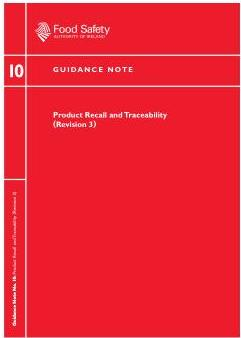

# Guidance Note 10

Outlines the legal requirements for the traceability of food and recall/withdrawal of unsafe food within the meaning of Regulation (EC) No. 178/2002

Guidance is also provided on what is considered best practice for the development of traceability systems and management of food recalls or withdrawals, where the legislation has been non-prescriptive.

