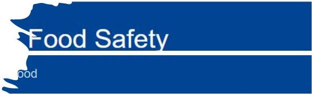

# Food Labelling Information System (FLIS)

NEW: The European Commission has created a new food labelling information system which provides a “user-friendly” IT solution for food businesses. Here is the link to the FLIS.

# European Commission

# Food Safety

## ABELLING AND NUTRITION

- Labelling legislation
- Labelling Information System
- and Health Claims

## Food Labelling Info

The Food Labelling Information System provides users to select the food and automatically access 23 EU languages. The system also provides guidance documents.