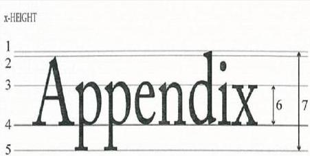

# Legibility &amp; Font Size

## LARGER LABELS:
- X-height ≥ 1.2mm

## SMALLER LABELS:
- If the largest surface area &lt; 80cm² ≥ 0.9mm

Legend

|  1 | Ascender line  |
| --- | --- |
|  2 | Cap line  |
|  3 | Mean line  |