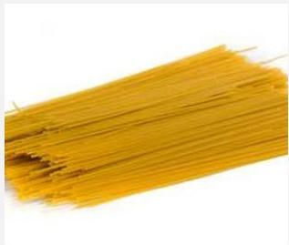
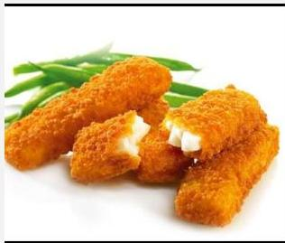

## B) The Customary Name

☐ In the absence of a legal name, a name customary in the Member State where the product is sold (to the final consumer) may be used
☐ Customary name is the name accepted by consumers without needing further explanation e.g. spaghetti, muesli, fish fingers
☐ Description of product may be needed to avoid confusion