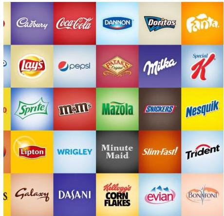

# D) Trade Marks or Brand Names

☐ Use of a trade mark or brand name is permitted in addition to the name of the food

☐ Such names cannot appear instead of the legal name or customary name, as it does not provide sufficient information for the consumer

