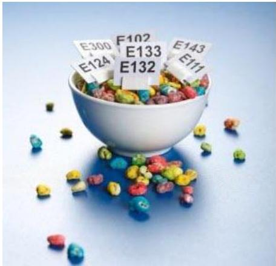

# Additives

☐ Food additives are substances added intentionally to foodstuffs to perform certain technological functions, for example to colour, to sweeten or to preserve.
☐ Only those additives that are on the list of authorised food additives may be used (Regulation (EC) No 1333/2008)

- Labelling of additives:
1. Category of food additive (see next slide)
2. Its specific name or it's designated E number
- Example: Antioxidant: Ascorbic Acid or Antioxidant: E300

