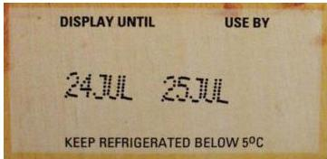

# Date Declaration

Use by – day, month, optionally year

Best before – short or long shelf life

1. &lt; 3 months: Day, Month e.g. Best Before: 5th May
2. 3-18 months: End Month, Year e.g. Best before: End August, 2008
3. &gt; 18 months: End Year e.g. Best before: End 2010

Reference to where the date can be given on the label – see Lid

