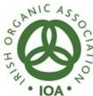
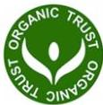

# Organic Certification Bodies

- The Organic Certification Bodies (OCBs) provide an inspection and certification service for all Organic Production Units in Ireland. They have been designated and are regulated by the Organic Unit of the Department of Agriculture, Food and the Marine (DAFM), and are responsible for upholding the Organic standards as defined by the EU.

IOA (Irish Organic Association)
Unit 13, Inish Carraig, Golden Island, Athlone, Co. Westmeath.
Tel: 090 6433680 | Email: info@irishoa.ie | Web: Irish Organic Association

Organic Trust
Office A1, Town Centre House, Naas Town Centre, Dublin Road, Naas, Co Kildare.
Tel: 045 882377 | Email: info@organictrust.ie | Web: Organic Trust