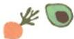

# Sustainable Cookbook &amp; Recipe Competition

- TU Dublin's Healthy Campus is once again collaborating with the School of Biological, Health and Sports Sciences in the creation of Volume 3 of the TU Dublin Sustainable Cookbook. Submissions are invited for recipes that are healthy, sustainable, quick, easy, and budget-friendly. There are great prizes to be won, and this is a great opportunity to feature your culinary flair. Closing date for submissions 27 February.

- Submit your recipe here

# TU Dublin Healthy Campus Sustainable Cookbook

Recipe Competition