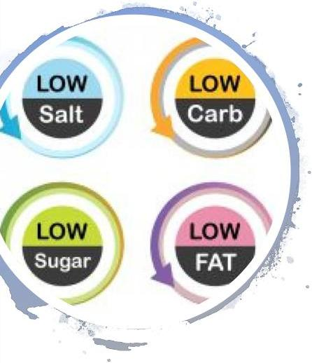

# List of Nutrition Claims

Annex of Regulation 1924/2006 (as amended) lists the permitted nutrition claims with their conditions of use (see handout).

This list is also on the Community Register of claims on the European Commission website here.

Note: Nutrition claims are only permitted if they are listed in the Annex of Regulation (EC) No 1924/2006, last amended in 2012.