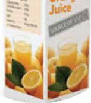
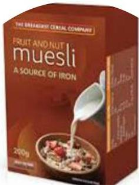

# "Source of" Claims

- Source of Vitamin C
- Source of Iron

For solid and liquid products* to claim ‘source of’, there must be at least 15% of the RI in 100g/100ml* For beverages to claim ‘source of’, there must be at least 7.5% of the RI per 100ml*

