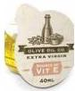
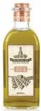

# Source of Vitamin E
## Per 100g and per portion

For all products (solids, liquids &amp; beverages) in single-serve portion packs, to claim ‘source of’ there must be at least 15% of the RI in the pack

