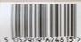
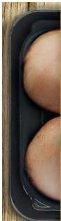
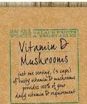
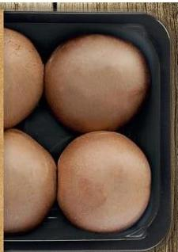

# High in Vitamin D

## TESCO Chestnut Mushrooms

4-5 tasty mushrooms provide 100% of your recommended daily intake of Vitamin D for healthy bones and teeth.

5 032909 824813

## 250g E

Wet/Blow-Typical values: 200g or mild. Energy 20kJ/8kcal. Fat 0.2g (of which saturated: 0.1g). Carbohydrate 0.3g (of which sugars: 0.3g). Fibre 0.7g. Protein 1.0g. Salt 0.01g.

Vitamin D (log 100% WEV). Pack contains 2 servings.

These mushrooms have been given light, which they absorb in the same way as our skin, to naturally increase their Vitamin D content.

STORE IN THE FRIDGE. DO NOT FEEL. SINCE OR WERE BEFORE USE, NO NEED TO TAKE PACKED FOR TESCO STORES LTD.

WELKYE GARDEN CITY, ALF. USA, U.S. © TESCO 2014

