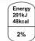

EXTRA INFORMATION

Extra information can be added to the mandatory declaration in the form of per portion or consumption unit and/or % RI

Example of per portion/per consumption unit

|  Typical values | Per 100g | Per portion * (2 biscuits) | Per biscuit**  |
| --- | --- | --- | --- |
|  Energy | 2065kJ | 640kJ | 320kJ  |
|   |  495kcal | 160kcal | 80kcal  |
|  Fat
of which saturates | 22.3g | 6.8g | 3.4g  |
|   |  10.0g | 3.0g | 1.5g  |
|  Carbohydrates
of which sugars | 64.6g | 20.0g | 10.0g  |
|   |  18.8g | 5.8g | 2.9g  |
|  Protein | 6.7g | 2.0g | 1.0g  |
|  Salt | 1.0g | 0.4g | 0.2g  |

*This pack contains 10 portions
**This pack contains 20 biscuits

Example of %RI per 100g

|  Typical values | Per 100g | % RI per 100g  |
| --- | --- | --- |
|  Energy | 823kJ
195kcal | 10%  |
|  Fat
of which saturates | 2.6g
0.3g | 4%
2%  |
|  Carbohydrates
of which sugars | 37.5g
1.6g | 14%
2%  |
|  Protein | 4.5g | 9%  |
|  Salt | 0.54g | 9%  |

Reference intake of average adult (8400kJ/2000kcal)

## Some mandatory nutrients can be voluntarily repeated on the front of pack (FoP)

Examples of FoP information

### Energy only

Each tablespoon (15g) contains

Typical values per 100g: Energy 1338kJ/323kcal

### Energy +4

Each pack (400g) contains

|  Energy
2032kJ
484kcal | Fat
19.6g | Saturates
9.0g | Sugars
4.0g | Salt
2.0g  |
| --- | --- | --- | --- | --- |
|  24% | 28% | 45% | 4% | 33%  |

Typical values (as sold) per 100g: Energy 508kJ/121kcal

## The Rules for Per Portion/Consumption

- This information can be provided as well of but not instead of per 100g/ml
- The FBO is responsible for deciding the size of a portion/consumption unit
- If an FBO chooses to provide nutrition information per portion, the pack must give a clear indication of the portion size and the number of portions in the pack
- If an FBO chooses to provide nutrition information per consumption unit, the pack must give a clear indication of the number of units in the pack

## The Rules for %RI

- %RIs can be given per 100g/ml, per portion/consumption unit or both
- If %RIs are given for the mandatory nutrients they must be based on the reference intakes in Annex XIII - Part B
- If %RIs are given for the mandatory nutrients, the statement "reference intake of average adult (8400kJ/2000kcal)" must appear in close proximity

## The Rules for FoP

- FoP nutrition information can be declared as energy only or energy plus fat, saturates, sugar and salt (energy + 4)
- Energy must be always declared as kJ/kcal per 100g/ml and may also be given per portion
- Fat, saturates, sugar and salt can be declared per portion only, provided that the portion size and number of portions in the pack are clearly indicated and understandable to the consumer
- The information can also be declared as %RI per 100g/ml or per portion (the statement "reference intake of an average adult (8400kJ/2000kcal)" must appear when declared per 100g)
- Nutrition information repeated on the FoP does not have to be in the same format as in the main declaration