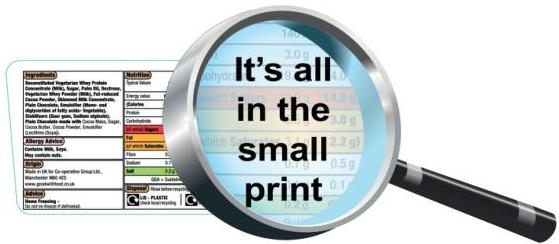

What is "Food Information"?

- Article 2.2(a)
- "... information concerning a food and made available to the final consumer by means of a label, other accompanying material, or any other means including modern technology tools or verbal communication "