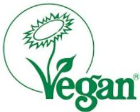

# The Vegan Society Trademark

- "We register any company that produces vegan-friendly products. We aim to make the Vegan Trademark accessible to everyone whose products fit our specific criteria. This includes products containing no animal ingredients, vegan processing aids used in manufacturing, and ingredients that have never been tested on animals on behalf of the manufacturer."
- This is voluntary but if you do use it, you must have a license.