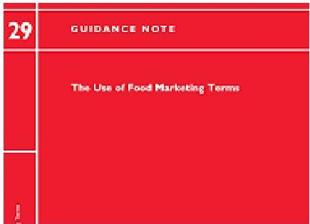

# Marketing Terms (Voluntary)

Food business operators should ensure that the use of certain marketing terms are consistent with the specific provisions laid by FSAI Guidance Document 29

1. Artisan
2. Farmhouse
3. Traditional
4. Natural

https://www.fsai.ie/news_centre/press_releases/marketing_terms_14052015.html

