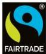

# THE FAIRTRADE MINIMUM PRICE

For most Fairtrade goods there is a Fairtrade minimum price which is set to cover the cost of sustainable production for that product in that region. If the market price for that product is higher than our minimum price, then farmers and workers receive the market price.

