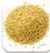
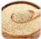
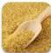
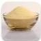
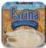
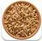
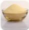
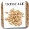
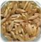
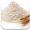

Grains Containing Gluten

Barley

Rye

Bulgur

Semolina

(Couscous, Cream of Wheat, Pasta, Orzo)

Farina

(Cream of Wheat)

Spelt

Durum Wheat

(Pasta, Semolina)

Triticale

Kamut

(Khorasan wheat or Oriental wheat)

Wheat

(All purpose flour, Enriched flour, Cake flour, Whole-wheat flour, Wheat berries)

Farro

NOTE: GATS are naturally gluten-free but may be contaminated with gluten during processing.