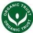

# Labelling of Organic Food Products Guidance documents

Irish Organic Association

Organic Trust

LABELLING GUIDELINES

App 87a/08
Issued By: M Cairney
Issue Date: 19-11-2024

Organic Trust CLG
Organic Labelling – Guideline Document

IMPLEMENTATION OF DELEGATED REGULATION (EU) 642/2021 laying down detailed rules for the implementation of Council Regulation (EU) No 848/2018, as regards the organic production logo of the European Union

The rules on labelling for organic food are set out in Articles 30 to 33 of EU 848/2018 and Article 3 to 2 of EU 2021 (L6).