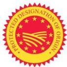
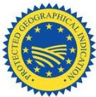
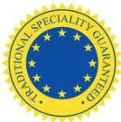

# PGO, PGI AND TSG

An EU system which seeks to protect the geographical names of certain foodstuffs (which have a tangible link to the geographical area after which they are named). The scope of the schemes is strictly limited to agricultural products and foodstuffs where a link exists between the characteristics of a product or foodstuff and the defined geographical area.

1. PDO (Protected Designation of Origin) for products with a strong link to the defined geographical area where they are produced
2. PGI (Protected Geographical Indication) for agricultural products and foods linked to a geographical area where at least one production step has taken place.
3. Traditional Specialities Guaranteed (TSG) emphasise traditional composition and mode of production of products (proven usage on the domestic market for at least 25 years).

Ref: Council Regulation 1151/2012 and S.I. No. 296 of 2015.

The Department of Agriculture, Food and the Marine (DAFM) and the Health Service Executive (HSE) are the inspection bodies for this EU quality scheme in Ireland.