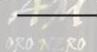
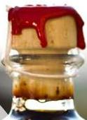
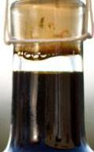
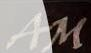
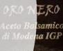
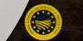
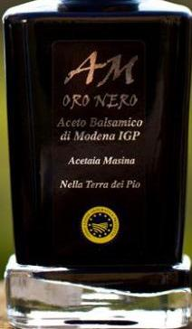

Food Fraud. Italian investigators have identified a huge food fraud scandal involving balsamic vinegar. Grape must and wine products worth €15m (£12.9m), as well as numerous documents showing how provenance and authenticity credentials were falsified, were seized, according to reports in the

See The Guardian article: https://www.theguardian.com/world/2019/mar/09/grapes-of-wrath-italian-police-target-fake-balsamic-vinegar

