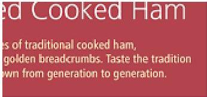
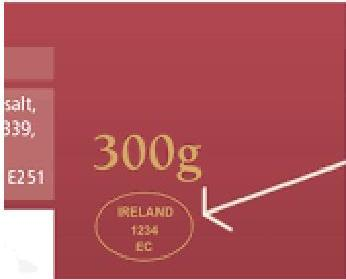

Example of an Identification Mark

# Health Mark

Health Mark must be an oval mark at least 6.5cm wide by 4.5cm high, bearing the following information in perfectly legible characters:

1. Name of country in which establishment located, capitals, two letter code in accordance with ISO standard e.g. IE
2. The mark must indicate the approval number of the slaughter house; and
3. When applied in a slaughterhouse within the Community, the mark must include the abbreviation EC or similar
4. Mark may be applied directly to product, the wrapping or the packaging, or be printed on a label affixed to the product, the wrapping or packaging.

**Must be legible**

**Must be irremovable tag or resistant material**

Ref: FSAI and DAFM websites for more information