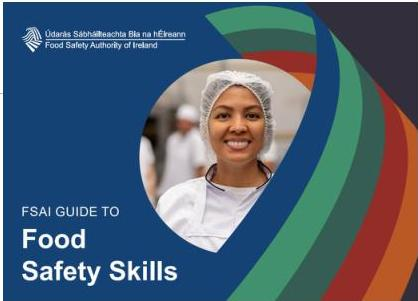

# Contents

|  Scope | 5  |
| --- | --- |
|  Structure | 6  |
|  How Level 1 and Level 2 food safety skills are presented | 9  |
|  How Level 3 food safety skills are presented | 10  |
|  Subtotal |   |
|  Food Safety Training | 11  |
|  Introduction | 12  |
|  Instruction and supervision | 12  |
|  How to develop a training course using this guide | 12  |
|  Training methodology | 12  |
|  Training content/materials | 13  |
|  Training plan | 14  |
|  Training record | 15  |
|  Implementation and assessing the effectiveness of training | 16  |
|  Refresher training | 17  |
|  Inspection of training | 17  |
|  SubTotal |   |
|  Food Safety Culture | 18  |
|  SubTotal |   |
|  Level 1 (Stage 1) Induction Food Safety Skills | 25  |
|  Level 1 (Stage 2) Induction Food Safety Skills | 37  |

# FSAI Food Safety Training Standard updated