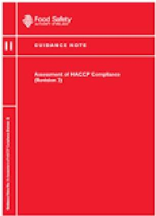

# Assessment of HACCP compliance

- FSAI Guidance Note 11
- The purpose of this guidance document is to provide a consistent approach within the environmental health service towards the assessment of compliance with the HACCP requirement.