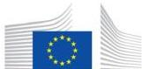

# See Factsheet on Brightspace

European Commission

# Biodiversity:
deforestation-free products on the EU market

"Trees and forests are true allies in the fight against the climate and biodiversity crises. Trees purify our air, cool our cities, and take up CO2. We need to be their allies too. Our deforestation regulation

18 November 2021
#EUGreenDeal

"We must protect biodiversity and fight climate change not only in the EU, but globally, and our consumption should not contribute to global deforestation which is a major cause of biodiversity loss and greenhouse gas emissions. Thus we present the

European Commission