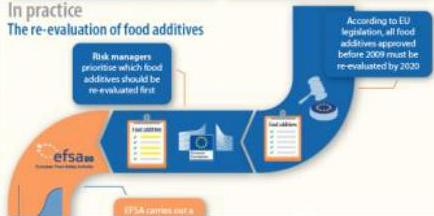

# Risk Assessment vs Risk Management

What's the difference?

## Risk Assessor

EFSA is the risk assessor, evaluating risks associated with the food chain. EFSA doesn't have scientific laboratories, nor does it generate new scientific research. It collects and analyses existing research and data and provides scientific advice to support decision-making by risk managers.

## Risk Manager

Risk managers are the European Commission, Member State authorities and the European Parliament. They are responsible for making decisions or setting legislation about food safety.

# Risk Assessment

‘risk’ means a function of the probability of an adverse health effect and the severity of that effect, consequential to a hazard

‘risk assessment’ means a scientifically based process

consisting of four steps:

1. hazard identification,
2. hazard characterisation,
3. exposure assessment and
4. risk characterisation