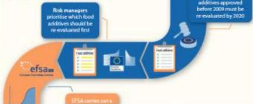

# Risk Assessment vs Risk Management

What's the difference?

## Risk Assessor

EFSA is the risk assessor, evaluating risks associated with the food chain. EFSA doesn't have scientific laboratories, nor does it generate new scientific research. It collects and analyses existing research and data and provides scientific advice to support decision-making by risk managers.

## Risk Manager

Risk managers are the European Commission, Member State authorities and the European Parliament. They are responsible for making decisions or setting legislation about food safety.

## In practice

The re-evaluation of food additives

# Risk Management

‘risk management’ means the process, distinct from risk assessment, of weighing policy alternatives in consultation with interested parties, considering risk assessment and other legitimate factors, and, if need be, selecting appropriate prevention and control options;