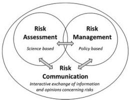

# Risk Communication

'risk communication' means the interactive exchange of information and opinions throughout the risk analysis process as regards

- hazards and risks,
- risk-related factors and
- risk perceptions,

among

- risk assessors,
- risk managers,
- consumers,
- feed and food businesses,
- the academic community and
- other interested parties,

including the explanation of risk assessment findings and the basis of risk management decisions;

EFSA Video link: https://www.youtube.com/watch?v=3IHGshTDMCw&amp;list=PL7786F5984D1D92AE