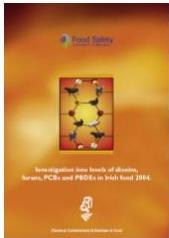
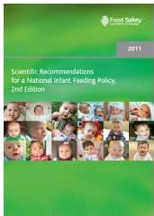

# Risk Communication in Ireland, FSAI

- Hazard Identification
- Hazard Characterisation
- Qualitative Exposure Assessment
- Qualitative Risk Characterisation
- Recommendations
- Risk Management Options
- Research Gaps

Qualitative Risk Assessment : Expert Opinion - Scientific Committee