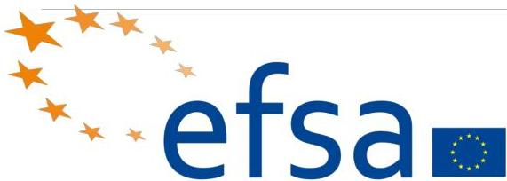

# EFSA: European Food Safety Authority

- Independent EU agency, funded by EU but operates separately from European Commission, European Parliament and Member States
- Located in Parma, Italy
- Managed by its Executive Director (who is answerable to the EFSA's management Board)

http://www.efsa.europa.eu/en/about/governance