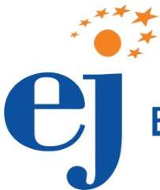

# EFSA Journal

EFSA give independent scientific advice on risk assessment on the area of food and feed safety, nutrition, animal health and welfare, farm protection and plant health. All of its scientific outputs are published in its scientific journal. This is a free, online, open access scientific journal available on its website. EFSA journal available monthly.

https://www.youtube.com/watch?v=6Y24z2mQ0Xg&amp;list=PLGDvgn1aAEEYFeahclGs7KEo9lzB9_w2k