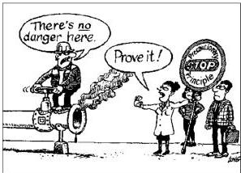

# Article 7: Precautionary Principle

"... where, following an assessment of available information, the possibility of harmful effects on health is identified but scientific uncertainty persists, ... ... provisional risk management measures necessary to ensure the high level of health protection chosen in the Community may be adopted, pending further scientific information for a more comprehensive risk assessment ..."

It allows policy makers to justify discretionary decisions (or taking a particular course of action) in situations where there is the possibility of harm when scientific knowledge or proof on the matter is absent.

EU Communication on the Precautionary Principle here.

## Examples of Precautionary Principle Targets

- **Environment**
- Global warming/cooling
- Loss of species
- Population explosion
- **Energy**
- Nuclear power plants
- Fracking
- **Food safety**
- Genetically modified crops
- Mad cow disease
- Mercury in fish
- Chlorinated water
- **Chemicals**
- DDT and other pesticides
- BPA
- **Health**
- Vaccinations
- New drugs
- **Technology**
- Cell phones and towers

