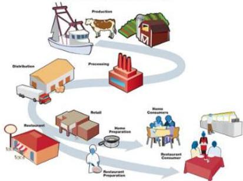

# Traceability: Who must comply?

## Yes

1. Food business operators at all stages of the chain
2. Brokers (regardless of whether they take physical possession)
3. Transporters and storage operators
4. Importers

## No

1. 3rd country establishments
2. Exporters outside of the EU