<!-- Source: 00_resources/2026 Food Law slides — reflowed.md -->
<!-- Generated from Table of Contents entry 6. -->

# Lecture 6 — Week 8 (18 March 2026): The Hygiene Package & HACCP (Reg 852/2004)

**Topics:** Hygiene Package overview · Reg 852/2004 · HACCP principles · HACCP flow chart · HACCP decision tree · GHP · registration · inspection · risk categorisation · Annex I/II

**Slides:** 349–424 (76 slides)

## Slide 349

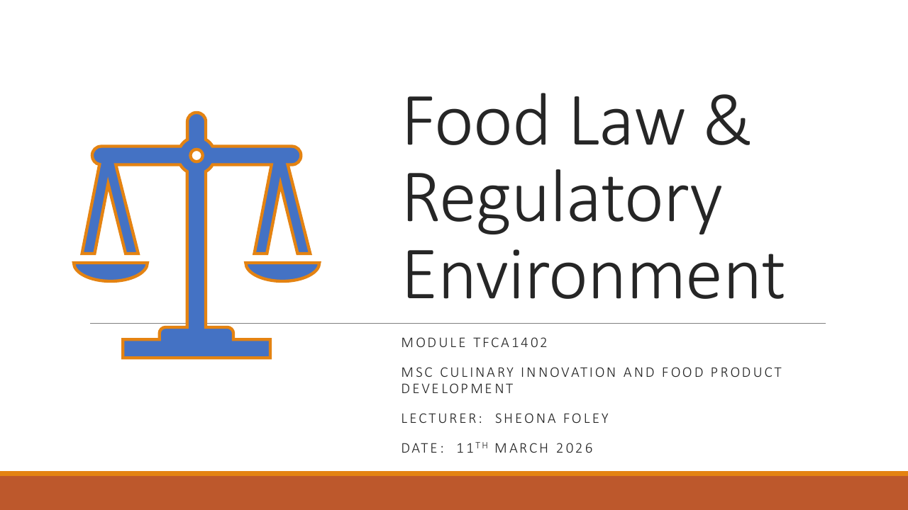

### Food Law & Regulatory Environment — *Course Title Slide*

*(Course title slide — see image for module / lecturer / date metadata.)*

Raw text:

```
Food Law &
Regulatory
Environment

MODULE   TFCA1402

MSC   CULINARY   INNOVAT ION   AND   FOOD   PRODUCT
DEVELOPMENT

LECTURER:SHEONA   FOLEY

DAT E:11THMARCH2026
```

## Slide 350

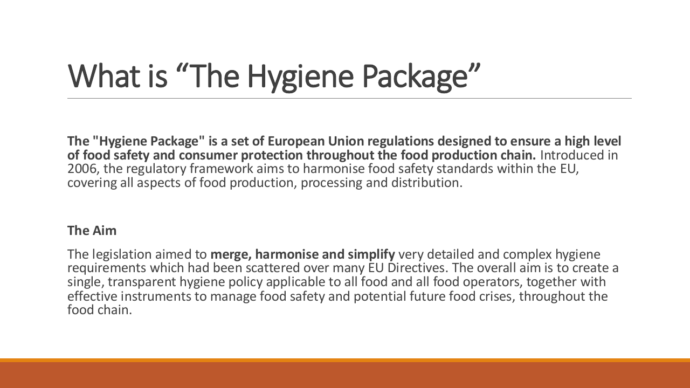

### What is “The Hygiene Package”

The "Hygiene Package" is a set of European Union regulations designed to ensure a high level
- f food safety and consumer protection throughout the food production chain. Introduced in 2006, the regulatory framework aims to harmonise food safety standards within the EU, covering all aspects of food production, processing and distribution.

The Aim

The legislation aimed to merge, harmonise and simplify very detailed and complex hygiene
requirements which had been scattered over many EU Directives. The overall aim is to create a
single, transparent hygiene policy applicable to all food and all food operators, together with
effective instruments to manage food safety and potential future food crises, throughout the
food chain.

## Slide 351

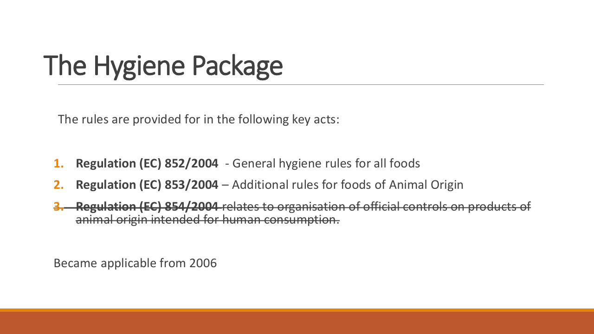

### The Hygiene Package Became applicable from 2006

The rules are provided for in the following key acts:

1. Regulation (EC) 852/2004  - General hygiene rules for all foods

2. Regulation (EC) 853/2004 – Additional rules for foods of Animal Origin

3. Regulation (EC) 854/2004 relates to organisation of official controls on products of

animal origin intended for human consumption.

## Slide 352

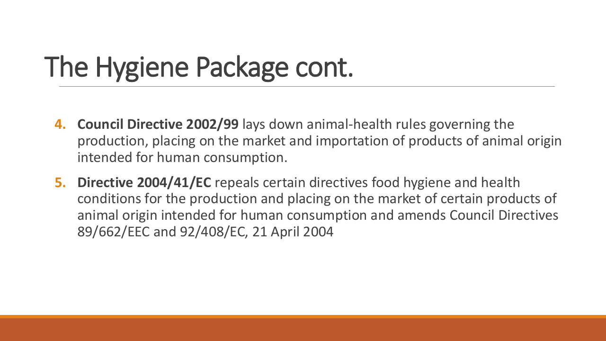

### The Hygiene Package cont.

4. Council Directive 2002/99 lays down animal-health rules governing the

production, placing on the market and importation of products of animal origin
intended for human consumption.

5. Directive 2004/41/EC repeals certain directives food hygiene and health

conditions for the production and placing on the market of certain products of
animal origin intended for human consumption and amends Council Directives
89/662/EEC and 92/408/EC, 21 April 2004

## Slide 353

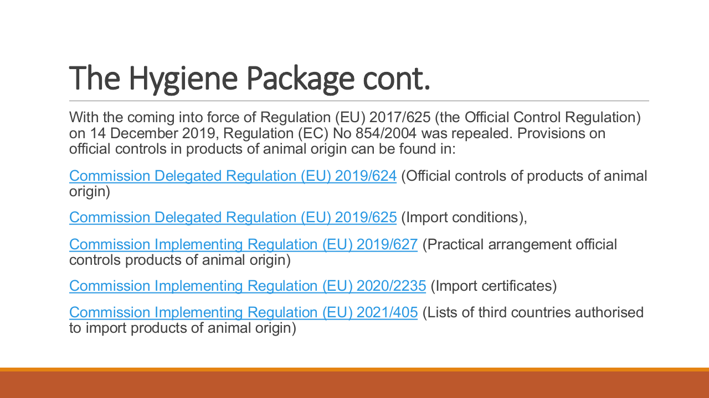

### The Hygiene Package cont.

With the coming into force of Regulation (EU) 2017/625 (the Official Control Regulation)
- n 14 December 2019, Regulation (EC) No 854/2004 was repealed. Provisions on
- fficial controls in products of animal origin can be found in:

Commission Delegated Regulation (EU) 2019/624 (Official controls of products of animal
- rigin)

Commission Delegated Regulation (EU) 2019/625 (Import conditions),

Commission Implementing Regulation (EU) 2019/627 (Practical arrangement official
controls products of animal origin)

Commission Implementing Regulation (EU) 2020/2235 (Import certificates)

Commission Implementing Regulation (EU) 2021/405 (Lists of third countries authorised
to import products of animal origin)

## Slide 354

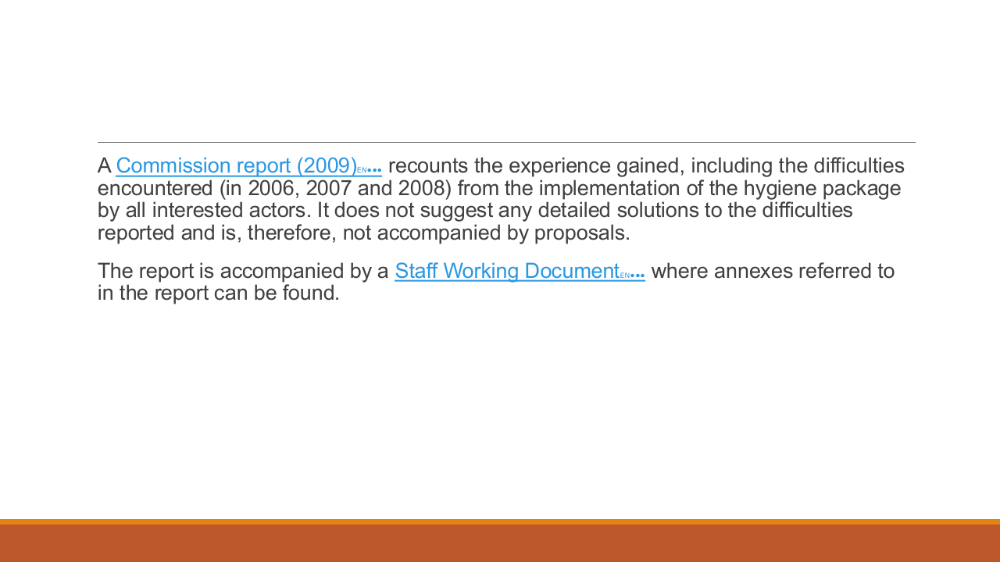

### Commission Report (2009) on the Hygiene Package

A Commission report (2009) recounts the experience gained, including the difficulties encountered (in 2006, 2007 and 2008) from the implementation of the hygiene package by all interested actors. It does not suggest any detailed solutions to the difficulties reported and is, therefore, not accompanied by proposals.

The report is accompanied by a Staff Working Document where annexes referred to in the report can be found.

## Slide 355

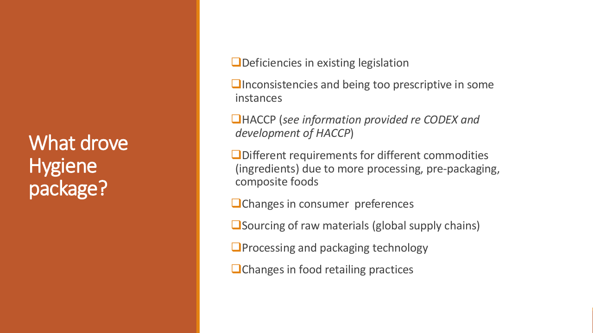

### What Drove the Hygiene Package?

- Deficiencies in existing legislation
- Inconsistencies and being too prescriptive in some instances
- HACCP *(see information provided re CODEX and development of HACCP)*
- Different requirements for different commodities (ingredients) due to more processing, pre-packaging, composite foods
- Changes in consumer preferences
- Sourcing of raw materials (global supply chains)
- Processing and packaging technology
- Changes in food retailing practices

## Slide 356

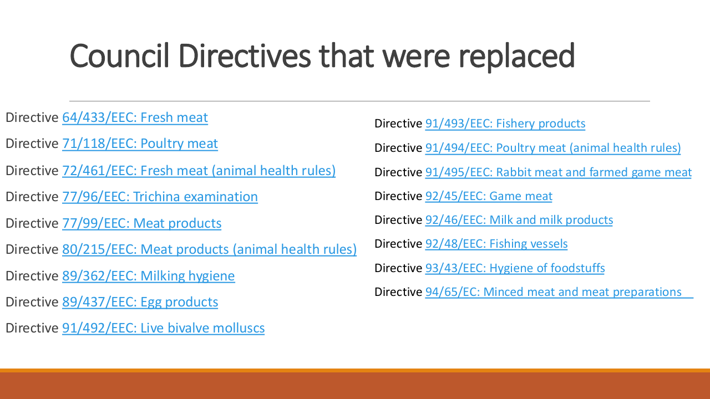

### Council Directives that were replaced

Directive 64/433/EEC: Fresh meat                            Directive 91/493/EEC: Fishery products
Directive 71/118/EEC: Poultry meat                          Directive 91/494/EEC: Poultry meat (animal health rules)
Directive 72/461/EEC: Fresh meat (animal health rules)      Directive 91/495/EEC: Rabbit meat and farmed game meat
Directive 77/96/EEC: Trichina examination                   Directive 92/45/EEC: Game meat

Directive 77/99/EEC: Meat products                          Directive 92/46/EEC: Milk and milk products

Directive 80/215/EEC: Meat products (animal health rules)   Directive 92/48/EEC: Fishing vessels
                                                            Directive 93/43/EEC: Hygiene of foodstuffs
Directive 89/362/EEC: Milking hygiene
                                                            Directive 94/65/EC: Minced meat and meat preparations
Directive 89/437/EEC: Egg products
Directive 91/492/EEC: Live bivalve molluscs

## Slide 357

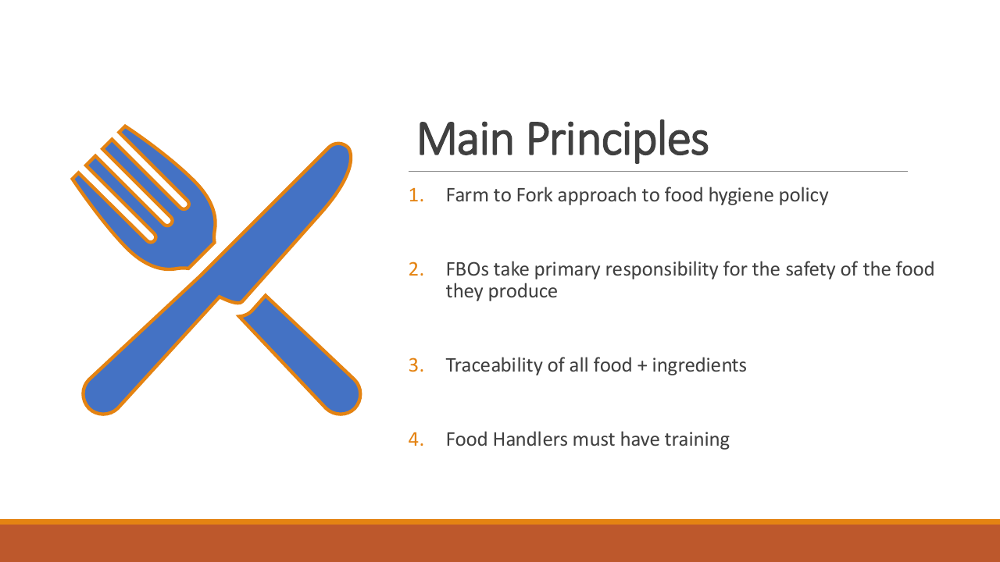

### Main Principles they produce

1.

Farm to Fork approach to food hygiene policy

2.

FBOs take primary responsibility for the safety of the food

3.

Traceability of all food + ingredients

4.

Food Handlers must have training

## Slide 358

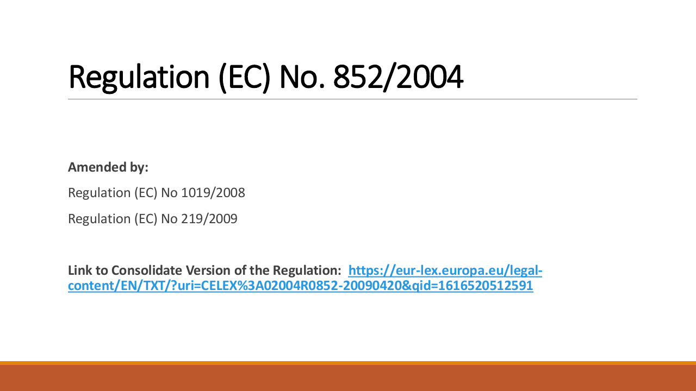

### Regulation (EC) No 1019/2008 Regulation (EC) No 219/2009

Regulation (EC) No. 852/2004

Amended by:

Link to Consolidate Version of the Regulation:  https://eur-lex.europa.eu/legal-
content/EN/TXT/?uri=CELEX%3A02004R0852-20090420&qid=1616520512591

## Slide 359


### Link to Eur-lex

https://eur-lex.europa.eu/homepage.html

## Slide 360

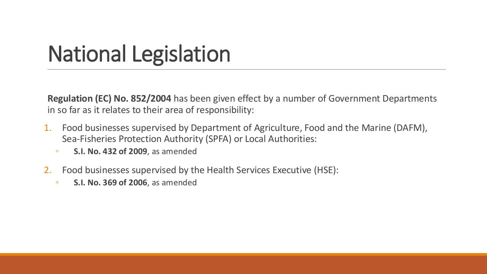

### National Legislation ◦ ◦

Regulation (EC) No. 852/2004 has been given effect by a number of Government Departments
in so far as it relates to their area of responsibility:

1.

2.

Food businesses supervised by Department of Agriculture, Food and the Marine (DAFM),
Sea-Fisheries Protection Authority (SPFA) or Local Authorities:

S.I. No. 432 of 2009, as amended

Food businesses supervised by the Health Services Executive (HSE):

S.I. No. 369 of 2006, as amended

## Slide 361

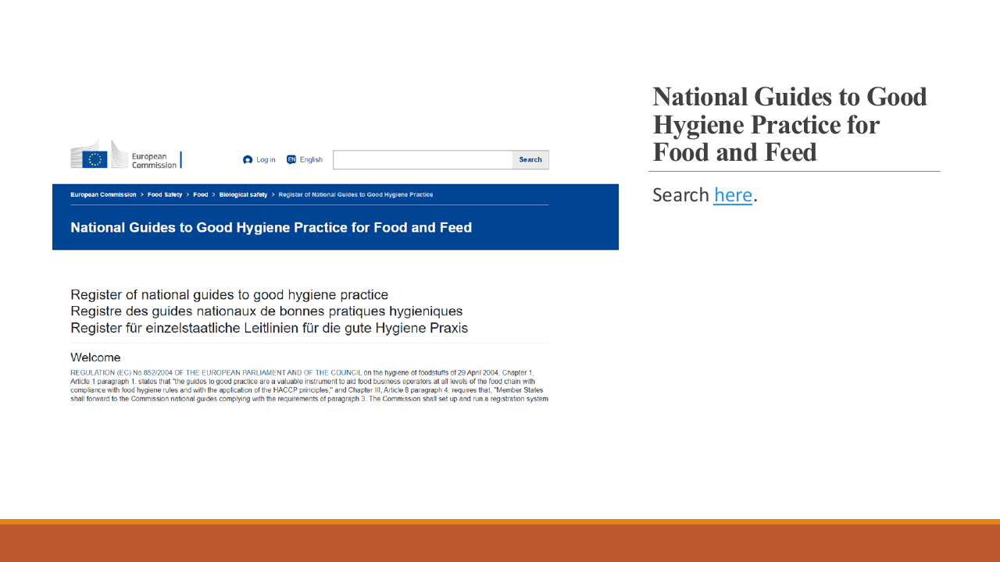

### National Guides to Good Hygiene Practice for Food and Feed

Register of national guides to good hygiene practice available on the European Commission website.

Search for your sector's guide on the Commission register.

## Slide 362

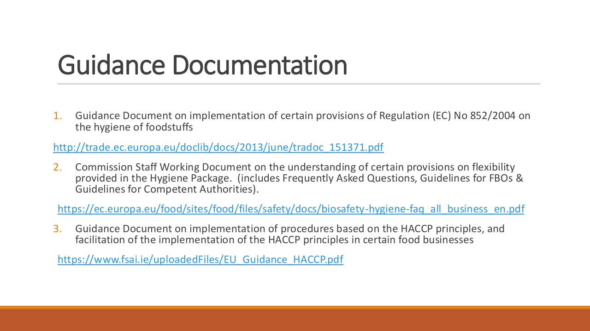

### Guidance Documentation the hygiene of foodstuffs

1. Guidance Document on implementation of certain provisions of Regulation (EC) No 852/2004 on

http://trade.ec.europa.eu/doclib/docs/2013/june/tradoc_151371.pdf

2.

Commission Staff Working Document on the understanding of certain provisions on flexibility
provided in the Hygiene Package.  (includes Frequently Asked Questions, Guidelines for FBOs &
Guidelines for Competent Authorities).

https://ec.europa.eu/food/sites/food/files/safety/docs/biosafety-hygiene-faq_all_business_en.pdf

3. Guidance Document on implementation of procedures based on the HACCP principles, and facilitation of the implementation of the HACCP principles in certain food businesses

https://www.fsai.ie/uploadedFiles/EU_Guidance_HACCP.pdf

## Slide 363

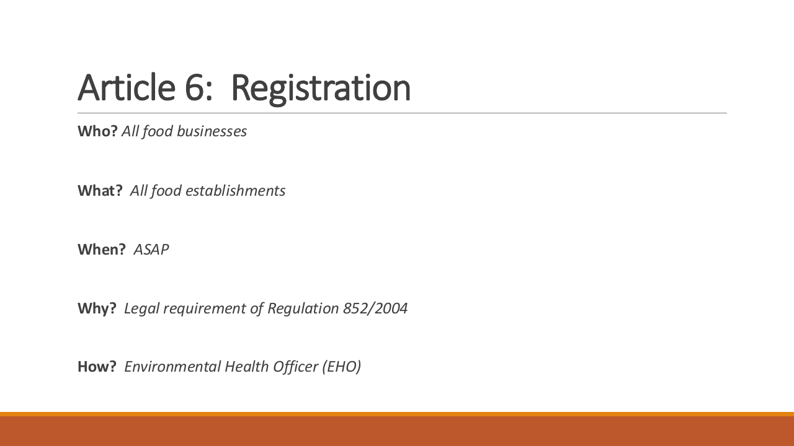

### Article 6:  Registration

Who? All food businesses

What?  All food establishments

When?  ASAP

Why?  Legal requirement of Regulation 852/2004

How?  Environmental Health Officer (EHO)

## Slide 364

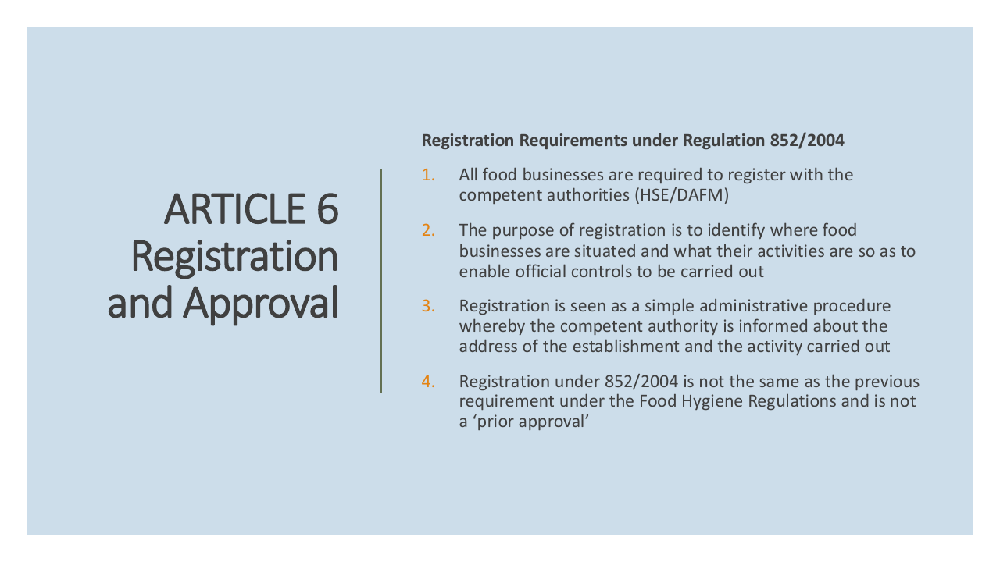

### Article 6: Registration and Approval

**Registration Requirements under Regulation 852/2004:**

1. All food businesses are required to register with the competent authorities (HSE/DAFM)
2. The purpose of registration is to identify where food businesses are situated and what their activities are so as to enable official controls to be carried out
3. Registration is seen as a simple administrative procedure whereby the competent authority is informed about the address of the establishment and the activity carried out
4. Registration under 852/2004 is not the same as the previous requirement under the Food Hygiene Regulations and is **not** a 'prior approval'

## Slide 365

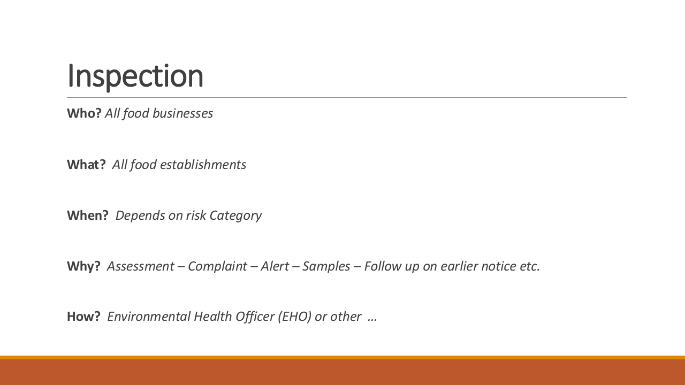

### Inspection

Who? All food businesses

What?  All food establishments

When?  Depends on risk Category

Why?  Assessment – Complaint – Alert – Samples – Follow up on earlier notice etc.

How?  Environmental Health Officer (EHO) or other  …

## Slide 366

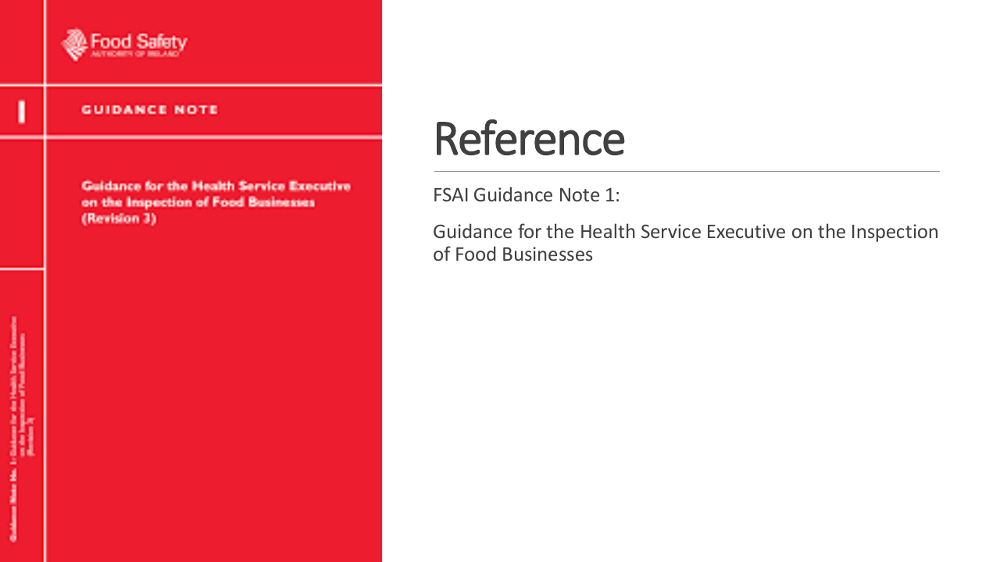

### Reference

FSAI Guidance Note 1:

Guidance for the Health Service Executive on the Inspection
- f Food Businesses

## Slide 367

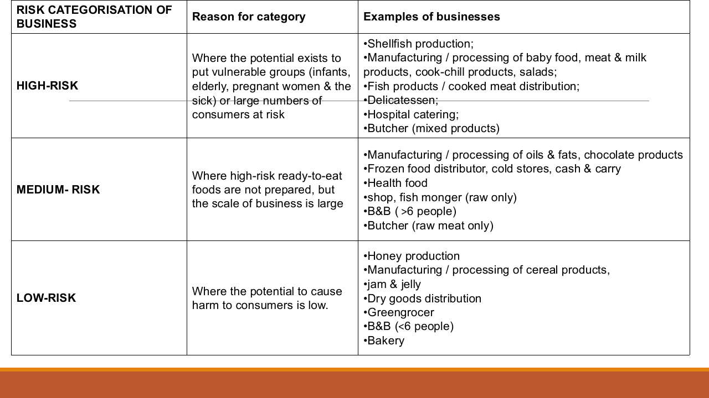

### RISK CATEGORISATION OF BUSINESS Where high-risk ready-to-eat

Reason for category               Examples of businesses
    - Shellfish production; Where the potential exists to     •Manufacturing / processing of baby food, meat & milk put vulnerable groups (infants,   products, cook-chill products, salads; HIGH-RISK                elderly, pregnant women & the     •Fish products / cooked meat distribution; sick) or large numbers of         •Delicatessen; consumers at risk                 •Hospital catering
    - Butcher (mixed products)

    - Manufacturing / processing of oils & fats, chocolate products
    - Frozen food distributor, cold stores, cash & carry
    - Health food MEDIUM- RISK             foods are not prepared, but
    - shop, fish monger (raw only) the scale of business is large
    - B&B ( >6 people)
    - Butcher (raw meat only)

    - Honey production
    - Manufacturing / processing of cereal products,
    - jam & jelly Where the potential to cause LOW-RISK                                                   •Dry goods distribution harm to consumers is low.
    - Greengrocer
    - B&B (<6 people)
    - Bakery

## Slide 368

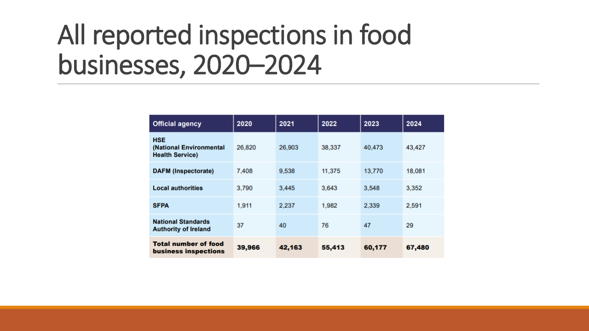

### All reported inspections in food businesses, 2020–2024

## Slide 369

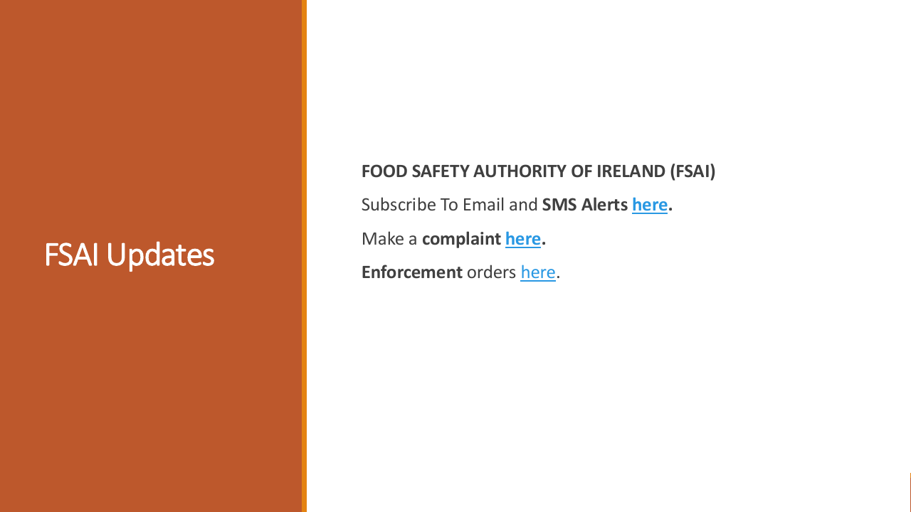

### FOOD SAFETY AUTHORITY OF IRELAND (FSAI)

Subscribe To Email and SMS Alerts here.
               Make a complaint here.
FSAI Updates   Enforcement orders here.

## Slide 370

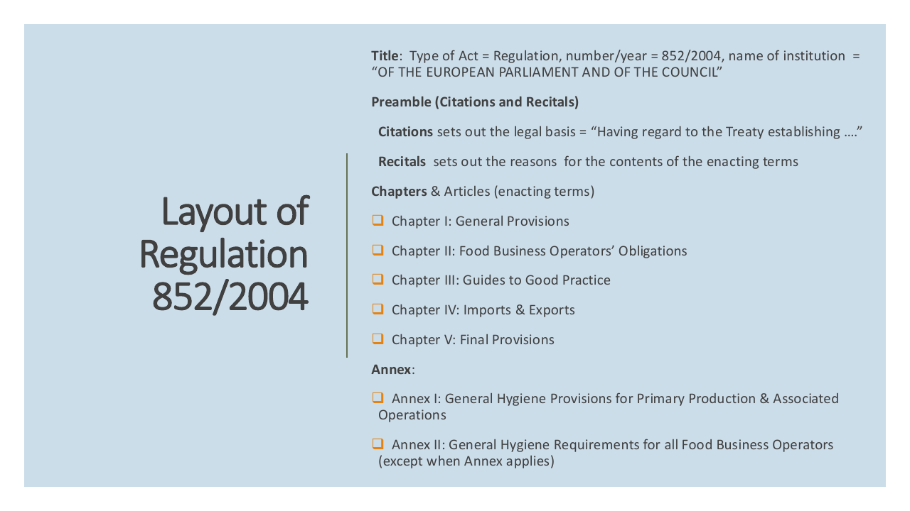

### Layout of Regulation 852/2004

**Title:** Type of Act = Regulation, number/year = 852/2004, institution = "OF THE EUROPEAN PARLIAMENT AND OF THE COUNCIL"

**Preamble (Citations and Recitals)**
- **Citations** — sets out the legal basis = "Having regard to the Treaty establishing …."
- **Recitals** — sets out the reasons for the contents of the enacting terms

**Chapters & Articles (enacting terms):**
- Chapter I: General Provisions
- Chapter II: Food Business Operators' Obligations
- Chapter III: Guides to Good Practice
- Chapter IV: Imports & Exports
- Chapter V: Final Provisions

**Annex:**
- Annex I: General Hygiene Provisions for Primary Production & Associated Operations
- Annex II: General Hygiene Requirements for all Food Business Operators (except when Annex I applies)

## Slide 371

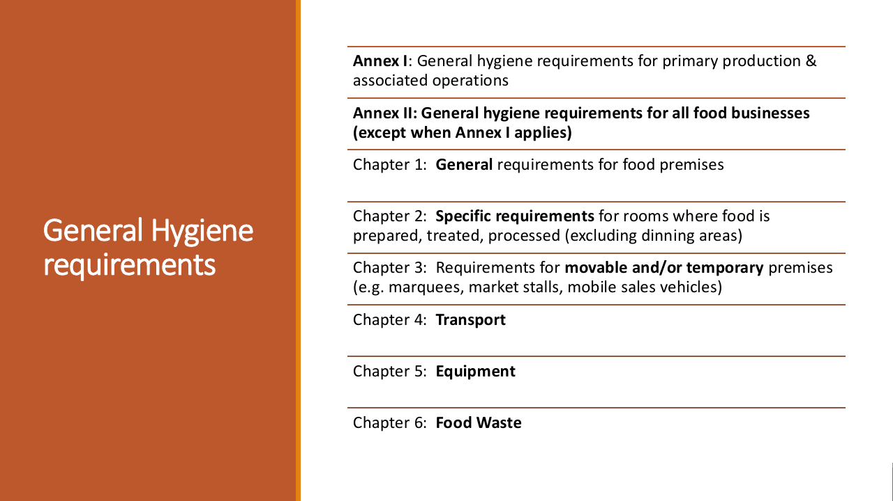

### Annex I: General hygiene requirements for primary production &

associated operations
                  Annex II: General hygiene requirements for all food businesses
                  (except when Annex I applies)
                  Chapter 1: General requirements for food premises

                  Chapter 2: Specific requirements for rooms where food is
General Hygiene   prepared, treated, processed (excluding dinning areas)
requirements      Chapter 3: Requirements for movable and/or temporary premises
                  (e.g. marquees, market stalls, mobile sales vehicles)
                  Chapter 4: Transport

                  Chapter 5: Equipment

                  Chapter 6: Food Waste

## Slide 372

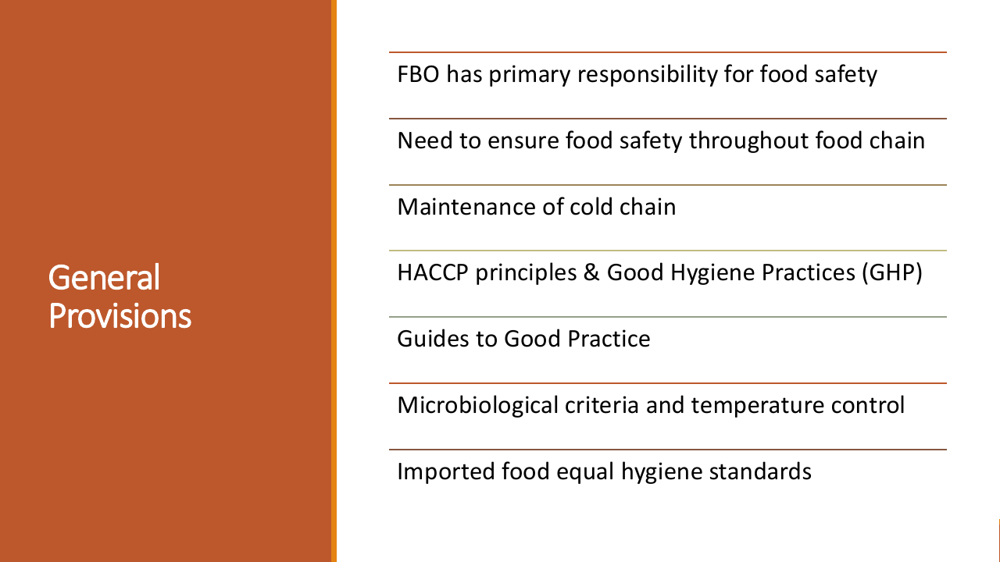

### Maintenance of cold chain Provisions Guides to Good Practice

FBO has primary responsibility for food safety

             Need to ensure food safety throughout food chain

General      HACCP principles & Good Hygiene Practices (GHP)

             Microbiological criteria and temperature control

             Imported food equal hygiene standards

## Slide 373

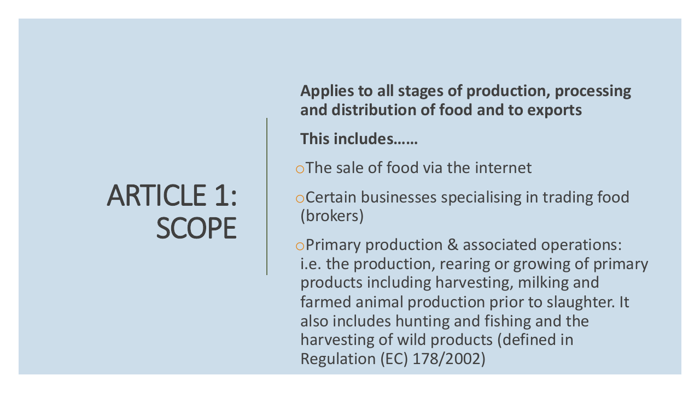

### Article 1: Scope

Applies to all stages of production, processing and distribution of food and to exports.

**This includes:**

- The sale of food via the internet
- Certain businesses specialising in trading food (brokers)
- Primary production & associated operations: i.e. the production, rearing or growing of primary products including harvesting, milking and farmed animal production prior to slaughter. It also includes hunting and fishing and the harvesting of wild products (defined in Regulation (EC) 178/2002)

## Slide 374

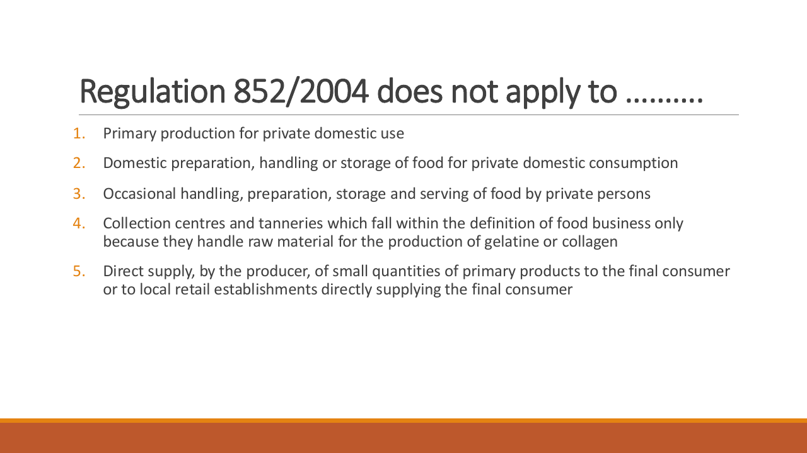

### Regulation 852/2004 does not apply to ……….

1. Primary production for private domestic use

2. Domestic preparation, handling or storage of food for private domestic consumption

3. Occasional handling, preparation, storage and serving of food by private persons

4. Collection centres and tanneries which fall within the definition of food business only

because they handle raw material for the production of gelatine or collagen

5. Direct supply, by the producer, of small quantities of primary products to the final consumer

- r to local retail establishments directly supplying the final consumer

## Slide 375

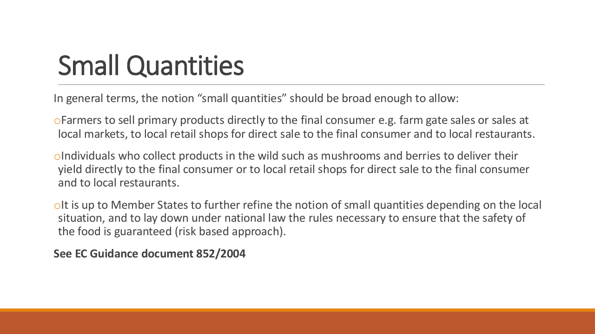

### Small Quantities

In general terms, the notion “small quantities” should be broad enough to allow:

- Farmers to sell primary products directly to the final consumer e.g. farm gate sales or sales at local markets, to local retail shops for direct sale to the final consumer and to local restaurants.

- Individuals who collect products in the wild such as mushrooms and berries to deliver their yield directly to the final consumer or to local retail shops for direct sale to the final consumer and to local restaurants.

- It is up to Member States to further refine the notion of small quantities depending on the local situation, and to lay down under national law the rules necessary to ensure that the safety of the food is guaranteed (risk based approach).

See EC Guidance document 852/2004

## Slide 376

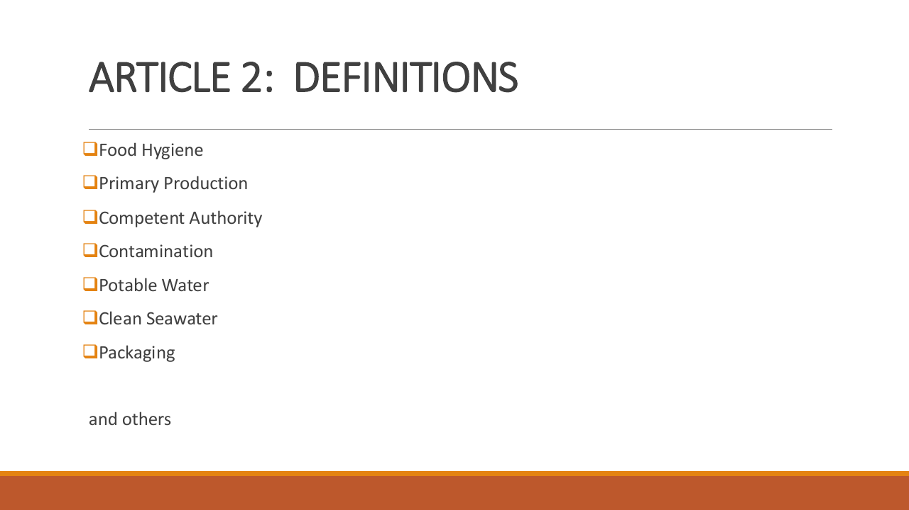

### ARTICLE 2:  DEFINITIONS

- Food Hygiene

- Primary Production

- Competent Authority

- Contamination

- Potable Water

- Clean Seawater

- Packaging

and others

## Slide 377

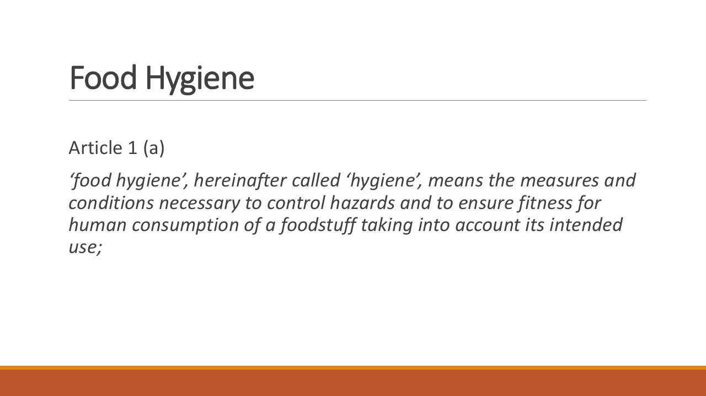

### Food Hygiene Article 1 (a)

‘food hygiene’, hereinafter called ‘hygiene’, means the measures and
conditions necessary to control hazards and to ensure fitness for
human consumption of a foodstuff taking into account its intended
use;

## Slide 378

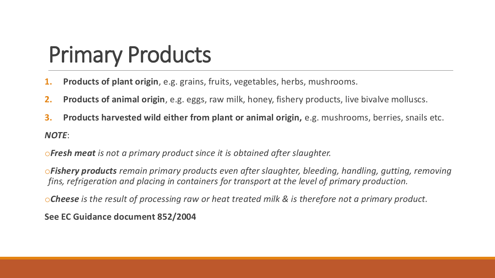

### Primary Products

1.

2.

3.

Products of plant origin, e.g. grains, fruits, vegetables, herbs, mushrooms.

Products of animal origin, e.g. eggs, raw milk, honey, fishery products, live bivalve molluscs.

Products harvested wild either from plant or animal origin, e.g. mushrooms, berries, snails etc.

NOTE:

- Fresh meat is not a primary product since it is obtained after slaughter.

- Fishery products remain primary products even after slaughter, bleeding, handling, gutting, removing fins, refrigeration and placing in containers for transport at the level of primary production.

- Cheese is the result of processing raw or heat treated milk & is therefore not a primary product.

See EC Guidance document 852/2004

## Slide 379

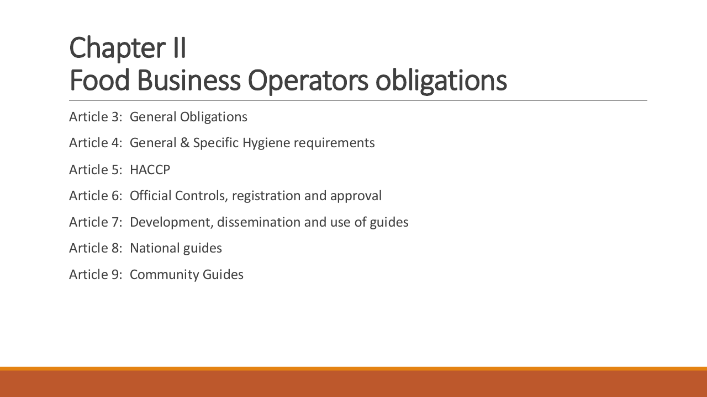

### Chapter II Food Business Operators obligations

Article 3:  General Obligations

Article 4:  General & Specific Hygiene requirements

Article 5:  HACCP

Article 6:  Official Controls, registration and approval

Article 7:  Development, dissemination and use of guides

Article 8:  National guides

Article 9:  Community Guides

## Slide 380

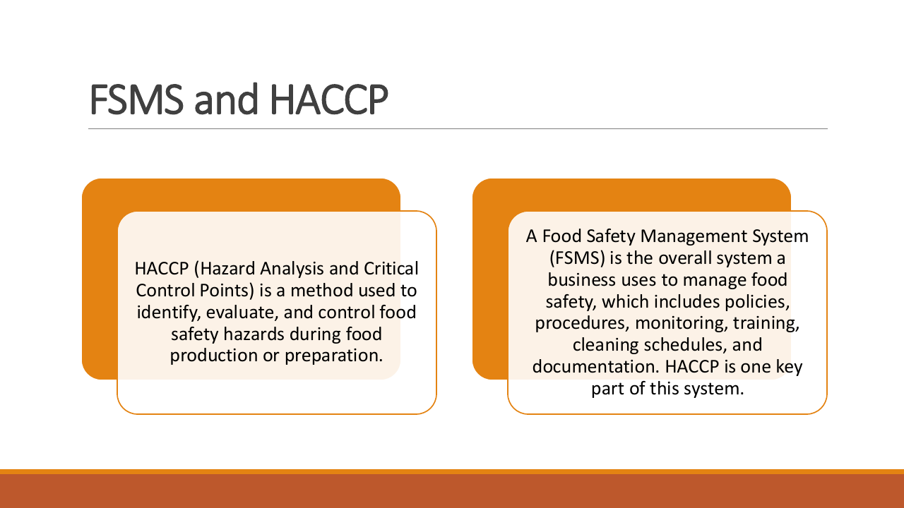

### FSMS and HACCP safety hazards during food

A Food Safety Management System
                                            (FSMS) is the overall system a
  HACCP (Hazard Analysis and Critical
                                            business uses to manage food
  Control Points) is a method used to
                                           safety, which includes policies,
  identify, evaluate, and control food
                                          procedures, monitoring, training,
                                               cleaning schedules, and
      production or preparation.
                                          documentation. HACCP is one key
                                                  part of this system.

## Slide 381

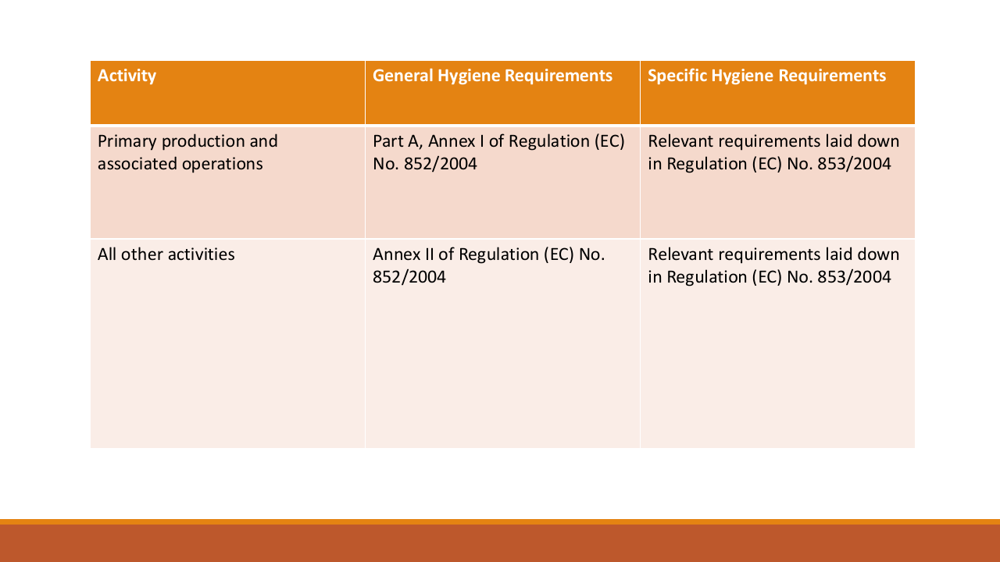

### Activity                 General Hygiene Requirements         Specific Hygiene Requirements

Primary production and   Part A, Annex I of Regulation (EC)   Relevant requirements laid down
associated operations    No. 852/2004                         in Regulation (EC) No. 853/2004

All other activities     Annex II of Regulation (EC) No.      Relevant requirements laid down
                         852/2004                             in Regulation (EC) No. 853/2004

## Slide 382

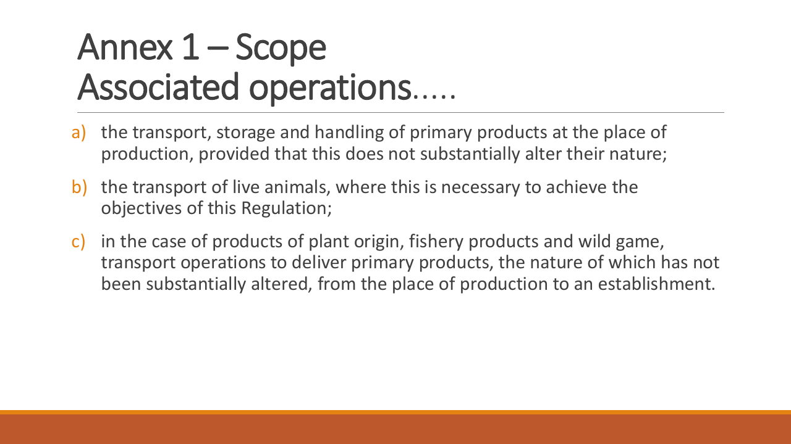

### Annex 1 – Scope a) c)

Associated operations.....

the transport, storage and handling of primary products at the place of
production, provided that this does not substantially alter their nature;

    - b) the transport of live animals, where this is necessary to achieve the

- bjectives of this Regulation

in the case of products of plant origin, fishery products and wild game,
transport operations to deliver primary products, the nature of which has not
been substantially altered, from the place of production to an establishment.

## Slide 383

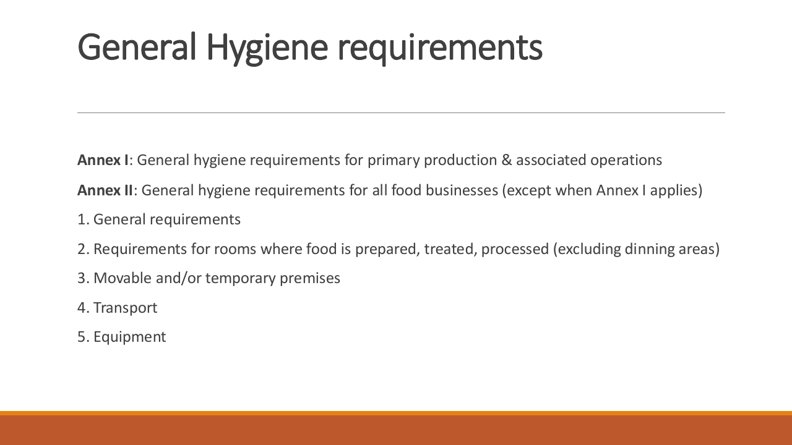

### General Hygiene requirements

Annex I: General hygiene requirements for primary production & associated operations

Annex II: General hygiene requirements for all food businesses (except when Annex I applies)

1. General requirements

2. Requirements for rooms where food is prepared, treated, processed (excluding dinning areas)

3. Movable and/or temporary premises

4. Transport

5. Equipment

## Slide 384

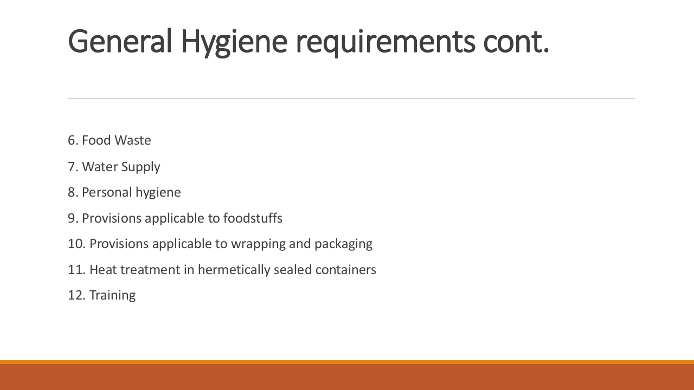

### General Hygiene requirements cont.

6. Food Waste

7. Water Supply

8. Personal hygiene

9. Provisions applicable to foodstuffs

10. Provisions applicable to wrapping and packaging

11. Heat treatment in hermetically sealed containers

12. Training

## Slide 385

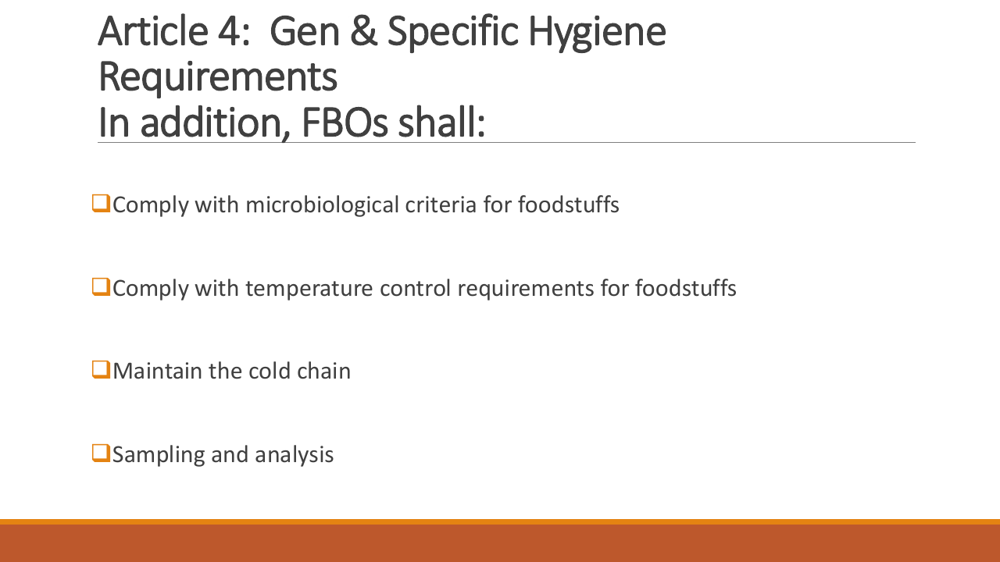

### Article 4:  Gen & Specific Hygiene — RequirementsIn addition, FBOs shall:

- Comply with microbiological criteria for foodstuffs

- Comply with temperature control requirements for foodstuffs

- Maintain the cold chain

- Sampling and analysis

## Slide 386

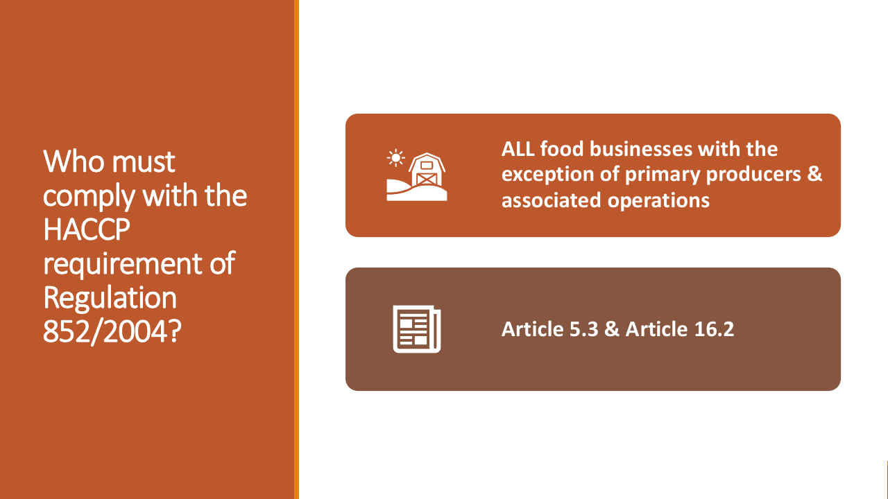

### Who must comply with the — HACCP

requirement of
Regulation
852/2004?

ALL food businesses with the
exception of primary producers &
associated operations

Article 5.3 & Article 16.2

## Slide 387

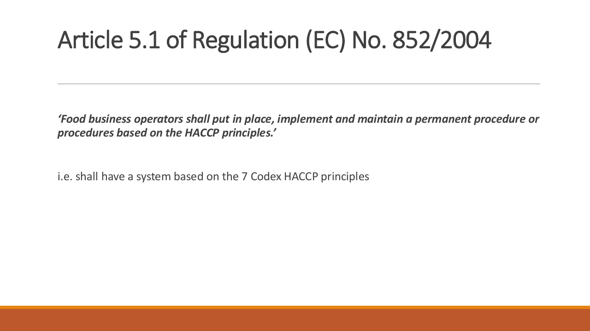

### Article 5.1 of Regulation (EC) No. 852/2004

‘Food business operators shall put in place, implement and maintain a permanent procedure or
procedures based on the HACCP principles.’

i.e. shall have a system based on the 7 Codex HACCP principles

## Slide 388


### ARTICLE 5:  Hazard Analysis and Critical Control — Point (HACCP)

GHP lays the foundation for HACCP

- What could go wrong?

- How can I prevent it?

- Make sure I am doing it!

## Slide 389

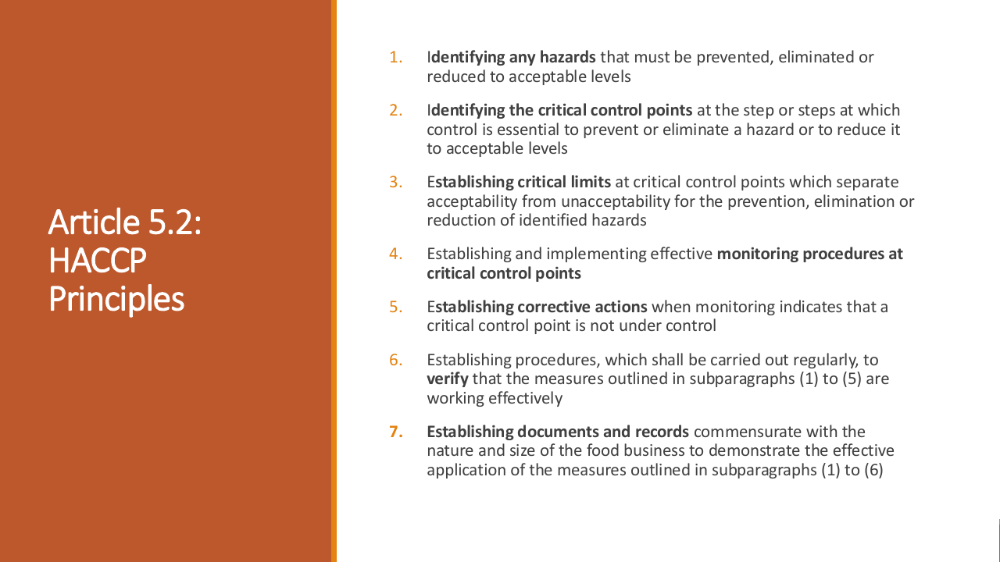

### HACCP Principles — Article 5.2

1. Identifying any hazards that must be prevented, eliminated or reduced to acceptable levels
2. Identifying the critical control points at the step or steps at which control is essential to prevent or eliminate a hazard or to reduce it to acceptable levels
3. Establishing critical limits at critical control points which separate acceptability from unacceptability for the prevention, elimination or reduction of identified hazards
4. Establishing and implementing effective monitoring procedures at critical control points
5. Establishing corrective actions when monitoring indicates that a critical control point is not under control
6. Establishing procedures, which shall be carried out regularly, to verify that the measures outlined in subparagraphs (1) to (5) are working effectively
7. Establishing documents and records commensurate with the nature and size of the food business to demonstrate the effective application of the measures outlined in subparagraphs (1) to (6)

## Slide 390

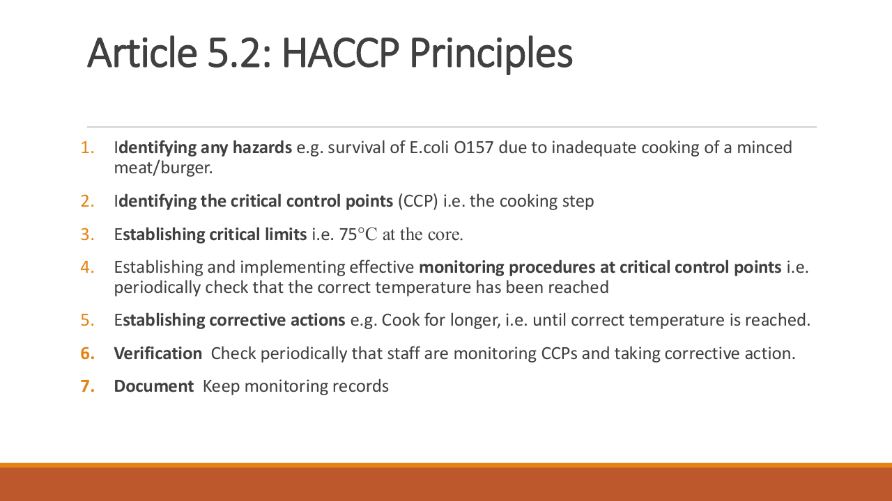

### Article 5.2: HACCP Principles

1.

2.

3.

4.

Identifying any hazards e.g. survival of E.coli O157 due to inadequate cooking of a minced
meat/burger.

Identifying the critical control points (CCP) i.e. the cooking step

Establishing critical limits i.e. 75°C at the core.

Establishing and implementing effective monitoring procedures at critical control points i.e.
periodically check that the correct temperature has been reached

5.

Establishing corrective actions e.g. Cook for longer, i.e. until correct temperature is reached.

6. Verification  Check periodically that staff are monitoring CCPs and taking corrective action.

7. Document  Keep monitoring records

## Slide 391

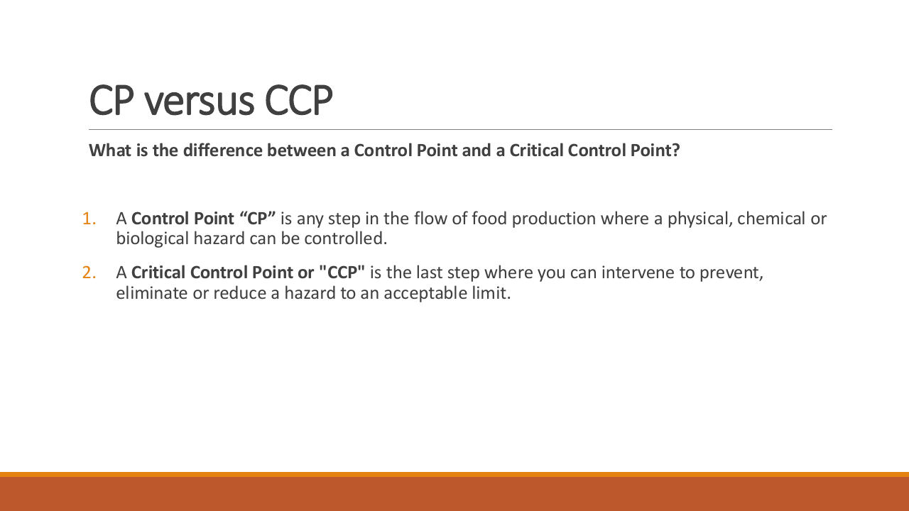

### CP versus CCP

What is the difference between a Control Point and a Critical Control Point?

1. A Control Point “CP” is any step in the flow of food production where a physical, chemical or

biological hazard can be controlled.

2. A Critical Control Point or "CCP" is the last step where you can intervene to prevent,

eliminate or reduce a hazard to an acceptable limit.

## Slide 392

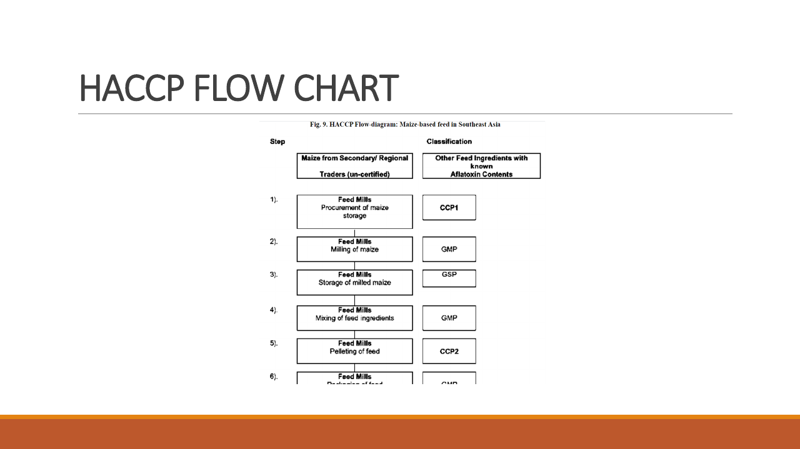

### HACCP FLOW CHART

## Slide 393

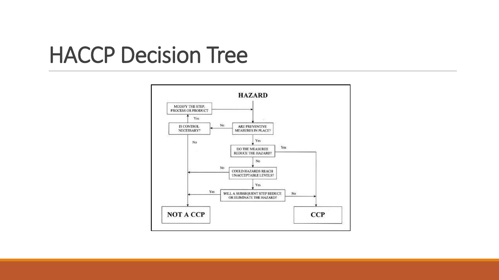

### HACCP Decision Tree

## Slide 394

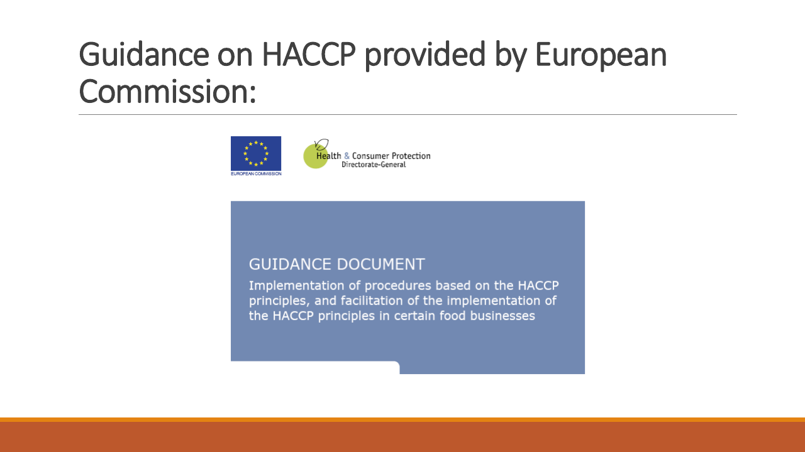

### Guidance on HACCP provided by European — Commission:

## Slide 395

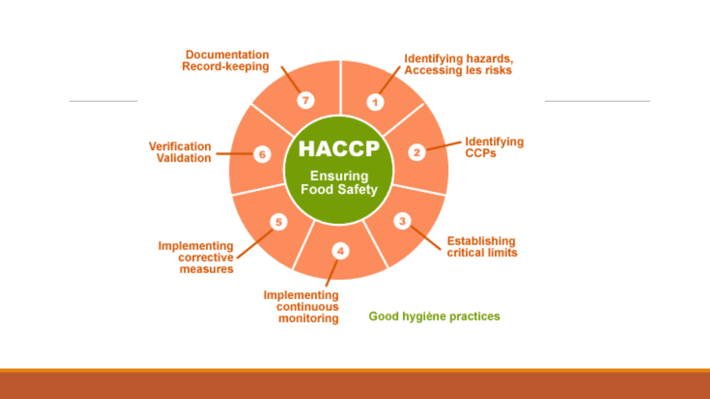

### *(Image-only slide — no extractable text.)*

**HACCP — Ensuring Food Safety** (7-step wheel diagram):

1. Identifying hazards, Assessing the risks
2. Identifying CCPs (Critical Control Points)
3. Establishing critical limits
4. Implementing continuous monitoring
5. Implementing corrective measures
6. Verification / Validation
7. Documentation / Record-keeping

Underpinned by **good hygiene practices**.

## Slide 396

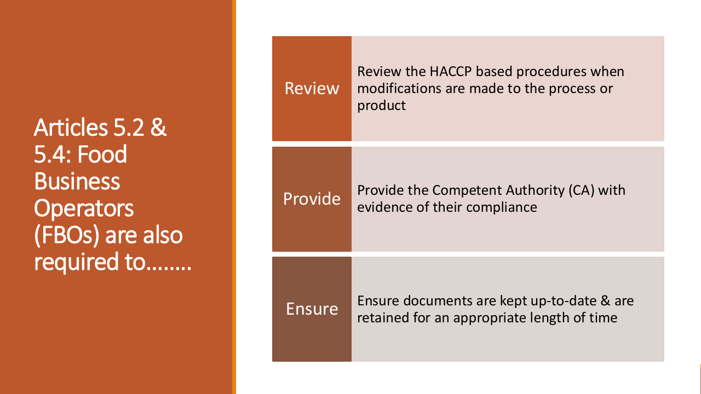

### Articles 5.2 & 5.4: FBOs Are Also Required To…

| Action | Requirement |
|---|---|
| **Review** | Review the HACCP based procedures when modifications are made to the process or product |
| **Provide** | Provide the Competent Authority (CA) with evidence of their compliance |
| **Ensure** | Ensure documents are kept up-to-date and are retained for an appropriate length of time |

## Slide 397

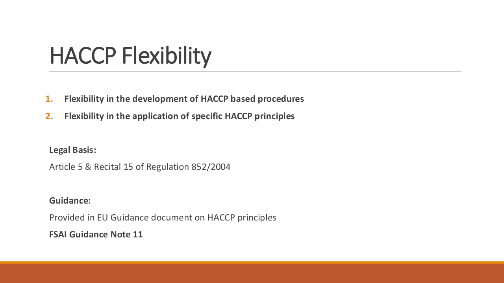

### HACCP Flexibility — FSAI Guidance Note 11

1. Flexibility in the **development** of HACCP based procedures
2. Flexibility in the **application** of specific HACCP principles

**Legal Basis:** Article 5 & Recital 15 of Regulation 852/2004

**Guidance:** Provided in EU Guidance document on HACCP principles — **FSAI Guidance Note 11**

## Slide 398

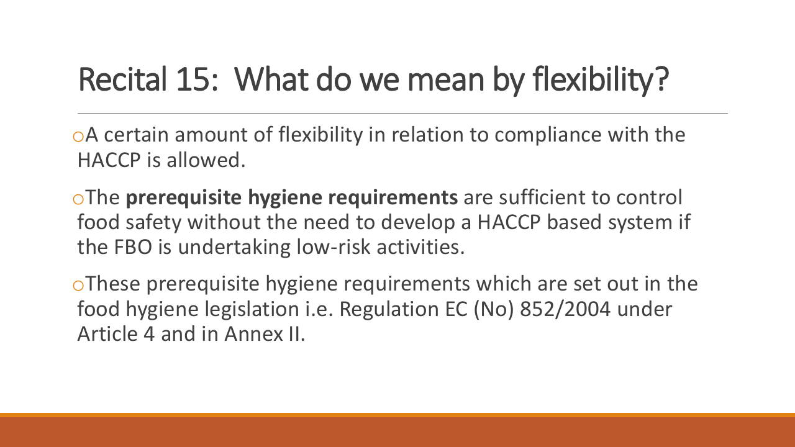

### Recital 15:  What do we mean by flexibility?

- A certain amount of flexibility in relation to compliance with the HACCP is allowed.

- The prerequisite hygiene requirements are sufficient to control food safety without the need to develop a HACCP based system if the FBO is undertaking low-risk activities.

- These prerequisite hygiene requirements which are set out in the food hygiene legislation i.e. Regulation EC (No) 852/2004 under Article 4 and in Annex II.

## Slide 399

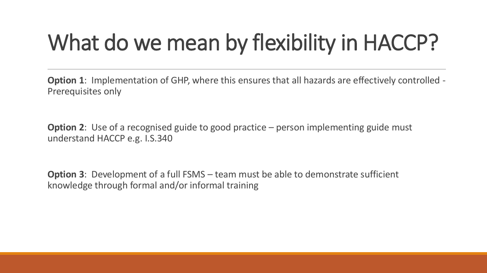

### What do we mean by flexibility in HACCP?

Option 1:  Implementation of GHP, where this ensures that all hazards are effectively controlled -
Prerequisites only

Option 2:  Use of a recognised guide to good practice – person implementing guide must
understand HACCP e.g. I.S.340

Option 3:  Development of a full FSMS – team must be able to demonstrate sufficient
knowledge through formal and/or informal training

## Slide 400

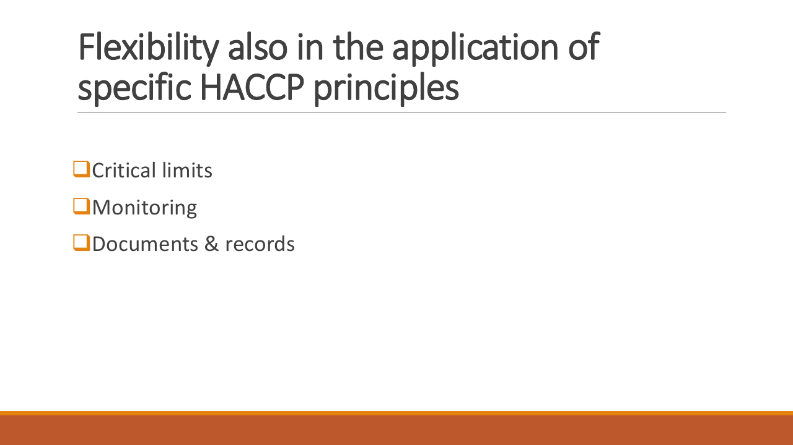

### Flexibility also in the application of specific HACCP principles

- Critical limits

- Monitoring

- Documents & records

## Slide 401

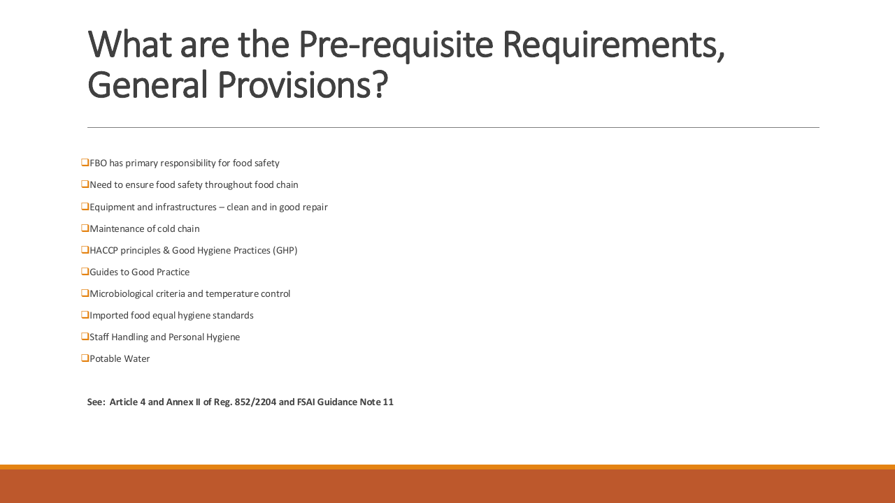

### What are the Pre-requisite Requirements, — General Provisions?

- FBO has primary responsibility for food safety

- Need to ensure food safety throughout food chain

- Equipment and infrastructures – clean and in good repair

- Maintenance of cold chain

- HACCP principles & Good Hygiene Practices (GHP)

- Guides to Good Practice

- Microbiological criteria and temperature control

- Imported food equal hygiene standards

- Staff Handling and Personal Hygiene

- Potable Water

See:  Article 4 and Annex II of Reg. 852/2204 and FSAI Guidance Note 11

## Slide 402

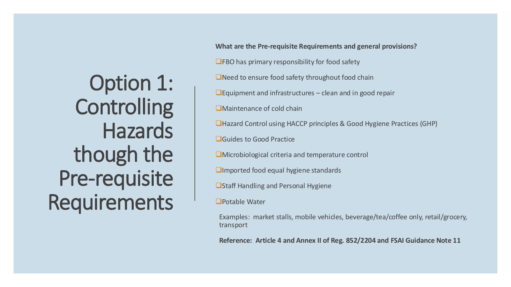

### Pre-requisite Requirements     ❑Potable Water transport

What are the Pre-requisite Requirements and general provisions?

    - FBO has primary responsibility for food safety

     Option 1:   ❑Need to ensure food safety throughout food chain

    - Equipment and infrastructures – clean and in good repair

   Controlling   ❑Maintenance of cold chain

      Hazards    ❑Hazard Control using HACCP principles & Good Hygiene Practices (GHP)

    - Guides to Good Practice

   though the    ❑Microbiological criteria and temperature control

    - Imported food equal hygiene standards

    - Staff Handling and Personal Hygiene

                  Examples: market stalls, mobile vehicles, beverage/tea/coffee only, retail/grocery,

                  Reference: Article 4 and Annex II of Reg. 852/2204 and FSAI Guidance Note 11

## Slide 403

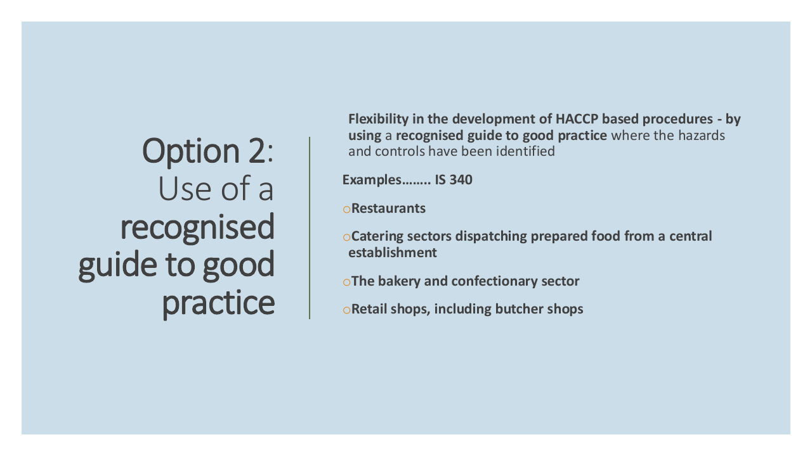

### Use of a recognised guide to good practice establishment

Option 2:

Flexibility in the development of HACCP based procedures - by
using a recognised guide to good practice where the hazards
and controls have been identified

Examples…….. IS 340

- Restaurants

- Catering sectors dispatching prepared food from a central

- The bakery and confectionary sector

- Retail shops, including butcher shops

## Slide 404

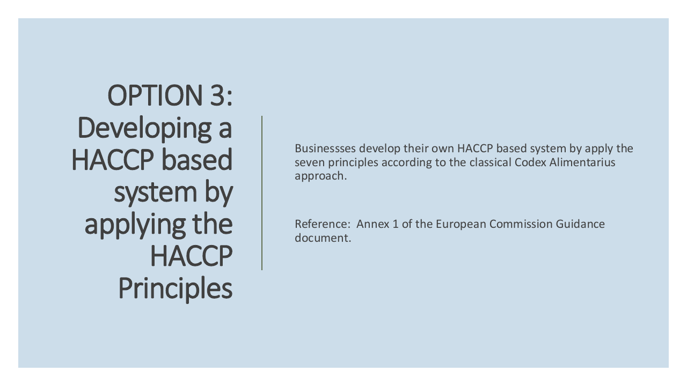

### Developing a HACCP based system by HACCP Principles

OPTION 3:
                 Businessses develop their own HACCP based system by apply the
                 seven principles according to the classical Codex Alimentarius
                 approach.
 applying the    Reference: Annex 1 of the European Commission Guidance
                 document.

## Slide 405

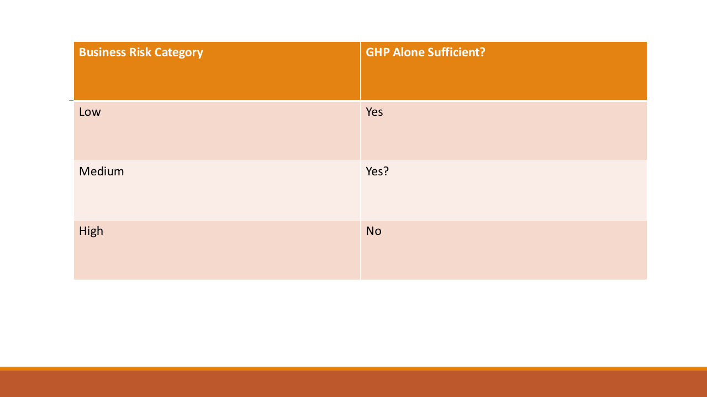

### Low                      Yes High                     No

Business Risk Category   GHP Alone Sufficient?

Medium                   Yes?

## Slide 406

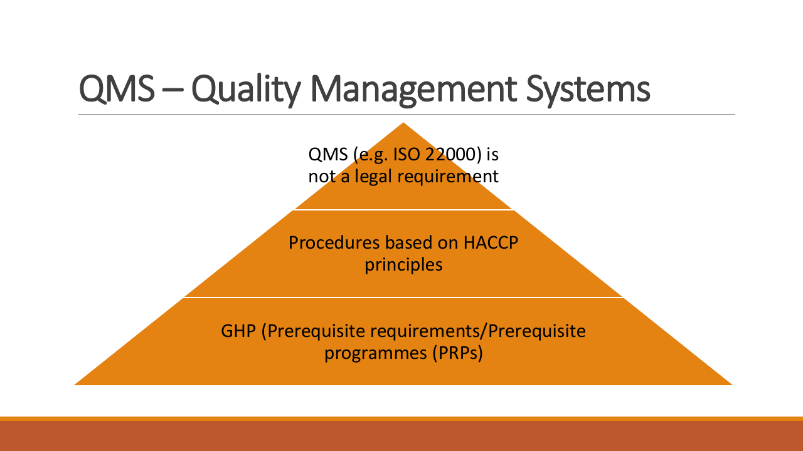

### QMS — Quality Management Systems

Pyramid of food safety management (bottom to top):

| Level | Description |
|---|---|
| **GHP** (base) | Prerequisite requirements / Prerequisite Programmes (PRPs) — legal requirement |
| **HACCP** (middle) | Procedures based on HACCP principles — legal requirement |
| **QMS** (top) | e.g. ISO 22000 — **not** a legal requirement |

## Slide 407

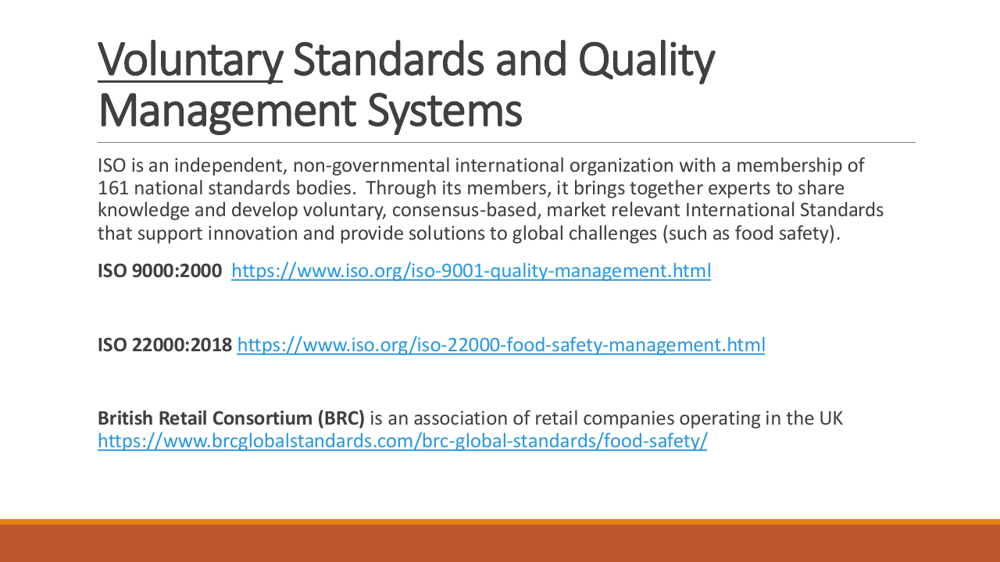

### Voluntary Standards and Quality Management Systems

ISO is an independent, non-governmental international organization with a membership of
161 national standards bodies.  Through its members, it brings together experts to share
knowledge and develop voluntary, consensus-based, market relevant International Standards
that support innovation and provide solutions to global challenges (such as food safety).

ISO 9000:2000  https://www.iso.org/iso-9001-quality-management.html

ISO 22000:2018 https://www.iso.org/iso-22000-food-safety-management.html

British Retail Consortium (BRC) is an association of retail companies operating in the UK
https://www.brcglobalstandards.com/brc-global-standards/food-safety/

## Slide 408

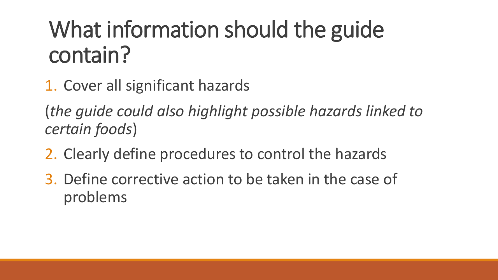

### What Information Should the Guide Contain?

1. Cover all significant hazards *(the guide could also highlight possible hazards linked to certain foods)*
2. Clearly define procedures to control the hazards
3. Define corrective action to be taken in the case of problems

## Slide 409

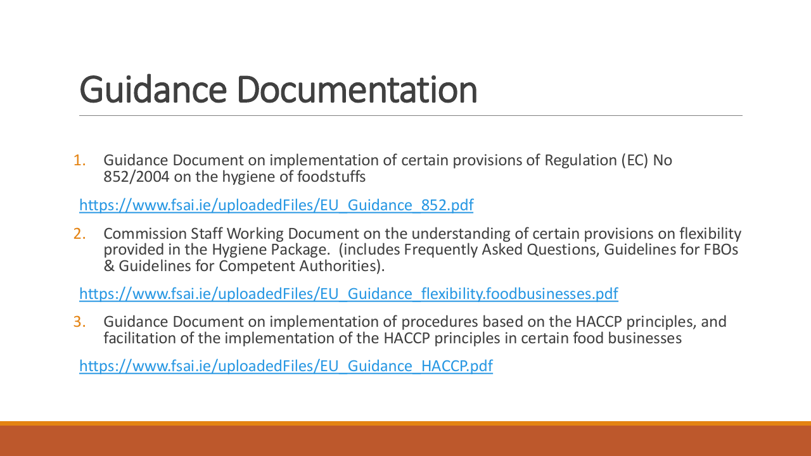

### Guidance Documentation

1. Guidance Document on implementation of certain provisions of Regulation (EC) No

852/2004 on the hygiene of foodstuffs

https://www.fsai.ie/uploadedFiles/EU_Guidance_852.pdf

2. Commission Staff Working Document on the understanding of certain provisions on flexibility provided in the Hygiene Package.  (includes Frequently Asked Questions, Guidelines for FBOs & Guidelines for Competent Authorities).

https://www.fsai.ie/uploadedFiles/EU_Guidance_flexibility.foodbusinesses.pdf

3. Guidance Document on implementation of procedures based on the HACCP principles, and

facilitation of the implementation of the HACCP principles in certain food businesses

https://www.fsai.ie/uploadedFiles/EU_Guidance_HACCP.pdf

## Slide 410

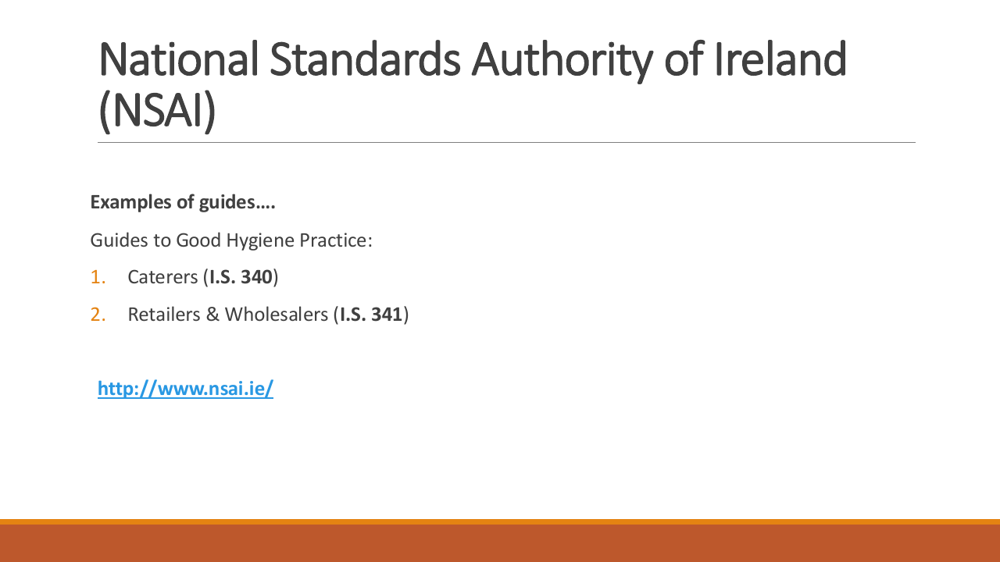

### National Standards Authority of Ireland — (NSAI)

Examples of guides….

Guides to Good Hygiene Practice:

1. Caterers (I.S. 340)

2. Retailers & Wholesalers (I.S. 341)

http://www.nsai.ie/

## Slide 411

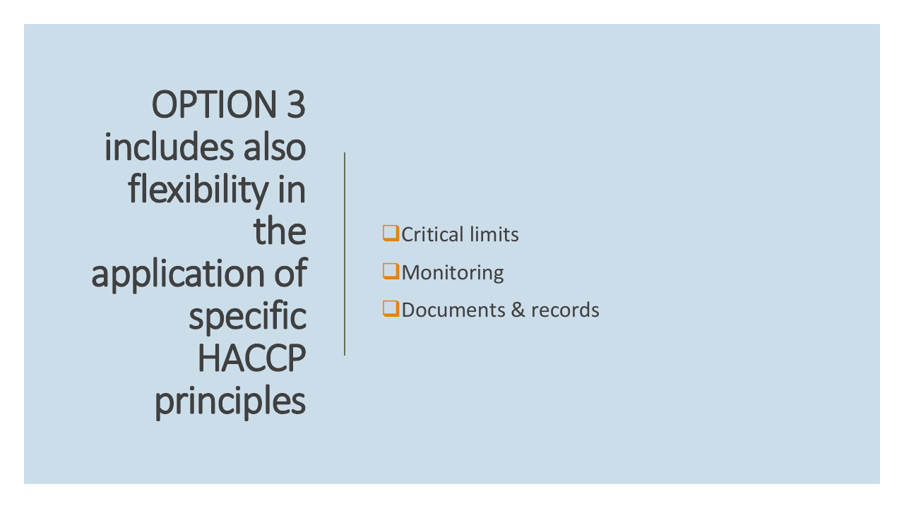

### Option 3 — Flexibility in the Application of Specific HACCP Principles

Option 3 includes also flexibility in the application of:

- Critical limits
- Monitoring
- Documents & records

## Slide 412

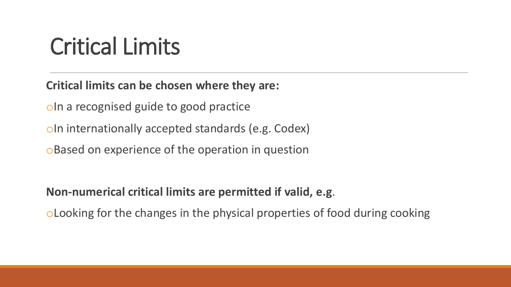

### Critical Limits

Critical limits can be chosen where they are:

- In a recognised guide to good practice

- In internationally accepted standards (e.g. Codex)

- Based on experience of the operation in question

Non-numerical critical limits are permitted if valid, e.g.

- Looking for the changes in the physical properties of food during cooking

## Slide 413

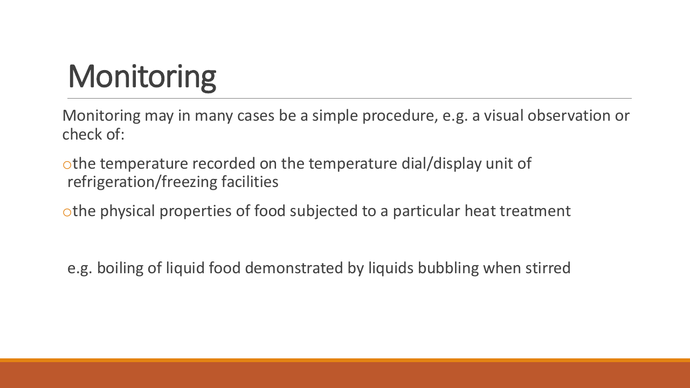

### Monitoring refrigeration/freezing facilities

Monitoring may in many cases be a simple procedure, e.g. a visual observation or
check of:

- the temperature recorded on the temperature dial/display unit of

- the physical properties of food subjected to a particular heat treatment

e.g. boiling of liquid food demonstrated by liquids bubbling when stirred

## Slide 414

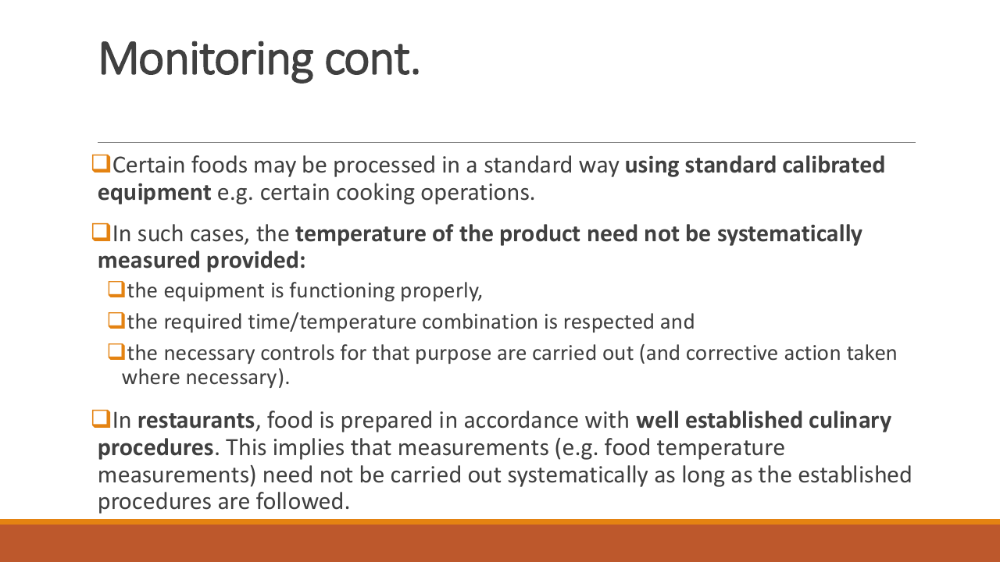

### Monitoring cont.

- Certain foods may be processed in a standard way using standard calibrated equipment e.g. certain cooking operations.

- In such cases, the temperature of the product need not be systematically measured provided:
- the equipment is functioning properly,
- the required time/temperature combination is respected and
- the necessary controls for that purpose are carried out (and corrective action taken

where necessary).

- In restaurants, food is prepared in accordance with well established culinary procedures. This implies that measurements (e.g. food temperature measurements) need not be carried out systematically as long as the established procedures are followed.

## Slide 415

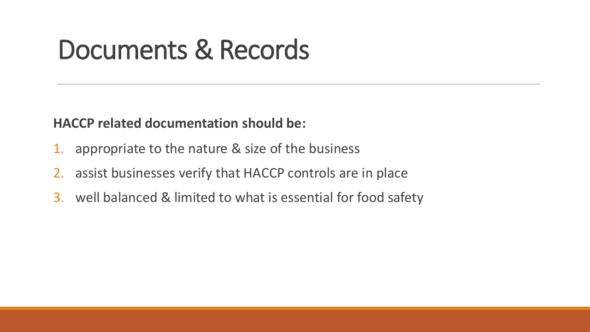

### Documents & Records

HACCP related documentation should be:

1. appropriate to the nature & size of the business

2. assist businesses verify that HACCP controls are in place

3. well balanced & limited to what is essential for food safety

## Slide 416

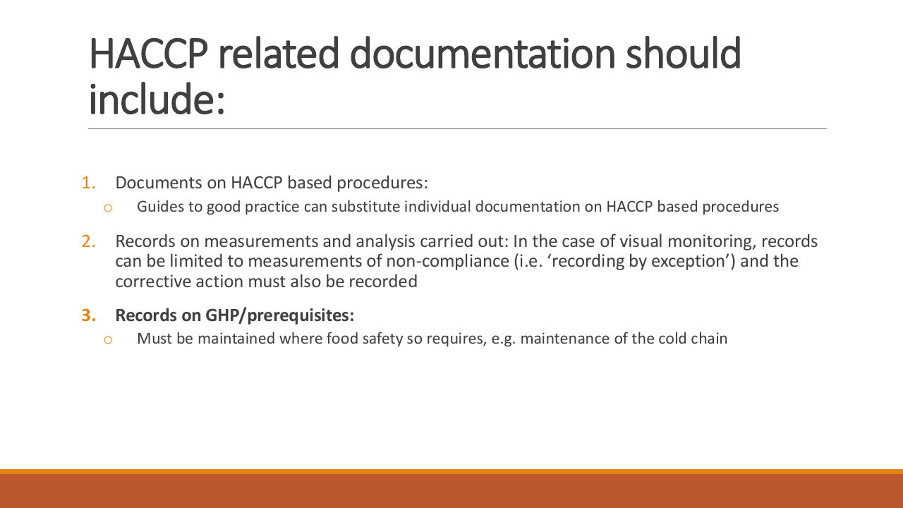

### HACCP related documentation should include:

1. Documents on HACCP based procedures:

Guides to good practice can substitute individual documentation on HACCP based procedures

2. Records on measurements and analysis carried out: In the case of visual monitoring, records can be limited to measurements of non-compliance (i.e. ‘recording by exception’) and the corrective action must also be recorded

3. Records on GHP/prerequisites:

- Must be maintained where food safety so requires, e.g. maintenance of the cold chain

## Slide 417

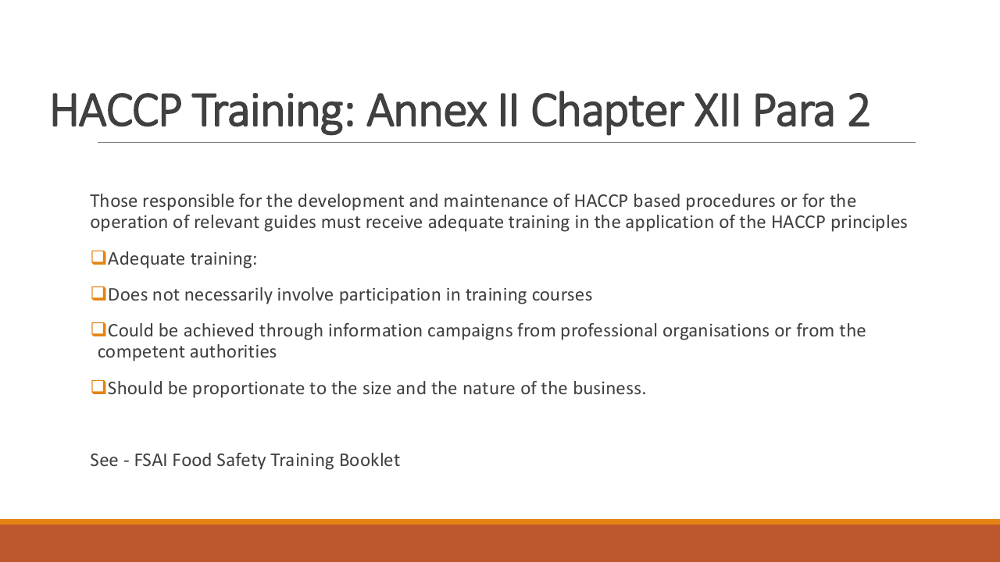

### HACCP Training: Annex II Chapter XII Para 2

Those responsible for the development and maintenance of HACCP based procedures or for the
- peration of relevant guides must receive adequate training in the application of the HACCP principles

- Adequate training:

- Does not necessarily involve participation in training courses

- Could be achieved through information campaigns from professional organisations or from the competent authorities

- Should be proportionate to the size and the nature of the business.

See - FSAI Food Safety Training Booklet

## Slide 418

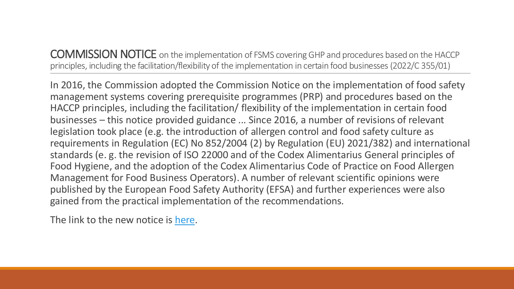

### COMMISSION NOTICE on the implementation of FSMS covering GHP and procedures based on the HACCP

principles, including the facilitation/flexibility of the implementation in certain food businesses (2022/C 355/01)

In 2016, the Commission adopted the Commission Notice on the implementation of food safety
management systems covering prerequisite programmes (PRP) and procedures based on the
HACCP principles, including the facilitation/ flexibility of the implementation in certain food
businesses – this notice provided guidance ... Since 2016, a number of revisions of relevant
legislation took place (e.g. the introduction of allergen control and food safety culture as
requirements in Regulation (EC) No 852/2004 (2) by Regulation (EU) 2021/382) and international
standards (e. g. the revision of ISO 22000 and of the Codex Alimentarius General principles of
Food Hygiene, and the adoption of the Codex Alimentarius Code of Practice on Food Allergen
Management for Food Business Operators). A number of relevant scientific opinions were
published by the European Food Safety Authority (EFSA) and further experiences were also
gained from the practical implementation of the recommendations.

The link to the new notice is here.

## Slide 419

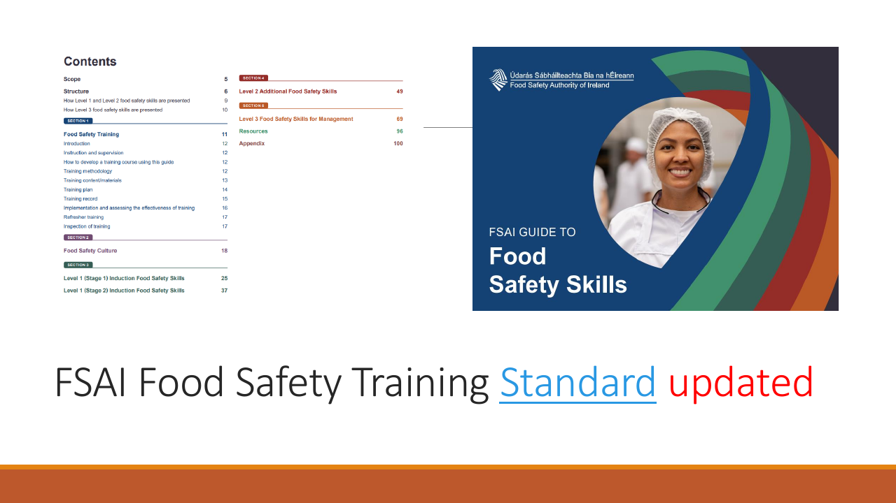

### FSAI Food Safety Training Standard updated

## Slide 420

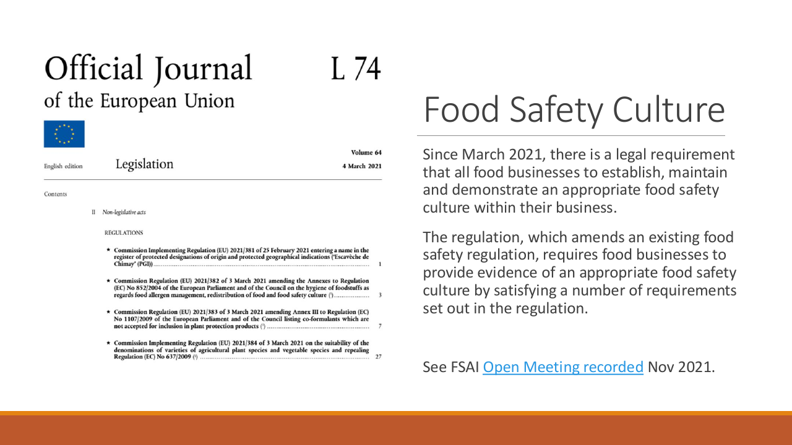

### Food Safety Culture

Since March 2021, there is a legal requirement
that all food businesses to establish, maintain
and demonstrate an appropriate food safety
culture within their business.

The regulation, which amends an existing food
safety regulation, requires food businesses to
provide evidence of an appropriate food safety
culture by satisfying a number of requirements
set out in the regulation.

See FSAI Open Meeting recorded Nov 2021.

## Slide 421

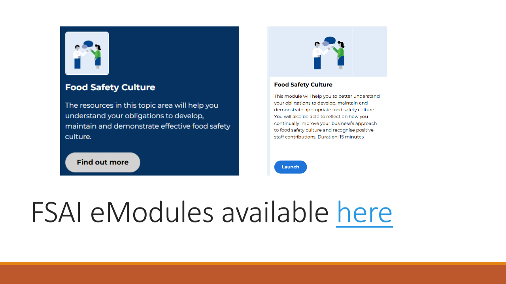

### FSAI eModules available here

## Slide 422

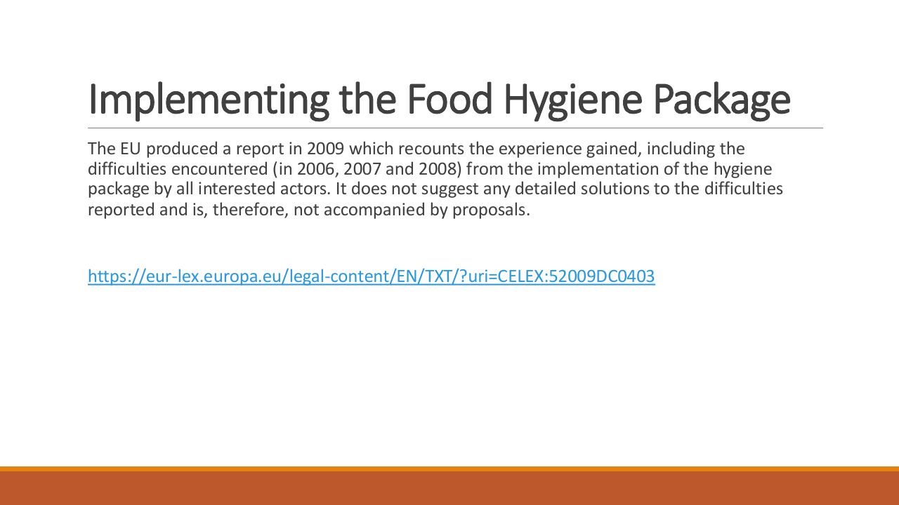

### Implementing the Food Hygiene Package

The EU produced a report in 2009 which recounts the experience gained, including the
difficulties encountered (in 2006, 2007 and 2008) from the implementation of the hygiene
package by all interested actors. It does not suggest any detailed solutions to the difficulties
reported and is, therefore, not accompanied by proposals.

https://eur-lex.europa.eu/legal-content/EN/TXT/?uri=CELEX:52009DC0403

## Slide 423

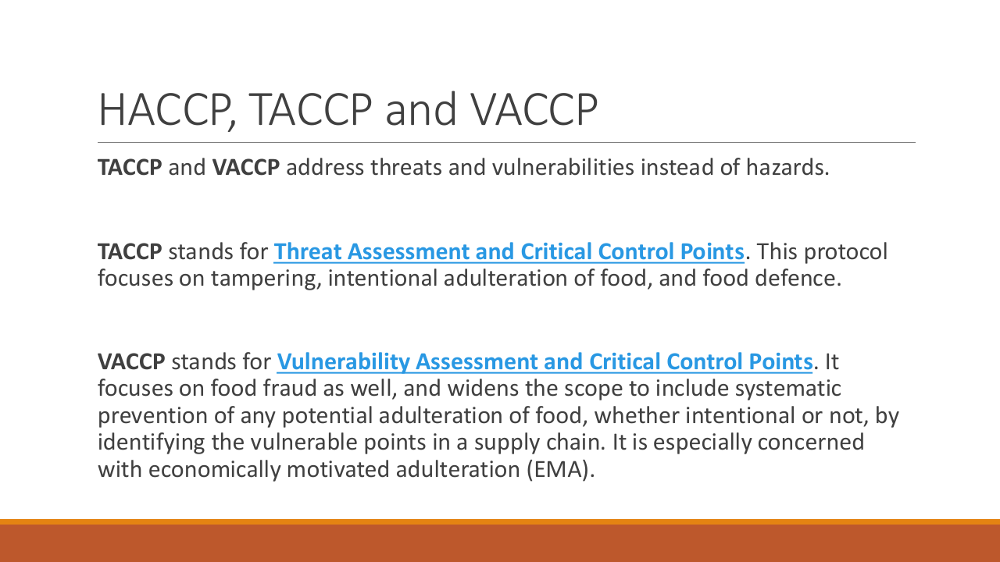

### HACCP, TACCP and VACCP

TACCP and VACCP address threats and vulnerabilities instead of hazards.

TACCP stands for Threat Assessment and Critical Control Points. This protocol
focuses on tampering, intentional adulteration of food, and food defence.

VACCP stands for Vulnerability Assessment and Critical Control Points. It
focuses on food fraud as well, and widens the scope to include systematic
prevention of any potential adulteration of food, whether intentional or not, by
identifying the vulnerable points in a supply chain. It is especially concerned
with economically motivated adulteration (EMA).

## Slide 424

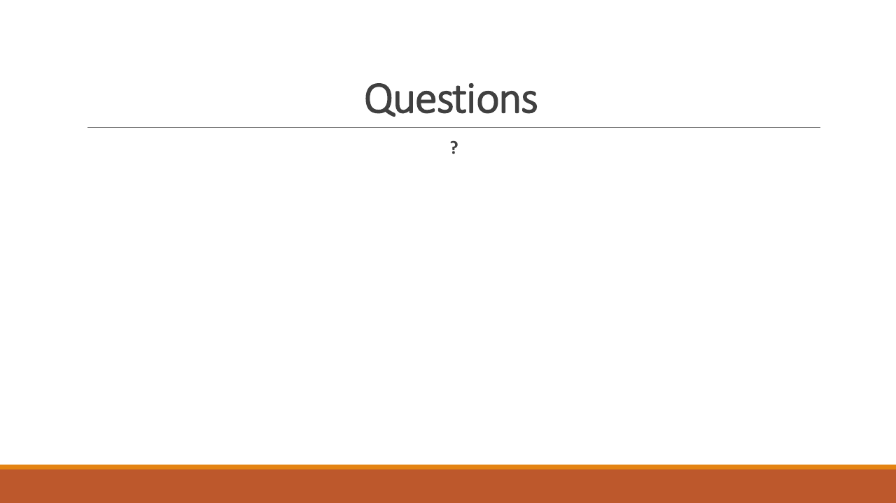

### Questions?

---

<a id="lecture-7"></a>
