<!-- Source: 00_resources/2026 Food Law slides — reflowed.md -->
<!-- Generated from Table of Contents entry 7. -->

# Lecture 7 — Week 9 (25 March 2026): Hygiene Package (cont.) & Foods of Animal Origin (Reg 853/2004)

**Topics:** Reg 853/2004 · specific hygiene rules for products of animal origin · ID marking · HACCP objectives · national legislation · documentation & records · FBO obligations

**Slides:** 425–478 (54 slides)

## Slide 425

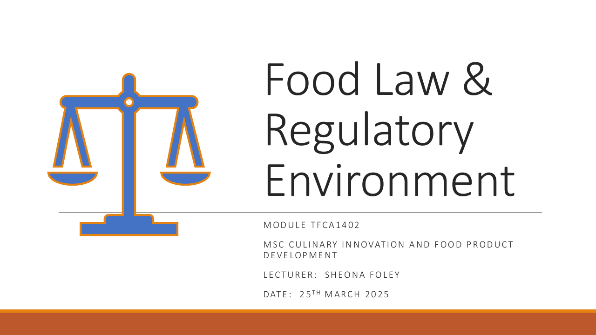

### Food Law & Regulatory Environment — *Course Title Slide*

| | |
|---|---|
| **Module code** | TFCA1402 |
| **Programme** | MSc Culinary Innovation and Food Product Development |
| **Lecturer** | Sheona Foley |
| **Date** | 25th March 2025 |

## Slide 426

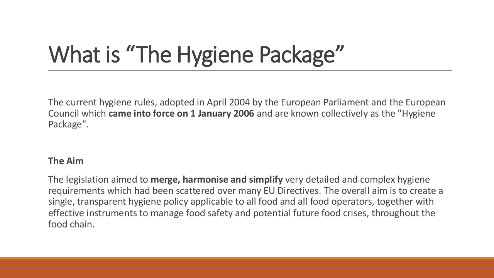

### What is "The Hygiene Package"

The current hygiene rules, adopted in April 2004 by the European Parliament and the European Council which came into force on 1 January 2006 and are known collectively as the "Hygiene Package".

**The Aim**

The legislation aimed to merge, harmonise and simplify very detailed and complex hygiene requirements which had been scattered over many EU Directives. The overall aim is to create a single, transparent hygiene policy applicable to all food and all food operators, together with effective instruments to manage food safety and potential future food crises, throughout the food chain.

## Slide 427

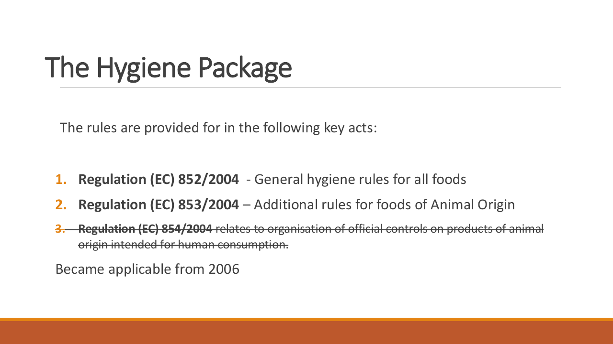

### The Hygiene Package Became applicable from 2006

The rules are provided for in the following key acts:

1. Regulation (EC) 852/2004  - General hygiene rules for all foods

2. Regulation (EC) 853/2004 – Additional rules for foods of Animal Origin

3. Regulation (EC) 854/2004 relates to organisation of official controls on products of animal

- rigin intended for human consumption.

## Slide 428

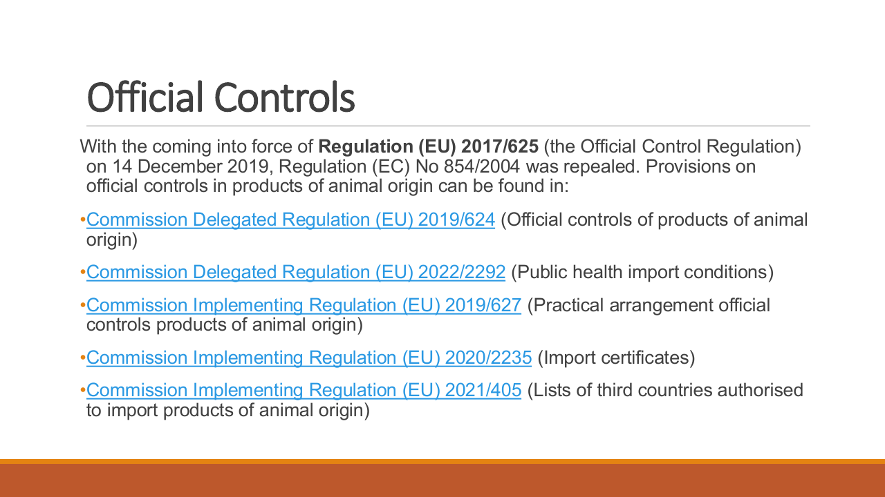

### Official Controls

With the coming into force of Regulation (EU) 2017/625 (the Official Control Regulation)
- n 14 December 2019, Regulation (EC) No 854/2004 was repealed. Provisions on
- fficial controls in products of animal origin can be found in:

- Commission Delegated Regulation (EU) 2019/624 (Official controls of products of animal
- rigin)

- Commission Delegated Regulation (EU) 2022/2292 (Public health import conditions)

- Commission Implementing Regulation (EU) 2019/627 (Practical arrangement official controls products of animal origin)

- Commission Implementing Regulation (EU) 2020/2235 (Import certificates)

- Commission Implementing Regulation (EU) 2021/405 (Lists of third countries authorised to import products of animal origin)

## Slide 429

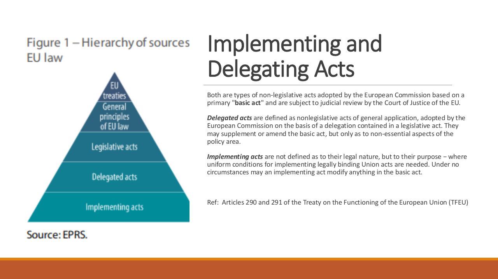

### Implementing and Delegating Acts

Both are types of non-legislative acts adopted by the European Commission based on a
primary "basic act" and are subject to judicial review by the Court of Justice of the EU.

Delegated acts are defined as nonlegislative acts of general application, adopted by the
European Commission on the basis of a delegation contained in a legislative act. They
may supplement or amend the basic act, but only as to non-essential aspects of the
policy area.

Implementing acts are not defined as to their legal nature, but to their purpose − where
uniform conditions for implementing legally binding Union acts are needed. Under no
circumstances may an implementing act modify anything in the basic act.

Ref:  Articles 290 and 291 of the Treaty on the Functioning of the European Union (TFEU)

## Slide 430

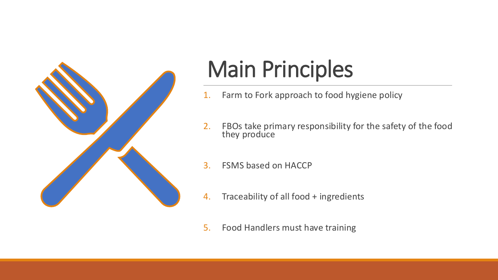

### Main Principles

1. Farm to Fork approach to food hygiene policy
2. FBOs take primary responsibility for the safety of the food they produce
3. FSMS based on HACCP
4. Traceability of all food + ingredients
5. Food Handlers must have training

## Slide 431

### Who must comply with the HACCP requirement of Regulation 852/2004?

ALL food businesses with the exception of primary producers & associated operations

> Article 5.3 & Article 16.2

## Slide 432

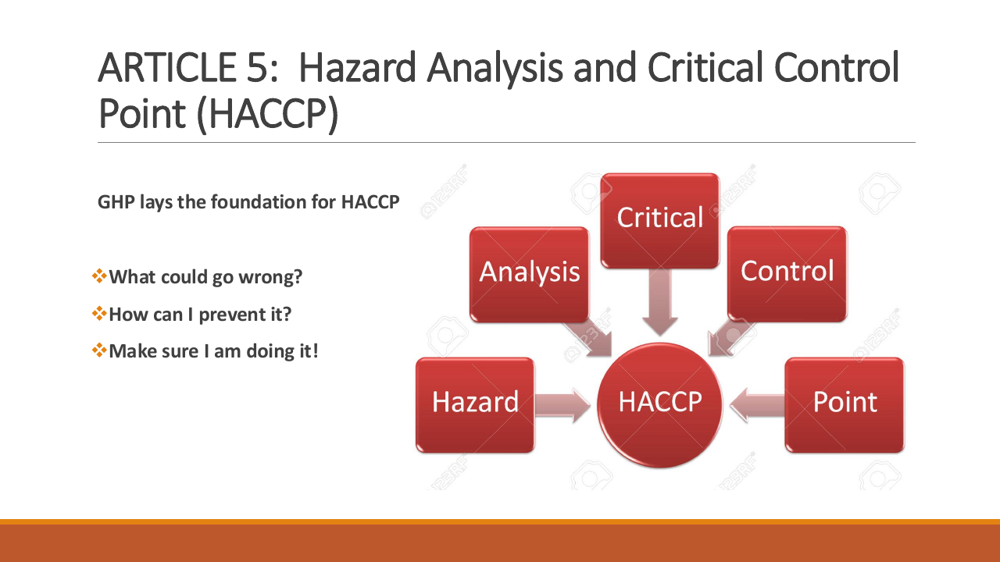

### ARTICLE 5:  Hazard Analysis and Critical Control — Point (HACCP)

GHP lays the foundation for HACCP

- What could go wrong?

- How can I prevent it?

- Make sure I am doing it!

## Slide 433

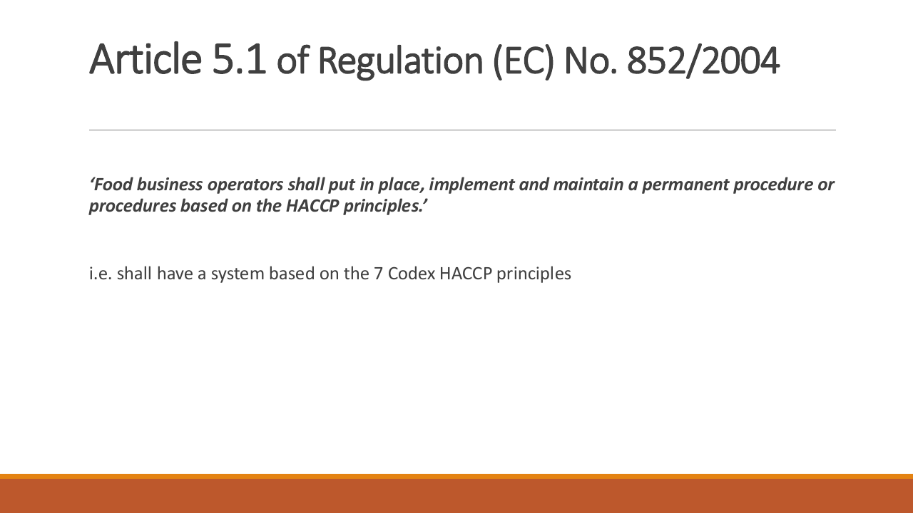

### Article 5.1 of Regulation (EC) No. 852/2004

‘Food business operators shall put in place, implement and maintain a permanent procedure or
procedures based on the HACCP principles.’

i.e. shall have a system based on the 7 Codex HACCP principles

## Slide 434

### HACCP Principles — Article 5.2

1. Identifying any hazards that must be prevented, eliminated or reduced to acceptable levels
2. Identifying the critical control points at the step or steps at which control is essential to prevent or eliminate a hazard or to reduce it to acceptable levels
3. Establishing critical limits at critical control points which separate acceptability from unacceptability for the prevention, elimination or reduction of identified hazards
4. Establishing and implementing effective monitoring procedures at critical control points
5. Establishing corrective actions when monitoring indicates that a critical control point is not under control
6. Establishing procedures, which shall be carried out regularly, to verify that the measures outlined in subparagraphs (1) to (5) are working effectively
7. Establishing documents and records commensurate with the nature and size of the food business to demonstrate the effective application of the measures outlined in subparagraphs (1) to (6)

## Slide 435

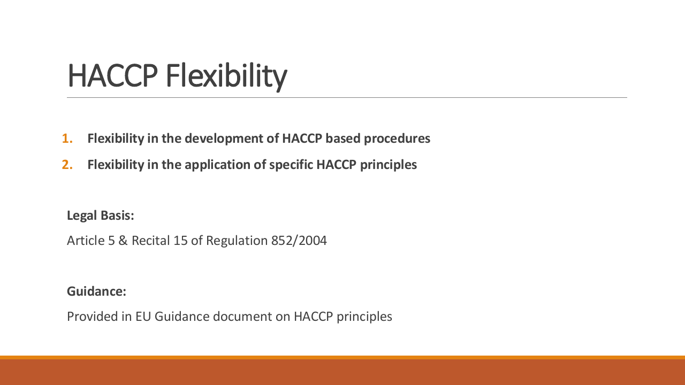

### HACCP Flexibility

1. Flexibility in the development of HACCP based procedures
2. Flexibility in the application of specific HACCP principles

**Legal Basis:** Article 5 & Recital 15 of Regulation 852/2004

**Guidance:** Provided in EU Guidance document on HACCP principles

## Slide 436

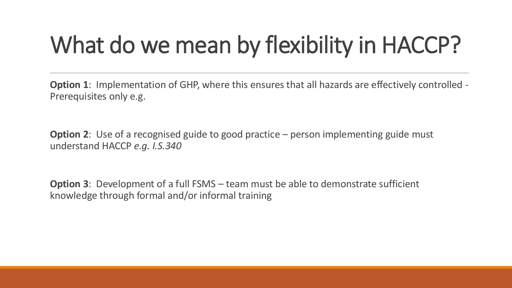

### What do we mean by flexibility in HACCP?

Option 1:  Implementation of GHP, where this ensures that all hazards are effectively controlled -
Prerequisites only e.g.

Option 2:  Use of a recognised guide to good practice – person implementing guide must
understand HACCP e.g. I.S.340

Option 3:  Development of a full FSMS – team must be able to demonstrate sufficient
knowledge through formal and/or informal training

## Slide 437

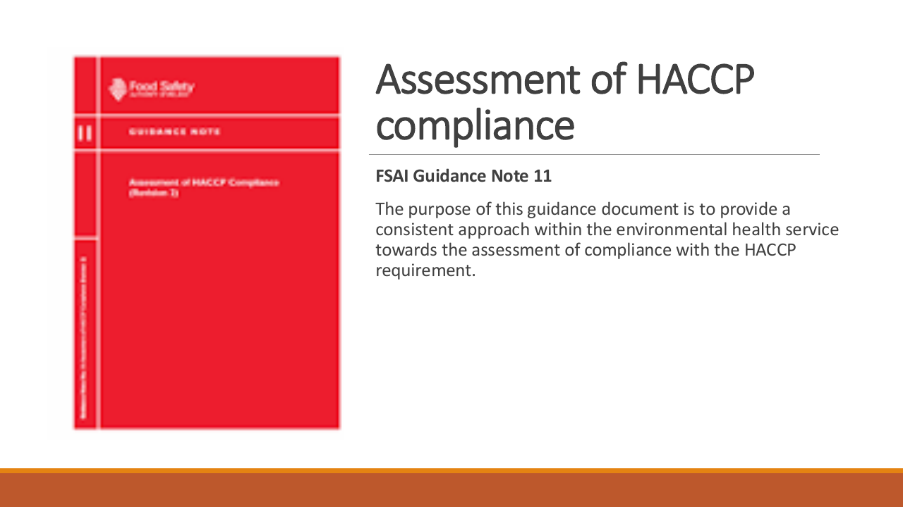

### Assessment of HACCP compliance FSAI Guidance Note 11

The purpose of this guidance document is to provide a
consistent approach within the environmental health service
towards the assessment of compliance with the HACCP
requirement.

## Slide 438

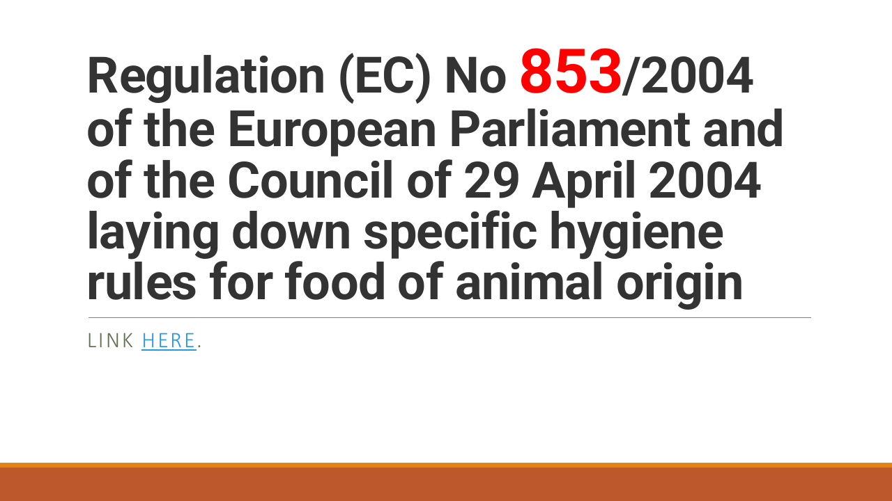

### Regulation (EC) No 853/2004 laying down specific hygiene

- f the European Parliament and
- f the Council of 29 April 2004 rules for food of animal origin

LINK HERE.

## Slide 439

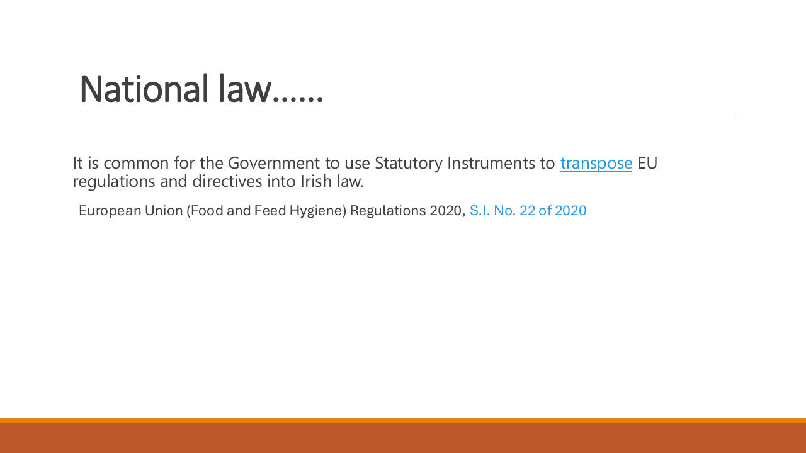

### National law……

It is common for the Government to use Statutory Instruments to transpose EU
regulations and directives into Irish law.

European Union (Food and Feed Hygiene) Regulations 2020, S.I. No. 22 of 2020

## Slide 440

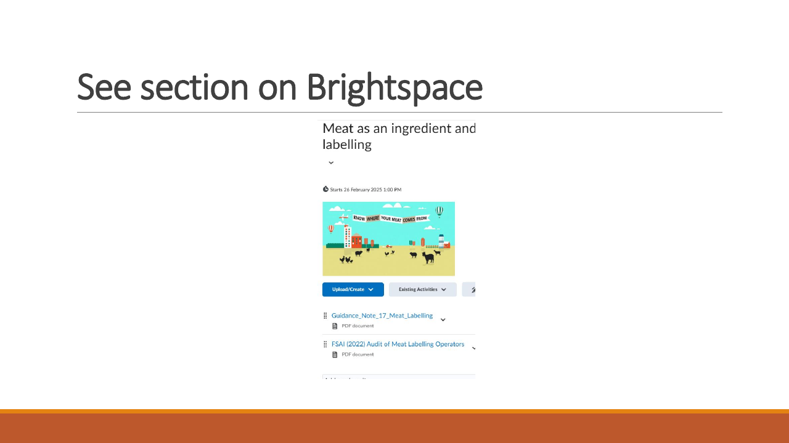

### See section on Brightspace

## Slide 441

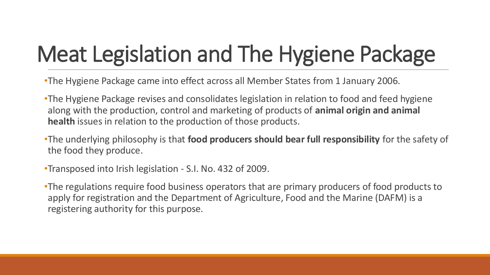

### Meat Legislation and The Hygiene Package

- The Hygiene Package came into effect across all Member States from 1 January 2006.

- The Hygiene Package revises and consolidates legislation in relation to food and feed hygiene along with the production, control and marketing of products of animal origin and animal health issues in relation to the production of those products.

- The underlying philosophy is that food producers should bear full responsibility for the safety of the food they produce.

- Transposed into Irish legislation - S.I. No. 432 of 2009.

- The regulations require food business operators that are primary producers of food products to apply for registration and the Department of Agriculture, Food and the Marine (DAFM) is a registering authority for this purpose.

## Slide 442

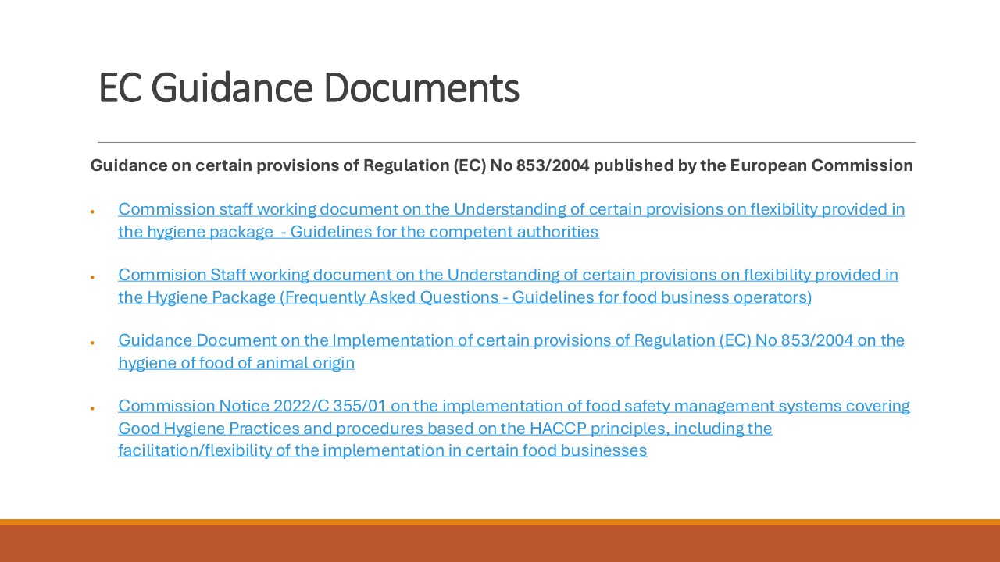

### EC Guidance Documents

Guidance on certain provisions of Regulation (EC) No 853/2004 published by the European Commission

- Commission staff working document on the Understanding of certain provisions on flexibility provided in

the hygiene package - Guidelines for the competent authorities

- Commision Staff working document on the Understanding of certain provisions on flexibility provided in

the Hygiene Package (Frequently Asked Questions - Guidelines for food business operators)

- Guidance Document on the Implementation of certain provisions of Regulation (EC) No 853/2004 on the

hygiene of food of animal origin

- Commission Notice 2022/C 355/01 on the implementation of food safety management systems covering

Good Hygiene Practices and procedures based on the HACCP principles, including the
facilitation/flexibility of the implementation in certain food businesses

## Slide 443

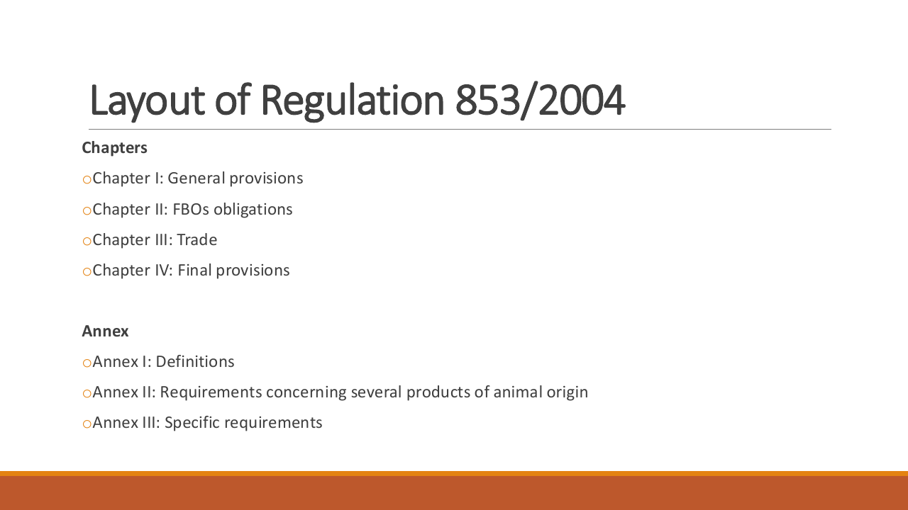

### Layout of Regulation 853/2004 Chapters Annex

- Chapter I: General provisions

- Chapter II: FBOs obligations

- Chapter III: Trade

- Chapter IV: Final provisions

- Annex I: Definitions

- Annex II: Requirements concerning several products of animal origin

- Annex III: Specific requirements

## Slide 444

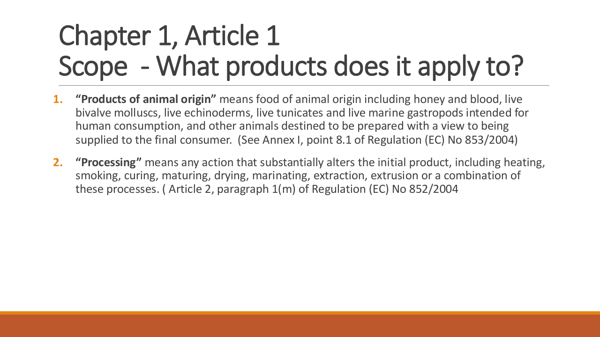

### Chapter 1, Article 1 — Scope  - What products does it apply to?

1.

2.

“Products of animal origin” means food of animal origin including honey and blood, live
bivalve molluscs, live echinoderms, live tunicates and live marine gastropods intended for
human consumption, and other animals destined to be prepared with a view to being
supplied to the final consumer.  (See Annex I, point 8.1 of Regulation (EC) No 853/2004)

“Processing” means any action that substantially alters the initial product, including heating,
smoking, curing, maturing, drying, marinating, extraction, extrusion or a combination of
these processes. ( Article 2, paragraph 1(m) of Regulation (EC) No 852/2004

## Slide 445

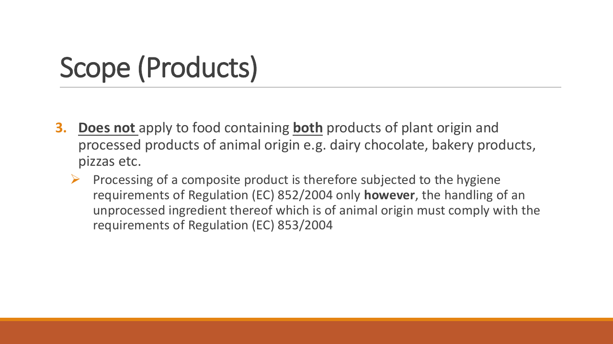

### Scope (Products)

3. Does not apply to food containing both products of plant origin and

processed products of animal origin e.g. dairy chocolate, bakery products,
pizzas etc.

- Processing of a composite product is therefore subjected to the hygiene

requirements of Regulation (EC) 852/2004 only however, the handling of an
unprocessed ingredient thereof which is of animal origin must comply with the
requirements of Regulation (EC) 853/2004

## Slide 446

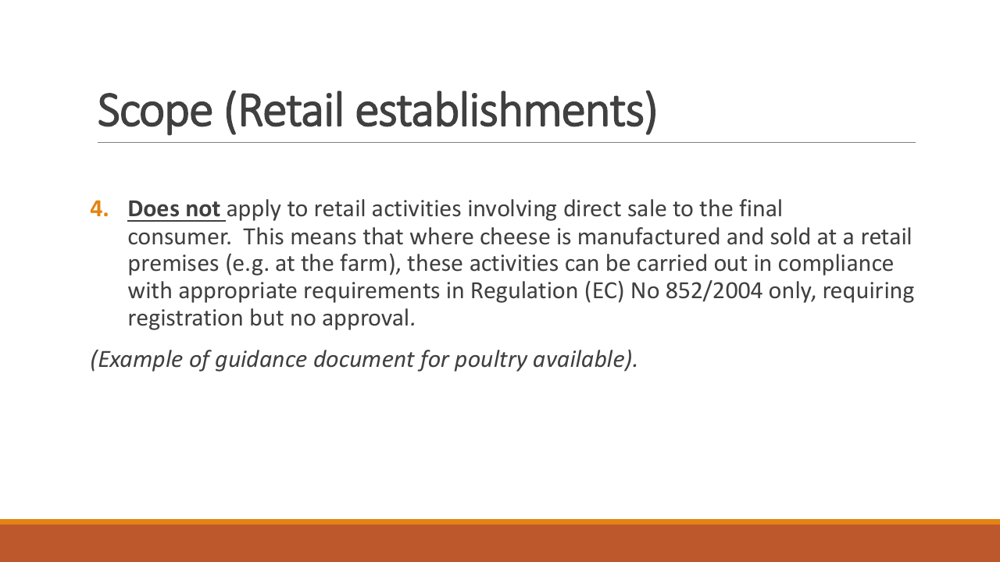

### Scope (Retail establishments)

4. Does not apply to retail activities involving direct sale to the final

consumer. This means that where cheese is manufactured and sold at a retail
premises (e.g. at the farm), these activities can be carried out in compliance
with appropriate requirements in Regulation (EC) No 852/2004 only, requiring
registration but no approval.

(Example of guidance document for poultry available).

## Slide 447

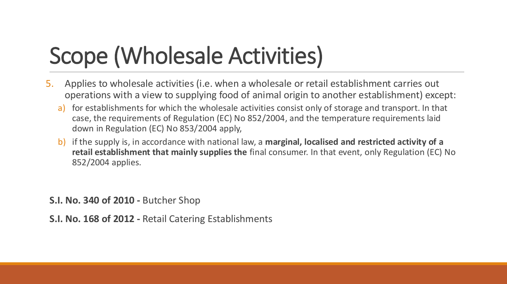

### Scope (Wholesale Activities) a) b)

5. Applies to wholesale activities (i.e. when a wholesale or retail establishment carries out

- perations with a view to supplying food of animal origin to another establishment) except: for establishments for which the wholesale activities consist only of storage and transport. In that case, the requirements of Regulation (EC) No 852/2004, and the temperature requirements laid down in Regulation (EC) No 853/2004 apply, if the supply is, in accordance with national law, a marginal, localised and restricted activity of a retail establishment that mainly supplies the final consumer. In that event, only Regulation (EC) No 852/2004 applies.

S.I. No. 340 of 2010 - Butcher Shop

S.I. No. 168 of 2012 - Retail Catering Establishments

## Slide 448

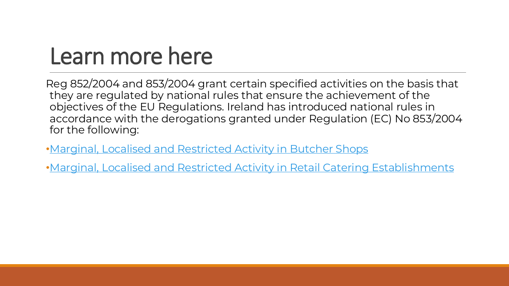

### Learn more here

Reg 852/2004 and 853/2004 grant certain specified activities on the basis that
they are regulated by national rules that ensure the achievement of the
- bjectives of the EU Regulations. Ireland has introduced national rules in accordance with the derogations granted under Regulation (EC) No 853/2004 for the following:

- Marginal, Localised and Restricted Activity in Butcher Shops

- Marginal, Localised and Restricted Activity in Retail Catering Establishments

## Slide 449

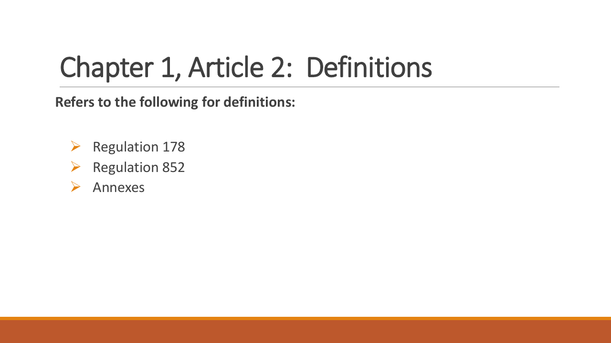

### Chapter 1, Article 2:  Definitions

Refers to the following for definitions:

- Regulation 178
- Regulation 852
- Annexes

## Slide 450

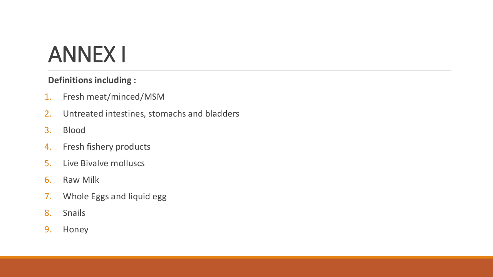

### Annex I — Definitions *(Regulation 853/2004)*

Definitions including:

1. Fresh meat / minced meat / MSM (mechanically separated meat)
2. Untreated intestines, stomachs and bladders
3. Blood
4. Fresh fishery products
5. Live Bivalve molluscs
6. Raw Milk
7. Whole Eggs and liquid egg
8. Snails
9. Honey

## Slide 451

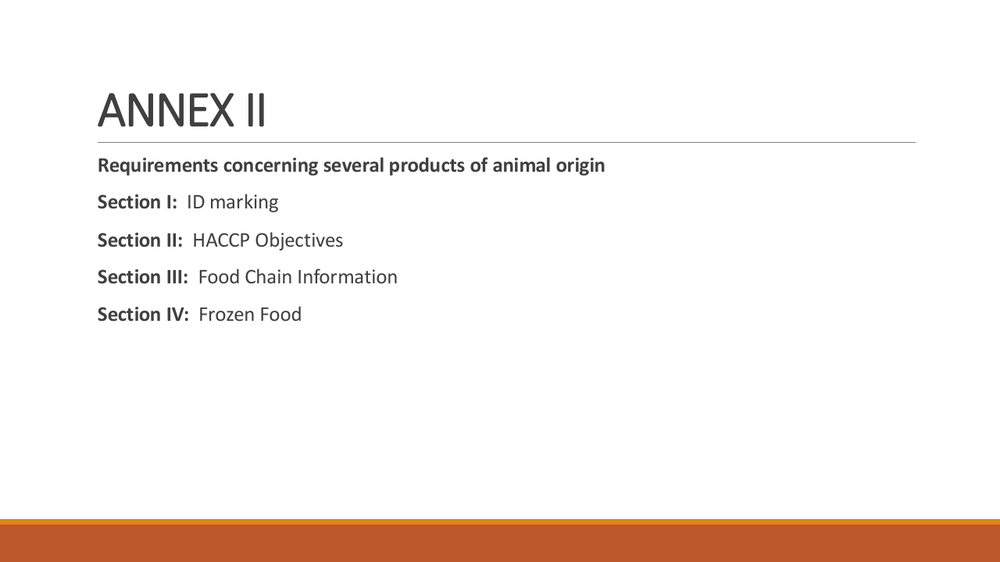

### ANNEX II

Requirements concerning several products of animal origin

Section I:  ID marking

Section II:  HACCP Objectives

Section III:  Food Chain Information

Section IV:  Frozen Food

## Slide 452

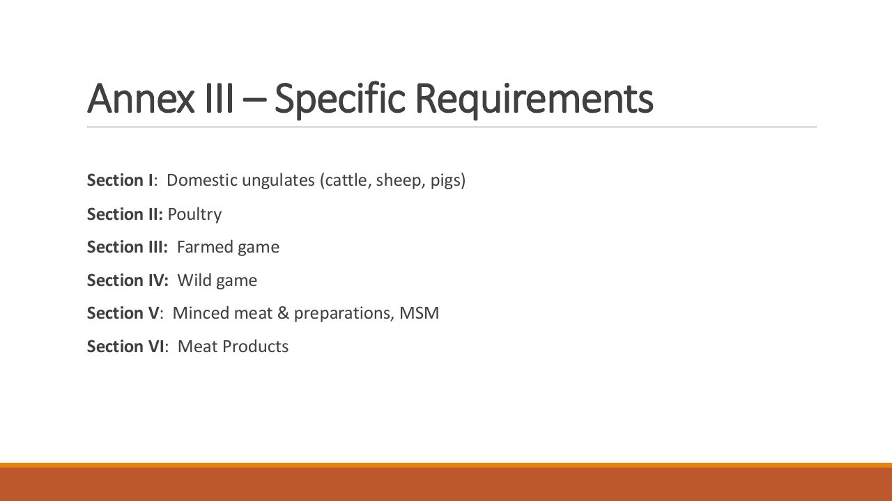

### Annex III – Specific Requirements

Section I:  Domestic ungulates (cattle, sheep, pigs)

Section II: Poultry

Section III:  Farmed game

Section IV:  Wild game

Section V:  Minced meat & preparations, MSM

Section VI:  Meat Products

## Slide 453

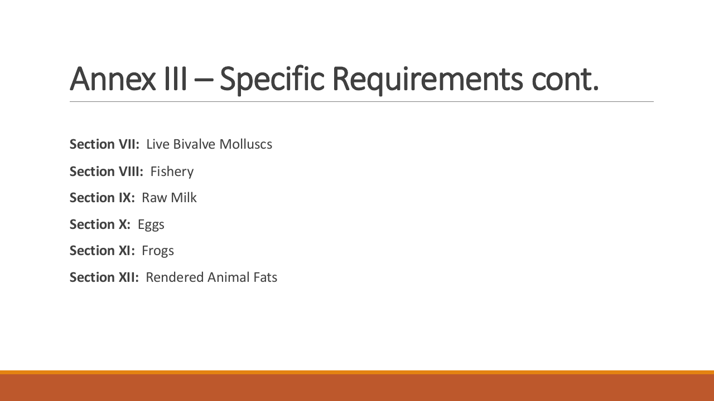

### Annex III – Specific Requirements cont.

Section VII:  Live Bivalve Molluscs

Section VIII:  Fishery

Section IX:  Raw Milk

Section X:  Eggs

Section XI:  Frogs

Section XII:  Rendered Animal Fats

## Slide 454

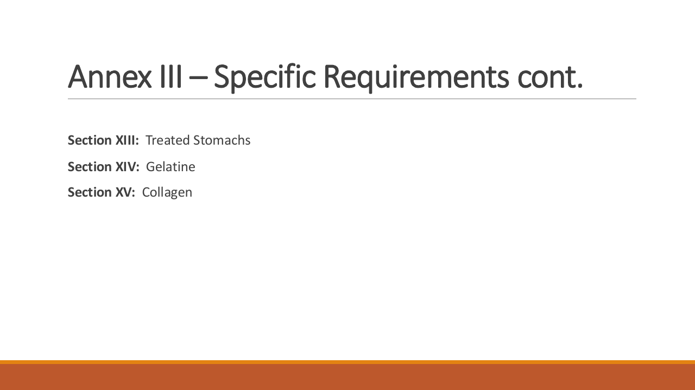

### Annex III – Specific Requirements cont.

Section XIII:  Treated Stomachs

Section XIV:  Gelatine

Section XV:  Collagen

## Slide 455

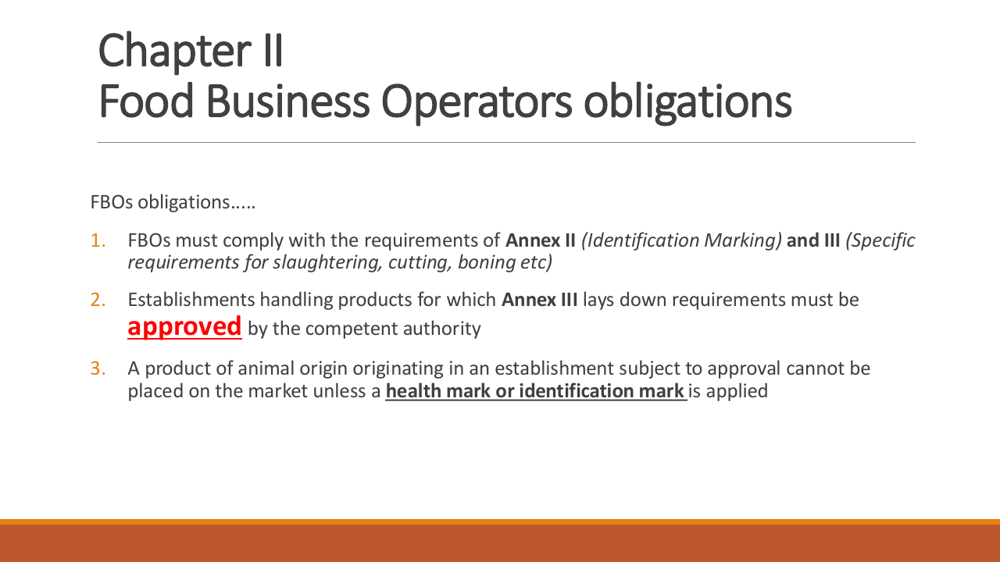

### Chapter II Food Business Operators obligations

FBOs obligations.....

1.

2.

FBOs must comply with the requirements of Annex II (Identification Marking) and III (Specific
requirements for slaughtering, cutting, boning etc)

Establishments handling products for which Annex III lays down requirements must be
approved by the competent authority

3. A product of animal origin originating in an establishment subject to approval cannot be

placed on the market unless a health mark or identification mark is applied

## Slide 456

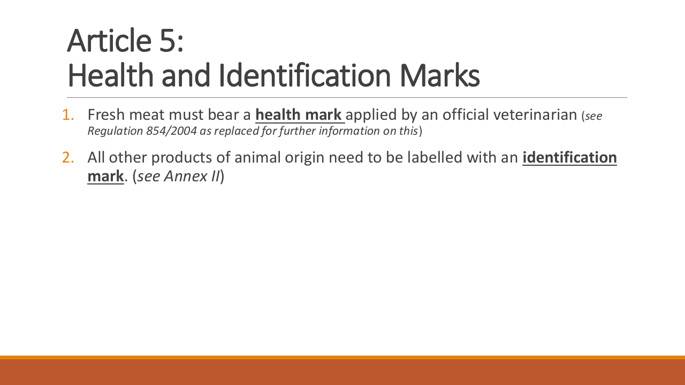

### Article 5:Health and Identification Marks

1. Fresh meat must bear a health mark applied by an official veterinarian (see

Regulation 854/2004 as replaced for further information on this)

2. All other products of animal origin need to be labelled with an identification

mark. (see Annex II)

## Slide 457

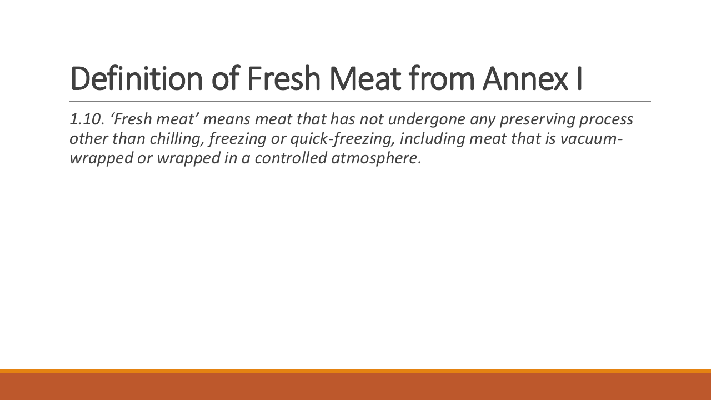

### Definition of Fresh Meat from Annex I

1.10. ‘Fresh meat’ means meat that has not undergone any preserving process
- ther than chilling, freezing or quick-freezing, including meat that is vacuum- wrapped or wrapped in a controlled atmosphere.

## Slide 458

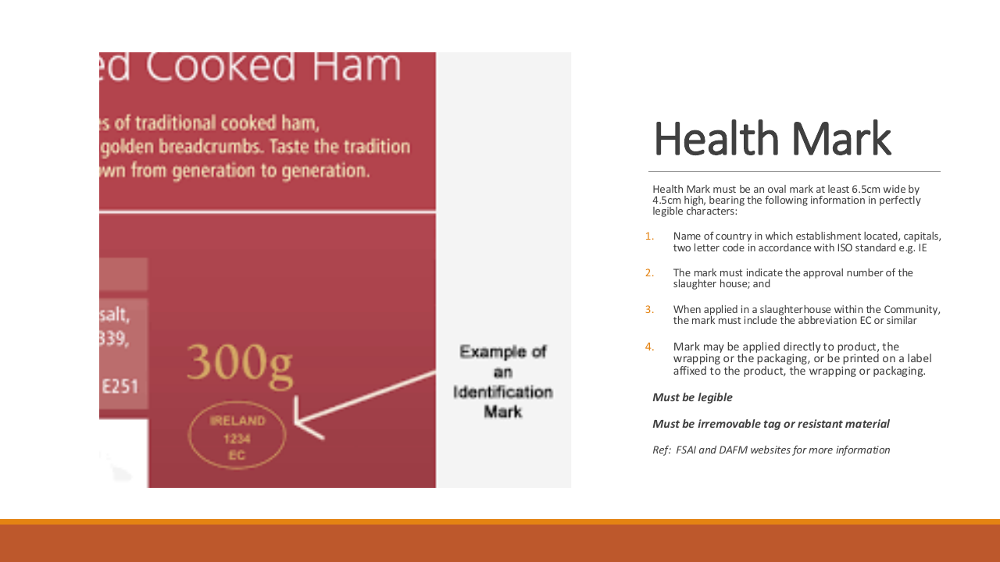

### Health Mark Must be legible

Health Mark must be an oval mark at least 6.5cm wide by
4.5cm high, bearing the following information in perfectly
legible characters:

1.

2.

Name of country in which establishment located, capitals,
two letter code in accordance with ISO standard e.g. IE

The mark must indicate the approval number of the
slaughter house; and

3. When applied in a slaughterhouse within the Community, the mark must include the abbreviation EC or similar

4. Mark may be applied directly to product, the

wrapping or the packaging, or be printed on a label
affixed to the product, the wrapping or packaging.

Must be irremovable tag or resistant material

Ref:  FSAI and DAFM websites for more information

## Slide 459

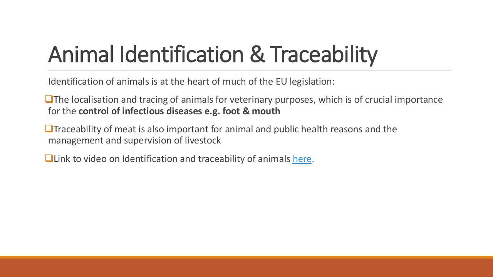

### Animal Identification & Traceability

Identification of animals is at the heart of much of the EU legislation:

- The localisation and tracing of animals for veterinary purposes, which is of crucial importance for the control of infectious diseases e.g. foot & mouth

- Traceability of meat is also important for animal and public health reasons and the management and supervision of livestock

- Link to video on Identification and traceability of animals here.

## Slide 460

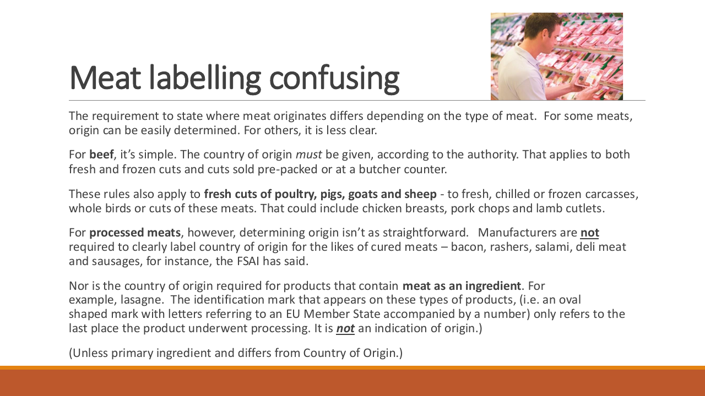

### Meat labelling confusing

The requirement to state where meat originates differs depending on the type of meat.  For some meats,
- rigin can be easily determined. For others, it is less clear.

For beef, it’s simple. The country of origin must be given, according to the authority. That applies to both
fresh and frozen cuts and cuts sold pre-packed or at a butcher counter.

These rules also apply to fresh cuts of poultry, pigs, goats and sheep - to fresh, chilled or frozen carcasses,
whole birds or cuts of these meats. That could include chicken breasts, pork chops and lamb cutlets.

For processed meats, however, determining origin isn’t as straightforward. Manufacturers are not
required to clearly label country of origin for the likes of cured meats – bacon, rashers, salami, deli meat
and sausages, for instance, the FSAI has said.

Nor is the country of origin required for products that contain meat as an ingredient. For
example, lasagne. The identification mark that appears on these types of products, (i.e. an oval
shaped mark with letters referring to an EU Member State accompanied by a number) only refers to the
last place the product underwent processing. It is not an indication of origin.)

(Unless primary ingredient and differs from Country of Origin.)

## Slide 461

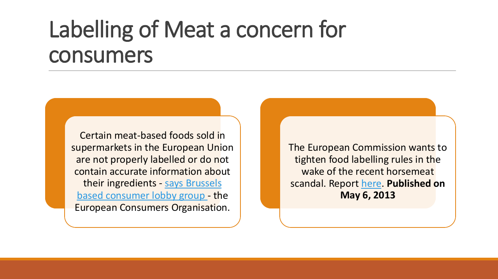

### Labelling of Meat — A Concern for Consumers

- Certain meat-based foods sold in supermarkets in the European Union are not properly labelled or do not contain accurate information about their ingredients — *says Brussels-based consumer lobby group, the European Consumers Organisation.*

- The European Commission wants to tighten food labelling rules in the wake of the recent **horsemeat scandal**. *(Published May 6, 2013)*

## Slide 462

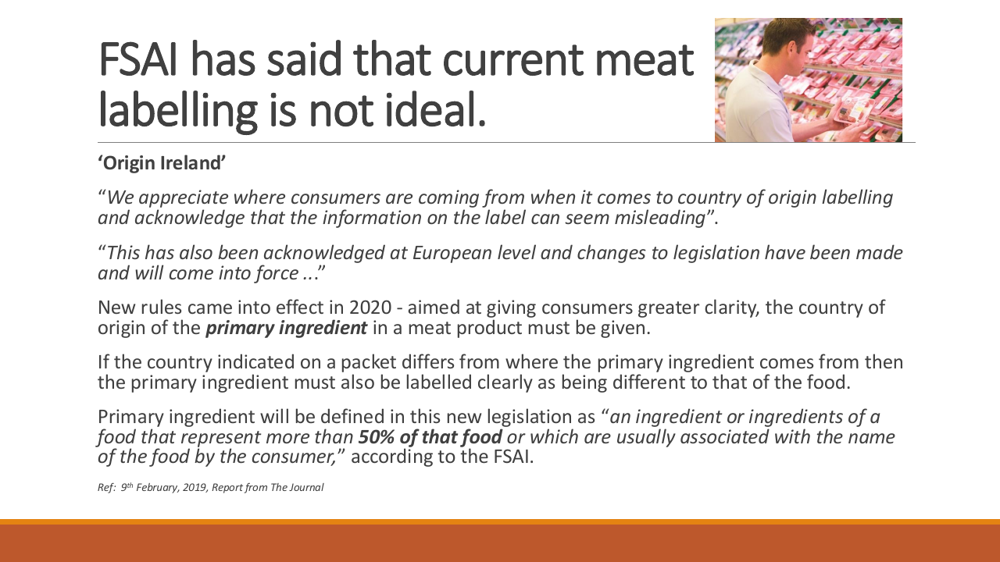

### FSAI has said that current meat labelling is not ideal.

‘Origin Ireland’

“We appreciate where consumers are coming from when it comes to country of origin labelling
and acknowledge that the information on the label can seem misleading”.

“This has also been acknowledged at European level and changes to legislation have been made
and will come into force ...”

New rules came into effect in 2020 - aimed at giving consumers greater clarity, the country of
- rigin of the primary ingredient in a meat product must be given.

If the country indicated on a packet differs from where the primary ingredient comes from then
the primary ingredient must also be labelled clearly as being different to that of the food.

Primary ingredient will be defined in this new legislation as “an ingredient or ingredients of a
food that represent more than 50% of that food or which are usually associated with the name
- f the food by the consumer,” according to the FSAI.

Ref:  9th February, 2019, Report from The Journal

## Slide 463

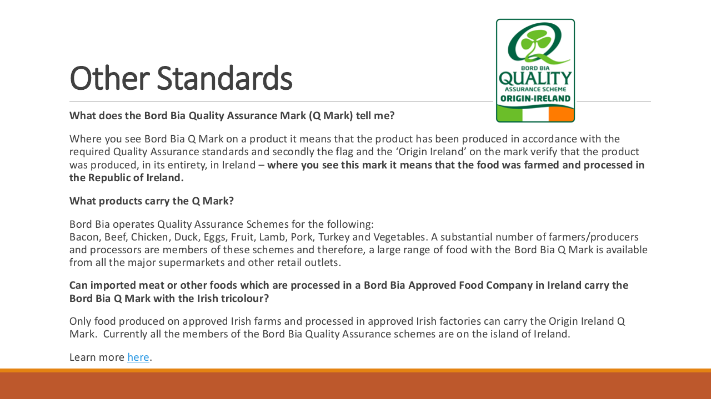

### Other Standards

What does the Bord Bia Quality Assurance Mark (Q Mark) tell me?

Where you see Bord Bia Q Mark on a product it means that the product has been produced in accordance with the
required Quality Assurance standards and secondly the flag and the ‘Origin Ireland’ on the mark verify that the product
was produced, in its entirety, in Ireland – where you see this mark it means that the food was farmed and processed in
the Republic of Ireland.

What products carry the Q Mark?

Bord Bia operates Quality Assurance Schemes for the following:
Bacon, Beef, Chicken, Duck, Eggs, Fruit, Lamb, Pork, Turkey and Vegetables. A substantial number of farmers/producers
and processors are members of these schemes and therefore, a large range of food with the Bord Bia Q Mark is available
from all the major supermarkets and other retail outlets.

Can imported meat or other foods which are processed in a Bord Bia Approved Food Company in Ireland carry the
Bord Bia Q Mark with the Irish tricolour?

Only food produced on approved Irish farms and processed in approved Irish factories can carry the Origin Ireland Q
Mark.  Currently all the members of the Bord Bia Quality Assurance schemes are on the island of Ireland.

Learn more here.

## Slide 464

### HACCP Training: Annex II Chapter XII Para 2

Those responsible for the development and maintenance of HACCP based procedures or for the
- peration of relevant guides must receive adequate training in the application of the HACCP principles

- Adequate training:

- Does not necessarily involve participation in training courses

- Could be achieved through information campaigns from professional organisations or from the competent authorities

- Should be proportionate to the size and the nature of the business.

See - FSAI Food Safety Training Booklet

## Slide 465

### FSAI Food Safety Training Standard updated

## Slide 466

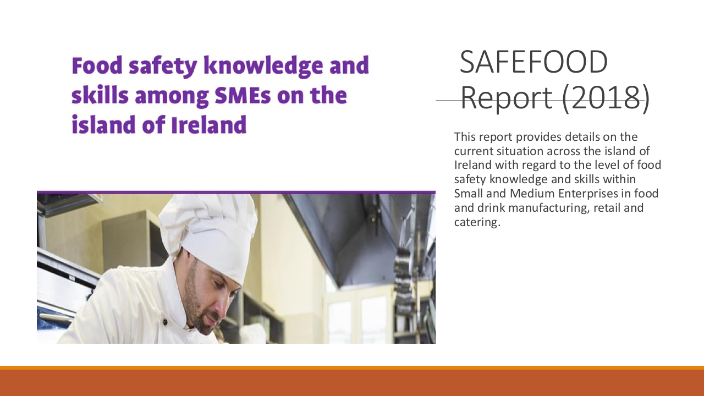

### SAFEFOOD Report (2018)

This report provides details on the
current situation across the island of
Ireland with regard to the level of food
safety knowledge and skills within
Small and Medium Enterprises in food
and drink manufacturing, retail and
catering.

## Slide 467

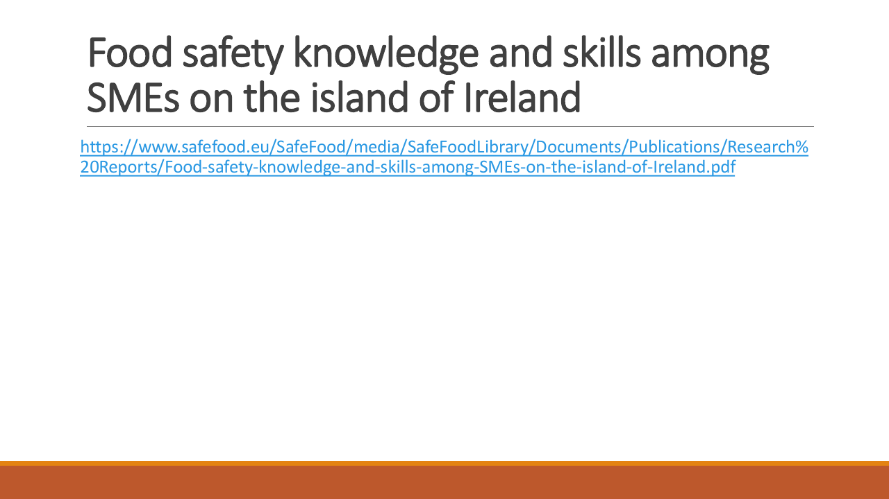

### Food safety knowledge and skills among — SMEs on the island of Ireland

https://www.safefood.eu/SafeFood/media/SafeFoodLibrary/Documents/Publications/Research%20Reports/Food-safety-knowledge-and-skills-among-SMEs-on-the-island-of-Ireland.pdf

## Slide 468

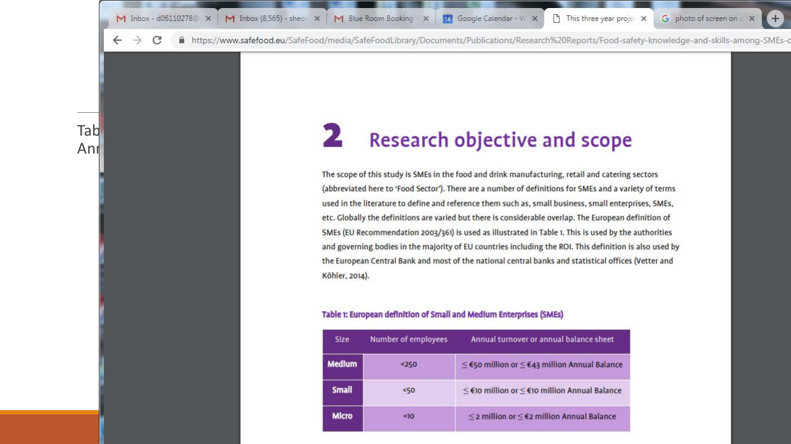

### Table 1: European definition of Small and Medium Enterprises (SMEs) Size Number of employees

Annual turnover or annual balance sheet Medium

## Slide 469

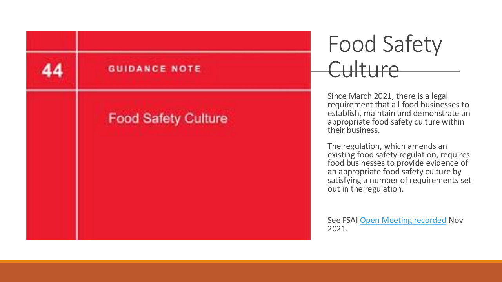

### Food Safety Culture

Since March 2021, there is a legal
requirement that all food businesses to
establish, maintain and demonstrate an
appropriate food safety culture within
their business.

The regulation, which amends an
existing food safety regulation, requires
food businesses to provide evidence of
an appropriate food safety culture by
satisfying a number of requirements set
- ut in the regulation.

See FSAI Open Meeting recorded Nov
2021.

## Slide 470

### FSAI eModules available here

## Slide 471

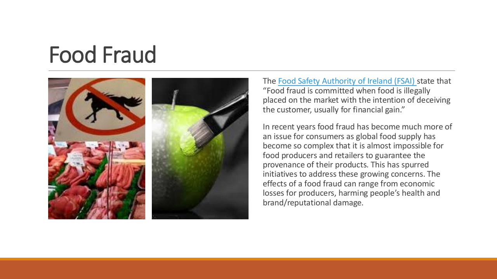

### Food Fraud

The Food Safety Authority of Ireland (FSAI) state that
             “Food fraud is committed when food is illegally
             placed on the market with the intention of deceiving
             the customer, usually for financial gain.”
             In recent years food fraud has become much more of
             an issue for consumers as global food supply has
             become so complex that it is almost impossible for
             food producers and retailers to guarantee the
             provenance of their products. This has spurred
             initiatives to address these growing concerns. The
             effects of a food fraud can range from economic
             losses for producers, harming people’s health and
             brand/reputational damage.

## Slide 472

### HACCP, TACCP and VACCP

TACCP and VACCP address threats and vulnerabilities instead of hazards.

TACCP stands for Threat Assessment and Critical Control Points. This protocol
focuses on tampering, intentional adulteration of food, and food defence.

VACCP stands for Vulnerability Assessment and Critical Control Points. It
focuses on food fraud as well, and widens the scope to include systematic
prevention of any potential adulteration of food, whether intentional or not, by
identifying the vulnerable points in a supply chain. It is especially concerned
with economically motivated adulteration (EMA).

## Slide 473

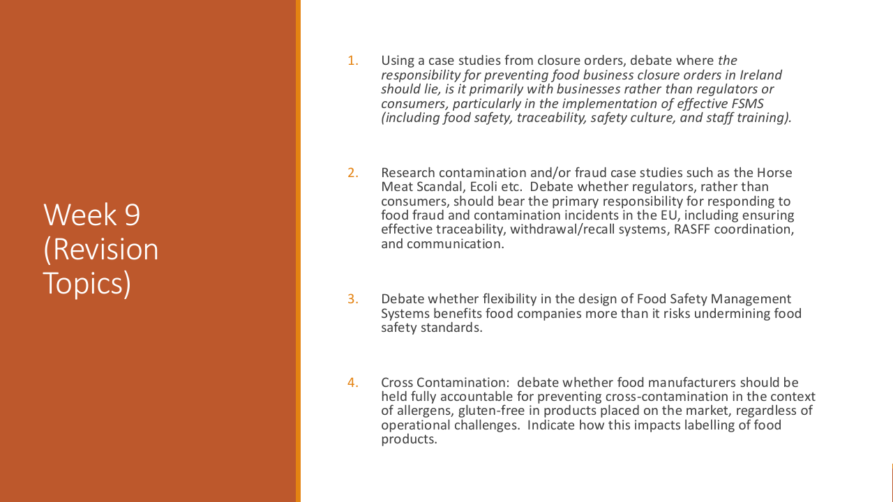

1. Using a case studies from closure orders, debate where the
                 responsibility for preventing food business closure orders in Ireland
                 should lie, is it primarily with businesses rather than regulators or
                 consumers, particularly in the implementation of effective FSMS
                 (including food safety, traceability, safety culture, and staff training).

2. Research contamination and/or fraud case studies such as the Horse
                 Meat Scandal, Ecoli etc. Debate whether regulators, rather than
                 consumers, should bear the primary responsibility for responding to
Week 9           food fraud and contamination incidents in the EU, including ensuring
                 effective traceability, withdrawal/recall systems, RASFF coordination,
(Revision        and communication.

Topics)     3.   Debate whether flexibility in the design of Food Safety Management
                 Systems benefits food companies more than it risks undermining food
                 safety standards.

4. Cross Contamination: debate whether food manufacturers should be
                 held fully accountable for preventing cross-contamination in the context
    - f allergens, gluten-free in products placed on the market, regardless of
    - perational challenges. Indicate how this impacts labelling of food products.

## Slide 474

### Questions

## Slide 475

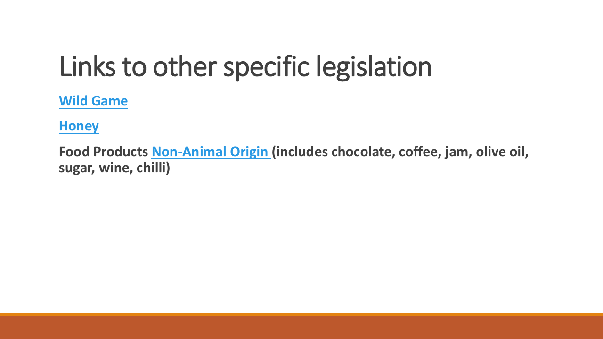

### Wild Game Honey

Links to other specific legislation

Food Products Non-Animal Origin (includes chocolate, coffee, jam, olive oil,
sugar, wine, chilli)

## Slide 476

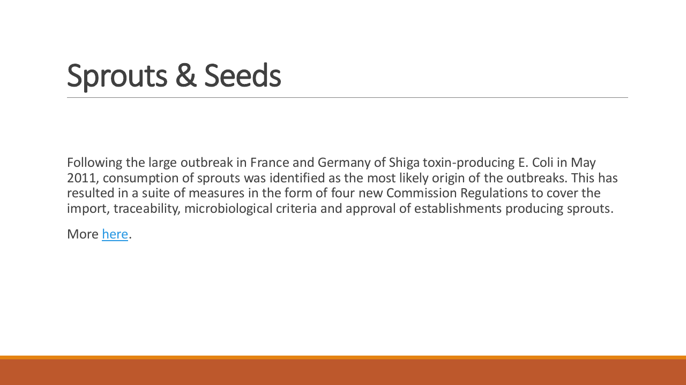

### Sprouts & Seeds

Following the large outbreak in France and Germany of Shiga toxin-producing E. Coli in May
2011, consumption of sprouts was identified as the most likely origin of the outbreaks. This has
resulted in a suite of measures in the form of four new Commission Regulations to cover the
import, traceability, microbiological criteria and approval of establishments producing sprouts.

More here.

## Slide 477

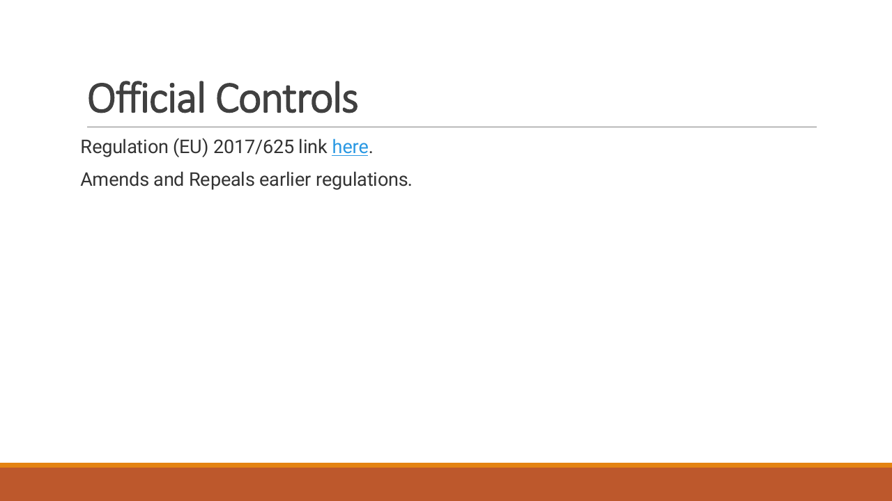

### Official Controls

Regulation (EU) 2017/625 link here.

Amends and Repeals earlier regulations.

## Slide 478

### Questions

---

