<!-- Source: 00_resources/2026 Food Law slides — reflowed.md -->
<!-- Generated from Table of Contents entry 8. -->

# Lecture 8 — Week 11 (14 April 2026): Revision Lecture 1 of 2

**Topics:** Revision recap · food scares & fraud · enforcement pyramid · green laws · EU consumer-empowerment directive · Organic recap

**Slides:** 479–511 (33 slides)

## Slide 479

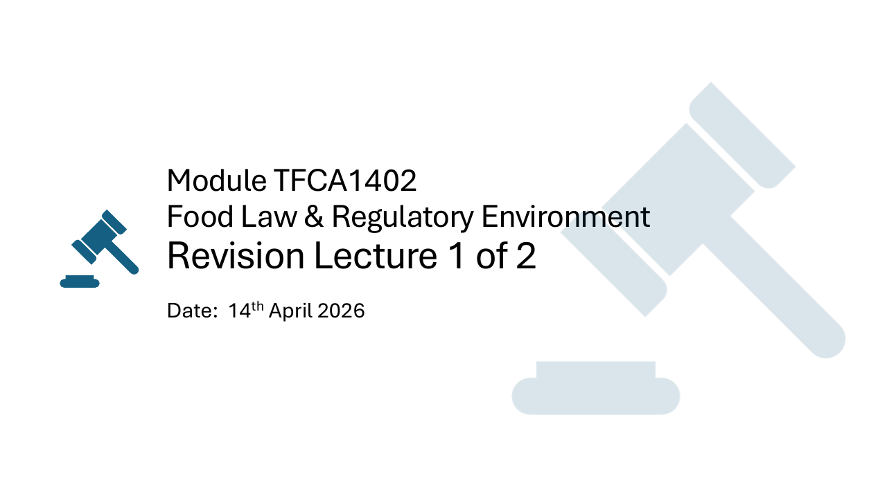

### Food Law & Regulatory Environment — *Course Title Slide*

*(Course title slide — see image for module / lecturer / date metadata.)*

Raw text:

```
Module TFCA1402
Food Law & Regulatory Environment
Revision Lecture 1 of 2
Date:  14th April 2026
```

## Slide 480

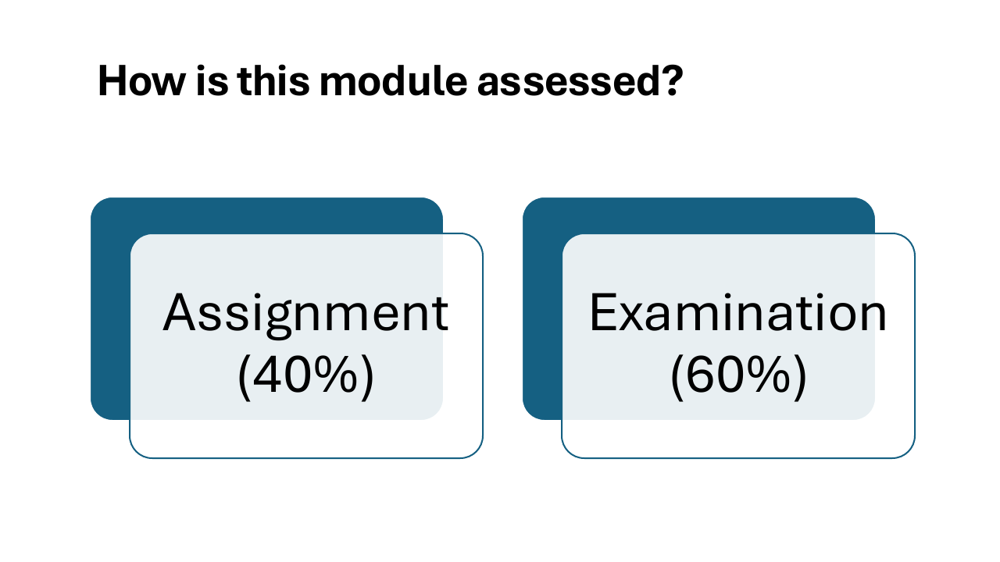

### How is this module assessed?

Assignment          Examination
     (40%)                (60%)

## Slide 481

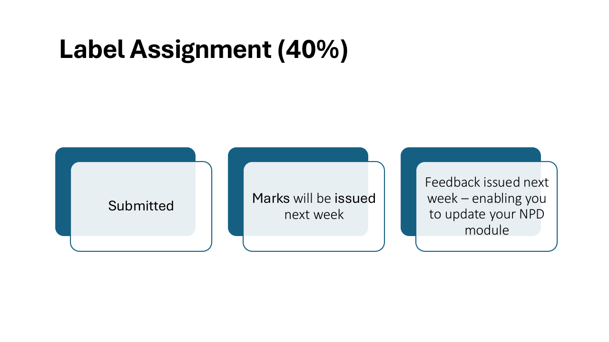

### Label Assignment (40%) Feedback issued next Submitted module

Marks will be issued   week – enabling you
                   next week           to update your NPD

## Slide 482

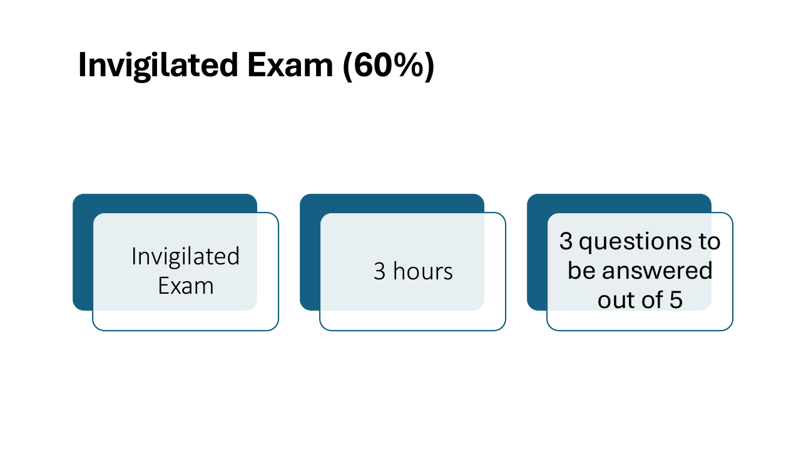

### Invigilated Exam (60%)

3 questions to
   Invigilated
                  3 hours    be answered
      Exam
    - ut of 5

## Slide 483

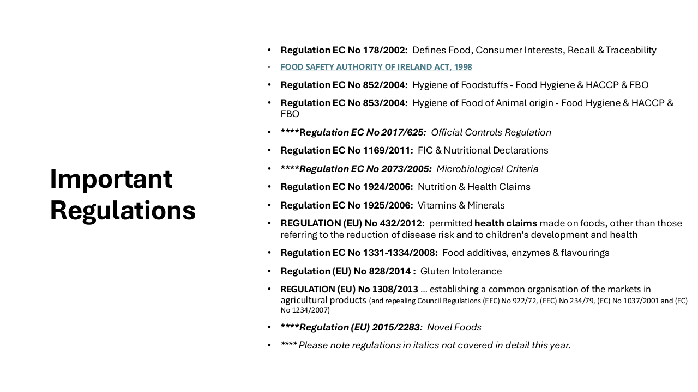

### FBO Important No 1234/2007)

- Regulation EC No 178/2002: Defines Food, Consumer Interests, Recall & Traceability
    - FOOD SAFETY AUTHORITY OF IRELAND ACT, 1998

    - Regulation EC No 852/2004: Hygiene of Foodstuffs - Food Hygiene & HACCP & FBO
    - Regulation EC No 853/2004: Hygiene of Food of Animal origin - Food Hygiene & HACCP &
    - ****Regulation EC No 2017/625: Official Controls Regulation
    - Regulation EC No 1169/2011: FIC & Nutritional Declarations

    - ****Regulation EC No 2073/2005: Microbiological Criteria
    - Regulation EC No 1924/2006: Nutrition & Health Claims

Regulations   • Regulation EC No 1925/2006: Vitamins & Minerals
    - REGULATION (EU) No 432/2012: permitted health claims made on foods, other than those referring to the reduction of disease risk and to children's development and health
    - Regulation EC No 1331-1334/2008: Food additives, enzymes & flavourings
    - Regulation (EU) No 828/2014 : Gluten Intolerance
    - REGULATION (EU) No 1308/2013 … establishing a common organisation of the markets in agricultural products (and repealing Council Regulations (EEC) No 922/72, (EEC) No 234/79, (EC) No 1037/2001 and (EC)

    - ****Regulation (EU) 2015/2283: Novel Foods
    - **** Please note regulations in italics not covered in detail this year.

## Slide 484

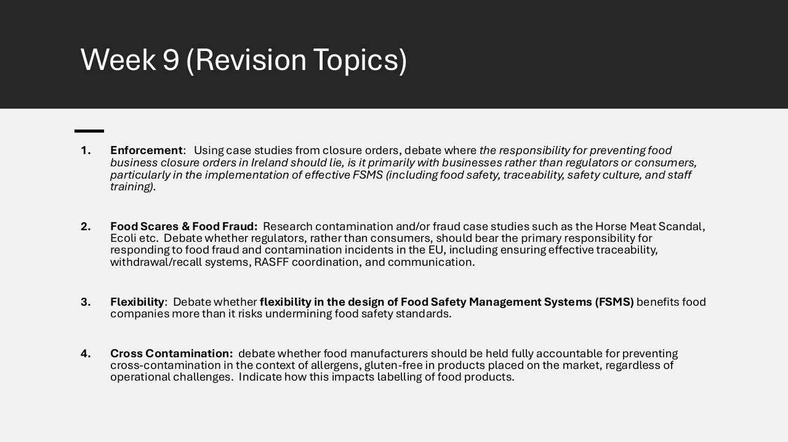

### Week 9 (Revision Topics)

1.

2.

3.

4.

Enforcement:   Using case studies from closure orders, debate where the responsibility for preventing food
business closure orders in Ireland should lie, is it primarily with businesses rather than regulators or consumers,
particularly in the implementation of effective FSMS (including food safety, traceability, safety culture, and staff
training).

Food Scares & Food Fraud:  Research contamination and/or fraud case studies such as the Horse Meat Scandal,
Ecoli etc.  Debate whether regulators, rather than consumers, should bear the primary responsibility for
responding to food fraud and contamination incidents in the EU, including ensuring effective traceability,
withdrawal/recall systems, RASFF coordination, and communication.

Flexibility:  Debate whether flexibility in the design of Food Safety Management Systems (FSMS) benefits food
companies more than it risks undermining food safety standards.

Cross Contamination:  debate whether food manufacturers should be held fully accountable for preventing
cross-contamination in the context of allergens, gluten-free in products placed on the market, regardless of
- perational challenges.  Indicate how this impacts labelling of food products.

## Slide 485


### Enforcement

## Slide 486

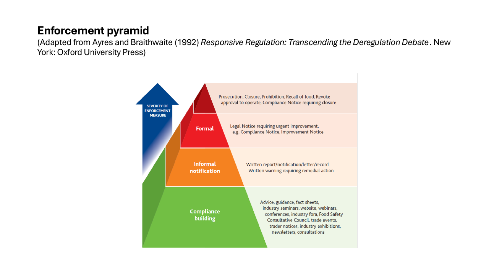

### Enforcement pyramid

(Adapted from Ayres and Braithwaite (1992) Responsive Regulation: Transcending the Deregulation Debate. New
York: Oxford University Press)

## Slide 487

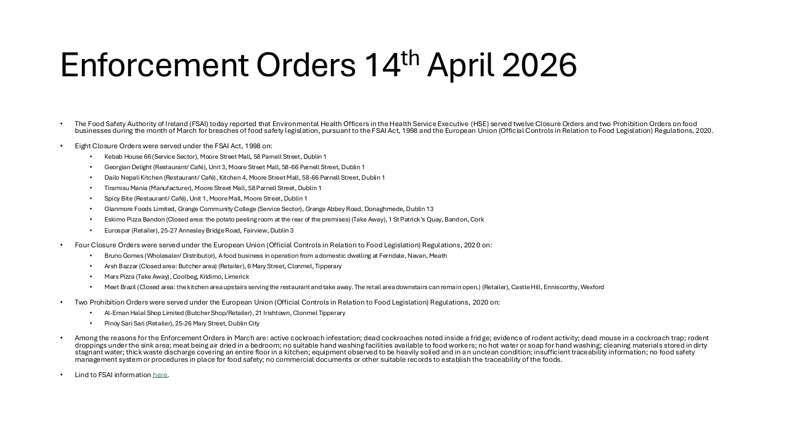

### Enforcement Orders 14th April 2026

- 

- 

- 

- 

- 

- 

The Food Safety Authority of Ireland (FSAI) today reported that Environmental Health Officers in the Health Service Executive (HSE) served twelve Closure Orders and two Prohibition Orders on food
businesses during the month of March for breaches of food safety legislation, pursuant to the FSAI Act, 1998 and the European Union (Official Controls in Relation to Food Legislation) Regulations, 2020.

Eight Closure Orders were served under the FSAI Act, 1998 on:

- 

- 

- 

- 

- 

- 

- 

- 

Kebab House 66 (Service Sector), Moore Street Mall, 58 Parnell Street, Dublin 1

Georgian Delight (Restaurant/ Café), Unit 3, Moore Street Mall, 58-66 Parnell Street, Dublin 1

Dailo Nepali Kitchen (Restaurant/ Café), Kitchen 4, Moore Street Mall, 58-66 Parnell Street, Dublin 1

Tiramisu Mania (Manufacturer), Moore Street Mall, 58 Parnell Street, Dublin 1

Spicy Bite (Restaurant/ Café), Unit 1, Moore Mall, Moore Street, Dublin 1

Glanmore Foods Limited, Grange Community College (Service Sector), Grange Abbey Road, Donaghmede, Dublin 13

Eskimo Pizza Bandon (Closed area: the potato peeling room at the rear of the premises) (Take Away), 1 St Patrick’s Quay, Bandon, Cork

Eurospar (Retailer), 25-27 Annesley Bridge Road, Fairview, Dublin 3

Four Closure Orders were served under the European Union (Official Controls in Relation to Food Legislation) Regulations, 202 0 on:

- 

- 

- 

- 

Bruno Gomes (Wholesaler/ Distributor), A food business in operation from a domestic dwelling at Ferndale, Navan, Meath

Arsh Bazzar (Closed area: Butcher area) (Retailer), 6 Mary Street, Clonmel, Tipperary

Mars Pizza (Take Away), Coolbeg, Kildimo, Limerick

Meet Brazil (Closed area: the kitchen area upstairs serving the restaurant and take away. The retail area downstairs can remain open.) (Retailer), Castle Hill, Enniscorthy, Wexford

Two Prohibition Orders were served under the European Union (Official Controls in Relation to Food Legislation) Regulations,  2020 on:

- 

- 

Al-Eman Halal Shop Limited (Butcher Shop/Retailer), 21 Irishtown, Clonmel Tipperary

Pinoy Sari Sari (Retailer), 25-26 Mary Street, Dublin City

Among the reasons for the Enforcement Orders in March are: active cockroach infestation; dead cockroaches noted inside a frid ge; evidence of rodent activity; dead mouse in a cockroach trap; rodent
droppings under the sink area; meat being air dried in a bedroom; no suitable hand washing facilities available to food workers; no hot water or soap for hand washing; cleaning materials stored in dirty
stagnant water; thick waste discharge covering an entire floor in a kitchen; equipment observed to be heavily soiled and in a n unclean condition; insufficient traceability information; no food safety
management system or procedures in place for food safety; no commercial documents or other suitable records to establish the traceability of the foods.

Lind to FSAI information here.

## Slide 488

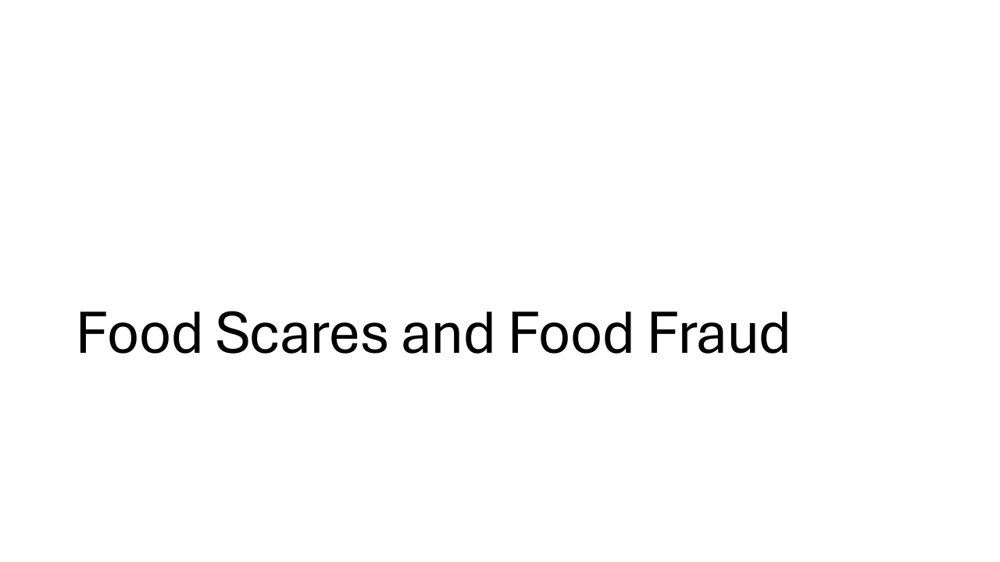

### Food Scares and Food Fraud

## Slide 489

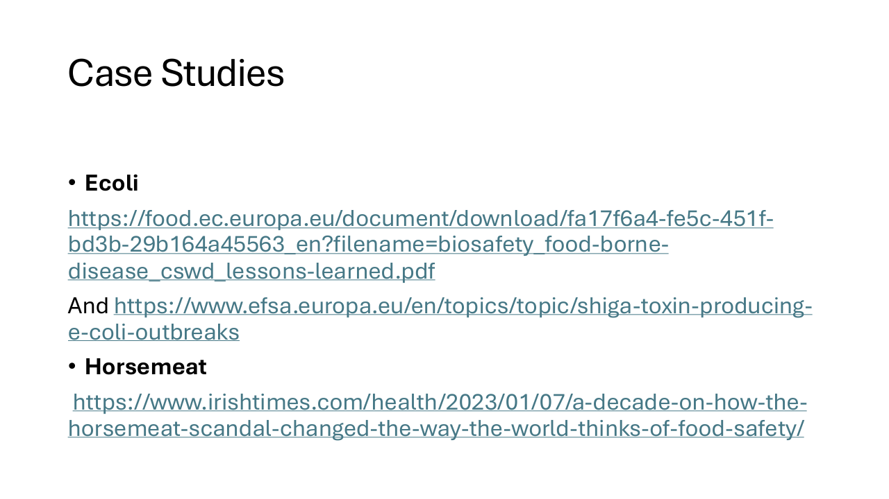

### Case Studies e-coli-outbreaks

- Ecoli https://food.ec.europa.eu/document/download/fa17f6a4-fe5c-451f- bd3b-29b164a45563_en?filename=biosafety_food-borne- disease_cswd_lessons-learned.pdf And https://www.efsa.europa.eu/en/topics/topic/shiga-toxin-producing-
- Horsemeat https://www.irishtimes.com/health/2023/01/07/a-decade-on-how-the-horsemeat-scandal-changed-the-way-the-world-thinks-of-food-safety/

## Slide 490

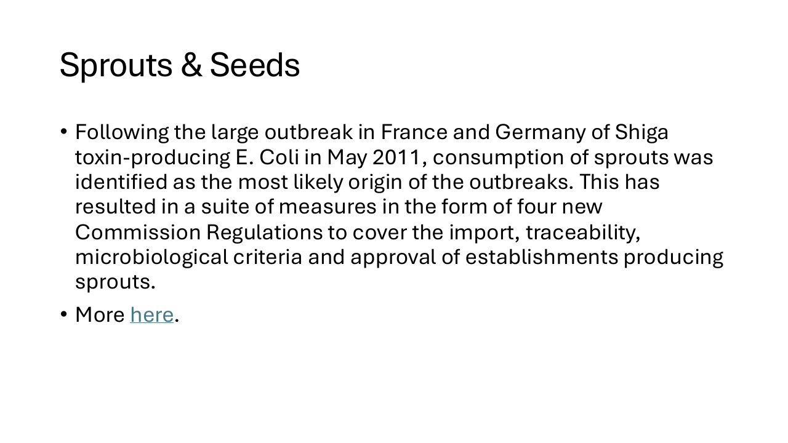

### Sprouts & Seeds

- Following the large outbreak in France and Germany of Shiga

toxin-producing E. Coli in May 2011, consumption of sprouts was
identified as the most likely origin of the outbreaks. This has
resulted in a suite of measures in the form of four new
Commission Regulations to cover the import, traceability,
microbiological criteria and approval of establishments producing
sprouts.
- More here.

## Slide 491

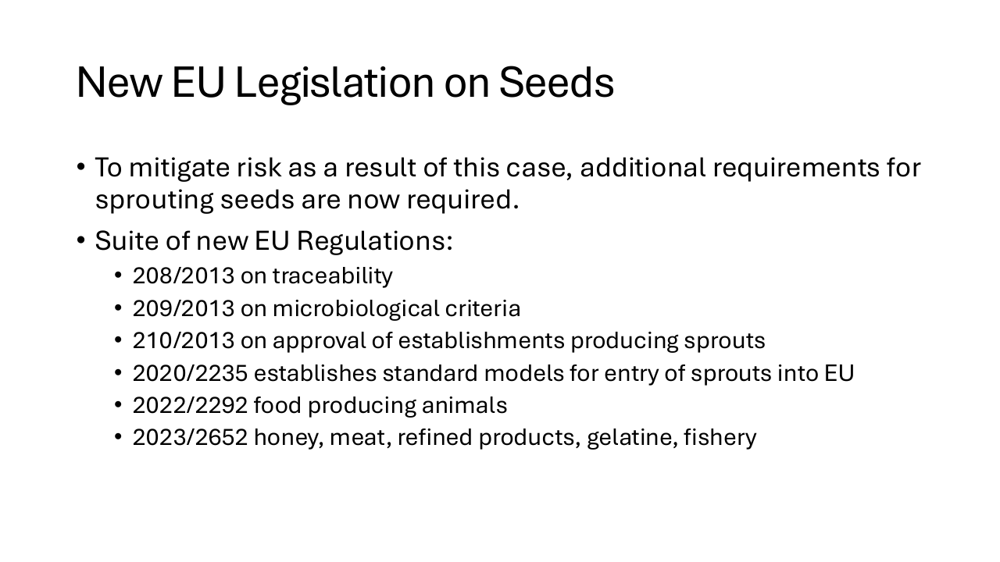

### New EU Legislation on Seeds

- To mitigate risk as a result of this case, additional requirements for

sprouting seeds are now required.

- Suite of new EU Regulations:
- 208/2013 on traceability
- 209/2013 on microbiological criteria
- 210/2013 on approval of establishments producing sprouts
- 2020/2235 establishes standard models for entry of sprouts into EU
- 2022/2292 food producing animals
- 2023/2652 honey, meat, refined products, gelatine, fishery

## Slide 492

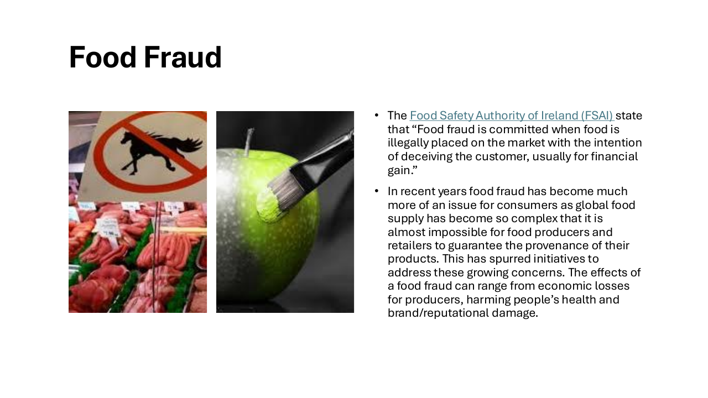

### Food Fraud

- The Food Safety Authority of Ireland (FSAI) state that “Food fraud is committed when food is illegally placed on the market with the intention
    - f deceiving the customer, usually for financial gain.”
    - In recent years food fraud has become much more of an issue for consumers as global food supply has become so complex that it is almost impossible for food producers and retailers to guarantee the provenance of their products. This has spurred initiatives to address these growing concerns. The effects of a food fraud can range from economic losses for producers, harming people’s health and brand/reputational damage.

## Slide 493

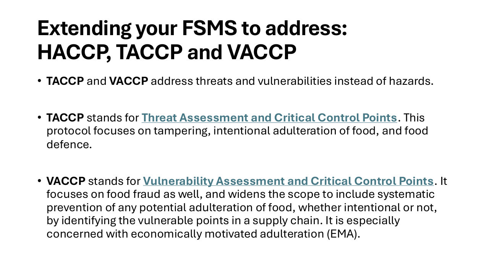

### Extending your FSMS to address: — HACCP, TACCP and VACCP

- TACCP and VACCP address threats and vulnerabilities instead of hazards.

- TACCP stands for Threat Assessment and Critical Control Points. This protocol focuses on tampering, intentional adulteration of food, and food defence.

- VACCP stands for Vulnerability Assessment and Critical Control Points. It focuses on food fraud as well, and widens the scope to include systematic prevention of any potential adulteration of food, whether intentional or not, by identifying the vulnerable points in a supply chain. It is especially concerned with economically motivated adulteration (EMA).

## Slide 494

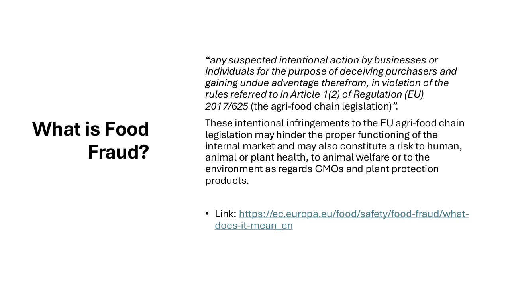

### “any suspected intentional action by businesses or

individuals for the purpose of deceiving purchasers and
               gaining undue advantage therefrom, in violation of the
               rules referred to in Article 1(2) of Regulation (EU)
               2017/625 (the agri-food chain legislation)”.

What is Food   These intentional infringements to the EU agri-food chain
               legislation may hinder the proper functioning of the
      Fraud?   internal market and may also constitute a risk to human,
               animal or plant health, to animal welfare or to the
               environment as regards GMOs and plant protection
               products.

    - Link: https://ec.europa.eu/food/safety/food-fraud/what- does-it-mean_en

## Slide 495

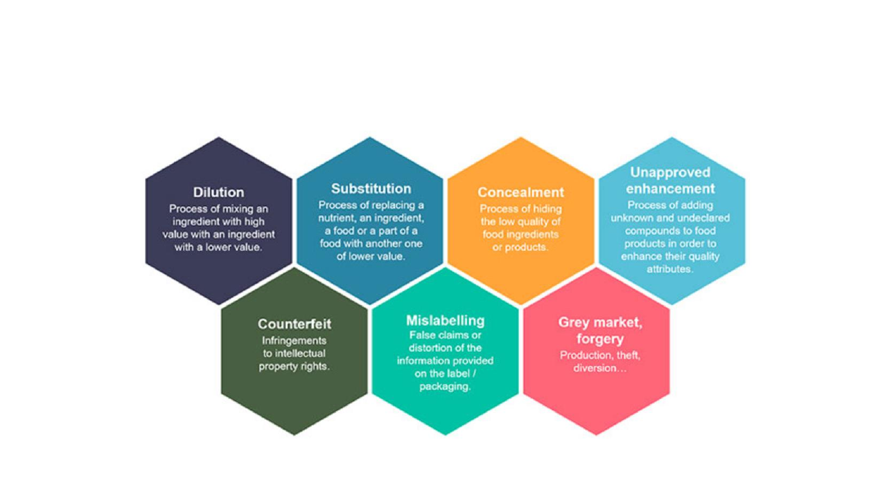

### Different types of Food Fraud

## Slide 496

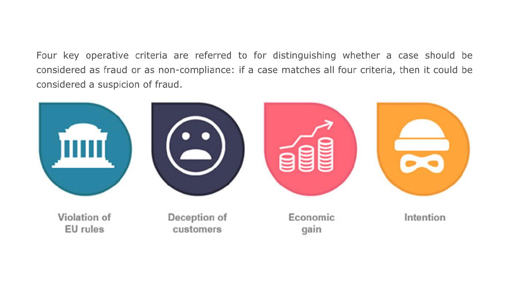

### *(Image-only slide — text is embedded as image.)*

> Four key operative criteria are referred to for distinguishing whether a case should be considered as fraud or as non-compliance: if a case matches all four criteria, then it could be considered a suspicion of fraud.

The four criteria (with icons):

1. **Violation of EU rules**
2. **Deception of customers**
3. **Economic gain**
4. **Intention**

## Slide 497

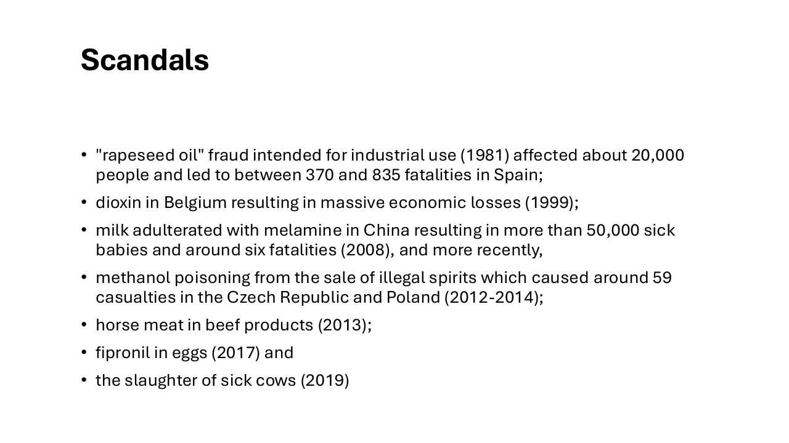

### Scandals

- "rapeseed oil" fraud intended for industrial use (1981) affected about 20,000

people and led to between 370 and 835 fatalities in Spain;

- dioxin in Belgium resulting in massive economic losses (1999)
- milk adulterated with melamine in China resulting in more than 50,000 sick

babies and around six fatalities (2008), and more recently,

- methanol poisoning from the sale of illegal spirits which caused around 59

casualties in the Czech Republic and Poland (2012-2014);

- horse meat in beef products (2013)
- fipronil in eggs (2017) and
- the slaughter of sick cows (2019)

## Slide 498

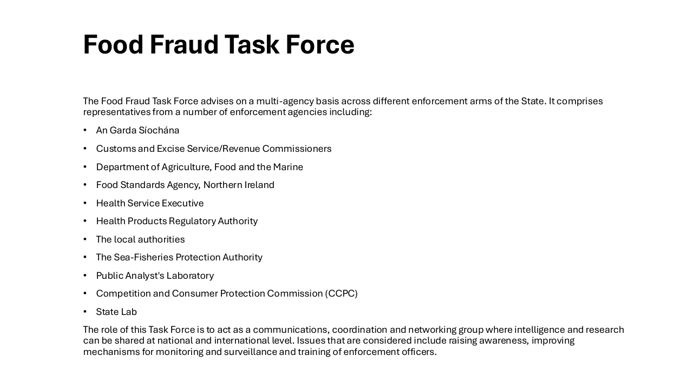

### Food Fraud Task Force

The Food Fraud Task Force advises on a multi-agency basis across different enforcement arms of the State. It comprises
representatives from a number of enforcement agencies including:

- An Garda Síochána

- Customs and Excise Service/Revenue Commissioners

- Department of Agriculture, Food and the Marine

- Food Standards Agency, Northern Ireland

- Health Service Executive

- Health Products Regulatory Authority

- The local authorities

- The Sea-Fisheries Protection Authority

- Public Analyst's Laboratory

- Competition and Consumer Protection Commission (CCPC)

- State Lab

The role of this Task Force is to act as a communications, coordination and networking group where intelligence and research
can be shared at national and international level. Issues that are considered include raising awareness, improving
mechanisms for monitoring and surveillance and training of enforcement officers.

## Slide 499

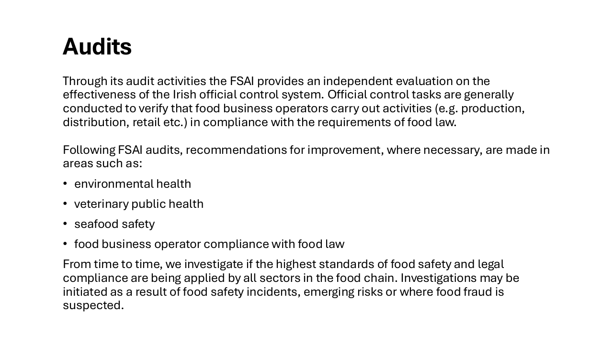

### Audits

Through its audit activities the FSAI provides an independent evaluation on the
effectiveness of the Irish official control system. Official control tasks are generally
conducted to verify that food business operators carry out activities (e.g. production,
distribution, retail etc.) in compliance with the requirements of food law.

Following FSAI audits, recommendations for improvement, where necessary, are made in
areas such as:
- environmental health
- veterinary public health
- seafood safety
- food business operator compliance with food law

From time to time, we investigate if the highest standards of food safety and legal
compliance are being applied by all sectors in the food chain. Investigations may be
initiated as a result of food safety incidents, emerging risks or where food fraud is
suspected.

## Slide 500

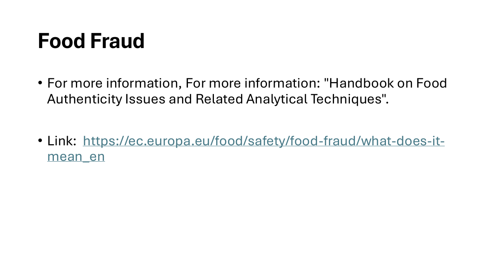

### Food Fraud mean_en

- For more information, For more information: "Handbook on Food

Authenticity Issues and Related Analytical Techniques".

- Link:  https://ec.europa.eu/food/safety/food-fraud/what-does-it-

## Slide 501


### Flexibility

## Slide 502

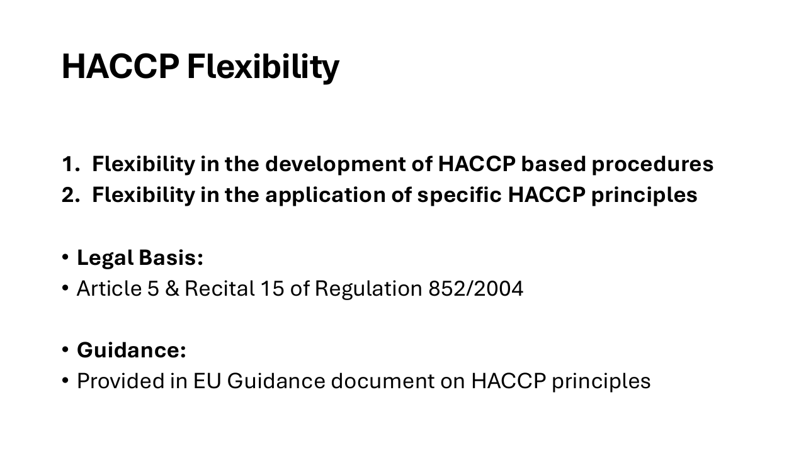

### HACCP Flexibility

1. Flexibility in the development of HACCP based procedures
2. Flexibility in the application of specific HACCP principles

- Legal Basis:
- Article 5 & Recital 15 of Regulation 852/2004

- Guidance:
- Provided in EU Guidance document on HACCP principles

## Slide 503

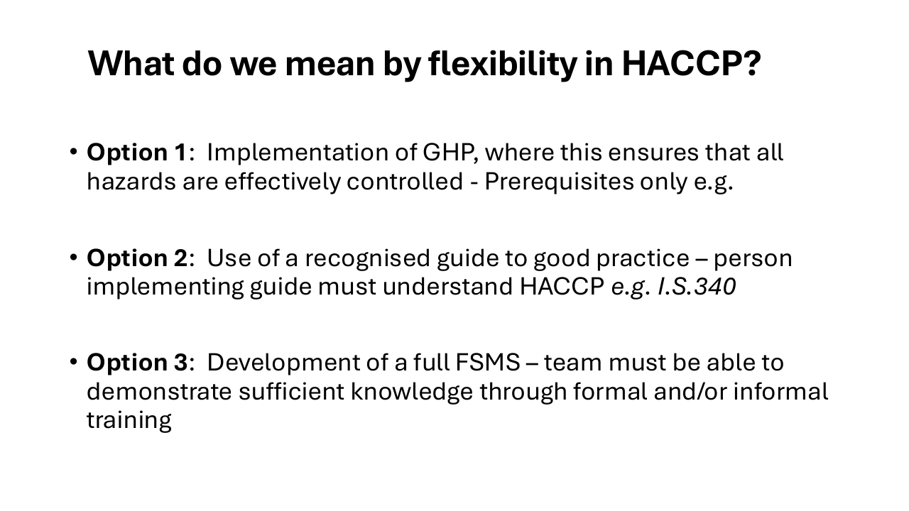

### What do we mean by flexibility in HACCP?

- Option 1:  Implementation of GHP, where this ensures that all

hazards are effectively controlled - Prerequisites only e.g.

- Option 2:  Use of a recognised guide to good practice – person

implementing guide must understand HACCP e.g. I.S.340

- Option 3:  Development of a full FSMS – team must be able to

demonstrate sufficient knowledge through formal and/or informal
training

## Slide 504

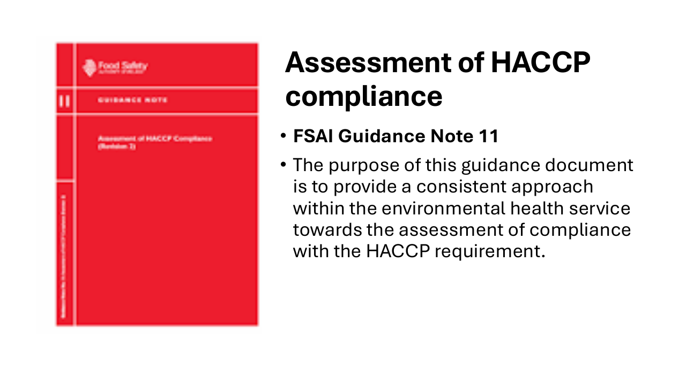

### Assessment of HACCP compliance

- FSAI Guidance Note 11
- The purpose of this guidance document

is to provide a consistent approach
within the environmental health service
towards the assessment of compliance
with the HACCP requirement.

## Slide 505

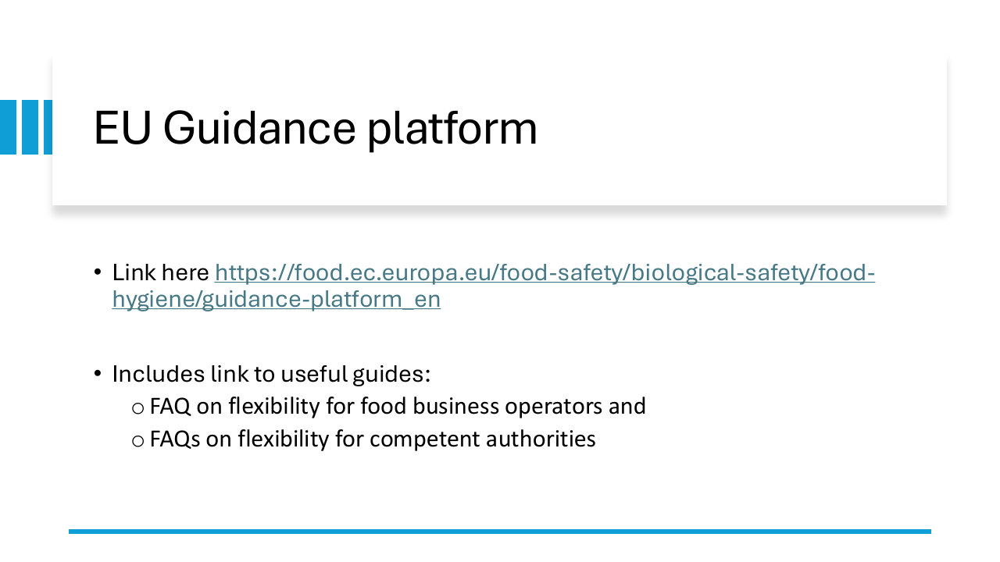

### EU Guidance platform hygiene/guidance-platform_en

- Link here https://food.ec.europa.eu/food-safety/biological-safety/food-

- Includes link to useful guides:

- FAQ on flexibility for food business operators and
- FAQs on flexibility for competent authorities

## Slide 506

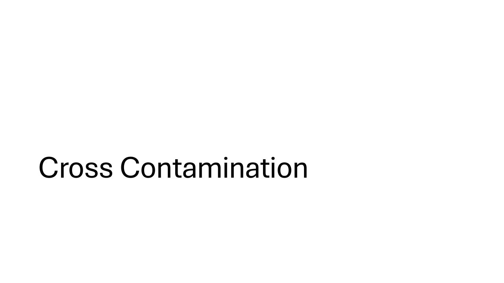

### Cross Contamination

## Slide 507

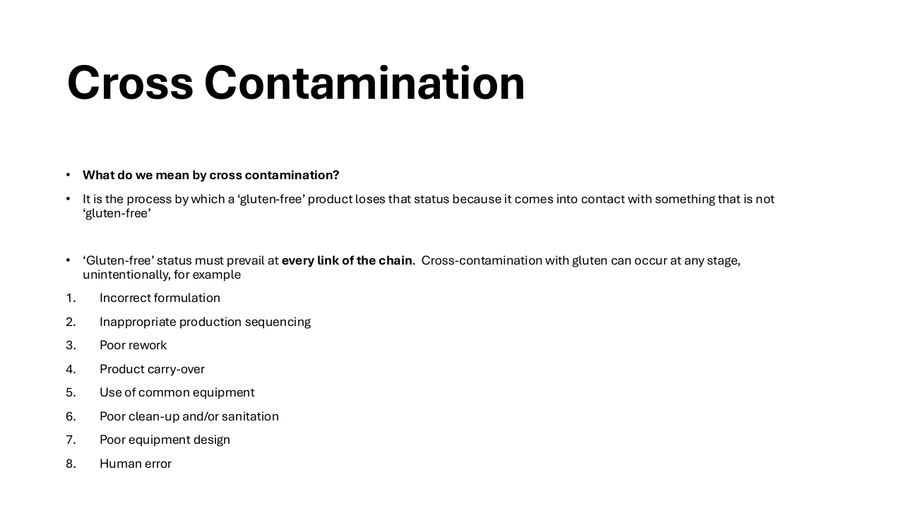

### Cross Contamination

- What do we mean by cross contamination?

- 

- 

1.

2.

3.

4.

5.

6.

7.

8.

It is the process by which a ‘gluten-free’ product loses that status because it comes into contact with something that is not
‘gluten-free’

‘Gluten-free’ status must prevail at every link of the chain.  Cross-contamination with gluten can occur at any stage,
unintentionally, for example

Incorrect formulation

Inappropriate production sequencing

Poor rework

Product carry-over

Use of common equipment

Poor clean-up and/or sanitation

Poor equipment design

Human error

## Slide 508

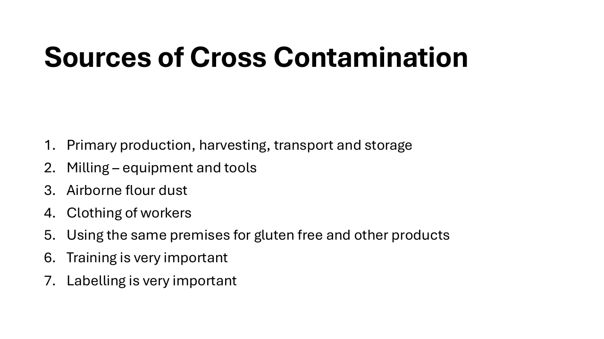

### Sources of Cross Contamination

1. Primary production, harvesting, transport and storage

2. Milling – equipment and tools

3. Airborne flour dust

4. Clothing of workers
5. Using the same premises for gluten free and other products

6. Training is very important

7. Labelling is very important

## Slide 509

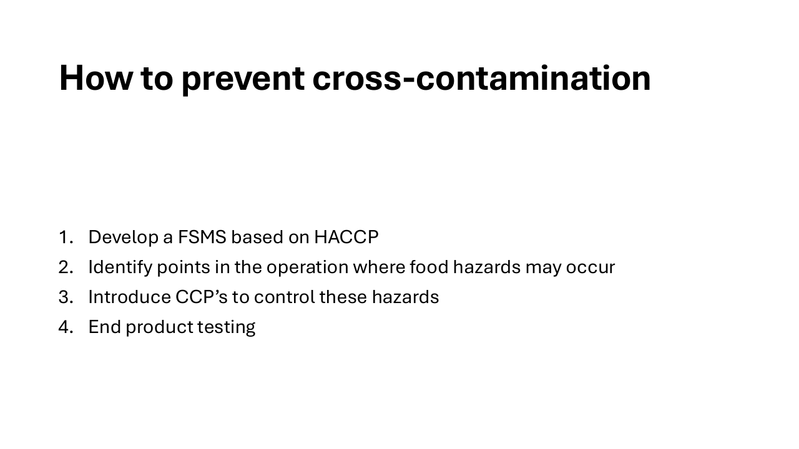

### How to prevent cross-contamination

1. Develop a FSMS based on HACCP

2.

3.

Identify points in the operation where food hazards may occur

Introduce CCP’s to control these hazards

4. End product testing

## Slide 510

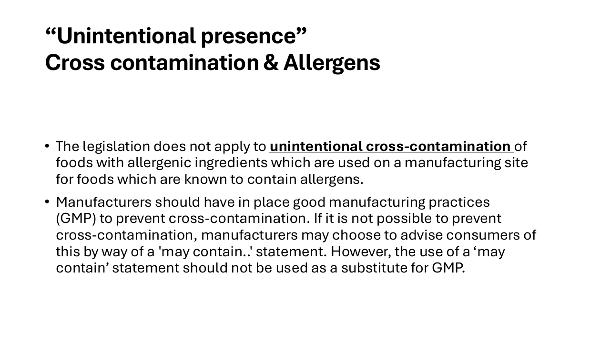

### “Unintentional presence” Cross contamination & Allergens

- The legislation does not apply to unintentional cross-contamination of foods with allergenic ingredients which are used on a manufacturing site for foods which are known to contain allergens.

- Manufacturers should have in place good manufacturing practices

(GMP) to prevent cross-contamination. If it is not possible to prevent
cross-contamination, manufacturers may choose to advise consumers of
this by way of a 'may contain..' statement. However, the use of a ‘may
contain’ statement should not be used as a substitute for GMP.

## Slide 511

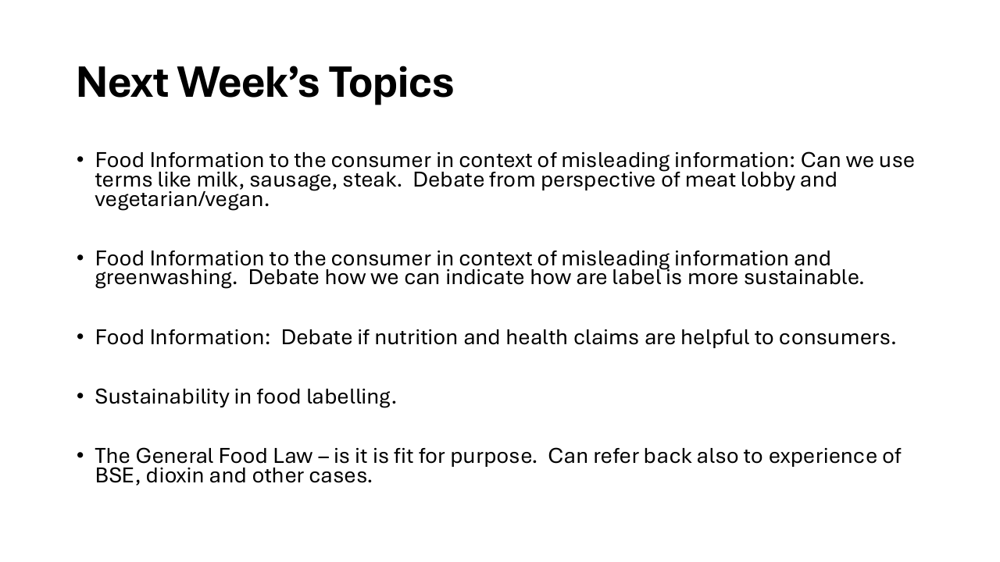

### Next Week’s Topics

- Food Information to the consumer in context of misleading information: Can we use

terms like milk, sausage, steak.  Debate from perspective of meat lobby and
vegetarian/vegan.

- Food Information to the consumer in context of misleading information and

greenwashing.  Debate how we can indicate how are label is more sustainable.

- Food Information:  Debate if nutrition and health claims are helpful to consumers.

- Sustainability in food labelling.

- The General Food Law – is it is fit for purpose.  Can refer back also to experience of

BSE, dioxin and other cases.

---

<a id="lecture-9"></a>
