<!-- Source: 00_resources/2026 Food Law slides — reflowed.md -->
<!-- Generated from Table of Contents entry 9. -->

# Lecture 9 — Week 11 (22 April 2026): Revision Lecture 2 of 2 (incl. Recap, Exam Info & Closing)

**Topics:** Sustainability · Regulation on Deforestation-free Products · nutrient profiles · healthy food · recap · exam format · past papers · NPD showcase · closing

**Slides:** 512–564 (53 slides)

## Slide 512

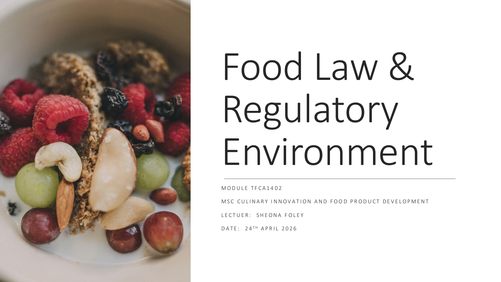

### Food Law & Regulatory Environment — *Course Title Slide*

*(Course title slide — see image for module / lecturer / date metadata.)*

Raw text:

```
Food Law &
Regulatory
Environment

MODULE   TFCA1402

MSC   CULINARY   INNOVATION   AND   FOOD   PRODUCT   DEVELOPMENT

LECTUER:

SHEONA   FOLEY

DATE:24THAPRIL   2026
```

## Slide 513

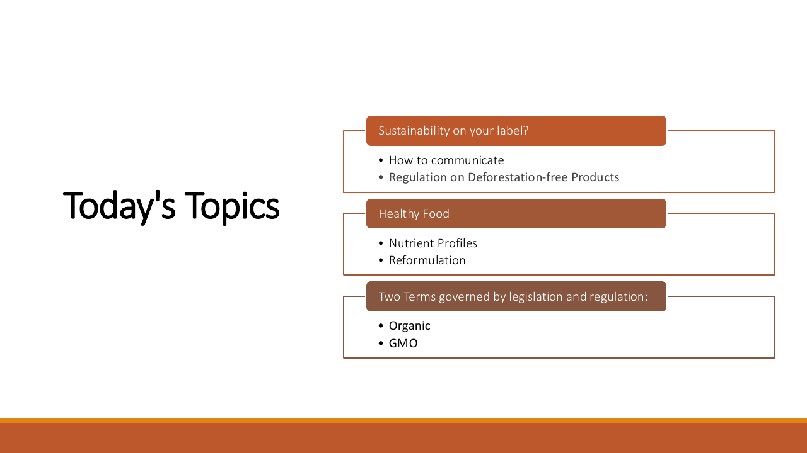

### Sustainability on your label?

- How to communicate
    - Regulation on Deforestation-free Products

Today's Topics   Healthy Food

    - Nutrient Profiles
    - Reformulation

                 Two Terms governed by legislation and regulation:

    - Organic
    - GMO

## Slide 514

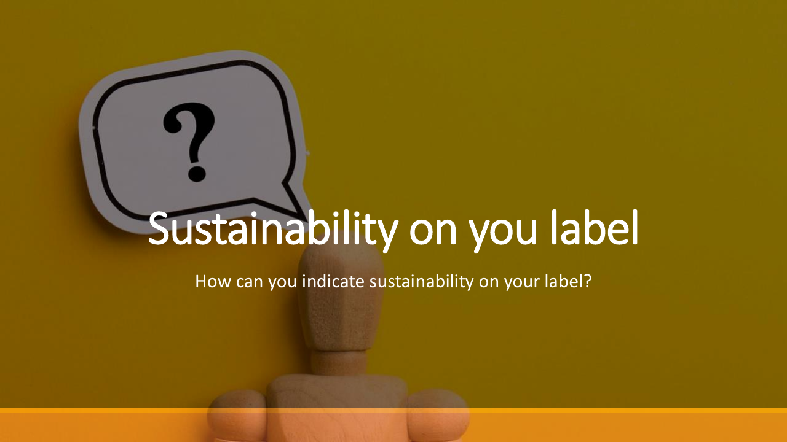

### Sustainability on you label

How can you indicate sustainability on your label?

## Slide 515

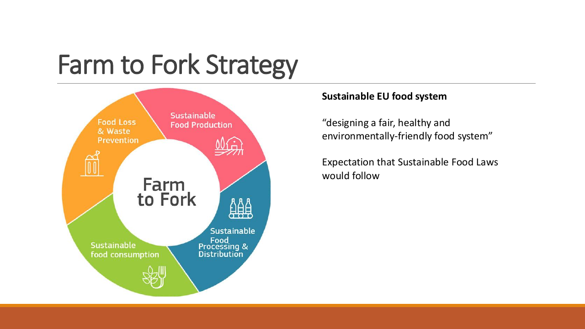

### Farm to Fork Strategy

**Sustainable EU food system**

> "designing a fair, healthy and environmentally-friendly food system"

Expectation that Sustainable Food Laws would follow.

*(See slide image for the Farm to Fork wheel diagram: Sustainable Food Production, Sustainable Food Processing & Distribution, Sustainable Food Consumption, Food Loss & Waste Prevention.)*

## Slide 516

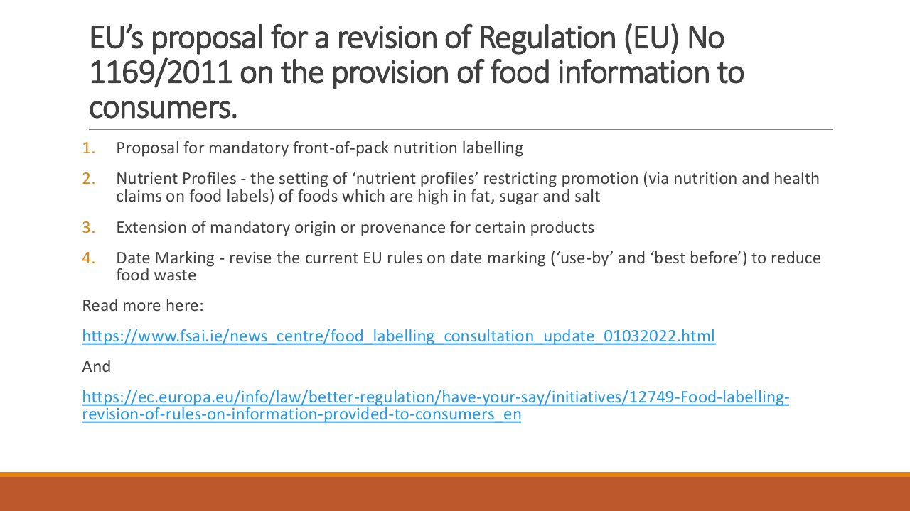

### EU's Proposal for a Revision of Regulation (EU) No 1169/2011

1. Proposal for mandatory **front-of-pack nutrition labelling**
2. **Nutrient Profiles** — the setting of 'nutrient profiles' restricting promotion (via nutrition and health claims on food labels) of foods which are high in fat, sugar and salt
3. Extension of mandatory **origin or provenance** for certain products
4. **Date Marking** — revise the current EU rules on date marking ('use-by' and 'best before') to reduce food waste

## Slide 517

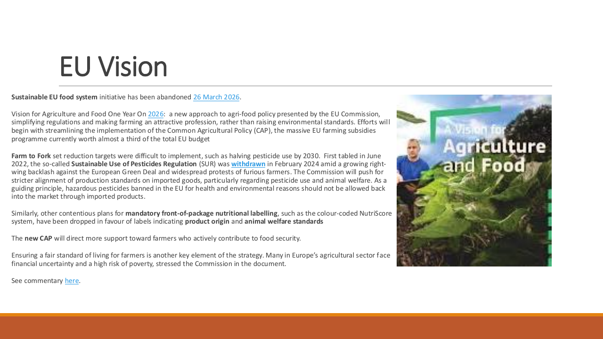

### EU Vision

Sustainable EU food system initiative has been abandoned 26 March 2026.

Vision for Agriculture and Food One Year On 2026:  a new approach to agri-food policy presented by the EU Commission,
simplifying regulations and making farming an attractive profession, rather than raising environmental standards. Efforts will
begin with streamlining the implementation of the Common Agricultural Policy (CAP), the massive EU farming subsidies
programme currently worth almost a third of the total EU budget

Farm to Fork set reduction targets were difficult to implement, such as halving pesticide use by 2030.  First tabled in June
2022, the so-called Sustainable Use of Pesticides Regulation (SUR) was withdrawn in February 2024 amid a growing right-
wing backlash against the European Green Deal and widespread protests of furious farmers. The Commission will push for
stricter alignment of production standards on imported goods, particularly regarding pesticide use and animal welfare. As a
guiding principle, hazardous pesticides banned in the EU for health and environmental reasons should not be allowed back
into the market through imported products.

Similarly, other contentious plans for mandatory front-of-package nutritional labelling, such as the colour-coded NutriScore
system, have been dropped in favour of labels indicating product origin and animal welfare standards

The new CAP will direct more support toward farmers who actively contribute to food security.

Ensuring a fair standard of living for farmers is another key element of the strategy. Many in Europe’s agricultural sector face
financial uncertainty and a high risk of poverty, stressed the Commission in the document.

See commentary here.

## Slide 518

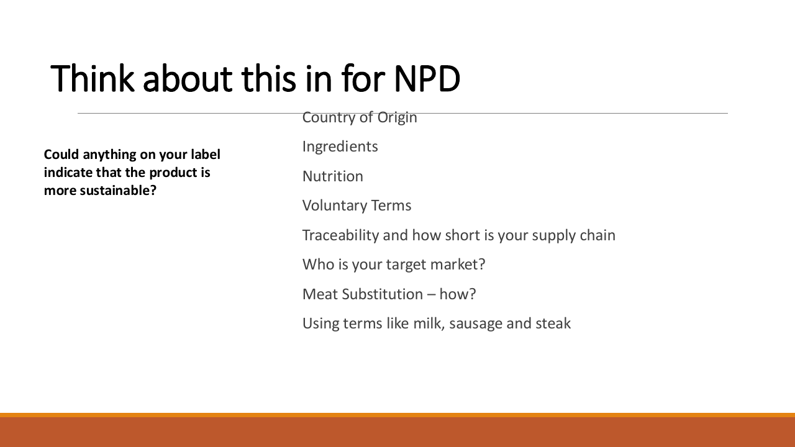

### Country of Origin Ingredients Voluntary Terms

Think about this in for NPD

Could anything on your label
indicate that the product is   Nutrition
more sustainable?
                               Traceability and how short is your supply chain
                               Who is your target market?
                               Meat Substitution – how?
                               Using terms like milk, sausage and steak

## Slide 519

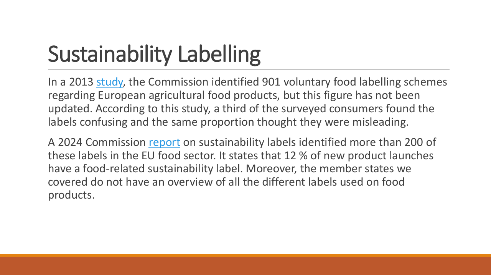

### Sustainability Labelling

In a 2013 study, the Commission identified 901 voluntary food labelling schemes
regarding European agricultural food products, but this figure has not been
updated. According to this study, a third of the surveyed consumers found the
labels confusing and the same proportion thought they were misleading.

A 2024 Commission report on sustainability labels identified more than 200 of
these labels in the EU food sector. It states that 12 % of new product launches
have a food-related sustainability label. Moreover, the member states we
covered do not have an overview of all the different labels used on food
products.

## Slide 520

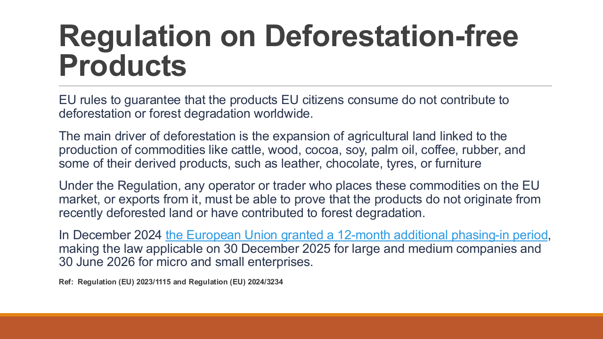

### Regulation on Deforestation-free Products

EU rules to guarantee that the products EU citizens consume do not contribute to
deforestation or forest degradation worldwide.

The main driver of deforestation is the expansion of agricultural land linked to the
production of commodities like cattle, wood, cocoa, soy, palm oil, coffee, rubber, and
some of their derived products, such as leather, chocolate, tyres, or furniture

Under the Regulation, any operator or trader who places these commodities on the EU
market, or exports from it, must be able to prove that the products do not originate from
recently deforested land or have contributed to forest degradation.

In December 2024 the European Union granted a 12-month additional phasing-in period,
making the law applicable on 30 December 2025 for large and medium companies and
30 June 2026 for micro and small enterprises.

Ref:  Regulation (EU) 2023/1115 and Regulation (EU) 2024/3234

## Slide 521

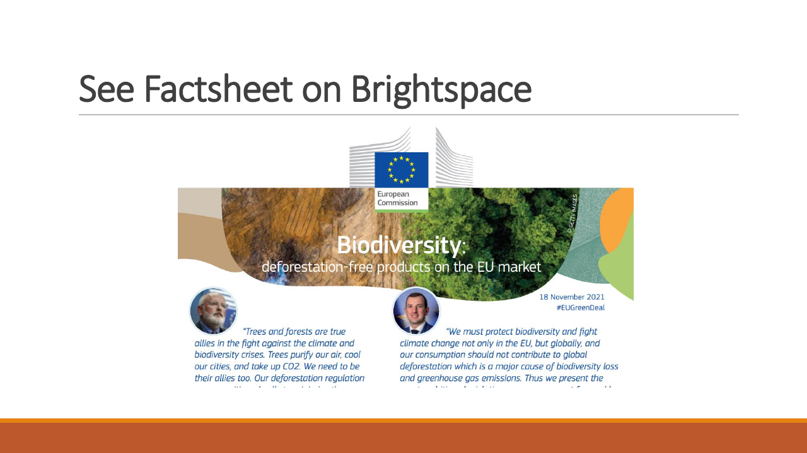

### See Factsheet on Brightspace

## Slide 522

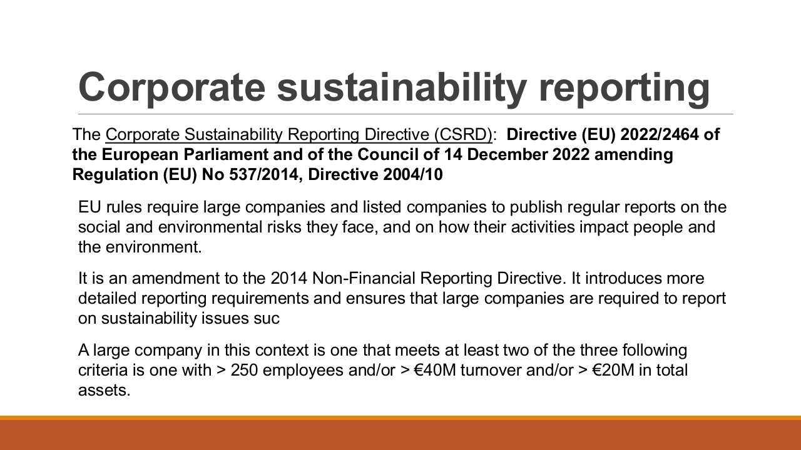

### Corporate sustainability reporting

The Corporate Sustainability Reporting Directive (CSRD):  Directive (EU) 2022/2464 of
the European Parliament and of the Council of 14 December 2022 amending
Regulation (EU) No 537/2014, Directive 2004/10

EU rules require large companies and listed companies to publish regular reports on the
social and environmental risks they face, and on how their activities impact people and
the environment.

It is an amendment to the 2014 Non-Financial Reporting Directive. It introduces more
detailed reporting requirements and ensures that large companies are required to report
- n sustainability issues suc

A large company in this context is one that meets at least two of the three following
criteria is one with > 250 employees and/or > €40M turnover and/or > €20M in total
assets.

## Slide 523

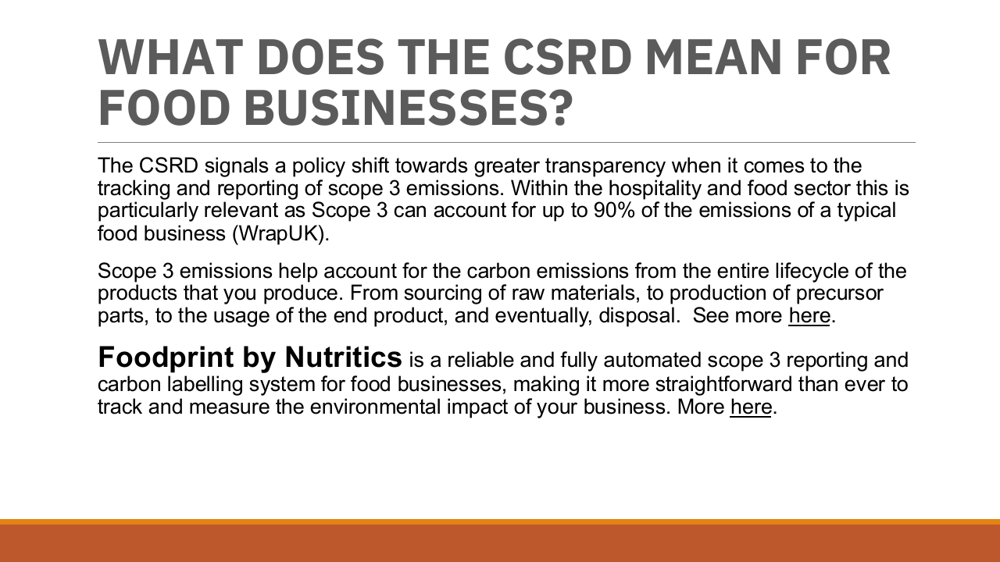

### WHAT DOES THE CSRD MEAN FOR — FOOD BUSINESSES?

The CSRD signals a policy shift towards greater transparency when it comes to the
tracking and reporting of scope 3 emissions. Within the hospitality and food sector this is
particularly relevant as Scope 3 can account for up to 90% of the emissions of a typical
food business (WrapUK).

Scope 3 emissions help account for the carbon emissions from the entire lifecycle of the
products that you produce. From sourcing of raw materials, to production of precursor
parts, to the usage of the end product, and eventually, disposal.  See more here.

Foodprint by Nutritics is a reliable and fully automated scope 3 reporting and
carbon labelling system for food businesses, making it more straightforward than ever to
track and measure the environmental impact of your business. More here.

## Slide 524

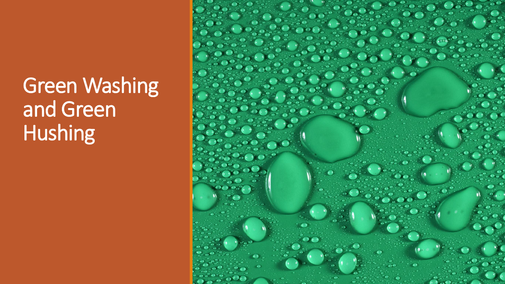

### Green Washing and Green — Hushing

## Slide 525

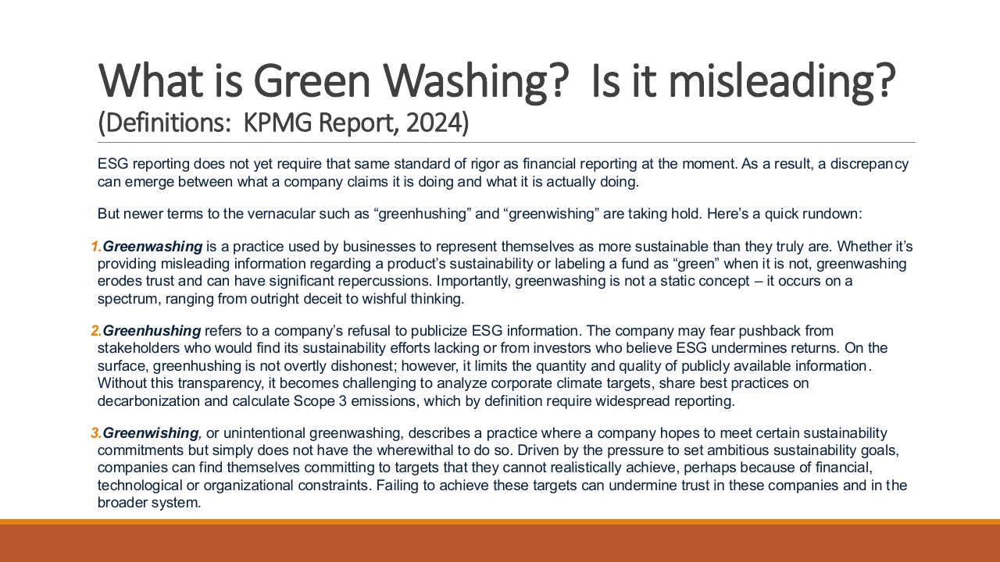

### What is Green Washing?  Is it misleading? — (Definitions:  KPMG Report, 2024)

ESG reporting does not yet require that same standard of rigor as financial reporting at the moment. As a result, a discrepancy
can emerge between what a company claims it is doing and what it is actually doing.

But newer terms to the vernacular such as “greenhushing” and “greenwishing” are taking hold. Here’s a quick rundown:

1.Greenwashing is a practice used by businesses to represent themselves as more sustainable than they truly are. Whether it’s
providing misleading information regarding a product’s sustainability or labeling a fund as “green” when it is not, greenwashing
erodes trust and can have significant repercussions. Importantly, greenwashing is not a static concept – it occurs on a
spectrum, ranging from outright deceit to wishful thinking.

2.Greenhushing refers to a company’s refusal to publicize ESG information. The company may fear pushback from

stakeholders who would find its sustainability efforts lacking or from investors who believe ESG undermines returns. On the
surface, greenhushing is not overtly dishonest; however, it limits the quantity and quality of publicly available information.
Without this transparency, it becomes challenging to analyze corporate climate targets, share best practices on
decarbonization and calculate Scope 3 emissions, which by definition require widespread reporting.

3.Greenwishing, or unintentional greenwashing, describes a practice where a company hopes to meet certain sustainability

commitments but simply does not have the wherewithal to do so. Driven by the pressure to set ambitious sustainability goals,
companies can find themselves committing to targets that they cannot realistically achieve, perhaps because of financial,
technological or organizational constraints. Failing to achieve these targets can undermine trust in these companies and in the
broader system.

## Slide 526

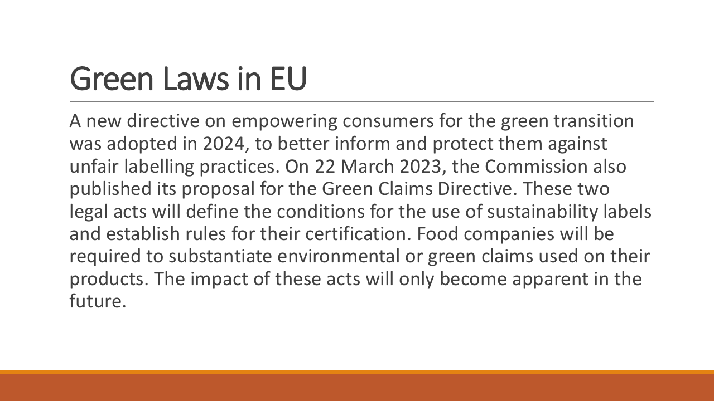

### Green Laws in EU

A new directive on empowering consumers for the green transition
was adopted in 2024, to better inform and protect them against
unfair labelling practices. On 22 March 2023, the Commission also
published its proposal for the Green Claims Directive. These two
legal acts will define the conditions for the use of sustainability labels
and establish rules for their certification. Food companies will be
required to substantiate environmental or green claims used on their
products. The impact of these acts will only become apparent in the
future.

## Slide 527

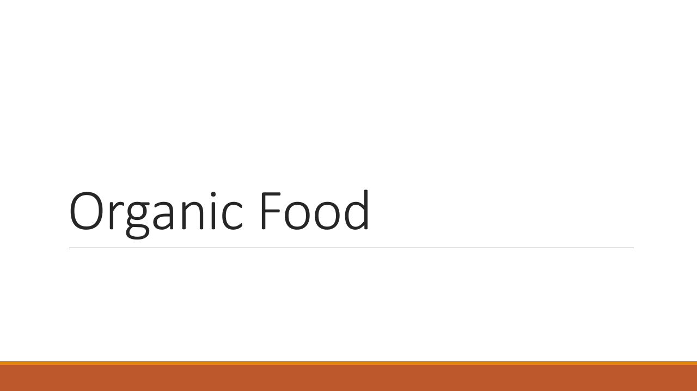

### Organic Food

## Slide 528

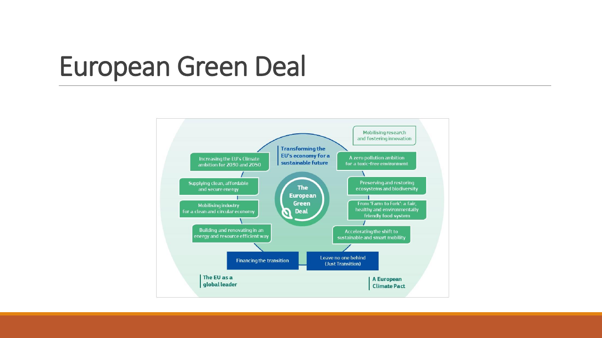

### European Green Deal

## Slide 529

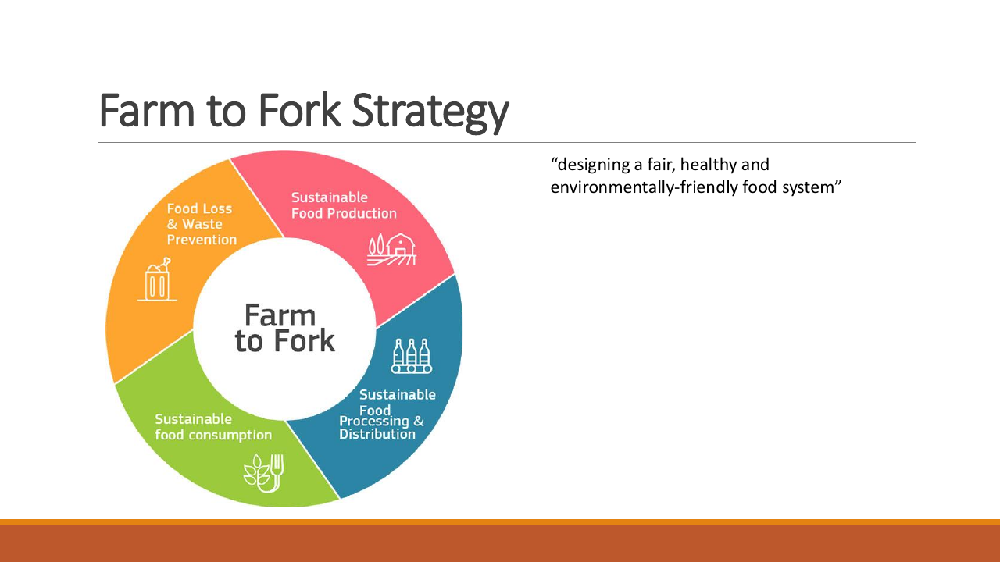

### Farm to Fork Strategy

“designing a fair, healthy and
                        environmentally-friendly food system”

## Slide 530

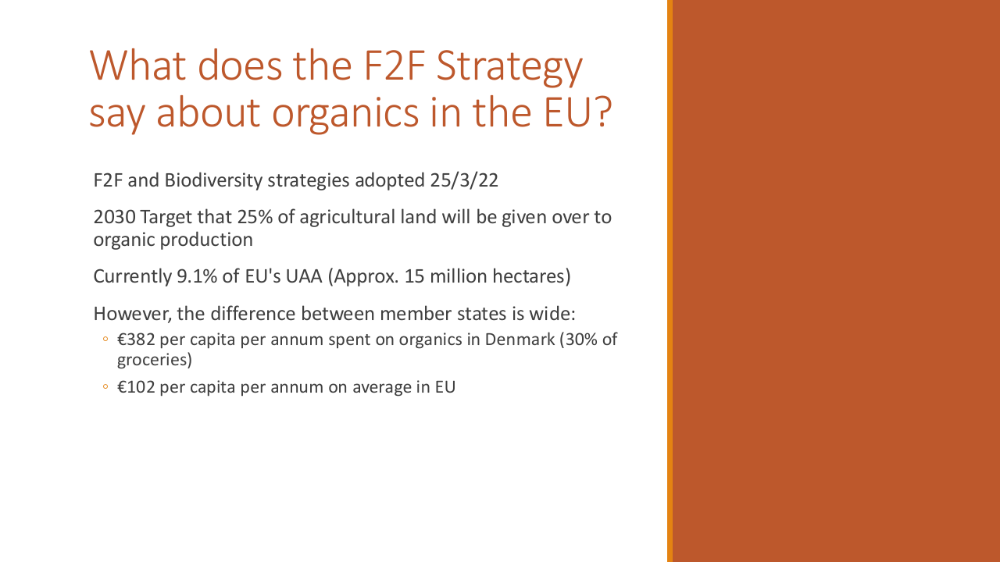

### What does the F2F Strategy say about organics in the EU?

F2F and Biodiversity strategies adopted 25/3/22

2030 Target that 25% of agricultural land will be given over to
- rganic production

Currently 9.1% of EU's UAA (Approx. 15 million hectares)

However, the difference between member states is wide:
◦ €382 per capita per annum spent on organics in Denmark (30% of

groceries)

◦ €102 per capita per annum on average in EU

## Slide 531

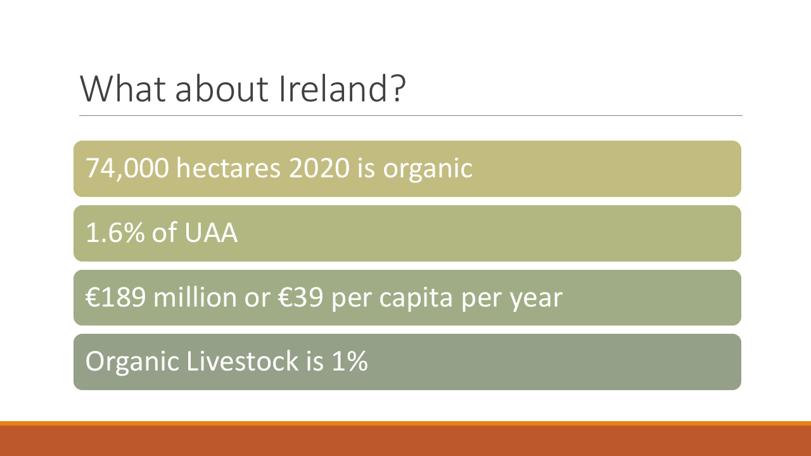

### What about Ireland?

74,000 hectares 2020 is organic

1.6% of UAA

€189 million or €39 per capita per year

Organic Livestock is 1%

## Slide 532

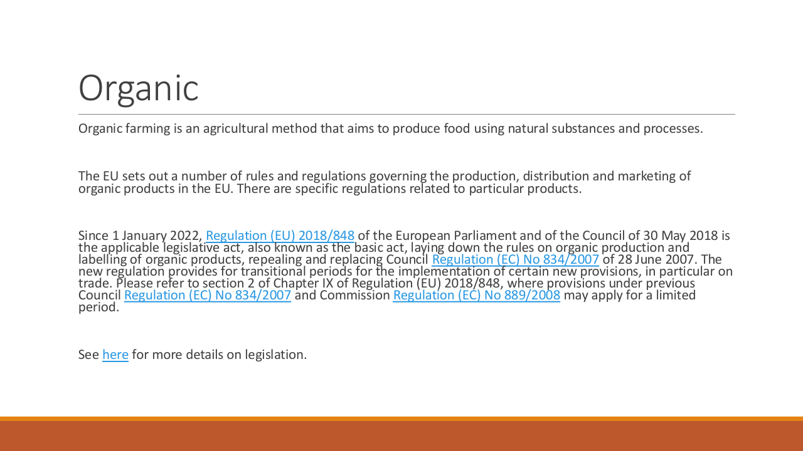

### Organic

Organic farming is an agricultural method that aims to produce food using natural substances and processes.

The EU sets out a number of rules and regulations governing the production, distribution and marketing of
- rganic products in the EU. There are specific regulations related to particular products.

Since 1 January 2022, Regulation (EU) 2018/848 of the European Parliament and of the Council of 30 May 2018 is
the applicable legislative act, also known as the basic act, laying down the rules on organic production and
labelling of organic products, repealing and replacing Council Regulation (EC) No 834/2007 of 28 June 2007. The
new regulation provides for transitional periods for the implementation of certain new provisions, in particular on
trade. Please refer to section 2 of Chapter IX of Regulation (EU) 2018/848, where provisions under previous
Council Regulation (EC) No 834/2007 and Commission Regulation (EC) No 889/2008 may apply for a limited
period.

See here for more details on legislation.

## Slide 533

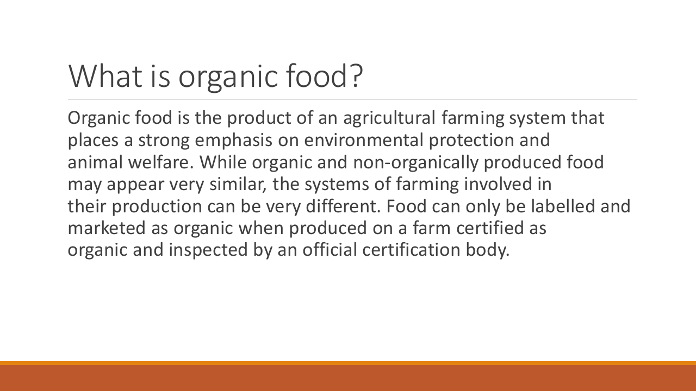

### What is organic food?

Organic food is the product of an agricultural farming system that
places a strong emphasis on environmental protection and
animal welfare. While organic and non-organically produced food
may appear very similar, the systems of farming involved in
their production can be very different. Food can only be labelled and
marketed as organic when produced on a farm certified as
- rganic and inspected by an official certification body.

## Slide 534

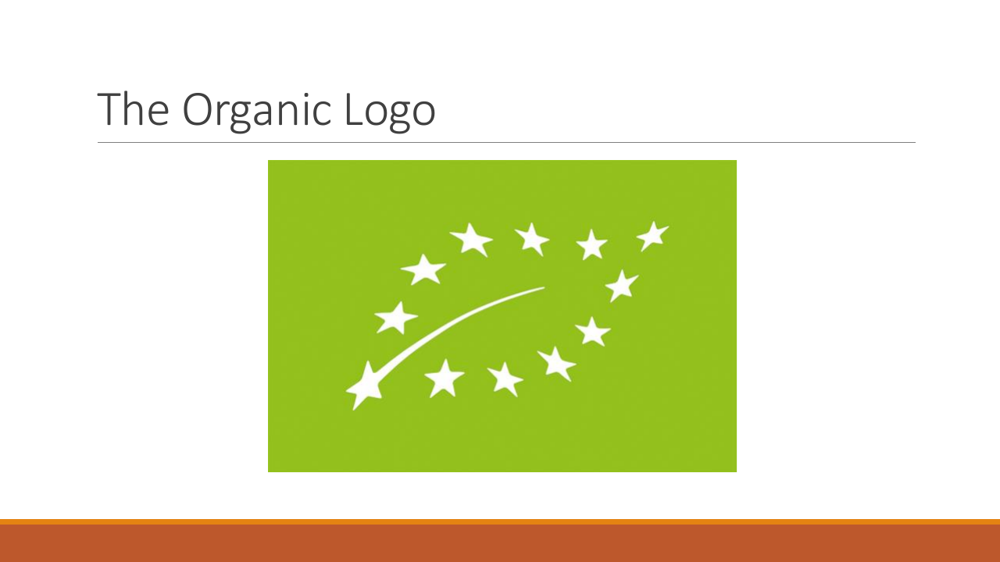

### The Organic Logo

## Slide 535

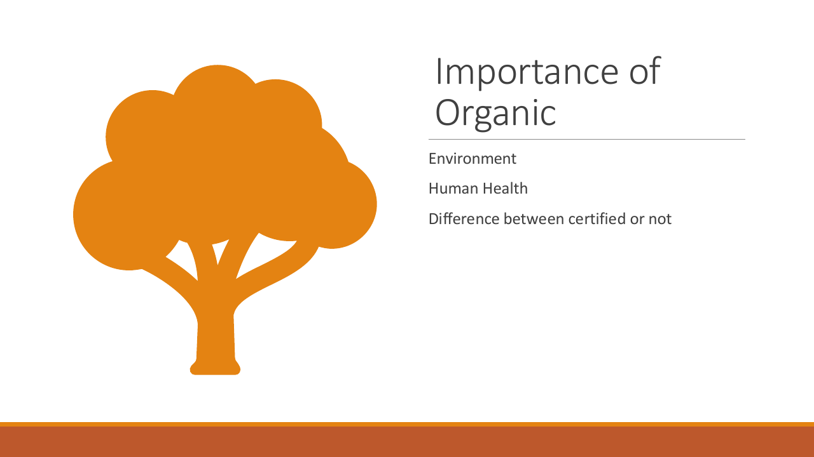

### Importance ofOrganic

Environment

Human Health

Difference between certified or not

## Slide 536


### Packaging

## Slide 537

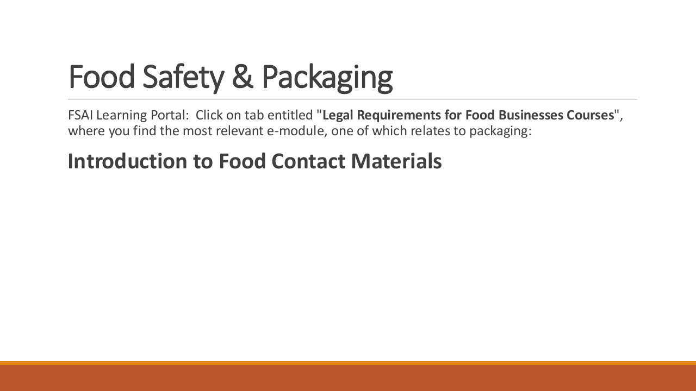

### Food Safety & Packaging

FSAI Learning Portal:  Click on tab entitled "Legal Requirements for Food Businesses Courses",
where you find the most relevant e-module, one of which relates to packaging:
Introduction to Food Contact Materials

## Slide 538

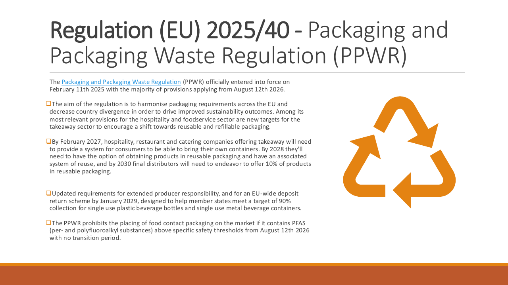

### Regulation (EU) 2025/40 - Packaging and — Packaging Waste Regulation (PPWR)

The Packaging and Packaging Waste Regulation (PPWR) officially entered into force on
February 11th 2025 with the majority of provisions applying from August 12th 2026.

- The aim of the regulation is to harmonise packaging requirements across the EU and

decrease country divergence in order to drive improved sustainability outcomes. Among its
most relevant provisions for the hospitality and foodservice sector are new targets for the
takeaway sector to encourage a shift towards reusable and refillable packaging.

- By February 2027, hospitality, restaurant and catering companies offering takeaway will need to provide a system for consumers to be able to bring their own containers. By 2028 they'll need to have the option of obtaining products in reusable packaging and have an associated system of reuse, and by 2030 final distributors will need to endeavor to offer 10% of products in reusable packaging.

- Updated requirements for extended producer responsibility, and for an EU-wide deposit return scheme by January 2029, designed to help member states meet a target of 90% collection for single use plastic beverage bottles and single use metal beverage containers.

- The PPWR prohibits the placing of food contact packaging on the market if it contains PFAS

(per- and polyfluoroalkyl substances) above specific safety thresholds from August 12th 2026
with no transition period.

## Slide 539

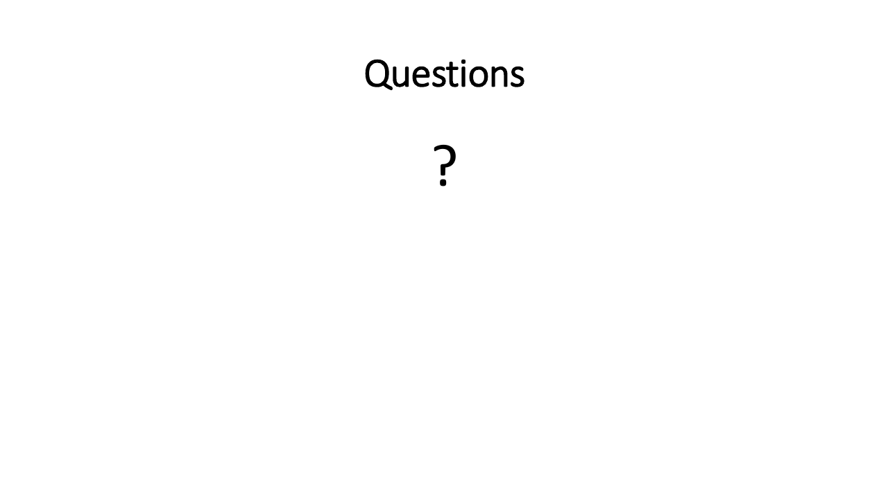

### Questions

?

## Slide 540

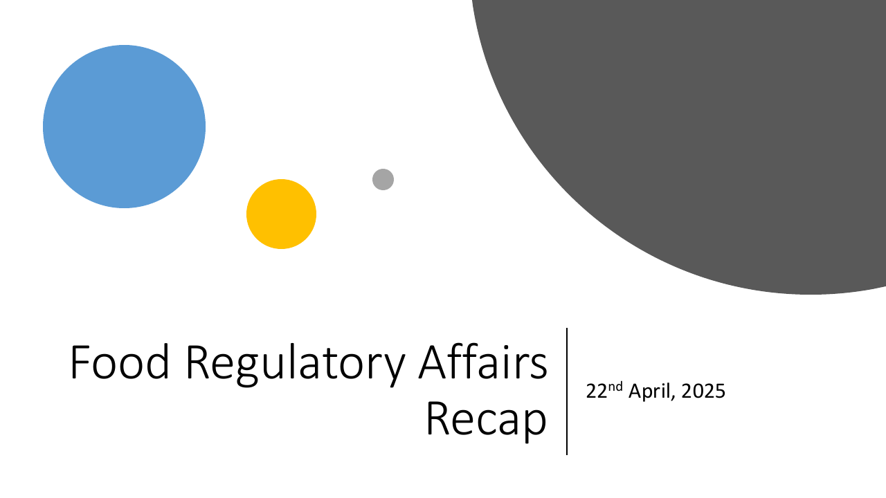

### Food Regulatory Affairs   22nd April, 2025 — Recap

## Slide 541

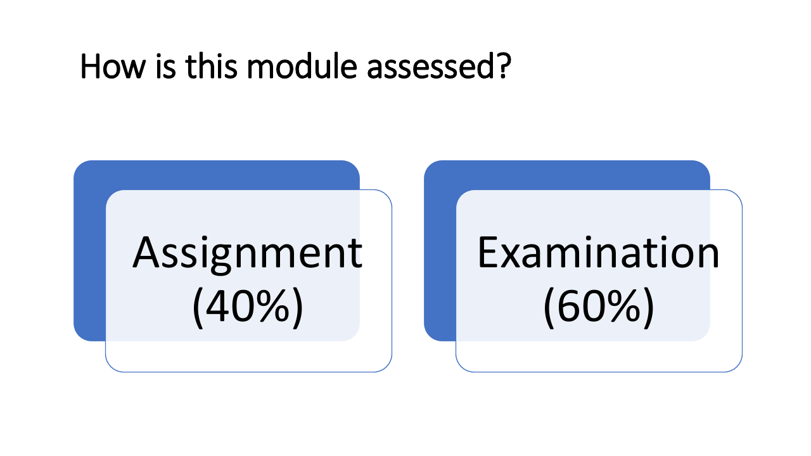

### How is this module assessed?

Assignment            Examination
      (40%)                 (60%)

## Slide 542

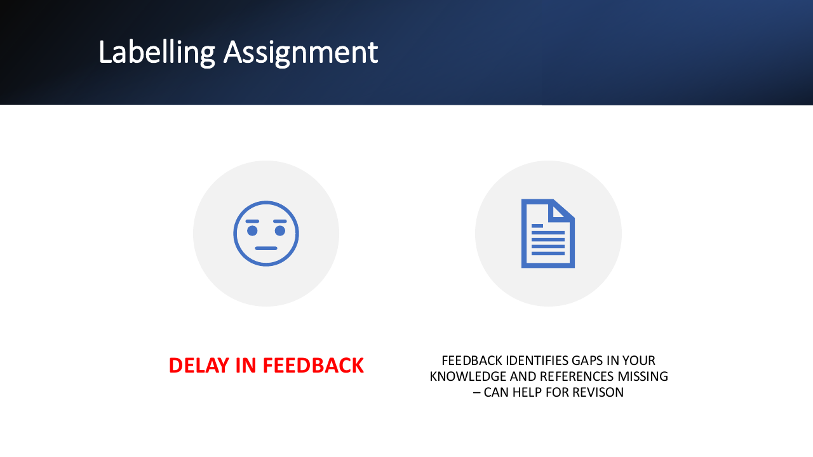

### Labelling Assignment KNOWLEDGE AND REFERENCES MISSING

DELAY IN FEEDBACK    FEEDBACK IDENTIFIES GAPS IN YOUR
                              – CAN HELP FOR REVISON

## Slide 543

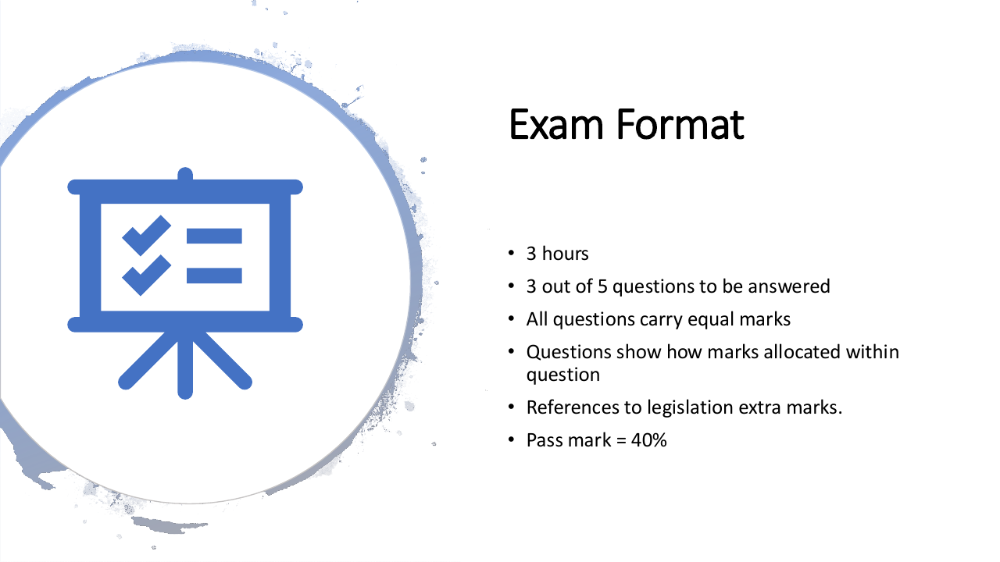

### Exam Format question

- 3 hours
- 3 out of 5 questions to be answered
- All questions carry equal marks
- Questions show how marks allocated within

- References to legislation extra marks.
- Pass mark = 40%

## Slide 544

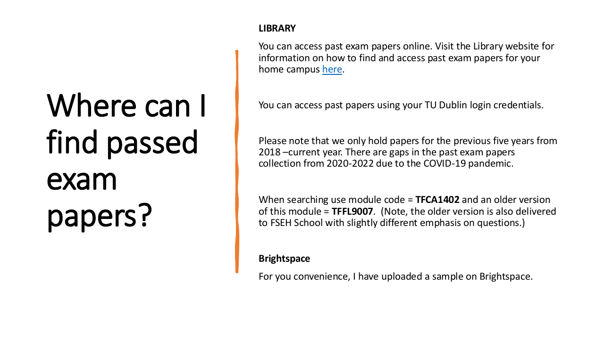

### Where can I find passed exam LIBRARY Brightspace

papers?

You can access past exam papers online. Visit the Library website for
information on how to find and access past exam papers for your
home campus here.

You can access past papers using your TU Dublin login credentials.

Please note that we only hold papers for the previous five years from
2018 –current year. There are gaps in the past exam papers
collection from 2020-2022 due to the COVID-19 pandemic.

When searching use module code = TFCA1402 and an older version
- f this module = TFFL9007.  (Note, the older version is also delivered to FSEH School with slightly different emphasis on questions.)

For you convenience, I have uploaded a sample on Brightspace.

## Slide 545

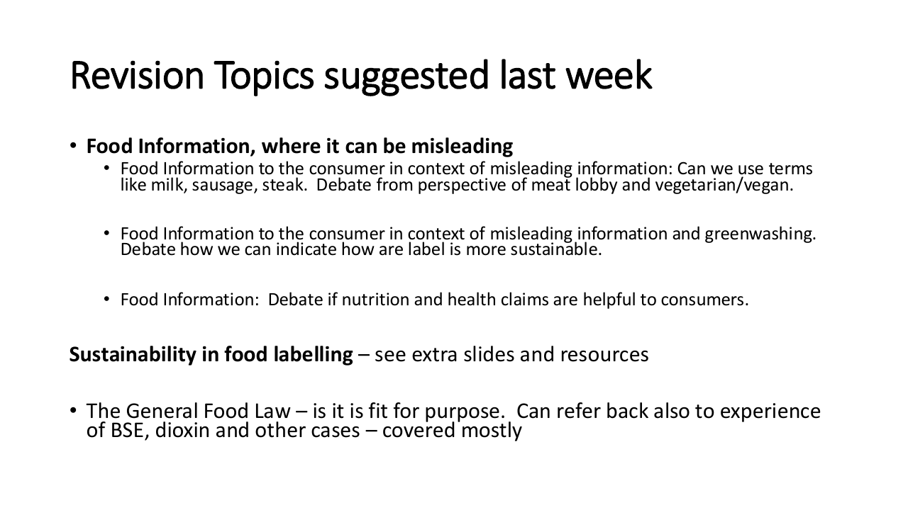

### Revision Topics suggested last week

- Food Information, where it can be misleading

- Food Information to the consumer in context of misleading information: Can we use terms like milk, sausage, steak.  Debate from perspective of meat lobby and vegetarian/vegan.

- Food Information to the consumer in context of misleading information and greenwashing.

Debate how we can indicate how are label is more sustainable.

- Food Information:  Debate if nutrition and health claims are helpful to consumers.

Sustainability in food labelling – see extra slides and resources

- The General Food Law – is it is fit for purpose.  Can refer back also to experience

- f BSE, dioxin and other cases – covered mostly

## Slide 546


### *(Blank slide.)*

## Slide 547

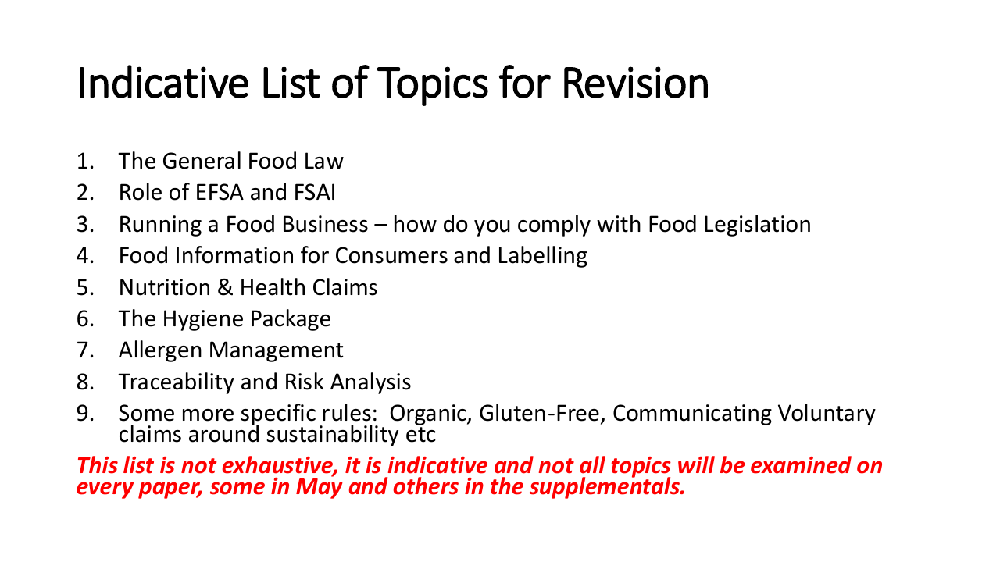

### Indicative List of Topics for Revision

Food Information for Consumers and Labelling

1. The General Food Law
2. Role of EFSA and FSAI
3. Running a Food Business – how do you comply with Food Legislation 4.
5. Nutrition & Health Claims
6. The Hygiene Package
7. Allergen Management
8. Traceability and Risk Analysis 9.

Some more specific rules:  Organic, Gluten-Free, Communicating Voluntary
claims around sustainability etc

This list is not exhaustive, it is indicative and not all topics will be examined on
every paper, some in May and others in the supplementals.

## Slide 548

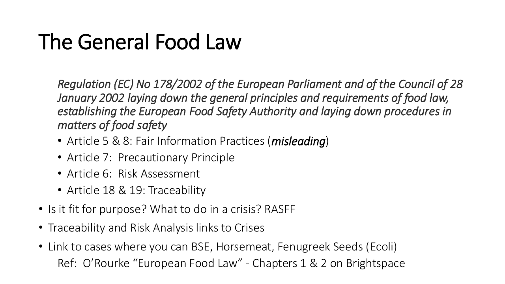

### The General Food Law matters of food safety

Regulation (EC) No 178/2002 of the European Parliament and of the Council of 28
January 2002 laying down the general principles and requirements of food law,
establishing the European Food Safety Authority and laying down procedures in
- Article 5 & 8: Fair Information Practices (misleading)
- Article 7:  Precautionary Principle
- Article 6:  Risk Assessment
- Article 18 & 19: Traceability

- Is it fit for purpose? What to do in a crisis? RASFF
- Traceability and Risk Analysis links to Crises
- Link to cases where you can BSE, Horsemeat, Fenugreek Seeds (Ecoli)

Ref:  O’Rourke “European Food Law” - Chapters 1 & 2 on Brightspace

## Slide 549

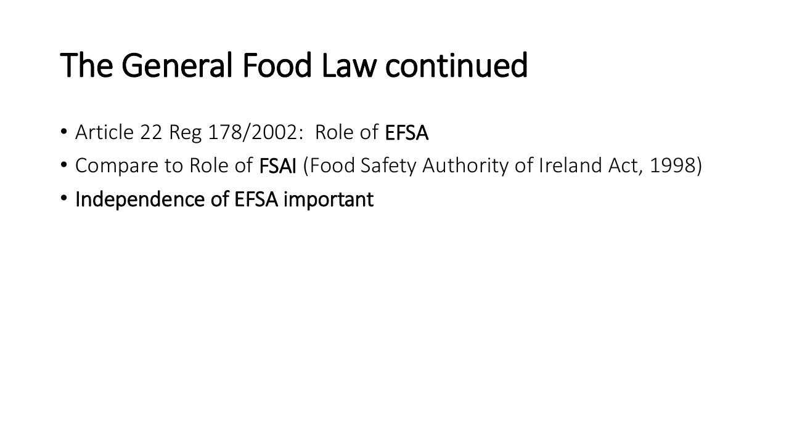

### The General Food Law continued

- Article 22 Reg 178/2002:  Role of EFSA
- Compare to Role of FSAI (Food Safety Authority of Ireland Act, 1998)
- Independence of EFSA important

## Slide 550

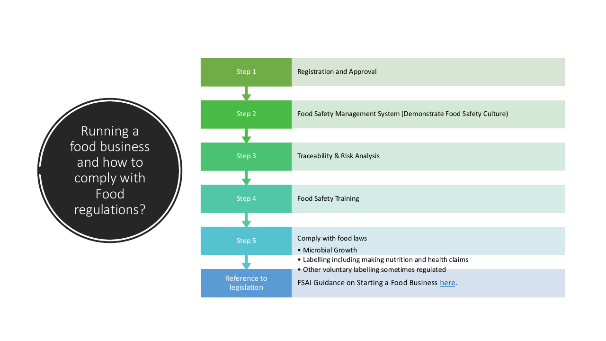

### Step 1      Registration and Approval

Step 2      Food Safety Management System (Demonstrate Food Safety Culture)

   Running a
food business
                   Step 3      Traceability & Risk Analysis
  and how to
 comply with
     Food          Step 4      Food Safety Training
 regulations?
                   Step 5      Comply with food laws
    - Microbial Growth
    - Labelling including making nutrition and health claims
    - Other voluntary labelling sometimes regulated Reference to FSAI Guidance on Starting a Food Business here here. legislation

## Slide 551

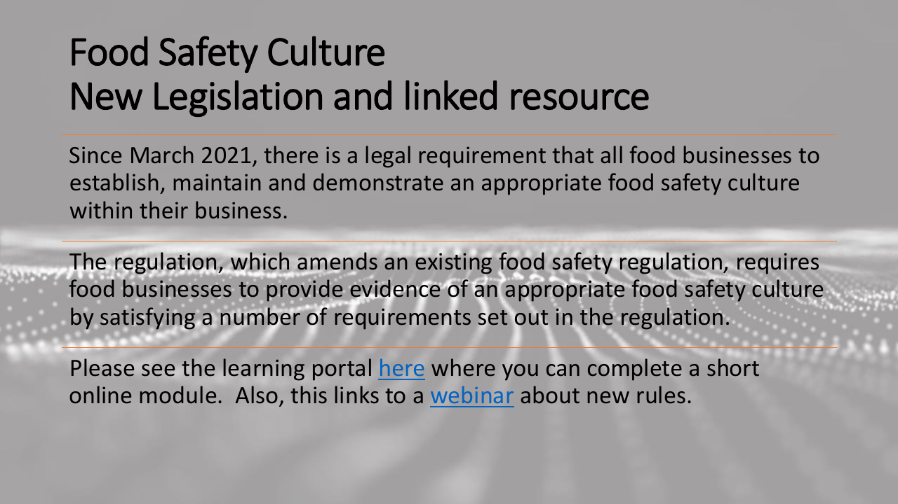

### Food Safety Culture webinar here

New Legislation and linked resource

Since March 2021, there is a legal requirement that all food businesses to
establish, maintain and demonstrate an appropriate food safety culture
within their business.

The regulation, which amends an existing food safety regulation, requires
food businesses to provide evidence of an appropriate food safety culture
by satisfying a number of requirements set out in the regulation.

Please see the learning portal here where you can complete a short
- nline module. Also, this links to a webinar about new rules.

## Slide 552

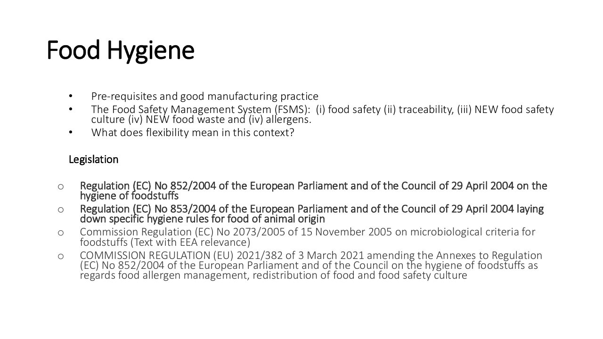

### Food Hygiene Legislation hygiene of foodstuffs

- 
- 

Pre-requisites and good manufacturing practice
The Food Safety Management System (FSMS): (i) food safety (ii) traceability, (iii) NEW food safety
culture (iv) NEW food waste and (iv) allergens.

- What does flexibility mean in this context?

Regulation (EC) No 852/2004 of the European Parliament and of the Council of 29 April 2004 on the
Regulation (EC) No 853/2004 of the European Parliament and of the Council of 29 April 2004 laying
down specific hygiene rules for food of animal origin
Commission Regulation (EC) No 2073/2005 of 15 November 2005 on microbiological criteria for
foodstuffs (Text with EEA relevance)
COMMISSION REGULATION (EU) 2021/382 of 3 March 2021 amending the Annexes to Regulation
(EC) No 852/2004 of the European Parliament and of the Council on the hygiene of foodstuffs as
regards food allergen management, redistribution of food and food safety culture

## Slide 553

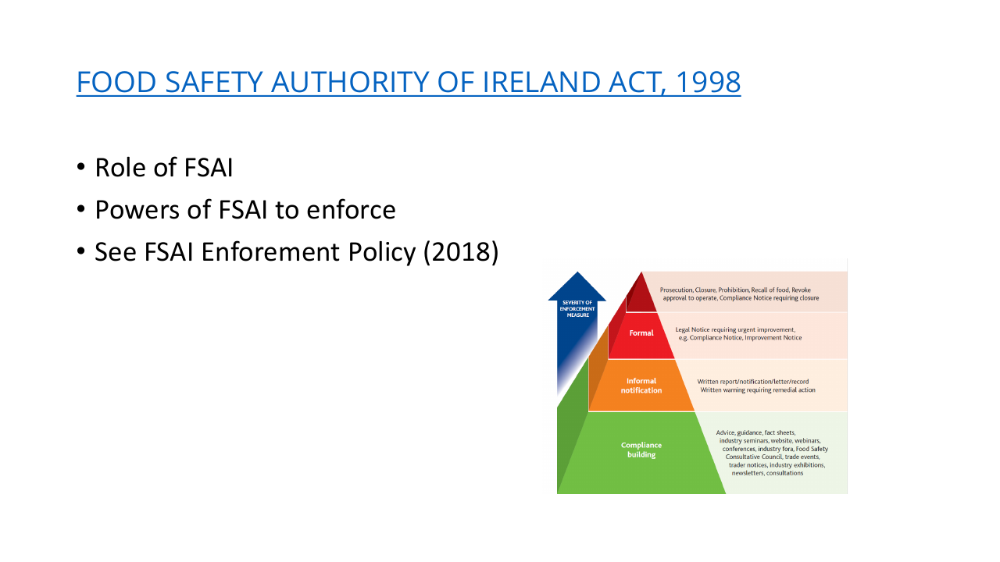

### FOOD SAFETY AUTHORITY OF IRELAND ACT, 1998

- Role of FSAI
- Powers of FSAI to enforce
- See FSAI Enforement Policy (2018)

## Slide 554

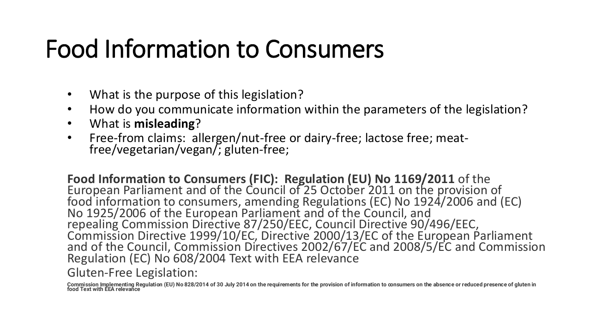

### Food Information to Consumers

How do you communicate information within the parameters of the legislation?

- What is the purpose of this legislation?
- 
- What is misleading?
- 

Free-from claims: allergen/nut-free or dairy-free; lactose free; meat-
free/vegetarian/vegan/; gluten-free;

Food Information to Consumers (FIC): Regulation (EU) No 1169/2011 of the
European Parliament and of the Council of 25 October 2011 on the provision of
food information to consumers, amending Regulations (EC) No 1924/2006 and (EC)
No 1925/2006 of the European Parliament and of the Council, and
repealing Commission Directive 87/250/EEC, Council Directive 90/496/EEC,
Commission Directive 1999/10/EC, Directive 2000/13/EC of the European Parliament
and of the Council, Commission Directives 2002/67/EC and 2008/5/EC and Commission
Regulation (EC) No 608/2004 Text with EEA relevance
Gluten-Free Legislation:

Commission Implementing Regulation (EU) No 828/2014 of 30 July 2014 on the requirements for the provision of information to consumers on the absence or reduced presence of gluten in
food Text with EEA relevance

## Slide 555

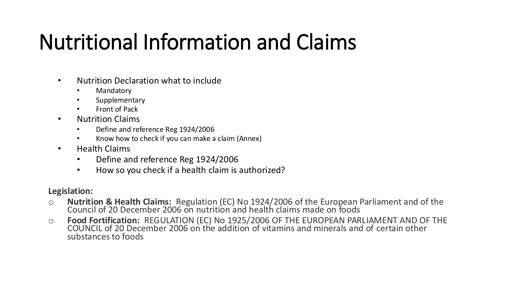

### Nutritional Information and Claims

- 

- 

- 

Nutrition Declaration what to include
- Mandatory
- Supplementary
- Front of Pack Nutrition Claims
- 
- Health Claims
- 
- 

Define and reference Reg 1924/2006
Know how to check if you can make a claim (Annex)

Define and reference Reg 1924/2006
How so you check if a health claim is authorized?

Legislation:

Nutrition & Health Claims: Regulation (EC) No 1924/2006 of the European Parliament and of the
Council of 20 December 2006 on nutrition and health claims made on foods
Food Fortification: REGULATION (EC) No 1925/2006 OF THE EUROPEAN PARLIAMENT AND OF THE
COUNCIL of 20 December 2006 on the addition of vitamins and minerals and of certain other
substances to foods

## Slide 556

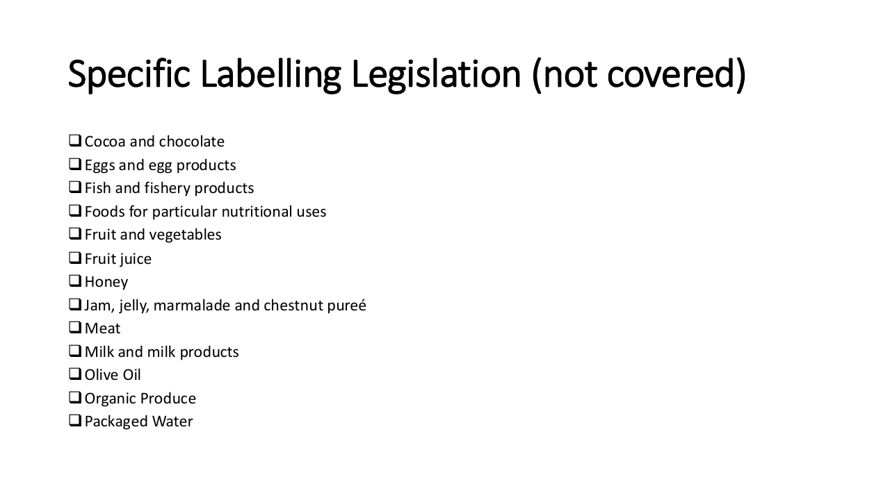

### Specific Labelling Legislation (not covered)

- Cocoa and chocolate
- Eggs and egg products
- Fish and fishery products
- Foods for particular nutritional uses
- Fruit and vegetables
- Fruit juice
- Honey
- Jam, jelly, marmalade and chestnut pureé
- Meat
- Milk and milk products
- Olive Oil
- Organic Produce
- Packaged Water

## Slide 557

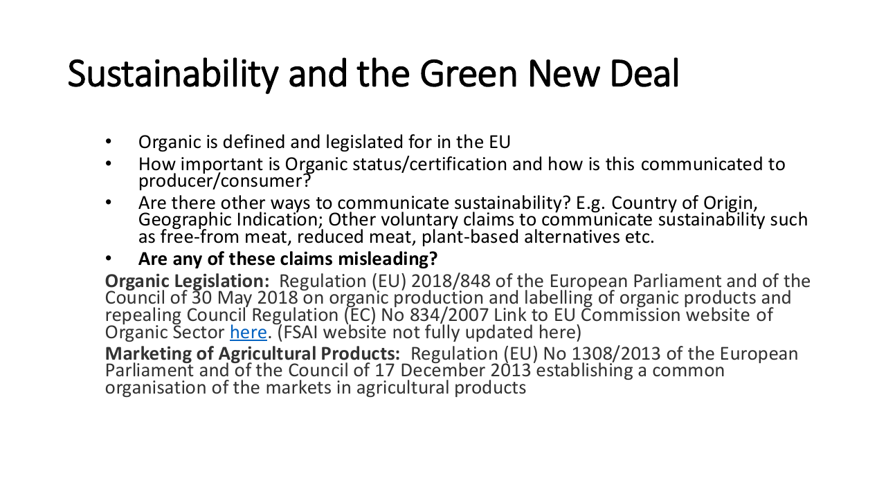

### Sustainability and the Green New Deal

- 

- Organic is defined and legislated for in the EU
- 

How important is Organic status/certification and how is this communicated to
producer/consumer?
Are there other ways to communicate sustainability? E.g. Country of Origin,
Geographic Indication; Other voluntary claims to communicate sustainability such
as free-from meat, reduced meat, plant-based alternatives etc.
Are any of these claims misleading?

- Organic Legislation: Regulation (EU) 2018/848 of the European Parliament and of the Council of 30 May 2018 on organic production and labelling of organic products and repealing Council Regulation (EC) No 834/2007 Link to EU Commission website of Organic Sector here. (FSAI website not fully updated here) Marketing of Agricultural Products: Regulation (EU) No 1308/2013 of the European Parliament and of the Council of 17 December 2013 establishing a common
- rganisation of the markets in agricultural products

## Slide 558

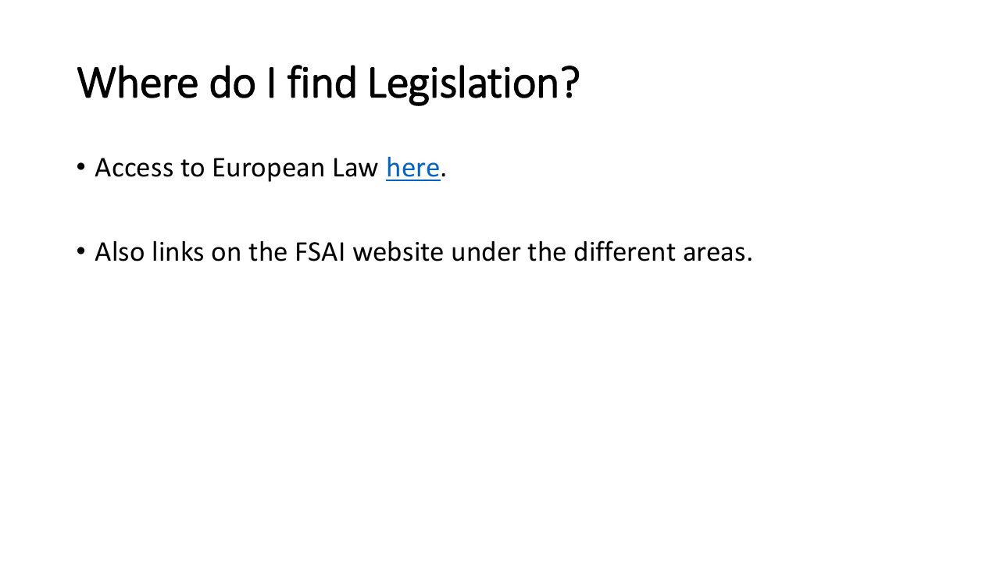

### Where do I find Legislation?

- Access to European Law here.

- Also links on the FSAI website under the different areas.

## Slide 559

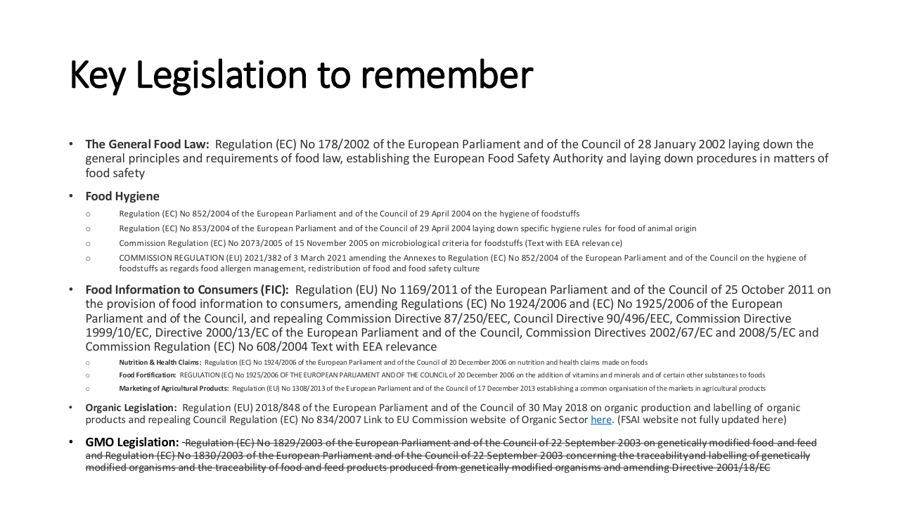

### Key Legislation to remember food safety

- The General Food Law: Regulation (EC) No 178/2002 of the European Parliament and of the Council of 28 January 2002 laying down the

general principles and requirements of food law, establishing the European Food Safety Authority and laying down procedures in matters of

- Food Hygiene

Regulation (EC) No 852/2004 of the European Parliament and of the Council of 29 April 2004 on the hygiene of foodstuffs

Regulation (EC) No 853/2004 of the European Parliament and of the Council of 29 April 2004 laying down specific hygiene rules for food of animal origin

Commission Regulation (EC) No 2073/2005 of 15 November 2005 on microbiological criteria for foodstuffs (Text with EEA relevan ce)

COMMISSION REGULATION (EU) 2021/382 of 3 March 2021 amending the Annexes to Regulation (EC) No 852/2004 of the European Parli ament and of the Council on the hygiene of
foodstuffs as regards food allergen management, redistribution of food and food safety culture

- Food Information to Consumers (FIC): Regulation (EU) No 1169/2011 of the European Parliament and of the Council of 25 October 2011 on

the provision of food information to consumers, amending Regulations (EC) No 1924/2006 and (EC) No 1925/2006 of the European
Parliament and of the Council, and repealing Commission Directive 87/250/EEC, Council Directive 90/496/EEC, Commission Directive
1999/10/EC, Directive 2000/13/EC of the European Parliament and of the Council, Commission Directives 2002/67/EC and 2008/5/EC and
Commission Regulation (EC) No 608/2004 Text with EEA relevance

Nutrition & Health Claims: Regulation (EC) No 1924/2006 of the European Parliament and of the Council of 20 December 2006 on nutrition and health claims made on foods

Food Fortification: REGULATION (EC) No 1925/2006 OF THE EUROPEAN PARLIAMENT AND OF THE COUNCIL of 20 December 2006 on the addition of vitamins an d minerals and of certain other substances to foods

Marketing of Agricultural Products: Regulation (EU) No 1308/2013 of the European Parliament and of the Council of 17 December 2013 establishing a common organisation of the markets in agricultural products

- Organic Legislation: Regulation (EU) 2018/848 of the European Parliament and of the Council of 30 May 2018 on organic production and labelling of  organic products and repealing Council Regulation (EC) No 834/2007 Link to EU Commission website of Organic Sector here. (FSAI website not fully updated here)

- GMO Legislation: Regulation (EC) No 1829/2003 of the European Parliament and of the Council of 22 September 2003 on genetically modified food  and feed and Regulation (EC) No 1830/2003 of the European Parliament and of the Council of 22 September 2003 concerning the traceability and labelling of genetically modified organisms and the traceability of food and feed products produced from genetically modified organisms and amending Directive 2001/18/EC

## Slide 560

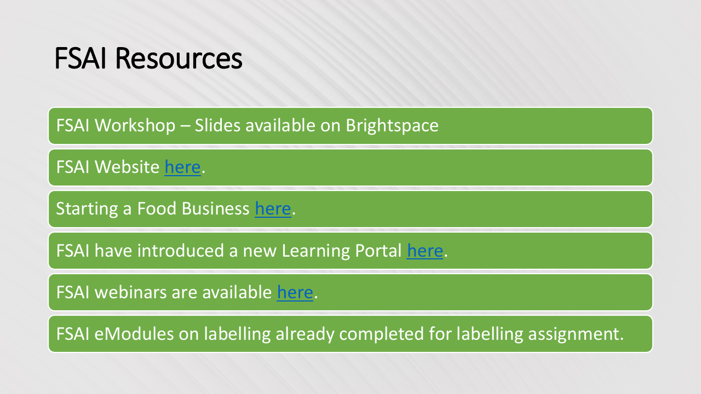

### FSAI Resources here here here here

FSAI Workshop – Slides available on Brightspace

FSAI Website here.

Starting a Food Business here.

FSAI have introduced a new Learning Portal here.

FSAI webinars are available here.

FSAI eModules on labelling already completed for labelling assignment.

## Slide 561

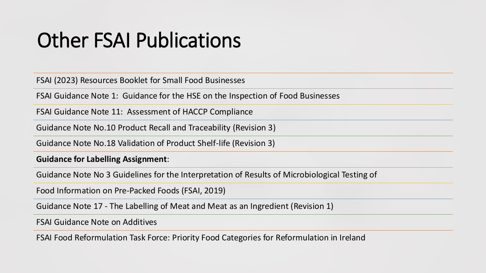

### Other FSAI Publications

FSAI (2023) Resources Booklet for Small Food Businesses

FSAI Guidance Note 1: Guidance for the HSE on the Inspection of Food Businesses

FSAI Guidance Note 11: Assessment of HACCP Compliance

Guidance Note No.10 Product Recall and Traceability (Revision 3)

Guidance Note No.18 Validation of Product Shelf-life (Revision 3)

Guidance for Labelling Assignment:

Guidance Note No 3 Guidelines for the Interpretation of Results of Microbiological Testing of

Food Information on Pre-Packed Foods (FSAI, 2019)

Guidance Note 17 - The Labelling of Meat and Meat as an Ingredient (Revision 1)

FSAI Guidance Note on Additives

FSAI Food Reformulation Task Force: Priority Food Categories for Reformulation in Ireland

## Slide 562

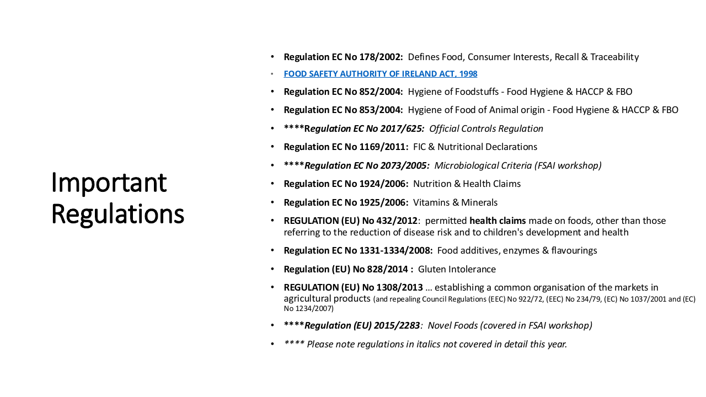

### Important Regulations No 1234/2007)

- Regulation EC No 178/2002: Defines Food, Consumer Interests, Recall & Traceability

- 

FOOD SAFETY AUTHORITY OF IRELAND ACT, 1998

- Regulation EC No 852/2004: Hygiene of Foodstuffs - Food Hygiene & HACCP & FBO

- Regulation EC No 853/2004: Hygiene of Food of Animal origin - Food Hygiene & HACCP & FBO

- ****Regulation EC No 2017/625: Official Controls Regulation

- Regulation EC No 1169/2011: FIC & Nutritional Declarations

- ****Regulation EC No 2073/2005: Microbiological Criteria (FSAI workshop)

- Regulation EC No 1924/2006: Nutrition & Health Claims

- Regulation EC No 1925/2006: Vitamins & Minerals

- REGULATION (EU) No 432/2012: permitted health claims made on foods, other than those

referring to the reduction of disease risk and to children's development and health

- Regulation EC No 1331-1334/2008: Food additives, enzymes & flavourings

- Regulation (EU) No 828/2014 : Gluten Intolerance

- REGULATION (EU) No 1308/2013 … establishing a common organisation of the markets in

agricultural products (and repealing Council Regulations (EEC) No 922/72, (EEC) No 234/79, (EC) No 1037/2001 and (EC)

- ****Regulation (EU) 2015/2283: Novel Foods (covered in FSAI workshop)

- **** Please note regulations in italics not covered in detail this year.

## Slide 563


### Questions

?

## Slide 564


### Thank you

Good luck in your exams!

---
